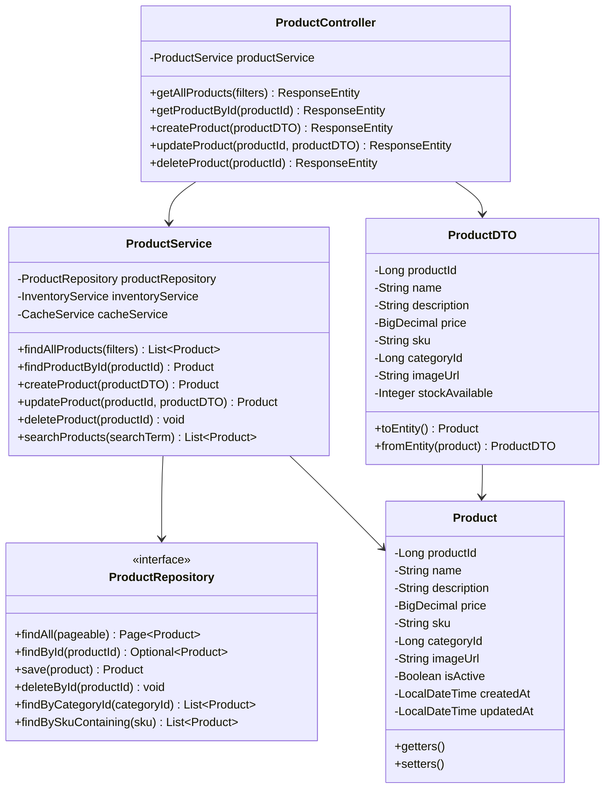
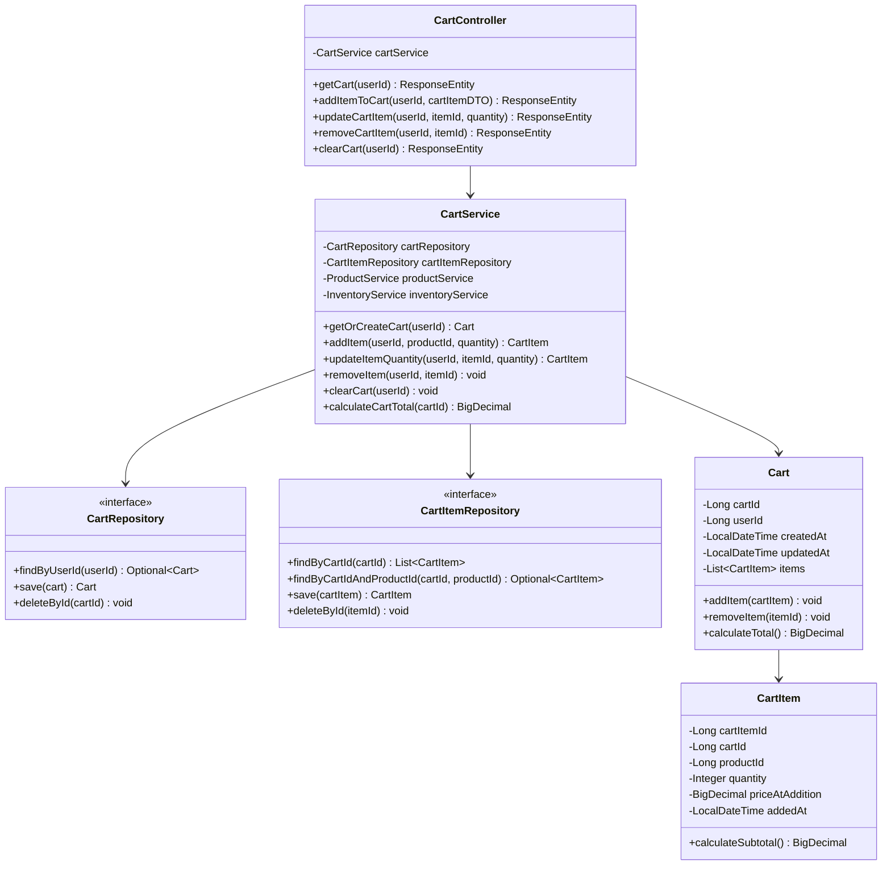
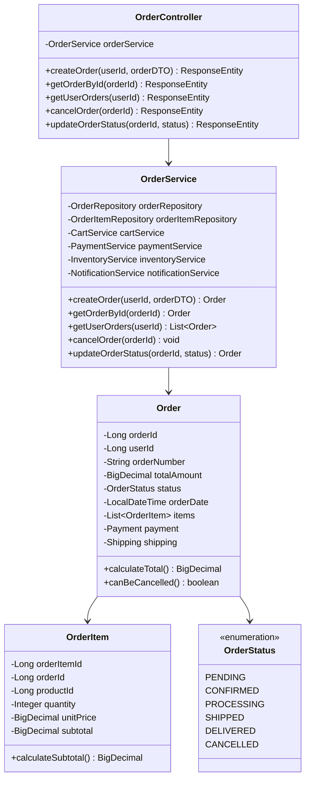
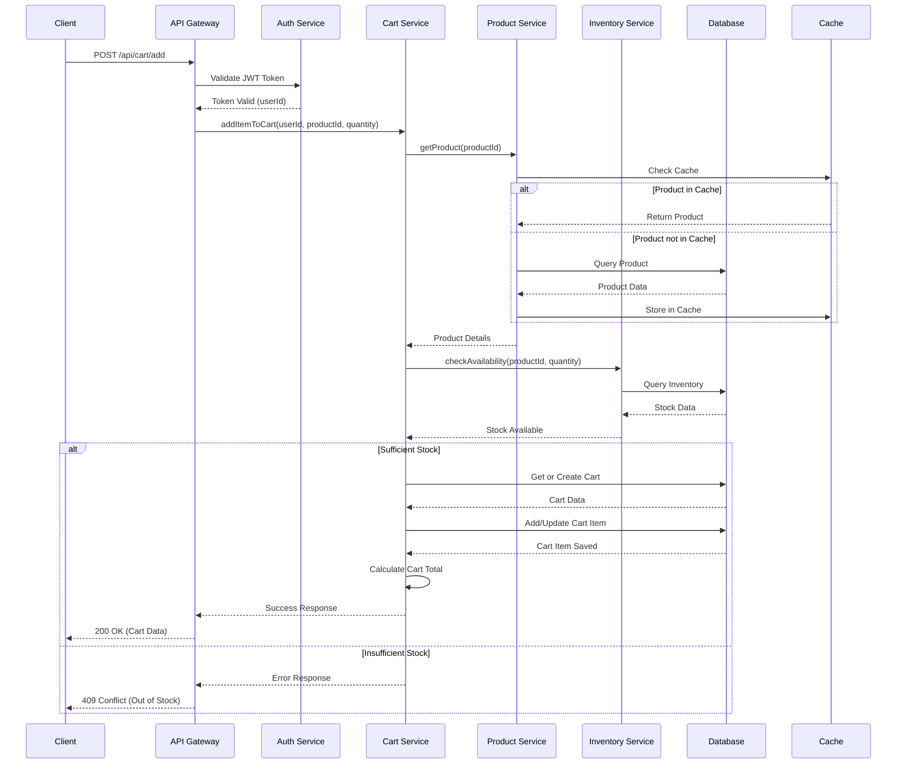
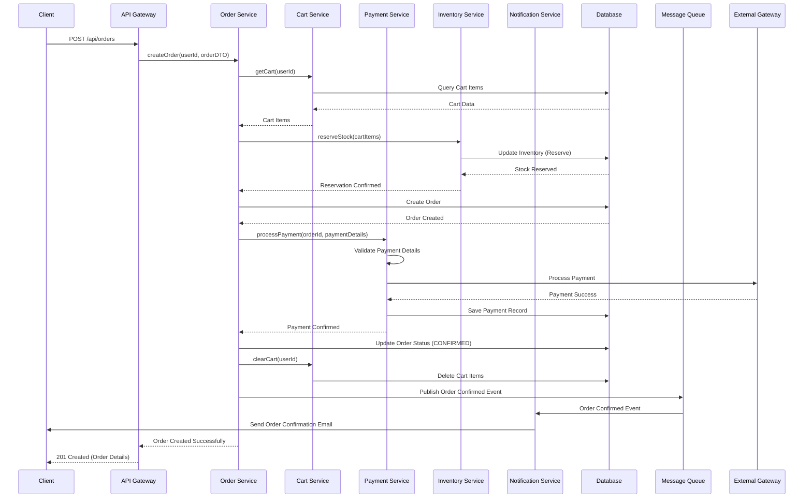
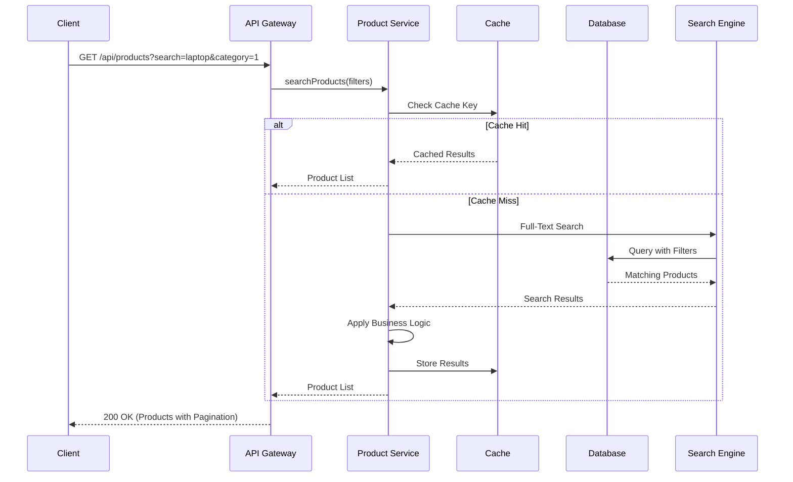

## 5. Class Diagrams

### 5.1 Product Service Classes



### 5.2 Cart Service Classes



### 5.3 Order Service Classes



## 6. Sequence Diagrams

### 6.1 Add Product to Cart Flow



### 6.2 Checkout and Order Creation Flow



### 6.3 Product Search and Filter Flow



## 7. UI Components

### 7.1 Quantity Management Component

**Component Name:** QuantitySelector

**Purpose:** Allows users to adjust item quantities in the shopping cart with increment/decrement controls

**Props:**
- `currentQuantity`: number - Current quantity value
- `minQuantity`: number - Minimum allowed quantity (default: 1)
- `maxQuantity`: number - Maximum allowed quantity (based on stock)
- `onQuantityChange`: function - Callback when quantity changes
- `disabled`: boolean - Disable controls when processing

**Features:**
- Increment (+) and decrement (-) buttons
- Direct numeric input field
- Real-time validation against min/max constraints
- Visual feedback for stock limitations
- Debounced API calls to prevent excessive requests
- Loading state during updates
- Error handling and display

**Example Usage:**
```jsx
<QuantitySelector
  currentQuantity={2}
  minQuantity={1}
  maxQuantity={10}
  onQuantityChange={(newQuantity) => updateCartItem(itemId, newQuantity)}
  disabled={isUpdating}
/>
```

### 7.2 Remove Item Component

**Component Name:** RemoveItemButton

**Purpose:** Provides a user-friendly interface to remove items from the shopping cart

**Props:**
- `itemId`: number - Cart item identifier
- `productName`: string - Product name for confirmation
- `onRemove`: function - Callback when item is removed
- `showConfirmation`: boolean - Whether to show confirmation dialog (default: true)

**Features:**
- Icon-based remove button
- Optional confirmation dialog
- Loading state during removal
- Success/error notifications
- Undo functionality (optional)
- Accessibility support (ARIA labels)

**Example Usage:**
```jsx
<RemoveItemButton
  itemId={5}
  productName="Wireless Mouse"
  onRemove={(itemId) => removeFromCart(itemId)}
  showConfirmation={true}
/>
```

### 7.3 Cart Summary Component

**Component Name:** CartSummary

**Purpose:** Displays cart totals, item count, and checkout actions

**Features:**
- Real-time cart total calculation
- Item count display
- Subtotal, tax, and shipping breakdown
- Discount/coupon code application
- Checkout button with validation
- Empty cart state handling
