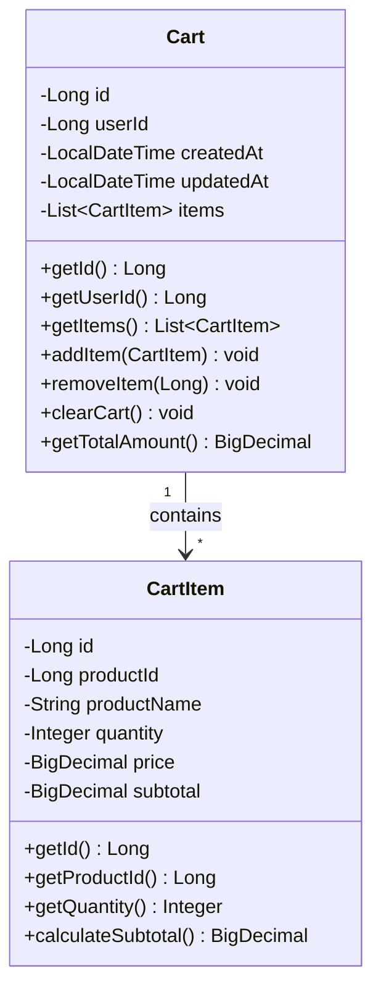

## 4. Shopping Cart Management

### 4.1 Cart Entity



### 4.2 Cart Entity Implementation

```java
package com.ecommerce.cart.entity;

import jakarta.persistence.*;
import lombok.AllArgsConstructor;
import lombok.Builder;
import lombok.Data;
import lombok.NoArgsConstructor;
import java.math.BigDecimal;
import java.time.LocalDateTime;
import java.util.ArrayList;
import java.util.List;

@Entity
@Table(name = "carts")
@Data
@Builder
@NoArgsConstructor
@AllArgsConstructor
public class Cart {
    
    @Id
    @GeneratedValue(strategy = GenerationType.IDENTITY)
    private Long id;
    
    @Column(name = "user_id", nullable = false)
    private Long userId;
    
    @OneToMany(mappedBy = "cart", cascade = CascadeType.ALL, orphanRemoval = true)
    @Builder.Default
    private List<CartItem> items = new ArrayList<>();
    
    @Column(name = "created_at", nullable = false, updatable = false)
    private LocalDateTime createdAt;
    
    @Column(name = "updated_at")
    private LocalDateTime updatedAt;
    
    @PrePersist
    protected void onCreate() {
        createdAt = LocalDateTime.now();
        updatedAt = LocalDateTime.now();
    }
    
    @PreUpdate
    protected void onUpdate() {
        updatedAt = LocalDateTime.now();
    }
    
    public void addItem(CartItem item) {
        items.add(item);
        item.setCart(this);
    }
    
    public void removeItem(CartItem item) {
        items.remove(item);
        item.setCart(null);
    }
    
    public void clearCart() {
        items.clear();
    }
    
    public BigDecimal getTotalAmount() {
        return items.stream()
                .map(CartItem::getSubtotal)
                .reduce(BigDecimal.ZERO, BigDecimal::add);
    }
}

@Entity
@Table(name = "cart_items")
@Data
@Builder
@NoArgsConstructor
@AllArgsConstructor
class CartItem {
    
    @Id
    @GeneratedValue(strategy = GenerationType.IDENTITY)
    private Long id;
    
    @ManyToOne(fetch = FetchType.LAZY)
    @JoinColumn(name = "cart_id", nullable = false)
    private Cart cart;
    
    @Column(name = "product_id", nullable = false)
    private Long productId;
    
    @Column(name = "product_name", nullable = false)
    private String productName;
    
    @Column(nullable = false)
    private Integer quantity;
    
    @Column(nullable = false, precision = 10, scale = 2)
    private BigDecimal price;
    
    @Column(precision = 10, scale = 2)
    private BigDecimal subtotal;
    
    @PrePersist
    @PreUpdate
    protected void calculateSubtotal() {
        this.subtotal = this.price.multiply(BigDecimal.valueOf(this.quantity));
    }
}
```

### 4.3 Cart Service Implementation

```java
package com.ecommerce.cart.service.impl;

import com.ecommerce.cart.dto.AddToCartRequest;
import com.ecommerce.cart.dto.CartResponse;
import com.ecommerce.cart.entity.Cart;
import com.ecommerce.cart.entity.CartItem;
import com.ecommerce.cart.exception.CartNotFoundException;
import com.ecommerce.cart.exception.InsufficientStockException;
import com.ecommerce.cart.mapper.CartMapper;
import com.ecommerce.cart.repository.CartRepository;
import com.ecommerce.cart.service.CartService;
import com.ecommerce.product.entity.Product;
import com.ecommerce.product.repository.ProductRepository;
import com.ecommerce.product.exception.ProductNotFoundException;
import lombok.RequiredArgsConstructor;
import lombok.extern.slf4j.Slf4j;
import org.springframework.cache.annotation.CacheEvict;
import org.springframework.cache.annotation.Cacheable;
import org.springframework.stereotype.Service;
import org.springframework.transaction.annotation.Transactional;

@Service
@RequiredArgsConstructor
@Slf4j
public class CartServiceImpl implements CartService {
    
    private final CartRepository cartRepository;
    private final ProductRepository productRepository;
    private final CartMapper cartMapper;
    
    @Override
    @Transactional
    @CacheEvict(value = "carts", key = "#userId")
    public CartResponse addToCart(Long userId, AddToCartRequest request) {
        log.info("Adding product {} to cart for user {}", request.getProductId(), userId);
        
        Product product = productRepository.findById(request.getProductId())
                .orElseThrow(() -> new ProductNotFoundException("Product not found"));
        
        if (!product.getActive()) {
            throw new IllegalStateException("Product is not active");
        }
        
        if (product.getStockQuantity() < request.getQuantity()) {
            throw new InsufficientStockException("Insufficient stock for product: " + product.getName());
        }
        
        Cart cart = cartRepository.findByUserId(userId)
                .orElseGet(() -> Cart.builder().userId(userId).build());
        
        CartItem existingItem = cart.getItems().stream()
                .filter(item -> item.getProductId().equals(request.getProductId()))
                .findFirst()
                .orElse(null);
        
        if (existingItem != null) {
            existingItem.setQuantity(existingItem.getQuantity() + request.getQuantity());
        } else {
            CartItem newItem = CartItem.builder()
                    .productId(product.getId())
                    .productName(product.getName())
                    .quantity(request.getQuantity())
                    .price(product.getPrice())
                    .build();
            cart.addItem(newItem);
        }
        
        Cart savedCart = cartRepository.save(cart);
        return cartMapper.toResponse(savedCart);
    }
    
    @Override
    @Cacheable(value = "carts", key = "#userId")
    public CartResponse getCart(Long userId) {
        log.info("Fetching cart for user {}", userId);
        Cart cart = cartRepository.findByUserId(userId)
                .orElseThrow(() -> new CartNotFoundException("Cart not found for user: " + userId));
        return cartMapper.toResponse(cart);
    }
    
    @Override
    @Transactional
    @CacheEvict(value = "carts", key = "#userId")
    public CartResponse removeFromCart(Long userId, Long cartItemId) {
        log.info("Removing item {} from cart for user {}", cartItemId, userId);
        Cart cart = cartRepository.findByUserId(userId)
                .orElseThrow(() -> new CartNotFoundException("Cart not found for user: " + userId));
        
        CartItem itemToRemove = cart.getItems().stream()
                .filter(item -> item.getId().equals(cartItemId))
                .findFirst()
                .orElseThrow(() -> new IllegalArgumentException("Cart item not found"));
        
        cart.removeItem(itemToRemove);
        Cart savedCart = cartRepository.save(cart);
        return cartMapper.toResponse(savedCart);
    }
    
    @Override
    @Transactional
    @CacheEvict(value = "carts", key = "#userId")
    public void clearCart(Long userId) {
        log.info("Clearing cart for user {}", userId);
        Cart cart = cartRepository.findByUserId(userId)
                .orElseThrow(() -> new CartNotFoundException("Cart not found for user: " + userId));
        
        cart.clearCart();
        cartRepository.save(cart);
    }
    
    @Override
    @Transactional
    public boolean validateCartInventory(Long userId) {
        Cart cart = cartRepository.findByUserId(userId)
                .orElseThrow(() -> new CartNotFoundException("Cart not found for user: " + userId));
        
        for (CartItem item : cart.getItems()) {
            Product product = productRepository.findById(item.getProductId())
                    .orElseThrow(() -> new ProductNotFoundException("Product not found"));
            
            if (!product.getActive() || product.getStockQuantity() < item.getQuantity()) {
                return false;
            }
        }
        return true;
    }
}
```
