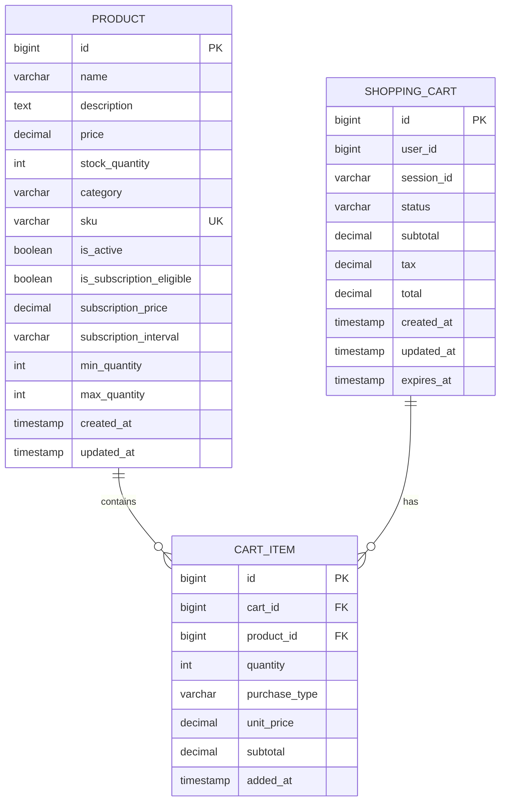

## 4. Data Model

### 4.1 Entity Definitions

#### 4.1.1 Product Entity

```java
@Entity
@Table(name = "products")
@EntityListeners(AuditingEntityListener.class)
public class Product {
    
    @Id
    @GeneratedValue(strategy = GenerationType.IDENTITY)
    private Long id;
    
    @Column(nullable = false, length = 255)
    private String name;
    
    @Column(columnDefinition = "TEXT")
    private String description;
    
    @Column(nullable = false, precision = 10, scale = 2)
    private BigDecimal price;
    
    @Column(nullable = false)
    private Integer stockQuantity;
    
    @Column(length = 100)
    private String category;
    
    @Column(length = 50)
    private String sku;
    
    @Column(nullable = false)
    private Boolean isActive = true;
    
    @Column(nullable = false)
    private Boolean isSubscriptionEligible = false;
    
    @Column(precision = 10, scale = 2)
    private BigDecimal subscriptionPrice;
    
    @Column(length = 50)
    private String subscriptionInterval;
    
    @Column
    private Integer minQuantity;
    
    @Column
    private Integer maxQuantity;
    
    @CreatedDate
    @Column(nullable = false, updatable = false)
    private LocalDateTime createdAt;
    
    @LastModifiedDate
    @Column(nullable = false)
    private LocalDateTime updatedAt;
    
    // Getters and setters
}
```

#### 4.1.2 ShoppingCart Entity

```java
@Entity
@Table(name = "shopping_carts")
@EntityListeners(AuditingEntityListener.class)
public class ShoppingCart {
    
    @Id
    @GeneratedValue(strategy = GenerationType.IDENTITY)
    private Long id;
    
    @Column
    private Long userId;
    
    @Column(length = 255)
    private String sessionId;
    
    @Enumerated(EnumType.STRING)
    @Column(nullable = false, length = 20)
    private CartStatus status;
    
    @Column(precision = 10, scale = 2)
    private BigDecimal subtotal;
    
    @Column(precision = 10, scale = 2)
    private BigDecimal tax;
    
    @Column(precision = 10, scale = 2)
    private BigDecimal total;
    
    @CreatedDate
    @Column(nullable = false, updatable = false)
    private LocalDateTime createdAt;
    
    @LastModifiedDate
    @Column(nullable = false)
    private LocalDateTime updatedAt;
    
    @Column
    private LocalDateTime expiresAt;
    
    @OneToMany(mappedBy = "cartId", cascade = CascadeType.ALL, orphanRemoval = true)
    private List<CartItem> items = new ArrayList<>();
    
    // Getters and setters
}
```

#### 4.1.3 CartItem Entity

```java
@Entity
@Table(name = "cart_items")
@EntityListeners(AuditingEntityListener.class)
public class CartItem {
    
    @Id
    @GeneratedValue(strategy = GenerationType.IDENTITY)
    private Long id;
    
    @Column(nullable = false)
    private Long cartId;
    
    @Column(nullable = false)
    private Long productId;
    
    @Column(nullable = false)
    private Integer quantity;
    
    @Enumerated(EnumType.STRING)
    @Column(nullable = false, length = 20)
    private PurchaseType purchaseType;
    
    @Column(nullable = false, precision = 10, scale = 2)
    private BigDecimal unitPrice;
    
    @Column(nullable = false, precision = 10, scale = 2)
    private BigDecimal subtotal;
    
    @Column(nullable = false)
    private LocalDateTime addedAt;
    
    @ManyToOne(fetch = FetchType.LAZY)
    @JoinColumn(name = "cartId", insertable = false, updatable = false)
    private ShoppingCart cart;
    
    @ManyToOne(fetch = FetchType.LAZY)
    @JoinColumn(name = "productId", insertable = false, updatable = false)
    private Product product;
    
    // Getters and setters
}
```

### 4.2 Database Schema

#### 4.2.1 products Table

```sql
CREATE TABLE products (
    id BIGSERIAL PRIMARY KEY,
    name VARCHAR(255) NOT NULL,
    description TEXT,
    price DECIMAL(10, 2) NOT NULL,
    stock_quantity INTEGER NOT NULL,
    category VARCHAR(100),
    sku VARCHAR(50) UNIQUE,
    is_active BOOLEAN NOT NULL DEFAULT true,
    is_subscription_eligible BOOLEAN NOT NULL DEFAULT false,
    subscription_price DECIMAL(10, 2),
    subscription_interval VARCHAR(50),
    min_quantity INTEGER,
    max_quantity INTEGER,
    created_at TIMESTAMP NOT NULL DEFAULT CURRENT_TIMESTAMP,
    updated_at TIMESTAMP NOT NULL DEFAULT CURRENT_TIMESTAMP,
    CONSTRAINT chk_price_positive CHECK (price >= 0),
    CONSTRAINT chk_stock_non_negative CHECK (stock_quantity >= 0),
    CONSTRAINT chk_subscription_price CHECK (
        (is_subscription_eligible = false) OR 
        (is_subscription_eligible = true AND subscription_price IS NOT NULL)
    ),
    CONSTRAINT chk_quantity_range CHECK (
        (min_quantity IS NULL OR max_quantity IS NULL) OR 
        (min_quantity <= max_quantity)
    )
);

CREATE INDEX idx_products_category ON products(category);
CREATE INDEX idx_products_sku ON products(sku);
CREATE INDEX idx_products_active ON products(is_active);
CREATE INDEX idx_products_subscription ON products(is_subscription_eligible);
```

#### 4.2.2 shopping_carts Table

```sql
CREATE TABLE shopping_carts (
    id BIGSERIAL PRIMARY KEY,
    user_id BIGINT,
    session_id VARCHAR(255),
    status VARCHAR(20) NOT NULL,
    subtotal DECIMAL(10, 2),
    tax DECIMAL(10, 2),
    total DECIMAL(10, 2),
    created_at TIMESTAMP NOT NULL DEFAULT CURRENT_TIMESTAMP,
    updated_at TIMESTAMP NOT NULL DEFAULT CURRENT_TIMESTAMP,
    expires_at TIMESTAMP,
    CONSTRAINT chk_user_or_session CHECK (
        (user_id IS NOT NULL) OR (session_id IS NOT NULL)
    ),
    CONSTRAINT chk_cart_status CHECK (
        status IN ('ACTIVE', 'ABANDONED', 'CHECKED_OUT', 'CLEARED')
    )
);

CREATE INDEX idx_shopping_carts_user_id ON shopping_carts(user_id);
CREATE INDEX idx_shopping_carts_session_id ON shopping_carts(session_id);
CREATE INDEX idx_shopping_carts_status ON shopping_carts(status);
CREATE INDEX idx_shopping_carts_expires_at ON shopping_carts(expires_at);
```

#### 4.2.3 cart_items Table

```sql
CREATE TABLE cart_items (
    id BIGSERIAL PRIMARY KEY,
    cart_id BIGINT NOT NULL,
    product_id BIGINT NOT NULL,
    quantity INTEGER NOT NULL,
    purchase_type VARCHAR(20) NOT NULL,
    unit_price DECIMAL(10, 2) NOT NULL,
    subtotal DECIMAL(10, 2) NOT NULL,
    added_at TIMESTAMP NOT NULL DEFAULT CURRENT_TIMESTAMP,
    CONSTRAINT fk_cart_items_cart FOREIGN KEY (cart_id) 
        REFERENCES shopping_carts(id) ON DELETE CASCADE,
    CONSTRAINT fk_cart_items_product FOREIGN KEY (product_id) 
        REFERENCES products(id) ON DELETE RESTRICT,
    CONSTRAINT chk_quantity_positive CHECK (quantity > 0),
    CONSTRAINT chk_unit_price_positive CHECK (unit_price >= 0),
    CONSTRAINT chk_purchase_type CHECK (
        purchase_type IN ('ONE_TIME', 'SUBSCRIPTION')
    ),
    CONSTRAINT uq_cart_product_type UNIQUE (cart_id, product_id, purchase_type)
);

CREATE INDEX idx_cart_items_cart_id ON cart_items(cart_id);
CREATE INDEX idx_cart_items_product_id ON cart_items(product_id);
CREATE INDEX idx_cart_items_purchase_type ON cart_items(purchase_type);
```

### 4.3 Entity Relationships


```mermaid
erDiagram
    PRODUCT ||--o{ CART_ITEM : contains
    SHOPPING_CART ||--o{ CART_ITEM : has
    
    PRODUCT {
        bigint id PK
        varchar name
        text description
        decimal price
        int stock_quantity
        varchar category
        varchar sku UK
        boolean is_active
        boolean is_subscription_eligible
        decimal subscription_price
        varchar subscription_interval
        int min_quantity
        int max_quantity
        timestamp created_at
        timestamp updated_at
    }
    
    SHOPPING_CART {
        bigint id PK
        bigint user_id
        varchar session_id
        varchar status
        decimal subtotal
        decimal tax
        decimal total
        timestamp created_at
        timestamp updated_at
        timestamp expires_at
    }
    
    CART_ITEM {
        bigint id PK
        bigint cart_id FK
        bigint product_id FK
        int quantity
        varchar purchase_type
        decimal unit_price
        decimal subtotal
        timestamp added_at
    }
```
