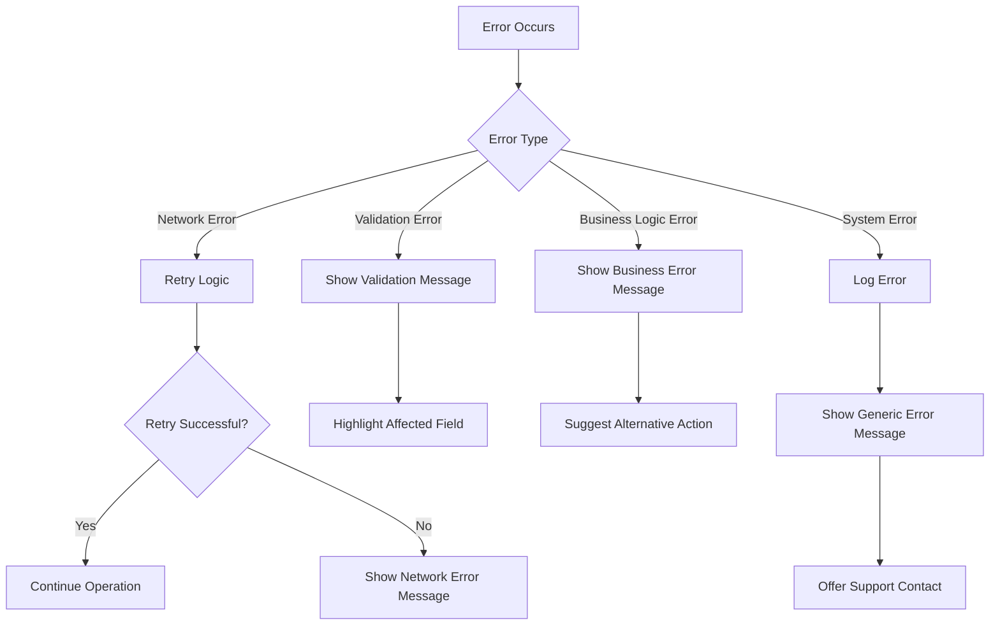
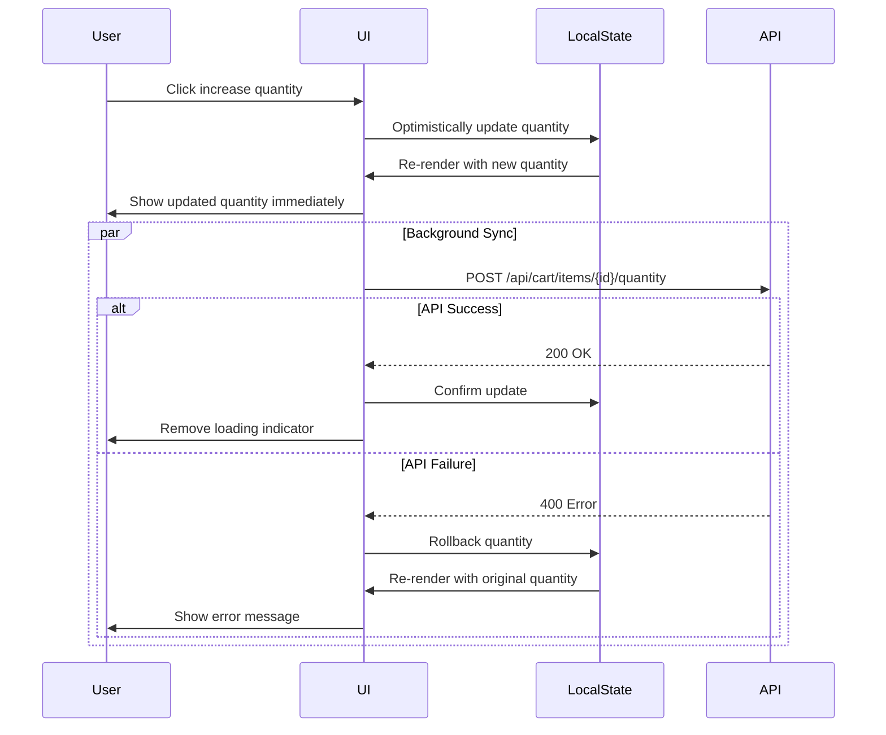
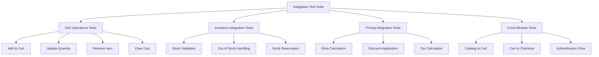

## 17. Error Handling

### 17.1 Comprehensive Error Management

**Requirement Reference:** Knowledge Base: Robust error management with user-friendly messaging

**Error Categories:**

**Network Errors:**
- Connection timeout
- Network unavailable
- Server unreachable
- API endpoint errors

**Validation Errors:**
- Invalid quantity
- Insufficient stock
- Product not available
- Cart limit exceeded

**Business Logic Errors:**
- Pricing calculation errors
- Discount application failures
- Tax calculation errors
- Payment processing errors

**Error Handling Strategy:**

```mermaid
flowchart TD
    A[Error Occurs] --> B{Error Type}
    
    B -->|Network Error| C[Retry Logic]
    C --> D{Retry Successful?}
    D -->|Yes| E[Continue Operation]
    D -->|No| F[Show Network Error Message]
    
    B -->|Validation Error| G[Show Validation Message]
    G --> H[Highlight Affected Field]
    
    B -->|Business Logic Error| I[Show Business Error Message]
    I --> J[Suggest Alternative Action]
    
    B -->|System Error| K[Log Error]
    K --> L[Show Generic Error Message]
    L --> M[Offer Support Contact]
```

**User-Friendly Error Messages:**

| Error Type | User Message | Action |
|------------|--------------|--------|
| Network timeout | "Connection lost. Please check your internet and try again." | Retry button |
| Insufficient stock | "Only X items available. Quantity adjusted to maximum." | Auto-adjust quantity |
| Product unavailable | "This product is no longer available." | Remove from cart |
| Price changed | "Price has been updated. Please review before checkout." | Show new price |
| Cart limit exceeded | "Maximum cart limit reached. Please remove items to add more." | Highlight limit |

**Error Recovery:**
- Automatic retry for transient failures
- Rollback optimistic updates on error
- Preserve user input when possible
- Provide clear recovery actions
- Log errors for debugging

## 18. User Experience - Optimistic Updates

### 18.1 Optimistic UI Updates

**Requirement Reference:** Knowledge Base: Immediate UI response with rollback capability

**Optimistic Update Pattern:**

1. **Immediate UI Update:**
   - Update UI instantly on user action
   - Show loading indicator for background sync
   - Disable conflicting actions during sync

2. **Background Synchronization:**
   - Send update request to backend
   - Continue allowing other user interactions
   - Queue multiple updates if needed

3. **Confirmation or Rollback:**
   - On success: Confirm update, remove loading indicator
   - On failure: Rollback UI changes, show error message
   - Handle partial failures gracefully

**Implementation Example:**

```mermaid
sequenceDiagram
    participant User
    participant UI
    participant LocalState
    participant API
    
    User->>UI: Click increase quantity
    UI->>LocalState: Optimistically update quantity
    LocalState->>UI: Re-render with new quantity
    UI->>User: Show updated quantity immediately
    
    par Background Sync
        UI->>API: POST /api/cart/items/{id}/quantity
        
        alt API Success
            API-->>UI: 200 OK
            UI->>LocalState: Confirm update
            UI->>User: Remove loading indicator
        else API Failure
            API-->>UI: 400 Error
            UI->>LocalState: Rollback quantity
            LocalState->>UI: Re-render with original quantity
            UI->>User: Show error message
        end
    end
```

**Optimistic Update Guidelines:**
- Always provide visual feedback during sync
- Implement rollback for all optimistic updates
- Handle race conditions properly
- Prevent conflicting simultaneous updates
- Show clear error messages on rollback

## 19. Integration Testing

### 19.1 End-to-End Testing Strategy

**Requirement Reference:** Epic Summary: End-to-end transparency and control throughout order lifecycle

**Test Scenarios:**

**Cart Operations:**
- Add product to cart
- Update product quantity
- Remove product from cart
- Clear entire cart
- Handle concurrent updates

**Inventory Integration:**
- Validate stock availability
- Handle out-of-stock scenarios
- Test stock reservation
- Verify stock release on cart abandonment

**Pricing Integration:**
- Verify price calculations
- Test discount applications
- Validate tax calculations
- Test promotional code application

**Cross-Module Integration:**
- Product catalog to cart flow
- Cart to checkout flow
- User authentication integration
- Payment gateway integration

**Testing Tools:**
- Cypress for E2E testing
- Jest for unit testing
- React Testing Library for component testing
- Postman for API testing
- Mock Service Worker for API mocking

### 19.2 Integration Test Cases

```mermaid
flowchart TD
    A[Integration Test Suite] --> B[Cart Operations Tests]
    A --> C[Inventory Integration Tests]
    A --> D[Pricing Integration Tests]
    A --> E[Cross-Module Tests]
    
    B --> B1[Add to Cart]
    B --> B2[Update Quantity]
    B --> B3[Remove Item]
    B --> B4[Clear Cart]
    
    C --> C1[Stock Validation]
    C --> C2[Out of Stock Handling]
    C --> C3[Stock Reservation]
    
    D --> D1[Price Calculation]
    D --> D2[Discount Application]
    D --> D3[Tax Calculation]
    
    E --> E1[Catalog to Cart]
    E --> E2[Cart to Checkout]
    E --> E3[Authentication Flow]
```

## 20. Quality Assurance Checkpoints

### 20.1 Functional Validation

**Requirement Reference:** Knowledge Base: Functional and technical validation requirements

**Functional Test Checklist:**

✅ **Cart Operations:**
- [ ] Add product to cart with default quantity
- [ ] Add product with minimum procurement threshold
- [ ] Update quantity with +/- buttons
- [ ] Update quantity with direct input
- [ ] Remove single item from cart
- [ ] Clear entire cart
- [ ] Handle empty cart state

✅ **Inventory Validation:**
- [ ] Prevent quantity increase beyond stock
- [ ] Display stock availability warnings
- [ ] Handle out-of-stock products
- [ ] Show appropriate error messages

✅ **Price Calculations:**
- [ ] Correct line item subtotal calculation
- [ ] Accurate cart total calculation
- [ ] Proper tax calculation
- [ ] Discount application accuracy

✅ **Real-time Updates:**
- [ ] Instant UI updates on quantity change
- [ ] Automatic total recalculation
- [ ] Optimistic updates with rollback
- [ ] Proper loading states

### 20.2 Technical Validation

**Technical Test Checklist:**

✅ **Performance:**
- [ ] Page load time < 3 seconds
- [ ] Quantity update response < 200ms
- [ ] API response time < 500ms (p95)
- [ ] No memory leaks
- [ ] Efficient re-renders

✅ **Accessibility:**
- [ ] WCAG 2.1 Level AA compliance
- [ ] Keyboard navigation functional
- [ ] Screen reader compatibility
- [ ] Color contrast ratios met
- [ ] Focus management proper

✅ **Responsive Design:**
- [ ] Mobile layout functional (< 768px)
- [ ] Tablet layout functional (768px-1024px)
- [ ] Desktop layout functional (> 1024px)
- [ ] Touch targets minimum 44px
- [ ] Images responsive

✅ **Cross-Browser:**
- [ ] Chrome compatibility
- [ ] Firefox compatibility
- [ ] Safari compatibility
- [ ] Edge compatibility
- [ ] Consistent behavior across browsers

✅ **Error Handling:**
- [ ] Network errors handled gracefully
- [ ] Validation errors displayed clearly
- [ ] Business logic errors communicated
- [ ] Rollback on optimistic update failures
- [ ] Error logging functional

### 20.3 Security Validation

**Security Checklist:**
- [ ] Input validation on all user inputs
- [ ] XSS prevention measures
- [ ] CSRF protection enabled
- [ ] Secure API communication (HTTPS)
- [ ] Proper authentication/authorization
- [ ] Sensitive data not exposed in client
- [ ] Rate limiting on API endpoints

---

## 21. Deployment and Monitoring

### 21.1 Deployment Strategy

**Deployment Checklist:**
- [ ] All tests passing
- [ ] Code review completed
- [ ] Performance benchmarks met
- [ ] Accessibility audit passed
- [ ] Security scan completed
- [ ] Documentation updated
- [ ] Rollback plan prepared

### 21.2 Monitoring and Observability

**Monitoring Requirements:**
- Application performance monitoring (APM)
- Error tracking and logging
- User behavior analytics
- API performance metrics
- Infrastructure monitoring
- Alert configuration for critical issues

**Key Metrics to Monitor:**
- Cart abandonment rate
- Average cart value
- Conversion rate from cart to checkout
- API error rates
- Page load times
- User engagement metrics

---

## 22. Conclusion

This Low-Level Design document now encompasses both the Product Management System and the comprehensive Cart Management Module. The cart functionality has been designed with:

- **Robust functional requirements** covering all acceptance criteria
- **Comprehensive API integration** with inventory and pricing services
- **Performance optimization** meeting <3 second load time requirements
- **Full accessibility compliance** with WCAG 2.1 Level AA standards
- **Responsive design** across mobile, tablet, and desktop devices
- **Cross-browser compatibility** for modern browsers
- **Detailed component architecture** with clear responsibilities
- **Efficient state management** with cross-session persistence
- **Comprehensive error handling** with user-friendly messaging
- **Optimistic UI updates** for enhanced user experience
- **Thorough testing strategy** including integration and E2E tests
- **Quality assurance checkpoints** for functional and technical validation

The design ensures seamless integration between product browsing and cart management, providing users with a smooth, accessible, and performant e-commerce experience.