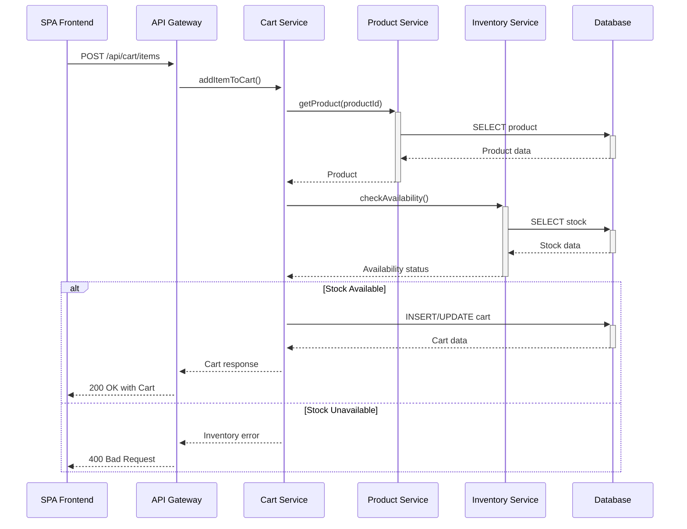
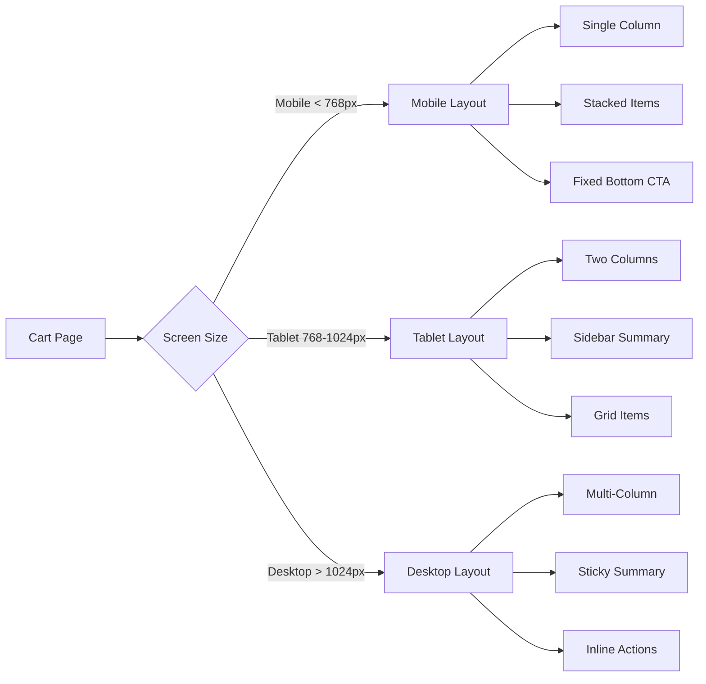
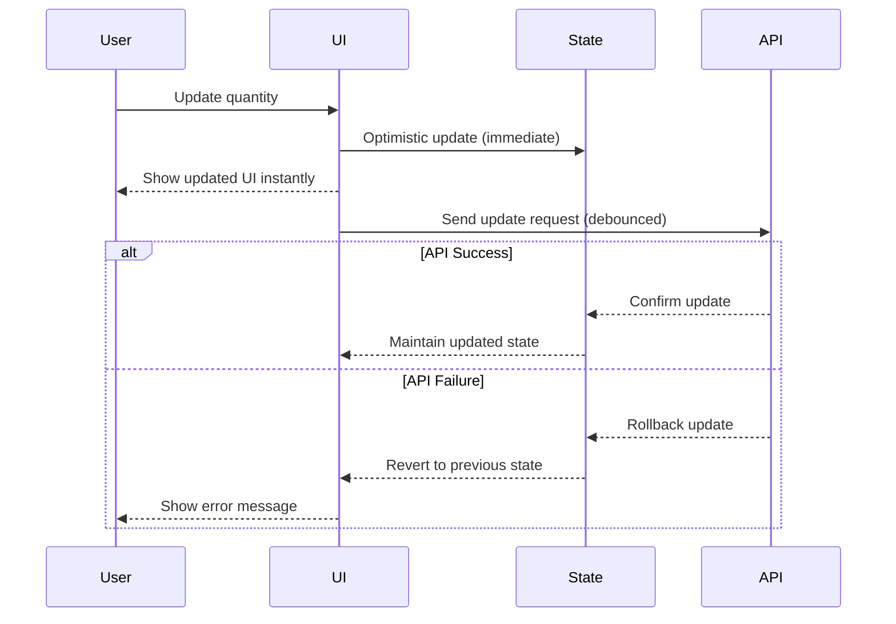
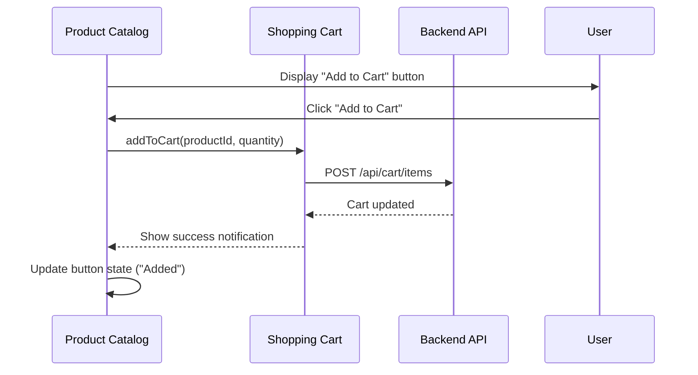
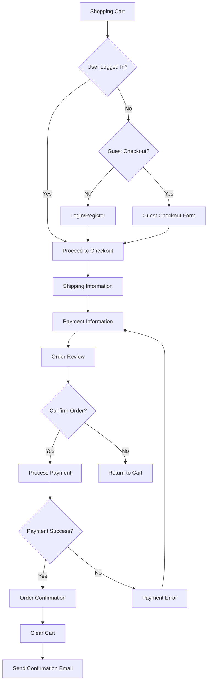

## 11. API Integration Layer

**Requirement Reference:** Story Summary: API integration for cart operations, KB: Backend API endpoints for cart operations

**Description:** Implement comprehensive API endpoints for all cart operations with proper request/response handling, error management, and data validation.

### 11.1 Cart API Endpoints

| Method | Endpoint | Description | Request Body | Response | Status Codes |
|--------|----------|-------------|--------------|----------|-------------|
| GET | `/api/cart` | Get user's cart | None | Cart | 200, 404 |
| POST | `/api/cart/items` | Add item to cart | CartItemRequest | Cart | 200, 400, 404 |
| PUT | `/api/cart/items/{id}` | Update cart item quantity | QuantityUpdateRequest | Cart | 200, 400, 404 |
| DELETE | `/api/cart/items/{id}` | Remove item from cart | None | Cart | 200, 404 |
| DELETE | `/api/cart` | Clear entire cart | None | None | 204 |
| POST | `/api/cart/calculate` | Calculate cart totals | None | CartCalculation | 200 |
| GET | `/api/inventory/check` | Check product availability | productId, quantity (params) | InventoryStatus | 200, 404 |

### 11.2 Request/Response Models

**CartItemRequest:**
```json
{
  "productId": 123,
  "quantity": 1,
  "isSubscription": false
}
```

**QuantityUpdateRequest:**
```json
{
  "quantity": 3
}
```

**Cart Response:**
```json
{
  "id": 1,
  "userId": "user123",
  "items": [
    {
      "id": 1,
      "productId": 123,
      "productName": "Product Name",
      "unitPrice": 29.99,
      "quantity": 2,
      "isSubscription": false,
      "subtotal": 59.98
    }
  ],
  "subtotal": 59.98,
  "tax": 5.40,
  "shipping": 10.00,
  "total": 75.38,
  "createdAt": "2024-01-15T10:30:00Z",
  "updatedAt": "2024-01-15T11:45:00Z"
}
```

**CartCalculation Response:**
```json
{
  "subtotal": 59.98,
  "taxRate": 0.09,
  "taxAmount": 5.40,
  "shippingCost": 10.00,
  "discount": 0.00,
  "total": 75.38
}
```

**InventoryStatus Response:**
```json
{
  "productId": 123,
  "available": true,
  "availableStock": 50,
  "requestedQuantity": 2
}
```

### 11.3 API Integration Flow


```mermaid
sequenceDiagram
    participant SPA as SPA Frontend
    participant API as API Gateway
    participant Cart as Cart Service
    participant Product as Product Service
    participant Inventory as Inventory Service
    participant DB as Database
    
    SPA->>+API: POST /api/cart/items
    API->>+Cart: addItemToCart()
    Cart->>+Product: getProduct(productId)
    Product->>+DB: SELECT product
    DB-->>-Product: Product data
    Product-->>-Cart: Product
    
    Cart->>+Inventory: checkAvailability()
    Inventory->>+DB: SELECT stock
    DB-->>-Inventory: Stock data
    Inventory-->>-Cart: Availability status
    
    alt Stock Available
        Cart->>+DB: INSERT/UPDATE cart
        DB-->>-Cart: Cart data
        Cart-->>API: Cart response
        API-->>SPA: 200 OK with Cart
    else Stock Unavailable
        Cart-->>API: Inventory error
        API-->>SPA: 400 Bad Request
    end
```

## 12. Design Requirements - Responsive Design

**Requirement Reference:** KB: Responsive design for mobile/tablet/desktop with component specifications

**Description:** Implement responsive design with mobile-first approach, tablet optimization, desktop layout, flexible grid system, and touch-friendly controls.

### 12.1 Responsive Breakpoints

| Device | Breakpoint | Layout |
|--------|------------|--------|
| Mobile | < 768px | Single column, stacked layout |
| Tablet | 768px - 1024px | Two column layout |
| Desktop | > 1024px | Multi-column layout with sidebar |

### 12.2 Mobile-First Design

- **Mobile Layout:**
  - Single column cart item display
  - Full-width product cards
  - Collapsible cost breakdown
  - Fixed bottom checkout button
  - Touch-optimized quantity controls (larger buttons)
  - Swipe-to-delete gesture support

- **Tablet Layout:**
  - Two-column grid for cart items
  - Side-by-side product image and details
  - Sticky cart summary sidebar
  - Larger touch targets

- **Desktop Layout:**
  - Three-column layout (items, summary, recommendations)
  - Hover effects on interactive elements
  - Inline editing capabilities
  - Keyboard shortcuts support

### 12.3 Responsive Component Specifications


```mermaid
flowchart LR
    A[Cart Page] --> B{Screen Size}
    B -->|Mobile < 768px| C[Mobile Layout]
    B -->|Tablet 768-1024px| D[Tablet Layout]
    B -->|Desktop > 1024px| E[Desktop Layout]
    
    C --> F[Single Column]
    C --> G[Stacked Items]
    C --> H[Fixed Bottom CTA]
    
    D --> I[Two Columns]
    D --> J[Sidebar Summary]
    D --> K[Grid Items]
    
    E --> L[Multi-Column]
    E --> M[Sticky Summary]
    E --> N[Inline Actions]
```

### 12.4 Touch-Friendly Controls

- Minimum touch target size: 44x44 pixels
- Adequate spacing between interactive elements (minimum 8px)
- Large, easy-to-tap buttons for quantity adjustment
- Swipe gestures for item removal
- Pull-to-refresh for cart updates
- Haptic feedback on interactions (mobile)

## 13. Performance Requirements

**Requirement Reference:** KB: Performance requirements with <3 seconds page load time, instant UI updates, debounced API calls

**Description:** Implement comprehensive performance optimizations to ensure fast, responsive user experience with minimal latency.

### 13.1 Performance Targets

| Metric | Target | Measurement |
|--------|--------|-------------|
| Initial Page Load | < 3 seconds | Time to Interactive (TTI) |
| API Response Time | < 500ms | Server response time |
| UI Update Latency | < 100ms | Time from action to visual feedback |
| Cart Calculation | < 200ms | Total recalculation time |
| Image Load Time | < 1 second | Lazy-loaded images |

### 13.2 Optimization Strategies

**Frontend Optimizations:**
- Code splitting and lazy loading of routes
- Tree shaking to eliminate unused code
- Minification and compression of assets
- Image optimization (WebP format, responsive images)
- Browser caching with service workers
- Virtual scrolling for large cart lists
- Memoization of expensive calculations

**Backend Optimizations:**
- Database query optimization with proper indexing
- Connection pooling for database connections
- Caching frequently accessed data (Redis)
- Asynchronous processing for non-critical operations
- Database query result caching
- Batch API requests where possible

**API Call Optimization:**
- Debounced API calls for quantity updates (300ms delay)
- Request throttling to prevent excessive calls
- Optimistic UI updates with rollback on error
- Request cancellation for outdated requests
- API response caching with appropriate TTL

### 13.3 Optimistic UI Updates


```mermaid
sequenceDiagram
    participant User
    participant UI
    participant State
    participant API
    
    User->>UI: Update quantity
    UI->>State: Optimistic update (immediate)
    UI-->>User: Show updated UI instantly
    
    UI->>API: Send update request (debounced)
    
    alt API Success
        API-->>State: Confirm update
        State-->>UI: Maintain updated state
    else API Failure
        API-->>State: Rollback update
        State-->>UI: Revert to previous state
        UI-->>User: Show error message
    end
```

### 13.4 Debouncing Implementation

- Quantity input changes debounced by 300ms
- Search queries debounced by 500ms
- Auto-save cart state debounced by 1000ms
- Prevents excessive API calls during rapid user input
- Improves server load and reduces network traffic

## 14. Accessibility Requirements

**Requirement Reference:** KB: WCAG 2.1 Level AA compliance with semantic HTML5, ARIA labels, keyboard navigation

**Description:** Implement comprehensive accessibility features to ensure the shopping cart is usable by all users, including those with disabilities.

### 14.1 WCAG 2.1 Level AA Compliance

**Perceivable:**
- Text alternatives for all non-text content
- Captions and transcripts for multimedia
- Content adaptable to different presentations
- Sufficient color contrast (minimum 4.5:1 for normal text)
- Text resizable up to 200% without loss of functionality

**Operable:**
- All functionality available via keyboard
- Sufficient time for users to read and interact
- No content that causes seizures (no flashing > 3 times per second)
- Clear navigation and wayfinding
- Multiple ways to find content

**Understandable:**
- Readable and understandable text
- Predictable page behavior
- Input assistance and error prevention
- Clear error messages with suggestions

**Robust:**
- Compatible with assistive technologies
- Valid HTML5 markup
- Proper ARIA attributes

### 14.2 Semantic HTML5 Structure

```html
<main role="main" aria-label="Shopping Cart">
  <header>
    <h1>Your Shopping Cart</h1>
  </header>
  
  <section aria-label="Cart Items">
    <table role="table" aria-label="Cart items table">
      <thead>
        <tr>
          <th scope="col">Product</th>
          <th scope="col">Price</th>
          <th scope="col">Quantity</th>
          <th scope="col">Subtotal</th>
          <th scope="col">Actions</th>
        </tr>
      </thead>
      <tbody>
        <!-- Cart items -->
      </tbody>
    </table>
  </section>
  
  <aside aria-label="Cart Summary">
    <h2>Order Summary</h2>
    <!-- Cost breakdown -->
  </aside>
</main>
```

### 14.3 ARIA Labels and Roles

- `role="button"` for clickable elements
- `aria-label` for icon-only buttons
- `aria-live="polite"` for cart total updates
- `aria-describedby` for error messages
- `aria-invalid="true"` for invalid inputs
- `aria-expanded` for collapsible sections
- `role="alert"` for critical error messages

### 14.4 Keyboard Navigation

| Key | Action |
|-----|--------|
| Tab | Navigate between interactive elements |
| Shift + Tab | Navigate backwards |
| Enter / Space | Activate buttons and links |
| Arrow Keys | Navigate within quantity controls |
| Escape | Close modals and dialogs |
| + / - | Increment/decrement quantity (when focused) |

### 14.5 Screen Reader Support

- Descriptive labels for all form inputs
- Announcement of cart updates ("Item added to cart")
- Announcement of quantity changes ("Quantity updated to 3")
- Announcement of item removal ("Item removed from cart")
- Clear indication of current cart total
- Error announcements with corrective guidance

### 14.6 Color Contrast Requirements

- Normal text: minimum 4.5:1 contrast ratio
- Large text (18pt+): minimum 3:1 contrast ratio
- Interactive elements: minimum 3:1 contrast ratio
- Error states: use icons in addition to color
- Success states: use icons in addition to color

## 15. Integration Points

### 15.1 Product Catalog Integration

**Requirement Reference:** Epic Summary: Product Discovery & Catalog Management, Story Summary: Product Catalog with Add to Cart buttons

**Description:** Implement seamless integration between product catalog and shopping cart functionality.

**Integration Features:**
- "Add to Cart" button on product listing pages
- "Add to Cart" button on product detail pages
- Quick add functionality with quantity selector
- Product search integration with cart
- Category browsing with add-to-cart capability
- Product recommendations in cart
- Recently viewed products

**Product Catalog API Integration:**


```mermaid
sequenceDiagram
    participant Catalog as Product Catalog
    participant Cart as Shopping Cart
    participant API as Backend API
    
    Catalog->>User: Display "Add to Cart" button
    User->>Catalog: Click "Add to Cart"
    Catalog->>Cart: addToCart(productId, quantity)
    Cart->>API: POST /api/cart/items
    API-->>Cart: Cart updated
    Cart-->>Catalog: Show success notification
    Catalog->>Catalog: Update button state ("Added")
```

**Add to Cart Button States:**
- Default: "Add to Cart"
- Loading: "Adding..." (with spinner)
- Success: "Added to Cart" (with checkmark, temporary)
- In Cart: "View Cart" or "Update Quantity"
- Out of Stock: "Out of Stock" (disabled)

### 15.2 Checkout Workflow Integration

**Requirement Reference:** Epic Summary: Order Processing with secure checkout workflow, Story Summary: Checkout button and form

**Description:** Implement seamless transition from shopping cart to checkout process with proper data transfer and validation.

**Checkout Integration Features:**
- "Proceed to Checkout" button in cart
- Cart data transfer to checkout
- Guest checkout support
- Registered user checkout
- Order summary generation
- Cart locking during checkout
- Cart restoration on checkout abandonment

**Checkout Flow:**


```mermaid
flowchart TD
    A[Shopping Cart] --> B{User Logged In?}
    B -->|Yes| C[Proceed to Checkout]
    B -->|No| D{Guest Checkout?}
    D -->|Yes| E[Guest Checkout Form]
    D -->|No| F[Login/Register]
    F --> C
    E --> C
    
    C --> G[Shipping Information]
    G --> H[Payment Information]
    H --> I[Order Review]
    I --> J{Confirm Order?}
    J -->|Yes| K[Process Payment]
    J -->|No| L[Return to Cart]
    
    K --> M{Payment Success?}
    M -->|Yes| N[Order Confirmation]
    M -->|No| O[Payment Error]
    O --> H
    
    N --> P[Clear Cart]
    P --> Q[Send Confirmation Email]
```

**Cart to Checkout Data Transfer:**

```json
{
  "cartId": 123,
  "userId": "user123",
  "items": [
    {
      "productId": 456,
      "productName": "Product Name",
      "quantity": 2,
      "unitPrice": 29.99,
      "subtotal": 59.98
    }
  ],
  "subtotal": 59.98,
  "tax": 5.40,
  "shipping": 10.00,
  "total": 75.38,
  "shippingAddress": null,
  "billingAddress": null,
  "paymentMethod": null
}
```
