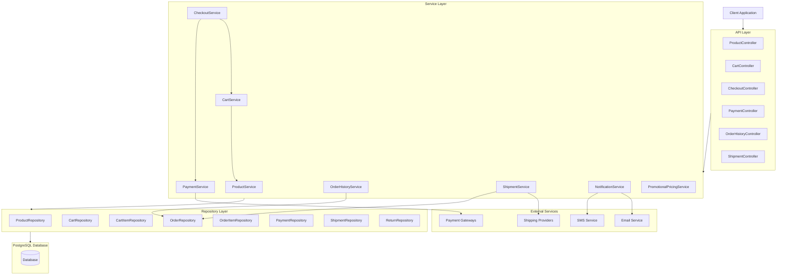
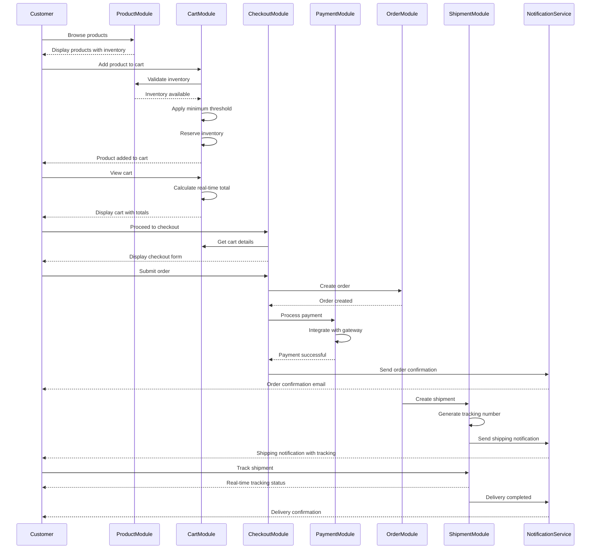

## 5. Database Schema

### 5.1 Products Table

```sql
CREATE TABLE products (
    id BIGINT PRIMARY KEY AUTO_INCREMENT,
    name VARCHAR(255) NOT NULL,
    description TEXT,
    price DECIMAL(10,2) NOT NULL,
    category VARCHAR(100) NOT NULL,
    stock_quantity INTEGER NOT NULL DEFAULT 0,
    minimum_procurement_threshold INTEGER,
    subscription_eligible BOOLEAN DEFAULT false,
    available_stock INTEGER NOT NULL DEFAULT 0,
    created_at TIMESTAMP NOT NULL DEFAULT CURRENT_TIMESTAMP
);

CREATE INDEX idx_products_category ON products(category);
CREATE INDEX idx_products_name ON products(name);
```

### 5.2 Shopping Cart Tables

```sql
CREATE TABLE shopping_cart (
    id BIGINT PRIMARY KEY AUTO_INCREMENT,
    customer_id BIGINT NOT NULL,
    created_at TIMESTAMP NOT NULL DEFAULT CURRENT_TIMESTAMP,
    updated_at TIMESTAMP NOT NULL DEFAULT CURRENT_TIMESTAMP ON UPDATE CURRENT_TIMESTAMP,
    status VARCHAR(50) NOT NULL DEFAULT 'ACTIVE',
    INDEX idx_customer_id (customer_id),
    INDEX idx_status (status)
);

CREATE TABLE cart_items (
    id BIGINT PRIMARY KEY AUTO_INCREMENT,
    cart_id BIGINT NOT NULL,
    product_id BIGINT NOT NULL,
    quantity INTEGER NOT NULL DEFAULT 1,
    unit_price DECIMAL(10,2) NOT NULL,
    subtotal DECIMAL(10,2) NOT NULL,
    subscription_type VARCHAR(20) NOT NULL CHECK (subscription_type IN ('ONE_TIME', 'SUBSCRIPTION')),
    minimum_procurement_threshold INTEGER,
    FOREIGN KEY (cart_id) REFERENCES shopping_cart(id) ON DELETE CASCADE,
    FOREIGN KEY (product_id) REFERENCES products(id),
    INDEX idx_cart_id (cart_id),
    INDEX idx_product_id (product_id)
);
```

### 5.3 Order and Payment Tables

```sql
CREATE TABLE orders (
    id BIGINT PRIMARY KEY AUTO_INCREMENT,
    customer_id BIGINT NOT NULL,
    cart_id BIGINT,
    total_amount DECIMAL(10,2) NOT NULL,
    status VARCHAR(50) NOT NULL,
    created_at TIMESTAMP NOT NULL DEFAULT CURRENT_TIMESTAMP,
    FOREIGN KEY (cart_id) REFERENCES shopping_cart(id),
    INDEX idx_customer_id (customer_id),
    INDEX idx_status (status)
);

CREATE TABLE order_items (
    id BIGINT PRIMARY KEY AUTO_INCREMENT,
    order_id BIGINT NOT NULL,
    product_id BIGINT NOT NULL,
    quantity INTEGER NOT NULL,
    unit_price DECIMAL(10,2) NOT NULL,
    subtotal DECIMAL(10,2) NOT NULL,
    FOREIGN KEY (order_id) REFERENCES orders(id) ON DELETE CASCADE,
    FOREIGN KEY (product_id) REFERENCES products(id),
    INDEX idx_order_id (order_id)
);

CREATE TABLE payments (
    id BIGINT PRIMARY KEY AUTO_INCREMENT,
    order_id BIGINT NOT NULL,
    amount DECIMAL(10,2) NOT NULL,
    payment_method VARCHAR(50) NOT NULL,
    payment_status VARCHAR(50) NOT NULL,
    transaction_id VARCHAR(255),
    created_at TIMESTAMP NOT NULL DEFAULT CURRENT_TIMESTAMP,
    FOREIGN KEY (order_id) REFERENCES orders(id),
    INDEX idx_order_id (order_id),
    INDEX idx_payment_status (payment_status)
);

CREATE TABLE shipments (
    id BIGINT PRIMARY KEY AUTO_INCREMENT,
    order_id BIGINT NOT NULL,
    tracking_number VARCHAR(255),
    carrier VARCHAR(100),
    status VARCHAR(50) NOT NULL,
    shipped_at TIMESTAMP,
    delivered_at TIMESTAMP,
    FOREIGN KEY (order_id) REFERENCES orders(id),
    INDEX idx_order_id (order_id),
    INDEX idx_tracking_number (tracking_number)
);

CREATE TABLE returns (
    id BIGINT PRIMARY KEY AUTO_INCREMENT,
    order_id BIGINT NOT NULL,
    reason TEXT NOT NULL,
    status VARCHAR(50) NOT NULL,
    refund_amount DECIMAL(10,2),
    created_at TIMESTAMP NOT NULL DEFAULT CURRENT_TIMESTAMP,
    FOREIGN KEY (order_id) REFERENCES orders(id),
    INDEX idx_order_id (order_id),
    INDEX idx_status (status)
);
```

## 6. Technology Stack

- **Backend Framework:** Spring Boot 3.x
- **Language:** Java 21
- **Database:** PostgreSQL
- **ORM:** Spring Data JPA / Hibernate
- **Build Tool:** Maven/Gradle
- **API Documentation:** Swagger/OpenAPI 3

## 7. Design Patterns Used

1. **MVC Pattern:** Separation of Controller, Service, and Repository layers
2. **Repository Pattern:** Data access abstraction through ProductRepository
3. **Dependency Injection:** Spring's IoC container manages dependencies
4. **DTO Pattern:** Data Transfer Objects for API requests/responses
5. **Exception Handling:** Custom exceptions for business logic errors

## 8. Key Features

- RESTful API design following HTTP standards
- Proper HTTP status codes for different scenarios
- Input validation and error handling
- Database indexing for performance optimization
- Transactional operations for data consistency
- Pagination support for large datasets (can be extended)
- Search functionality with case-insensitive matching

## 9. Shopping Cart Module Features

### 9.1 Core Cart Functionality

- **Add to Cart:** Support for adding products with automatic minimum procurement threshold application
- **Subscription Support:** Handle both ONE_TIME and SUBSCRIPTION purchase types
- **Real-time Calculation:** Automatic calculation of line item subtotals and cart totals without page refresh
- **Inventory Validation:** Real-time validation against available stock before adding/updating quantities
- **Empty Cart Handling:** User-friendly messaging with link to product catalog when cart is empty

### 9.2 Business Rules Implementation

1. **Minimum Procurement Threshold Logic:**
   - When adding a product, if minimum procurement threshold exists, automatically set quantity to threshold value
   - If no threshold exists, default quantity to 1
   - Applies to both initial add and subsequent quantity updates

2. **Subscription vs One-Time Purchase:**
   - Track subscription type (SUBSCRIPTION or ONE_TIME) for each cart item
   - Apply appropriate pricing and quantity rules based on subscription type

3. **Inventory Management:**
   - Reserve inventory when product is added to cart
   - Release inventory when product is removed from cart
   - Validate available stock before allowing quantity updates
   - Display error message when requested quantity exceeds available stock

4. **Real-time Total Calculation:**
   - Calculate subtotal for each line item: unitPrice × quantity
   - Calculate cart total: sum of all line item subtotals
   - Update totals automatically when quantities change

## 10. Additional Modules Overview

### 10.1 Checkout Module

The Checkout Module handles the order placement process for both guest and registered users:

- **CheckoutController:** REST endpoints for checkout initiation, address management, order review
- **CheckoutService:** Business logic for order creation, cart-to-order conversion, guest checkout handling
- **Order Entity:** Represents completed orders with customer information, total amount, and status
- **OrderItem Entity:** Individual line items within an order

**Key Features:**
- Guest checkout support without registration requirement
- Registered user checkout with saved addresses and payment methods
- Order summary and review before final placement
- Cart-to-order conversion with inventory finalization

### 10.2 Payment Module

The Payment Module integrates multiple payment gateways for secure transaction processing:

- **PaymentController:** REST endpoints for payment initiation, status checking, refund processing
- **PaymentService:** Payment gateway integration, transaction management, payment status tracking
- **Payment Entity:** Payment records with transaction details, status, and gateway information

**Key Features:**
- Multi-payment gateway support (credit card, PayPal, digital wallets)
- Secure payment processing with PCI compliance
- Payment status tracking and webhook handling
- Refund and cancellation support

### 10.3 Order History Module

The Order History Module provides customers with visibility into their past orders:

- **OrderHistoryController:** REST endpoints for retrieving order history, order details, status tracking
- **OrderHistoryService:** Business logic for order retrieval, filtering, and status monitoring

**Key Features:**
- Complete order history with filtering by date, status, and product
- Detailed order view with items, pricing, and shipping information
- Order status visibility (pending, processing, shipped, delivered, cancelled)
- Real-time order status monitoring

### 10.4 Shipment Tracking Module

The Shipment Tracking Module enables customers to track their orders in real-time:

- **ShipmentController:** REST endpoints for tracking number lookup, shipment status, delivery estimates
- **ShipmentService:** Integration with shipping providers, tracking data synchronization
- **Shipment Entity:** Shipment records with tracking numbers, carrier information, and delivery status

**Key Features:**
- Integration with major shipping providers (FedEx, UPS, USPS, DHL)
- Real-time tracking updates via webhook integration
- Delivery status notifications
- Estimated delivery date calculation

### 10.5 Notification Service

The Notification Service handles automated customer communications:

**Key Features:**
- Order confirmation emails upon successful checkout
- Shipping notification with tracking information
- Order status change notifications (shipped, delivered, cancelled)
- Support for both email and SMS channels
- Template-based notification system

### 10.6 Promotional Pricing Engine

The Promotional Pricing Service manages discounts and dynamic pricing:

**Key Features:**
- Product-level promotional pricing
- Cart-level discount application
- Coupon code validation and redemption
- Time-based promotional campaigns
- Tiered pricing based on quantity or customer segment

### 10.7 Order Cancellation Functionality

Order cancellation workflow integrated into OrderService:

**Key Features:**
- Customer-initiated order cancellation (within allowed timeframe)
- Automatic inventory restoration upon cancellation
- Refund processing coordination with Payment Module
- Cancellation status tracking and notification

### 10.8 Returns Management System

Returns management workflow for post-purchase support:

- **ReturnService:** Return request processing, approval workflow, refund coordination
- **Return Entity:** Return records with reason, status, and refund information

**Key Features:**
- Customer return request submission with reason
- Return approval workflow
- Return shipping label generation
- Refund processing upon return receipt
- Return status tracking

## 11. System Integration Architecture


```mermaid
flowchart TB
    Client[Client Application]
    
    subgraph API_Layer[API Layer]
        PC[ProductController]
        CC[CartController]
        CHC[CheckoutController]
        PAC[PaymentController]
        OHC[OrderHistoryController]
        STC[ShipmentController]
    end
    
    subgraph Service_Layer[Service Layer]
        PS[ProductService]
        CS[CartService]
        CHS[CheckoutService]
        PAS[PaymentService]
        OHS[OrderHistoryService]
        STS[ShipmentService]
        NS[NotificationService]
        PPS[PromotionalPricingService]
    end
    
    subgraph Repository_Layer[Repository Layer]
        PR[ProductRepository]
        CR[CartRepository]
        CIR[CartItemRepository]
        OR[OrderRepository]
        OIR[OrderItemRepository]
        PAR[PaymentRepository]
        SR[ShipmentRepository]
        RR[ReturnRepository]
    end
    
    subgraph Database[PostgreSQL Database]
        DB[(Database)]
    end
    
    subgraph External_Services[External Services]
        PG[Payment Gateways]
        SP[Shipping Providers]
        ES[Email Service]
        SMS[SMS Service]
    end
    
    Client --> API_Layer
    API_Layer --> Service_Layer
    Service_Layer --> Repository_Layer
    Repository_Layer --> Database
    
    PAS --> PG
    STS --> SP
    NS --> ES
    NS --> SMS
    
    CS --> PS
    CHS --> CS
    CHS --> PAS
    OHS --> OR
    STS --> OR
```

## 12. Complete E-commerce Workflow


```mermaid
sequenceDiagram
    participant Customer
    participant ProductModule
    participant CartModule
    participant CheckoutModule
    participant PaymentModule
    participant OrderModule
    participant ShipmentModule
    participant NotificationService
    
    Customer->>ProductModule: Browse products
    ProductModule-->>Customer: Display products with inventory
    
    Customer->>CartModule: Add product to cart
    CartModule->>ProductModule: Validate inventory
    ProductModule-->>CartModule: Inventory available
    CartModule->>CartModule: Apply minimum threshold
    CartModule->>CartModule: Reserve inventory
    CartModule-->>Customer: Product added to cart
    
    Customer->>CartModule: View cart
    CartModule->>CartModule: Calculate real-time total
    CartModule-->>Customer: Display cart with totals
    
    Customer->>CheckoutModule: Proceed to checkout
    CheckoutModule->>CartModule: Get cart details
    CheckoutModule-->>Customer: Display checkout form
    
    Customer->>CheckoutModule: Submit order
    CheckoutModule->>OrderModule: Create order
    OrderModule-->>CheckoutModule: Order created
    
    CheckoutModule->>PaymentModule: Process payment
    PaymentModule->>PaymentModule: Integrate with gateway
    PaymentModule-->>CheckoutModule: Payment successful
    
    CheckoutModule->>NotificationService: Send order confirmation
    NotificationService-->>Customer: Order confirmation email
    
    OrderModule->>ShipmentModule: Create shipment
    ShipmentModule->>ShipmentModule: Generate tracking number
    ShipmentModule->>NotificationService: Send shipping notification
    NotificationService-->>Customer: Shipping notification with tracking
    
    Customer->>ShipmentModule: Track shipment
    ShipmentModule-->>Customer: Real-time tracking status
    
    ShipmentModule->>NotificationService: Delivery completed
    NotificationService-->>Customer: Delivery confirmation
```

## 13. Data Models Summary

### 13.1 Core Entities

1. **Product** - Product catalog information with inventory and pricing
2. **ShoppingCart** - Customer shopping cart container
3. **CartItem** - Individual items within a shopping cart
4. **Order** - Completed customer orders
5. **OrderItem** - Line items within an order
6. **Payment** - Payment transaction records
7. **Shipment** - Shipping and tracking information
8. **Return** - Product return requests and processing

### 13.2 Entity Relationships

- One Customer has many ShoppingCarts (active and historical)
- One ShoppingCart contains many CartItems
- One Product can be in many CartItems
- One ShoppingCart converts to one Order
- One Order contains many OrderItems
- One Order has one Payment
- One Order has one Shipment
- One Order may have one Return

## 14. Security Considerations

- **Authentication:** JWT-based authentication for registered users
- **Authorization:** Role-based access control (Customer, Admin)
- **Data Validation:** Input validation at controller and service layers
- **SQL Injection Prevention:** Parameterized queries via JPA
- **Payment Security:** PCI DSS compliance for payment processing
- **Data Encryption:** Sensitive data encryption at rest and in transit

## 15. Performance Optimization

- **Database Indexing:** Strategic indexes on frequently queried columns
- **Caching:** Redis caching for product catalog and cart data
- **Connection Pooling:** HikariCP for database connection management
- **Lazy Loading:** JPA lazy loading for related entities
- **Pagination:** Paginated responses for large datasets
- **Asynchronous Processing:** Async notification sending and external API calls

## 16. Error Handling Strategy

### 16.1 Custom Exceptions

- **ProductNotFoundException** - Product not found by ID
- **InsufficientInventoryException** - Requested quantity exceeds available stock
- **CartItemNotFoundException** - Cart item not found
- **InvalidQuantityException** - Invalid quantity value
- **PaymentFailedException** - Payment processing failure
- **OrderNotFoundException** - Order not found

### 16.2 HTTP Status Codes

- **200 OK** - Successful GET, PUT operations
- **201 Created** - Successful POST operations
- **204 No Content** - Successful DELETE operations
- **400 Bad Request** - Invalid input or business rule violation
- **404 Not Found** - Resource not found
- **409 Conflict** - Inventory conflict or duplicate operation
- **500 Internal Server Error** - Unexpected server errors

## 17. Testing Strategy

- **Unit Tests:** JUnit 5 for service layer business logic
- **Integration Tests:** Spring Boot Test for repository and controller layers
- **API Tests:** RestAssured for REST endpoint testing
- **Mock Testing:** Mockito for dependency mocking
- **Test Coverage:** Minimum 80% code coverage target

## 18. Deployment Architecture

- **Application Server:** Embedded Tomcat (Spring Boot)
- **Database:** PostgreSQL with connection pooling
- **Caching Layer:** Redis for session and data caching
- **Load Balancer:** Nginx for traffic distribution
- **Container:** Docker containerization
- **Orchestration:** Kubernetes for container orchestration
- **CI/CD:** Jenkins/GitLab CI for automated deployment

## 19. Monitoring and Logging

- **Application Logging:** SLF4J with Logback
- **Metrics:** Spring Boot Actuator for health checks and metrics
- **APM:** Application Performance Monitoring (New Relic/Datadog)
- **Error Tracking:** Sentry for error monitoring
- **Log Aggregation:** ELK Stack (Elasticsearch, Logstash, Kibana)

## 20. Future Enhancements

- **Wishlist Functionality:** Save products for later purchase
- **Product Recommendations:** AI-based product recommendation engine
- **Advanced Search:** Elasticsearch integration for advanced search capabilities
- **Multi-currency Support:** International pricing and currency conversion
- **Loyalty Program:** Customer loyalty points and rewards system
- **Social Integration:** Social media login and sharing
- **Mobile App:** Native mobile applications for iOS and Android
- **Analytics Dashboard:** Business intelligence and sales analytics