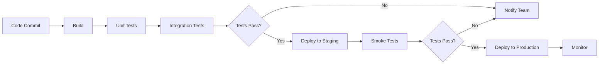

## 10. Monitoring and Logging

### 10.1 Metrics
- Workflow completion rate
- Average task execution time
- Agent utilization percentage
- API response times
- Error rates by endpoint

### 10.2 Logging
- Structured JSON logging
- Log levels: DEBUG, INFO, WARN, ERROR
- Centralized logging with CloudWatch
- Log retention: 30 days

### 10.3 Alerting
- Workflow failure alerts
- High error rate alerts
- Agent offline alerts
- Performance degradation alerts

## 11. Deployment

### 11.1 Environment Configuration

**Development**
```yaml
environment: development
api_url: https://dev-api.aiframework.com
database:
  host: dev-db.aiframework.com
  port: 5432
  name: aiframework_dev
redis:
  host: dev-redis.aiframework.com
  port: 6379
```

**Production**
```yaml
environment: production
api_url: https://api.aiframework.com
database:
  host: prod-db.aiframework.com
  port: 5432
  name: aiframework_prod
redis:
  host: prod-redis.aiframework.com
  port: 6379
```

### 11.2 Deployment Pipeline



### 11.3 Rollback Strategy
- Blue-green deployment
- Automated rollback on health check failure
- Database migration rollback scripts
- Configuration version control

## 12. Testing Strategy

### 12.1 Unit Testing
- Coverage target: 80%
- Framework: pytest
- Mock external dependencies

### 12.2 Integration Testing
- Test agent interactions
- Test external system integrations
- Test database operations

### 12.3 End-to-End Testing
- Complete workflow execution tests
- Multi-agent coordination tests
- Approval workflow tests

## 13. Appendix

### 13.1 Glossary
- **Agent**: Autonomous software component performing specific tasks
- **Workflow**: Orchestrated sequence of tasks
- **HITL**: Human-in-the-Loop approval process
- **RCA**: Root Cause Analysis

### 13.2 References
- AWS S3 Documentation
- Jira REST API Documentation
- TestRail API Documentation
- PostgreSQL Documentation

### 13.3 Version History

| Version | Date | Author | Changes |
|---------|------|--------|------|
| 1.0 | 2024-01-15 | AI Framework Team | Initial AI Framework LLD |

---

**Document Status**: Final  
**Last Updated**: 2024-01-15  
**Next Review**: 2024-04-15