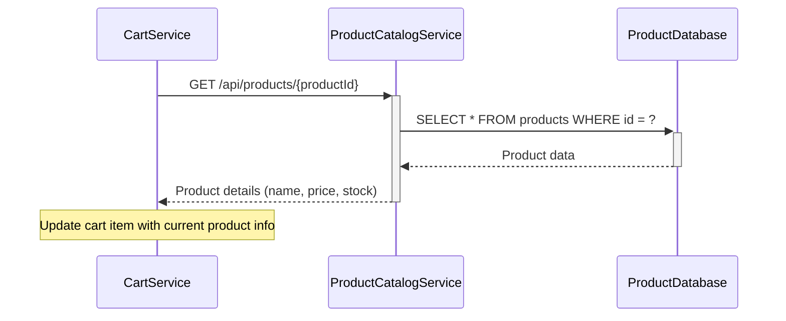
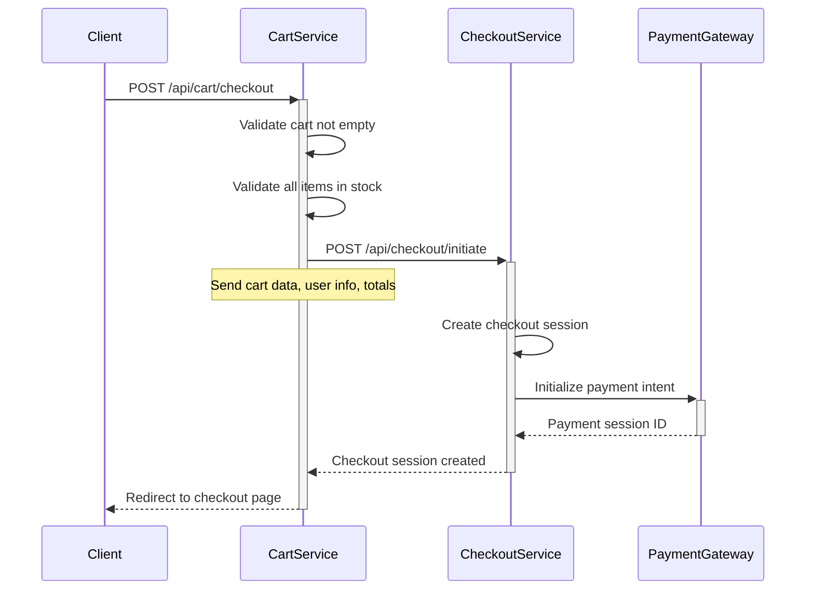
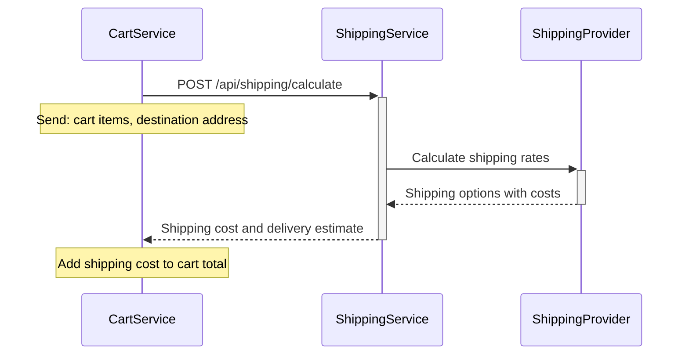
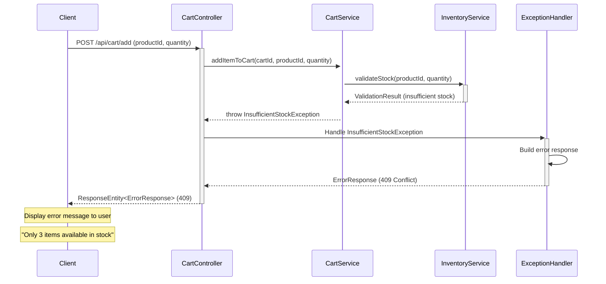

## 16. Shopping Cart Integration Points

**Requirement Reference:** Epic SCRUM-344 - Product Discovery, Payment, Shipping modules

### 16.1 Product Catalog Service Integration

**Purpose:** Retrieve real-time product information for cart items

**Integration Method:** REST API calls

**Endpoints Used:**
- `GET /api/products/{productId}` - Fetch product details
- `GET /api/products/batch` - Fetch multiple products for cart display

**Data Synchronized:**
- Product name
- Current price
- Product availability
- Product images

**Integration Flow:**


### 16.2 Inventory Service Integration

**Purpose:** Validate product availability and stock levels

**Integration Method:** REST API calls with real-time validation

**Endpoints Used:**
- `GET /api/inventory/check/{productId}` - Check stock availability
- `POST /api/inventory/reserve` - Reserve inventory for cart items
- `POST /api/inventory/release` - Release reserved inventory

**Validation Rules:**
- Check stock before adding to cart
- Validate stock before quantity updates
- Reserve inventory during checkout initiation
- Release inventory on cart abandonment or checkout cancellation

**Integration Flow:**


```mermaid
sequenceDiagram
    participant CartService
    participant InventoryService
    participant InventoryDatabase
    
    CartService->>+InventoryService: POST /api/inventory/check
    Note over CartService: Request: {productId: 456, quantity: 2}
    
    InventoryService->>+InventoryDatabase: SELECT stock_quantity FROM inventory WHERE product_id = ?
    InventoryDatabase-->>-InventoryService: stock_quantity: 10
    
    alt Stock Available
        InventoryService-->>CartService: {available: true, stock: 10}
        Note over CartService: Proceed with add to cart
    else Insufficient Stock
        InventoryService-->>CartService: {available: false, stock: 0}
        Note over CartService: Return error to user
    end
```

### 16.3 Checkout Service Integration

**Purpose:** Transition cart to checkout process

**Integration Method:** REST API calls

**Endpoints Used:**
- `POST /api/checkout/initiate` - Start checkout with cart data
- `GET /api/checkout/session/{sessionId}` - Retrieve checkout session

**Data Transferred:**
- Cart ID
- Cart items with quantities and prices
- Cart totals (subtotal, tax, total)
- User information
- Shipping address

**Integration Flow:**


### 16.4 Payment Gateway Integration

**Purpose:** Process payment for cart items during checkout

**Integration Method:** Secure REST API with tokenization

**Payment Flow:**
1. Cart totals calculated and locked
2. Payment intent created with cart total
3. User completes payment
4. Payment confirmation received
5. Order created from cart
6. Cart cleared after successful payment

**Security Measures:**
- PCI DSS compliance
- Tokenized payment information
- HTTPS encryption
- No storage of sensitive payment data

### 16.5 Shipping Service Integration

**Purpose:** Calculate shipping costs and delivery estimates

**Integration Method:** REST API calls

**Endpoints Used:**
- `POST /api/shipping/calculate` - Calculate shipping cost
- `GET /api/shipping/options` - Get available shipping methods

**Data Required:**
- Cart items (for weight/dimensions calculation)
- Shipping address
- Delivery preferences

**Integration Flow:**


## 17. Shopping Cart Error Handling

**Requirement Reference:** Story Summary - inventory validation and visual feedback

### 17.1 Validation Failure Errors

**Product Not Found (404):**
```json
{
  "error": "ProductNotFoundException",
  "message": "Product with ID 456 not found",
  "timestamp": "2024-01-15T10:30:00Z",
  "path": "/api/cart/add"
}
```

**Invalid Quantity (400):**
```json
{
  "error": "InvalidQuantityException",
  "message": "Quantity must be a positive integer",
  "field": "quantity",
  "rejectedValue": -1,
  "timestamp": "2024-01-15T10:30:00Z"
}
```

**Cart Not Found (404):**
```json
{
  "error": "CartNotFoundException",
  "message": "Cart with ID 123 not found",
  "timestamp": "2024-01-15T10:30:00Z",
  "path": "/api/cart/123"
}
```

### 17.2 Out-of-Stock Scenarios

**Insufficient Stock (409 Conflict):**
```json
{
  "error": "InsufficientStockException",
  "message": "Insufficient stock for product 'Wireless Mouse'",
  "productId": 456,
  "productName": "Wireless Mouse",
  "requestedQuantity": 10,
  "availableQuantity": 3,
  "timestamp": "2024-01-15T10:30:00Z"
}
```

**Product Out of Stock (409 Conflict):**
```json
{
  "error": "ProductOutOfStockException",
  "message": "Product 'USB Keyboard' is currently out of stock",
  "productId": 457,
  "productName": "USB Keyboard",
  "availableQuantity": 0,
  "estimatedRestockDate": "2024-01-20",
  "timestamp": "2024-01-15T10:30:00Z"
}
```

### 17.3 System Errors

**Database Connection Error (500):**
```json
{
  "error": "DatabaseConnectionException",
  "message": "Unable to connect to database. Please try again later.",
  "timestamp": "2024-01-15T10:30:00Z",
  "supportReference": "ERR-DB-20240115-103000"
}
```

**Service Unavailable (503):**
```json
{
  "error": "ServiceUnavailableException",
  "message": "Cart service is temporarily unavailable",
  "retryAfter": 60,
  "timestamp": "2024-01-15T10:30:00Z"
}
```

### 17.4 User Feedback Mechanisms

**Success Messages:**
- "Product added to cart successfully"
- "Cart updated successfully"
- "Item removed from cart"

**Warning Messages:**
- "Only X items available in stock"
- "Price has changed since you added this item"
- "This item is low in stock"

**Error Messages:**
- "Unable to add item to cart. Please try again."
- "This product is no longer available"
- "Your session has expired. Please refresh the page."

**Visual Feedback:**
- Loading spinners during cart operations
- Success animations for add to cart
- Error highlights on failed operations
- Real-time cart badge updates

### 17.5 Error Handling Sequence Diagram



## 18. Shopping Cart Security Considerations

**Requirement Reference:** Epic SCRUM-344 - secure payment gateway integration

### 18.1 Authentication Requirements

**User Authentication:**
- JWT token-based authentication for API requests
- Session-based authentication for web interface
- OAuth 2.0 support for third-party authentication

**Cart Access Control:**
- Users can only access their own carts
- Cart ID validation against authenticated user
- Session validation for guest carts

**Authentication Flow:**
```java
@PreAuthorize("hasRole('USER')")
public ResponseEntity<CartResponse> getCart(@PathVariable Long cartId, 
                                            @AuthenticationPrincipal UserDetails user) {
    Cart cart = cartService.getCartById(cartId);
    
    if (!cart.getUserId().equals(user.getId())) {
        throw new UnauthorizedAccessException("You do not have access to this cart");
    }
    
    return ResponseEntity.ok(cartMapper.toResponse(cart));
}
```

### 18.2 Data Validation

**Input Validation Rules:**
- Product ID: Must be positive long integer
- Quantity: Must be positive integer between 1 and 999
- Cart ID: Must be valid existing cart identifier
- Price: Must be positive decimal with max 2 decimal places

**Validation Implementation:**
```java
public class AddToCartRequest {
    @NotNull(message = "Product ID is required")
    @Positive(message = "Product ID must be positive")
    private Long productId;
    
    @NotNull(message = "Quantity is required")
    @Min(value = 1, message = "Quantity must be at least 1")
    @Max(value = 999, message = "Quantity cannot exceed 999")
    private Integer quantity;
    
    // Getters and setters
}
```

### 18.3 Input Sanitization

**SQL Injection Prevention:**
- Use parameterized queries (JPA/Hibernate)
- Never concatenate user input into SQL queries
- Use ORM framework's built-in protection

**XSS Prevention:**
- Sanitize all user-provided text fields
- Encode output in HTML responses
- Use Content Security Policy headers

**Sanitization Example:**
```java
public String sanitizeInput(String input) {
    if (input == null) {
        return null;
    }
    return input.replaceAll("[<>\"']", "")
                .trim();
}
```

### 18.4 Cart Access Control

**Authorization Matrix:**

| Operation | Guest User | Authenticated User | Admin |
|-----------|------------|-------------------|-------|
| View own cart | ✓ (session-based) | ✓ | ✓ |
| Add to cart | ✓ | ✓ | ✓ |
| Update cart | ✓ (own cart) | ✓ (own cart) | ✓ (any cart) |
| Delete cart item | ✓ (own cart) | ✓ (own cart) | ✓ (any cart) |
| View other user's cart | ✗ | ✗ | ✓ |

**Access Control Implementation:**
```java
@Service
public class CartSecurityService {
    
    public boolean canAccessCart(Long cartId, UserDetails user) {
        Cart cart = cartRepository.findById(cartId)
            .orElseThrow(() -> new CartNotFoundException(cartId));
        
        // Admin can access any cart
        if (user.getAuthorities().contains(new SimpleGrantedAuthority("ROLE_ADMIN"))) {
            return true;
        }
        
        // User can only access their own cart
        return cart.getUserId().equals(user.getId());
    }
}
```

### 18.5 Security Best Practices

**HTTPS Enforcement:**
- All cart API endpoints must use HTTPS
- Redirect HTTP requests to HTTPS
- Use HSTS headers

**Rate Limiting:**
- Limit cart operations to prevent abuse
- Maximum 100 requests per minute per user
- Implement exponential backoff for repeated failures

**Session Security:**
- Secure session cookies (HttpOnly, Secure flags)
- Session timeout after 30 minutes of inactivity
- Regenerate session ID after login

**Data Encryption:**
- Encrypt sensitive data at rest
- Use TLS 1.3 for data in transit
- Encrypt database backups

**Audit Logging:**
- Log all cart modifications with user ID and timestamp
- Log failed authentication attempts
- Log suspicious activity patterns
