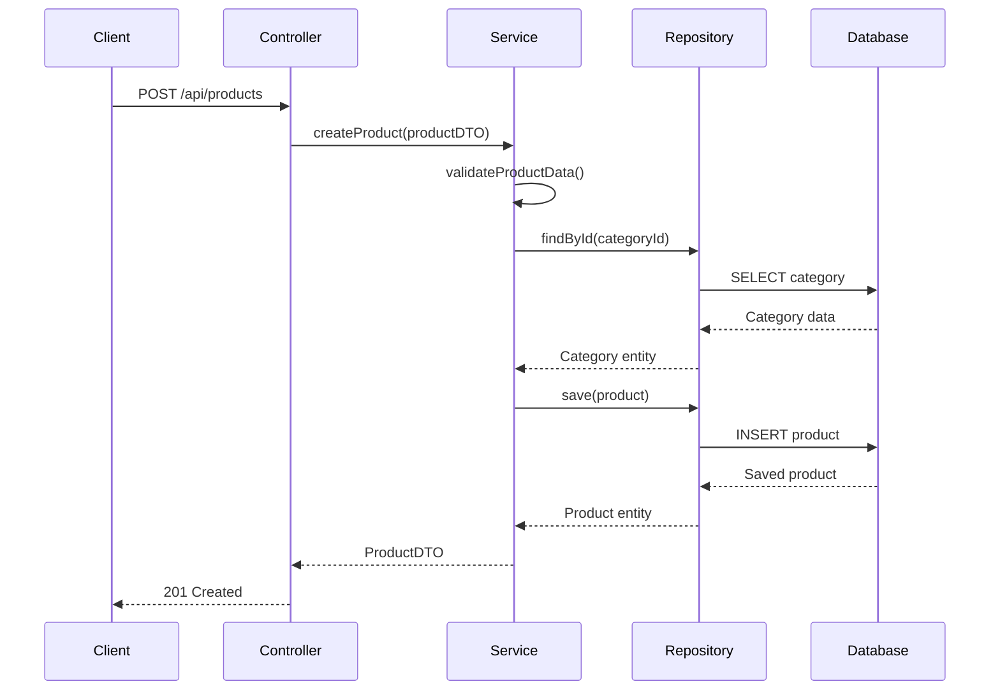
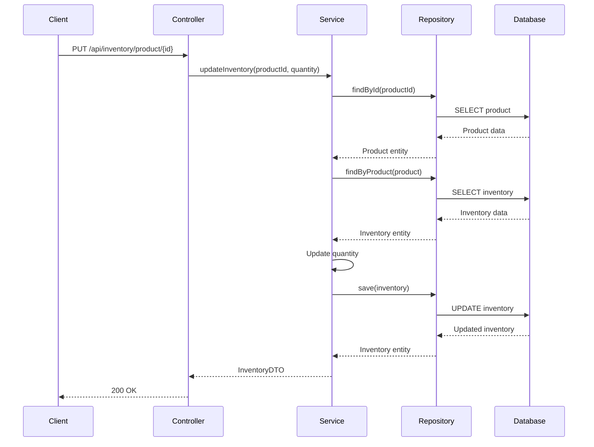
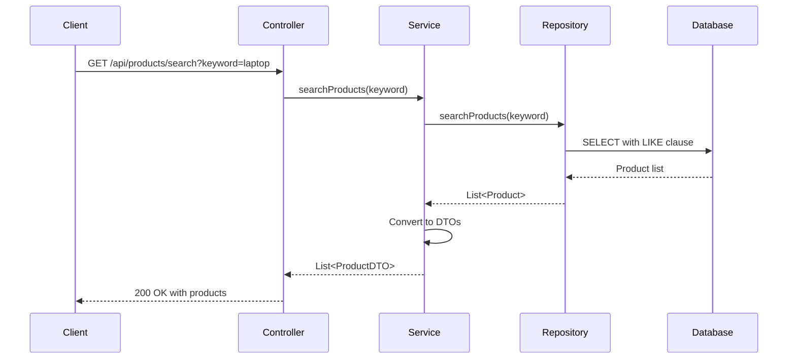
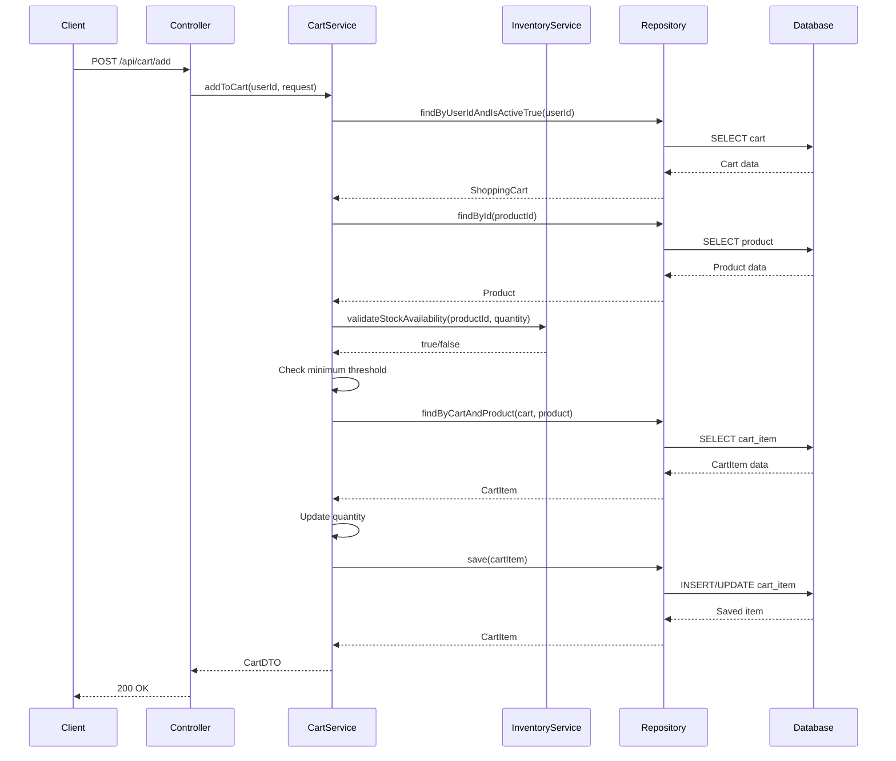
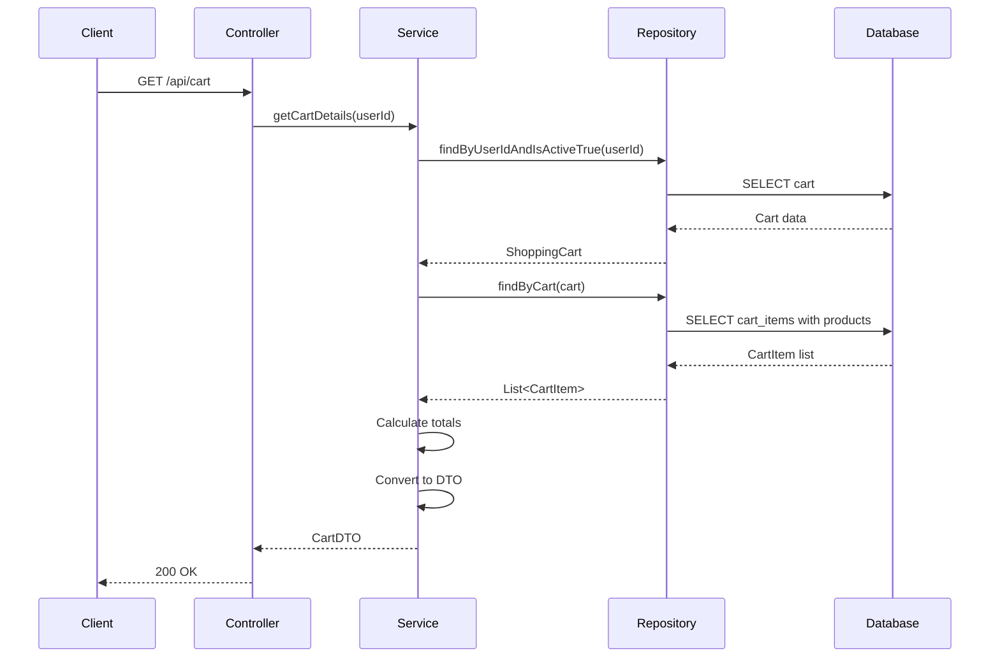
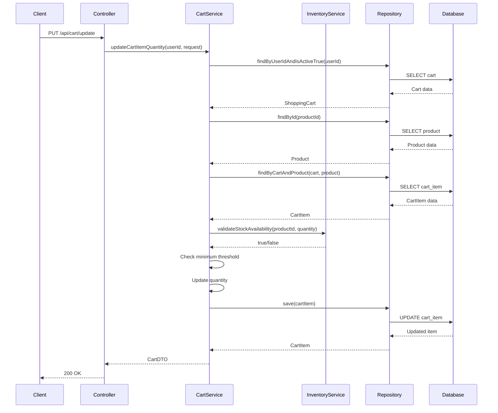
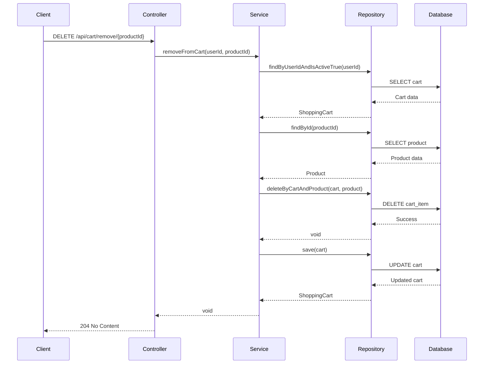
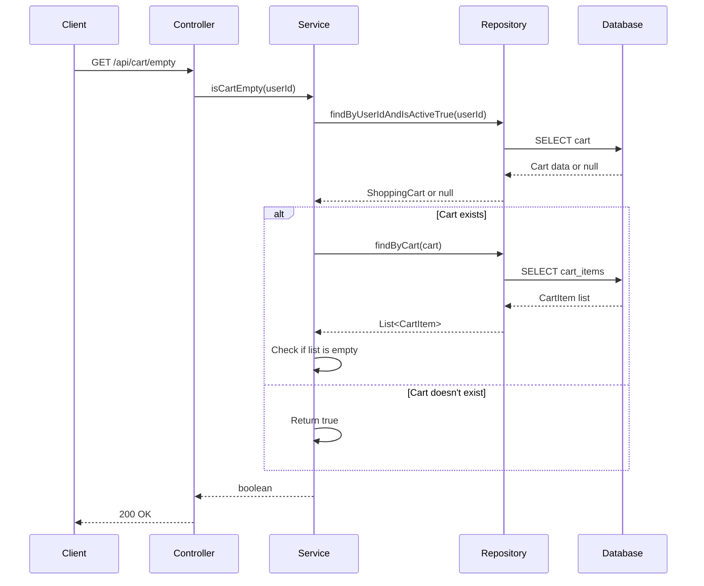
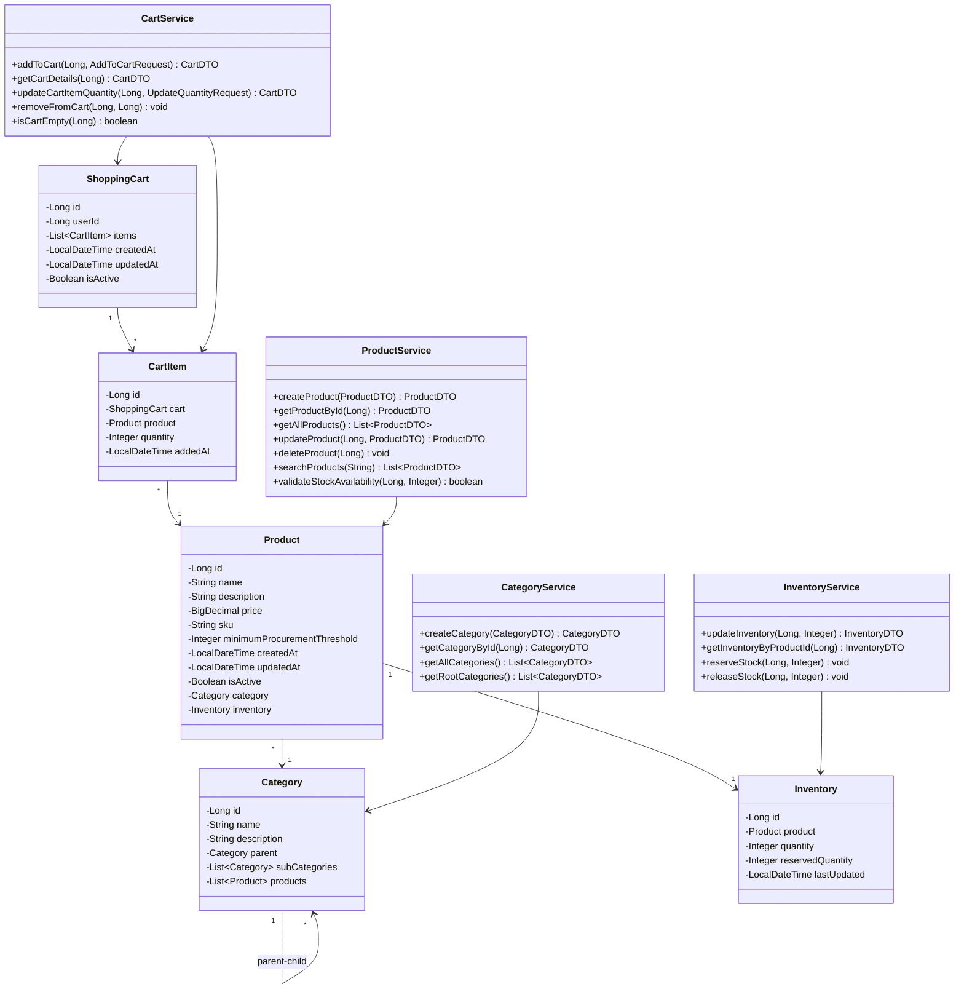

## 11. Sequence Diagrams

### 11.1 Create Product Flow



### 11.2 Update Inventory Flow



### 11.3 Search Products Flow



### 11.4 Add to Cart Flow



### 11.5 Get Cart Details Flow



### 11.6 Update Cart Item Quantity Flow



### 11.7 Remove from Cart Flow



### 11.8 Check Cart Empty Flow



## 12. Class Diagram



## 13. API Endpoints Summary

### 13.1 Product Endpoints
- `POST /api/products` - Create new product
- `GET /api/products/{id}` - Get product by ID
- `GET /api/products` - Get all products
- `PUT /api/products/{id}` - Update product
- `DELETE /api/products/{id}` - Delete product (soft delete)
- `GET /api/products/search?keyword={keyword}` - Search products

### 13.2 Category Endpoints
- `POST /api/categories` - Create new category
- `GET /api/categories/{id}` - Get category by ID
- `GET /api/categories` - Get all categories
- `GET /api/categories/root` - Get root categories

### 13.3 Inventory Endpoints
- `PUT /api/inventory/product/{productId}?quantity={quantity}` - Update inventory
- `GET /api/inventory/product/{productId}` - Get inventory for product
- `POST /api/inventory/reserve/{productId}?quantity={quantity}` - Reserve stock
- `POST /api/inventory/release/{productId}?quantity={quantity}` - Release stock

### 13.4 Cart Endpoints
- `POST /api/cart/add` - Add item to cart
- `GET /api/cart` - Get cart details
- `PUT /api/cart/update` - Update cart item quantity
- `DELETE /api/cart/remove/{productId}` - Remove item from cart
- `GET /api/cart/empty` - Check if cart is empty

## 14. Configuration

### 14.1 Application Properties

```properties
# Server Configuration
server.port=8080
server.servlet.context-path=/

# Database Configuration
spring.datasource.url=jdbc:postgresql://localhost:5432/ecommerce_db
spring.datasource.username=postgres
spring.datasource.password=password
spring.datasource.driver-class-name=org.postgresql.Driver

# JPA Configuration
spring.jpa.hibernate.ddl-auto=validate
spring.jpa.show-sql=true
spring.jpa.properties.hibernate.format_sql=true
spring.jpa.properties.hibernate.dialect=org.hibernate.dialect.PostgreSQLDialect

# Logging Configuration
logging.level.root=INFO
logging.level.com.ecommerce.product=DEBUG
logging.pattern.console=%d{yyyy-MM-dd HH:mm:ss} - %msg%n

# API Documentation
springdoc.api-docs.path=/api-docs
springdoc.swagger-ui.path=/swagger-ui.html
```

## 15. Testing Strategy

### 15.1 Unit Tests
- Test service layer business logic
- Mock repository dependencies
- Validate exception handling
- Test DTO conversions

### 15.2 Integration Tests
- Test controller endpoints
- Validate database operations
- Test transaction management
- Verify API responses

### 15.3 Test Coverage Goals
- Minimum 80% code coverage
- 100% coverage for critical business logic
- All exception scenarios tested

## 16. Security Considerations

### 16.1 Input Validation
- Validate all request parameters
- Use Bean Validation annotations
- Sanitize user inputs

### 16.2 Data Protection
- Use prepared statements (JPA handles this)
- Implement proper error handling
- Don't expose sensitive information in error messages

### 16.3 Authentication & Authorization
- Implement JWT-based authentication (future enhancement)
- Role-based access control
- Secure sensitive endpoints

## 17. Performance Optimization

### 17.1 Database Optimization
- Use appropriate indexes
- Implement pagination for large datasets
- Use lazy loading for relationships
- Optimize queries with JOIN FETCH when needed

### 17.2 Caching Strategy
- Cache frequently accessed data
- Use Spring Cache abstraction
- Implement cache eviction policies

### 17.3 Connection Pooling
- Configure HikariCP connection pool
- Set appropriate pool size
- Monitor connection usage

## 18. Monitoring and Logging

### 18.1 Logging Strategy
- Log all API requests and responses
- Log business logic execution
- Log exceptions with stack traces
- Use appropriate log levels

### 18.2 Metrics
- Track API response times
- Monitor database query performance
- Track error rates
- Monitor resource utilization

## 19. Deployment Considerations

### 19.1 Environment Configuration
- Separate configurations for dev, test, prod
- Use environment variables for sensitive data
- Externalize configuration

### 19.2 Database Migration
- Use Flyway or Liquibase for schema versioning
- Maintain migration scripts
- Test migrations in staging environment

### 19.3 Containerization
- Create Docker image for application
- Use Docker Compose for local development
- Prepare Kubernetes manifests for production

## 20. Future Enhancements

### 20.1 Planned Features
- User authentication and authorization
- Order management system
- Payment integration
- Product reviews and ratings
- Wishlist functionality
- Advanced search with filters
- Real-time inventory updates
- Email notifications
- Analytics and reporting

### 20.2 Scalability Improvements
- Implement caching layer (Redis)
- Add message queue for async processing
- Implement API rate limiting
- Add CDN for static content
- Database read replicas