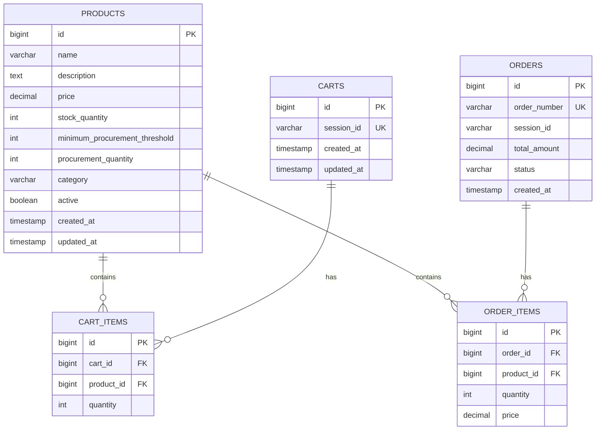

## 11. Repository Layer

### 11.1 ProductRepository

```java
package com.ecommerce.productmanagement.repository;

import com.ecommerce.productmanagement.entity.Product;
import org.springframework.data.domain.Page;
import org.springframework.data.domain.Pageable;
import org.springframework.data.jpa.repository.JpaRepository;
import org.springframework.stereotype.Repository;

import java.util.List;

@Repository
public interface ProductRepository extends JpaRepository<Product, Long> {
    
    Page<Product> findByActiveTrue(Pageable pageable);
    
    List<Product> findByCategoryAndActiveTrue(String category);
    
    List<Product> findByStockQuantityLessThanEqual(Integer threshold);
}
```

### 11.2 CartRepository

```java
package com.ecommerce.productmanagement.repository;

import com.ecommerce.productmanagement.entity.Cart;
import org.springframework.data.jpa.repository.JpaRepository;
import org.springframework.stereotype.Repository;

import java.util.Optional;

@Repository
public interface CartRepository extends JpaRepository<Cart, Long> {
    
    Optional<Cart> findBySessionId(String sessionId);
}
```

### 11.3 CartItemRepository

```java
package com.ecommerce.productmanagement.repository;

import com.ecommerce.productmanagement.entity.CartItem;
import org.springframework.data.jpa.repository.JpaRepository;
import org.springframework.stereotype.Repository;

@Repository
public interface CartItemRepository extends JpaRepository<CartItem, Long> {
}
```

### 11.4 OrderRepository

```java
package com.ecommerce.productmanagement.repository;

import com.ecommerce.productmanagement.entity.Order;
import org.springframework.data.jpa.repository.JpaRepository;
import org.springframework.stereotype.Repository;

import java.util.Optional;

@Repository
public interface OrderRepository extends JpaRepository<Order, Long> {
    
    Optional<Order> findByOrderNumber(String orderNumber);
}
```

## 12. Database Schema

### 12.1 Schema Diagram



### 12.2 DDL Scripts

```sql
-- Products Table
CREATE TABLE products (
    id BIGSERIAL PRIMARY KEY,
    name VARCHAR(255) NOT NULL,
    description TEXT,
    price DECIMAL(10, 2) NOT NULL,
    stock_quantity INTEGER NOT NULL,
    minimum_procurement_threshold INTEGER NOT NULL DEFAULT 10,
    procurement_quantity INTEGER NOT NULL DEFAULT 100,
    category VARCHAR(100),
    active BOOLEAN NOT NULL DEFAULT TRUE,
    created_at TIMESTAMP NOT NULL DEFAULT CURRENT_TIMESTAMP,
    updated_at TIMESTAMP NOT NULL DEFAULT CURRENT_TIMESTAMP
);

-- Carts Table
CREATE TABLE carts (
    id BIGSERIAL PRIMARY KEY,
    session_id VARCHAR(255) NOT NULL UNIQUE,
    created_at TIMESTAMP NOT NULL DEFAULT CURRENT_TIMESTAMP,
    updated_at TIMESTAMP NOT NULL DEFAULT CURRENT_TIMESTAMP
);

-- Cart Items Table
CREATE TABLE cart_items (
    id BIGSERIAL PRIMARY KEY,
    cart_id BIGINT NOT NULL,
    product_id BIGINT NOT NULL,
    quantity INTEGER NOT NULL,
    FOREIGN KEY (cart_id) REFERENCES carts(id) ON DELETE CASCADE,
    FOREIGN KEY (product_id) REFERENCES products(id)
);

-- Orders Table
CREATE TABLE orders (
    id BIGSERIAL PRIMARY KEY,
    order_number VARCHAR(255) NOT NULL UNIQUE,
    session_id VARCHAR(255) NOT NULL,
    total_amount DECIMAL(10, 2) NOT NULL,
    status VARCHAR(50) NOT NULL,
    created_at TIMESTAMP NOT NULL DEFAULT CURRENT_TIMESTAMP
);

-- Order Items Table
CREATE TABLE order_items (
    id BIGSERIAL PRIMARY KEY,
    order_id BIGINT NOT NULL,
    product_id BIGINT NOT NULL,
    quantity INTEGER NOT NULL,
    price DECIMAL(10, 2) NOT NULL,
    FOREIGN KEY (order_id) REFERENCES orders(id) ON DELETE CASCADE,
    FOREIGN KEY (product_id) REFERENCES products(id)
);

-- Indexes
CREATE INDEX idx_products_category ON products(category);
CREATE INDEX idx_products_active ON products(active);
CREATE INDEX idx_products_stock ON products(stock_quantity);
CREATE INDEX idx_carts_session ON carts(session_id);
CREATE INDEX idx_orders_session ON orders(session_id);
CREATE INDEX idx_orders_status ON orders(status);
```

## 13. Accessibility Implementation

### 13.1 WCAG 2.1 Compliance

#### Level A Requirements
- **Keyboard Navigation**: All interactive elements accessible via keyboard
- **Text Alternatives**: Alt text for all images and icons
- **Color Contrast**: Minimum 4.5:1 ratio for normal text, 3:1 for large text
- **Focus Indicators**: Visible focus states for all interactive elements

#### Level AA Requirements
- **Semantic HTML**: Proper use of heading hierarchy (h1-h6)
- **ARIA Labels**: Descriptive labels for screen readers
- **Form Labels**: Explicit labels for all form inputs
- **Error Identification**: Clear error messages with suggestions

### 13.2 Accessibility Features

```html
<!-- Product Card Example -->
<article class="product-card" role="article" aria-labelledby="product-name-123">
  
  <h3 id="product-name-123">Product Name</h3>
  <p aria-label="Price">$99.99</p>
  <p aria-label="Stock status">In Stock: 50 units</p>
  <button 
    aria-label="Add Product Name to cart"
    aria-describedby="stock-status-123">
    Add to Cart
  </button>
  <span id="stock-status-123" class="sr-only">50 units available</span>
</article>

<!-- Cart Summary Example -->
<section aria-labelledby="cart-heading" role="region">
  <h2 id="cart-heading">Shopping Cart</h2>
  <p aria-live="polite" aria-atomic="true">
    You have <span id="cart-count">3</span> items in your cart
  </p>
  <ul role="list" aria-label="Cart items">
    <li role="listitem">
      <!-- Cart item details -->
    </li>
  </ul>
</section>

<!-- Form Accessibility Example -->
<form aria-labelledby="checkout-form">
  <h2 id="checkout-form">Checkout Information</h2>
  <div class="form-group">
    <label for="email">Email Address</label>
    <input 
      type="email" 
      id="email" 
      name="email"
      aria-required="true"
      aria-describedby="email-error"
      aria-invalid="false" />
    <span id="email-error" role="alert" class="error-message"></span>
  </div>
</form>
```

### 13.3 Screen Reader Support

- **Live Regions**: Use `aria-live` for dynamic content updates
- **Status Messages**: Announce cart updates, errors, and confirmations
- **Navigation Landmarks**: Proper use of `<nav>`, `<main>`, `<aside>`, `<footer>`
- **Skip Links**: Allow users to skip repetitive navigation

## 14. Responsive Design Specifications

### 14.1 Breakpoints

```css
/* Mobile First Approach */
/* Extra Small Devices (phones, less than 576px) */
/* Default styles */

/* Small Devices (landscape phones, 576px and up) */
@media (min-width: 576px) { }

/* Medium Devices (tablets, 768px and up) */
@media (min-width: 768px) { }

/* Large Devices (desktops, 992px and up) */
@media (min-width: 992px) { }

/* Extra Large Devices (large desktops, 1200px and up) */
@media (min-width: 1200px) { }

/* Extra Extra Large Devices (larger desktops, 1400px and up) */
@media (min-width: 1400px) { }
```

### 14.2 Layout Specifications

#### Mobile (< 576px)
- Single column layout
- Full-width product cards
- Stacked navigation menu
- Bottom-fixed cart button
- Touch-optimized buttons (min 44x44px)

#### Tablet (576px - 991px)
- Two-column product grid
- Collapsible sidebar filters
- Sticky header navigation
- Floating cart summary

#### Desktop (≥ 992px)
- Three to four column product grid
- Persistent sidebar filters
- Fixed header with mega menu
- Side panel cart drawer

### 14.3 Responsive Components

```css
/* Product Grid */
.product-grid {
  display: grid;
  gap: 1rem;
  grid-template-columns: 1fr; /* Mobile */
}

@media (min-width: 576px) {
  .product-grid {
    grid-template-columns: repeat(2, 1fr); /* Tablet */
  }
}

@media (min-width: 992px) {
  .product-grid {
    grid-template-columns: repeat(3, 1fr); /* Desktop */
  }
}

@media (min-width: 1400px) {
  .product-grid {
    grid-template-columns: repeat(4, 1fr); /* Large Desktop */
  }
}

/* Responsive Typography */
.product-title {
  font-size: 1.25rem; /* Mobile */
}

@media (min-width: 768px) {
  .product-title {
    font-size: 1.5rem; /* Tablet */
  }
}

@media (min-width: 992px) {
  .product-title {
    font-size: 1.75rem; /* Desktop */
  }
}
```

## 15. Error Handling UI

### 15.1 Error Display Patterns

#### Inline Field Errors
```html
<div class="form-group" data-error="true">
  <label for="quantity">Quantity</label>
  <input 
    type="number" 
    id="quantity" 
    class="form-control error"
    aria-invalid="true"
    aria-describedby="quantity-error" />
  <span id="quantity-error" class="error-message" role="alert">
    <i class="icon-error" aria-hidden="true"></i>
    Quantity must be between 1 and 50
  </span>
</div>
```

#### Toast Notifications
```javascript
// Success Toast
showToast({
  type: 'success',
  message: 'Product added to cart successfully',
  duration: 3000,
  position: 'top-right'
});

// Error Toast
showToast({
  type: 'error',
  message: 'Insufficient stock available',
  duration: 5000,
  position: 'top-right',
  action: {
    label: 'View Details',
    callback: () => showStockDetails()
  }
});

// Warning Toast
showToast({
  type: 'warning',
  message: 'Only 3 items left in stock',
  duration: 4000,
  position: 'top-right'
});
```

#### Modal Error Dialogs
```html
<div class="modal error-modal" role="dialog" aria-labelledby="error-title">
  <div class="modal-content">
    <div class="modal-header">
      <h2 id="error-title">Unable to Complete Order</h2>
      <button class="close-btn" aria-label="Close dialog">×</button>
    </div>
    <div class="modal-body">
      <div class="error-icon">
        <i class="icon-alert-circle" aria-hidden="true"></i>
      </div>
      <p class="error-message">
        Some items in your cart are no longer available at the requested quantity.
      </p>
      <ul class="error-details">
        <li>Product A: Only 2 available (you requested 5)</li>
        <li>Product B: Out of stock</li>
      </ul>
      <p class="error-suggestion">
        Please update your cart quantities or remove unavailable items.
      </p>
    </div>
    <div class="modal-footer">
      <button class="btn btn-secondary" onclick="closeModal()">Cancel</button>
      <button class="btn btn-primary" onclick="updateCart()">Update Cart</button>
    </div>
  </div>
</div>
```

### 15.2 Error States

#### Loading State
```html
<button class="btn btn-primary" disabled>
  <span class="spinner" aria-hidden="true"></span>
  <span>Processing...</span>
</button>
```

#### Empty State
```html
<div class="empty-state" role="status">
  
  <h3>Your cart is empty</h3>
  <p>Add some products to get started</p>
  <a href="/products" class="btn btn-primary">Browse Products</a>
</div>
```

#### Network Error State
```html
<div class="error-state" role="alert">
  <i class="icon-wifi-off" aria-hidden="true"></i>
  <h3>Connection Lost</h3>
  <p>Please check your internet connection and try again</p>
  <button class="btn btn-primary" onclick="retryConnection()">
    Retry
  </button>
</div>
```
