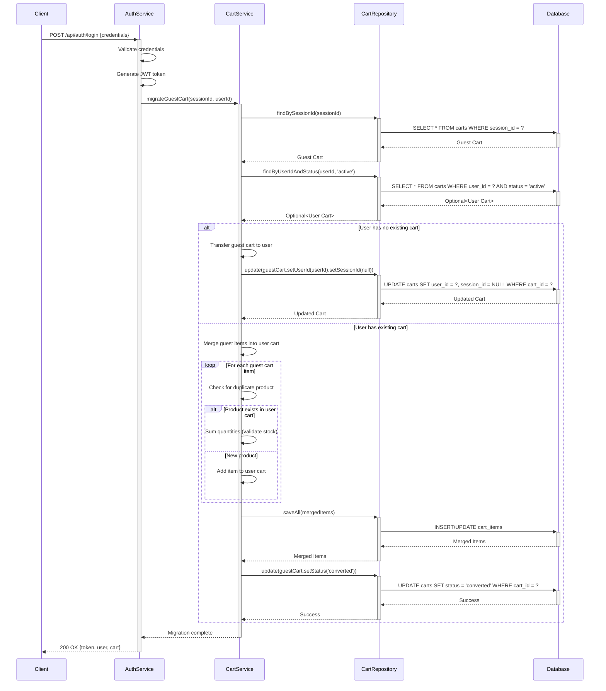

## 10. Error Handling and Validation

**Requirement Reference:** Epic SCRUM-344: shopping cart management, Story SCRUM-343: all acceptance criteria

### 10.1 Input Validation Rules

#### Product Validation
- **product_id:** 
  - Type: Long (BIGINT)
  - Required: true
  - Validation: Must exist in products table
  - Error Code: `INVALID_PRODUCT`
  - Error Message: "Product not found or invalid product ID"

#### Quantity Validation
- **quantity:**
  - Type: Integer
  - Required: true
  - Range: 1-99
  - Validation: Must not exceed available stock
  - Error Code: `INVALID_QUANTITY` or `INSUFFICIENT_STOCK`
  - Error Messages:
    - "Quantity must be between 1 and 99"
    - "Requested quantity exceeds available stock (available: {stock})"

#### Cart Item Validation
- **Duplicate Item Check:**
  - Validation: Product already in cart
  - Behavior: Increment existing quantity instead of creating duplicate
  - Error Code: `DUPLICATE_ITEM` (if increment would exceed stock)
  - Error Message: "Product already in cart. Quantity updated."

### 10.2 Error Codes and Responses

#### Standard Error Response Format
```json
{
  "error": "ERROR_CODE",
  "message": "Human-readable error message",
  "field": "fieldName",
  "timestamp": "2024-01-15T10:30:00Z",
  "path": "/api/v1/cart/items",
  "additionalInfo": {}
}
```

#### Error Code Catalog

| Error Code | HTTP Status | Description | Resolution |
|------------|-------------|-------------|------------|
| `INVALID_PRODUCT` | 404 | Product ID does not exist | Verify product ID is correct |
| `INVALID_QUANTITY` | 400 | Quantity outside valid range (1-99) | Adjust quantity to valid range |
| `INSUFFICIENT_STOCK` | 409 | Requested quantity exceeds available stock | Reduce quantity or check back later |
| `DUPLICATE_ITEM` | 409 | Product already exists in cart | Update existing item quantity |
| `CART_NOT_FOUND` | 404 | Cart does not exist for user/session | Create new cart or verify session |
| `CART_ITEM_NOT_FOUND` | 404 | Cart item does not exist | Verify item ID is correct |
| `UNAUTHORIZED` | 401 | Missing or invalid authentication | Login or refresh authentication token |
| `FORBIDDEN` | 403 | User does not own this cart/item | Verify cart ownership |
| `RATE_LIMIT_EXCEEDED` | 429 | Too many requests | Wait before retrying (Retry-After header) |
| `VALIDATION_ERROR` | 400 | Request body validation failed | Check request format and required fields |
| `INTERNAL_SERVER_ERROR` | 500 | Unexpected server error | Contact support with error ID |

### 10.3 Validation Implementation

#### Request Body Validation (Jakarta Bean Validation)
```java
public class AddToCartRequest {
    @NotNull(message = "Product ID is required")
    @Positive(message = "Product ID must be positive")
    private Long productId;
    
    @NotNull(message = "Quantity is required")
    @Min(value = 1, message = "Quantity must be at least 1")
    @Max(value = 99, message = "Quantity cannot exceed 99")
    private Integer quantity;
}
```

#### Business Logic Validation
- **Stock Availability:** Real-time check against `products.stock_quantity`
- **Product Existence:** Verify product exists and is active
- **Cart Ownership:** Ensure user can only modify their own cart
- **Price Validation:** Verify unit_price matches current product price

**Description:** Comprehensive error handling and input validation specifications including validation rules (product_id must be valid and exist, quantity must be integer between 1-99 or stock limit), error codes (INVALID_PRODUCT, INVALID_QUANTITY, INSUFFICIENT_STOCK, DUPLICATE_ITEM, CART_NOT_FOUND, UNAUTHORIZED), and standardized error response format.

**Reason:** Prevents poor user experience and potential data integrity issues without proper validation and error handling.

## 11. Authentication and Session Management

**Requirement Reference:** Epic SCRUM-344: shopping cart management, Story SCRUM-343: As a customer

### 11.1 Authenticated User Cart Management

#### User Cart Persistence
- **Cart Association:** Linked to `user_id` in carts table
- **Cart Lifecycle:** Persists indefinitely until checkout or manual deletion
- **Multiple Devices:** Same cart accessible across all user devices
- **Cart Recovery:** Automatic restoration on login

#### Cart Creation for Authenticated Users
```sql
INSERT INTO carts (cart_id, user_id, status, created_at, updated_at, expires_at)
VALUES (gen_random_uuid(), :userId, 'active', CURRENT_TIMESTAMP, CURRENT_TIMESTAMP, CURRENT_TIMESTAMP + INTERVAL '30 days');
```

### 11.2 Guest User Cart Management

#### Session-Based Cart Handling
- **Session Identifier:** Unique session_id generated on first cart interaction
- **Session Duration:** 24-hour expiration from last activity
- **Session Storage:** Redis with sliding expiration
- **Cookie Management:** Secure, HttpOnly session cookie

#### Guest Cart Creation
```sql
INSERT INTO carts (cart_id, session_id, status, created_at, updated_at, expires_at)
VALUES (gen_random_uuid(), :sessionId, 'active', CURRENT_TIMESTAMP, CURRENT_TIMESTAMP, CURRENT_TIMESTAMP + INTERVAL '24 hours');
```

### 11.3 Cart Migration on Login

#### Migration Strategy
When a guest user logs in:
1. **Retrieve Guest Cart:** Fetch cart by session_id
2. **Retrieve User Cart:** Fetch existing cart by user_id (if exists)
3. **Merge Logic:**
   - If user has no existing cart: Transfer guest cart to user (update user_id, clear session_id)
   - If user has existing cart: Merge guest cart items into user cart
     - For duplicate products: Sum quantities (respecting stock limits)
     - For unique products: Add to user cart
   - Delete or mark guest cart as 'converted'
4. **Clear Session:** Remove guest session cookie

#### Migration Sequence Diagram


### 11.4 Security Requirements

#### CSRF Protection
- **Implementation:** Spring Security CSRF tokens
- **Token Delivery:** Custom header `X-CSRF-TOKEN`
- **Validation:** Required for all state-changing operations (POST, PATCH, DELETE)

#### Rate Limiting
- **Limit:** 100 requests per minute per user/session
- **Implementation:** Bucket4j with Redis backend
- **Response:** 429 Too Many Requests with `Retry-After` header
- **Scope:** Per endpoint and global limits

#### Authorization
- **Cart Ownership:** Users can only access their own carts
- **Item Ownership:** Users can only modify items in their own carts
- **Validation:** Verify cart.user_id matches authenticated user_id

#### Session Token Management (JWT)
- **Token Type:** JSON Web Token (JWT)
- **Expiration:** 1 hour (access token), 7 days (refresh token)
- **Claims:** user_id, cart_id, roles, issued_at, expires_at
- **Signature:** RS256 (RSA with SHA-256)
- **Refresh Strategy:** Automatic refresh 5 minutes before expiration

#### Session Security Headers
```
Set-Cookie: session_id=<uuid>; Secure; HttpOnly; SameSite=Strict; Max-Age=86400
Authorization: Bearer <jwt_token>
X-CSRF-TOKEN: <csrf_token>
```

**Description:** Complete session management specification including authenticated user cart persistence (linked to user_id), guest user cart handling (session-based with 24-hour duration), cart migration on login, security requirements (CSRF protection, rate limiting 100 req/min, authorization), and session token management (JWT with expiration).

**Reason:** Prevents security vulnerabilities and poor user experience without proper session and authentication management.

## 12. UI Component Specification

**Requirement Reference:** Story SCRUM-343 AC5: Given the shopping cart is empty, When the customer views the cart, Then a message Your cart is empty is displayed with a link to continue shopping

### 12.1 EmptyCartView Component

#### Component Purpose
Display user-friendly empty cart state with navigation to product catalog.

#### Trigger Conditions
```javascript
if (cart.items.length === 0) {
  return <EmptyCartView />;
}
```

#### Display Elements

**Empty Cart Icon:**
- SVG icon or image representing empty shopping cart
- Size: 120x120px
- Color: Neutral gray (#9CA3AF)
- Position: Centered horizontally

**Empty Cart Message:**
- Text: "Your cart is empty"
- Font: System font, 24px, semi-bold
- Color: Dark gray (#374151)
- Position: Below icon, centered

**Subtext (Optional):**
- Text: "Add items to get started"
- Font: System font, 16px, regular
- Color: Medium gray (#6B7280)
- Position: Below main message

**Continue Shopping Button:**
- Text: "Continue Shopping"
- Style: Primary button (brand color)
- Size: Medium (padding: 12px 24px)
- Position: Below subtext, centered
- Action: Navigate to product catalog

#### Component Structure (React Example)
```jsx
import React from 'react';
import { useNavigate } from 'react-router-dom';
import { ShoppingCartIcon } from '@heroicons/react/outline';

const EmptyCartView = () => {
  const navigate = useNavigate();
  
  const handleContinueShopping = () => {
    navigate('/products');
  };
  
  return (
    <div className="empty-cart-container">
      <ShoppingCartIcon className="empty-cart-icon" />
      <h2 className="empty-cart-message">Your cart is empty</h2>
      <p className="empty-cart-subtext">Add items to get started</p>
      <button 
        className="btn-primary" 
        onClick={handleContinueShopping}
      >
        Continue Shopping
      </button>
    </div>
  );
};

export default EmptyCartView;
```

#### Routing Logic
- **Target Route:** `/products` (product catalog page)
- **Navigation Method:** React Router `navigate()` or equivalent
- **Fallback:** If product catalog unavailable, navigate to home page `/`

#### Accessibility
- **ARIA Label:** `aria-label="Empty shopping cart"`
- **Semantic HTML:** Use `<section>` for container
- **Keyboard Navigation:** Button focusable and activatable with Enter/Space
- **Screen Reader:** Announce "Your cart is empty. Continue shopping button available."

**Description:** Complete EmptyCartView component specification including trigger conditions (cart.items.length === 0), display elements (empty cart icon, Your cart is empty message, Continue Shopping button), and routing logic to product catalog.

**Reason:** AC5 cannot be implemented without UI specification for empty cart state presentation and navigation.
