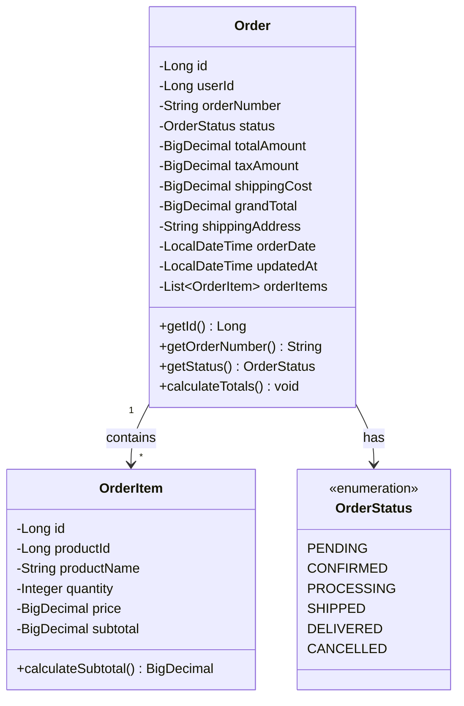
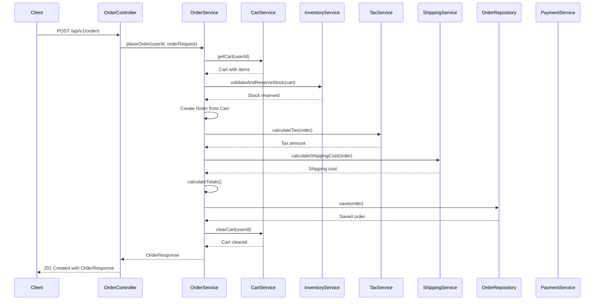

## 5. Order Management System

### 5.1 Order Entity



### 5.2 Order Entity Implementation

```java
package com.ecommerce.order.entity;

import jakarta.persistence.*;
import lombok.AllArgsConstructor;
import lombok.Builder;
import lombok.Data;
import lombok.NoArgsConstructor;
import java.math.BigDecimal;
import java.time.LocalDateTime;
import java.util.ArrayList;
import java.util.List;

@Entity
@Table(name = "orders", indexes = {
    @Index(name = "idx_order_user", columnList = "user_id"),
    @Index(name = "idx_order_number", columnList = "order_number", unique = true),
    @Index(name = "idx_order_status", columnList = "status")
})
@Data
@Builder
@NoArgsConstructor
@AllArgsConstructor
public class Order {
    
    @Id
    @GeneratedValue(strategy = GenerationType.IDENTITY)
    private Long id;
    
    @Column(name = "user_id", nullable = false)
    private Long userId;
    
    @Column(name = "order_number", unique = true, nullable = false)
    private String orderNumber;
    
    @Enumerated(EnumType.STRING)
    @Column(nullable = false)
    private OrderStatus status;
    
    @Column(name = "total_amount", precision = 10, scale = 2)
    private BigDecimal totalAmount;
    
    @Column(name = "tax_amount", precision = 10, scale = 2)
    private BigDecimal taxAmount;
    
    @Column(name = "shipping_cost", precision = 10, scale = 2)
    private BigDecimal shippingCost;
    
    @Column(name = "grand_total", precision = 10, scale = 2)
    private BigDecimal grandTotal;
    
    @Column(name = "shipping_address", columnDefinition = "TEXT")
    private String shippingAddress;
    
    @Column(name = "order_date", nullable = false)
    private LocalDateTime orderDate;
    
    @Column(name = "updated_at")
    private LocalDateTime updatedAt;
    
    @OneToMany(mappedBy = "order", cascade = CascadeType.ALL, orphanRemoval = true)
    @Builder.Default
    private List<OrderItem> orderItems = new ArrayList<>();
    
    @PrePersist
    protected void onCreate() {
        orderDate = LocalDateTime.now();
        updatedAt = LocalDateTime.now();
        status = OrderStatus.PENDING;
    }
    
    @PreUpdate
    protected void onUpdate() {
        updatedAt = LocalDateTime.now();
    }
    
    public void addOrderItem(OrderItem item) {
        orderItems.add(item);
        item.setOrder(this);
    }
    
    public void calculateTotals() {
        this.totalAmount = orderItems.stream()
                .map(OrderItem::getSubtotal)
                .reduce(BigDecimal.ZERO, BigDecimal::add);
        this.grandTotal = this.totalAmount.add(this.taxAmount).add(this.shippingCost);
    }
}

@Entity
@Table(name = "order_items")
@Data
@Builder
@NoArgsConstructor
@AllArgsConstructor
class OrderItem {
    
    @Id
    @GeneratedValue(strategy = GenerationType.IDENTITY)
    private Long id;
    
    @ManyToOne(fetch = FetchType.LAZY)
    @JoinColumn(name = "order_id", nullable = false)
    private Order order;
    
    @Column(name = "product_id", nullable = false)
    private Long productId;
    
    @Column(name = "product_name", nullable = false)
    private String productName;
    
    @Column(nullable = false)
    private Integer quantity;
    
    @Column(nullable = false, precision = 10, scale = 2)
    private BigDecimal price;
    
    @Column(precision = 10, scale = 2)
    private BigDecimal subtotal;
    
    @PrePersist
    @PreUpdate
    protected void calculateSubtotal() {
        this.subtotal = this.price.multiply(BigDecimal.valueOf(this.quantity));
    }
}

enum OrderStatus {
    PENDING,
    CONFIRMED,
    PROCESSING,
    SHIPPED,
    DELIVERED,
    CANCELLED
}
```

### 5.3 Order Service Implementation

```java
package com.ecommerce.order.service.impl;

import com.ecommerce.order.dto.OrderRequest;
import com.ecommerce.order.dto.OrderResponse;
import com.ecommerce.order.entity.Order;
import com.ecommerce.order.entity.OrderItem;
import com.ecommerce.order.entity.OrderStatus;
import com.ecommerce.order.exception.OrderNotFoundException;
import com.ecommerce.order.mapper.OrderMapper;
import com.ecommerce.order.repository.OrderRepository;
import com.ecommerce.order.service.OrderService;
import com.ecommerce.cart.entity.Cart;
import com.ecommerce.cart.repository.CartRepository;
import com.ecommerce.inventory.service.InventoryService;
import com.ecommerce.tax.service.TaxService;
import com.ecommerce.shipping.service.ShippingService;
import lombok.RequiredArgsConstructor;
import lombok.extern.slf4j.Slf4j;
import org.springframework.data.domain.Page;
import org.springframework.data.domain.Pageable;
import org.springframework.stereotype.Service;
import org.springframework.transaction.annotation.Transactional;
import java.math.BigDecimal;
import java.util.UUID;

@Service
@RequiredArgsConstructor
@Slf4j
public class OrderServiceImpl implements OrderService {
    
    private final OrderRepository orderRepository;
    private final CartRepository cartRepository;
    private final InventoryService inventoryService;
    private final TaxService taxService;
    private final ShippingService shippingService;
    private final OrderMapper orderMapper;
    
    @Override
    @Transactional
    public OrderResponse placeOrder(Long userId, OrderRequest orderRequest) {
        log.info("Placing order for user {}", userId);
        
        Cart cart = cartRepository.findByUserId(userId)
                .orElseThrow(() -> new IllegalStateException("Cart is empty"));
        
        if (cart.getItems().isEmpty()) {
            throw new IllegalStateException("Cannot place order with empty cart");
        }
        
        // Validate inventory
        boolean inventoryValid = inventoryService.validateAndReserveStock(cart);
        if (!inventoryValid) {
            throw new IllegalStateException("Insufficient inventory for one or more items");
        }
        
        // Create order
        Order order = Order.builder()
                .userId(userId)
                .orderNumber(generateOrderNumber())
                .shippingAddress(orderRequest.getShippingAddress())
                .build();
        
        // Add order items from cart
        cart.getItems().forEach(cartItem -> {
            OrderItem orderItem = OrderItem.builder()
                    .productId(cartItem.getProductId())
                    .productName(cartItem.getProductName())
                    .quantity(cartItem.getQuantity())
                    .price(cartItem.getPrice())
                    .build();
            order.addOrderItem(orderItem);
        });
        
        // Calculate tax
        BigDecimal taxAmount = taxService.calculateTax(order);
        order.setTaxAmount(taxAmount);
        
        // Calculate shipping
        BigDecimal shippingCost = shippingService.calculateShippingCost(order);
        order.setShippingCost(shippingCost);
        
        // Calculate totals
        order.calculateTotals();
        
        Order savedOrder = orderRepository.save(order);
        
        // Clear cart after successful order
        cart.clearCart();
        cartRepository.save(cart);
        
        log.info("Order placed successfully: {}", savedOrder.getOrderNumber());
        return orderMapper.toResponse(savedOrder);
    }
    
    @Override
    public OrderResponse getOrderById(Long orderId) {
        log.info("Fetching order with ID: {}", orderId);
        Order order = orderRepository.findById(orderId)
                .orElseThrow(() -> new OrderNotFoundException("Order not found with ID: " + orderId));
        return orderMapper.toResponse(order);
    }
    
    @Override
    public Page<OrderResponse> getOrderHistory(Long userId, Pageable pageable) {
        log.info("Fetching order history for user {}", userId);
        return orderRepository.findByUserId(userId, pageable)
                .map(orderMapper::toResponse);
    }
    
    @Override
    @Transactional
    public OrderResponse updateOrderStatus(Long orderId, OrderStatus newStatus) {
        log.info("Updating order {} status to {}", orderId, newStatus);
        Order order = orderRepository.findById(orderId)
                .orElseThrow(() -> new OrderNotFoundException("Order not found with ID: " + orderId));
        
        order.setStatus(newStatus);
        Order updatedOrder = orderRepository.save(order);
        return orderMapper.toResponse(updatedOrder);
    }
    
    @Override
    @Transactional
    public OrderResponse cancelOrder(Long orderId) {
        log.info("Cancelling order {}", orderId);
        Order order = orderRepository.findById(orderId)
                .orElseThrow(() -> new OrderNotFoundException("Order not found with ID: " + orderId));
        
        if (order.getStatus() == OrderStatus.SHIPPED || order.getStatus() == OrderStatus.DELIVERED) {
            throw new IllegalStateException("Cannot cancel order in " + order.getStatus() + " status");
        }
        
        // Release reserved inventory
        inventoryService.releaseReservedStock(order);
        
        order.setStatus(OrderStatus.CANCELLED);
        Order cancelledOrder = orderRepository.save(order);
        
        log.info("Order cancelled successfully: {}", orderId);
        return orderMapper.toResponse(cancelledOrder);
    }
    
    private String generateOrderNumber() {
        return "ORD-" + UUID.randomUUID().toString().substring(0, 8).toUpperCase();
    }
}
```

### 5.4 Order Placement Sequence Diagram


