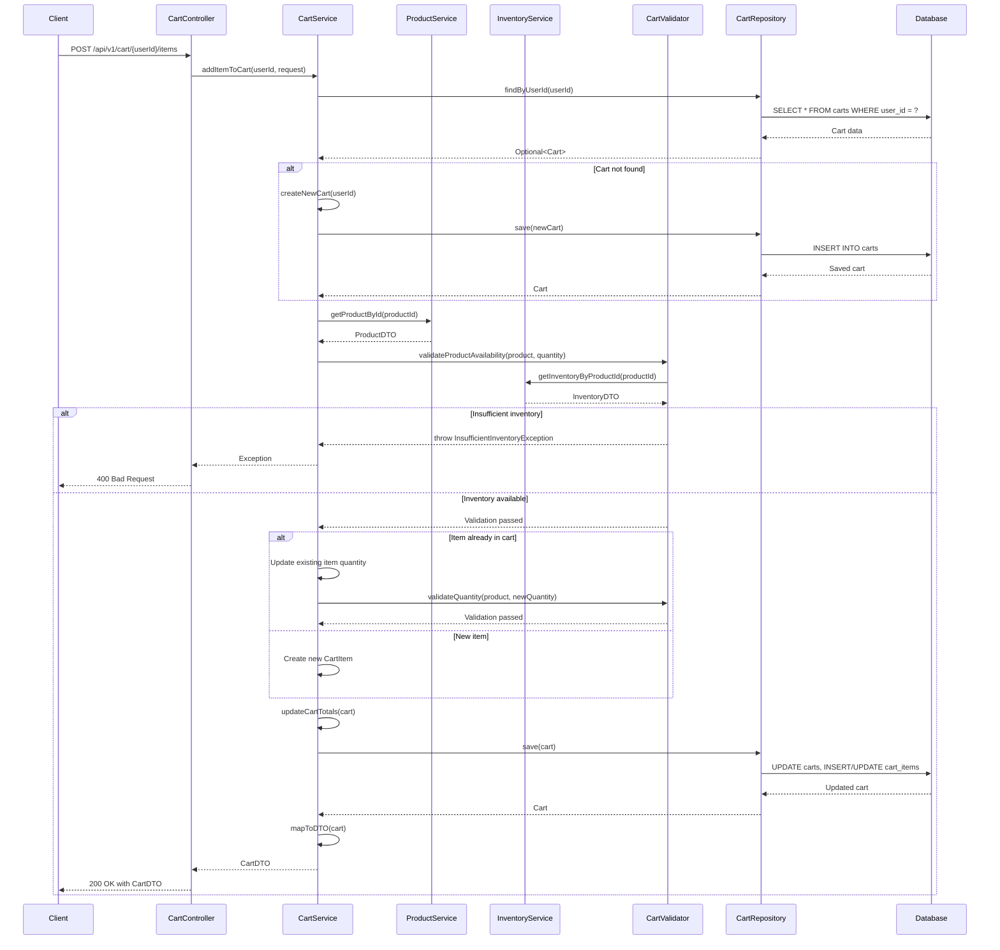
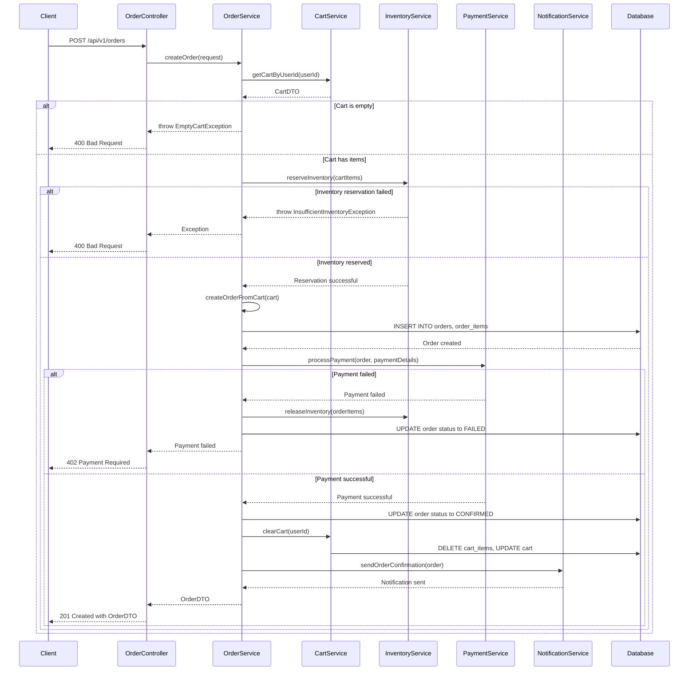
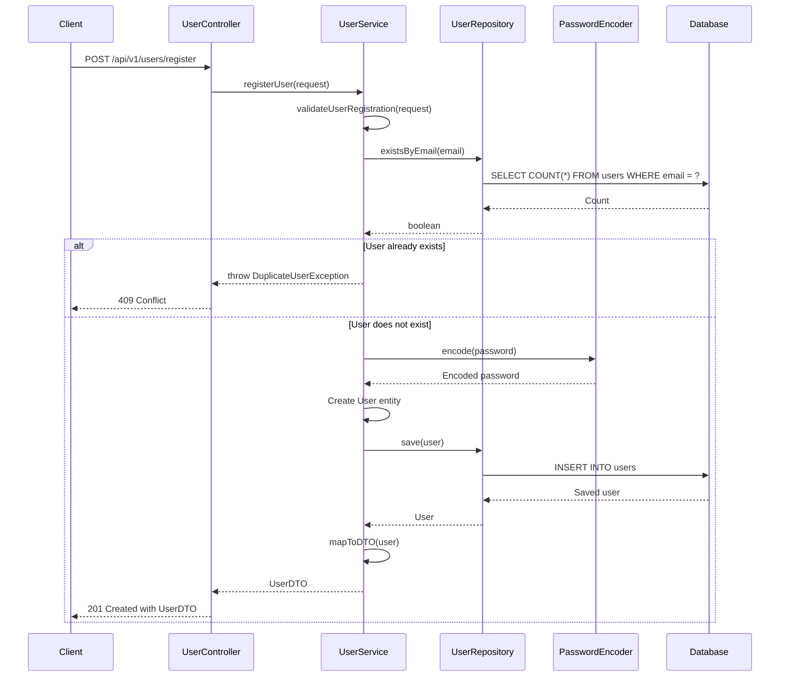

## 6. Sequence Diagrams

### 6.1 Add Item to Cart Flow



### 6.2 Checkout Flow



### 6.3 User Registration Flow



## 7. Error Handling

### 7.1 Exception Hierarchy

```java
public class ECommerceException extends RuntimeException {
    private final String errorCode;
    private final HttpStatus httpStatus;
    
    public ECommerceException(String message, String errorCode, HttpStatus httpStatus) {
        super(message);
        this.errorCode = errorCode;
        this.httpStatus = httpStatus;
    }
}

public class CartNotFoundException extends ECommerceException {
    public CartNotFoundException(String message) {
        super(message, "CART_NOT_FOUND", HttpStatus.NOT_FOUND);
    }
}

public class CartItemNotFoundException extends ECommerceException {
    public CartItemNotFoundException(String message) {
        super(message, "CART_ITEM_NOT_FOUND", HttpStatus.NOT_FOUND);
    }
}

public class InsufficientInventoryException extends ECommerceException {
    public InsufficientInventoryException(String message) {
        super(message, "INSUFFICIENT_INVENTORY", HttpStatus.BAD_REQUEST);
    }
}

public class ProductNotAvailableException extends ECommerceException {
    public ProductNotAvailableException(String message) {
        super(message, "PRODUCT_NOT_AVAILABLE", HttpStatus.BAD_REQUEST);
    }
}

public class InvalidQuantityException extends ECommerceException {
    public InvalidQuantityException(String message) {
        super(message, "INVALID_QUANTITY", HttpStatus.BAD_REQUEST);
    }
}

public class UserNotFoundException extends ECommerceException {
    public UserNotFoundException(String message) {
        super(message, "USER_NOT_FOUND", HttpStatus.NOT_FOUND);
    }
}

public class DuplicateUserException extends ECommerceException {
    public DuplicateUserException(String message) {
        super(message, "DUPLICATE_USER", HttpStatus.CONFLICT);
    }
}

public class OrderNotFoundException extends ECommerceException {
    public OrderNotFoundException(String message) {
        super(message, "ORDER_NOT_FOUND", HttpStatus.NOT_FOUND);
    }
}

public class PaymentFailedException extends ECommerceException {
    public PaymentFailedException(String message) {
        super(message, "PAYMENT_FAILED", HttpStatus.PAYMENT_REQUIRED);
    }
}
```

### 7.2 Global Exception Handler

```java
@RestControllerAdvice
public class GlobalExceptionHandler {
    
    @ExceptionHandler(ECommerceException.class)
    public ResponseEntity<ErrorResponse> handleECommerceException(ECommerceException ex) {
        ErrorResponse error = new ErrorResponse(
            ex.getErrorCode(),
            ex.getMessage(),
            LocalDateTime.now()
        );
        return ResponseEntity.status(ex.getHttpStatus()).body(error);
    }
    
    @ExceptionHandler(MethodArgumentNotValidException.class)
    public ResponseEntity<ErrorResponse> handleValidationException(MethodArgumentNotValidException ex) {
        String message = ex.getBindingResult().getFieldErrors().stream()
            .map(error -> error.getField() + ": " + error.getDefaultMessage())
            .collect(Collectors.joining(", "));
        
        ErrorResponse error = new ErrorResponse(
            "VALIDATION_ERROR",
            message,
            LocalDateTime.now()
        );
        return ResponseEntity.status(HttpStatus.BAD_REQUEST).body(error);
    }
    
    @ExceptionHandler(Exception.class)
    public ResponseEntity<ErrorResponse> handleGenericException(Exception ex) {
        ErrorResponse error = new ErrorResponse(
            "INTERNAL_SERVER_ERROR",
            "An unexpected error occurred",
            LocalDateTime.now()
        );
        return ResponseEntity.status(HttpStatus.INTERNAL_SERVER_ERROR).body(error);
    }
}

@Data
@AllArgsConstructor
public class ErrorResponse {
    private String errorCode;
    private String message;
    private LocalDateTime timestamp;
}
```

## 8. Validation Rules

### 8.1 Cart Validation Rules

1. **Add Item to Cart**
   - Product ID must be valid and exist
   - Quantity must be between 1 and 100
   - Product must be active
   - Sufficient inventory must be available
   - User must be authenticated

2. **Update Cart Item**
   - Cart item must exist
   - Quantity must be between 1 and 100
   - Sufficient inventory must be available for new quantity
   - User must own the cart

3. **Remove Item from Cart**
   - Cart item must exist
   - User must own the cart

4. **Clear Cart**
   - Cart must exist
   - User must own the cart

5. **Merge Cart**
   - Guest cart items must be valid
   - All products in guest cart must exist and be active
   - Sufficient inventory must be available for all items
   - User must be authenticated

### 8.2 User Validation Rules

1. **User Registration**
   - Email must be valid format
   - Email must be unique
   - Password must be at least 8 characters
   - Password must contain uppercase, lowercase, number, and special character
   - First name and last name are required

2. **User Update**
   - User must exist
   - Email must be unique if changed
   - Phone number must be valid format if provided

### 8.3 Order Validation Rules

1. **Create Order**
   - Cart must not be empty
   - All cart items must have valid products
   - Sufficient inventory must be available for all items
   - User must be authenticated
   - Payment details must be valid

2. **Update Order Status**
   - Order must exist
   - Status transition must be valid
   - User must have permission to update order

## 9. Business Logic

### 9.1 Cart Business Rules

1. **Cart Creation**
   - A cart is automatically created when a user adds their first item
   - Each user can have only one active cart
   - Guest users can have temporary carts stored in session/local storage

2. **Item Management**
   - If an item already exists in the cart, adding it again increases the quantity
   - Item prices are captured at the time of addition
   - Cart totals are recalculated after every modification

3. **Price Calculation**
   - Subtotal = Sum of (item price × quantity) for all items
   - Tax = Subtotal × Tax Rate (8%)
   - Total = Subtotal + Tax

4. **Cart Expiration**
   - Abandoned carts (not updated for 30 days) are automatically deleted
   - A scheduled job runs daily to clean up expired carts

5. **Cart Merging**
   - When a guest user logs in, their guest cart is merged with their user cart
   - If the same product exists in both carts, quantities are combined
   - Inventory availability is validated during merge

### 9.2 Inventory Management Rules

1. **Inventory Reservation**
   - Inventory is reserved when an order is created
   - Reserved inventory is not available for other orders
   - Reservation is released if payment fails or order is cancelled

2. **Inventory Updates**
   - Available quantity is decreased when inventory is reserved
   - Reserved quantity is increased when inventory is reserved
   - Both quantities are updated when order is fulfilled or cancelled

3. **Stock Validation**
   - Stock is validated when adding items to cart
   - Stock is validated again during checkout
   - If stock becomes unavailable, user is notified

### 9.3 Order Processing Rules

1. **Order Creation**
   - Order number is generated using format: ORD-YYYY-NNNNN
   - Order status starts as PENDING
   - Cart items are copied to order items
   - Inventory is reserved for order items

2. **Payment Processing**
   - Payment is processed after order creation
   - If payment succeeds, order status changes to CONFIRMED
   - If payment fails, order status changes to FAILED and inventory is released
   - User receives confirmation email after successful payment

3. **Order Fulfillment**
   - Orders are fulfilled in FIFO order
   - Inventory is decremented when order is shipped
   - User receives shipping notification

## 10. Security Considerations

### 10.1 Authentication & Authorization

1. **JWT Token Authentication**
   - All protected endpoints require valid JWT token
   - Token contains user ID and roles
   - Token expires after 24 hours
   - Refresh tokens are used for extended sessions

2. **Role-Based Access Control**
   - USER role: Can manage own cart, place orders, view own orders
   - ADMIN role: Can manage all resources, view all orders, manage inventory

3. **Cart Access Control**
   - Users can only access their own carts
   - Cart operations validate user ownership
   - Admin users can access any cart for support purposes

### 10.2 Data Protection

1. **Password Security**
   - Passwords are hashed using BCrypt with strength 12
   - Plain text passwords are never stored
   - Password reset requires email verification

2. **Sensitive Data**
   - Payment information is not stored in database
   - Only transaction IDs are stored for reference
   - PCI DSS compliance for payment processing

3. **API Security**
   - Rate limiting: 100 requests per minute per user
   - CORS configured for allowed origins only
   - HTTPS required for all API calls in production

## 11. Performance Optimization

### 11.1 Database Optimization

1. **Indexing Strategy**
   - Primary keys on all tables
   - Foreign key indexes for joins
   - Composite indexes for common query patterns
   - Index on cart.user_id for fast cart lookup
   - Index on cart.updated_at for expiration cleanup

2. **Query Optimization**
   - Use of JOIN FETCH for eager loading cart items
   - Pagination for product listings
   - Batch operations for bulk updates
   - Connection pooling with HikariCP

3. **Caching Strategy**
   - Product catalog cached in Redis (TTL: 1 hour)
   - User sessions cached in Redis
   - Cart data cached with write-through strategy
   - Cache invalidation on updates

### 11.2 Application Optimization

1. **Lazy Loading**
   - Cart items loaded lazily by default
   - Explicit fetch when needed for operations

2. **Async Processing**
   - Email notifications sent asynchronously
   - Order confirmation processing in background
   - Inventory updates batched and processed async

3. **Resource Management**
   - Thread pool for async operations
   - Connection pool for database
   - Object pooling for frequently created objects
