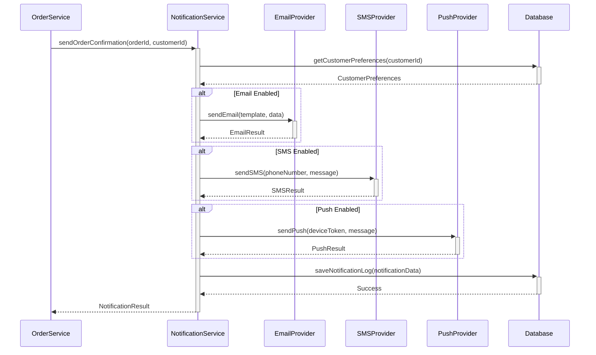

## 19. Promotional Engine

**Requirement Reference:** Epic SCRUM-344

### 19.1 Overview
Flexible promotional discount engine supporting various discount types, conditions, and combinations.

### 19.2 Promotion Types
- **Percentage Discount:** X% off on cart total or specific products
- **Fixed Amount Discount:** $X off on cart total
- **Buy X Get Y:** Buy X items, get Y items free
- **Free Shipping:** Waive shipping charges
- **Bundle Offers:** Discounted price for product bundles
- **Tiered Discounts:** Increasing discounts based on cart value

### 19.3 Promotion Conditions
- Minimum cart value
- Specific products or categories
- Customer segments (new, loyal, VIP)
- Time-based (date range, day of week, time of day)
- Usage limits (per customer, total uses)
- Stackability rules (can combine with other promotions)

### 19.4 Promotion Application
1. Customer enters promotion code at checkout
2. System validates code (active, not expired, conditions met)
3. Discount calculated based on promotion rules
4. Cart total updated with discount applied
5. Promotion usage tracked
6. Discount details shown in order summary

### 19.5 Promotion Management
- Create, update, deactivate promotions
- Schedule promotions for future dates
- Monitor promotion performance and usage
- A/B testing for promotion effectiveness

## 20. Guest Checkout

**Requirement Reference:** Epic SCRUM-344

### 20.1 Overview
Streamlined checkout process for guest users without requiring account creation, reducing friction and cart abandonment.

### 20.2 Features
- **No Registration Required:** Complete purchase without creating account
- **Email-based Tracking:** Order tracking via email link
- **Optional Account Creation:** Offer account creation post-purchase
- **Guest Cart Persistence:** Save cart using session/cookies
- **Simplified Form:** Minimal information collection

### 20.3 Guest Checkout Flow
1. Customer adds items to cart without login
2. Proceeds to checkout as guest
3. Provides email, shipping address, payment details
4. Order confirmation sent to email
5. Order tracking link provided
6. Optional: Create account to save order history

### 20.4 Data Handling
- Guest orders stored with guest identifier
- Email used as primary identifier
- Option to claim guest orders when creating account
- Guest data retention policy compliance
- Privacy-focused data collection

### 20.5 Conversion Strategy
- Post-purchase account creation incentives
- Benefits of account creation highlighted
- One-click account creation from order confirmation
- Automatic migration of guest order to account

## 21. Shipping Tracking

**Requirement Reference:** Epic SCRUM-344

### 21.1 Overview
Integrated shipping tracking system providing real-time updates on order shipment and delivery status.

### 21.2 Features
- **Real-time Tracking:** Live updates on shipment location
- **Multiple Carriers:** Support for FedEx, UPS, USPS, DHL
- **Tracking Number Generation:** Automatic tracking number assignment
- **Delivery Estimates:** Estimated delivery date and time
- **Status Notifications:** Email/SMS updates on shipping milestones
- **Proof of Delivery:** Signature and photo confirmation

### 21.3 Shipping Status Stages
1. **Order Confirmed:** Order placed and payment received
2. **Processing:** Order being prepared for shipment
3. **Shipped:** Package handed to carrier
4. **In Transit:** Package moving through carrier network
5. **Out for Delivery:** Package on delivery vehicle
6. **Delivered:** Package delivered to recipient
7. **Exception:** Delivery issue or delay

### 21.4 Carrier Integration
- API integration with major shipping carriers
- Webhook support for status updates
- Rate shopping for best shipping rates
- Label generation and printing
- Address validation and correction

### 21.5 Customer Experience
- Tracking page with visual timeline
- Map view of package location
- Delivery window notifications
- Delivery instructions and preferences
- Rescheduling and rerouting options

## 22. Order Management

**Requirement Reference:** Epic SCRUM-344

### 22.1 Overview
Comprehensive order management system for tracking, updating, and managing customer orders throughout their lifecycle.

### 22.2 Order Lifecycle
1. **Pending:** Order created, awaiting payment
2. **Confirmed:** Payment received, order confirmed
3. **Processing:** Order being prepared
4. **Shipped:** Order dispatched to customer
5. **Delivered:** Order received by customer
6. **Completed:** Order fulfilled successfully
7. **Cancelled:** Order cancelled by customer or system
8. **Refunded:** Payment refunded to customer

### 22.3 Order Operations
- **View Orders:** List and search customer orders
- **Order Details:** Complete order information and history
- **Update Status:** Manual or automatic status updates
- **Cancel Order:** Customer or admin initiated cancellation
- **Modify Order:** Update shipping address or items (before shipping)
- **Return/Refund:** Process returns and refunds
- **Reorder:** Quick reorder of previous purchases

### 22.4 Order Information
- Order ID and date
- Customer details
- Items ordered (products, quantities, prices)
- Payment information (method, status, transaction ID)
- Shipping information (address, method, tracking)
- Order total (subtotal, tax, shipping, discounts)
- Order status and history

### 22.5 Admin Features
- Order dashboard with filters and search
- Bulk order operations
- Order export for reporting
- Order analytics and insights
- Fraud detection and flagging
- Customer service notes and actions

## 23. Notifications

**Requirement Reference:** Epic SCRUM-344

### 23.1 Overview
Automated customer notification system for keeping customers informed about their orders, promotions, and account activities.

### 23.2 Notification Types

#### 23.2.1 Order Notifications
- Order confirmation
- Payment received
- Order shipped
- Out for delivery
- Delivered
- Order cancelled
- Refund processed

#### 23.2.2 Cart Notifications
- Cart abandonment reminders
- Price drop alerts
- Back in stock notifications
- Low stock warnings

#### 23.2.3 Account Notifications
- Welcome email
- Password reset
- Account verification
- Profile updates
- Security alerts

#### 23.2.4 Marketing Notifications
- Promotional offers
- New product launches
- Seasonal sales
- Personalized recommendations

### 23.3 Notification Channels
- **Email:** Primary channel for detailed notifications
- **SMS:** Critical updates and time-sensitive alerts
- **Push Notifications:** Mobile app notifications
- **In-app Notifications:** Notifications within web/mobile app

### 23.4 Notification Preferences
- Customer control over notification types
- Channel preferences (email, SMS, push)
- Frequency settings (immediate, daily digest, weekly)
- Opt-out options for marketing communications
- Compliance with CAN-SPAM and GDPR

### 23.5 Implementation
- Template-based notification system
- Asynchronous notification processing
- Retry mechanism for failed deliveries
- Notification tracking and analytics
- A/B testing for notification effectiveness
- Personalization based on customer data

### 23.6 Notification Service Architecture



## 24. Data Models

**Requirement Reference:** Story SCRUM-343

### 24.1 Cart Data Model

```java
@Entity
@Table(name = "carts")
public class Cart {
    @Id
    @GeneratedValue(strategy = GenerationType.IDENTITY)
    private Long cartId;
    
    @Column(nullable = false)
    private Long customerId;
    
    @Column(nullable = false)
    private LocalDateTime createdAt;
    
    @Column(nullable = false)
    private LocalDateTime updatedAt;
    
    @Column(nullable = false, length = 50)
    private String status; // ACTIVE, CLEARED, CONVERTED
    
    @Column(nullable = false, precision = 10, scale = 2)
    private BigDecimal totalAmount;
    
    @OneToMany(mappedBy = "cart", cascade = CascadeType.ALL, orphanRemoval = true)
    private List<CartItem> cartItems;
    
    // Getters and setters
}
```

### 24.2 CartItem Data Model

```java
@Entity
@Table(name = "cart_items")
public class CartItem {
    @Id
    @GeneratedValue(strategy = GenerationType.IDENTITY)
    private Long cartItemId;
    
    @ManyToOne(fetch = FetchType.LAZY)
    @JoinColumn(name = "cart_id", nullable = false)
    private Cart cart;
    
    @ManyToOne(fetch = FetchType.LAZY)
    @JoinColumn(name = "product_id", nullable = false)
    private Product product;
    
    @Column(nullable = false)
    private Integer quantity;
    
    @Column(nullable = false, precision = 10, scale = 2)
    private BigDecimal unitPrice;
    
    @Column(nullable = false, precision = 10, scale = 2)
    private BigDecimal subtotal;
    
    @Column(length = 50)
    private String subscriptionType; // MONTHLY, QUARTERLY, YEARLY, ONE_TIME
    
    @Column(nullable = false)
    private LocalDateTime createdAt;
    
    @Column(nullable = false)
    private LocalDateTime updatedAt;
    
    // Getters and setters
}
```

### 24.3 Order Data Model

```java
@Entity
@Table(name = "orders")
public class Order {
    @Id
    @GeneratedValue(strategy = GenerationType.IDENTITY)
    private Long orderId;
    
    @Column(nullable = false)
    private Long customerId;
    
    @ManyToOne(fetch = FetchType.LAZY)
    @JoinColumn(name = "cart_id")
    private Cart cart;
    
    @Column(nullable = false, length = 50)
    private String orderStatus;
    
    @Column(nullable = false, precision = 10, scale = 2)
    private BigDecimal totalAmount;
    
    @Column(length = 50)
    private String paymentMethod;
    
    @Column(length = 50)
    private String paymentStatus;
    
    @Column(nullable = false, columnDefinition = "TEXT")
    private String shippingAddress;
    
    @Column(length = 100)
    private String trackingNumber;
    
    @Column(nullable = false)
    private LocalDateTime orderDate;
    
    @Column(nullable = false)
    private LocalDateTime updatedAt;
    
    // Getters and setters
}
```

### 24.4 Promotion Data Model

```java
@Entity
@Table(name = "promotions")
public class Promotion {
    @Id
    @GeneratedValue(strategy = GenerationType.IDENTITY)
    private Long promotionId;
    
    @Column(unique = true, nullable = false, length = 50)
    private String code;
    
    @Column(length = 255)
    private String description;
    
    @Column(precision = 5, scale = 2)
    private BigDecimal discountPercentage;
    
    @Column(precision = 10, scale = 2)
    private BigDecimal discountAmount;
    
    @Column(nullable = false)
    private LocalDateTime validFrom;
    
    @Column(nullable = false)
    private LocalDateTime validUntil;
    
    @Column(nullable = false)
    private Boolean active;
    
    @Column(nullable = false)
    private LocalDateTime createdAt;
    
    // Getters and setters
}
```

## 25. Business Rules

**Requirement Reference:** Story SCRUM-343

### 25.1 Cart Business Rules

1. **Quantity Validation**
   - Minimum quantity: 1
   - Maximum quantity: Available stock or 999 (whichever is lower)
   - For products with minimum procurement threshold: quantity >= threshold

2. **Price Calculation**
   - Unit price locked at time of adding to cart
   - Subtotal = unit price × quantity
   - Cart total = sum of all subtotals + tax - discounts
   - Tax calculated based on shipping address

3. **Stock Validation**
   - Validate stock availability before adding to cart
   - Reserve stock when item added to cart (15-minute timeout)
   - Release reserved stock on cart abandonment or timeout
   - Prevent checkout if any item out of stock

4. **Cart Expiration**
   - Active carts expire after 30 days of inactivity
   - Expired carts moved to EXPIRED status
   - Items in expired carts released back to inventory

5. **Subscription Rules**
   - Subscription products require subscription type selection
   - Subscription discounts applied automatically
   - Minimum subscription period enforced
   - Subscription items cannot be mixed with one-time purchases in same order

### 25.2 Order Business Rules

1. **Order Creation**
   - Cart must not be empty
   - All items must be in stock
   - Payment must be successful
   - Shipping address must be valid

2. **Order Modification**
   - Orders can be modified only in PENDING or CONFIRMED status
   - Cannot modify after shipping
   - Address changes require revalidation

3. **Order Cancellation**
   - Customer can cancel before shipping
   - Admin can cancel at any stage
   - Automatic refund initiated on cancellation
   - Stock restored to inventory

4. **Return Policy**
   - Returns accepted within 30 days of delivery
   - Item must be unused and in original packaging
   - Refund processed within 5-7 business days
   - Shipping charges non-refundable (unless defective)

### 25.3 Promotion Business Rules

1. **Promotion Validation**
   - Code must be active and not expired
   - Cart must meet minimum value requirement
   - Customer must meet eligibility criteria
   - Usage limit not exceeded

2. **Promotion Stacking**
   - Maximum 2 promotions per order
   - Percentage discounts applied before fixed amount
   - Free shipping promotions applied last
   - Conflicting promotions: highest discount wins

3. **Promotion Application**
   - Discounts applied to eligible items only
   - Discounts cannot reduce price below zero
   - Promotion usage tracked per customer
   - One-time use codes invalidated after use
