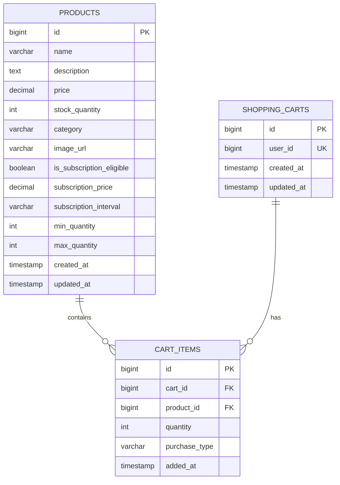

## 9. Exception Handling

### 9.1 Custom Exceptions

```java
package com.ecommerce.product.exception;

public class ProductNotFoundException extends RuntimeException {
    public ProductNotFoundException(String message) {
        super(message);
    }
}
```

```java
package com.ecommerce.product.exception;

public class InsufficientStockException extends RuntimeException {
    public InsufficientStockException(String message) {
        super(message);
    }
}
```

```java
package com.ecommerce.cart.exception;

public class CartNotFoundException extends RuntimeException {
    public CartNotFoundException(String message) {
        super(message);
    }
}
```

```java
package com.ecommerce.cart.exception;

public class CartItemNotFoundException extends RuntimeException {
    public CartItemNotFoundException(String message) {
        super(message);
    }
}
```

### 9.2 Global Exception Handler

```java
package com.ecommerce.common.exception;

import com.ecommerce.product.exception.ProductNotFoundException;
import com.ecommerce.product.exception.InsufficientStockException;
import com.ecommerce.cart.exception.CartNotFoundException;
import com.ecommerce.cart.exception.CartItemNotFoundException;
import lombok.extern.slf4j.Slf4j;
import org.springframework.http.HttpStatus;
import org.springframework.http.ResponseEntity;
import org.springframework.validation.FieldError;
import org.springframework.web.bind.MethodArgumentNotValidException;
import org.springframework.web.bind.annotation.ExceptionHandler;
import org.springframework.web.bind.annotation.RestControllerAdvice;

import java.time.LocalDateTime;
import java.util.HashMap;
import java.util.Map;

@RestControllerAdvice
@Slf4j
public class GlobalExceptionHandler {
    
    @ExceptionHandler(ProductNotFoundException.class)
    public ResponseEntity<ErrorResponse> handleProductNotFoundException(ProductNotFoundException ex) {
        log.error("Product not found: {}", ex.getMessage());
        ErrorResponse error = ErrorResponse.builder()
                .timestamp(LocalDateTime.now())
                .status(HttpStatus.NOT_FOUND.value())
                .error("Not Found")
                .message(ex.getMessage())
                .build();
        return ResponseEntity.status(HttpStatus.NOT_FOUND).body(error);
    }
    
    @ExceptionHandler(InsufficientStockException.class)
    public ResponseEntity<ErrorResponse> handleInsufficientStockException(InsufficientStockException ex) {
        log.error("Insufficient stock: {}", ex.getMessage());
        ErrorResponse error = ErrorResponse.builder()
                .timestamp(LocalDateTime.now())
                .status(HttpStatus.BAD_REQUEST.value())
                .error("Bad Request")
                .message(ex.getMessage())
                .build();
        return ResponseEntity.status(HttpStatus.BAD_REQUEST).body(error);
    }
    
    @ExceptionHandler(CartNotFoundException.class)
    public ResponseEntity<ErrorResponse> handleCartNotFoundException(CartNotFoundException ex) {
        log.error("Cart not found: {}", ex.getMessage());
        ErrorResponse error = ErrorResponse.builder()
                .timestamp(LocalDateTime.now())
                .status(HttpStatus.NOT_FOUND.value())
                .error("Not Found")
                .message(ex.getMessage())
                .build();
        return ResponseEntity.status(HttpStatus.NOT_FOUND).body(error);
    }
    
    @ExceptionHandler(CartItemNotFoundException.class)
    public ResponseEntity<ErrorResponse> handleCartItemNotFoundException(CartItemNotFoundException ex) {
        log.error("Cart item not found: {}", ex.getMessage());
        ErrorResponse error = ErrorResponse.builder()
                .timestamp(LocalDateTime.now())
                .status(HttpStatus.NOT_FOUND.value())
                .error("Not Found")
                .message(ex.getMessage())
                .build();
        return ResponseEntity.status(HttpStatus.NOT_FOUND).body(error);
    }
    
    @ExceptionHandler(MethodArgumentNotValidException.class)
    public ResponseEntity<ErrorResponse> handleValidationExceptions(MethodArgumentNotValidException ex) {
        Map<String, String> errors = new HashMap<>();
        ex.getBindingResult().getAllErrors().forEach((error) -> {
            String fieldName = ((FieldError) error).getField();
            String errorMessage = error.getDefaultMessage();
            errors.put(fieldName, errorMessage);
        });
        
        ErrorResponse error = ErrorResponse.builder()
                .timestamp(LocalDateTime.now())
                .status(HttpStatus.BAD_REQUEST.value())
                .error("Validation Failed")
                .message("Invalid input parameters")
                .validationErrors(errors)
                .build();
        
        return ResponseEntity.status(HttpStatus.BAD_REQUEST).body(error);
    }
    
    @ExceptionHandler(Exception.class)
    public ResponseEntity<ErrorResponse> handleGenericException(Exception ex) {
        log.error("Unexpected error occurred: {}", ex.getMessage(), ex);
        ErrorResponse error = ErrorResponse.builder()
                .timestamp(LocalDateTime.now())
                .status(HttpStatus.INTERNAL_SERVER_ERROR.value())
                .error("Internal Server Error")
                .message("An unexpected error occurred")
                .build();
        return ResponseEntity.status(HttpStatus.INTERNAL_SERVER_ERROR).body(error);
    }
}
```

## 10. Database Schema

### 10.1 Products Table

```sql
CREATE TABLE products (
    id BIGSERIAL PRIMARY KEY,
    name VARCHAR(255) NOT NULL,
    description TEXT,
    price DECIMAL(10, 2) NOT NULL,
    stock_quantity INTEGER NOT NULL DEFAULT 0,
    category VARCHAR(100),
    image_url VARCHAR(500),
    is_subscription_eligible BOOLEAN DEFAULT FALSE,
    subscription_price DECIMAL(10, 2),
    subscription_interval VARCHAR(50),
    min_quantity INTEGER,
    max_quantity INTEGER,
    created_at TIMESTAMP NOT NULL DEFAULT CURRENT_TIMESTAMP,
    updated_at TIMESTAMP NOT NULL DEFAULT CURRENT_TIMESTAMP,
    CONSTRAINT chk_price_positive CHECK (price > 0),
    CONSTRAINT chk_stock_non_negative CHECK (stock_quantity >= 0),
    CONSTRAINT chk_subscription_price_positive CHECK (subscription_price IS NULL OR subscription_price > 0),
    CONSTRAINT chk_quantity_constraints CHECK (
        (min_quantity IS NULL OR min_quantity >= 1) AND
        (max_quantity IS NULL OR max_quantity >= 1) AND
        (min_quantity IS NULL OR max_quantity IS NULL OR max_quantity >= min_quantity)
    )
);

CREATE INDEX idx_products_category ON products(category);
CREATE INDEX idx_products_created_at ON products(created_at);
```

### 10.2 Shopping Carts Table

```sql
CREATE TABLE shopping_carts (
    id BIGSERIAL PRIMARY KEY,
    user_id BIGINT NOT NULL UNIQUE,
    created_at TIMESTAMP NOT NULL DEFAULT CURRENT_TIMESTAMP,
    updated_at TIMESTAMP NOT NULL DEFAULT CURRENT_TIMESTAMP,
    CONSTRAINT chk_user_id_positive CHECK (user_id > 0)
);

CREATE INDEX idx_shopping_carts_user_id ON shopping_carts(user_id);
```

### 10.3 Cart Items Table

```sql
CREATE TABLE cart_items (
    id BIGSERIAL PRIMARY KEY,
    cart_id BIGINT NOT NULL,
    product_id BIGINT NOT NULL,
    quantity INTEGER NOT NULL,
    purchase_type VARCHAR(20) NOT NULL,
    added_at TIMESTAMP NOT NULL DEFAULT CURRENT_TIMESTAMP,
    CONSTRAINT fk_cart_items_cart FOREIGN KEY (cart_id) REFERENCES shopping_carts(id) ON DELETE CASCADE,
    CONSTRAINT fk_cart_items_product FOREIGN KEY (product_id) REFERENCES products(id) ON DELETE CASCADE,
    CONSTRAINT chk_quantity_positive CHECK (quantity > 0),
    CONSTRAINT chk_purchase_type CHECK (purchase_type IN ('ONE_TIME', 'SUBSCRIPTION')),
    CONSTRAINT uk_cart_product_purchase UNIQUE (cart_id, product_id, purchase_type)
);

CREATE INDEX idx_cart_items_cart_id ON cart_items(cart_id);
CREATE INDEX idx_cart_items_product_id ON cart_items(product_id);
```

## 11. Entity Relationship Diagram


```mermaid
erDiagram
    PRODUCTS ||--o{ CART_ITEMS : contains
    SHOPPING_CARTS ||--o{ CART_ITEMS : has
    
    PRODUCTS {
        bigint id PK
        varchar name
        text description
        decimal price
        int stock_quantity
        varchar category
        varchar image_url
        boolean is_subscription_eligible
        decimal subscription_price
        varchar subscription_interval
        int min_quantity
        int max_quantity
        timestamp created_at
        timestamp updated_at
    }
    
    SHOPPING_CARTS {
        bigint id PK
        bigint user_id UK
        timestamp created_at
        timestamp updated_at
    }
    
    CART_ITEMS {
        bigint id PK
        bigint cart_id FK
        bigint product_id FK
        int quantity
        varchar purchase_type
        timestamp added_at
    }
```

## 12. API Endpoints

| Method | Endpoint | Description | Request Body | Response |
|--------|----------|-------------|--------------|----------|
| POST | `/api/products` | Create a new product | ProductRequest | ProductResponse (201) |
| GET | `/api/products/{id}` | Get product by ID | - | ProductResponse (200) |
| GET | `/api/products` | Get all products (paginated) | - | Page<ProductResponse> (200) |
| PUT | `/api/products/{id}` | Update a product | ProductRequest | ProductResponse (200) |
| DELETE | `/api/products/{id}` | Delete a product | - | 204 No Content |
| GET | `/api/products/{id}/availability` | Check product availability | query: quantity | AvailabilityResponse (200) |
| POST | `/api/cart/{userId}/items` | Add item to cart | AddToCartRequest | CartResponse (201) |
| GET | `/api/cart/{userId}` | Get user's cart | - | CartResponse (200) |
| PUT | `/api/cart/{userId}/items/{itemId}` | Update cart item quantity | query: quantity | CartResponse (200) |
| DELETE | `/api/cart/{userId}/items/{itemId}` | Remove item from cart | - | CartResponse (200) |
| DELETE | `/api/cart/{userId}` | Clear cart | - | 204 No Content |
| POST | `/api/checkout/{userId}` | Process checkout | CheckoutRequest | CheckoutResponse (201) |
