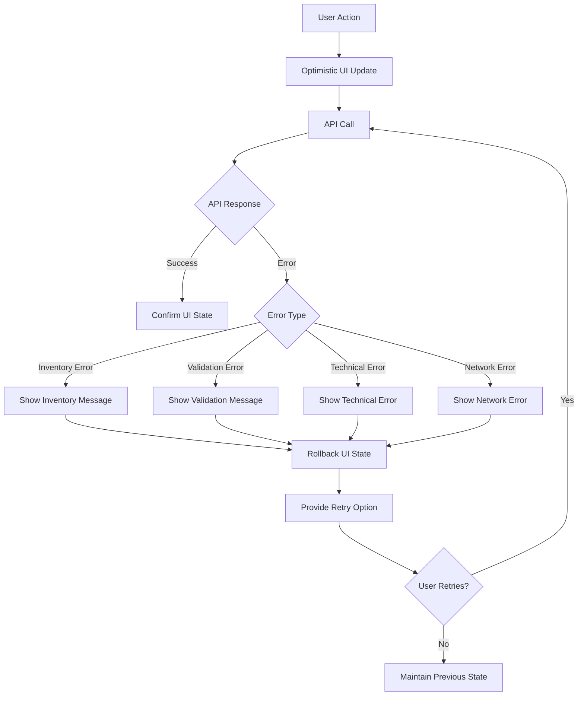

## 16. Error Handling and Validation

**Requirement Reference:** KB: Error Handling with inventory errors, technical errors with optimistic UI updates and rollback

**Description:** Implement comprehensive error handling mechanisms to provide clear feedback and graceful degradation.

### 16.1 Error Categories

**Inventory Errors:**
- Insufficient stock
- Product out of stock
- Product discontinued
- Quantity exceeds maximum order limit

**Validation Errors:**
- Invalid quantity (< 1 or non-numeric)
- Invalid product ID
- Cart item not found
- Duplicate cart item

**Technical Errors:**
- Network timeout
- Server error (500)
- Database connection error
- API rate limiting

**Business Logic Errors:**
- Minimum order value not met
- Maximum cart value exceeded
- Product not available in user's region
- Subscription product restrictions

### 16.2 Error Response Format

```json
{
  "error": {
    "code": "INSUFFICIENT_INVENTORY",
    "message": "Only 5 items available in stock",
    "details": {
      "productId": 123,
      "requestedQuantity": 10,
      "availableQuantity": 5
    },
    "timestamp": "2024-01-15T12:00:00Z",
    "suggestion": "Please reduce quantity to 5 or less"
  }
}
```

### 16.3 Error Handling Flow


```mermaid
flowchart TD
    A[User Action] --> B[Optimistic UI Update]
    B --> C[API Call]
    C --> D{API Response}
    
    D -->|Success| E[Confirm UI State]
    D -->|Error| F{Error Type}
    
    F -->|Inventory Error| G[Show Inventory Message]
    F -->|Validation Error| H[Show Validation Message]
    F -->|Technical Error| I[Show Technical Error]
    F -->|Network Error| J[Show Network Error]
    
    G --> K[Rollback UI State]
    H --> K
    I --> K
    J --> K
    
    K --> L[Provide Retry Option]
    L --> M{User Retries?}
    M -->|Yes| C
    M -->|No| N[Maintain Previous State]
```

### 16.4 User-Friendly Error Messages

| Error Code | User Message | Action |
|------------|--------------|--------|
| INSUFFICIENT_INVENTORY | "Only {available} items in stock" | Adjust quantity |
| OUT_OF_STOCK | "This item is currently out of stock" | Remove or save for later |
| INVALID_QUANTITY | "Please enter a valid quantity (1 or more)" | Correct input |
| NETWORK_ERROR | "Connection lost. Please check your internet" | Retry |
| SERVER_ERROR | "Something went wrong. Please try again" | Retry |
| CART_NOT_FOUND | "Your cart could not be found" | Refresh page |
| PRODUCT_NOT_FOUND | "This product is no longer available" | Remove from cart |

### 16.5 Graceful Degradation

- Cache cart data locally for offline access
- Queue failed API calls for retry
- Show cached data with "offline" indicator
- Sync cart when connection restored
- Prevent data loss during network issues
- Provide manual refresh option

## 17. Browser Compatibility

**Requirement Reference:** KB: Browser compatibility for Chrome/Firefox/Safari/Edge latest 2 versions

**Description:** Ensure shopping cart functionality works consistently across all major browsers with progressive enhancement.

### 17.1 Supported Browsers

| Browser | Minimum Version | Support Level |
|---------|----------------|---------------|
| Chrome | Latest 2 versions | Full support |
| Firefox | Latest 2 versions | Full support |
| Safari | Latest 2 versions | Full support |
| Edge | Latest 2 versions | Full support |
| Mobile Safari (iOS) | iOS 14+ | Full support |
| Chrome Mobile (Android) | Android 10+ | Full support |

### 17.2 Progressive Enhancement Strategy

**Core Functionality (All Browsers):**
- View cart items
- Update quantities
- Remove items
- View totals
- Proceed to checkout

**Enhanced Features (Modern Browsers):**
- Optimistic UI updates
- Real-time validation
- Smooth animations
- Service worker caching
- Push notifications

**Polyfills Required:**
- Fetch API polyfill for older browsers
- Promise polyfill
- Array methods (find, includes, etc.)
- Object.assign polyfill
- IntersectionObserver polyfill (for lazy loading)

### 17.3 Cross-Browser Testing

- Automated testing with Selenium/Cypress
- Manual testing on real devices
- BrowserStack for cross-browser validation
- Responsive design testing
- Performance testing across browsers
- Accessibility testing with browser tools

### 17.4 Browser-Specific Considerations

**Safari:**
- Date handling differences
- LocalStorage limitations in private mode
- Touch event handling
- CSS vendor prefixes

**Firefox:**
- Flexbox rendering differences
- Input type="number" styling
- Scroll behavior differences

**Edge:**
- Legacy Edge vs Chromium Edge
- CSS Grid support
- Fetch API implementation

**Mobile Browsers:**
- Touch event handling
- Viewport meta tag configuration
- Fixed positioning issues
- Input zoom prevention

## 18. Database Schema Extensions

### 18.1 Shopping Cart Tables

```sql
-- Carts table
CREATE TABLE carts (
    id BIGINT PRIMARY KEY AUTO_INCREMENT,
    user_id VARCHAR(255) NOT NULL UNIQUE,
    created_at TIMESTAMP NOT NULL DEFAULT CURRENT_TIMESTAMP,
    updated_at TIMESTAMP NOT NULL DEFAULT CURRENT_TIMESTAMP ON UPDATE CURRENT_TIMESTAMP,
    INDEX idx_carts_user_id (user_id)
);

-- Cart items table
CREATE TABLE cart_items (
    id BIGINT PRIMARY KEY AUTO_INCREMENT,
    cart_id BIGINT NOT NULL,
    product_id BIGINT NOT NULL,
    product_name VARCHAR(255) NOT NULL,
    unit_price DECIMAL(10,2) NOT NULL,
    quantity INTEGER NOT NULL DEFAULT 1,
    is_subscription BOOLEAN NOT NULL DEFAULT FALSE,
    subtotal DECIMAL(10,2) NOT NULL,
    created_at TIMESTAMP NOT NULL DEFAULT CURRENT_TIMESTAMP,
    FOREIGN KEY (cart_id) REFERENCES carts(id) ON DELETE CASCADE,
    FOREIGN KEY (product_id) REFERENCES products(id) ON DELETE CASCADE,
    INDEX idx_cart_items_cart_id (cart_id),
    INDEX idx_cart_items_product_id (product_id),
    UNIQUE KEY unique_cart_product (cart_id, product_id)
);

-- Update products table to add minimum procurement threshold
ALTER TABLE products 
ADD COLUMN minimum_procurement_threshold INTEGER DEFAULT NULL,
ADD COLUMN is_subscription_available BOOLEAN DEFAULT FALSE;
```

### 18.2 Database Indexes for Performance

```sql
-- Additional indexes for cart operations
CREATE INDEX idx_cart_items_created_at ON cart_items(created_at);
CREATE INDEX idx_carts_updated_at ON carts(updated_at);

-- Composite index for common queries
CREATE INDEX idx_cart_items_cart_product ON cart_items(cart_id, product_id);
```

## 19. Security Considerations

### 19.1 Cart Security Measures

- User authentication and authorization
- Cart ownership validation (user can only access their own cart)
- CSRF protection for state-changing operations
- Input validation and sanitization
- SQL injection prevention (parameterized queries)
- XSS prevention (output encoding)
- Rate limiting on cart operations
- Session management and timeout

### 19.2 Data Privacy

- Cart data encryption at rest
- Secure transmission (HTTPS only)
- PCI DSS compliance for payment data
- GDPR compliance for user data
- Cart data retention policy
- Secure cart data deletion

## 20. Monitoring and Analytics

### 20.1 Key Metrics

- Cart abandonment rate
- Average cart value
- Items per cart
- Cart-to-checkout conversion rate
- Add-to-cart rate
- Cart modification frequency
- Time spent in cart
- Error rate by type

### 20.2 Logging Requirements

- Cart creation events
- Item addition/removal events
- Quantity update events
- Checkout initiation events
- Error occurrences with context
- Performance metrics (API response times)
- User behavior tracking (anonymized)

## 21. Testing Strategy

### 21.1 Unit Tests

- Cart service methods
- Quantity validation logic
- Total calculation functions
- Inventory validation
- Error handling functions

### 21.2 Integration Tests

- API endpoint testing
- Database operations
- Service layer integration
- External service integration (inventory, product catalog)

### 21.3 End-to-End Tests

- Complete add-to-cart flow
- Quantity update flow
- Item removal flow
- Checkout initiation flow
- Error handling scenarios
- Cross-browser compatibility

### 21.4 Performance Tests

- Load testing (concurrent users)
- Stress testing (peak load)
- API response time testing
- Database query performance
- Frontend rendering performance

## 22. Deployment Considerations

### 22.1 Deployment Architecture

- Containerized deployment (Docker)
- Kubernetes orchestration
- Load balancing
- Auto-scaling based on traffic
- Blue-green deployment strategy
- Rollback capability

### 22.2 Environment Configuration

- Development environment
- Staging environment
- Production environment
- Environment-specific configurations
- Feature flags for gradual rollout

## 23. Future Enhancements

### 23.1 Planned Features

- Save cart for later
- Share cart functionality
- Cart recommendations
- Bulk operations (add multiple items)
- Cart templates for recurring orders
- Wishlist integration
- Price drop notifications
- Stock availability notifications
- Multi-currency support
- Gift wrapping options
- Promotional code application

### 23.2 Scalability Considerations

- Microservices architecture migration
- Event-driven architecture for cart updates
- Distributed caching (Redis cluster)
- Database sharding for large-scale deployments
- CDN integration for static assets
- GraphQL API for flexible data fetching