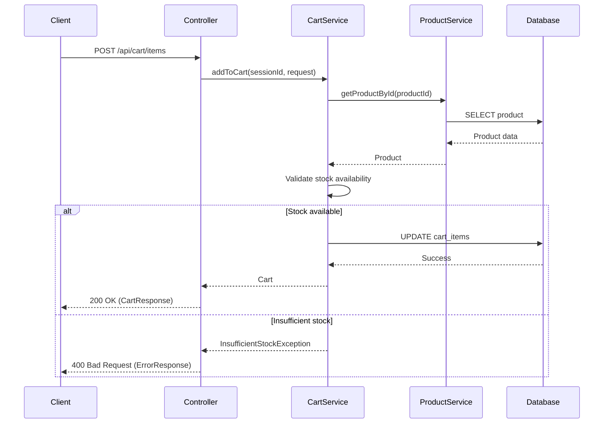
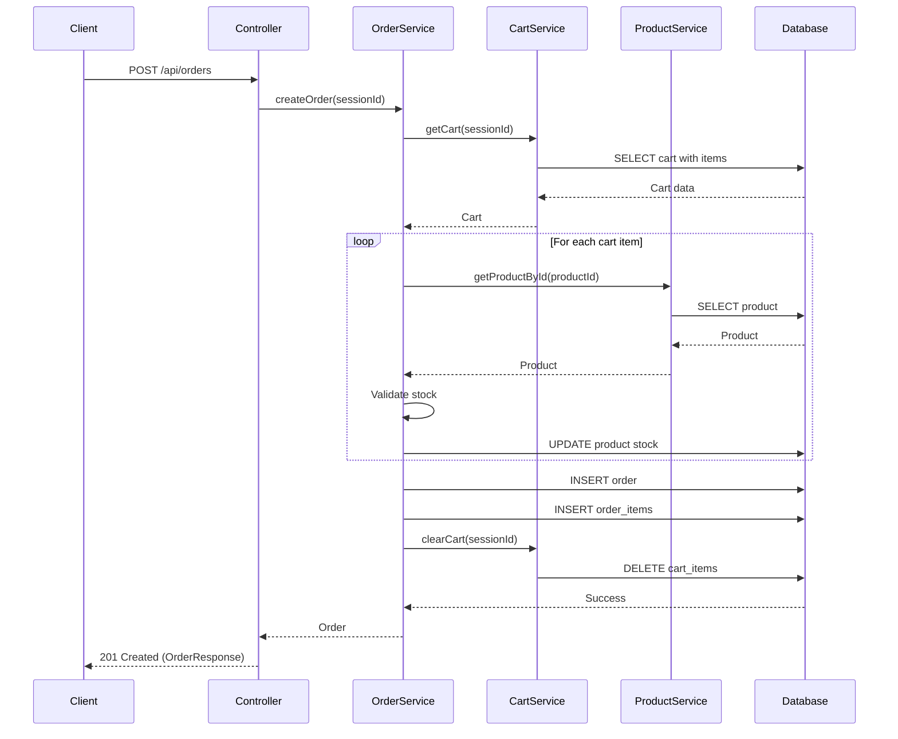

## 16. Cross-Browser Compatibility

### 16.1 Supported Browsers

| Browser | Minimum Version | Notes |
|---------|----------------|-------|
| Chrome | 90+ | Full support |
| Firefox | 88+ | Full support |
| Safari | 14+ | Full support |
| Edge | 90+ | Full support |
| Opera | 76+ | Full support |
| Samsung Internet | 14+ | Mobile support |

### 16.2 Polyfills and Fallbacks

```javascript
// Feature Detection
if (!window.fetch) {
  // Load fetch polyfill
  loadScript('polyfills/fetch.js');
}

if (!window.Promise) {
  // Load Promise polyfill
  loadScript('polyfills/promise.js');
}

// CSS Feature Detection
if (!CSS.supports('display', 'grid')) {
  document.body.classList.add('no-grid');
  // Fallback to flexbox layout
}

// Intersection Observer Polyfill
if (!('IntersectionObserver' in window)) {
  loadScript('polyfills/intersection-observer.js');
}
```

### 16.3 CSS Vendor Prefixes

```css
/* Flexbox */
.container {
  display: -webkit-box;
  display: -ms-flexbox;
  display: flex;
}

/* Transforms */
.element {
  -webkit-transform: translateX(10px);
  -ms-transform: translateX(10px);
  transform: translateX(10px);
}

/* Transitions */
.button {
  -webkit-transition: all 0.3s ease;
  -o-transition: all 0.3s ease;
  transition: all 0.3s ease;
}

/* Grid (with fallback) */
.grid {
  display: -ms-grid;
  display: grid;
  -ms-grid-columns: 1fr 1fr 1fr;
  grid-template-columns: repeat(3, 1fr);
}
```

### 16.4 Testing Strategy

- **Automated Testing**: BrowserStack, Sauce Labs
- **Manual Testing**: Physical devices and browser versions
- **Accessibility Testing**: WAVE, axe DevTools
- **Performance Testing**: Lighthouse, WebPageTest

## 17. Performance Requirements

### 17.1 Performance Metrics

| Metric | Target | Maximum |
|--------|--------|---------||
| First Contentful Paint (FCP) | < 1.5s | 2.5s |
| Largest Contentful Paint (LCP) | < 2.0s | 3.0s |
| Time to Interactive (TTI) | < 3.0s | 5.0s |
| First Input Delay (FID) | < 100ms | 300ms |
| Cumulative Layout Shift (CLS) | < 0.1 | 0.25 |
| Total Blocking Time (TBT) | < 200ms | 600ms |

### 17.2 Backend Performance

```java
// Database Query Optimization
@Query("SELECT p FROM Product p WHERE p.active = true AND p.stockQuantity > 0")
Page<Product> findAvailableProducts(Pageable pageable);

// Caching Strategy
@Cacheable(value = "products", key = "#id")
public Product getProductById(Long id) {
    return productRepository.findById(id)
        .orElseThrow(() -> new ProductNotFoundException("Product not found"));
}

@CacheEvict(value = "products", key = "#product.id")
public Product updateProduct(Product product) {
    return productRepository.save(product);
}

// Connection Pool Configuration
spring.datasource.hikari.maximum-pool-size=20
spring.datasource.hikari.minimum-idle=5
spring.datasource.hikari.connection-timeout=30000
spring.datasource.hikari.idle-timeout=600000
spring.datasource.hikari.max-lifetime=1800000
```

### 17.3 Frontend Performance

```javascript
// Code Splitting
const ProductList = lazy(() => import('./components/ProductList'));
const Cart = lazy(() => import('./components/Cart'));
const Checkout = lazy(() => import('./components/Checkout'));

// Image Optimization


// API Request Debouncing
const debouncedSearch = debounce((query) => {
  searchProducts(query);
}, 300);

// Virtual Scrolling for Large Lists
<VirtualList
  items={products}
  itemHeight={200}
  renderItem={(product) => <ProductCard product={product} />}
/>
```

### 17.4 Caching Strategy

```
Cache-Control Headers:
- Static Assets: max-age=31536000, immutable
- API Responses: max-age=300, must-revalidate
- HTML Pages: no-cache, must-revalidate

Service Worker Caching:
- Cache-First: Images, fonts, CSS, JS
- Network-First: API calls, dynamic content
- Stale-While-Revalidate: Product listings
```

## 18. API Sequence Flows

### 18.1 Add to Cart Flow



### 18.2 Create Order Flow



## 19. Epic Features

### 19.1 Epic 1: Product Catalog Management

**User Stories:**
1. As a customer, I want to browse products by category so that I can find items I'm interested in
2. As a customer, I want to search for products by name so that I can quickly find specific items
3. As a customer, I want to see product details including price and availability so that I can make informed decisions
4. As an admin, I want to add new products to the catalog so that customers can purchase them
5. As an admin, I want to update product information so that the catalog stays current

**Acceptance Criteria:**
- Product listing displays with pagination (20 items per page)
- Category filtering works correctly
- Search returns relevant results within 2 seconds
- Product details show accurate stock levels
- Admin can CRUD products through API

### 19.2 Epic 2: Shopping Cart Operations

**User Stories:**
1. As a customer, I want to add products to my cart so that I can purchase multiple items
2. As a customer, I want to update quantities in my cart so that I can adjust my order
3. As a customer, I want to remove items from my cart so that I can change my mind
4. As a customer, I want to see my cart total so that I know how much I'll spend
5. As a customer, I want my cart to persist across sessions so that I don't lose my selections

**Acceptance Criteria:**
- Cart operations complete within 1 second
- Real-time inventory validation on all cart operations
- Cart persists for 30 days
- Cart displays accurate totals
- Stock validation prevents over-ordering

### 19.3 Epic 3: Order Processing

**User Stories:**
1. As a customer, I want to create an order from my cart so that I can complete my purchase
2. As a customer, I want to receive order confirmation so that I know my order was successful
3. As a customer, I want to see my order history so that I can track past purchases
4. As an admin, I want to view all orders so that I can manage fulfillment
5. As an admin, I want to update order status so that customers know their order progress

**Acceptance Criteria:**
- Order creation validates all items in real-time
- Stock is reserved atomically during order creation
- Order confirmation includes order number and details
- Order history shows all past orders
- Order status updates trigger notifications

### 19.4 Epic 4: Inventory Management

**User Stories:**
1. As an admin, I want to set minimum procurement thresholds so that stock is automatically reordered
2. As an admin, I want to receive alerts when stock is low so that I can take action
3. As an admin, I want to update stock quantities so that inventory stays accurate
4. As a system, I want to prevent overselling so that customers don't order unavailable items
5. As a system, I want to track inventory changes so that there's an audit trail

**Acceptance Criteria:**
- Procurement alerts trigger when stock <= threshold
- Stock updates are atomic and consistent
- Overselling is prevented through database constraints
- Inventory audit log captures all changes
- Real-time stock updates reflect across all sessions

### 19.5 Epic 5: User Experience Enhancements

**User Stories:**
1. As a customer, I want real-time stock updates so that I know current availability
2. As a customer, I want responsive design so that I can shop on any device
3. As a customer, I want accessible interfaces so that everyone can use the system
4. As a customer, I want fast page loads so that I have a smooth experience
5. As a customer, I want clear error messages so that I understand what went wrong

**Acceptance Criteria:**
- WebSocket updates push stock changes in real-time
- UI works on mobile, tablet, and desktop
- WCAG 2.1 AA compliance achieved
- Page load times under 3 seconds
- Error messages include actionable suggestions

## 20. Configuration

### 20.1 Application Properties

```properties
# Application Configuration
spring.application.name=ecommerce-product-management
server.port=8080

# Database Configuration
spring.datasource.url=jdbc:postgresql://localhost:5432/ecommerce
spring.datasource.username=${DB_USERNAME}
spring.datasource.password=${DB_PASSWORD}
spring.datasource.driver-class-name=org.postgresql.Driver

# JPA Configuration
spring.jpa.hibernate.ddl-auto=validate
spring.jpa.show-sql=false
spring.jpa.properties.hibernate.dialect=org.hibernate.dialect.PostgreSQLDialect
spring.jpa.properties.hibernate.format_sql=true

# Logging Configuration
logging.level.root=INFO
logging.level.com.ecommerce.productmanagement=DEBUG
logging.pattern.console=%d{yyyy-MM-dd HH:mm:ss} - %msg%n

# Session Configuration
server.servlet.session.timeout=30m
server.servlet.session.cookie.http-only=true
server.servlet.session.cookie.secure=true

# API Documentation
springdoc.api-docs.path=/api-docs
springdoc.swagger-ui.path=/swagger-ui.html
```

### 20.2 Swagger Configuration

```java
package com.ecommerce.productmanagement.config;

import io.swagger.v3.oas.models.OpenAPI;
import io.swagger.v3.oas.models.info.Info;
import io.swagger.v3.oas.models.info.Contact;
import org.springframework.context.annotation.Bean;
import org.springframework.context.annotation.Configuration;

@Configuration
public class SwaggerConfig {
    
    @Bean
    public OpenAPI customOpenAPI() {
        return new OpenAPI()
                .info(new Info()
                        .title("E-commerce Product Management API")
                        .version("1.0.0")
                        .description("REST API for managing products, shopping cart, and orders")
                        .contact(new Contact()
                                .name("Development Team")
                                .email("dev@ecommerce.com")));
    }
}
```

## 21. Testing Strategy

### 21.1 Unit Tests

```java
package com.ecommerce.productmanagement.service;

import com.ecommerce.productmanagement.entity.Product;
import com.ecommerce.productmanagement.exception.ProductNotFoundException;
import com.ecommerce.productmanagement.repository.ProductRepository;
import org.junit.jupiter.api.Test;
import org.junit.jupiter.api.extension.ExtendWith;
import org.mockito.InjectMocks;
import org.mockito.Mock;
import org.mockito.junit.jupiter.MockitoExtension;

import java.math.BigDecimal;
import java.util.Optional;

import static org.junit.jupiter.api.Assertions.*;
import static org.mockito.Mockito.*;

@ExtendWith(MockitoExtension.class)
class ProductServiceTest {
    
    @Mock
    private ProductRepository productRepository;
    
    @InjectMocks
    private ProductService productService;
    
    @Test
    void getProductById_WhenProductExists_ReturnsProduct() {
        // Arrange
        Long productId = 1L;
        Product product = new Product();
        product.setId(productId);
        product.setName("Test Product");
        product.setPrice(BigDecimal.valueOf(99.99));
        
        when(productRepository.findById(productId)).thenReturn(Optional.of(product));
        
        // Act
        Product result = productService.getProductById(productId);
        
        // Assert
        assertNotNull(result);
        assertEquals(productId, result.getId());
        assertEquals("Test Product", result.getName());
        verify(productRepository, times(1)).findById(productId);
    }
    
    @Test
    void getProductById_WhenProductNotExists_ThrowsException() {
        // Arrange
        Long productId = 999L;
        when(productRepository.findById(productId)).thenReturn(Optional.empty());
        
        // Act & Assert
        assertThrows(ProductNotFoundException.class, () -> {
            productService.getProductById(productId);
        });
        verify(productRepository, times(1)).findById(productId);
    }
}
```

### 21.2 Integration Tests

```java
package com.ecommerce.productmanagement.controller;

import com.ecommerce.productmanagement.entity.Product;
import com.ecommerce.productmanagement.repository.ProductRepository;
import org.junit.jupiter.api.Test;
import org.springframework.beans.factory.annotation.Autowired;
import org.springframework.boot.test.autoconfigure.web.servlet.AutoConfigureMockMvc;
import org.springframework.boot.test.context.SpringBootTest;
import org.springframework.http.MediaType;
import org.springframework.test.web.servlet.MockMvc;
import org.springframework.transaction.annotation.Transactional;

import java.math.BigDecimal;

import static org.springframework.test.web.servlet.request.MockMvcRequestBuilders.*;
import static org.springframework.test.web.servlet.result.MockMvcResultMatchers.*;

@SpringBootTest
@AutoConfigureMockMvc
@Transactional
class ProductControllerIntegrationTest {
    
    @Autowired
    private MockMvc mockMvc;
    
    @Autowired
    private ProductRepository productRepository;
    
    @Test
    void getAllProducts_ReturnsProductList() throws Exception {
        // Arrange
        Product product = new Product();
        product.setName("Test Product");
        product.setPrice(BigDecimal.valueOf(99.99));
        product.setStockQuantity(10);
        product.setActive(true);
        productRepository.save(product);
        
        // Act & Assert
        mockMvc.perform(get("/api/products")
                .contentType(MediaType.APPLICATION_JSON))
                .andExpect(status().isOk())
                .andExpect(jsonPath("$.content").isArray())
                .andExpect(jsonPath("$.content[0].name").value("Test Product"));
    }
}
```
