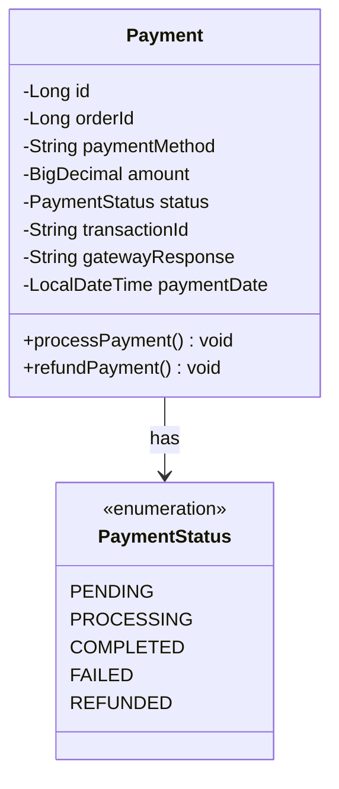
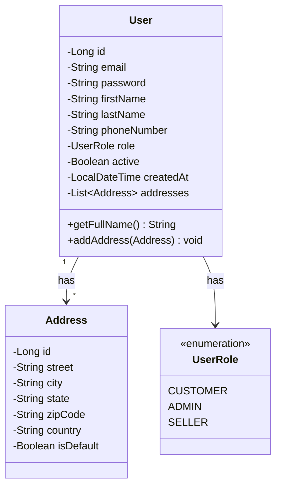

## 6. Payment Processing

### 6.1 Payment Entity



### 6.2 Payment Entity Implementation

```java
package com.ecommerce.payment.entity;

import jakarta.persistence.*;
import lombok.AllArgsConstructor;
import lombok.Builder;
import lombok.Data;
import lombok.NoArgsConstructor;
import java.math.BigDecimal;
import java.time.LocalDateTime;

@Entity
@Table(name = "payments", indexes = {
    @Index(name = "idx_payment_order", columnList = "order_id"),
    @Index(name = "idx_payment_transaction", columnList = "transaction_id", unique = true)
})
@Data
@Builder
@NoArgsConstructor
@AllArgsConstructor
public class Payment {
    
    @Id
    @GeneratedValue(strategy = GenerationType.IDENTITY)
    private Long id;
    
    @Column(name = "order_id", nullable = false)
    private Long orderId;
    
    @Column(name = "payment_method", nullable = false)
    private String paymentMethod;
    
    @Column(nullable = false, precision = 10, scale = 2)
    private BigDecimal amount;
    
    @Enumerated(EnumType.STRING)
    @Column(nullable = false)
    private PaymentStatus status;
    
    @Column(name = "transaction_id", unique = true)
    private String transactionId;
    
    @Column(name = "gateway_response", columnDefinition = "TEXT")
    private String gatewayResponse;
    
    @Column(name = "payment_date")
    private LocalDateTime paymentDate;
    
    @Column(name = "created_at", nullable = false, updatable = false)
    private LocalDateTime createdAt;
    
    @PrePersist
    protected void onCreate() {
        createdAt = LocalDateTime.now();
        status = PaymentStatus.PENDING;
    }
}

enum PaymentStatus {
    PENDING,
    PROCESSING,
    COMPLETED,
    FAILED,
    REFUNDED
}
```

### 6.3 Payment Service Implementation

```java
package com.ecommerce.payment.service.impl;

import com.ecommerce.payment.dto.PaymentRequest;
import com.ecommerce.payment.dto.PaymentResponse;
import com.ecommerce.payment.entity.Payment;
import com.ecommerce.payment.entity.PaymentStatus;
import com.ecommerce.payment.gateway.PaymentGateway;
import com.ecommerce.payment.gateway.PaymentGatewayFactory;
import com.ecommerce.payment.mapper.PaymentMapper;
import com.ecommerce.payment.repository.PaymentRepository;
import com.ecommerce.payment.service.PaymentService;
import com.ecommerce.order.entity.Order;
import com.ecommerce.order.repository.OrderRepository;
import lombok.RequiredArgsConstructor;
import lombok.extern.slf4j.Slf4j;
import org.springframework.stereotype.Service;
import org.springframework.transaction.annotation.Transactional;
import java.time.LocalDateTime;
import java.util.UUID;

@Service
@RequiredArgsConstructor
@Slf4j
public class PaymentServiceImpl implements PaymentService {
    
    private final PaymentRepository paymentRepository;
    private final OrderRepository orderRepository;
    private final PaymentGatewayFactory gatewayFactory;
    private final PaymentMapper paymentMapper;
    
    @Override
    @Transactional
    public PaymentResponse processPayment(PaymentRequest paymentRequest) {
        log.info("Processing payment for order {}", paymentRequest.getOrderId());
        
        Order order = orderRepository.findById(paymentRequest.getOrderId())
                .orElseThrow(() -> new IllegalArgumentException("Order not found"));
        
        Payment payment = Payment.builder()
                .orderId(order.getId())
                .paymentMethod(paymentRequest.getPaymentMethod())
                .amount(order.getGrandTotal())
                .transactionId(generateTransactionId())
                .build();
        
        payment.setStatus(PaymentStatus.PROCESSING);
        Payment savedPayment = paymentRepository.save(payment);
        
        try {
            PaymentGateway gateway = gatewayFactory.getGateway(paymentRequest.getPaymentMethod());
            String gatewayResponse = gateway.processPayment(paymentRequest, order.getGrandTotal());
            
            savedPayment.setStatus(PaymentStatus.COMPLETED);
            savedPayment.setGatewayResponse(gatewayResponse);
            savedPayment.setPaymentDate(LocalDateTime.now());
            
            log.info("Payment processed successfully for order {}", order.getId());
        } catch (Exception e) {
            log.error("Payment processing failed for order {}", order.getId(), e);
            savedPayment.setStatus(PaymentStatus.FAILED);
            savedPayment.setGatewayResponse(e.getMessage());
        }
        
        Payment finalPayment = paymentRepository.save(savedPayment);
        return paymentMapper.toResponse(finalPayment);
    }
    
    @Override
    @Transactional
    public PaymentResponse refundPayment(Long paymentId) {
        log.info("Processing refund for payment {}", paymentId);
        
        Payment payment = paymentRepository.findById(paymentId)
                .orElseThrow(() -> new IllegalArgumentException("Payment not found"));
        
        if (payment.getStatus() != PaymentStatus.COMPLETED) {
            throw new IllegalStateException("Can only refund completed payments");
        }
        
        try {
            PaymentGateway gateway = gatewayFactory.getGateway(payment.getPaymentMethod());
            gateway.refundPayment(payment.getTransactionId(), payment.getAmount());
            
            payment.setStatus(PaymentStatus.REFUNDED);
            log.info("Refund processed successfully for payment {}", paymentId);
        } catch (Exception e) {
            log.error("Refund processing failed for payment {}", paymentId, e);
            throw new RuntimeException("Refund failed: " + e.getMessage());
        }
        
        Payment refundedPayment = paymentRepository.save(payment);
        return paymentMapper.toResponse(refundedPayment);
    }
    
    @Override
    public PaymentResponse getPaymentByOrderId(Long orderId) {
        Payment payment = paymentRepository.findByOrderId(orderId)
                .orElseThrow(() -> new IllegalArgumentException("Payment not found for order"));
        return paymentMapper.toResponse(payment);
    }
    
    private String generateTransactionId() {
        return "TXN-" + UUID.randomUUID().toString().substring(0, 12).toUpperCase();
    }
}
```

### 6.4 Payment Gateway Interface

```java
package com.ecommerce.payment.gateway;

import com.ecommerce.payment.dto.PaymentRequest;
import java.math.BigDecimal;

public interface PaymentGateway {
    String processPayment(PaymentRequest request, BigDecimal amount);
    void refundPayment(String transactionId, BigDecimal amount);
    String getGatewayName();
}

@Component
class PaymentGatewayFactory {
    
    private final Map<String, PaymentGateway> gateways;
    
    public PaymentGatewayFactory(List<PaymentGateway> gatewayList) {
        this.gateways = gatewayList.stream()
                .collect(Collectors.toMap(
                        PaymentGateway::getGatewayName,
                        gateway -> gateway
                ));
    }
    
    public PaymentGateway getGateway(String paymentMethod) {
        PaymentGateway gateway = gateways.get(paymentMethod);
        if (gateway == null) {
            throw new IllegalArgumentException("Unsupported payment method: " + paymentMethod);
        }
        return gateway;
    }
}
```

## 7. User Management

### 7.1 User Entity



### 7.2 User Entity Implementation

```java
package com.ecommerce.user.entity;

import jakarta.persistence.*;
import lombok.AllArgsConstructor;
import lombok.Builder;
import lombok.Data;
import lombok.NoArgsConstructor;
import java.time.LocalDateTime;
import java.util.ArrayList;
import java.util.List;

@Entity
@Table(name = "users", indexes = {
    @Index(name = "idx_user_email", columnList = "email", unique = true)
})
@Data
@Builder
@NoArgsConstructor
@AllArgsConstructor
public class User {
    
    @Id
    @GeneratedValue(strategy = GenerationType.IDENTITY)
    private Long id;
    
    @Column(unique = true, nullable = false)
    private String email;
    
    @Column(nullable = false)
    private String password;
    
    @Column(name = "first_name", nullable = false)
    private String firstName;
    
    @Column(name = "last_name", nullable = false)
    private String lastName;
    
    @Column(name = "phone_number")
    private String phoneNumber;
    
    @Enumerated(EnumType.STRING)
    @Column(nullable = false)
    private UserRole role;
    
    @Column(nullable = false)
    private Boolean active = true;
    
    @Column(name = "created_at", nullable = false, updatable = false)
    private LocalDateTime createdAt;
    
    @OneToMany(mappedBy = "user", cascade = CascadeType.ALL, orphanRemoval = true)
    @Builder.Default
    private List<Address> addresses = new ArrayList<>();
    
    @PrePersist
    protected void onCreate() {
        createdAt = LocalDateTime.now();
    }
    
    public String getFullName() {
        return firstName + " " + lastName;
    }
    
    public void addAddress(Address address) {
        addresses.add(address);
        address.setUser(this);
    }
}

@Entity
@Table(name = "addresses")
@Data
@Builder
@NoArgsConstructor
@AllArgsConstructor
class Address {
    
    @Id
    @GeneratedValue(strategy = GenerationType.IDENTITY)
    private Long id;
    
    @ManyToOne(fetch = FetchType.LAZY)
    @JoinColumn(name = "user_id", nullable = false)
    private User user;
    
    @Column(nullable = false)
    private String street;
    
    @Column(nullable = false)
    private String city;
    
    @Column(nullable = false)
    private String state;
    
    @Column(name = "zip_code", nullable = false)
    private String zipCode;
    
    @Column(nullable = false)
    private String country;
    
    @Column(name = "is_default")
    private Boolean isDefault = false;
}

enum UserRole {
    CUSTOMER,
    ADMIN,
    SELLER
}
```

### 7.3 User Service Implementation

```java
package com.ecommerce.user.service.impl;

import com.ecommerce.user.dto.UserRegistrationRequest;
import com.ecommerce.user.dto.UserResponse;
import com.ecommerce.user.entity.User;
import com.ecommerce.user.entity.UserRole;
import com.ecommerce.user.mapper.UserMapper;
import com.ecommerce.user.repository.UserRepository;
import com.ecommerce.user.service.UserService;
import lombok.RequiredArgsConstructor;
import lombok.extern.slf4j.Slf4j;
import org.springframework.security.crypto.password.PasswordEncoder;
import org.springframework.stereotype.Service;
import org.springframework.transaction.annotation.Transactional;

@Service
@RequiredArgsConstructor
@Slf4j
public class UserServiceImpl implements UserService {
    
    private final UserRepository userRepository;
    private final PasswordEncoder passwordEncoder;
    private final UserMapper userMapper;
    
    @Override
    @Transactional
    public UserResponse registerUser(UserRegistrationRequest request) {
        log.info("Registering new user: {}", request.getEmail());
        
        if (userRepository.existsByEmail(request.getEmail())) {
            throw new IllegalArgumentException("Email already registered");
        }
        
        User user = User.builder()
                .email(request.getEmail())
                .password(passwordEncoder.encode(request.getPassword()))
                .firstName(request.getFirstName())
                .lastName(request.getLastName())
                .phoneNumber(request.getPhoneNumber())
                .role(UserRole.CUSTOMER)
                .build();
        
        User savedUser = userRepository.save(user);
        log.info("User registered successfully: {}", savedUser.getEmail());
        return userMapper.toResponse(savedUser);
    }
    
    @Override
    public UserResponse getUserById(Long userId) {
        User user = userRepository.findById(userId)
                .orElseThrow(() -> new IllegalArgumentException("User not found"));
        return userMapper.toResponse(user);
    }
    
    @Override
    public UserResponse getUserByEmail(String email) {
        User user = userRepository.findByEmail(email)
                .orElseThrow(() -> new IllegalArgumentException("User not found"));
        return userMapper.toResponse(user);
    }
}
```
