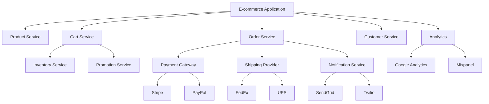

## 26. Security Requirements

**Requirement Reference:** Epic SCRUM-344 & Story SCRUM-343

### 26.1 Authentication & Authorization

1. **User Authentication**
   - JWT-based authentication
   - Token expiration: 24 hours
   - Refresh token mechanism
   - Multi-factor authentication (optional)
   - Password complexity requirements
   - Account lockout after failed attempts

2. **Authorization**
   - Role-based access control (RBAC)
   - Customer can access only their own data
   - Admin roles: ADMIN, MANAGER, SUPPORT
   - API endpoint authorization
   - Resource-level permissions

### 26.2 Data Security

1. **Encryption**
   - TLS 1.3 for data in transit
   - AES-256 encryption for sensitive data at rest
   - Database encryption enabled
   - Encrypted backups

2. **Payment Security**
   - PCI DSS Level 1 compliance
   - No storage of full card numbers
   - Payment tokenization
   - 3D Secure authentication
   - Fraud detection and prevention

3. **Personal Data Protection**
   - GDPR compliance
   - Data minimization principle
   - Right to erasure support
   - Data portability
   - Privacy by design

### 26.3 Application Security

1. **Input Validation**
   - Server-side validation for all inputs
   - SQL injection prevention
   - XSS protection
   - CSRF protection
   - Request size limits

2. **Session Management**
   - Secure session handling
   - Session timeout: 30 minutes inactivity
   - Session invalidation on logout
   - Concurrent session limits

3. **API Security**
   - Rate limiting: 100 requests/minute per user
   - API key authentication for integrations
   - Request signing for sensitive operations
   - IP whitelisting for admin APIs

### 26.4 Monitoring & Auditing

1. **Security Monitoring**
   - Real-time threat detection
   - Suspicious activity alerts
   - Failed login attempt tracking
   - Unusual transaction patterns

2. **Audit Logging**
   - All security events logged
   - User actions tracked
   - Data access logs
   - Log retention: 1 year
   - Tamper-proof logging

## 27. Integration Points

**Requirement Reference:** Story SCRUM-343

### 27.1 Internal Integrations

1. **Product Service Integration**
   - Real-time product data retrieval
   - Stock availability checks
   - Price updates
   - Product image URLs

2. **Inventory Service Integration**
   - Stock reservation
   - Stock release
   - Stock level updates
   - Low stock notifications

3. **Customer Service Integration**
   - Customer profile data
   - Customer preferences
   - Customer history
   - Loyalty points

4. **Order Service Integration**
   - Order creation from cart
   - Order status updates
   - Order history
   - Return processing

### 27.2 External Integrations

1. **Payment Gateway Integration**
   - **Stripe API**
     - Payment processing
     - Refund processing
     - Webhook for payment events
     - Customer payment methods
   
   - **PayPal API**
     - PayPal checkout
     - Express checkout
     - Subscription billing
     - Dispute management

2. **Shipping Provider Integration**
   - **FedEx API**
     - Rate calculation
     - Label generation
     - Tracking updates
     - Delivery confirmation
   
   - **UPS API**
     - Shipping rates
     - Address validation
     - Tracking information
     - Pickup scheduling

3. **Notification Service Integration**
   - **SendGrid API** (Email)
     - Transactional emails
     - Marketing emails
     - Email templates
     - Delivery tracking
   
   - **Twilio API** (SMS)
     - SMS notifications
     - Two-factor authentication
     - Delivery receipts

4. **Analytics Integration**
   - **Google Analytics**
     - E-commerce tracking
     - Conversion tracking
     - User behavior analysis
   
   - **Mixpanel**
     - Event tracking
     - Funnel analysis
     - Cohort analysis

### 27.3 Integration Architecture

### 27.4 Integration Patterns

1. **Synchronous Integration**
   - REST API calls for real-time operations
   - Timeout handling: 30 seconds
   - Retry mechanism: 3 attempts with exponential backoff
   - Circuit breaker pattern for fault tolerance

2. **Asynchronous Integration**
   - Message queues for non-critical operations
   - Event-driven architecture for notifications
   - Webhook support for external events
   - Dead letter queue for failed messages

3. **Data Synchronization**
   - Scheduled batch jobs for data sync
   - Change data capture for real-time sync
   - Conflict resolution strategies
   - Data consistency checks

## 28. Deployment Architecture

### 28.1 Infrastructure

- **Cloud Provider:** AWS
- **Compute:** EC2 instances with auto-scaling
- **Database:** RDS PostgreSQL with read replicas
- **Cache:** ElastiCache Redis cluster
- **Load Balancer:** Application Load Balancer
- **CDN:** CloudFront for static assets
- **Storage:** S3 for file storage

### 28.2 Environments

1. **Development:** Local development environment
2. **Testing:** Automated testing environment
3. **Staging:** Pre-production environment
4. **Production:** Live production environment

### 28.3 CI/CD Pipeline

- Source control: Git (GitHub/GitLab)
- CI/CD: Jenkins/GitHub Actions
- Automated testing: Unit, integration, E2E tests
- Code quality: SonarQube
- Security scanning: OWASP dependency check
- Deployment: Blue-green deployment strategy

## 29. Monitoring & Observability

### 29.1 Application Monitoring

- **APM:** New Relic/Datadog for application performance
- **Logging:** ELK Stack (Elasticsearch, Logstash, Kibana)
- **Metrics:** Prometheus + Grafana
- **Alerting:** PagerDuty for critical alerts

### 29.2 Key Metrics

1. **Performance Metrics**
   - API response time (p50, p95, p99)
   - Database query performance
   - Cache hit ratio
   - Error rates

2. **Business Metrics**
   - Cart abandonment rate
   - Conversion rate
   - Average order value
   - Customer lifetime value

3. **Infrastructure Metrics**
   - CPU utilization
   - Memory usage
   - Disk I/O
   - Network throughput

## 30. Disaster Recovery

### 30.1 Backup Strategy

- **Database Backups:** Daily full backups, hourly incremental
- **Retention:** 30 days for daily, 7 days for hourly
- **Backup Location:** Cross-region replication
- **Backup Testing:** Monthly restore tests

### 30.2 Recovery Procedures

- **RTO (Recovery Time Objective):** 4 hours
- **RPO (Recovery Point Objective):** 1 hour
- **Failover:** Automated failover to standby region
- **Data Recovery:** Point-in-time recovery capability

## 31. Compliance & Regulations

### 31.1 Data Privacy

- **GDPR:** EU data protection compliance
- **CCPA:** California privacy compliance
- **Data residency:** Region-specific data storage
- **Privacy policy:** Clear and accessible

### 31.2 Payment Compliance

- **PCI DSS:** Payment card industry standards
- **Strong Customer Authentication:** EU SCA compliance
- **Payment data handling:** Tokenization and encryption

### 31.3 Accessibility

- **WCAG 2.1:** Level AA compliance
- **Screen reader support:** Full accessibility
- **Keyboard navigation:** Complete keyboard support
- **Color contrast:** Meets accessibility standards

---

**Document Version:** 2.0  
**Last Updated:** 2024  
**Author:** Engineering Team  
**Status:** Active