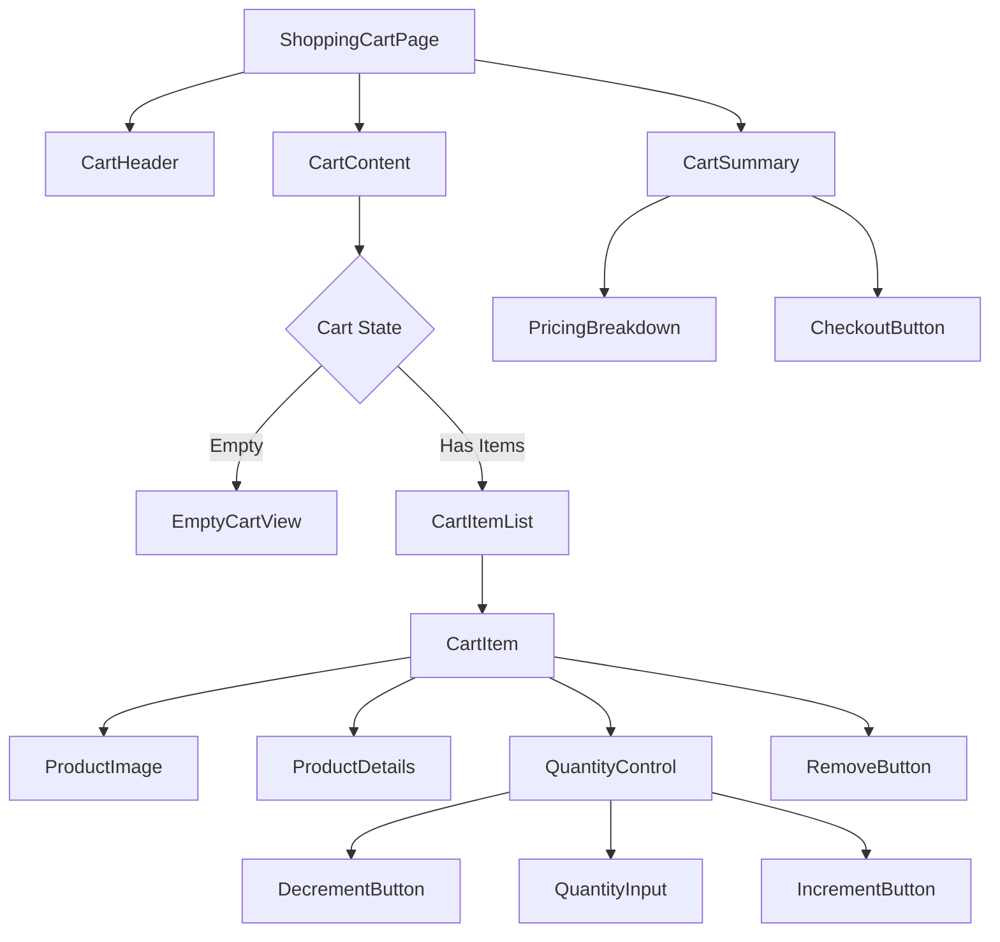

## 13. Frontend Component Architecture

**Requirement Reference:** Story SCRUM-343: all acceptance criteria for cart UI interactions

### 13.1 Component Hierarchy



### 13.2 Component Specifications

#### ShoppingCartPage Component
**Responsibility:** Root container for shopping cart functionality

**Props:** None (fetches cart data internally)

**State:**
```typescript
interface CartPageState {
  cart: Cart | null;
  loading: boolean;
  error: string | null;
}
```

**Lifecycle:**
- `componentDidMount` / `useEffect`: Fetch cart data
- Handle loading and error states
- Provide cart context to child components

#### CartItem Component
**Responsibility:** Display individual cart item with all interactions

**Props:**
```typescript
interface CartItemProps {
  item: CartItem;
  onQuantityChange: (itemId: string, quantity: number) => Promise<void>;
  onRemove: (itemId: string) => Promise<void>;
}

interface CartItem {
  itemId: string;
  productId: number;
  productName: string;
  productImageUrl: string;
  productSku: string;
  productUrl: string;
  unitPrice: number;
  quantity: number;
  subtotal: number;
  availabilityStatus: 'in_stock' | 'low_stock' | 'out_of_stock';
}
```

**Component Structure:**
```jsx
const CartItem = ({ item, onQuantityChange, onRemove }) => {
  const [isUpdating, setIsUpdating] = useState(false);
  
  return (
    <div className="cart-item">
      <ProductImage src={item.productImageUrl} alt={item.productName} />
      <ProductDetails 
        name={item.productName}
        sku={item.productSku}
        url={item.productUrl}
        price={item.unitPrice}
        availability={item.availabilityStatus}
      />
      <QuantityControl
        quantity={item.quantity}
        onChange={(qty) => onQuantityChange(item.itemId, qty)}
        disabled={isUpdating}
      />
      <div className="item-subtotal">${item.subtotal.toFixed(2)}</div>
      <RemoveButton 
        onClick={() => onRemove(item.itemId)}
        disabled={isUpdating}
      />
    </div>
  );
};
```

#### QuantityControl Component
**Responsibility:** Manage item quantity with increment/decrement buttons and direct input

**Props:**
```typescript
interface QuantityControlProps {
  quantity: number;
  min?: number; // default: 1
  max?: number; // default: 99
  onChange: (quantity: number) => void;
  disabled?: boolean;
}
```

**Features:**
- **Increment Button (+):** Increase quantity by 1 (max: 99 or stock limit)
- **Decrement Button (-):** Decrease quantity by 1 (min: 1)
- **Direct Input:** Allow manual quantity entry with validation
- **Debounced Updates:** 500ms delay before triggering onChange
- **Loading State:** Disable controls during API call

**Component Structure:**
```jsx
const QuantityControl = ({ quantity, min = 1, max = 99, onChange, disabled }) => {
  const [localQuantity, setLocalQuantity] = useState(quantity);
  const debouncedOnChange = useDebouncedCallback(onChange, 500);
  
  const handleIncrement = () => {
    if (localQuantity < max) {
      const newQty = localQuantity + 1;
      setLocalQuantity(newQty);
      debouncedOnChange(newQty);
    }
  };
  
  const handleDecrement = () => {
    if (localQuantity > min) {
      const newQty = localQuantity - 1;
      setLocalQuantity(newQty);
      debouncedOnChange(newQty);
    }
  };
  
  const handleInputChange = (e) => {
    const value = parseInt(e.target.value, 10);
    if (!isNaN(value) && value >= min && value <= max) {
      setLocalQuantity(value);
      debouncedOnChange(value);
    }
  };
  
  return (
    <div className="quantity-control">
      <button onClick={handleDecrement} disabled={disabled || localQuantity <= min}>-</button>
      <input 
        type="number" 
        value={localQuantity} 
        onChange={handleInputChange}
        min={min}
        max={max}
        disabled={disabled}
      />
      <button onClick={handleIncrement} disabled={disabled || localQuantity >= max}>+</button>
    </div>
  );
};
```

#### CartSummary Component
**Responsibility:** Display pricing breakdown and checkout button

**Props:**
```typescript
interface CartSummaryProps {
  cart: Cart;
  onCheckout: () => void;
}

interface Cart {
  itemsSubtotal: number;
  appliedDiscounts: number;
  subtotalAfterDiscounts: number;
  estimatedShipping: number;
  estimatedTax: number;
  orderTotal: number;
  disclaimer: string;
  itemCount: number;
}
```

**Pricing Breakdown Display:**
```jsx
const CartSummary = ({ cart, onCheckout }) => {
  return (
    <div className="cart-summary">
      <h3>Order Summary</h3>
      <div className="pricing-breakdown">
        <div className="price-row">
          <span>Subtotal ({cart.itemCount} items)</span>
          <span>${cart.itemsSubtotal.toFixed(2)}</span>
        </div>
        {cart.appliedDiscounts > 0 && (
          <div className="price-row discount">
            <span>Discounts</span>
            <span>-${cart.appliedDiscounts.toFixed(2)}</span>
          </div>
        )}
        <div className="price-row">
          <span>Estimated Shipping</span>
          <span>${cart.estimatedShipping.toFixed(2)}</span>
        </div>
        <div className="price-row">
          <span>Estimated Tax</span>
          <span>${cart.estimatedTax.toFixed(2)}</span>
        </div>
        <div className="price-row total">
          <span>Order Total</span>
          <span>${cart.orderTotal.toFixed(2)}</span>
        </div>
      </div>
      <p className="disclaimer">{cart.disclaimer}</p>
      <button className="btn-checkout" onClick={onCheckout}>
        Proceed to Checkout
      </button>
    </div>
  );
};
```

#### AddToCartButton Component
**Responsibility:** Add product to cart from product detail/listing pages

**Props:**
```typescript
interface AddToCartButtonProps {
  productId: number;
  quantity?: number; // default: 1
  onSuccess?: () => void;
  onError?: (error: string) => void;
}
```

**Loading States:**
- **Idle:** "Add to Cart" text, enabled
- **Loading:** "Adding..." text with spinner, disabled
- **Success:** "Added!" text with checkmark, brief display then reset
- **Error:** "Try Again" text, enabled

**Component Structure:**
```jsx
const AddToCartButton = ({ productId, quantity = 1, onSuccess, onError }) => {
  const [status, setStatus] = useState('idle'); // 'idle' | 'loading' | 'success' | 'error'
  
  const handleAddToCart = async () => {
    setStatus('loading');
    try {
      await cartApi.addItem({ productId, quantity });
      setStatus('success');
      onSuccess?.();
      setTimeout(() => setStatus('idle'), 2000);
    } catch (error) {
      setStatus('error');
      onError?.(error.message);
      setTimeout(() => setStatus('idle'), 3000);
    }
  };
  
  return (
    <button 
      className={`btn-add-to-cart ${status}`}
      onClick={handleAddToCart}
      disabled={status === 'loading'}
    >
      {status === 'idle' && 'Add to Cart'}
      {status === 'loading' && <><Spinner /> Adding...</>}
      {status === 'success' && <><CheckIcon /> Added!</>}
      {status === 'error' && 'Try Again'}
    </button>
  );
};
```

### 13.3 State Management Strategy

#### Redux Store Structure (if using Redux)
```typescript
interface CartState {
  cart: Cart | null;
  loading: boolean;
  error: string | null;
  lastUpdated: number;
}

// Actions
const cartSlice = createSlice({
  name: 'cart',
  initialState,
  reducers: {
    fetchCartStart: (state) => { state.loading = true; },
    fetchCartSuccess: (state, action) => { 
      state.cart = action.payload; 
      state.loading = false;
      state.lastUpdated = Date.now();
    },
    fetchCartFailure: (state, action) => { 
      state.error = action.payload; 
      state.loading = false; 
    },
    updateItemQuantityOptimistic: (state, action) => {
      // Optimistic update for immediate UI feedback
      const { itemId, quantity } = action.payload;
      const item = state.cart?.items.find(i => i.itemId === itemId);
      if (item) {
        item.quantity = quantity;
        item.subtotal = item.unitPrice * quantity;
        // Recalculate totals
      }
    },
    removeItemOptimistic: (state, action) => {
      // Optimistic removal
      const itemId = action.payload;
      if (state.cart) {
        state.cart.items = state.cart.items.filter(i => i.itemId !== itemId);
        // Recalculate totals
      }
    }
  }
});
```

#### Context API Alternative (if using React Context)
```typescript
const CartContext = createContext<CartContextValue | undefined>(undefined);

interface CartContextValue {
  cart: Cart | null;
  loading: boolean;
  error: string | null;
  addItem: (productId: number, quantity: number) => Promise<void>;
  updateQuantity: (itemId: string, quantity: number) => Promise<void>;
  removeItem: (itemId: string) => Promise<void>;
  refreshCart: () => Promise<void>;
}

const CartProvider = ({ children }) => {
  const [cart, setCart] = useState<Cart | null>(null);
  const [loading, setLoading] = useState(false);
  const [error, setError] = useState<string | null>(null);
  
  // Implementation of cart operations
  
  return (
    <CartContext.Provider value={{ cart, loading, error, addItem, updateQuantity, removeItem, refreshCart }}>
      {children}
    </CartContext.Provider>
  );
};
```

**Description:** Complete frontend component specifications including ShoppingCartPage component hierarchy, CartItem component with quantity controls (+/- buttons, direct input), CartSummary with pricing breakdown, AddToCartButton with loading states, state management strategy (Redux/Context), and component props/interfaces.

**Reason:** Frontend implementation requires clear component structure and interaction specifications for user interface.

## 14. Performance Requirements

**Requirement Reference:** Epic SCRUM-344: comprehensive e-commerce platform

### 14.1 Response Time Targets

| Operation | Target (p95) | Target (p99) | Maximum Acceptable |
|-----------|--------------|--------------|--------------------|
| Add to Cart | < 200ms | < 300ms | 500ms |
| View Cart | < 300ms | < 500ms | 1000ms |
| Update Quantity | < 200ms | < 300ms | 500ms |
| Remove Item | < 150ms | < 250ms | 400ms |
| Calculate Totals | < 50ms | < 100ms | 200ms |

### 14.2 Scalability Requirements

#### Concurrent Users
- **Target:** Support 10,000 concurrent users
- **Peak Load:** 15,000 concurrent users during sales events
- **Degradation Strategy:** Graceful degradation with queue system

#### Cart Constraints
- **Maximum Items per Cart:** 100 items
- **Maximum Quantity per Item:** 99 units
- **Cart Size Limit:** 10 MB (including all metadata)

#### Database Performance
- **Connection Pool:** 50 connections (min: 10, max: 100)
- **Query Timeout:** 5 seconds
- **Transaction Timeout:** 10 seconds

### 14.3 Caching Strategy

#### Redis Cache Configuration

**Cart Data Caching:**
- **Key Pattern:** `cart:{cartId}`
- **TTL:** 15 minutes (sliding expiration)
- **Invalidation:** On any cart modification (add, update, remove)
- **Cache Miss:** Fetch from database and populate cache

**Product Data Caching:**
- **Key Pattern:** `product:{productId}`
- **TTL:** 1 hour
- **Invalidation:** On product update or stock change
- **Purpose:** Reduce database load for product details in cart

**Session Caching:**
- **Key Pattern:** `session:{sessionId}`
- **TTL:** 24 hours (guest users)
- **Invalidation:** On logout or session expiration

#### Cache Implementation
```java
@Service
public class CartCacheService {
    @Autowired
    private RedisTemplate<String, Cart> redisTemplate;
    
    private static final String CART_KEY_PREFIX = "cart:";
    private static final Duration CART_TTL = Duration.ofMinutes(15);
    
    public Optional<Cart> getCart(UUID cartId) {
        String key = CART_KEY_PREFIX + cartId.toString();
        Cart cart = redisTemplate.opsForValue().get(key);
        return Optional.ofNullable(cart);
    }
    
    public void cacheCart(Cart cart) {
        String key = CART_KEY_PREFIX + cart.getCartId().toString();
        redisTemplate.opsForValue().set(key, cart, CART_TTL);
    }
    
    public void invalidateCart(UUID cartId) {
        String key = CART_KEY_PREFIX + cartId.toString();
        redisTemplate.delete(key);
    }
}
```

### 14.4 Optimization Techniques

#### Database Optimization
- **Connection Pooling:** HikariCP with optimized settings
- **Prepared Statements:** All queries use prepared statements
- **Batch Operations:** Bulk insert/update for multiple items
- **Index Usage:** Ensure all queries use appropriate indexes
- **Query Optimization:** Avoid N+1 queries with JOIN FETCH

#### API Optimization
- **Debounced Updates:** Frontend debounces quantity changes (500ms)
- **Optimistic UI Updates:** Immediate UI feedback before API confirmation
- **Request Batching:** Combine multiple operations where possible
- **Compression:** GZIP compression for API responses

#### Frontend Optimization
- **Lazy Loading:** Load cart data only when cart page is accessed
- **Memoization:** Cache computed values (totals, subtotals)
- **Virtual Scrolling:** For carts with many items (>20)
- **Image Optimization:** Lazy load product images, use CDN

### 14.5 Monitoring and Metrics

#### Key Performance Indicators (KPIs)
- **Cart Abandonment Rate:** Track carts not converted to orders
- **Average Cart Value:** Monitor cart total trends
- **Add-to-Cart Success Rate:** Percentage of successful add operations
- **API Response Times:** p50, p95, p99 latencies
- **Cache Hit Rate:** Target >80% for cart data
- **Error Rate:** Target <0.1% for cart operations

#### Monitoring Tools
- **Application Monitoring:** Spring Boot Actuator + Micrometer
- **Database Monitoring:** PostgreSQL slow query log
- **Cache Monitoring:** Redis INFO command metrics
- **APM:** Application Performance Monitoring (e.g., New Relic, Datadog)

**Description:** Complete performance benchmarks including response time targets (Add to Cart < 200ms p95, View Cart < 300ms p95, Update Quantity < 200ms p95), scalability requirements (10,000 concurrent users, max 100 items per cart), caching strategy (Redis with 15-minute TTL), and optimization techniques (connection pooling, debounced updates).

**Reason:** Performance targets are essential for implementation optimization and scalability planning.
