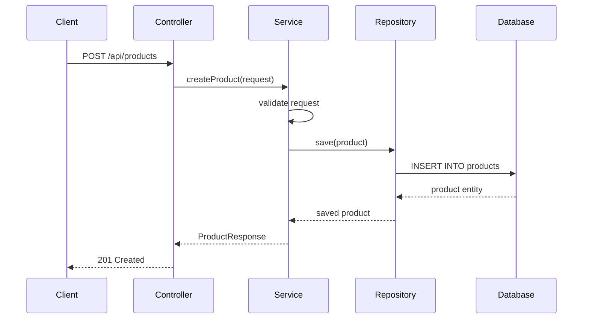
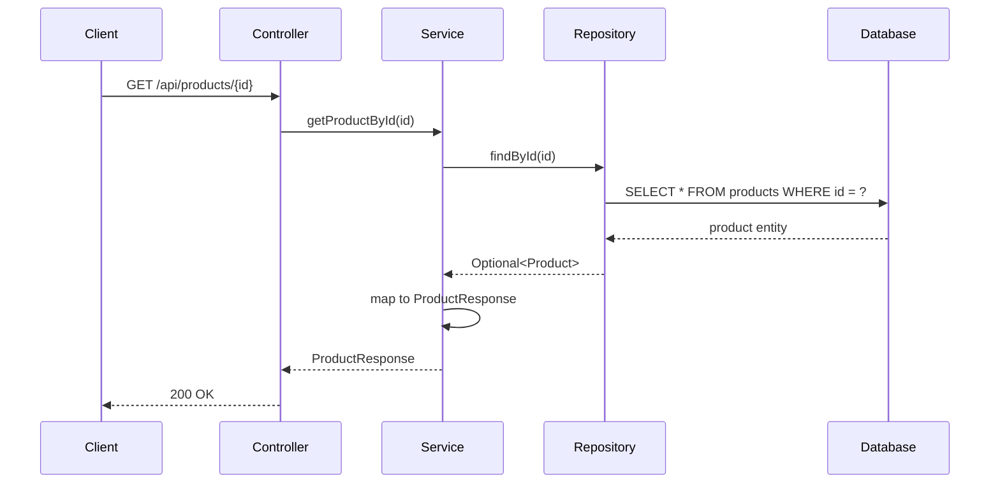
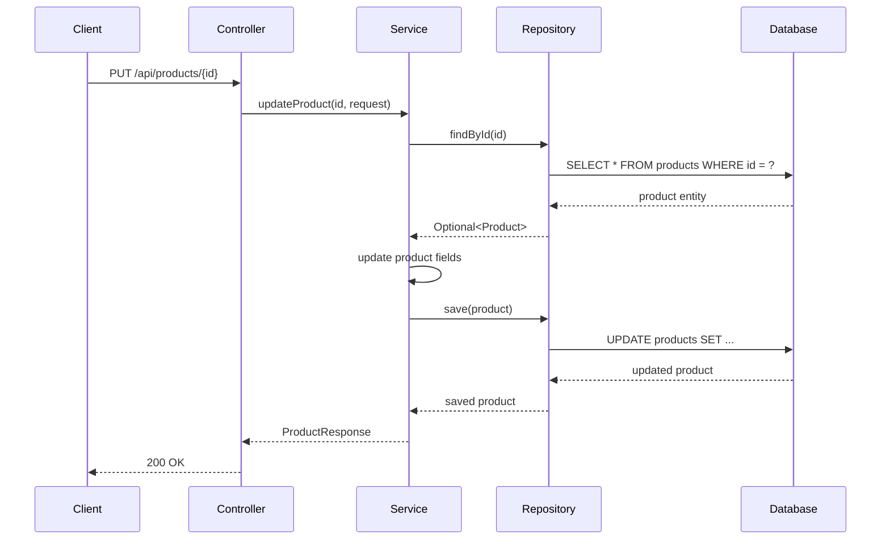
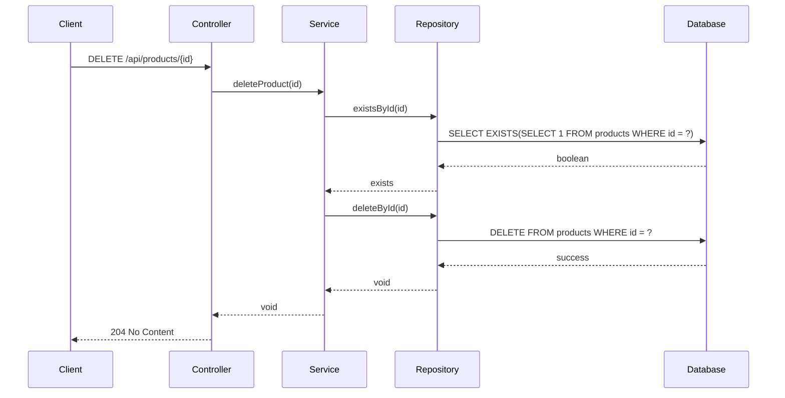
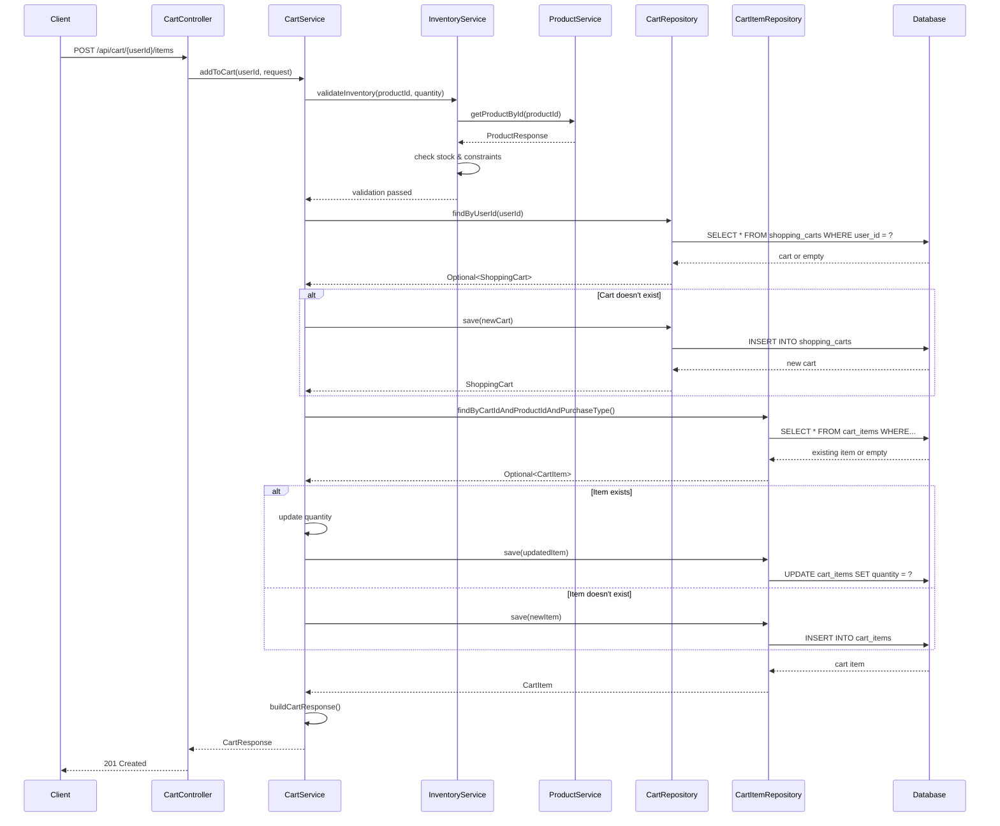
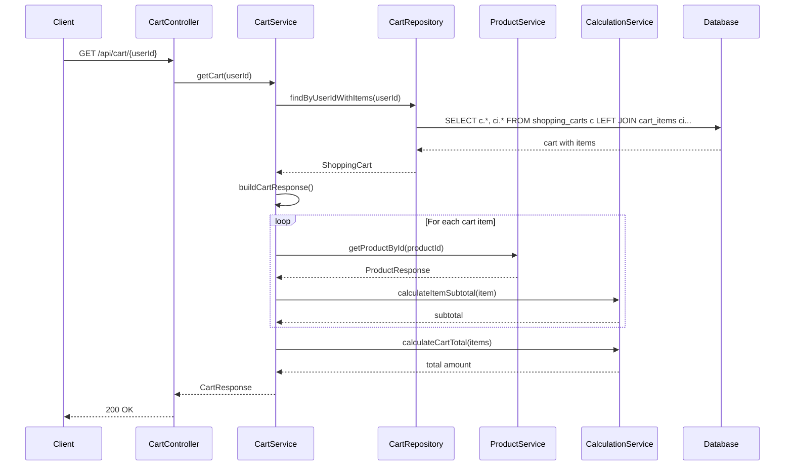
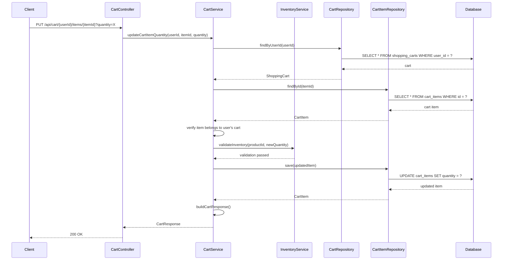
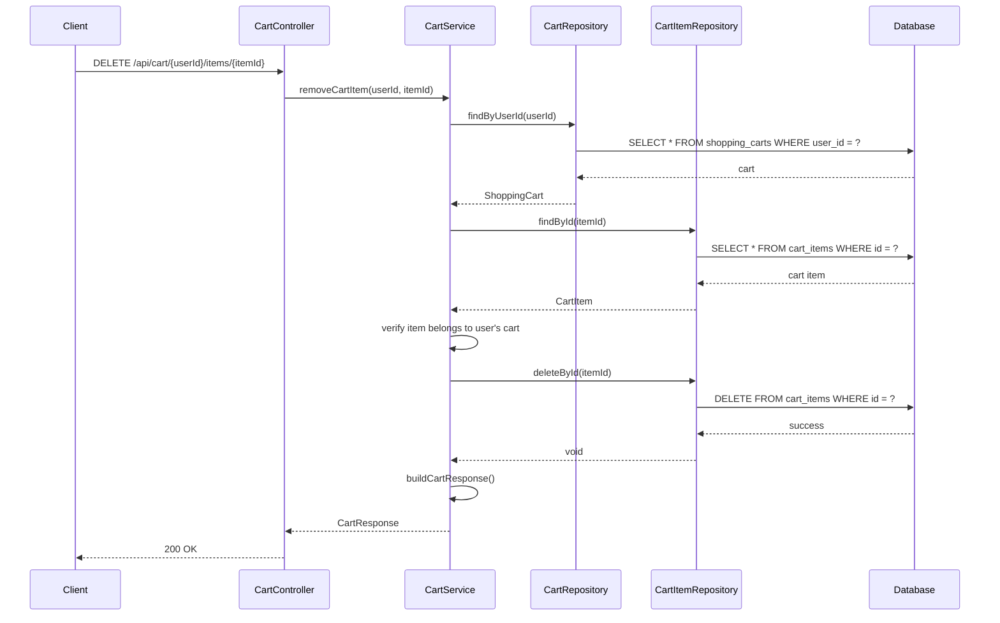
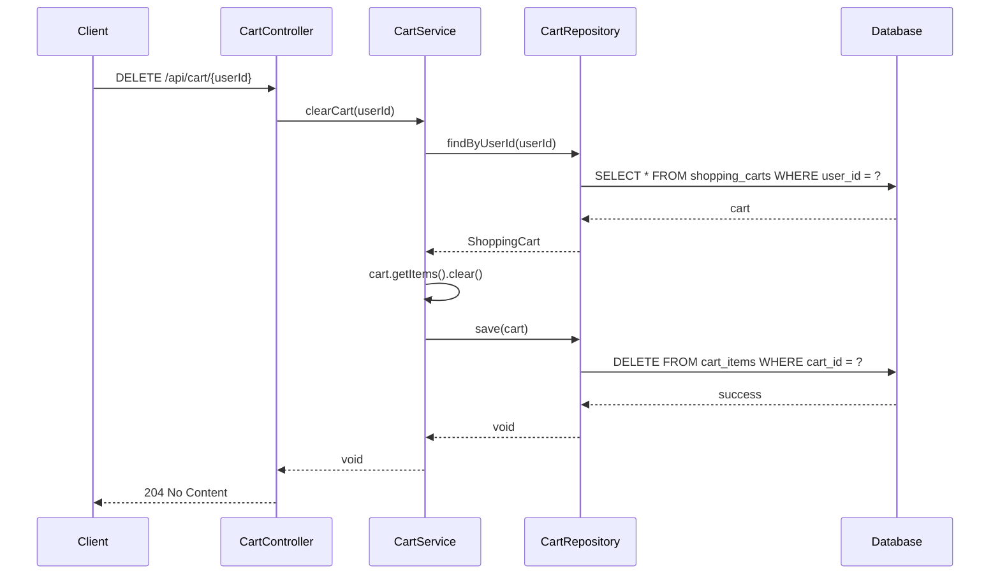
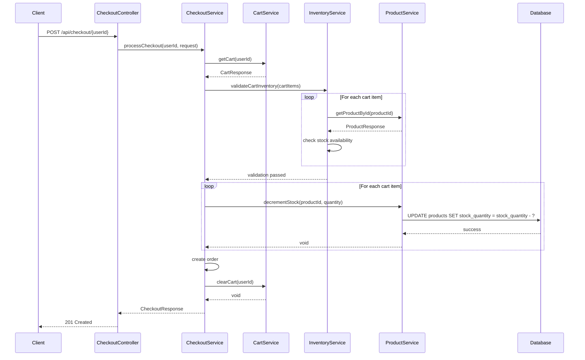

## 13. Sequence Diagrams

### 13.1 Create Product Flow


```mermaid
sequenceDiagram
    participant Client
    participant Controller
    participant Service
    participant Repository
    participant Database

    Client->>Controller: POST /api/products
    Controller->>Service: createProduct(request)
    Service->>Service: validate request
    Service->>Repository: save(product)
    Repository->>Database: INSERT INTO products
    Database-->>Repository: product entity
    Repository-->>Service: saved product
    Service-->>Controller: ProductResponse
    Controller-->>Client: 201 Created
```

### 13.2 Get Product Flow


```mermaid
sequenceDiagram
    participant Client
    participant Controller
    participant Service
    participant Repository
    participant Database

    Client->>Controller: GET /api/products/{id}
    Controller->>Service: getProductById(id)
    Service->>Repository: findById(id)
    Repository->>Database: SELECT * FROM products WHERE id = ?
    Database-->>Repository: product entity
    Repository-->>Service: Optional<Product>
    Service->>Service: map to ProductResponse
    Service-->>Controller: ProductResponse
    Controller-->>Client: 200 OK
```

### 13.3 Update Product Flow


```mermaid
sequenceDiagram
    participant Client
    participant Controller
    participant Service
    participant Repository
    participant Database

    Client->>Controller: PUT /api/products/{id}
    Controller->>Service: updateProduct(id, request)
    Service->>Repository: findById(id)
    Repository->>Database: SELECT * FROM products WHERE id = ?
    Database-->>Repository: product entity
    Repository-->>Service: Optional<Product>
    Service->>Service: update product fields
    Service->>Repository: save(product)
    Repository->>Database: UPDATE products SET ...
    Database-->>Repository: updated product
    Repository-->>Service: saved product
    Service-->>Controller: ProductResponse
    Controller-->>Client: 200 OK
```

### 13.4 Delete Product Flow


```mermaid
sequenceDiagram
    participant Client
    participant Controller
    participant Service
    participant Repository
    participant Database

    Client->>Controller: DELETE /api/products/{id}
    Controller->>Service: deleteProduct(id)
    Service->>Repository: existsById(id)
    Repository->>Database: SELECT EXISTS(SELECT 1 FROM products WHERE id = ?)
    Database-->>Repository: boolean
    Repository-->>Service: exists
    Service->>Repository: deleteById(id)
    Repository->>Database: DELETE FROM products WHERE id = ?
    Database-->>Repository: success
    Repository-->>Service: void
    Service-->>Controller: void
    Controller-->>Client: 204 No Content
```

### 13.5 Add to Cart Flow


```mermaid
sequenceDiagram
    participant Client
    participant CartController
    participant CartService
    participant InventoryService
    participant ProductService
    participant CartRepository
    participant CartItemRepository
    participant Database

    Client->>CartController: POST /api/cart/{userId}/items
    CartController->>CartService: addToCart(userId, request)
    CartService->>InventoryService: validateInventory(productId, quantity)
    InventoryService->>ProductService: getProductById(productId)
    ProductService-->>InventoryService: ProductResponse
    InventoryService->>InventoryService: check stock & constraints
    InventoryService-->>CartService: validation passed
    CartService->>CartRepository: findByUserId(userId)
    CartRepository->>Database: SELECT * FROM shopping_carts WHERE user_id = ?
    Database-->>CartRepository: cart or empty
    CartRepository-->>CartService: Optional<ShoppingCart>
    alt Cart doesn't exist
        CartService->>CartRepository: save(newCart)
        CartRepository->>Database: INSERT INTO shopping_carts
        Database-->>CartRepository: new cart
        CartRepository-->>CartService: ShoppingCart
    end
    CartService->>CartItemRepository: findByCartIdAndProductIdAndPurchaseType()
    CartItemRepository->>Database: SELECT * FROM cart_items WHERE...
    Database-->>CartItemRepository: existing item or empty
    CartItemRepository-->>CartService: Optional<CartItem>
    alt Item exists
        CartService->>CartService: update quantity
        CartService->>CartItemRepository: save(updatedItem)
        CartItemRepository->>Database: UPDATE cart_items SET quantity = ?
    else Item doesn't exist
        CartService->>CartItemRepository: save(newItem)
        CartItemRepository->>Database: INSERT INTO cart_items
    end
    Database-->>CartItemRepository: cart item
    CartItemRepository-->>CartService: CartItem
    CartService->>CartService: buildCartResponse()
    CartService-->>CartController: CartResponse
    CartController-->>Client: 201 Created
```

### 13.6 Get Cart Flow


```mermaid
sequenceDiagram
    participant Client
    participant CartController
    participant CartService
    participant CartRepository
    participant ProductService
    participant CalculationService
    participant Database

    Client->>CartController: GET /api/cart/{userId}
    CartController->>CartService: getCart(userId)
    CartService->>CartRepository: findByUserIdWithItems(userId)
    CartRepository->>Database: SELECT c.*, ci.* FROM shopping_carts c LEFT JOIN cart_items ci...
    Database-->>CartRepository: cart with items
    CartRepository-->>CartService: ShoppingCart
    CartService->>CartService: buildCartResponse()
    loop For each cart item
        CartService->>ProductService: getProductById(productId)
        ProductService-->>CartService: ProductResponse
        CartService->>CalculationService: calculateItemSubtotal(item)
        CalculationService-->>CartService: subtotal
    end
    CartService->>CalculationService: calculateCartTotal(items)
    CalculationService-->>CartService: total amount
    CartService-->>CartController: CartResponse
    CartController-->>Client: 200 OK
```

### 13.7 Update Cart Item Quantity Flow


```mermaid
sequenceDiagram
    participant Client
    participant CartController
    participant CartService
    participant InventoryService
    participant CartRepository
    participant CartItemRepository
    participant Database

    Client->>CartController: PUT /api/cart/{userId}/items/{itemId}?quantity=X
    CartController->>CartService: updateCartItemQuantity(userId, itemId, quantity)
    CartService->>CartRepository: findByUserId(userId)
    CartRepository->>Database: SELECT * FROM shopping_carts WHERE user_id = ?
    Database-->>CartRepository: cart
    CartRepository-->>CartService: ShoppingCart
    CartService->>CartItemRepository: findById(itemId)
    CartItemRepository->>Database: SELECT * FROM cart_items WHERE id = ?
    Database-->>CartItemRepository: cart item
    CartItemRepository-->>CartService: CartItem
    CartService->>CartService: verify item belongs to user's cart
    CartService->>InventoryService: validateInventory(productId, newQuantity)
    InventoryService-->>CartService: validation passed
    CartService->>CartItemRepository: save(updatedItem)
    CartItemRepository->>Database: UPDATE cart_items SET quantity = ?
    Database-->>CartItemRepository: updated item
    CartItemRepository-->>CartService: CartItem
    CartService->>CartService: buildCartResponse()
    CartService-->>CartController: CartResponse
    CartController-->>Client: 200 OK
```

### 13.8 Remove Cart Item Flow


```mermaid
sequenceDiagram
    participant Client
    participant CartController
    participant CartService
    participant CartRepository
    participant CartItemRepository
    participant Database

    Client->>CartController: DELETE /api/cart/{userId}/items/{itemId}
    CartController->>CartService: removeCartItem(userId, itemId)
    CartService->>CartRepository: findByUserId(userId)
    CartRepository->>Database: SELECT * FROM shopping_carts WHERE user_id = ?
    Database-->>CartRepository: cart
    CartRepository-->>CartService: ShoppingCart
    CartService->>CartItemRepository: findById(itemId)
    CartItemRepository->>Database: SELECT * FROM cart_items WHERE id = ?
    Database-->>CartItemRepository: cart item
    CartItemRepository-->>CartService: CartItem
    CartService->>CartService: verify item belongs to user's cart
    CartService->>CartItemRepository: deleteById(itemId)
    CartItemRepository->>Database: DELETE FROM cart_items WHERE id = ?
    Database-->>CartItemRepository: success
    CartItemRepository-->>CartService: void
    CartService->>CartService: buildCartResponse()
    CartService-->>CartController: CartResponse
    CartController-->>Client: 200 OK
```

### 13.9 Clear Cart Flow


```mermaid
sequenceDiagram
    participant Client
    participant CartController
    participant CartService
    participant CartRepository
    participant Database

    Client->>CartController: DELETE /api/cart/{userId}
    CartController->>CartService: clearCart(userId)
    CartService->>CartRepository: findByUserId(userId)
    CartRepository->>Database: SELECT * FROM shopping_carts WHERE user_id = ?
    Database-->>CartRepository: cart
    CartRepository-->>CartService: ShoppingCart
    CartService->>CartService: cart.getItems().clear()
    CartService->>CartRepository: save(cart)
    CartRepository->>Database: DELETE FROM cart_items WHERE cart_id = ?
    Database-->>CartRepository: success
    CartRepository-->>CartService: void
    CartService-->>CartController: void
    CartController-->>Client: 204 No Content
```

### 13.10 Checkout Flow


```mermaid
sequenceDiagram
    participant Client
    participant CheckoutController
    participant CheckoutService
    participant CartService
    participant InventoryService
    participant ProductService
    participant Database

    Client->>CheckoutController: POST /api/checkout/{userId}
    CheckoutController->>CheckoutService: processCheckout(userId, request)
    CheckoutService->>CartService: getCart(userId)
    CartService-->>CheckoutService: CartResponse
    CheckoutService->>InventoryService: validateCartInventory(cartItems)
    loop For each cart item
        InventoryService->>ProductService: getProductById(productId)
        ProductService-->>InventoryService: ProductResponse
        InventoryService->>InventoryService: check stock availability
    end
    InventoryService-->>CheckoutService: validation passed
    loop For each cart item
        CheckoutService->>ProductService: decrementStock(productId, quantity)
        ProductService->>Database: UPDATE products SET stock_quantity = stock_quantity - ?
        Database-->>ProductService: success
        ProductService-->>CheckoutService: void
    end
    CheckoutService->>CheckoutService: create order
    CheckoutService->>CartService: clearCart(userId)
    CartService-->>CheckoutService: void
    CheckoutService-->>CheckoutController: CheckoutResponse
    CheckoutController-->>Client: 201 Created
```

## 14. Business Logic

### 14.1 Product Management Rules

1. **Product Creation**
   - Name is mandatory and must not exceed 255 characters
   - Price must be positive (> 0)
   - Stock quantity must be non-negative (>= 0)
   - Category is optional but limited to 100 characters
   - Image URL is optional but limited to 500 characters
   - Subscription fields are optional but must be valid if provided
   - Min/max quantity constraints must be logical (max >= min)

2. **Product Updates**
   - All fields can be updated except ID and timestamps
   - Same validation rules apply as creation
   - Updated timestamp is automatically set

3. **Product Deletion**
   - Product must exist before deletion
   - Cascade deletion of related cart items
   - Soft delete can be implemented for audit purposes

4. **Stock Management**
   - Stock quantity must always be non-negative
   - Stock decrements are atomic operations
   - Insufficient stock throws exception

5. **Subscription Support**
   - Products can be marked as subscription-eligible
   - Subscription price and interval must be provided if eligible
   - Subscription price must be positive

6. **Quantity Constraints**
   - Min quantity defines minimum purchase amount
   - Max quantity defines maximum purchase amount
   - Constraints are validated during cart operations

### 14.2 Shopping Cart Rules

1. **Cart Creation**
   - One cart per user (enforced by unique constraint)
   - Cart is automatically created when first item is added
   - Empty carts are preserved for user convenience

2. **Add to Cart**
   - Product must exist and have sufficient stock
   - Quantity must be positive
   - Purchase type must be ONE_TIME or SUBSCRIPTION
   - Duplicate prevention: Same product with same purchase type updates quantity
   - Different purchase types for same product create separate items
   - Min/max quantity constraints are validated

3. **Update Cart Item**
   - Item must belong to user's cart
   - New quantity must be positive
   - Stock availability is re-validated
   - Min/max quantity constraints are validated

4. **Remove Cart Item**
   - Item must belong to user's cart
   - Cascade deletion from cart

5. **Clear Cart**
   - Removes all items from user's cart
   - Cart entity is preserved

6. **Duplicate Prevention Logic**
   - Unique constraint on (cart_id, product_id, purchase_type)
   - When adding existing item with same purchase type: quantity is incremented
   - When adding same product with different purchase type: new item is created
   - Example: Product A as ONE_TIME and Product A as SUBSCRIPTION are separate items

### 14.3 Inventory Validation Rules

1. **Stock Availability**
   - Requested quantity must not exceed available stock
   - Validation occurs before adding/updating cart items
   - Validation occurs before checkout

2. **Quantity Constraints**
   - If minQuantity is set: requested quantity >= minQuantity
   - If maxQuantity is set: requested quantity <= maxQuantity
   - Constraints apply to individual cart items

3. **Checkout Validation**
   - All cart items are re-validated before checkout
   - Stock is decremented atomically during checkout
   - Transaction rollback on any validation failure

### 14.4 Calculation Rules

1. **Item Subtotal**
   - ONE_TIME purchase: price × quantity
   - SUBSCRIPTION purchase: subscriptionPrice × quantity

2. **Cart Total**
   - Sum of all item subtotals
   - Precision: 2 decimal places

3. **Price Selection**
   - Purchase type determines which price to use
   - Subscription price must be available for SUBSCRIPTION type

## 15. Configuration

### 15.1 Application Properties

```properties
# Application Configuration
spring.application.name=ecommerce-product-service
server.port=8080

# Database Configuration
spring.datasource.url=jdbc:postgresql://localhost:5432/ecommerce_db
spring.datasource.username=postgres
spring.datasource.password=password
spring.datasource.driver-class-name=org.postgresql.Driver

# JPA Configuration
spring.jpa.hibernate.ddl-auto=validate
spring.jpa.show-sql=true
spring.jpa.properties.hibernate.format_sql=true
spring.jpa.properties.hibernate.dialect=org.hibernate.dialect.PostgreSQLDialect

# Flyway Configuration
spring.flyway.enabled=true
spring.flyway.locations=classpath:db/migration
spring.flyway.baseline-on-migrate=true

# Logging Configuration
logging.level.com.ecommerce=DEBUG
logging.level.org.springframework.web=INFO
logging.level.org.hibernate.SQL=DEBUG
logging.level.org.hibernate.type.descriptor.sql.BasicBinder=TRACE

# OpenAPI Configuration
springdoc.api-docs.path=/api-docs
springdoc.swagger-ui.path=/swagger-ui.html
springdoc.swagger-ui.enabled=true
```

### 15.2 Maven Dependencies

```xml
<dependencies>
    <!-- Spring Boot Starters -->
    <dependency>
        <groupId>org.springframework.boot</groupId>
        <artifactId>spring-boot-starter-web</artifactId>
    </dependency>
    
    <dependency>
        <groupId>org.springframework.boot</groupId>
        <artifactId>spring-boot-starter-data-jpa</artifactId>
    </dependency>
    
    <dependency>
        <groupId>org.springframework.boot</groupId>
        <artifactId>spring-boot-starter-validation</artifactId>
    </dependency>
    
    <!-- Database -->
    <dependency>
        <groupId>org.postgresql</groupId>
        <artifactId>postgresql</artifactId>
        <scope>runtime</scope>
    </dependency>
    
    <!-- Flyway -->
    <dependency>
        <groupId>org.flywaydb</groupId>
        <artifactId>flyway-core</artifactId>
    </dependency>
    
    <!-- Lombok -->
    <dependency>
        <groupId>org.projectlombok</groupId>
        <artifactId>lombok</artifactId>
        <optional>true</optional>
    </dependency>
    
    <!-- OpenAPI Documentation -->
    <dependency>
        <groupId>org.springdoc</groupId>
        <artifactId>springdoc-openapi-starter-webmvc-ui</artifactId>
        <version>2.2.0</version>
    </dependency>
    
    <!-- Testing -->
    <dependency>
        <groupId>org.springframework.boot</groupId>
        <artifactId>spring-boot-starter-test</artifactId>
        <scope>test</scope>
    </dependency>
</dependencies>
```
