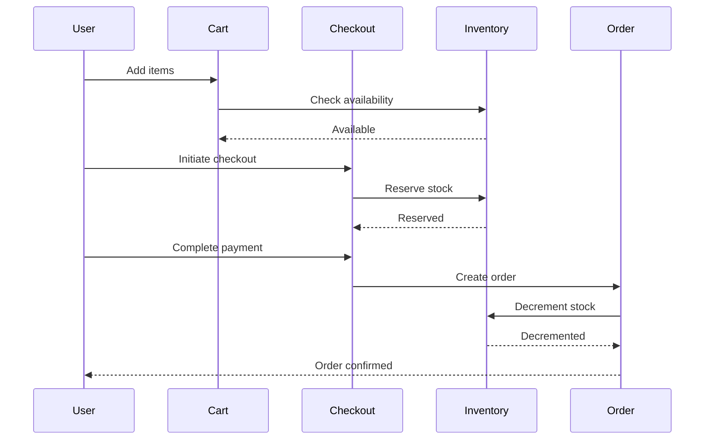

## 7. Business Logic

### 7.1 Shopping Cart Business Rules

#### 7.1.1 Duplicate Prevention Logic

**Rule**: Prevent duplicate items in cart with same product and purchase type

**Implementation**:
```java
public class DuplicatePreventionService {
    
    /**
     * Checks if an item with the same product and purchase type already exists in the cart.
     * If exists, updates the quantity instead of creating a new item.
     * 
     * @param cartId The shopping cart ID
     * @param productId The product ID to check
     * @param purchaseType The purchase type (ONE_TIME or SUBSCRIPTION)
     * @param requestedQuantity The quantity to add
     * @return CartItem - either existing item with updated quantity or new item
     */
    public CartItem handleDuplicateItem(
            Long cartId, 
            Long productId, 
            PurchaseType purchaseType, 
            Integer requestedQuantity) {
        
        Optional<CartItem> existingItem = cartItemRepository
            .findByCartIdAndProductIdAndPurchaseType(cartId, productId, purchaseType);
        
        if (existingItem.isPresent()) {
            // Update existing item
            CartItem item = existingItem.get();
            Integer newQuantity = item.getQuantity() + requestedQuantity;
            
            // Validate new quantity against product constraints
            validateQuantityConstraints(productId, newQuantity);
            
            item.setQuantity(newQuantity);
            item.setSubtotal(item.getUnitPrice().multiply(BigDecimal.valueOf(newQuantity)));
            
            return cartItemRepository.save(item);
        } else {
            // Create new item
            return createNewCartItem(cartId, productId, purchaseType, requestedQuantity);
        }
    }
    
    private void validateQuantityConstraints(Long productId, Integer quantity) {
        Product product = productRepository.findById(productId)
            .orElseThrow(() -> new ProductNotFoundException(productId));
        
        if (product.getMaxQuantity() != null && quantity > product.getMaxQuantity()) {
            throw new QuantityConstraintException(
                productId, 
                "Total quantity " + quantity + " exceeds maximum allowed: " + product.getMaxQuantity()
            );
        }
        
        if (product.getStockQuantity() < quantity) {
            throw new InsufficientStockException(
                productId, 
                quantity, 
                product.getStockQuantity()
            );
        }
    }
}
```

**Business Rules**:
1. Same product with same purchase type = Update quantity
2. Same product with different purchase type = Create separate item
3. Quantity validation must consider existing + new quantity
4. Stock availability must be checked for total quantity

**Example Scenarios**:

Scenario 1: Adding duplicate item
```
Initial Cart:
- Product A (ONE_TIME) x 2

Add: Product A (ONE_TIME) x 3

Result:
- Product A (ONE_TIME) x 5  // Quantities merged
```

Scenario 2: Different purchase types
```
Initial Cart:
- Product A (ONE_TIME) x 2

Add: Product A (SUBSCRIPTION) x 1

Result:
- Product A (ONE_TIME) x 2
- Product A (SUBSCRIPTION) x 1  // Separate items
```

### 7.2 Cart Expiration

**Rule**: Carts expire after 30 days of inactivity

**Implementation**:
```java
@Scheduled(cron = "0 0 2 * * *") // Run daily at 2 AM
public void cleanupExpiredCarts() {
    LocalDateTime now = LocalDateTime.now();
    List<ShoppingCart> expiredCarts = shoppingCartRepository
        .findExpiredCarts(now, CartStatus.ACTIVE);
    
    List<Long> cartIds = expiredCarts.stream()
        .map(ShoppingCart::getId)
        .collect(Collectors.toList());
    
    if (!cartIds.isEmpty()) {
        shoppingCartRepository.updateCartStatus(cartIds, CartStatus.ABANDONED);
        log.info("Marked {} carts as abandoned", cartIds.size());
    }
}
```

### 7.3 Stock Management

**Rule**: Stock is reserved during checkout, decremented on order completion

**Implementation Flow**:

```mermaid
sequenceDiagram
    participant User
    participant Cart
    participant Checkout
    participant Inventory
    participant Order
    
    User->>Cart: Add items
    Cart->>Inventory: Check availability
    Inventory-->>Cart: Available
    
    User->>Checkout: Initiate checkout
    Checkout->>Inventory: Reserve stock
    Inventory-->>Checkout: Reserved
    
    User->>Checkout: Complete payment
    Checkout->>Order: Create order
    Order->>Inventory: Decrement stock
    Inventory-->>Order: Decremented
    Order-->>User: Order confirmed
```

## 8. Error Handling

### 8.1 Exception Hierarchy

```java
// Base exception
public class EcommerceException extends RuntimeException {
    private final String errorCode;
    private final HttpStatus httpStatus;
    
    public EcommerceException(String message, String errorCode, HttpStatus httpStatus) {
        super(message);
        this.errorCode = errorCode;
        this.httpStatus = httpStatus;
    }
}

// Product exceptions
public class ProductNotFoundException extends EcommerceException {
    public ProductNotFoundException(Long productId) {
        super(
            "Product not found with id: " + productId,
            "PRODUCT_NOT_FOUND",
            HttpStatus.NOT_FOUND
        );
    }
}

public class InsufficientStockException extends EcommerceException {
    public InsufficientStockException(Long productId, Integer requested, Integer available) {
        super(
            String.format("Insufficient stock for product %d. Requested: %d, Available: %d", 
                productId, requested, available),
            "INSUFFICIENT_STOCK",
            HttpStatus.BAD_REQUEST
        );
    }
}

// Cart exceptions
public class CartNotFoundException extends EcommerceException {
    public CartNotFoundException() {
        super(
            "Shopping cart not found",
            "CART_NOT_FOUND",
            HttpStatus.NOT_FOUND
        );
    }
}

public class CartItemNotFoundException extends EcommerceException {
    public CartItemNotFoundException(Long cartItemId) {
        super(
            "Cart item not found with id: " + cartItemId,
            "CART_ITEM_NOT_FOUND",
            HttpStatus.NOT_FOUND
        );
    }
}
```

### 8.2 Global Exception Handler

```java
@RestControllerAdvice
public class GlobalExceptionHandler {
    
    @ExceptionHandler(EcommerceException.class)
    public ResponseEntity<ErrorResponse> handleEcommerceException(EcommerceException ex) {
        ErrorResponse error = ErrorResponse.builder()
            .timestamp(LocalDateTime.now())
            .errorCode(ex.getErrorCode())
            .message(ex.getMessage())
            .build();
        
        return ResponseEntity
            .status(ex.getHttpStatus())
            .body(error);
    }
    
    @ExceptionHandler(MethodArgumentNotValidException.class)
    public ResponseEntity<ErrorResponse> handleValidationException(
            MethodArgumentNotValidException ex) {
        
        Map<String, String> errors = new HashMap<>();
        ex.getBindingResult().getFieldErrors().forEach(error -> 
            errors.put(error.getField(), error.getDefaultMessage())
        );
        
        ErrorResponse error = ErrorResponse.builder()
            .timestamp(LocalDateTime.now())
            .errorCode("VALIDATION_ERROR")
            .message("Validation failed")
            .details(errors)
            .build();
        
        return ResponseEntity
            .status(HttpStatus.BAD_REQUEST)
            .body(error);
    }
}
```

## 9. Security Considerations

### 9.1 Authentication & Authorization

- **Product Management**: Requires ADMIN role
- **Cart Operations**: User-specific or session-based
- **Checkout**: Requires authenticated user

### 9.2 Data Validation

- Input validation using Bean Validation (JSR-380)
- SQL injection prevention through parameterized queries
- XSS prevention through output encoding

### 9.3 Cart Security

- User carts: Accessible only by cart owner
- Guest carts: Accessible via session ID
- Cart expiration to prevent data accumulation

## 10. Performance Considerations

### 10.1 Database Optimization

- Indexes on frequently queried columns
- Pagination for large result sets
- Connection pooling configuration

### 10.2 Caching Strategy

```java
@Cacheable(value = "products", key = "#id")
public ProductResponse getProductById(Long id) {
    // Implementation
}

@CacheEvict(value = "products", key = "#id")
public void updateProduct(Long id, UpdateProductRequest request) {
    // Implementation
}
```

### 10.3 Query Optimization

- Use of JOIN FETCH for eager loading
- Batch operations for bulk updates
- Projection queries for specific fields

## 11. Monitoring & Logging

### 11.1 Logging Strategy

```java
@Slf4j
@Service
public class ShoppingCartService {
    
    public CartResponse addToCart(AddToCartRequest request, Long userId, String sessionId) {
        log.info("Adding item to cart - ProductId: {}, Quantity: {}, UserId: {}", 
            request.getProductId(), request.getQuantity(), userId);
        
        try {
            // Implementation
            log.info("Successfully added item to cart - CartId: {}", cart.getId());
            return cartMapper.toResponse(cart);
        } catch (Exception e) {
            log.error("Failed to add item to cart - ProductId: {}, Error: {}", 
                request.getProductId(), e.getMessage(), e);
            throw e;
        }
    }
}
```

### 11.2 Metrics

- Cart conversion rate
- Average cart value
- Cart abandonment rate
- Product stock levels
- API response times

## 12. Testing Strategy

### 12.1 Unit Tests

```java
@ExtendWith(MockitoExtension.class)
class ShoppingCartServiceTest {
    
    @Mock
    private ShoppingCartRepository cartRepository;
    
    @Mock
    private CartItemRepository cartItemRepository;
    
    @Mock
    private ProductService productService;
    
    @InjectMocks
    private ShoppingCartService cartService;
    
    @Test
    void addToCart_NewItem_Success() {
        // Arrange
        AddToCartRequest request = new AddToCartRequest();
        request.setProductId(1L);
        request.setQuantity(2);
        request.setPurchaseType(PurchaseType.ONE_TIME);
        
        // Act & Assert
        // Test implementation
    }
    
    @Test
    void addToCart_DuplicateItem_UpdatesQuantity() {
        // Test implementation
    }
    
    @Test
    void addToCart_InsufficientStock_ThrowsException() {
        // Test implementation
    }
}
```

### 12.2 Integration Tests

```java
@SpringBootTest
@AutoConfigureMockMvc
class ShoppingCartIntegrationTest {
    
    @Autowired
    private MockMvc mockMvc;
    
    @Autowired
    private ObjectMapper objectMapper;
    
    @Test
    void addToCart_EndToEnd_Success() throws Exception {
        AddToCartRequest request = new AddToCartRequest();
        request.setProductId(1L);
        request.setQuantity(2);
        request.setPurchaseType(PurchaseType.ONE_TIME);
        
        mockMvc.perform(post("/api/v1/cart/items")
                .contentType(MediaType.APPLICATION_JSON)
                .header("X-User-Id", "123")
                .content(objectMapper.writeValueAsString(request)))
            .andExpect(status().isOk())
            .andExpect(jsonPath("$.cartId").exists())
            .andExpect(jsonPath("$.items").isArray())
            .andExpect(jsonPath("$.items[0].productId").value(1));
    }
}
```

## 13. Deployment Considerations

### 13.1 Environment Configuration

```yaml
# application.yml
spring:
  datasource:
    url: ${DB_URL}
    username: ${DB_USERNAME}
    password: ${DB_PASSWORD}
  jpa:
    hibernate:
      ddl-auto: validate
    properties:
      hibernate:
        dialect: org.hibernate.dialect.PostgreSQLDialect
  
cart:
  expiration-days: 30
  cleanup-cron: "0 0 2 * * *"
```

### 13.2 Scalability

- Stateless service design
- Database read replicas for read-heavy operations
- Redis for distributed caching
- Horizontal scaling capability

## 14. Future Enhancements

1. **Wishlist Feature**: Allow users to save products for later
2. **Cart Sharing**: Enable cart sharing between users
3. **Price Alerts**: Notify users of price changes for cart items
4. **Bulk Operations**: Support adding multiple items at once
5. **Cart Analytics**: Advanced analytics on cart behavior
6. **Recommendation Engine**: Suggest products based on cart contents
