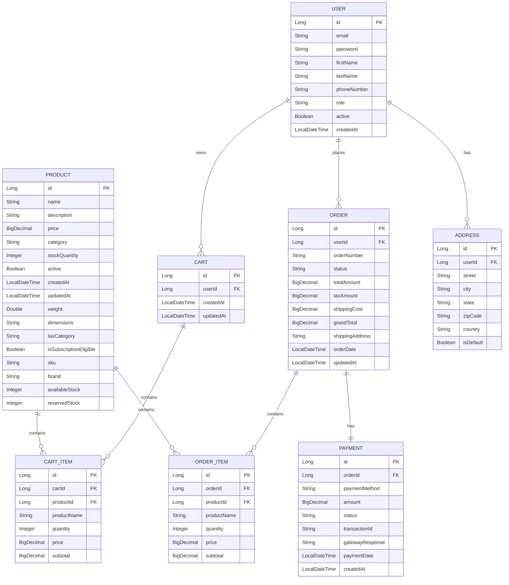

## 8. Tax Calculation Service

### 8.1 Tax Service Implementation

```java
package com.ecommerce.tax.service.impl;

import com.ecommerce.order.entity.Order;
import com.ecommerce.order.entity.OrderItem;
import com.ecommerce.product.entity.Product;
import com.ecommerce.product.repository.ProductRepository;
import com.ecommerce.tax.config.TaxConfiguration;
import com.ecommerce.tax.service.TaxService;
import lombok.RequiredArgsConstructor;
import lombok.extern.slf4j.Slf4j;
import org.springframework.stereotype.Service;
import java.math.BigDecimal;
import java.math.RoundingMode;

@Service
@RequiredArgsConstructor
@Slf4j
public class TaxServiceImpl implements TaxService {
    
    private final ProductRepository productRepository;
    private final TaxConfiguration taxConfiguration;
    
    @Override
    public BigDecimal calculateTax(Order order) {
        log.info("Calculating tax for order: {}", order.getOrderNumber());
        
        BigDecimal totalTax = BigDecimal.ZERO;
        
        for (OrderItem item : order.getOrderItems()) {
            Product product = productRepository.findById(item.getProductId())
                    .orElseThrow(() -> new IllegalArgumentException("Product not found"));
            
            BigDecimal itemTax = calculateItemTax(item, product);
            totalTax = totalTax.add(itemTax);
        }
        
        return totalTax.setScale(2, RoundingMode.HALF_UP);
    }
    
    private BigDecimal calculateItemTax(OrderItem item, Product product) {
        String taxCategory = product.getTaxCategory() != null ? 
                product.getTaxCategory() : "STANDARD";
        
        BigDecimal taxRate = taxConfiguration.getTaxRate(taxCategory);
        BigDecimal itemSubtotal = item.getSubtotal();
        
        return itemSubtotal.multiply(taxRate).divide(BigDecimal.valueOf(100), 2, RoundingMode.HALF_UP);
    }
}

@Configuration
@ConfigurationProperties(prefix = "tax")
@Data
class TaxConfiguration {
    
    private Map<String, BigDecimal> rates = new HashMap<>();
    
    public BigDecimal getTaxRate(String category) {
        return rates.getOrDefault(category, BigDecimal.valueOf(10.0));
    }
}
```

### 8.2 Tax Configuration (application.yml)

```yaml
tax:
  rates:
    STANDARD: 10.0
    FOOD: 5.0
    BOOKS: 0.0
    ELECTRONICS: 18.0
    CLOTHING: 12.0
```

## 9. Shipping Cost Calculation Service

### 9.1 Shipping Service Implementation

```java
package com.ecommerce.shipping.service.impl;

import com.ecommerce.order.entity.Order;
import com.ecommerce.order.entity.OrderItem;
import com.ecommerce.product.entity.Product;
import com.ecommerce.product.repository.ProductRepository;
import com.ecommerce.shipping.config.ShippingConfiguration;
import com.ecommerce.shipping.service.ShippingService;
import lombok.RequiredArgsConstructor;
import lombok.extern.slf4j.Slf4j;
import org.springframework.stereotype.Service;
import java.math.BigDecimal;
import java.math.RoundingMode;

@Service
@RequiredArgsConstructor
@Slf4j
public class ShippingServiceImpl implements ShippingService {
    
    private final ProductRepository productRepository;
    private final ShippingConfiguration shippingConfiguration;
    
    @Override
    public BigDecimal calculateShippingCost(Order order) {
        log.info("Calculating shipping cost for order: {}", order.getOrderNumber());
        
        // Calculate total weight
        double totalWeight = 0.0;
        for (OrderItem item : order.getOrderItems()) {
            Product product = productRepository.findById(item.getProductId())
                    .orElseThrow(() -> new IllegalArgumentException("Product not found"));
            
            Double weight = product.getWeight() != null ? product.getWeight() : 0.5;
            totalWeight += weight * item.getQuantity();
        }
        
        // Calculate base shipping cost
        BigDecimal baseCost = shippingConfiguration.getBaseCost();
        BigDecimal weightCost = BigDecimal.valueOf(totalWeight)
                .multiply(shippingConfiguration.getCostPerKg());
        
        BigDecimal totalShippingCost = baseCost.add(weightCost);
        
        // Apply free shipping threshold
        if (order.getTotalAmount().compareTo(shippingConfiguration.getFreeShippingThreshold()) >= 0) {
            log.info("Free shipping applied for order: {}", order.getOrderNumber());
            return BigDecimal.ZERO;
        }
        
        return totalShippingCost.setScale(2, RoundingMode.HALF_UP);
    }
}

@Configuration
@ConfigurationProperties(prefix = "shipping")
@Data
class ShippingConfiguration {
    
    private BigDecimal baseCost = BigDecimal.valueOf(5.0);
    private BigDecimal costPerKg = BigDecimal.valueOf(2.0);
    private BigDecimal freeShippingThreshold = BigDecimal.valueOf(100.0);
}
```

### 9.2 Shipping Configuration (application.yml)

```yaml
shipping:
  base-cost: 5.0
  cost-per-kg: 2.0
  free-shipping-threshold: 100.0
```

## 10. Inventory Management

### 10.1 Inventory Service Implementation

```java
package com.ecommerce.inventory.service.impl;

import com.ecommerce.cart.entity.Cart;
import com.ecommerce.cart.entity.CartItem;
import com.ecommerce.inventory.service.InventoryService;
import com.ecommerce.order.entity.Order;
import com.ecommerce.order.entity.OrderItem;
import com.ecommerce.product.entity.Product;
import com.ecommerce.product.repository.ProductRepository;
import lombok.RequiredArgsConstructor;
import lombok.extern.slf4j.Slf4j;
import org.springframework.stereotype.Service;
import org.springframework.transaction.annotation.Transactional;

@Service
@RequiredArgsConstructor
@Slf4j
public class InventoryServiceImpl implements InventoryService {
    
    private final ProductRepository productRepository;
    private static final Integer MINIMUM_PROCUREMENT_THRESHOLD = 10;
    
    @Override
    @Transactional
    public boolean validateAndReserveStock(Cart cart) {
        log.info("Validating and reserving stock for cart");
        
        for (CartItem item : cart.getItems()) {
            Product product = productRepository.findById(item.getProductId())
                    .orElseThrow(() -> new IllegalArgumentException("Product not found"));
            
            Integer availableStock = product.getStockQuantity() - product.getReservedStock();
            
            if (availableStock < item.getQuantity()) {
                log.warn("Insufficient stock for product: {}", product.getName());
                return false;
            }
            
            // Reserve stock
            product.setReservedStock(product.getReservedStock() + item.getQuantity());
            productRepository.save(product);
            
            // Check minimum procurement threshold
            checkMinimumProcurementThreshold(product);
        }
        
        return true;
    }
    
    @Override
    @Transactional
    public void releaseReservedStock(Order order) {
        log.info("Releasing reserved stock for order: {}", order.getOrderNumber());
        
        for (OrderItem item : order.getOrderItems()) {
            Product product = productRepository.findById(item.getProductId())
                    .orElseThrow(() -> new IllegalArgumentException("Product not found"));
            
            product.setReservedStock(product.getReservedStock() - item.getQuantity());
            productRepository.save(product);
        }
    }
    
    @Override
    @Transactional
    public void confirmStockDeduction(Order order) {
        log.info("Confirming stock deduction for order: {}", order.getOrderNumber());
        
        for (OrderItem item : order.getOrderItems()) {
            Product product = productRepository.findById(item.getProductId())
                    .orElseThrow(() -> new IllegalArgumentException("Product not found"));
            
            product.setStockQuantity(product.getStockQuantity() - item.getQuantity());
            product.setReservedStock(product.getReservedStock() - item.getQuantity());
            productRepository.save(product);
            
            checkMinimumProcurementThreshold(product);
        }
    }
    
    private void checkMinimumProcurementThreshold(Product product) {
        if (product.getStockQuantity() <= MINIMUM_PROCUREMENT_THRESHOLD) {
            log.warn("Product {} has reached minimum procurement threshold. Current stock: {}", 
                    product.getName(), product.getStockQuantity());
            // Trigger procurement notification or automated reorder
        }
    }
}
```

## 11. Data Transfer Objects (DTOs)

### 11.1 Product DTOs

```java
package com.ecommerce.product.dto;

import jakarta.validation.constraints.*;
import lombok.Data;
import java.math.BigDecimal;
import java.util.List;

@Data
public class ProductDTO {
    
    @NotBlank(message = "Product name is required")
    @Size(max = 255)
    private String name;
    
    @Size(max = 2000)
    private String description;
    
    @NotNull(message = "Price is required")
    @DecimalMin(value = "0.0", inclusive = false)
    private BigDecimal price;
    
    @NotBlank(message = "Category is required")
    private String category;
    
    @NotNull(message = "Stock quantity is required")
    @Min(0)
    private Integer stockQuantity;
    
    private Boolean active = true;
    
    @DecimalMin(value = "0.0")
    private Double weight;
    
    private String dimensions;
    
    private String taxCategory;
    
    private Boolean isSubscriptionEligible;
    
    private List<String> imageUrls;
    
    @NotBlank(message = "SKU is required")
    private String sku;
    
    private String brand;
}

@Data
public class ProductResponse {
    private Long id;
    private String name;
    private String description;
    private BigDecimal price;
    private String category;
    private Integer stockQuantity;
    private Boolean active;
    private LocalDateTime createdAt;
    private LocalDateTime updatedAt;
    private Double weight;
    private String dimensions;
    private String taxCategory;
    private Boolean isSubscriptionEligible;
    private List<String> imageUrls;
    private String sku;
    private String brand;
    private Integer availableStock;
    private Integer reservedStock;
    private String availabilityStatus;
}

@Data
public class ProductSearchRequest {
    private String name;
    private String category;
    private BigDecimal minPrice;
    private BigDecimal maxPrice;
    private String brand;
    private Boolean isActive;
    private Boolean inStock;
}
```

### 11.2 Order DTOs

```java
package com.ecommerce.order.dto;

import jakarta.validation.constraints.NotBlank;
import lombok.Data;
import java.math.BigDecimal;
import java.time.LocalDateTime;
import java.util.List;

@Data
public class OrderRequest {
    @NotBlank(message = "Shipping address is required")
    private String shippingAddress;
}

@Data
public class OrderResponse {
    private Long id;
    private Long userId;
    private String orderNumber;
    private String status;
    private BigDecimal totalAmount;
    private BigDecimal taxAmount;
    private BigDecimal shippingCost;
    private BigDecimal grandTotal;
    private String shippingAddress;
    private LocalDateTime orderDate;
    private List<OrderItemResponse> items;
}

@Data
public class OrderItemResponse {
    private Long id;
    private Long productId;
    private String productName;
    private Integer quantity;
    private BigDecimal price;
    private BigDecimal subtotal;
}
```

## 12. Entity Relationship Diagram


