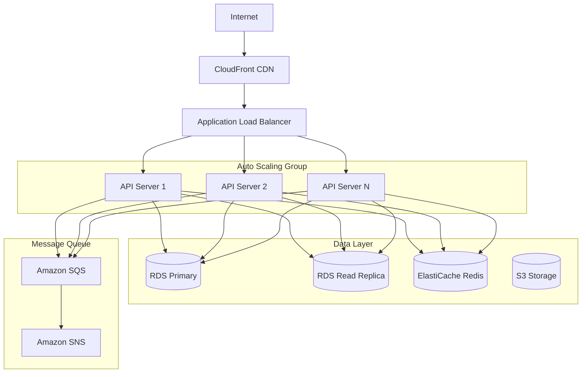

## 14. Testing Strategy

### 14.1 Unit Testing

**Product Service Tests:**
```javascript
describe('ProductService', () => {
    test('should create product successfully', async () => {
        const productDTO = {
            name: 'Test Product',
            price: 99.99,
            sku: 'TEST-001'
        };
        const result = await productService.createProduct(productDTO);
        expect(result.product_id).toBeDefined();
        expect(result.name).toBe('Test Product');
    });
    
    test('should throw error for duplicate SKU', async () => {
        await expect(productService.createProduct({
            sku: 'EXISTING-SKU'
        })).rejects.toThrow('SKU already exists');
    });
});
```

**Cart Service Tests:**
```javascript
describe('CartService', () => {
    test('should add item to cart', async () => {
        const result = await cartService.addItem(userId, productId, 2);
        expect(result.quantity).toBe(2);
        expect(result.cart_id).toBeDefined();
    });
    
    test('should merge quantities for duplicate items', async () => {
        await cartService.addItem(userId, productId, 2);
        const result = await cartService.addItem(userId, productId, 3);
        expect(result.quantity).toBe(5);
    });
    
    test('should throw error for insufficient stock', async () => {
        await expect(cartService.addItem(userId, productId, 1000))
            .rejects.toThrow('Insufficient stock');
    });
});
```

### 14.2 Integration Testing

**API Integration Tests:**
```javascript
describe('Cart API Integration', () => {
    test('POST /api/cart/add should add item', async () => {
        const response = await request(app)
            .post('/api/cart/add')
            .set('Authorization', `Bearer ${token}`)
            .send({ product_id: 1, quantity: 2 })
            .expect(200);
        
        expect(response.body.success).toBe(true);
        expect(response.body.data.quantity).toBe(2);
    });
    
    test('should handle concurrent cart updates', async () => {
        const promises = [
            request(app).post('/api/cart/add').send({ product_id: 1, quantity: 1 }),
            request(app).post('/api/cart/add').send({ product_id: 1, quantity: 1 })
        ];
        
        const results = await Promise.all(promises);
        // Verify final quantity is correct
    });
});
```

### 14.3 End-to-End Testing

**Complete User Flow:**
```javascript
describe('E2E: Complete Purchase Flow', () => {
    test('should complete full purchase journey', async () => {
        // 1. Browse products
        const products = await getProducts();
        
        // 2. Add to cart
        await addToCart(products[0].product_id, 2);
        
        // 3. View cart
        const cart = await getCart();
        expect(cart.items.length).toBe(1);
        
        // 4. Update quantity
        await updateCartItem(cart.items[0].cart_item_id, 3);
        
        // 5. Checkout
        const order = await createOrder({
            shipping_address: testAddress,
            payment_method: 'credit_card'
        });
        
        // 6. Verify order created
        expect(order.status).toBe('pending');
        
        // 7. Verify cart cleared
        const emptyCart = await getCart();
        expect(emptyCart.items.length).toBe(0);
    });
});
```

## 15. Deployment Architecture

### 15.1 Infrastructure



### 15.2 Deployment Pipeline

1. **Development → Staging → Production**
2. **CI/CD with automated testing**
3. **Blue-Green deployment strategy**
4. **Automated rollback on failure**
5. **Health checks and monitoring**

## 16. Conclusion

This Low Level Design document provides comprehensive technical specifications for the E-commerce Product Management System with integrated shopping cart functionality. The design emphasizes:

- **Scalability**: Horizontal scaling, caching, and load balancing
- **Security**: Authentication, authorization, and data protection
- **Performance**: Optimized queries, caching strategies, and async processing
- **Reliability**: Error handling, retry logic, and circuit breakers
- **Maintainability**: Clean architecture, comprehensive testing, and monitoring

The system is designed to handle high traffic volumes while maintaining data consistency, security, and excellent user experience. All components are built with modern best practices and industry standards in mind.

---

**Document Version:** 1.0  
**Last Updated:** January 2024  
**Status:** Final