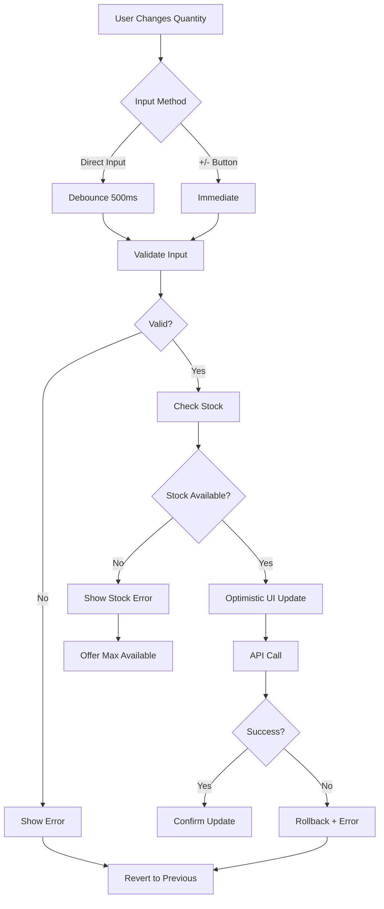

## 15. Enhanced Cart Display Specification

**Current State:** Basic product display in cart view

**Required Enhancement:** Enhance cart item display to include all required fields for complete AC2 compliance

**Requirement Reference:** Story SCRUM-343 AC2: all added products are displayed with name, price, quantity, and subtotal

### 15.1 Complete Cart Item Display Fields

#### Required Display Fields
1. **product_name** (String)
   - Display: Prominent heading
   - Font: 18px, semi-bold
   - Truncation: Max 2 lines with ellipsis
   - Link: Clickable to product detail page

2. **product_image_url** (String)
   - Display: Thumbnail image
   - Size: 100x100px (desktop), 80x80px (mobile)
   - Fallback: Placeholder image if URL invalid
   - Alt text: Product name

3. **product_sku** (String)
   - Display: Small text below product name
   - Font: 12px, regular, gray color
   - Label: "SKU: {sku}"

4. **unit_price** (Decimal)
   - Display: Formatted currency
   - Format: $XX.XX
   - Font: 16px, regular
   - Label: "Price:"

5. **quantity** (Integer, editable)
   - Display: Quantity control component
   - Controls: -/+ buttons and direct input
   - Validation: Real-time (1-99, stock limit)
   - Feedback: Loading state during update

6. **subtotal** (Decimal, calculated)
   - Display: Formatted currency
   - Format: $XX.XX
   - Font: 16px, semi-bold
   - Calculation: unit_price × quantity
   - Update: Automatic on quantity change

7. **product_url** (String)
   - Display: Link on product name and image
   - Target: Product detail page
   - Behavior: Open in same tab (default)

8. **availability_status** (Enum)
   - Values: in_stock, low_stock, out_of_stock
   - Display: Badge/label with color coding
     - in_stock: Green badge, "In Stock"
     - low_stock: Yellow badge, "Only X left"
     - out_of_stock: Red badge, "Out of Stock"
   - Position: Below product name

### 15.2 Cart Item Layout

```
+----------------------------------------------------------+
|  [Image]  Product Name (linked)                    $XX.XX|
|  100x100  SKU: ABC-123                                    |
|           [In Stock Badge]                                |
|                                                           |
|           Price: $XX.XX                                   |
|           Quantity: [-] [2] [+]                          |
|           Subtotal: $XX.XX                          [Remove]|
+----------------------------------------------------------+
```

**Reason:** AC2 requires all added products displayed with name, price, quantity, and subtotal - current specification enhanced to include complete product information for better user experience.

## 16. Enhanced Quantity Update Behavior

**Current State:** Basic quantity update functionality

**Required Enhancement:** Clarify quantity update behavior for consistent implementation

**Requirement Reference:** Story SCRUM-343 AC3: update the quantity of an item, Then the subtotal and total are recalculated automatically

### 16.1 Quantity Update Interaction Modes

#### Direct Input Validation
- **Trigger:** User types in quantity input field
- **Validation Timing:** On blur (focus loss) or Enter key press
- **Validation Rules:**
  - Must be integer
  - Range: 1-99
  - Must not exceed available stock
- **Invalid Input Handling:**
  - Show inline error message
  - Revert to previous valid quantity
  - Highlight input field in red
- **Valid Input Handling:**
  - Trigger API call to update quantity
  - Show loading indicator
  - Update subtotal and totals on success

#### Increment/Decrement Button Logic
- **Increment (+) Button:**
  - Action: Increase quantity by 1
  - Disabled When: quantity >= 99 OR quantity >= available_stock
  - Behavior: Immediate API call (no debounce)
  - Feedback: Button disabled during API call

- **Decrement (-) Button:**
  - Action: Decrease quantity by 1
  - Disabled When: quantity <= 1
  - Behavior: Immediate API call (no debounce)
  - Feedback: Button disabled during API call

#### Real-Time Stock Validation
- **Validation Point:** Before API call
- **Check:** Verify requested quantity <= product.stock_quantity
- **Insufficient Stock Response:**
  - Show error message: "Only {available_stock} available"
  - Offer option to update to maximum available
  - Do not update quantity

#### Debounced API Calls
- **Debounce Delay:** 500ms
- **Applied To:** Direct input changes only
- **Purpose:** Prevent excessive API calls during typing
- **Implementation:**
  ```javascript
  const debouncedUpdate = useDebouncedCallback(
    (itemId, quantity) => updateItemQuantity(itemId, quantity),
    500
  );
  ```

#### Optimistic UI Updates
- **Strategy:** Update UI immediately, rollback on error
- **Implementation:**
  1. Update local state with new quantity
  2. Recalculate subtotal and totals locally
  3. Trigger API call
  4. On success: Confirm update
  5. On error: Rollback to previous state, show error

#### Zero Quantity Handling
- **Trigger:** User enters 0 or decrements from 1
- **Behavior:** Prompt for removal confirmation
- **Confirmation Dialog:**
  - Message: "Remove this item from your cart?"
  - Actions: "Remove" (primary), "Cancel" (secondary)
  - On Remove: Call DELETE /api/v1/cart/items/{itemId}
  - On Cancel: Revert quantity to 1

### 16.2 Quantity Update Flow Diagram



**Reason:** AC3 requires automatic recalculation but lacks detailed behavior specification for consistent implementation across different interaction modes.

## 17. Enhanced Cart Total Calculation

**Current State:** Basic subtotal calculation

**Required Enhancement:** Include complete cost breakdown for transparency

**Requirement Reference:** Story SCRUM-343 AC3: subtotal and total are recalculated automatically

### 17.1 Complete Cost Breakdown

#### Items Subtotal
```
items_subtotal = SUM(item.subtotal for all items)
```
- **Display Label:** "Subtotal ({item_count} items)"
- **Format:** $XXX.XX
- **Position:** First line in summary

#### Applied Discounts
```
applied_discounts = coupon_discount + promotional_discount
```
- **Display Label:** "Discounts"
- **Format:** -$XX.XX (negative, red color)
- **Visibility:** Only shown if discounts > 0
- **Breakdown:** Show individual discount sources on hover/expand

#### Subtotal After Discounts
```
subtotal_after_discounts = items_subtotal - applied_discounts
```
- **Display Label:** "Subtotal after discounts"
- **Format:** $XXX.XX
- **Visibility:** Only shown if discounts applied

#### Estimated Shipping
```
estimated_shipping = calculateShipping(subtotal_after_discounts, weight, address)
```
- **Display Label:** "Estimated Shipping"
- **Format:** $X.XX or "FREE" (if free shipping applies)
- **Calculation:** Based on subtotal and shipping address
- **Free Shipping:** If subtotal_after_discounts >= $50

#### Estimated Tax
```
estimated_tax = subtotal_after_discounts × tax_rate
```
- **Display Label:** "Estimated Tax"
- **Format:** $XX.XX
- **Calculation:** Based on shipping address (default: 8%)
- **Note:** "Based on {state}" displayed below

#### Order Total
```
order_total = subtotal_after_discounts + estimated_shipping + estimated_tax
```
- **Display Label:** "Order Total"
- **Format:** $XXX.XX
- **Font:** Larger, bold
- **Position:** Last line, visually separated

#### Disclaimer
- **Text:** "Final tax and shipping calculated at checkout"
- **Font:** 12px, italic, gray
- **Position:** Below order total
- **Purpose:** Set expectations for final pricing

### 17.2 Cart Summary Display Example

```
+----------------------------------+
| Order Summary                    |
+----------------------------------+
| Subtotal (3 items)      $89.97   |
| Discounts               -$10.00  |
| Estimated Shipping       $5.99   |
| Estimated Tax (8%)       $6.40   |
+----------------------------------+
| Order Total             $92.36   |
+----------------------------------+
| Final tax and shipping           |
| calculated at checkout           |
+----------------------------------+
| [Proceed to Checkout]            |
+----------------------------------+
```

**Reason:** AC3 mentions total recalculation but current specification enhanced to include complete cost breakdown expected by customers for transparency.

## 18. Enhanced Stock Validation Logic

**Current State:** Basic quantity validation

**Required Enhancement:** Robust stock validation to prevent overselling

**Requirement Reference:** Story SCRUM-343 AC3: update the quantity of an item (implicit stock validation requirement)

### 18.1 Real-Time Inventory Checks

#### Validation Points
1. **Add to Cart:** Verify stock before adding
2. **Update Quantity:** Verify stock before updating
3. **View Cart:** Check stock status for all items
4. **Checkout:** Final stock validation before order placement

#### Stock Check Query
```sql
SELECT stock_quantity 
FROM products 
WHERE id = :productId 
FOR UPDATE; -- Lock row to prevent race conditions
```

### 18.2 Quantity Limit Enforcement

#### Maximum Available Stock
```java
public void validateQuantity(Long productId, Integer requestedQuantity) {
    Product product = productRepository.findById(productId)
        .orElseThrow(() -> new ProductNotFoundException(productId));
    
    if (requestedQuantity > product.getStockQuantity()) {
        throw new InsufficientStockException(
            "Requested quantity exceeds available stock",
            requestedQuantity,
            product.getStockQuantity()
        );
    }
}
```

#### Quantity Limits
- **Minimum:** 1 (enforced at UI and API level)
- **Maximum:** MIN(99, available_stock)
- **Validation:** Before any quantity change

### 18.3 Out-of-Stock Handling

#### Detection
- **Trigger:** product.stock_quantity = 0
- **Check Frequency:** On cart view, before quantity update, at checkout

#### User Notification
- **Message:** "{Product Name} is currently out of stock"
- **Actions:**
  - "Remove from Cart" (primary)
  - "Save for Later" (secondary, if feature available)
  - "Notify When Available" (tertiary)

#### Cart Display
- **Badge:** Red "Out of Stock" badge
- **Quantity Control:** Disabled
- **Subtotal:** Grayed out or marked as "Not available"
- **Checkout:** Blocked if any item out of stock

### 18.4 Low-Stock Warnings

#### Threshold
- **Low Stock:** stock_quantity <= 10
- **Display:** Yellow badge "Only {stock_quantity} left"

#### User Experience
- **Warning Message:** "Hurry! Only {stock_quantity} left in stock"
- **Urgency Indicator:** Visual cue to encourage purchase
- **Quantity Limit:** Enforce max quantity = available stock

### 18.5 Automatic Quantity Adjustment

#### Scenario: Requested Quantity Exceeds Stock

**User Action:** User requests quantity = 10, but only 5 available

**System Response:**
1. Detect insufficient stock
2. Show notification:
   ```
   Only 5 available. Would you like to update quantity to 5?
   [Update to 5] [Cancel]
   ```
3. On "Update to 5": Set quantity to 5, recalculate totals
4. On "Cancel": Revert to previous quantity

#### Implementation
```java
public CartItem updateItemQuantity(UUID itemId, Integer requestedQuantity) {
    CartItem item = cartItemRepository.findById(itemId)
        .orElseThrow(() -> new CartItemNotFoundException(itemId));
    
    Product product = productRepository.findById(item.getProductId())
        .orElseThrow(() -> new ProductNotFoundException(item.getProductId()));
    
    if (requestedQuantity > product.getStockQuantity()) {
        throw new InsufficientStockException(
            "Requested quantity exceeds available stock",
            requestedQuantity,
            product.getStockQuantity(),
            "Would you like to update quantity to " + product.getStockQuantity() + "?"
        );
    }
    
    item.setQuantity(requestedQuantity);
    item.calculateSubtotal();
    return cartItemRepository.save(item);
}
```

**Reason:** Quantity management requires robust stock validation to prevent overselling and provide clear user feedback.

---

## Document Version Control

**Version:** 2.0  
**Last Updated:** 2024-01-15  
**Changes:** Added comprehensive shopping cart functionality including data models, API endpoints, UI components, business logic, error handling, authentication, database schema, frontend architecture, and performance requirements based on Epic SCRUM-344 and Story SCRUM-343 acceptance criteria.  
**Author:** System Architecture Team  
**Reviewers:** Product Management, Engineering Leads  
**Status:** Ready for Implementation