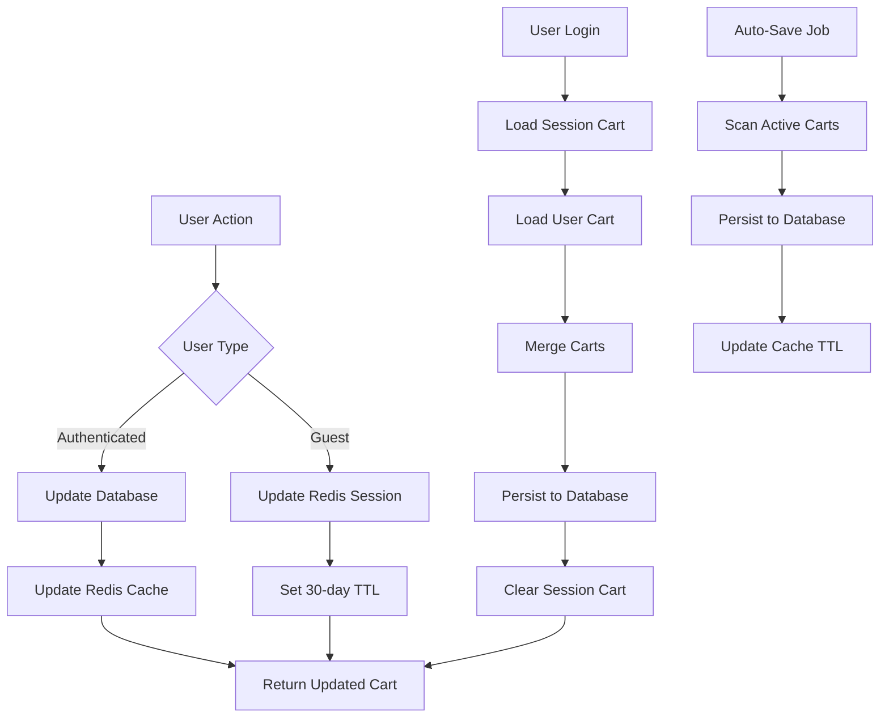

## 18. State Management

### 18.1 Client-Side Cart State Management

**Requirement:** Robust client-side cart state management with synchronization

```javascript
// Vuex Store for Cart State Management
const cartStore = {
    namespaced: true,
    
    state: {
        cart: null,
        items: [],
        subtotal: 0,
        tax: 0,
        total: 0,
        isLoading: false,
        isCalculating: false,
        error: null,
        lastSyncTime: null
    },
    
    getters: {
        itemCount: (state) => {
            return state.items.reduce((sum, item) => sum + item.quantity, 0);
        },
        
        isEmpty: (state) => {
            return state.items.length === 0;
        },
        
        getItemById: (state) => (itemId) => {
            return state.items.find(item => item.id === itemId);
        },
        
        needsSync: (state) => {
            if (!state.lastSyncTime) return true;
            const fiveMinutes = 5 * 60 * 1000;
            return Date.now() - state.lastSyncTime > fiveMinutes;
        }
    },
    
    mutations: {
        SET_CART(state, cart) {
            state.cart = cart;
            state.items = cart.items || [];
            state.subtotal = cart.subtotal || 0;
            state.tax = cart.tax || 0;
            state.total = cart.total || 0;
            state.lastSyncTime = Date.now();
        },
        
        SET_LOADING(state, isLoading) {
            state.isLoading = isLoading;
        },
        
        SET_CALCULATING(state, isCalculating) {
            state.isCalculating = isCalculating;
        },
        
        SET_ERROR(state, error) {
            state.error = error;
        },
        
        UPDATE_ITEM_QUANTITY(state, { itemId, quantity }) {
            const item = state.items.find(i => i.id === itemId);
            if (item) {
                item.quantity = quantity;
                item.subtotal = item.unitPrice * quantity;
            }
        },
        
        REMOVE_ITEM(state, itemId) {
            state.items = state.items.filter(item => item.id !== itemId);
        },
        
        CLEAR_CART(state) {
            state.cart = null;
            state.items = [];
            state.subtotal = 0;
            state.tax = 0;
            state.total = 0;
        }
    },
    
    actions: {
        async fetchCart({ commit }, userId) {
            commit('SET_LOADING', true);
            commit('SET_ERROR', null);
            
            try {
                const response = await cartApi.getCart(userId);
                commit('SET_CART', response.data);
            } catch (error) {
                commit('SET_ERROR', {
                    type: 'error',
                    title: 'Failed to Load Cart',
                    message: error.message
                });
                throw error;
            } finally {
                commit('SET_LOADING', false);
            }
        },
        
        async addItem({ commit, dispatch }, { userId, productId, quantity, isSubscription }) {
            commit('SET_LOADING', true);
            commit('SET_ERROR', null);
            
            try {
                const response = await cartApi.addItem({
                    userId,
                    productId,
                    quantity,
                    isSubscription
                });
                
                commit('SET_CART', response.data);
                
                return response.data;
            } catch (error) {
                commit('SET_ERROR', {
                    type: 'error',
                    title: 'Failed to Add Item',
                    message: error.response?.data?.message || error.message
                });
                throw error;
            } finally {
                commit('SET_LOADING', false);
            }
        },
        
        async updateItemQuantity({ commit, state }, { itemId, quantity }) {
            commit('SET_CALCULATING', true);
            commit('SET_ERROR', null);
            
            // Optimistic update
            const originalItem = state.items.find(i => i.id === itemId);
            const originalQuantity = originalItem?.quantity;
            
            commit('UPDATE_ITEM_QUANTITY', { itemId, quantity });
            
            try {
                const response = await cartApi.updateItemQuantity(itemId, quantity);
                commit('SET_CART', response.data);
            } catch (error) {
                // Rollback on error
                if (originalQuantity) {
                    commit('UPDATE_ITEM_QUANTITY', { itemId, quantity: originalQuantity });
                }
                
                commit('SET_ERROR', {
                    type: 'error',
                    title: 'Failed to Update Quantity',
                    message: error.response?.data?.message || error.message
                });
                throw error;
            } finally {
                commit('SET_CALCULATING', false);
            }
        },
        
        async removeItem({ commit }, itemId) {
            commit('SET_LOADING', true);
            commit('SET_ERROR', null);
            
            try {
                const response = await cartApi.removeItem(itemId);
                commit('SET_CART', response.data);
            } catch (error) {
                commit('SET_ERROR', {
                    type: 'error',
                    title: 'Failed to Remove Item',
                    message: error.message
                });
                throw error;
            } finally {
                commit('SET_LOADING', false);
            }
        },
        
        async syncCart({ dispatch, getters }, userId) {
            if (getters.needsSync) {
                await dispatch('fetchCart', userId);
            }
        }
    }
};
```

### 18.2 Backend State Management

```java
@Service
public class CartStateManagementService {
    
    @Autowired
    private CartRepository cartRepository;
    
    @Autowired
    private RedisTemplate<String, CartDTO> redisTemplate;
    
    private static final String CART_CACHE_PREFIX = "cart:";
    private static final Duration CACHE_TTL = Duration.ofMinutes(30);
    
    public CartDTO getCartState(Long userId) {
        // Try cache first
        String cacheKey = CART_CACHE_PREFIX + userId;
        CartDTO cachedCart = redisTemplate.opsForValue().get(cacheKey);
        
        if (cachedCart != null) {
            return cachedCart;
        }
        
        // Load from database
        Cart cart = cartRepository.findByUserId(userId)
            .orElseThrow(() -> new CartNotFoundException("Cart not found"));
        
        CartDTO cartDTO = buildCartDTO(cart);
        
        // Update cache
        redisTemplate.opsForValue().set(cacheKey, cartDTO, CACHE_TTL);
        
        return cartDTO;
    }
    
    public void updateCartState(Long userId, CartDTO cartDTO) {
        String cacheKey = CART_CACHE_PREFIX + userId;
        redisTemplate.opsForValue().set(cacheKey, cartDTO, CACHE_TTL);
    }
    
    public void invalidateCartState(Long userId) {
        String cacheKey = CART_CACHE_PREFIX + userId;
        redisTemplate.delete(cacheKey);
    }
    
    @Transactional
    public synchronized CartDTO synchronizeCartState(Long userId) {
        // Ensure consistency between cache and database
        Cart cart = cartRepository.findByUserId(userId)
            .orElseThrow(() -> new CartNotFoundException("Cart not found"));
        
        CartDTO cartDTO = buildCartDTO(cart);
        updateCartState(userId, cartDTO);
        
        return cartDTO;
    }
}
```

## 19. Data Persistence

### 19.1 Cart State Persistence Strategy

**Requirement:** Cart state persistence across user sessions with database integration

```java
@Service
public class CartPersistenceService {
    
    @Autowired
    private CartRepository cartRepository;
    
    @Autowired
    private CartItemRepository cartItemRepository;
    
    @Autowired
    private RedisTemplate<String, Object> redisTemplate;
    
    private static final String SESSION_CART_PREFIX = "session:cart:";
    private static final Duration SESSION_TTL = Duration.ofDays(30);
    
    /**
     * Persist cart state to database
     */
    @Transactional
    public Cart persistCart(Long userId, List<CartItemDTO> items) {
        Cart cart = cartRepository.findByUserId(userId)
            .orElseGet(() -> createNewCart(userId));
        
        cart.setUpdatedAt(LocalDateTime.now());
        cart = cartRepository.save(cart);
        
        // Persist cart items
        for (CartItemDTO itemDTO : items) {
            CartItem cartItem = cartItemRepository
                .findByCartIdAndProductId(cart.getId(), itemDTO.getProductId())
                .orElseGet(() -> createNewCartItem(cart.getId(), itemDTO));
            
            cartItem.setQuantity(itemDTO.getQuantity());
            cartItem.setUnitPrice(itemDTO.getUnitPrice());
            cartItem.setSubtotal(itemDTO.getSubtotal());
            
            cartItemRepository.save(cartItem);
        }
        
        return cart;
    }
    
    /**
     * Load persisted cart state
     */
    public CartDTO loadPersistedCart(Long userId) {
        Optional<Cart> cartOpt = cartRepository.findByUserId(userId);
        
        if (cartOpt.isEmpty()) {
            return createEmptyCartDTO(userId);
        }
        
        Cart cart = cartOpt.get();
        List<CartItem> items = cartItemRepository.findByCartId(cart.getId());
        
        return buildCartDTO(cart, items);
    }
    
    /**
     * Persist session cart for guest users
     */
    public void persistSessionCart(String sessionId, CartDTO cartDTO) {
        String key = SESSION_CART_PREFIX + sessionId;
        redisTemplate.opsForValue().set(key, cartDTO, SESSION_TTL);
    }
    
    /**
     * Load session cart for guest users
     */
    public CartDTO loadSessionCart(String sessionId) {
        String key = SESSION_CART_PREFIX + sessionId;
        Object cartObj = redisTemplate.opsForValue().get(key);
        
        if (cartObj instanceof CartDTO) {
            return (CartDTO) cartObj;
        }
        
        return createEmptyCartDTO(null);
    }
    
    /**
     * Merge session cart with user cart on login
     */
    @Transactional
    public CartDTO mergeSessionCartWithUserCart(String sessionId, Long userId) {
        CartDTO sessionCart = loadSessionCart(sessionId);
        CartDTO userCart = loadPersistedCart(userId);
        
        if (sessionCart.getItems().isEmpty()) {
            return userCart;
        }
        
        // Merge items
        Map<Long, CartItemDTO> mergedItems = new HashMap<>();
        
        // Add user cart items
        for (CartItemDTO item : userCart.getItems()) {
            mergedItems.put(item.getProductId(), item);
        }
        
        // Merge session cart items
        for (CartItemDTO sessionItem : sessionCart.getItems()) {
            CartItemDTO existingItem = mergedItems.get(sessionItem.getProductId());
            
            if (existingItem != null) {
                // Combine quantities
                int newQuantity = existingItem.getQuantity() + sessionItem.getQuantity();
                existingItem.setQuantity(newQuantity);
                existingItem.setSubtotal(
                    existingItem.getUnitPrice().multiply(new BigDecimal(newQuantity))
                );
            } else {
                mergedItems.put(sessionItem.getProductId(), sessionItem);
            }
        }
        
        // Persist merged cart
        Cart cart = persistCart(userId, new ArrayList<>(mergedItems.values()));
        
        // Clear session cart
        redisTemplate.delete(SESSION_CART_PREFIX + sessionId);
        
        return buildCartDTO(cart, cartItemRepository.findByCartId(cart.getId()));
    }
    
    /**
     * Auto-save cart state periodically
     */
    @Scheduled(fixedDelay = 60000) // Every minute
    public void autoSaveActiveCarts() {
        // Find all active carts in cache
        Set<String> keys = redisTemplate.keys(SESSION_CART_PREFIX + "*");
        
        if (keys != null) {
            for (String key : keys) {
                try {
                    Object cartObj = redisTemplate.opsForValue().get(key);
                    if (cartObj instanceof CartDTO) {
                        CartDTO cartDTO = (CartDTO) cartObj;
                        if (cartDTO.getUserId() != null) {
                            persistCart(cartDTO.getUserId(), cartDTO.getItems());
                        }
                    }
                } catch (Exception e) {
                    log.error("Failed to auto-save cart for key: {}", key, e);
                }
            }
        }
    }
    
    private Cart createNewCart(Long userId) {
        Cart cart = new Cart();
        cart.setUserId(userId);
        cart.setStatus("ACTIVE");
        cart.setCreatedAt(LocalDateTime.now());
        cart.setUpdatedAt(LocalDateTime.now());
        return cart;
    }
    
    private CartItem createNewCartItem(Long cartId, CartItemDTO itemDTO) {
        CartItem cartItem = new CartItem();
        cartItem.setCartId(cartId);
        cartItem.setProductId(itemDTO.getProductId());
        return cartItem;
    }
}
```

### 19.2 Data Persistence Diagram


