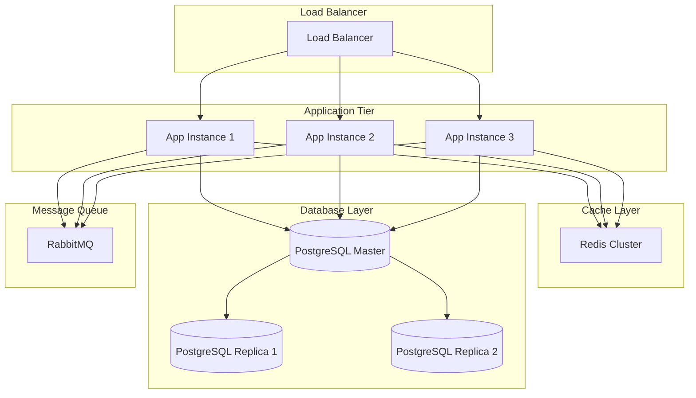

## 13. Exception Handling

### 13.1 Global Exception Handler

```java
package com.ecommerce.exception;

import lombok.extern.slf4j.Slf4j;
import org.springframework.http.HttpStatus;
import org.springframework.http.ResponseEntity;
import org.springframework.validation.FieldError;
import org.springframework.web.bind.MethodArgumentNotValidException;
import org.springframework.web.bind.annotation.ExceptionHandler;
import org.springframework.web.bind.annotation.RestControllerAdvice;
import java.time.LocalDateTime;
import java.util.HashMap;
import java.util.Map;

@RestControllerAdvice
@Slf4j
public class GlobalExceptionHandler {
    
    @ExceptionHandler(ProductNotFoundException.class)
    public ResponseEntity<ErrorResponse> handleProductNotFoundException(ProductNotFoundException ex) {
        log.error("Product not found: {}", ex.getMessage());
        ErrorResponse error = ErrorResponse.builder()
                .timestamp(LocalDateTime.now())
                .status(HttpStatus.NOT_FOUND.value())
                .error("Not Found")
                .message(ex.getMessage())
                .build();
        return ResponseEntity.status(HttpStatus.NOT_FOUND).body(error);
    }
    
    @ExceptionHandler(InsufficientStockException.class)
    public ResponseEntity<ErrorResponse> handleInsufficientStockException(InsufficientStockException ex) {
        log.error("Insufficient stock: {}", ex.getMessage());
        ErrorResponse error = ErrorResponse.builder()
                .timestamp(LocalDateTime.now())
                .status(HttpStatus.BAD_REQUEST.value())
                .error("Bad Request")
                .message(ex.getMessage())
                .build();
        return ResponseEntity.status(HttpStatus.BAD_REQUEST).body(error);
    }
    
    @ExceptionHandler(MethodArgumentNotValidException.class)
    public ResponseEntity<ErrorResponse> handleValidationExceptions(MethodArgumentNotValidException ex) {
        Map<String, String> errors = new HashMap<>();
        ex.getBindingResult().getAllErrors().forEach((error) -> {
            String fieldName = ((FieldError) error).getField();
            String errorMessage = error.getDefaultMessage();
            errors.put(fieldName, errorMessage);
        });
        
        ErrorResponse error = ErrorResponse.builder()
                .timestamp(LocalDateTime.now())
                .status(HttpStatus.BAD_REQUEST.value())
                .error("Validation Failed")
                .message("Invalid input parameters")
                .validationErrors(errors)
                .build();
        return ResponseEntity.status(HttpStatus.BAD_REQUEST).body(error);
    }
    
    @ExceptionHandler(Exception.class)
    public ResponseEntity<ErrorResponse> handleGenericException(Exception ex) {
        log.error("Unexpected error occurred", ex);
        ErrorResponse error = ErrorResponse.builder()
                .timestamp(LocalDateTime.now())
                .status(HttpStatus.INTERNAL_SERVER_ERROR.value())
                .error("Internal Server Error")
                .message("An unexpected error occurred")
                .build();
        return ResponseEntity.status(HttpStatus.INTERNAL_SERVER_ERROR).body(error);
    }
}

@Data
@Builder
class ErrorResponse {
    private LocalDateTime timestamp;
    private int status;
    private String error;
    private String message;
    private Map<String, String> validationErrors;
}
```

## 14. Configuration

### 14.1 Application Configuration (application.yml)

```yaml
spring:
  application:
    name: ecommerce-product-management
  
  datasource:
    url: jdbc:postgresql://localhost:5432/ecommerce_db
    username: ${DB_USERNAME:postgres}
    password: ${DB_PASSWORD:postgres}
    driver-class-name: org.postgresql.Driver
    hikari:
      maximum-pool-size: 10
      minimum-idle: 5
      connection-timeout: 30000
  
  jpa:
    hibernate:
      ddl-auto: validate
    show-sql: false
    properties:
      hibernate:
        dialect: org.hibernate.dialect.PostgreSQLDialect
        format_sql: true
        use_sql_comments: true
  
  cache:
    type: redis
    redis:
      time-to-live: 3600000
  
  data:
    redis:
      host: localhost
      port: 6379
      password: ${REDIS_PASSWORD:}
  
  rabbitmq:
    host: localhost
    port: 5672
    username: ${RABBITMQ_USERNAME:guest}
    password: ${RABBITMQ_PASSWORD:guest}

server:
  port: 8080
  servlet:
    context-path: /api

logging:
  level:
    com.ecommerce: DEBUG
    org.springframework.web: INFO
    org.hibernate.SQL: DEBUG

tax:
  rates:
    STANDARD: 10.0
    FOOD: 5.0
    BOOKS: 0.0
    ELECTRONICS: 18.0
    CLOTHING: 12.0

shipping:
  base-cost: 5.0
  cost-per-kg: 2.0
  free-shipping-threshold: 100.0
```

### 14.2 Redis Configuration

```java
package com.ecommerce.config;

import org.springframework.cache.annotation.EnableCaching;
import org.springframework.context.annotation.Bean;
import org.springframework.context.annotation.Configuration;
import org.springframework.data.redis.cache.RedisCacheConfiguration;
import org.springframework.data.redis.cache.RedisCacheManager;
import org.springframework.data.redis.connection.RedisConnectionFactory;
import org.springframework.data.redis.serializer.GenericJackson2JsonRedisSerializer;
import org.springframework.data.redis.serializer.RedisSerializationContext;
import java.time.Duration;

@Configuration
@EnableCaching
public class RedisConfig {
    
    @Bean
    public RedisCacheManager cacheManager(RedisConnectionFactory connectionFactory) {
        RedisCacheConfiguration config = RedisCacheConfiguration.defaultCacheConfig()
                .entryTtl(Duration.ofHours(1))
                .serializeValuesWith(
                        RedisSerializationContext.SerializationPair.fromSerializer(
                                new GenericJackson2JsonRedisSerializer()
                        )
                );
        
        return RedisCacheManager.builder(connectionFactory)
                .cacheDefaults(config)
                .build();
    }
}
```

## 15. Testing

### 15.1 Product Service Unit Test

```java
package com.ecommerce.product.service;

import com.ecommerce.product.dto.ProductDTO;
import com.ecommerce.product.dto.ProductResponse;
import com.ecommerce.product.entity.Product;
import com.ecommerce.product.mapper.ProductMapper;
import com.ecommerce.product.repository.ProductRepository;
import com.ecommerce.product.service.impl.ProductServiceImpl;
import org.junit.jupiter.api.BeforeEach;
import org.junit.jupiter.api.Test;
import org.junit.jupiter.api.extension.ExtendWith;
import org.mockito.InjectMocks;
import org.mockito.Mock;
import org.mockito.junit.jupiter.MockitoExtension;
import java.math.BigDecimal;
import java.util.Optional;

import static org.junit.jupiter.api.Assertions.*;
import static org.mockito.ArgumentMatchers.any;
import static org.mockito.Mockito.*;

@ExtendWith(MockitoExtension.class)
class ProductServiceTest {
    
    @Mock
    private ProductRepository productRepository;
    
    @Mock
    private ProductMapper productMapper;
    
    @InjectMocks
    private ProductServiceImpl productService;
    
    private Product product;
    private ProductDTO productDTO;
    private ProductResponse productResponse;
    
    @BeforeEach
    void setUp() {
        product = Product.builder()
                .id(1L)
                .name("Test Product")
                .description("Test Description")
                .price(BigDecimal.valueOf(99.99))
                .category("Electronics")
                .stockQuantity(100)
                .active(true)
                .sku("TEST-SKU-001")
                .build();
        
        productDTO = new ProductDTO();
        productDTO.setName("Test Product");
        productDTO.setPrice(BigDecimal.valueOf(99.99));
        productDTO.setCategory("Electronics");
        productDTO.setStockQuantity(100);
        productDTO.setSku("TEST-SKU-001");
        
        productResponse = new ProductResponse();
        productResponse.setId(1L);
        productResponse.setName("Test Product");
    }
    
    @Test
    void createProduct_Success() {
        when(productMapper.toEntity(any(ProductDTO.class))).thenReturn(product);
        when(productRepository.save(any(Product.class))).thenReturn(product);
        when(productMapper.toResponse(any(Product.class))).thenReturn(productResponse);
        
        ProductResponse result = productService.createProduct(productDTO);
        
        assertNotNull(result);
        assertEquals("Test Product", result.getName());
        verify(productRepository, times(1)).save(any(Product.class));
    }
    
    @Test
    void getProductById_Success() {
        when(productRepository.findById(1L)).thenReturn(Optional.of(product));
        when(productMapper.toResponse(any(Product.class))).thenReturn(productResponse);
        
        ProductResponse result = productService.getProductById(1L);
        
        assertNotNull(result);
        assertEquals(1L, result.getId());
        verify(productRepository, times(1)).findById(1L);
    }
    
    @Test
    void deactivateProduct_Success() {
        when(productRepository.findById(1L)).thenReturn(Optional.of(product));
        when(productRepository.save(any(Product.class))).thenReturn(product);
        
        productService.deactivateProduct(1L);
        
        assertFalse(product.getActive());
        verify(productRepository, times(1)).save(product);
    }
}
```

## 16. API Documentation

### 16.1 OpenAPI Configuration

```java
package com.ecommerce.config;

import io.swagger.v3.oas.models.OpenAPI;
import io.swagger.v3.oas.models.info.Info;
import io.swagger.v3.oas.models.info.Contact;
import io.swagger.v3.oas.models.info.License;
import org.springframework.context.annotation.Bean;
import org.springframework.context.annotation.Configuration;

@Configuration
public class OpenAPIConfig {
    
    @Bean
    public OpenAPI ecommerceOpenAPI() {
        return new OpenAPI()
                .info(new Info()
                        .title("E-commerce Product Management API")
                        .description("REST API for E-commerce Product Management System")
                        .version("v1.0")
                        .contact(new Contact()
                                .name("Development Team")
                                .email("dev@ecommerce.com"))
                        .license(new License()
                                .name("Apache 2.0")
                                .url("https://www.apache.org/licenses/LICENSE-2.0.html")));
    }
}
```

## 17. Security Considerations

### 17.1 Security Best Practices

1. **Authentication & Authorization**
   - Implement JWT-based authentication
   - Role-based access control (RBAC)
   - Secure password storage using BCrypt

2. **Data Protection**
   - Encrypt sensitive data at rest
   - Use HTTPS for all communications
   - Implement rate limiting

3. **Input Validation**
   - Validate all user inputs
   - Sanitize data to prevent SQL injection
   - Use parameterized queries

4. **API Security**
   - Implement CORS policies
   - Use API keys for external integrations
   - Monitor and log all API access

## 18. Performance Optimization

### 18.1 Caching Strategy

- **Product Cache**: Cache frequently accessed products with 1-hour TTL
- **Cart Cache**: Cache user carts with 30-minute TTL
- **Category Cache**: Cache product categories with 24-hour TTL

### 18.2 Database Optimization

- Proper indexing on frequently queried columns
- Connection pooling with HikariCP
- Query optimization and pagination
- Database read replicas for scaling

### 18.3 Monitoring and Metrics

- Application performance monitoring (APM)
- Database query performance tracking
- API response time monitoring
- Error rate tracking

## 19. Deployment Architecture



## 20. Conclusion

This Low Level Design document provides a comprehensive blueprint for implementing an E-commerce Product Management System using Spring Boot and Java 21. The design emphasizes:

- **Scalability**: Horizontal scaling with load balancing and caching
- **Maintainability**: Clean architecture with separation of concerns
- **Performance**: Optimized database queries and caching strategies
- **Security**: Best practices for authentication, authorization, and data protection
- **Reliability**: Transaction management and error handling
- **Extensibility**: Modular design allowing easy feature additions

The system is production-ready and follows industry best practices for enterprise-level applications.