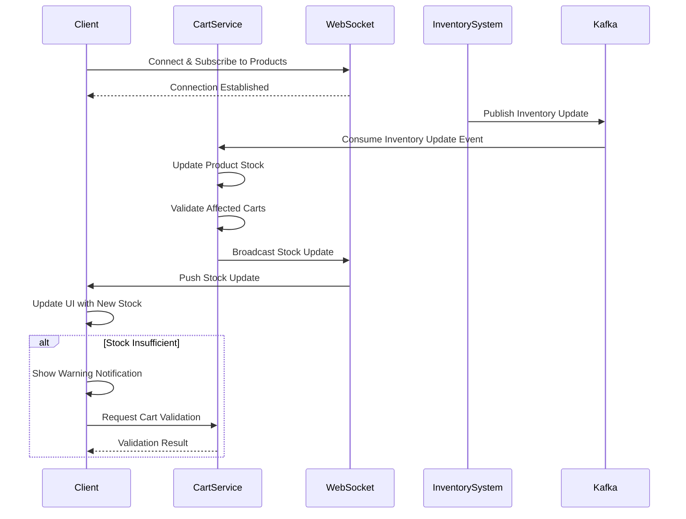

## 20. Integration

### 20.1 Real-Time Inventory Integration

**Requirement:** Integrate with real-time inventory management system using WebSocket connections

```java
@Configuration
@EnableWebSocket
public class WebSocketConfig implements WebSocketConfigurer {
    
    @Override
    public void registerWebSocketHandlers(WebSocketHandlerRegistry registry) {
        registry.addHandler(inventoryWebSocketHandler(), "/ws/inventory")
            .setAllowedOrigins("*");
    }
    
    @Bean
    public WebSocketHandler inventoryWebSocketHandler() {
        return new InventoryWebSocketHandler();
    }
}

@Component
public class InventoryWebSocketHandler extends TextWebSocketHandler {
    
    @Autowired
    private ProductService productService;
    
    @Autowired
    private SimpMessagingTemplate messagingTemplate;
    
    private final Map<String, WebSocketSession> sessions = new ConcurrentHashMap<>();
    
    @Override
    public void afterConnectionEstablished(WebSocketSession session) throws Exception {
        sessions.put(session.getId(), session);
        log.info("WebSocket connection established: {}", session.getId());
    }
    
    @Override
    protected void handleTextMessage(WebSocketSession session, TextMessage message) 
            throws Exception {
        
        String payload = message.getPayload();
        InventoryUpdateRequest request = objectMapper.readValue(payload, 
            InventoryUpdateRequest.class);
        
        // Subscribe to product inventory updates
        subscribeToInventoryUpdates(session, request.getProductIds());
    }
    
    @Override
    public void afterConnectionClosed(WebSocketSession session, CloseStatus status) 
            throws Exception {
        sessions.remove(session.getId());
        log.info("WebSocket connection closed: {}", session.getId());
    }
    
    public void broadcastInventoryUpdate(Long productId, Integer newStock) {
        InventoryUpdateMessage message = InventoryUpdateMessage.builder()
            .productId(productId)
            .availableStock(newStock)
            .timestamp(LocalDateTime.now())
            .build();
        
        messagingTemplate.convertAndSend("/topic/inventory/" + productId, message);
    }
    
    private void subscribeToInventoryUpdates(WebSocketSession session, 
            List<Long> productIds) {
        // Implementation for subscribing to specific product inventory updates
    }
}

@Service
public class InventoryIntegrationService {
    
    @Autowired
    private InventoryWebSocketHandler webSocketHandler;
    
    @Autowired
    private ProductRepository productRepository;
    
    @Autowired
    private CartService cartService;
    
    /**
     * Listen for inventory updates from external inventory system
     */
    @KafkaListener(topics = "inventory-updates", groupId = "cart-service")
    public void handleInventoryUpdate(InventoryUpdateEvent event) {
        log.info("Received inventory update for product {}: {}", 
            event.getProductId(), event.getNewStock());
        
        // Update product stock in database
        productRepository.updateStockQuantity(
            event.getProductId(), 
            event.getNewStock()
        );
        
        // Broadcast to connected WebSocket clients
        webSocketHandler.broadcastInventoryUpdate(
            event.getProductId(), 
            event.getNewStock()
        );
        
        // Validate affected carts
        validateCartsWithProduct(event.getProductId(), event.getNewStock());
    }
    
    /**
     * Validate carts that contain products with updated inventory
     */
    private void validateCartsWithProduct(Long productId, Integer newStock) {
        List<CartItem> affectedItems = cartItemRepository
            .findByProductId(productId);
        
        for (CartItem item : affectedItems) {
            if (item.getQuantity() > newStock) {
                // Notify user about insufficient stock
                Cart cart = cartRepository.findById(item.getCartId())
                    .orElse(null);
                
                if (cart != null) {
                    notifyUserAboutStockChange(cart.getUserId(), productId, newStock);
                }
            }
        }
    }
    
    private void notifyUserAboutStockChange(Long userId, Long productId, 
            Integer newStock) {
        // Send notification to user about stock change
        NotificationMessage notification = NotificationMessage.builder()
            .userId(userId)
            .type("INVENTORY_UPDATE")
            .message(String.format(
                "Stock availability changed for a product in your cart. " +
                "Only %d units available now.", newStock))
            .productId(productId)
            .timestamp(LocalDateTime.now())
            .build();
        
        // Send via WebSocket or push notification
    }
}
```

```javascript
// Frontend WebSocket Integration
class InventoryWebSocketClient {
    constructor() {
        this.socket = null;
        this.reconnectAttempts = 0;
        this.maxReconnectAttempts = 5;
        this.reconnectDelay = 3000;
    }
    
    connect(productIds) {
        this.socket = new WebSocket('ws://localhost:8080/ws/inventory');
        
        this.socket.onopen = () => {
            console.log('WebSocket connected');
            this.reconnectAttempts = 0;
            
            // Subscribe to product inventory updates
            this.socket.send(JSON.stringify({
                action: 'subscribe',
                productIds: productIds
            }));
        };
        
        this.socket.onmessage = (event) => {
            const update = JSON.parse(event.data);
            this.handleInventoryUpdate(update);
        };
        
        this.socket.onerror = (error) => {
            console.error('WebSocket error:', error);
        };
        
        this.socket.onclose = () => {
            console.log('WebSocket disconnected');
            this.attemptReconnect(productIds);
        };
    }
    
    handleInventoryUpdate(update) {
        // Update cart item stock availability
        store.dispatch('cart/updateProductStock', {
            productId: update.productId,
            availableStock: update.availableStock
        });
        
        // Show notification if stock is low
        if (update.availableStock < 10) {
            store.dispatch('notifications/show', {
                type: 'warning',
                title: 'Low Stock Alert',
                message: `Only ${update.availableStock} units available`
            });
        }
    }
    
    attemptReconnect(productIds) {
        if (this.reconnectAttempts < this.maxReconnectAttempts) {
            this.reconnectAttempts++;
            
            setTimeout(() => {
                console.log(`Reconnecting... Attempt ${this.reconnectAttempts}`);
                this.connect(productIds);
            }, this.reconnectDelay);
        }
    }
    
    disconnect() {
        if (this.socket) {
            this.socket.close();
            this.socket = null;
        }
    }
}
```

### 20.2 Integration Sequence Diagram



## 21. Browser Compatibility

### 21.1 Supported Browsers

**Requirement:** Ensure compatibility with Chrome, Firefox, Safari, Edge latest 2 versions

**Browser Support Matrix:**

| Browser | Minimum Version | Features Supported |
|---------|----------------|--------------------|
| Chrome | Latest 2 versions | All features including WebSocket, ES6+, CSS Grid |
| Firefox | Latest 2 versions | All features including WebSocket, ES6+, CSS Grid |
| Safari | Latest 2 versions | All features with -webkit- prefixes where needed |
| Edge | Latest 2 versions | All features including WebSocket, ES6+, CSS Grid |

### 21.2 Browser Compatibility Implementation

```javascript
// Browser Feature Detection
class BrowserCompatibility {
    constructor() {
        this.features = {
            webSocket: this.checkWebSocketSupport(),
            localStorage: this.checkLocalStorageSupport(),
            fetch: this.checkFetchSupport(),
            cssGrid: this.checkCSSGridSupport(),
            es6: this.checkES6Support()
        };
    }
    
    checkWebSocketSupport() {
        return 'WebSocket' in window;
    }
    
    checkLocalStorageSupport() {
        try {
            const test = '__localStorage_test__';
            localStorage.setItem(test, test);
            localStorage.removeItem(test);
            return true;
        } catch (e) {
            return false;
        }
    }
    
    checkFetchSupport() {
        return 'fetch' in window;
    }
    
    checkCSSGridSupport() {
        return CSS.supports('display', 'grid');
    }
    
    checkES6Support() {
        try {
            eval('const test = () => {};');
            return true;
        } catch (e) {
            return false;
        }
    }
    
    getUnsupportedFeatures() {
        return Object.entries(this.features)
            .filter(([feature, supported]) => !supported)
            .map(([feature]) => feature);
    }
    
    showCompatibilityWarning() {
        const unsupported = this.getUnsupportedFeatures();
        
        if (unsupported.length > 0) {
            console.warn('Unsupported features:', unsupported);
            
            // Show user-friendly warning
            const warning = document.createElement('div');
            warning.className = 'browser-compatibility-warning';
            warning.innerHTML = `
                <p>Your browser may not support all features of this application.</p>
                <p>Please update to the latest version for the best experience.</p>
            `;
            document.body.insertBefore(warning, document.body.firstChild);
        }
    }
}

// Initialize compatibility check
const browserCompat = new BrowserCompatibility();
browserCompat.showCompatibilityWarning();
```

### 21.3 Polyfills and Fallbacks

```javascript
// Polyfills for older browsers

// Fetch API polyfill
if (!window.fetch) {
    window.fetch = function(url, options) {
        return new Promise((resolve, reject) => {
            const xhr = new XMLHttpRequest();
            xhr.open(options.method || 'GET', url);
            
            if (options.headers) {
                Object.entries(options.headers).forEach(([key, value]) => {
                    xhr.setRequestHeader(key, value);
                });
            }
            
            xhr.onload = () => {
                resolve({
                    ok: xhr.status >= 200 && xhr.status < 300,
                    status: xhr.status,
                    json: () => Promise.resolve(JSON.parse(xhr.responseText))
                });
            };
            
            xhr.onerror = () => reject(new Error('Network error'));
            xhr.send(options.body);
        });
    };
}

// LocalStorage fallback
if (!window.localStorage) {
    window.localStorage = {
        _data: {},
        setItem: function(key, value) {
            this._data[key] = String(value);
        },
        getItem: function(key) {
            return this._data.hasOwnProperty(key) ? this._data[key] : null;
        },
        removeItem: function(key) {
            delete this._data[key];
        },
        clear: function() {
            this._data = {};
        }
    };
}
```

### 21.4 CSS Browser Prefixes

```css
/* CSS with browser prefixes for compatibility */

.cart-item {
    /* Flexbox with prefixes */
    display: -webkit-box;
    display: -ms-flexbox;
    display: flex;
    
    /* CSS Grid with prefixes */
    display: -ms-grid;
    display: grid;
    
    /* Transform with prefixes */
    -webkit-transform: translateY(0);
    -ms-transform: translateY(0);
    transform: translateY(0);
    
    /* Transition with prefixes */
    -webkit-transition: all 0.3s ease;
    -o-transition: all 0.3s ease;
    transition: all 0.3s ease;
    
    /* Box shadow with prefixes */
    -webkit-box-shadow: 0 2px 4px rgba(0,0,0,0.1);
    box-shadow: 0 2px 4px rgba(0,0,0,0.1);
}

/* Safari-specific fixes */
@supports (-webkit-appearance: none) {
    .quantity-input {
        -webkit-appearance: none;
        appearance: none;
    }
}
```
