# Low Level Design Document
# E-commerce Product Management System with Shopping Cart

## Document Control

| Version | Date | Author | Changes |
|---------|------|--------|----------|
| 1.0 | 2024-01-15 | Development Team | Initial LLD for Product Management |
| 2.0 | 2024-01-20 | Development Team | Added Shopping Cart Management (SCRUM-1140) |

## Change Summary (Version 2.0)

### Story: SCRUM-1140 - Shopping Cart Management

**Changes Applied:**
- Added ShoppingCartController, ShoppingCartService, ShoppingCartRepository, CartItemRepository
- Added ShoppingCart and CartItem entities
- Added shopping_carts and cart_items database tables
- Added 4 new sequence diagrams for cart operations
- Added 5 new API endpoints for cart management
- Integrated cart functionality with existing product management
- Updated class diagram to include cart components
- Updated ER diagram to show cart relationships

**Impacted Components:**
- Database Schema (new tables)
- API Layer (new endpoints)
- Service Layer (new services)
- Repository Layer (new repositories)
- Entity Model (new entities)

---

## Table of Contents

1. [Introduction](#1-introduction)
2. [System Architecture](#2-system-architecture)
3. [Component Design](#3-component-design)
4. [Data Model](#4-data-model)
5. [API Specifications](#5-api-specifications)
6. [Sequence Diagrams](#6-sequence-diagrams)
7. [Technology Stack](#7-technology-stack)
8. [Design Patterns](#8-design-patterns)
9. [Engineering Considerations](#9-engineering-considerations)
10. [Change Traceability](#10-change-traceability)

---

## 1. Introduction

### 1.1 Purpose

This Low Level Design (LLD) document provides detailed technical specifications for the E-commerce Product Management System with Shopping Cart functionality. It serves as a comprehensive guide for developers implementing the system, covering architecture, component design, data models, APIs, and integration points.

### 1.2 Scope

The system encompasses:
- **Product Management**: CRUD operations for products, category-based filtering, and search functionality
- **Shopping Cart Management**: Add/remove items, update quantities, view cart contents, and manage user shopping sessions
- **Integration**: Seamless integration between product catalog and shopping cart

### 1.3 Audience

- Software Developers
- System Architects
- QA Engineers
- Technical Project Managers
- DevOps Engineers

### 1.4 System Overview

The E-commerce Product Management System with Shopping Cart is a Spring Boot-based RESTful application that provides:

**Core Features:**
- Product catalog management
- Product search and filtering
- Shopping cart operations
- Cart persistence per user
- Real-time inventory validation

**Technical Foundation:**
- Framework: Spring Boot 3.x
- Language: Java 21
- Database: PostgreSQL
- Architecture: Layered (Controller → Service → Repository)
- API Style: RESTful

---

## 2. System Architecture

### 2.1 High-Level Architecture

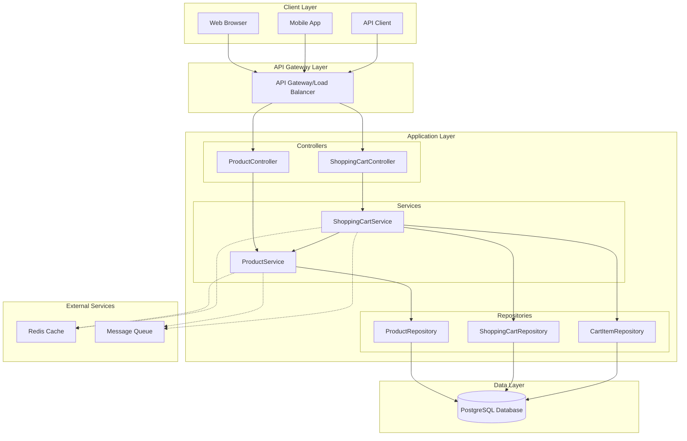
```mermaid
graph TB
    subgraph "Client Layer"
        WEB[Web Browser]
        MOBILE[Mobile App]
        API_CLIENT[API Client]
    end
    
    subgraph "API Gateway Layer"
        GATEWAY[API Gateway/Load Balancer]
    end
    
    subgraph "Application Layer"
        subgraph "Controllers"
            PC[ProductController]
            SCC[ShoppingCartController]
        end
        
        subgraph "Services"
            PS[ProductService]
            SCS[ShoppingCartService]
        end
        
        subgraph "Repositories"
            PR[ProductRepository]
            SCR[ShoppingCartRepository]
            CIR[CartItemRepository]
        end
    end
    
    subgraph "Data Layer"
        DB[(PostgreSQL Database)]
    end
    
    subgraph "External Services"
        CACHE[Redis Cache]
        QUEUE[Message Queue]
    end
    
    WEB --> GATEWAY
    MOBILE --> GATEWAY
    API_CLIENT --> GATEWAY
    
    GATEWAY --> PC
    GATEWAY --> SCC
    
    PC --> PS
    SCC --> SCS
    
    PS --> PR
    SCS --> SCR
    SCS --> CIR
    SCS --> PS
    
    PR --> DB
    SCR --> DB
    CIR --> DB
    
    PS -.-> CACHE
    SCS -.-> CACHE
    PS -.-> QUEUE
    SCS -.-> QUEUE
```

### 2.2 Component Interaction Diagram

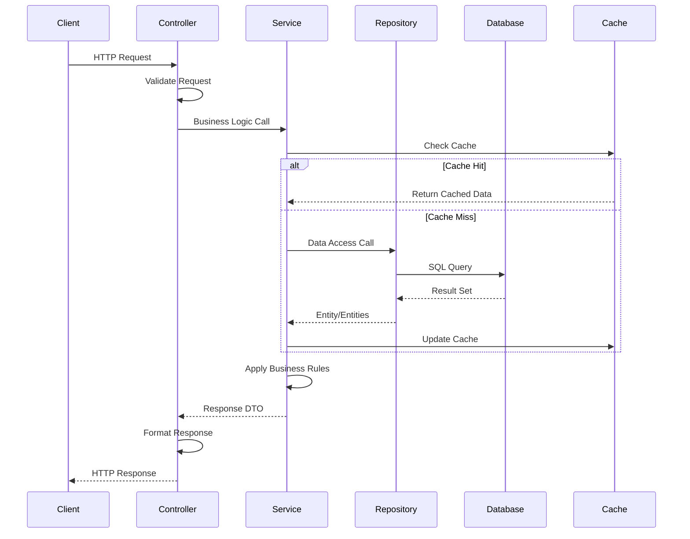
```mermaid
sequenceDiagram
    participant Client
    participant Controller
    participant Service
    participant Repository
    participant Database
    participant Cache
    
    Client->>Controller: HTTP Request
    Controller->>Controller: Validate Request
    Controller->>Service: Business Logic Call
    Service->>Cache: Check Cache
    alt Cache Hit
        Cache-->>Service: Return Cached Data
    else Cache Miss
        Service->>Repository: Data Access Call
        Repository->>Database: SQL Query
        Database-->>Repository: Result Set
        Repository-->>Service: Entity/Entities
        Service->>Cache: Update Cache
    end
    Service->>Service: Apply Business Rules
    Service-->>Controller: Response DTO
    Controller->>Controller: Format Response
    Controller-->>Client: HTTP Response
```

### 2.3 Layered Architecture

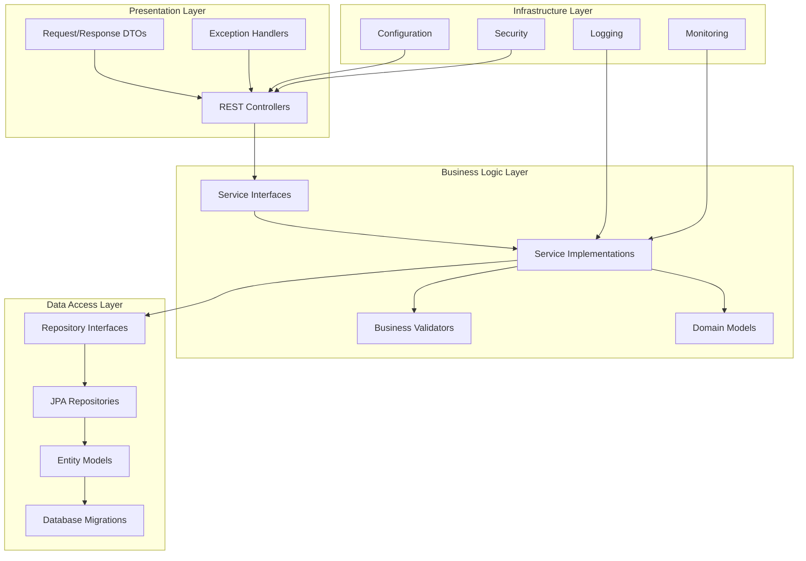
```mermaid
graph TD
    subgraph "Presentation Layer"
        A[REST Controllers]
        B[Request/Response DTOs]
        C[Exception Handlers]
    end
    
    subgraph "Business Logic Layer"
        D[Service Interfaces]
        E[Service Implementations]
        F[Business Validators]
        G[Domain Models]
    end
    
    subgraph "Data Access Layer"
        H[Repository Interfaces]
        I[JPA Repositories]
        J[Entity Models]
        K[Database Migrations]
    end
    
    subgraph "Infrastructure Layer"
        L[Configuration]
        M[Security]
        N[Logging]
        O[Monitoring]
    end
    
    A --> D
    B --> A
    C --> A
    D --> E
    E --> F
    E --> G
    E --> H
    H --> I
    I --> J
    J --> K
    L --> A
    M --> A
    N --> E
    O --> E
```

### 2.4 Deployment Architecture

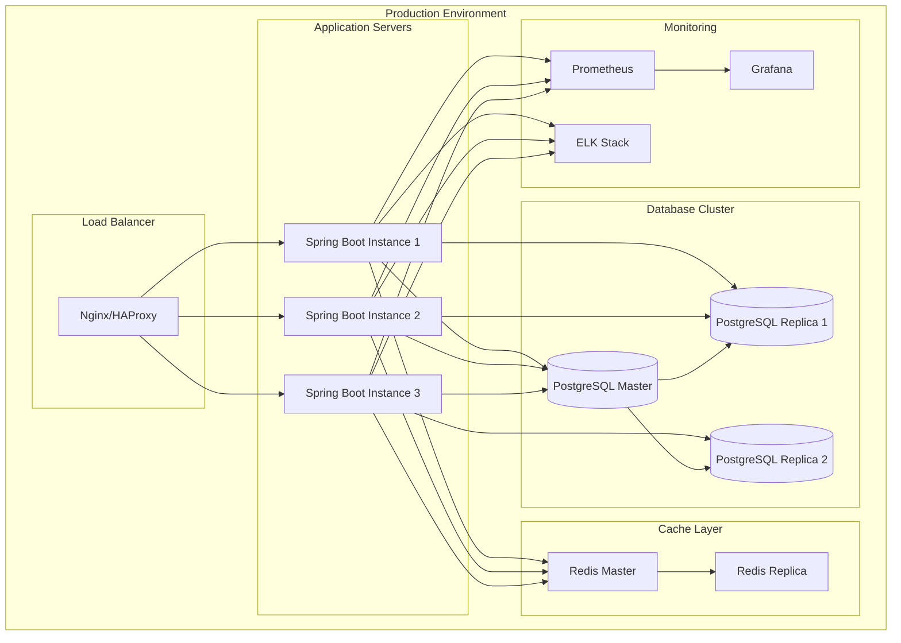
```mermaid
graph TB
    subgraph "Production Environment"
        subgraph "Load Balancer"
            LB[Nginx/HAProxy]
        end
        
        subgraph "Application Servers"
            APP1[Spring Boot Instance 1]
            APP2[Spring Boot Instance 2]
            APP3[Spring Boot Instance 3]
        end
        
        subgraph "Database Cluster"
            DB_MASTER[(PostgreSQL Master)]
            DB_REPLICA1[(PostgreSQL Replica 1)]
            DB_REPLICA2[(PostgreSQL Replica 2)]
        end
        
        subgraph "Cache Layer"
            REDIS1[Redis Master]
            REDIS2[Redis Replica]
        end
        
        subgraph "Monitoring"
            PROM[Prometheus]
            GRAF[Grafana]
            ELK[ELK Stack]
        end
    end
    
    LB --> APP1
    LB --> APP2
    LB --> APP3
    
    APP1 --> DB_MASTER
    APP2 --> DB_MASTER
    APP3 --> DB_MASTER
    
    APP1 --> DB_REPLICA1
    APP2 --> DB_REPLICA1
    APP3 --> DB_REPLICA2
    
    DB_MASTER --> DB_REPLICA1
    DB_MASTER --> DB_REPLICA2
    
    APP1 --> REDIS1
    APP2 --> REDIS1
    APP3 --> REDIS1
    
    REDIS1 --> REDIS2
    
    APP1 --> PROM
    APP2 --> PROM
    APP3 --> PROM
    PROM --> GRAF
    
    APP1 --> ELK
    APP2 --> ELK
    APP3 --> ELK
```

---

## 3. Component Design

### 3.1 Class Diagram

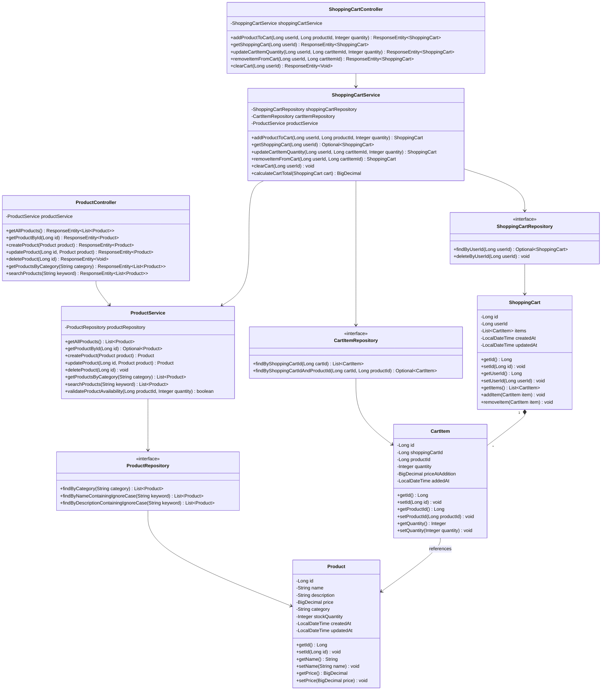
```mermaid
classDiagram
    class ProductController {
        -ProductService productService
        +getAllProducts() ResponseEntity~List~Product~~
        +getProductById(Long id) ResponseEntity~Product~
        +createProduct(Product product) ResponseEntity~Product~
        +updateProduct(Long id, Product product) ResponseEntity~Product~
        +deleteProduct(Long id) ResponseEntity~Void~
        +getProductsByCategory(String category) ResponseEntity~List~Product~~
        +searchProducts(String keyword) ResponseEntity~List~Product~~
    }
    
    class ProductService {
        -ProductRepository productRepository
        +getAllProducts() List~Product~
        +getProductById(Long id) Optional~Product~
        +createProduct(Product product) Product
        +updateProduct(Long id, Product product) Product
        +deleteProduct(Long id) void
        +getProductsByCategory(String category) List~Product~
        +searchProducts(String keyword) List~Product~
        +validateProductAvailability(Long productId, Integer quantity) boolean
    }
    
    class ProductRepository {
        <<interface>>
        +findByCategory(String category) List~Product~
        +findByNameContainingIgnoreCase(String keyword) List~Product~
        +findByDescriptionContainingIgnoreCase(String keyword) List~Product~
    }
    
    class Product {
        -Long id
        -String name
        -String description
        -BigDecimal price
        -String category
        -Integer stockQuantity
        -LocalDateTime createdAt
        -LocalDateTime updatedAt
        +getId() Long
        +setId(Long id) void
        +getName() String
        +setName(String name) void
        +getPrice() BigDecimal
        +setPrice(BigDecimal price) void
    }
    
    class ShoppingCartController {
        -ShoppingCartService shoppingCartService
        +addProductToCart(Long userId, Long productId, Integer quantity) ResponseEntity~ShoppingCart~
        +getShoppingCart(Long userId) ResponseEntity~ShoppingCart~
        +updateCartItemQuantity(Long userId, Long cartItemId, Integer quantity) ResponseEntity~ShoppingCart~
        +removeItemFromCart(Long userId, Long cartItemId) ResponseEntity~ShoppingCart~
        +clearCart(Long userId) ResponseEntity~Void~
    }
    
    class ShoppingCartService {
        -ShoppingCartRepository shoppingCartRepository
        -CartItemRepository cartItemRepository
        -ProductService productService
        +addProductToCart(Long userId, Long productId, Integer quantity) ShoppingCart
        +getShoppingCart(Long userId) Optional~ShoppingCart~
        +updateCartItemQuantity(Long userId, Long cartItemId, Integer quantity) ShoppingCart
        +removeItemFromCart(Long userId, Long cartItemId) ShoppingCart
        +clearCart(Long userId) void
        +calculateCartTotal(ShoppingCart cart) BigDecimal
    }
    
    class ShoppingCartRepository {
        <<interface>>
        +findByUserId(Long userId) Optional~ShoppingCart~
        +deleteByUserId(Long userId) void
    }
    
    class CartItemRepository {
        <<interface>>
        +findByShoppingCartId(Long cartId) List~CartItem~
        +findByShoppingCartIdAndProductId(Long cartId, Long productId) Optional~CartItem~
    }
    
    class ShoppingCart {
        -Long id
        -Long userId
        -List~CartItem~ items
        -LocalDateTime createdAt
        -LocalDateTime updatedAt
        +getId() Long
        +setId(Long id) void
        +getUserId() Long
        +setUserId(Long userId) void
        +getItems() List~CartItem~
        +addItem(CartItem item) void
        +removeItem(CartItem item) void
    }
    
    class CartItem {
        -Long id
        -Long shoppingCartId
        -Long productId
        -Integer quantity
        -BigDecimal priceAtAddition
        -LocalDateTime addedAt
        +getId() Long
        +setId(Long id) void
        +getProductId() Long
        +setProductId(Long productId) void
        +getQuantity() Integer
        +setQuantity(Integer quantity) void
    }
    
    ProductController --> ProductService
    ProductService --> ProductRepository
    ProductRepository --> Product
    
    ShoppingCartController --> ShoppingCartService
    ShoppingCartService --> ShoppingCartRepository
    ShoppingCartService --> CartItemRepository
    ShoppingCartService --> ProductService
    ShoppingCartRepository --> ShoppingCart
    CartItemRepository --> CartItem
    ShoppingCart "1" *-- "*" CartItem
    CartItem --> Product : references
```

### 3.2 Component Responsibilities

#### 3.2.1 Product Management Components

**ProductController**
- Handles HTTP requests for product operations
- Validates incoming request parameters
- Delegates business logic to ProductService
- Formats responses with appropriate HTTP status codes
- Handles exceptions and error responses

**ProductService**
- Implements core business logic for product management
- Validates business rules (e.g., price > 0, stock >= 0)
- Coordinates between controller and repository
- Manages transactions
- Implements search and filter logic
- Validates product availability for cart operations

**ProductRepository**
- Extends JpaRepository for database operations
- Provides custom query methods
- Handles data persistence and retrieval
- Manages database transactions at data layer

**Product Entity**
- Represents product data model
- Maps to products table
- Contains validation annotations
- Implements business entity logic

#### 3.2.2 Shopping Cart Components

**ShoppingCartController**
- Handles HTTP requests for cart operations
- Validates user authentication and authorization
- Manages cart-related endpoints
- Returns appropriate HTTP responses
- Handles cart-specific exceptions

**ShoppingCartService**
- Implements shopping cart business logic
- Manages cart item additions, updates, and removals
- Calculates cart totals and subtotals
- Validates product availability before adding to cart
- Coordinates with ProductService for product information
- Manages cart persistence and retrieval
- Implements cart expiration logic

**ShoppingCartRepository**
- Manages shopping cart data persistence
- Provides user-specific cart retrieval
- Handles cart deletion operations

**CartItemRepository**
- Manages cart item data persistence
- Provides cart-specific item queries
- Handles item-level operations

**ShoppingCart Entity**
- Represents user's shopping cart
- Contains collection of cart items
- Manages cart-level metadata
- Implements cart business rules

**CartItem Entity**
- Represents individual items in cart
- Links products to shopping carts
- Stores quantity and price at addition time
- Tracks item-level timestamps

### 3.3 Module Breakdown

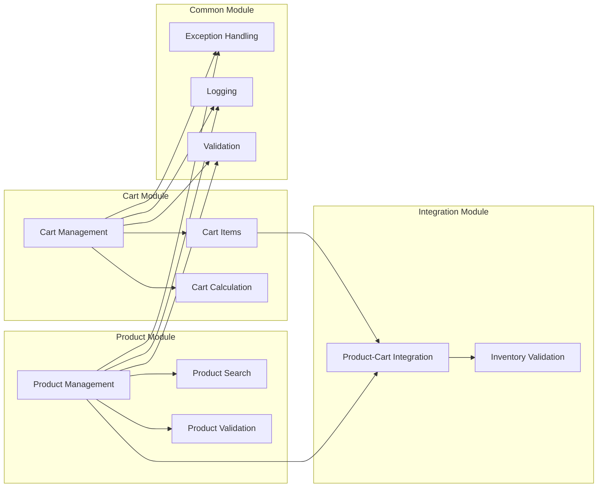
```mermaid
graph LR
    subgraph "Product Module"
        PM[Product Management]
        PS[Product Search]
        PV[Product Validation]
    end
    
    subgraph "Cart Module"
        CM[Cart Management]
        CI[Cart Items]
        CC[Cart Calculation]
    end
    
    subgraph "Integration Module"
        PI[Product-Cart Integration]
        IV[Inventory Validation]
    end
    
    subgraph "Common Module"
        EH[Exception Handling]
        LOG[Logging]
        VAL[Validation]
    end
    
    PM --> PS
    PM --> PV
    CM --> CI
    CM --> CC
    CI --> PI
    PM --> PI
    PI --> IV
    
    PM --> EH
    CM --> EH
    PM --> LOG
    CM --> LOG
    PM --> VAL
    CM --> VAL
```

---

## 4. Data Model

### 4.1 Entity Relationship Diagram

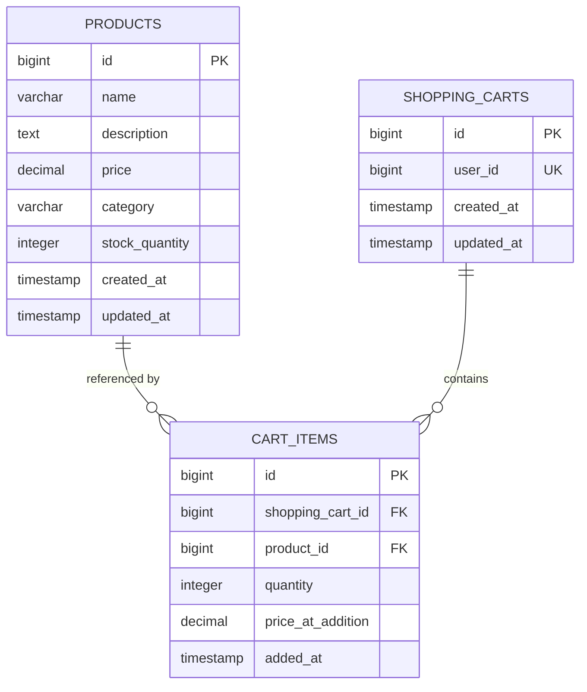
```mermaid
erDiagram
    PRODUCTS ||--o{ CART_ITEMS : "referenced by"
    SHOPPING_CARTS ||--o{ CART_ITEMS : contains
    
    PRODUCTS {
        bigint id PK
        varchar name
        text description
        decimal price
        varchar category
        integer stock_quantity
        timestamp created_at
        timestamp updated_at
    }
    
    SHOPPING_CARTS {
        bigint id PK
        bigint user_id UK
        timestamp created_at
        timestamp updated_at
    }
    
    CART_ITEMS {
        bigint id PK
        bigint shopping_cart_id FK
        bigint product_id FK
        integer quantity
        decimal price_at_addition
        timestamp added_at
    }
```

### 4.2 Database Schema

#### 4.2.1 Products Table

```sql
CREATE TABLE products (
    id BIGSERIAL PRIMARY KEY,
    name VARCHAR(255) NOT NULL,
    description TEXT,
    price DECIMAL(10, 2) NOT NULL CHECK (price >= 0),
    category VARCHAR(100) NOT NULL,
    stock_quantity INTEGER NOT NULL DEFAULT 0 CHECK (stock_quantity >= 0),
    created_at TIMESTAMP DEFAULT CURRENT_TIMESTAMP,
    updated_at TIMESTAMP DEFAULT CURRENT_TIMESTAMP,
    CONSTRAINT uk_product_name UNIQUE (name)
);

-- Indexes for performance
CREATE INDEX idx_products_category ON products(category);
CREATE INDEX idx_products_name ON products(name);
CREATE INDEX idx_products_price ON products(price);
CREATE INDEX idx_products_created_at ON products(created_at);

-- Full-text search index
CREATE INDEX idx_products_name_trgm ON products USING gin(name gin_trgm_ops);
CREATE INDEX idx_products_description_trgm ON products USING gin(description gin_trgm_ops);
```

**Column Specifications:**

| Column | Type | Constraints | Description |
|--------|------|-------------|-------------|
| id | BIGSERIAL | PRIMARY KEY | Auto-incrementing unique identifier |
| name | VARCHAR(255) | NOT NULL, UNIQUE | Product name |
| description | TEXT | NULL | Detailed product description |
| price | DECIMAL(10,2) | NOT NULL, >= 0 | Product price with 2 decimal places |
| category | VARCHAR(100) | NOT NULL | Product category for filtering |
| stock_quantity | INTEGER | NOT NULL, >= 0, DEFAULT 0 | Available inventory |
| created_at | TIMESTAMP | DEFAULT CURRENT_TIMESTAMP | Record creation timestamp |
| updated_at | TIMESTAMP | DEFAULT CURRENT_TIMESTAMP | Last update timestamp |

#### 4.2.2 Shopping Carts Table

```sql
CREATE TABLE shopping_carts (
    id BIGSERIAL PRIMARY KEY,
    user_id BIGINT NOT NULL,
    created_at TIMESTAMP DEFAULT CURRENT_TIMESTAMP,
    updated_at TIMESTAMP DEFAULT CURRENT_TIMESTAMP,
    CONSTRAINT uk_shopping_cart_user UNIQUE (user_id)
);

-- Indexes
CREATE INDEX idx_shopping_carts_user_id ON shopping_carts(user_id);
CREATE INDEX idx_shopping_carts_updated_at ON shopping_carts(updated_at);
```

**Column Specifications:**

| Column | Type | Constraints | Description |
|--------|------|-------------|-------------|
| id | BIGSERIAL | PRIMARY KEY | Auto-incrementing unique identifier |
| user_id | BIGINT | NOT NULL, UNIQUE | User identifier (one cart per user) |
| created_at | TIMESTAMP | DEFAULT CURRENT_TIMESTAMP | Cart creation timestamp |
| updated_at | TIMESTAMP | DEFAULT CURRENT_TIMESTAMP | Last modification timestamp |

#### 4.2.3 Cart Items Table

```sql
CREATE TABLE cart_items (
    id BIGSERIAL PRIMARY KEY,
    shopping_cart_id BIGINT NOT NULL,
    product_id BIGINT NOT NULL,
    quantity INTEGER NOT NULL CHECK (quantity > 0),
    price_at_addition DECIMAL(10, 2) NOT NULL CHECK (price_at_addition >= 0),
    added_at TIMESTAMP DEFAULT CURRENT_TIMESTAMP,
    CONSTRAINT fk_cart_items_shopping_cart 
        FOREIGN KEY (shopping_cart_id) 
        REFERENCES shopping_carts(id) 
        ON DELETE CASCADE,
    CONSTRAINT fk_cart_items_product 
        FOREIGN KEY (product_id) 
        REFERENCES products(id) 
        ON DELETE CASCADE,
    CONSTRAINT uk_cart_item_product 
        UNIQUE (shopping_cart_id, product_id)
);

-- Indexes
CREATE INDEX idx_cart_items_shopping_cart_id ON cart_items(shopping_cart_id);
CREATE INDEX idx_cart_items_product_id ON cart_items(product_id);
CREATE INDEX idx_cart_items_added_at ON cart_items(added_at);
```

**Column Specifications:**

| Column | Type | Constraints | Description |
|--------|------|-------------|-------------|
| id | BIGSERIAL | PRIMARY KEY | Auto-incrementing unique identifier |
| shopping_cart_id | BIGINT | NOT NULL, FK | Reference to shopping cart |
| product_id | BIGINT | NOT NULL, FK | Reference to product |
| quantity | INTEGER | NOT NULL, > 0 | Number of items |
| price_at_addition | DECIMAL(10,2) | NOT NULL, >= 0 | Product price when added to cart |
| added_at | TIMESTAMP | DEFAULT CURRENT_TIMESTAMP | Item addition timestamp |

**Constraints:**
- Unique constraint on (shopping_cart_id, product_id) prevents duplicate products in same cart
- CASCADE delete ensures cart items are removed when cart or product is deleted

### 4.3 Data Flow Diagram

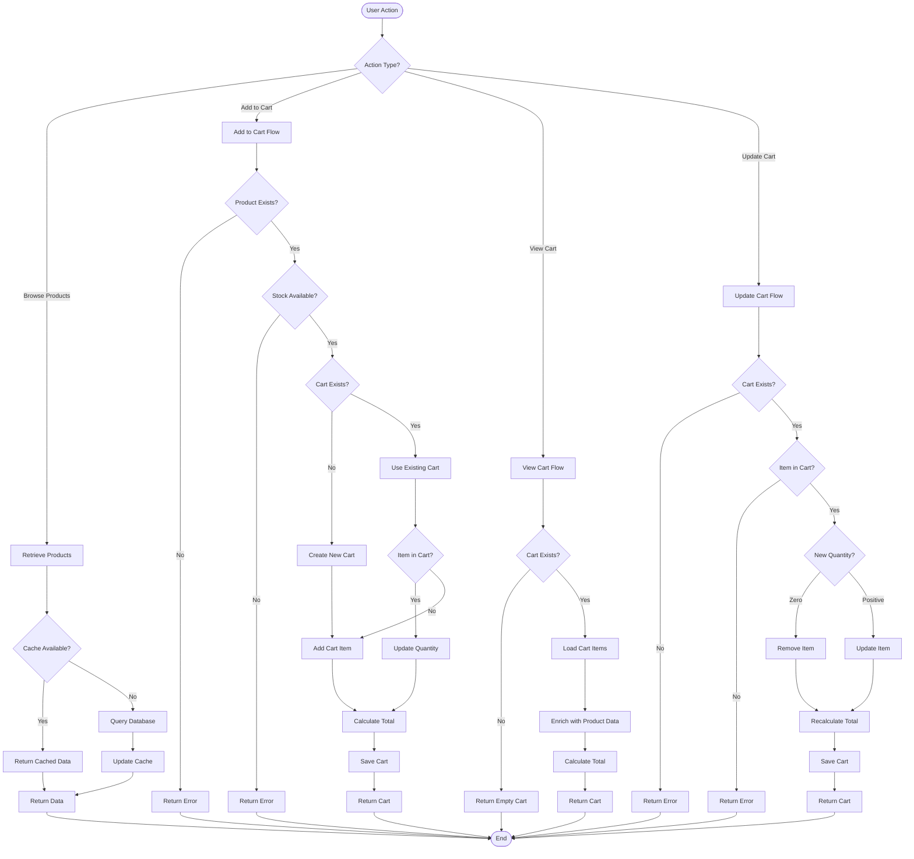
```mermaid
flowchart TD
    START([User Action]) --> CHECK_ACTION{Action Type?}
    
    CHECK_ACTION -->|Browse Products| GET_PRODUCTS[Retrieve Products]
    CHECK_ACTION -->|Add to Cart| ADD_CART[Add to Cart Flow]
    CHECK_ACTION -->|View Cart| VIEW_CART[View Cart Flow]
    CHECK_ACTION -->|Update Cart| UPDATE_CART[Update Cart Flow]
    
    GET_PRODUCTS --> CACHE_CHECK{Cache Available?}
    CACHE_CHECK -->|Yes| RETURN_CACHE[Return Cached Data]
    CACHE_CHECK -->|No| QUERY_DB[Query Database]
    QUERY_DB --> UPDATE_CACHE[Update Cache]
    UPDATE_CACHE --> RETURN_DATA[Return Data]
    RETURN_CACHE --> RETURN_DATA
    
    ADD_CART --> VALIDATE_PRODUCT{Product Exists?}
    VALIDATE_PRODUCT -->|No| ERROR1[Return Error]
    VALIDATE_PRODUCT -->|Yes| CHECK_STOCK{Stock Available?}
    CHECK_STOCK -->|No| ERROR2[Return Error]
    CHECK_STOCK -->|Yes| GET_CART{Cart Exists?}
    GET_CART -->|No| CREATE_CART[Create New Cart]
    GET_CART -->|Yes| USE_CART[Use Existing Cart]
    CREATE_CART --> ADD_ITEM[Add Cart Item]
    USE_CART --> CHECK_ITEM{Item in Cart?}
    CHECK_ITEM -->|Yes| UPDATE_QTY[Update Quantity]
    CHECK_ITEM -->|No| ADD_ITEM
    ADD_ITEM --> CALC_TOTAL[Calculate Total]
    UPDATE_QTY --> CALC_TOTAL
    CALC_TOTAL --> SAVE_CART[Save Cart]
    SAVE_CART --> RETURN_CART[Return Cart]
    
    VIEW_CART --> FIND_CART{Cart Exists?}
    FIND_CART -->|No| EMPTY_CART[Return Empty Cart]
    FIND_CART -->|Yes| LOAD_ITEMS[Load Cart Items]
    LOAD_ITEMS --> ENRICH_PRODUCTS[Enrich with Product Data]
    ENRICH_PRODUCTS --> CALC_TOTAL2[Calculate Total]
    CALC_TOTAL2 --> RETURN_CART2[Return Cart]
    
    UPDATE_CART --> VALIDATE_CART{Cart Exists?}
    VALIDATE_CART -->|No| ERROR3[Return Error]
    VALIDATE_CART -->|Yes| VALIDATE_ITEM{Item in Cart?}
    VALIDATE_ITEM -->|No| ERROR4[Return Error]
    VALIDATE_ITEM -->|Yes| CHECK_NEW_QTY{New Quantity?}
    CHECK_NEW_QTY -->|Zero| REMOVE_ITEM[Remove Item]
    CHECK_NEW_QTY -->|Positive| UPDATE_ITEM[Update Item]
    REMOVE_ITEM --> RECALC[Recalculate Total]
    UPDATE_ITEM --> RECALC
    RECALC --> SAVE_CART2[Save Cart]
    SAVE_CART2 --> RETURN_CART3[Return Cart]
    
    RETURN_DATA --> END([End])
    RETURN_CART --> END
    RETURN_CART2 --> END
    RETURN_CART3 --> END
    EMPTY_CART --> END
    ERROR1 --> END
    ERROR2 --> END
    ERROR3 --> END
    ERROR4 --> END
```

---

## 5. API Specifications

### 5.1 Product Management Endpoints

#### 5.1.1 Get All Products

**Endpoint:** `GET /api/products`

**Description:** Retrieves all products from the catalog

**Request:**
```http
GET /api/products HTTP/1.1
Host: api.ecommerce.com
Accept: application/json
```

**Response (200 OK):**
```json
[
    {
        "id": 1,
        "name": "Laptop",
        "description": "High-performance laptop",
        "price": 999.99,
        "category": "Electronics",
        "stockQuantity": 50,
        "createdAt": "2024-01-15T10:00:00Z",
        "updatedAt": "2024-01-15T10:00:00Z"
    },
    {
        "id": 2,
        "name": "Wireless Mouse",
        "description": "Ergonomic wireless mouse",
        "price": 29.99,
        "category": "Electronics",
        "stockQuantity": 200,
        "createdAt": "2024-01-15T10:05:00Z",
        "updatedAt": "2024-01-15T10:05:00Z"
    }
]
```

**Error Responses:**
- `500 Internal Server Error`: Server error occurred

#### 5.1.2 Get Product By ID

**Endpoint:** `GET /api/products/{id}`

**Description:** Retrieves a specific product by its ID

**Path Parameters:**
- `id` (Long, required): Product identifier

**Request:**
```http
GET /api/products/1 HTTP/1.1
Host: api.ecommerce.com
Accept: application/json
```

**Response (200 OK):**
```json
{
    "id": 1,
    "name": "Laptop",
    "description": "High-performance laptop with 16GB RAM",
    "price": 999.99,
    "category": "Electronics",
    "stockQuantity": 50,
    "createdAt": "2024-01-15T10:00:00Z",
    "updatedAt": "2024-01-15T10:00:00Z"
}
```

**Error Responses:**
- `404 Not Found`: Product not found
```json
{
    "timestamp": "2024-01-20T14:30:00Z",
    "status": 404,
    "error": "Not Found",
    "message": "Product not found with id: 1",
    "path": "/api/products/1"
}
```

#### 5.1.3 Create Product

**Endpoint:** `POST /api/products`

**Description:** Creates a new product

**Request:**
```http
POST /api/products HTTP/1.1
Host: api.ecommerce.com
Content-Type: application/json
Accept: application/json

{
    "name": "Mechanical Keyboard",
    "description": "RGB mechanical keyboard with blue switches",
    "price": 149.99,
    "category": "Electronics",
    "stockQuantity": 75
}
```

**Response (201 Created):**
```json
{
    "id": 3,
    "name": "Mechanical Keyboard",
    "description": "RGB mechanical keyboard with blue switches",
    "price": 149.99,
    "category": "Electronics",
    "stockQuantity": 75,
    "createdAt": "2024-01-20T14:35:00Z",
    "updatedAt": "2024-01-20T14:35:00Z"
}
```

**Validation Rules:**
- `name`: Required, max 255 characters, must be unique
- `price`: Required, must be >= 0
- `category`: Required, max 100 characters
- `stockQuantity`: Required, must be >= 0

**Error Responses:**
- `400 Bad Request`: Validation error
```json
{
    "timestamp": "2024-01-20T14:35:00Z",
    "status": 400,
    "error": "Bad Request",
    "message": "Validation failed",
    "errors": [
        {
            "field": "price",
            "message": "Price must be greater than or equal to 0"
        }
    ]
}
```

#### 5.1.4 Update Product

**Endpoint:** `PUT /api/products/{id}`

**Description:** Updates an existing product

**Path Parameters:**
- `id` (Long, required): Product identifier

**Request:**
```http
PUT /api/products/3 HTTP/1.1
Host: api.ecommerce.com
Content-Type: application/json
Accept: application/json

{
    "name": "Mechanical Keyboard Pro",
    "description": "RGB mechanical keyboard with blue switches and wrist rest",
    "price": 179.99,
    "category": "Electronics",
    "stockQuantity": 60
}
```

**Response (200 OK):**
```json
{
    "id": 3,
    "name": "Mechanical Keyboard Pro",
    "description": "RGB mechanical keyboard with blue switches and wrist rest",
    "price": 179.99,
    "category": "Electronics",
    "stockQuantity": 60,
    "createdAt": "2024-01-20T14:35:00Z",
    "updatedAt": "2024-01-20T15:00:00Z"
}
```

**Error Responses:**
- `404 Not Found`: Product not found
- `400 Bad Request`: Validation error

#### 5.1.5 Delete Product

**Endpoint:** `DELETE /api/products/{id}`

**Description:** Deletes a product

**Path Parameters:**
- `id` (Long, required): Product identifier

**Request:**
```http
DELETE /api/products/3 HTTP/1.1
Host: api.ecommerce.com
```

**Response (204 No Content):**
```http
HTTP/1.1 204 No Content
```

**Error Responses:**
- `404 Not Found`: Product not found
- `409 Conflict`: Product is referenced in active carts

#### 5.1.6 Get Products By Category

**Endpoint:** `GET /api/products/category/{category}`

**Description:** Retrieves all products in a specific category

**Path Parameters:**
- `category` (String, required): Product category

**Request:**
```http
GET /api/products/category/Electronics HTTP/1.1
Host: api.ecommerce.com
Accept: application/json
```

**Response (200 OK):**
```json
[
    {
        "id": 1,
        "name": "Laptop",
        "description": "High-performance laptop",
        "price": 999.99,
        "category": "Electronics",
        "stockQuantity": 50,
        "createdAt": "2024-01-15T10:00:00Z",
        "updatedAt": "2024-01-15T10:00:00Z"
    },
    {
        "id": 2,
        "name": "Wireless Mouse",
        "description": "Ergonomic wireless mouse",
        "price": 29.99,
        "category": "Electronics",
        "stockQuantity": 200,
        "createdAt": "2024-01-15T10:05:00Z",
        "updatedAt": "2024-01-15T10:05:00Z"
    }
]
```

#### 5.1.7 Search Products

**Endpoint:** `GET /api/products/search?keyword={keyword}`

**Description:** Searches products by keyword in name or description

**Query Parameters:**
- `keyword` (String, required): Search term

**Request:**
```http
GET /api/products/search?keyword=laptop HTTP/1.1
Host: api.ecommerce.com
Accept: application/json
```

**Response (200 OK):**
```json
[
    {
        "id": 1,
        "name": "Laptop",
        "description": "High-performance laptop",
        "price": 999.99,
        "category": "Electronics",
        "stockQuantity": 50,
        "createdAt": "2024-01-15T10:00:00Z",
        "updatedAt": "2024-01-15T10:00:00Z"
    }
]
```

### 5.2 Shopping Cart Management Endpoints

#### 5.2.1 Add Product to Cart

**Endpoint:** `POST /api/cart/{userId}/items`

**Description:** Adds a product to the user's shopping cart

**Path Parameters:**
- `userId` (Long, required): User identifier

**Request:**
```http
POST /api/cart/1001/items HTTP/1.1
Host: api.ecommerce.com
Content-Type: application/json
Accept: application/json

{
    "productId": 1,
    "quantity": 2
}
```

**Response (200 OK):**
```json
{
    "id": 1,
    "userId": 1001,
    "items": [
        {
            "id": 1,
            "productId": 1,
            "productName": "Laptop",
            "quantity": 2,
            "priceAtAddition": 999.99,
            "subtotal": 1999.98,
            "addedAt": "2024-01-20T15:30:00Z"
        }
    ],
    "totalItems": 2,
    "totalAmount": 1999.98,
    "createdAt": "2024-01-20T15:30:00Z",
    "updatedAt": "2024-01-20T15:30:00Z"
}
```

**Business Rules:**
- If cart doesn't exist, create new cart
- If product already in cart, update quantity
- Validate product availability and stock
- Capture current product price

**Error Responses:**
- `404 Not Found`: Product not found
- `400 Bad Request`: Insufficient stock
```json
{
    "timestamp": "2024-01-20T15:30:00Z",
    "status": 400,
    "error": "Bad Request",
    "message": "Insufficient stock. Available: 1, Requested: 2"
}
```

#### 5.2.2 Get Shopping Cart

**Endpoint:** `GET /api/cart/{userId}`

**Description:** Retrieves the user's shopping cart with all items

**Path Parameters:**
- `userId` (Long, required): User identifier

**Request:**
```http
GET /api/cart/1001 HTTP/1.1
Host: api.ecommerce.com
Accept: application/json
```

**Response (200 OK):**
```json
{
    "id": 1,
    "userId": 1001,
    "items": [
        {
            "id": 1,
            "productId": 1,
            "productName": "Laptop",
            "productDescription": "High-performance laptop",
            "quantity": 2,
            "priceAtAddition": 999.99,
            "currentPrice": 999.99,
            "subtotal": 1999.98,
            "addedAt": "2024-01-20T15:30:00Z"
        },
        {
            "id": 2,
            "productId": 2,
            "productName": "Wireless Mouse",
            "productDescription": "Ergonomic wireless mouse",
            "quantity": 1,
            "priceAtAddition": 29.99,
            "currentPrice": 29.99,
            "subtotal": 29.99,
            "addedAt": "2024-01-20T15:35:00Z"
        }
    ],
    "totalItems": 3,
    "totalAmount": 2029.97,
    "createdAt": "2024-01-20T15:30:00Z",
    "updatedAt": "2024-01-20T15:35:00Z"
}
```

**Response (200 OK - Empty Cart):**
```json
{
    "id": null,
    "userId": 1001,
    "items": [],
    "totalItems": 0,
    "totalAmount": 0.00,
    "createdAt": null,
    "updatedAt": null
}
```

#### 5.2.3 Update Cart Item Quantity

**Endpoint:** `PUT /api/cart/{userId}/items/{cartItemId}`

**Description:** Updates the quantity of a specific item in the cart

**Path Parameters:**
- `userId` (Long, required): User identifier
- `cartItemId` (Long, required): Cart item identifier

**Request:**
```http
PUT /api/cart/1001/items/1 HTTP/1.1
Host: api.ecommerce.com
Content-Type: application/json
Accept: application/json

{
    "quantity": 3
}
```

**Response (200 OK):**
```json
{
    "id": 1,
    "userId": 1001,
    "items": [
        {
            "id": 1,
            "productId": 1,
            "productName": "Laptop",
            "quantity": 3,
            "priceAtAddition": 999.99,
            "subtotal": 2999.97,
            "addedAt": "2024-01-20T15:30:00Z"
        },
        {
            "id": 2,
            "productId": 2,
            "productName": "Wireless Mouse",
            "quantity": 1,
            "priceAtAddition": 29.99,
            "subtotal": 29.99,
            "addedAt": "2024-01-20T15:35:00Z"
        }
    ],
    "totalItems": 4,
    "totalAmount": 3029.96,
    "createdAt": "2024-01-20T15:30:00Z",
    "updatedAt": "2024-01-20T16:00:00Z"
}
```

**Business Rules:**
- Quantity must be > 0
- Validate stock availability for new quantity
- If quantity = 0, remove item from cart

**Error Responses:**
- `404 Not Found`: Cart or item not found
- `400 Bad Request`: Invalid quantity or insufficient stock

#### 5.2.4 Remove Item from Cart

**Endpoint:** `DELETE /api/cart/{userId}/items/{cartItemId}`

**Description:** Removes a specific item from the cart

**Path Parameters:**
- `userId` (Long, required): User identifier
- `cartItemId` (Long, required): Cart item identifier

**Request:**
```http
DELETE /api/cart/1001/items/2 HTTP/1.1
Host: api.ecommerce.com
Accept: application/json
```

**Response (200 OK):**
```json
{
    "id": 1,
    "userId": 1001,
    "items": [
        {
            "id": 1,
            "productId": 1,
            "productName": "Laptop",
            "quantity": 3,
            "priceAtAddition": 999.99,
            "subtotal": 2999.97,
            "addedAt": "2024-01-20T15:30:00Z"
        }
    ],
    "totalItems": 3,
    "totalAmount": 2999.97,
    "createdAt": "2024-01-20T15:30:00Z",
    "updatedAt": "2024-01-20T16:10:00Z"
}
```

**Error Responses:**
- `404 Not Found`: Cart or item not found

#### 5.2.5 Clear Cart

**Endpoint:** `DELETE /api/cart/{userId}`

**Description:** Removes all items from the user's cart

**Path Parameters:**
- `userId` (Long, required): User identifier

**Request:**
```http
DELETE /api/cart/1001 HTTP/1.1
Host: api.ecommerce.com
```

**Response (204 No Content):**
```http
HTTP/1.1 204 No Content
```

**Error Responses:**
- `404 Not Found`: Cart not found

### 5.3 API Error Handling

**Standard Error Response Format:**
```json
{
    "timestamp": "2024-01-20T16:00:00Z",
    "status": 400,
    "error": "Bad Request",
    "message": "Detailed error message",
    "path": "/api/cart/1001/items",
    "errors": [
        {
            "field": "quantity",
            "message": "Quantity must be greater than 0"
        }
    ]
}
```

**HTTP Status Codes:**
- `200 OK`: Successful GET, PUT requests
- `201 Created`: Successful POST requests
- `204 No Content`: Successful DELETE requests
- `400 Bad Request`: Validation errors, business rule violations
- `404 Not Found`: Resource not found
- `409 Conflict`: Resource conflict (e.g., duplicate name)
- `500 Internal Server Error`: Unexpected server errors

---

## 6. Sequence Diagrams

### 6.1 Product Management Flows

#### 6.1.1 Get All Products

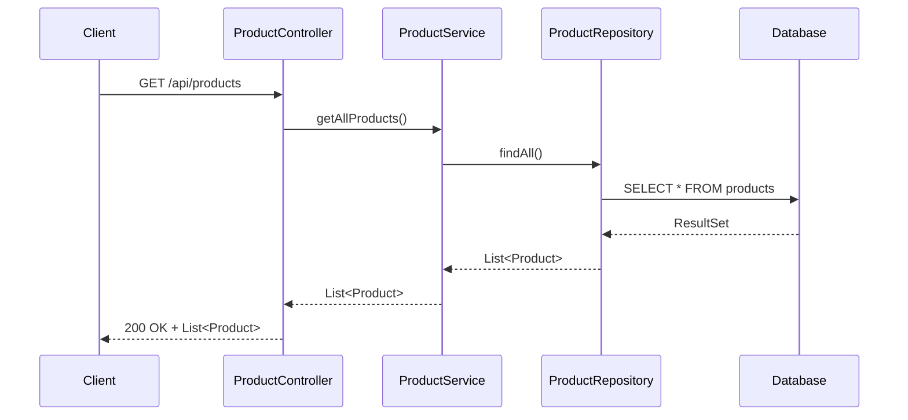
```mermaid
sequenceDiagram
    participant Client
    participant ProductController
    participant ProductService
    participant ProductRepository
    participant Database
    
    Client->>ProductController: GET /api/products
    ProductController->>ProductService: getAllProducts()
    ProductService->>ProductRepository: findAll()
    ProductRepository->>Database: SELECT * FROM products
    Database-->>ProductRepository: ResultSet
    ProductRepository-->>ProductService: List<Product>
    ProductService-->>ProductController: List<Product>
    ProductController-->>Client: 200 OK + List<Product>
```

#### 6.1.2 Get Product By ID

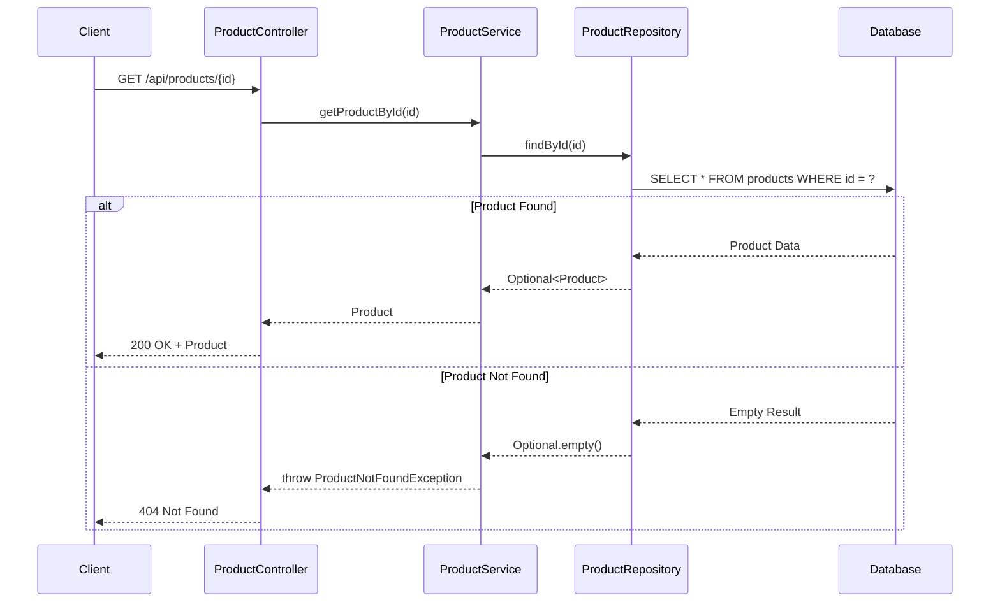
```mermaid
sequenceDiagram
    participant Client
    participant ProductController
    participant ProductService
    participant ProductRepository
    participant Database
    
    Client->>ProductController: GET /api/products/{id}
    ProductController->>ProductService: getProductById(id)
    ProductService->>ProductRepository: findById(id)
    ProductRepository->>Database: SELECT * FROM products WHERE id = ?
    
    alt Product Found
        Database-->>ProductRepository: Product Data
        ProductRepository-->>ProductService: Optional<Product>
        ProductService-->>ProductController: Product
        ProductController-->>Client: 200 OK + Product
    else Product Not Found
        Database-->>ProductRepository: Empty Result
        ProductRepository-->>ProductService: Optional.empty()
        ProductService-->>ProductController: throw ProductNotFoundException
        ProductController-->>Client: 404 Not Found
    end
```

#### 6.1.3 Create Product

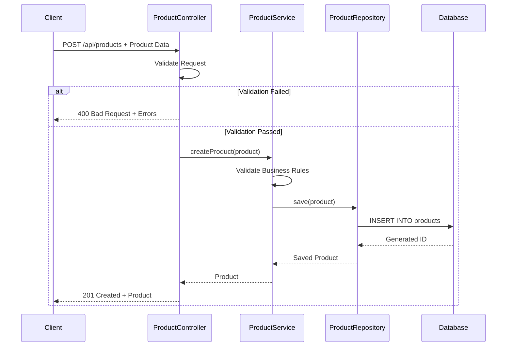
```mermaid
sequenceDiagram
    participant Client
    participant ProductController
    participant ProductService
    participant ProductRepository
    participant Database
    
    Client->>ProductController: POST /api/products + Product Data
    ProductController->>ProductController: Validate Request
    
    alt Validation Failed
        ProductController-->>Client: 400 Bad Request + Errors
    else Validation Passed
        ProductController->>ProductService: createProduct(product)
        ProductService->>ProductService: Validate Business Rules
        ProductService->>ProductRepository: save(product)
        ProductRepository->>Database: INSERT INTO products
        Database-->>ProductRepository: Generated ID
        ProductRepository-->>ProductService: Saved Product
        ProductService-->>ProductController: Product
        ProductController-->>Client: 201 Created + Product
    end
```

#### 6.1.4 Update Product

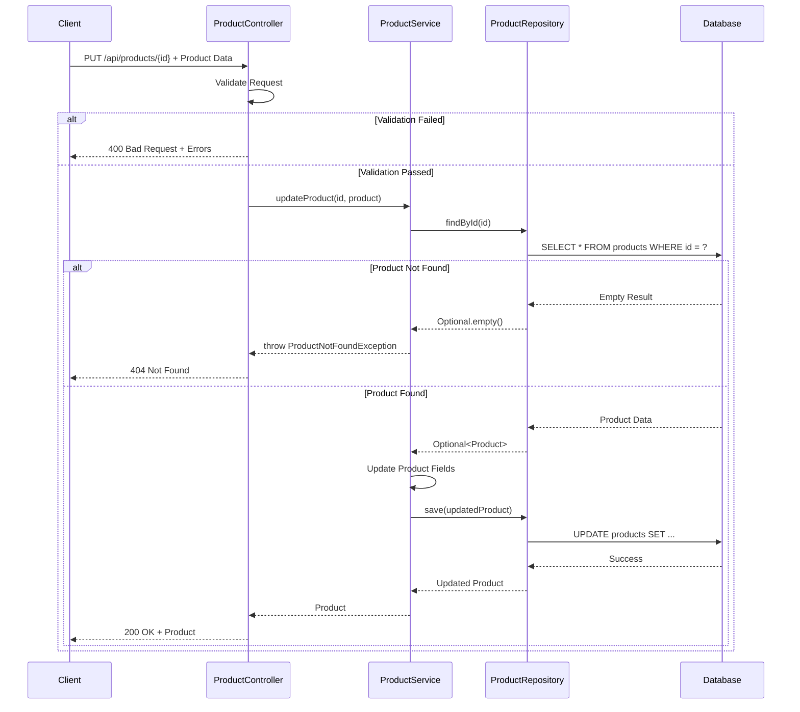
```mermaid
sequenceDiagram
    participant Client
    participant ProductController
    participant ProductService
    participant ProductRepository
    participant Database
    
    Client->>ProductController: PUT /api/products/{id} + Product Data
    ProductController->>ProductController: Validate Request
    
    alt Validation Failed
        ProductController-->>Client: 400 Bad Request + Errors
    else Validation Passed
        ProductController->>ProductService: updateProduct(id, product)
        ProductService->>ProductRepository: findById(id)
        ProductRepository->>Database: SELECT * FROM products WHERE id = ?
        
        alt Product Not Found
            Database-->>ProductRepository: Empty Result
            ProductRepository-->>ProductService: Optional.empty()
            ProductService-->>ProductController: throw ProductNotFoundException
            ProductController-->>Client: 404 Not Found
        else Product Found
            Database-->>ProductRepository: Product Data
            ProductRepository-->>ProductService: Optional<Product>
            ProductService->>ProductService: Update Product Fields
            ProductService->>ProductRepository: save(updatedProduct)
            ProductRepository->>Database: UPDATE products SET ...
            Database-->>ProductRepository: Success
            ProductRepository-->>ProductService: Updated Product
            ProductService-->>ProductController: Product
            ProductController-->>Client: 200 OK + Product
        end
    end
```

#### 6.1.5 Delete Product

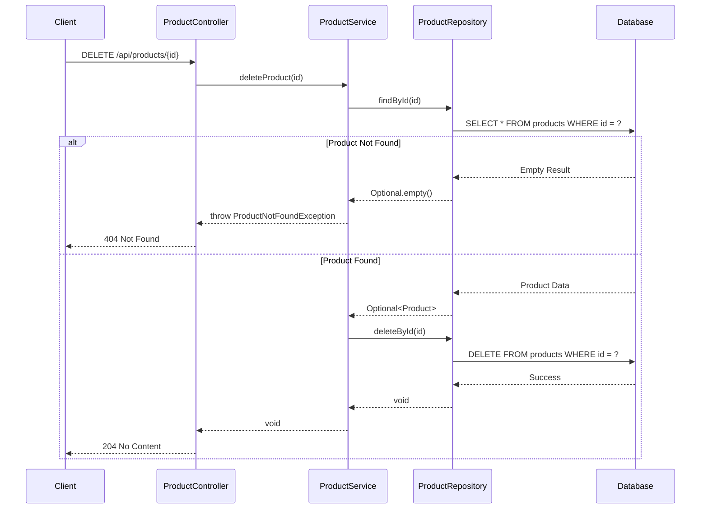
```mermaid
sequenceDiagram
    participant Client
    participant ProductController
    participant ProductService
    participant ProductRepository
    participant Database
    
    Client->>ProductController: DELETE /api/products/{id}
    ProductController->>ProductService: deleteProduct(id)
    ProductService->>ProductRepository: findById(id)
    ProductRepository->>Database: SELECT * FROM products WHERE id = ?
    
    alt Product Not Found
        Database-->>ProductRepository: Empty Result
        ProductRepository-->>ProductService: Optional.empty()
        ProductService-->>ProductController: throw ProductNotFoundException
        ProductController-->>Client: 404 Not Found
    else Product Found
        Database-->>ProductRepository: Product Data
        ProductRepository-->>ProductService: Optional<Product>
        ProductService->>ProductRepository: deleteById(id)
        ProductRepository->>Database: DELETE FROM products WHERE id = ?
        Database-->>ProductRepository: Success
        ProductRepository-->>ProductService: void
        ProductService-->>ProductController: void
        ProductController-->>Client: 204 No Content
    end
```

#### 6.1.6 Get Products By Category


```mermaid
sequenceDiagram
    participant Client
    participant ProductController
    participant ProductService
    participant ProductRepository
    participant Database
    
    Client->>ProductController: GET /api/products/category/{category}
    ProductController->>ProductService: getProductsByCategory(category)
    ProductService->>ProductRepository: findByCategory(category)
    ProductRepository->>Database: SELECT * FROM products WHERE category = ?
    Database-->>ProductRepository: ResultSet
    ProductRepository-->>ProductService: List<Product>
    ProductService-->>ProductController: List<Product>
    ProductController-->>Client: 200 OK + List<Product>
```

#### 6.1.7 Search Products

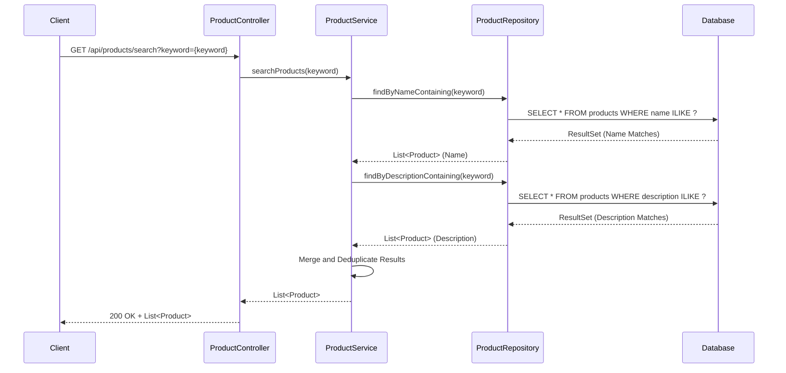
```mermaid
sequenceDiagram
    participant Client
    participant ProductController
    participant ProductService
    participant ProductRepository
    participant Database
    
    Client->>ProductController: GET /api/products/search?keyword={keyword}
    ProductController->>ProductService: searchProducts(keyword)
    ProductService->>ProductRepository: findByNameContaining(keyword)
    ProductRepository->>Database: SELECT * FROM products WHERE name ILIKE ?
    Database-->>ProductRepository: ResultSet (Name Matches)
    ProductRepository-->>ProductService: List<Product> (Name)
    
    ProductService->>ProductRepository: findByDescriptionContaining(keyword)
    ProductRepository->>Database: SELECT * FROM products WHERE description ILIKE ?
    Database-->>ProductRepository: ResultSet (Description Matches)
    ProductRepository-->>ProductService: List<Product> (Description)
    
    ProductService->>ProductService: Merge and Deduplicate Results
    ProductService-->>ProductController: List<Product>
    ProductController-->>Client: 200 OK + List<Product>
```

### 6.2 Shopping Cart Management Flows

#### 6.2.1 Add Product to Cart

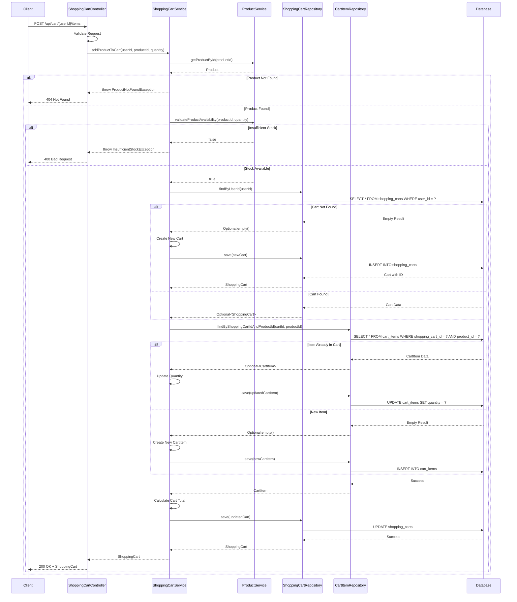
```mermaid
sequenceDiagram
    participant Client
    participant ShoppingCartController
    participant ShoppingCartService
    participant ProductService
    participant ShoppingCartRepository
    participant CartItemRepository
    participant Database
    
    Client->>ShoppingCartController: POST /api/cart/{userId}/items
    ShoppingCartController->>ShoppingCartController: Validate Request
    ShoppingCartController->>ShoppingCartService: addProductToCart(userId, productId, quantity)
    
    ShoppingCartService->>ProductService: getProductById(productId)
    ProductService-->>ShoppingCartService: Product
    
    alt Product Not Found
        ShoppingCartService-->>ShoppingCartController: throw ProductNotFoundException
        ShoppingCartController-->>Client: 404 Not Found
    else Product Found
        ShoppingCartService->>ProductService: validateProductAvailability(productId, quantity)
        
        alt Insufficient Stock
            ProductService-->>ShoppingCartService: false
            ShoppingCartService-->>ShoppingCartController: throw InsufficientStockException
            ShoppingCartController-->>Client: 400 Bad Request
        else Stock Available
            ProductService-->>ShoppingCartService: true
            ShoppingCartService->>ShoppingCartRepository: findByUserId(userId)
            ShoppingCartRepository->>Database: SELECT * FROM shopping_carts WHERE user_id = ?
            
            alt Cart Not Found
                Database-->>ShoppingCartRepository: Empty Result
                ShoppingCartRepository-->>ShoppingCartService: Optional.empty()
                ShoppingCartService->>ShoppingCartService: Create New Cart
                ShoppingCartService->>ShoppingCartRepository: save(newCart)
                ShoppingCartRepository->>Database: INSERT INTO shopping_carts
                Database-->>ShoppingCartRepository: Cart with ID
                ShoppingCartRepository-->>ShoppingCartService: ShoppingCart
            else Cart Found
                Database-->>ShoppingCartRepository: Cart Data
                ShoppingCartRepository-->>ShoppingCartService: Optional<ShoppingCart>
            end
            
            ShoppingCartService->>CartItemRepository: findByShoppingCartIdAndProductId(cartId, productId)
            CartItemRepository->>Database: SELECT * FROM cart_items WHERE shopping_cart_id = ? AND product_id = ?
            
            alt Item Already in Cart
                Database-->>CartItemRepository: CartItem Data
                CartItemRepository-->>ShoppingCartService: Optional<CartItem>
                ShoppingCartService->>ShoppingCartService: Update Quantity
                ShoppingCartService->>CartItemRepository: save(updatedCartItem)
                CartItemRepository->>Database: UPDATE cart_items SET quantity = ?
            else New Item
                Database-->>CartItemRepository: Empty Result
                CartItemRepository-->>ShoppingCartService: Optional.empty()
                ShoppingCartService->>ShoppingCartService: Create New CartItem
                ShoppingCartService->>CartItemRepository: save(newCartItem)
                CartItemRepository->>Database: INSERT INTO cart_items
            end
            
            Database-->>CartItemRepository: Success
            CartItemRepository-->>ShoppingCartService: CartItem
            ShoppingCartService->>ShoppingCartService: Calculate Cart Total
            ShoppingCartService->>ShoppingCartRepository: save(updatedCart)
            ShoppingCartRepository->>Database: UPDATE shopping_carts
            Database-->>ShoppingCartRepository: Success
            ShoppingCartRepository-->>ShoppingCartService: ShoppingCart
            ShoppingCartService-->>ShoppingCartController: ShoppingCart
            ShoppingCartController-->>Client: 200 OK + ShoppingCart
        end
    end
```

#### 6.2.2 View Shopping Cart

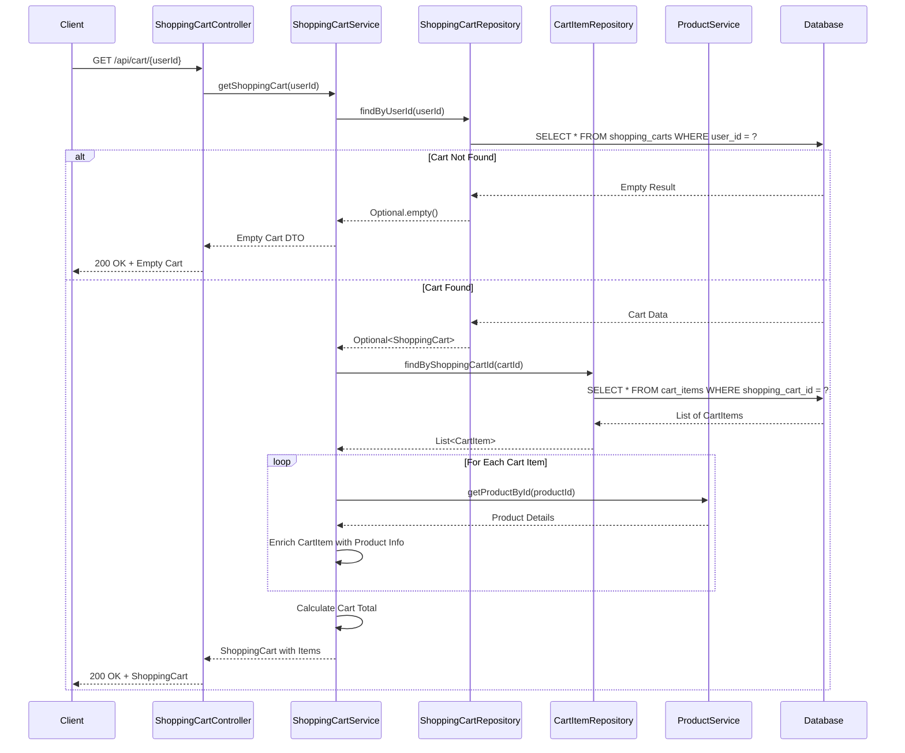
```mermaid
sequenceDiagram
    participant Client
    participant ShoppingCartController
    participant ShoppingCartService
    participant ShoppingCartRepository
    participant CartItemRepository
    participant ProductService
    participant Database
    
    Client->>ShoppingCartController: GET /api/cart/{userId}
    ShoppingCartController->>ShoppingCartService: getShoppingCart(userId)
    ShoppingCartService->>ShoppingCartRepository: findByUserId(userId)
    ShoppingCartRepository->>Database: SELECT * FROM shopping_carts WHERE user_id = ?
    
    alt Cart Not Found
        Database-->>ShoppingCartRepository: Empty Result
        ShoppingCartRepository-->>ShoppingCartService: Optional.empty()
        ShoppingCartService-->>ShoppingCartController: Empty Cart DTO
        ShoppingCartController-->>Client: 200 OK + Empty Cart
    else Cart Found
        Database-->>ShoppingCartRepository: Cart Data
        ShoppingCartRepository-->>ShoppingCartService: Optional<ShoppingCart>
        
        ShoppingCartService->>CartItemRepository: findByShoppingCartId(cartId)
        CartItemRepository->>Database: SELECT * FROM cart_items WHERE shopping_cart_id = ?
        Database-->>CartItemRepository: List of CartItems
        CartItemRepository-->>ShoppingCartService: List<CartItem>
        
        loop For Each Cart Item
            ShoppingCartService->>ProductService: getProductById(productId)
            ProductService-->>ShoppingCartService: Product Details
            ShoppingCartService->>ShoppingCartService: Enrich CartItem with Product Info
        end
        
        ShoppingCartService->>ShoppingCartService: Calculate Cart Total
        ShoppingCartService-->>ShoppingCartController: ShoppingCart with Items
        ShoppingCartController-->>Client: 200 OK + ShoppingCart
    end
```

#### 6.2.3 Update Cart Item Quantity

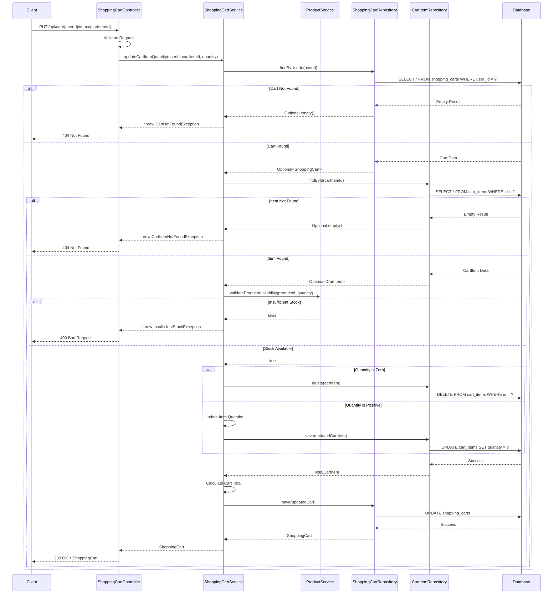
```mermaid
sequenceDiagram
    participant Client
    participant ShoppingCartController
    participant ShoppingCartService
    participant ProductService
    participant ShoppingCartRepository
    participant CartItemRepository
    participant Database
    
    Client->>ShoppingCartController: PUT /api/cart/{userId}/items/{cartItemId}
    ShoppingCartController->>ShoppingCartController: Validate Request
    ShoppingCartController->>ShoppingCartService: updateCartItemQuantity(userId, cartItemId, quantity)
    
    ShoppingCartService->>ShoppingCartRepository: findByUserId(userId)
    ShoppingCartRepository->>Database: SELECT * FROM shopping_carts WHERE user_id = ?
    
    alt Cart Not Found
        Database-->>ShoppingCartRepository: Empty Result
        ShoppingCartRepository-->>ShoppingCartService: Optional.empty()
        ShoppingCartService-->>ShoppingCartController: throw CartNotFoundException
        ShoppingCartController-->>Client: 404 Not Found
    else Cart Found
        Database-->>ShoppingCartRepository: Cart Data
        ShoppingCartRepository-->>ShoppingCartService: Optional<ShoppingCart>
        
        ShoppingCartService->>CartItemRepository: findById(cartItemId)
        CartItemRepository->>Database: SELECT * FROM cart_items WHERE id = ?
        
        alt Item Not Found
            Database-->>CartItemRepository: Empty Result
            CartItemRepository-->>ShoppingCartService: Optional.empty()
            ShoppingCartService-->>ShoppingCartController: throw CartItemNotFoundException
            ShoppingCartController-->>Client: 404 Not Found
        else Item Found
            Database-->>CartItemRepository: CartItem Data
            CartItemRepository-->>ShoppingCartService: Optional<CartItem>
            
            ShoppingCartService->>ProductService: validateProductAvailability(productId, quantity)
            
            alt Insufficient Stock
                ProductService-->>ShoppingCartService: false
                ShoppingCartService-->>ShoppingCartController: throw InsufficientStockException
                ShoppingCartController-->>Client: 400 Bad Request
            else Stock Available
                ProductService-->>ShoppingCartService: true
                
                alt Quantity is Zero
                    ShoppingCartService->>CartItemRepository: delete(cartItem)
                    CartItemRepository->>Database: DELETE FROM cart_items WHERE id = ?
                else Quantity is Positive
                    ShoppingCartService->>ShoppingCartService: Update Item Quantity
                    ShoppingCartService->>CartItemRepository: save(updatedCartItem)
                    CartItemRepository->>Database: UPDATE cart_items SET quantity = ?
                end
                
                Database-->>CartItemRepository: Success
                CartItemRepository-->>ShoppingCartService: void/CartItem
                ShoppingCartService->>ShoppingCartService: Calculate Cart Total
                ShoppingCartService->>ShoppingCartRepository: save(updatedCart)
                ShoppingCartRepository->>Database: UPDATE shopping_carts
                Database-->>ShoppingCartRepository: Success
                ShoppingCartRepository-->>ShoppingCartService: ShoppingCart
                ShoppingCartService-->>ShoppingCartController: ShoppingCart
                ShoppingCartController-->>Client: 200 OK + ShoppingCart
            end
        end
    end
```

#### 6.2.4 Remove Item from Cart

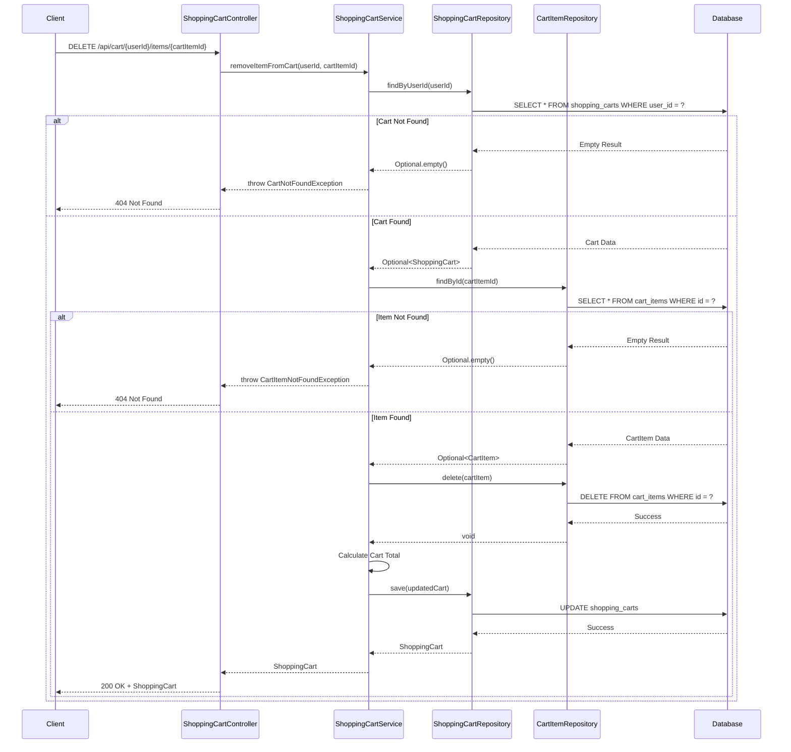
```mermaid
sequenceDiagram
    participant Client
    participant ShoppingCartController
    participant ShoppingCartService
    participant ShoppingCartRepository
    participant CartItemRepository
    participant Database
    
    Client->>ShoppingCartController: DELETE /api/cart/{userId}/items/{cartItemId}
    ShoppingCartController->>ShoppingCartService: removeItemFromCart(userId, cartItemId)
    
    ShoppingCartService->>ShoppingCartRepository: findByUserId(userId)
    ShoppingCartRepository->>Database: SELECT * FROM shopping_carts WHERE user_id = ?
    
    alt Cart Not Found
        Database-->>ShoppingCartRepository: Empty Result
        ShoppingCartRepository-->>ShoppingCartService: Optional.empty()
        ShoppingCartService-->>ShoppingCartController: throw CartNotFoundException
        ShoppingCartController-->>Client: 404 Not Found
    else Cart Found
        Database-->>ShoppingCartRepository: Cart Data
        ShoppingCartRepository-->>ShoppingCartService: Optional<ShoppingCart>
        
        ShoppingCartService->>CartItemRepository: findById(cartItemId)
        CartItemRepository->>Database: SELECT * FROM cart_items WHERE id = ?
        
        alt Item Not Found
            Database-->>CartItemRepository: Empty Result
            CartItemRepository-->>ShoppingCartService: Optional.empty()
            ShoppingCartService-->>ShoppingCartController: throw CartItemNotFoundException
            ShoppingCartController-->>Client: 404 Not Found
        else Item Found
            Database-->>CartItemRepository: CartItem Data
            CartItemRepository-->>ShoppingCartService: Optional<CartItem>
            
            ShoppingCartService->>CartItemRepository: delete(cartItem)
            CartItemRepository->>Database: DELETE FROM cart_items WHERE id = ?
            Database-->>CartItemRepository: Success
            CartItemRepository-->>ShoppingCartService: void
            
            ShoppingCartService->>ShoppingCartService: Calculate Cart Total
            ShoppingCartService->>ShoppingCartRepository: save(updatedCart)
            ShoppingCartRepository->>Database: UPDATE shopping_carts
            Database-->>ShoppingCartRepository: Success
            ShoppingCartRepository-->>ShoppingCartService: ShoppingCart
            ShoppingCartService-->>ShoppingCartController: ShoppingCart
            ShoppingCartController-->>Client: 200 OK + ShoppingCart
        end
    end
```

---

## 7. Technology Stack

### 7.1 Core Technologies

| Component | Technology | Version | Purpose |
|-----------|------------|---------|----------|
| Framework | Spring Boot | 3.2.x | Application framework |
| Language | Java | 21 | Programming language |
| Database | PostgreSQL | 15.x | Relational database |
| ORM | Spring Data JPA | 3.2.x | Data access layer |
| Build Tool | Maven/Gradle | Latest | Dependency management |
| API Documentation | SpringDoc OpenAPI | 2.x | API documentation |

### 7.2 Spring Boot Dependencies

```xml
<dependencies>
    <!-- Spring Boot Starter Web -->
    <dependency>
        <groupId>org.springframework.boot</groupId>
        <artifactId>spring-boot-starter-web</artifactId>
    </dependency>
    
    <!-- Spring Boot Starter Data JPA -->
    <dependency>
        <groupId>org.springframework.boot</groupId>
        <artifactId>spring-boot-starter-data-jpa</artifactId>
    </dependency>
    
    <!-- PostgreSQL Driver -->
    <dependency>
        <groupId>org.postgresql</groupId>
        <artifactId>postgresql</artifactId>
        <scope>runtime</scope>
    </dependency>
    
    <!-- Spring Boot Starter Validation -->
    <dependency>
        <groupId>org.springframework.boot</groupId>
        <artifactId>spring-boot-starter-validation</artifactId>
    </dependency>
    
    <!-- Lombok -->
    <dependency>
        <groupId>org.projectlombok</groupId>
        <artifactId>lombok</artifactId>
        <optional>true</optional>
    </dependency>
    
    <!-- SpringDoc OpenAPI -->
    <dependency>
        <groupId>org.springdoc</groupId>
        <artifactId>springdoc-openapi-starter-webmvc-ui</artifactId>
        <version>2.3.0</version>
    </dependency>
    
    <!-- Spring Boot Starter Test -->
    <dependency>
        <groupId>org.springframework.boot</groupId>
        <artifactId>spring-boot-starter-test</artifactId>
        <scope>test</scope>
    </dependency>
    
    <!-- Spring Boot Starter Cache (Optional) -->
    <dependency>
        <groupId>org.springframework.boot</groupId>
        <artifactId>spring-boot-starter-cache</artifactId>
    </dependency>
    
    <!-- Redis (Optional for caching) -->
    <dependency>
        <groupId>org.springframework.boot</groupId>
        <artifactId>spring-boot-starter-data-redis</artifactId>
    </dependency>
</dependencies>
```

### 7.3 Application Configuration

```yaml
spring:
  application:
    name: ecommerce-product-management
  
  datasource:
    url: jdbc:postgresql://localhost:5432/ecommerce_db
    username: ${DB_USERNAME:postgres}
    password: ${DB_PASSWORD:postgres}
    driver-class-name: org.postgresql.Driver
    hikari:
      maximum-pool-size: 10
      minimum-idle: 5
      connection-timeout: 30000
      idle-timeout: 600000
      max-lifetime: 1800000
  
  jpa:
    hibernate:
      ddl-auto: validate
    show-sql: false
    properties:
      hibernate:
        dialect: org.hibernate.dialect.PostgreSQLDialect
        format_sql: true
        use_sql_comments: true
        jdbc:
          batch_size: 20
        order_inserts: true
        order_updates: true
    open-in-view: false
  
  cache:
    type: redis
    redis:
      time-to-live: 3600000
  
  redis:
    host: localhost
    port: 6379
    password: ${REDIS_PASSWORD:}
    timeout: 2000ms

server:
  port: 8080
  servlet:
    context-path: /api
  error:
    include-message: always
    include-binding-errors: always

logging:
  level:
    root: INFO
    com.ecommerce: DEBUG
    org.hibernate.SQL: DEBUG
    org.hibernate.type.descriptor.sql.BasicBinder: TRACE
  pattern:
    console: "%d{yyyy-MM-dd HH:mm:ss} - %msg%n"
    file: "%d{yyyy-MM-dd HH:mm:ss} [%thread] %-5level %logger{36} - %msg%n"
  file:
    name: logs/application.log
    max-size: 10MB
    max-history: 30

springdoc:
  api-docs:
    path: /api-docs
  swagger-ui:
    path: /swagger-ui.html
    enabled: true
```

### 7.4 Infrastructure Components

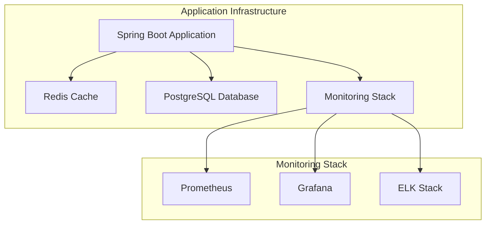
```mermaid
graph TB
    subgraph "Application Infrastructure"
        APP[Spring Boot Application]
        CACHE[Redis Cache]
        DB[PostgreSQL Database]
        MONITOR[Monitoring Stack]
    end
    
    subgraph "Monitoring Stack"
        PROM[Prometheus]
        GRAF[Grafana]
        ELK[ELK Stack]
    end
    
    APP --> CACHE
    APP --> DB
    APP --> MONITOR
    MONITOR --> PROM
    MONITOR --> GRAF
    MONITOR --> ELK
```

---

## 8. Design Patterns

### 8.1 Layered Architecture Pattern

**Implementation:**
- **Presentation Layer**: REST Controllers handle HTTP requests/responses
- **Business Logic Layer**: Services implement business rules and orchestration
- **Data Access Layer**: Repositories manage database operations
- **Domain Layer**: Entities represent business objects

**Benefits:**
- Clear separation of concerns
- Easy to test each layer independently
- Maintainable and scalable
- Promotes code reusability

### 8.2 Repository Pattern

**Implementation:**
```java
public interface ProductRepository extends JpaRepository<Product, Long> {
    List<Product> findByCategory(String category);
    List<Product> findByNameContainingIgnoreCase(String keyword);
}
```

**Benefits:**
- Abstracts data access logic
- Provides consistent interface for data operations
- Easy to mock for testing
- Supports multiple data sources

### 8.3 Service Layer Pattern

**Implementation:**
```java
@Service
public class ProductService {
    private final ProductRepository productRepository;
    
    @Transactional
    public Product createProduct(Product product) {
        // Business logic
        return productRepository.save(product);
    }
}
```

**Benefits:**
- Encapsulates business logic
- Manages transactions
- Coordinates between multiple repositories
- Provides reusable business operations

### 8.4 DTO (Data Transfer Object) Pattern

**Implementation:**
```java
public class ProductDTO {
    private Long id;
    private String name;
    private BigDecimal price;
    // Getters and setters
}
```

**Benefits:**
- Decouples API contract from domain model
- Controls data exposure
- Reduces network payload
- Supports API versioning

### 8.5 Dependency Injection Pattern

**Implementation:**
```java
@RestController
public class ProductController {
    private final ProductService productService;
    
    @Autowired
    public ProductController(ProductService productService) {
        this.productService = productService;
    }
}
```

**Benefits:**
- Loose coupling between components
- Easy to test with mocks
- Promotes interface-based programming
- Managed by Spring container

### 8.6 Exception Handling Pattern

**Implementation:**
```java
@ControllerAdvice
public class GlobalExceptionHandler {
    @ExceptionHandler(ProductNotFoundException.class)
    public ResponseEntity<ErrorResponse> handleProductNotFound(ProductNotFoundException ex) {
        return ResponseEntity.status(HttpStatus.NOT_FOUND)
            .body(new ErrorResponse(ex.getMessage()));
    }
}
```

**Benefits:**
- Centralized error handling
- Consistent error responses
- Separates error handling from business logic
- Easy to maintain

---

## 9. Engineering Considerations

### 9.1 Design Assumptions

1. **User Management**: User authentication and authorization are handled by a separate service
2. **Single Cart Per User**: Each user can have only one active shopping cart
3. **Price Capture**: Product prices are captured at the time of adding to cart
4. **Stock Validation**: Real-time stock validation occurs before adding/updating cart items
5. **Cart Persistence**: Shopping carts persist across user sessions
6. **Concurrent Access**: Multiple users can access the system simultaneously
7. **Data Consistency**: Strong consistency is required for inventory and cart operations

### 9.2 Constraints

#### 9.2.1 Technical Constraints
- Java 21 required for application runtime
- PostgreSQL 15.x for database
- Minimum 2GB RAM for application server
- Network latency < 100ms for database connections

#### 9.2.2 Business Constraints
- Product names must be unique
- Prices must be non-negative
- Stock quantities must be non-negative
- Cart item quantities must be positive
- Maximum 100 items per cart

#### 9.2.3 Operational Constraints
- 99.9% uptime SLA
- Maximum response time: 500ms for read operations
- Maximum response time: 1000ms for write operations
- Database backup every 24 hours

### 9.3 Performance Considerations

#### 9.3.1 Database Optimization

**Indexing Strategy:**
```sql
-- Product indexes
CREATE INDEX idx_products_category ON products(category);
CREATE INDEX idx_products_name ON products(name);
CREATE INDEX idx_products_price ON products(price);

-- Cart indexes
CREATE INDEX idx_shopping_carts_user_id ON shopping_carts(user_id);
CREATE INDEX idx_cart_items_shopping_cart_id ON cart_items(shopping_cart_id);
CREATE INDEX idx_cart_items_product_id ON cart_items(product_id);
```

**Query Optimization:**
- Use pagination for large result sets
- Implement query result caching
- Use database connection pooling (HikariCP)
- Optimize JOIN operations
- Use batch operations for bulk inserts/updates

#### 9.3.2 Caching Strategy

**Cache Layers:**
```mermaid
graph LR
    CLIENT[Client] --> L1[L1: Application Cache]
    L1 --> L2[L2: Redis Cache]
    L2 --> DB[Database]
    
    L1 -.->|Cache Miss| L2
    L2 -.->|Cache Miss| DB
```

**Cacheable Operations:**
- Product catalog (TTL: 1 hour)
- Product details (TTL: 30 minutes)
- Category listings (TTL: 1 hour)
- Shopping cart (TTL: 15 minutes)

**Cache Invalidation:**
- Product updates: Invalidate product cache
- Cart updates: Invalidate cart cache
- Use cache-aside pattern

#### 9.3.3 API Performance

**Response Time Targets:**
| Operation | Target | Maximum |
|-----------|--------|----------|
| Get All Products | 200ms | 500ms |
| Get Product By ID | 100ms | 300ms |
| Create Product | 300ms | 1000ms |
| Add to Cart | 250ms | 800ms |
| View Cart | 150ms | 500ms |

**Optimization Techniques:**
- Implement pagination (default: 20 items per page)
- Use lazy loading for relationships
- Compress responses (GZIP)
- Implement HTTP caching headers
- Use asynchronous processing for non-critical operations

### 9.4 Scalability Approach

#### 9.4.1 Horizontal Scaling

```mermaid
graph TB
    LB[Load Balancer]
    
    subgraph "Application Tier"
        APP1[App Instance 1]
        APP2[App Instance 2]
        APP3[App Instance 3]
        APPN[App Instance N]
    end
    
    subgraph "Cache Tier"
        REDIS_M[Redis Master]
        REDIS_S1[Redis Slave 1]
        REDIS_S2[Redis Slave 2]
    end
    
    subgraph "Database Tier"
        DB_M[PostgreSQL Master]
        DB_S1[PostgreSQL Replica 1]
        DB_S2[PostgreSQL Replica 2]
    end
    
    LB --> APP1
    LB --> APP2
    LB --> APP3
    LB --> APPN
    
    APP1 --> REDIS_M
    APP2 --> REDIS_M
    APP3 --> REDIS_M
    APPN --> REDIS_M
    
    REDIS_M --> REDIS_S1
    REDIS_M --> REDIS_S2
    
    APP1 --> DB_M
    APP2 --> DB_M
    APP3 --> DB_S1
    APPN --> DB_S2
    
    DB_M --> DB_S1
    DB_M --> DB_S2
```

**Scaling Strategy:**
- Stateless application design
- Session data in Redis
- Database read replicas for read-heavy operations
- Auto-scaling based on CPU/memory metrics
- Load balancing with health checks

#### 9.4.2 Database Scaling

**Read/Write Splitting:**
- Master database for write operations
- Read replicas for read operations
- Connection routing based on operation type

**Partitioning Strategy:**
- Horizontal partitioning by user_id for shopping_carts
- Archive old cart data (> 90 days)
- Implement database sharding for high volume

#### 9.4.3 Capacity Planning

**Expected Load:**
- 10,000 concurrent users
- 100 requests per second per instance
- 1 million products in catalog
- 50,000 active shopping carts

**Resource Requirements:**
- Application: 3-5 instances (4 CPU, 8GB RAM each)
- Database: 1 master + 2 replicas (8 CPU, 16GB RAM each)
- Redis: 1 master + 2 replicas (2 CPU, 4GB RAM each)

### 9.5 Security Considerations

#### 9.5.1 Authentication & Authorization

**Implementation:**
- JWT-based authentication
- Role-based access control (RBAC)
- User context validation for cart operations
- API key authentication for service-to-service calls

**Security Flow:**
```mermaid
sequenceDiagram
    participant Client
    participant Gateway
    participant AuthService
    participant Application
    
    Client->>Gateway: Request + JWT Token
    Gateway->>AuthService: Validate Token
    AuthService-->>Gateway: Token Valid + User Info
    Gateway->>Application: Request + User Context
    Application->>Application: Authorize Operation
    Application-->>Gateway: Response
    Gateway-->>Client: Response
```

#### 9.5.2 Data Security

**Measures:**
- Encrypt sensitive data at rest
- Use HTTPS/TLS for data in transit
- Sanitize user inputs to prevent SQL injection
- Implement rate limiting to prevent abuse
- Mask sensitive data in logs
- Regular security audits

**SQL Injection Prevention:**
```java
// Use parameterized queries (JPA handles this)
@Query("SELECT p FROM Product p WHERE p.category = :category")
List<Product> findByCategory(@Param("category") String category);
```

#### 9.5.3 API Security

**Best Practices:**
- Input validation on all endpoints
- Output encoding to prevent XSS
- CORS configuration for allowed origins
- Request size limits
- Rate limiting per user/IP
- API versioning for backward compatibility

### 9.6 Logging & Monitoring Strategy

#### 9.6.1 Logging Levels

**Log Levels:**
- **ERROR**: System errors, exceptions
- **WARN**: Potential issues, deprecated usage
- **INFO**: Important business events
- **DEBUG**: Detailed diagnostic information
- **TRACE**: Very detailed diagnostic information

**Logging Implementation:**
```java
@Slf4j
@Service
public class ProductService {
    public Product createProduct(Product product) {
        log.info("Creating product: {}", product.getName());
        try {
            Product saved = productRepository.save(product);
            log.info("Product created successfully with ID: {}", saved.getId());
            return saved;
        } catch (Exception e) {
            log.error("Error creating product: {}", product.getName(), e);
            throw e;
        }
    }
}
```

#### 9.6.2 Monitoring Metrics

**Application Metrics:**
- Request rate (requests/second)
- Response time (p50, p95, p99)
- Error rate (errors/second)
- Active connections
- JVM metrics (heap, GC)

**Business Metrics:**
- Products created/updated/deleted
- Cart operations (add, update, remove)
- Active carts
- Average cart value
- Conversion rate

**Infrastructure Metrics:**
- CPU utilization
- Memory usage
- Disk I/O
- Network throughput
- Database connections

#### 9.6.3 Alerting Strategy

**Alert Conditions:**
- Error rate > 5%
- Response time p95 > 1000ms
- CPU utilization > 80%
- Memory usage > 85%
- Database connection pool exhaustion
- Cache hit rate < 70%

**Alert Channels:**
- Email for non-critical alerts
- Slack/Teams for critical alerts
- PagerDuty for production incidents

### 9.7 Error Handling Design

#### 9.7.1 Exception Hierarchy

```mermaid
classDiagram
    RuntimeException <|-- EcommerceException
    EcommerceException <|-- ProductNotFoundException
    EcommerceException <|-- CartNotFoundException
    EcommerceException <|-- CartItemNotFoundException
    EcommerceException <|-- InsufficientStockException
    EcommerceException <|-- InvalidQuantityException
    EcommerceException <|-- DuplicateProductException
    
    class EcommerceException {
        +String message
        +String errorCode
        +HttpStatus status
    }
    
    class ProductNotFoundException {
        +ProductNotFoundException(Long id)
    }
    
    class CartNotFoundException {
        +CartNotFoundException(Long userId)
    }
    
    class InsufficientStockException {
        +InsufficientStockException(Long productId, int available, int requested)
    }
```

#### 9.7.2 Error Response Format

**Standard Error Response:**
```json
{
    "timestamp": "2024-01-20T16:00:00Z",
    "status": 404,
    "error": "Not Found",
    "message": "Product not found with id: 123",
    "errorCode": "PRODUCT_NOT_FOUND",
    "path": "/api/products/123",
    "traceId": "abc123xyz"
}
```

### 9.8 Testing Strategy

#### 9.8.1 Test Pyramid

```mermaid
graph TB
    subgraph "Test Pyramid"
        E2E[End-to-End Tests<br/>10%]
        INT[Integration Tests<br/>30%]
        UNIT[Unit Tests<br/>60%]
    end
    
    E2E --> INT
    INT --> UNIT
```

#### 9.8.2 Test Coverage

**Unit Tests:**
- Service layer business logic
- Utility methods
- Validation logic
- Target: 80% code coverage

**Integration Tests:**
- Repository layer with test database
- Controller layer with MockMvc
- End-to-end API flows
- Target: 70% coverage

**End-to-End Tests:**
- Critical user journeys
- Cross-component workflows
- Target: Key scenarios covered

---

## 10. Change Traceability

### 10.1 Story: SCRUM-1140 - Shopping Cart Management

#### 10.1.1 Acceptance Criteria Mapping

**AC1: Users can add products to their shopping cart**
- **Implementation**: `ShoppingCartService.addProductToCart()`
- **API Endpoint**: `POST /api/cart/{userId}/items`
- **Database**: `cart_items` table with FK to `products`
- **Validation**: Product existence, stock availability
- **Sequence Diagram**: Section 6.2.1

**AC2: Users can view their shopping cart with all items**
- **Implementation**: `ShoppingCartService.getShoppingCart()`
- **API Endpoint**: `GET /api/cart/{userId}`
- **Database**: JOIN between `shopping_carts`, `cart_items`, and `products`
- **Response**: Enriched cart with product details
- **Sequence Diagram**: Section 6.2.2

**AC3: Users can update the quantity of items in their cart**
- **Implementation**: `ShoppingCartService.updateCartItemQuantity()`
- **API Endpoint**: `PUT /api/cart/{userId}/items/{cartItemId}`
- **Database**: UPDATE `cart_items` table
- **Validation**: Stock availability for new quantity
- **Sequence Diagram**: Section 6.2.3

**AC4: Users can remove items from their cart**
- **Implementation**: `ShoppingCartService.removeItemFromCart()`
- **API Endpoint**: `DELETE /api/cart/{userId}/items/{cartItemId}`
- **Database**: DELETE from `cart_items` table
- **Sequence Diagram**: Section 6.2.4

**AC5: Cart displays total price**
- **Implementation**: `ShoppingCartService.calculateCartTotal()`
- **Calculation**: Sum of (quantity × priceAtAddition) for all items
- **Response Field**: `totalAmount` in cart response

**AC6: Cart persists across sessions**
- **Implementation**: Database persistence in `shopping_carts` table
- **Constraint**: Unique cart per user (user_id UNIQUE)
- **Retrieval**: Cart loaded by user_id on subsequent requests

#### 10.1.2 Components Added

**Controllers:**
- `ShoppingCartController`: 5 endpoints for cart management

**Services:**
- `ShoppingCartService`: Business logic for cart operations
- Integration with `ProductService` for validation

**Repositories:**
- `ShoppingCartRepository`: Cart data access
- `CartItemRepository`: Cart item data access

**Entities:**
- `ShoppingCart`: Cart entity with user relationship
- `CartItem`: Cart item entity with product relationship

**Database Tables:**
- `shopping_carts`: User cart storage
- `cart_items`: Cart item storage with product references

#### 10.1.3 Components Modified

**ProductService:**
- Added `validateProductAvailability()` method
- Used by cart service for stock validation

**Class Diagram:**
- Added cart-related classes and relationships
- Section 3.1 updated

**ER Diagram:**
- Added cart tables and relationships
- Section 4.1 updated

**API Documentation:**
- Added Section 5.2 for cart endpoints
- 5 new endpoints documented

**Sequence Diagrams:**
- Added Section 6.2 with 4 new diagrams
- Cart operation flows documented

#### 10.1.4 Integration Points

**Product-Cart Integration:**
```mermaid
graph LR
    CART[Shopping Cart Service] --> PRODUCT[Product Service]
    CART --> CART_REPO[Cart Repository]
    CART --> ITEM_REPO[Cart Item Repository]
    PRODUCT --> PRODUCT_REPO[Product Repository]
    
    CART -.->|Validate Stock| PRODUCT
    CART -.->|Get Product Details| PRODUCT
    CART -.->|Check Availability| PRODUCT
```

**Integration Methods:**
1. `ProductService.getProductById()` - Retrieve product details
2. `ProductService.validateProductAvailability()` - Check stock
3. Cart service calls product service before cart operations

#### 10.1.5 Impact Analysis

**Database Impact:**
- 2 new tables added
- Foreign key relationships established
- Indexes created for performance
- No changes to existing `products` table

**API Impact:**
- 5 new endpoints added
- No changes to existing product endpoints
- New error codes introduced
- Backward compatible

**Performance Impact:**
- Additional database queries for cart operations
- Caching recommended for cart data
- JOIN operations for cart retrieval
- Minimal impact on product operations

**Testing Impact:**
- New unit tests for cart service
- New integration tests for cart endpoints
- Updated E2E tests for cart workflows
- Product tests remain unchanged

### 10.2 Change Summary

**Lines of Code Added:** ~2000 (estimated)
- Controllers: ~300 lines
- Services: ~500 lines
- Repositories: ~100 lines
- Entities: ~200 lines
- Tests: ~900 lines

**Files Added:**
- `ShoppingCartController.java`
- `ShoppingCartService.java`
- `ShoppingCartRepository.java`
- `CartItemRepository.java`
- `ShoppingCart.java`
- `CartItem.java`
- Test files for above components
- Database migration scripts

**Files Modified:**
- `ProductService.java` (added validation method)
- `application.yml` (if needed)
- API documentation
- This LLD document

**Database Changes:**
- 2 tables added
- 6 indexes added
- 2 foreign key constraints added
- 1 unique constraint added

### 10.3 Rollback Plan

**If Issues Occur:**

1. **Application Rollback:**
   - Deploy previous version without cart features
   - Cart endpoints will return 404
   - Product functionality unaffected

2. **Database Rollback:**
   ```sql
   -- Drop cart tables
   DROP TABLE IF EXISTS cart_items CASCADE;
   DROP TABLE IF EXISTS shopping_carts CASCADE;
   ```

3. **Verification:**
   - Verify product endpoints still functional
   - Check database integrity
   - Monitor application logs

### 10.4 Future Enhancements

**Potential Improvements:**
1. Cart expiration policy (auto-clear after N days)
2. Save for later functionality
3. Cart sharing between users
4. Wishlist integration
5. Price change notifications
6. Stock reservation during checkout
7. Cart analytics and recommendations
8. Multi-currency support
9. Promotional code application
10. Guest cart support

---

## Appendix A: Glossary

| Term | Definition |
|------|------------|
| LLD | Low Level Design - Detailed technical design document |
| CRUD | Create, Read, Update, Delete operations |
| DTO | Data Transfer Object - Object for transferring data between layers |
| JPA | Java Persistence API - ORM specification |
| ORM | Object-Relational Mapping |
| REST | Representational State Transfer - API architectural style |
| API | Application Programming Interface |
| FK | Foreign Key - Database relationship constraint |
| PK | Primary Key - Unique identifier in database |
| TTL | Time To Live - Cache expiration time |
| SLA | Service Level Agreement |
| RBAC | Role-Based Access Control |
| JWT | JSON Web Token - Authentication token format |

## Appendix B: References

1. Spring Boot Documentation: https://spring.io/projects/spring-boot
2. Spring Data JPA Documentation: https://spring.io/projects/spring-data-jpa
3. PostgreSQL Documentation: https://www.postgresql.org/docs/
4. RESTful API Design Best Practices
5. Microservices Design Patterns
6. Database Design Principles

## Appendix C: Revision History

| Version | Date | Author | Description |
|---------|------|--------|-------------|
| 1.0 | 2024-01-15 | Development Team | Initial LLD for Product Management |
| 2.0 | 2024-01-20 | Development Team | Added Shopping Cart Management (SCRUM-1140) |

---

**Document Status:** Approved for Implementation

**Next Review Date:** 2024-02-20

**Document Owner:** Technical Lead

**Approvers:**
- Technical Architect
- Product Owner
- Engineering Manager

---

*End of Document*