# Low Level Design Document
## E-commerce Product Management System

### Version History
| Version | Date | Author | Description |
|---------|------|--------|-------------|
| 1.0 | 2024-01-15 | Development Team | Initial LLD |
| 1.1 | 2024-01-20 | Development Team | Added Shopping Cart Management |

---

## 1. Project Overview

### 1.1 System Architecture
The E-commerce Product Management System is built using Spring Boot 3.2 with Java 21, following a layered architecture pattern.

**Technology Stack:**
- Java 21 (LTS)
- Spring Boot 3.2
- Spring Data JPA
- PostgreSQL 15
- Maven
- Lombok
- MapStruct
- Spring Validation

**Architecture Layers:**
1. **Controller Layer**: REST API endpoints
2. **Service Layer**: Business logic
3. **Repository Layer**: Data access
4. **Entity Layer**: Domain models
5. **DTO Layer**: Data transfer objects

**Modules:**
- ProductManagement
- CategoryManagement
- InventoryManagement
- ShoppingCartManagement

---

## 2. Component Design

### 2.1 Class Diagram

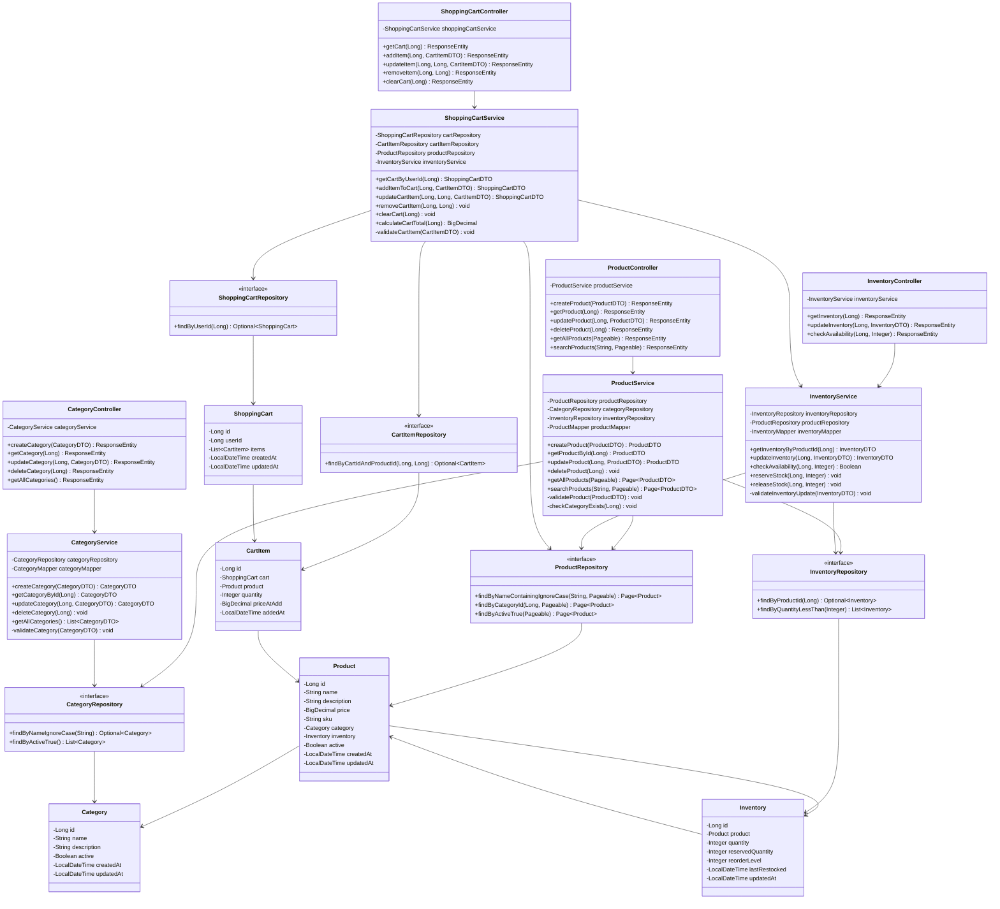

### 2.2 Entity Relationship Diagram

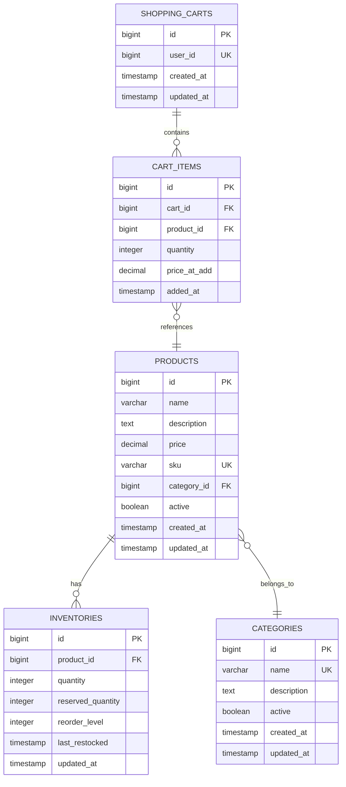

---

## 3. Sequence Diagrams

### 3.1 Create Product Flow

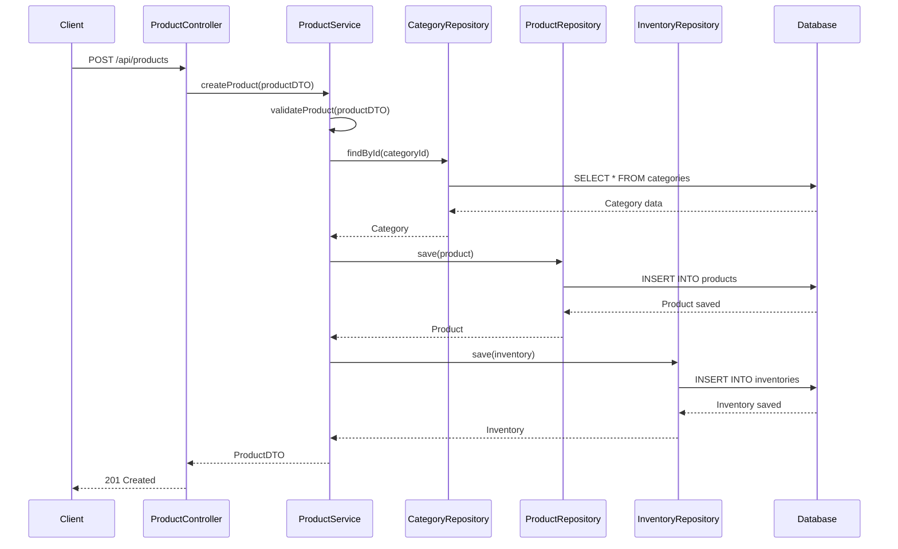

### 3.2 Get Product Flow

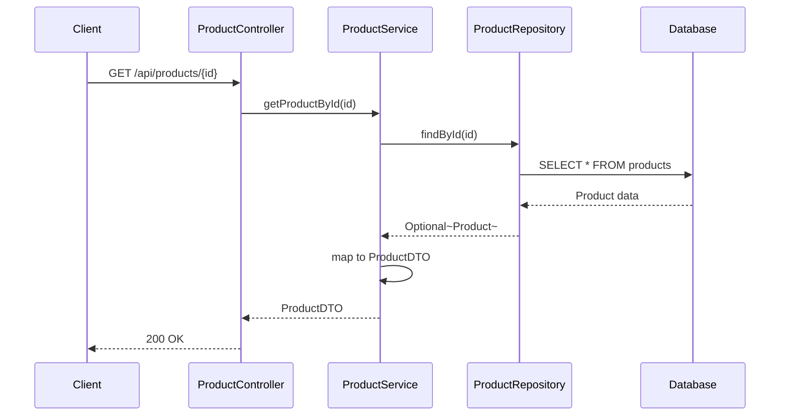

### 3.3 Update Product Flow

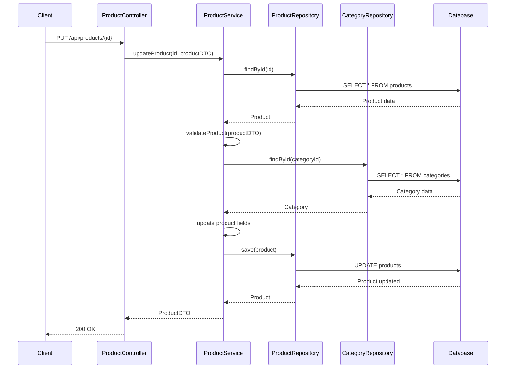

### 3.4 Delete Product Flow

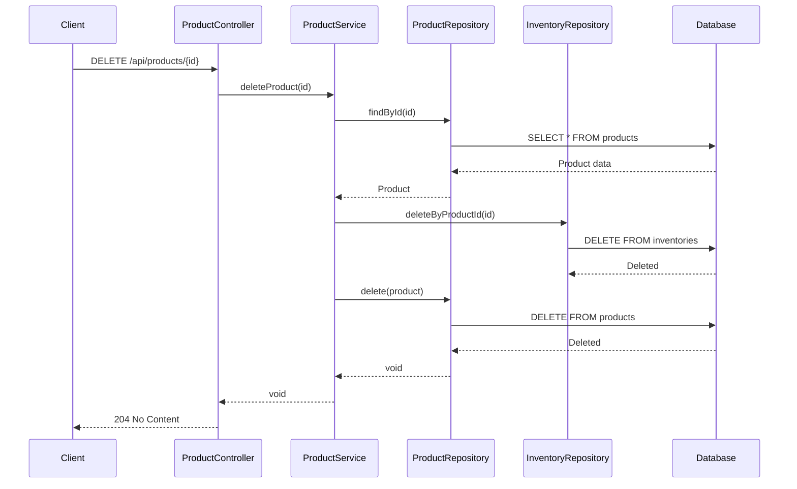

### 3.5 Search Products Flow

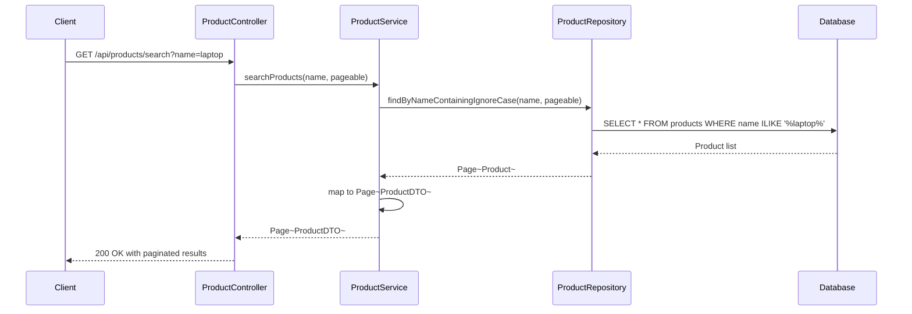

### 3.6 Update Inventory Flow

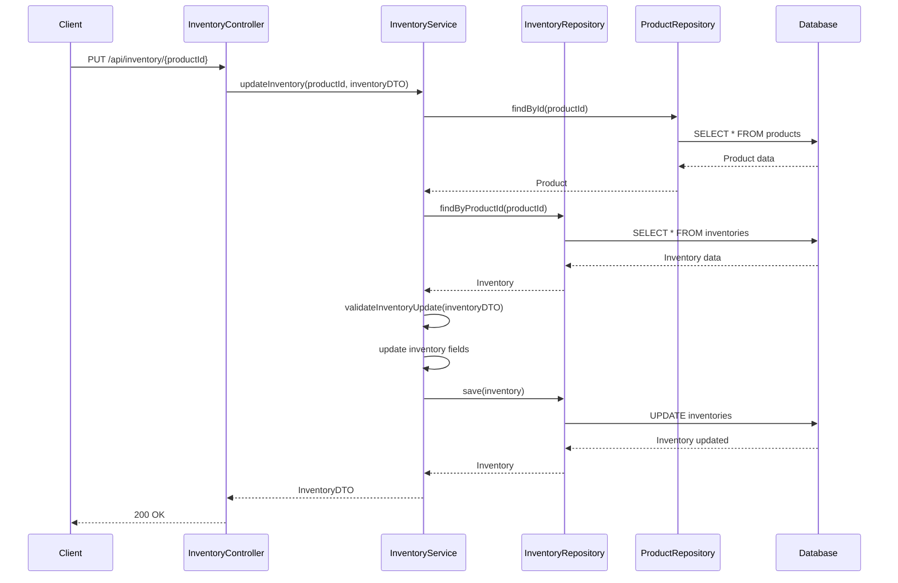

### 3.7 Check Availability Flow

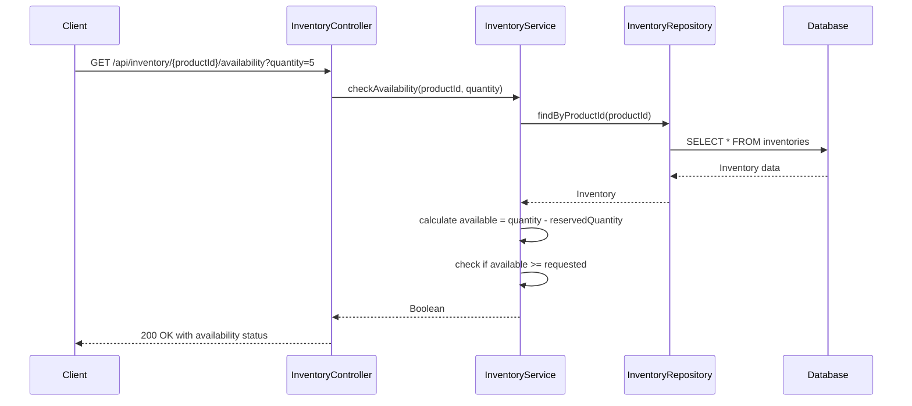

### 3.8 Add Item to Cart Flow

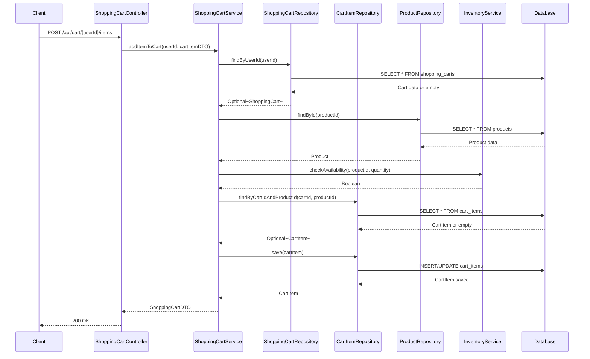

### 3.9 Update Cart Item Flow

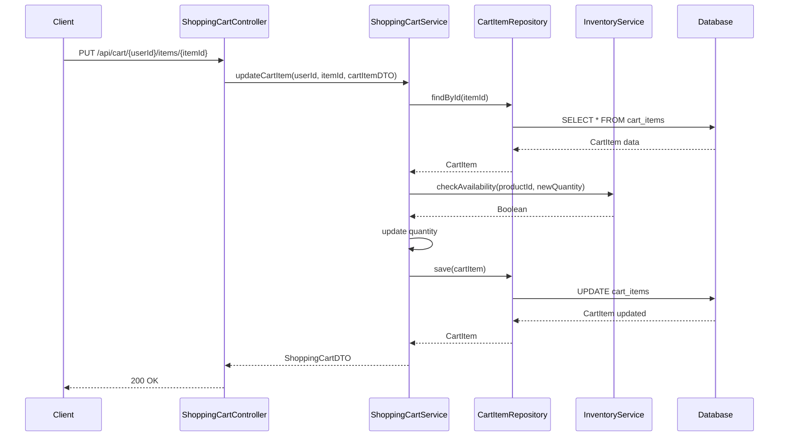

### 3.10 Remove Cart Item Flow

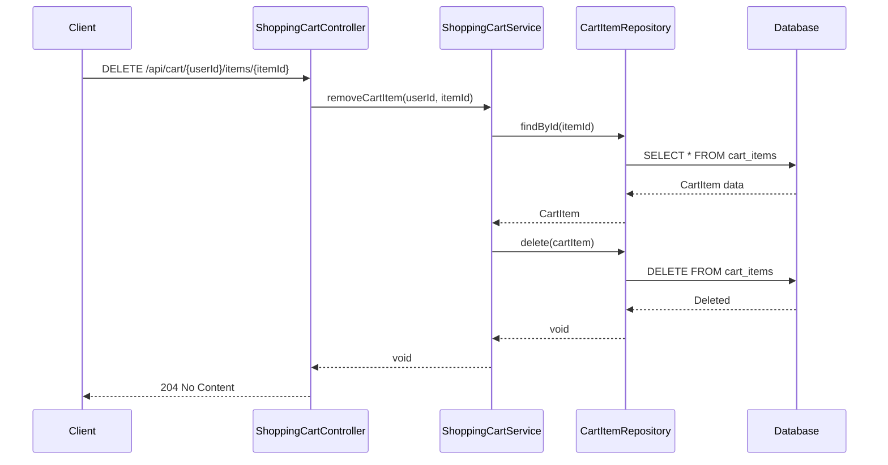

### 3.11 Get Cart Flow

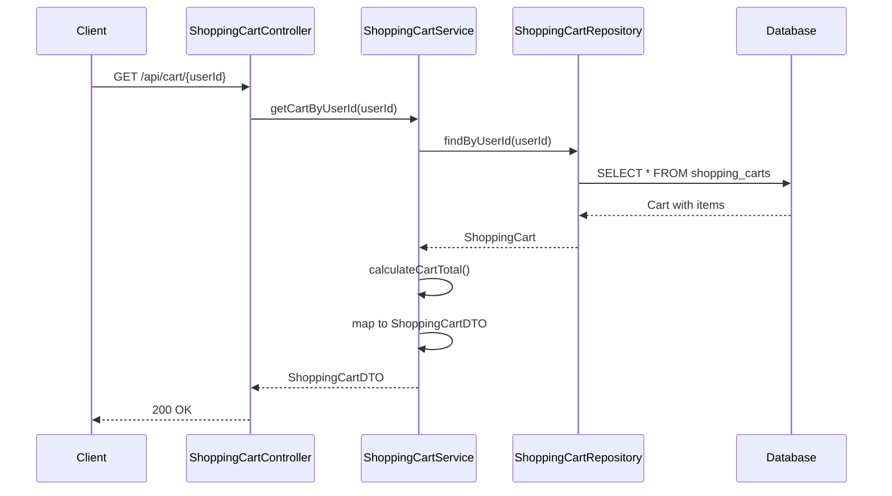

---

## 4. API Endpoints

### 4.1 Product Management Endpoints

#### Create Product
```
POST /api/products
Content-Type: application/json

Request Body:
{
  "name": "Laptop",
  "description": "High-performance laptop",
  "price": 999.99,
  "sku": "LAP-001",
  "categoryId": 1,
  "initialStock": 50,
  "reorderLevel": 10
}

Response: 201 Created
{
  "id": 1,
  "name": "Laptop",
  "description": "High-performance laptop",
  "price": 999.99,
  "sku": "LAP-001",
  "categoryId": 1,
  "categoryName": "Electronics",
  "active": true,
  "createdAt": "2024-01-15T10:00:00",
  "updatedAt": "2024-01-15T10:00:00"
}
```

#### Get Product
```
GET /api/products/{id}

Response: 200 OK
{
  "id": 1,
  "name": "Laptop",
  "description": "High-performance laptop",
  "price": 999.99,
  "sku": "LAP-001",
  "categoryId": 1,
  "categoryName": "Electronics",
  "active": true,
  "createdAt": "2024-01-15T10:00:00",
  "updatedAt": "2024-01-15T10:00:00"
}
```

#### Update Product
```
PUT /api/products/{id}
Content-Type: application/json

Request Body:
{
  "name": "Gaming Laptop",
  "description": "High-performance gaming laptop",
  "price": 1299.99,
  "categoryId": 1,
  "active": true
}

Response: 200 OK
{
  "id": 1,
  "name": "Gaming Laptop",
  "description": "High-performance gaming laptop",
  "price": 1299.99,
  "sku": "LAP-001",
  "categoryId": 1,
  "categoryName": "Electronics",
  "active": true,
  "createdAt": "2024-01-15T10:00:00",
  "updatedAt": "2024-01-15T11:00:00"
}
```

#### Delete Product
```
DELETE /api/products/{id}

Response: 204 No Content
```

#### Get All Products
```
GET /api/products?page=0&size=10&sort=name,asc

Response: 200 OK
{
  "content": [
    {
      "id": 1,
      "name": "Laptop",
      "price": 999.99,
      "sku": "LAP-001",
      "categoryName": "Electronics",
      "active": true
    }
  ],
  "pageable": {
    "pageNumber": 0,
    "pageSize": 10,
    "sort": {
      "sorted": true,
      "unsorted": false,
      "empty": false
    }
  },
  "totalPages": 1,
  "totalElements": 1,
  "last": true,
  "first": true,
  "numberOfElements": 1
}
```

#### Search Products
```
GET /api/products/search?name=laptop&page=0&size=10

Response: 200 OK
{
  "content": [
    {
      "id": 1,
      "name": "Gaming Laptop",
      "price": 1299.99,
      "sku": "LAP-001",
      "categoryName": "Electronics",
      "active": true
    }
  ],
  "totalPages": 1,
  "totalElements": 1
}
```

### 4.2 Category Management Endpoints

#### Create Category
```
POST /api/categories
Content-Type: application/json

Request Body:
{
  "name": "Electronics",
  "description": "Electronic devices and accessories"
}

Response: 201 Created
{
  "id": 1,
  "name": "Electronics",
  "description": "Electronic devices and accessories",
  "active": true,
  "createdAt": "2024-01-15T10:00:00",
  "updatedAt": "2024-01-15T10:00:00"
}
```

#### Get Category
```
GET /api/categories/{id}

Response: 200 OK
{
  "id": 1,
  "name": "Electronics",
  "description": "Electronic devices and accessories",
  "active": true,
  "createdAt": "2024-01-15T10:00:00",
  "updatedAt": "2024-01-15T10:00:00"
}
```

#### Update Category
```
PUT /api/categories/{id}
Content-Type: application/json

Request Body:
{
  "name": "Electronics & Gadgets",
  "description": "Electronic devices, gadgets and accessories",
  "active": true
}

Response: 200 OK
{
  "id": 1,
  "name": "Electronics & Gadgets",
  "description": "Electronic devices, gadgets and accessories",
  "active": true,
  "createdAt": "2024-01-15T10:00:00",
  "updatedAt": "2024-01-15T11:00:00"
}
```

#### Delete Category
```
DELETE /api/categories/{id}

Response: 204 No Content
```

#### Get All Categories
```
GET /api/categories

Response: 200 OK
[
  {
    "id": 1,
    "name": "Electronics",
    "description": "Electronic devices and accessories",
    "active": true
  },
  {
    "id": 2,
    "name": "Clothing",
    "description": "Apparel and fashion items",
    "active": true
  }
]
```

### 4.3 Inventory Management Endpoints

#### Get Inventory
```
GET /api/inventory/{productId}

Response: 200 OK
{
  "id": 1,
  "productId": 1,
  "productName": "Laptop",
  "quantity": 50,
  "reservedQuantity": 5,
  "availableQuantity": 45,
  "reorderLevel": 10,
  "lastRestocked": "2024-01-15T10:00:00",
  "updatedAt": "2024-01-15T10:00:00"
}
```

#### Update Inventory
```
PUT /api/inventory/{productId}
Content-Type: application/json

Request Body:
{
  "quantity": 100,
  "reorderLevel": 15
}

Response: 200 OK
{
  "id": 1,
  "productId": 1,
  "productName": "Laptop",
  "quantity": 100,
  "reservedQuantity": 5,
  "availableQuantity": 95,
  "reorderLevel": 15,
  "lastRestocked": "2024-01-15T12:00:00",
  "updatedAt": "2024-01-15T12:00:00"
}
```

#### Check Availability
```
GET /api/inventory/{productId}/availability?quantity=10

Response: 200 OK
{
  "productId": 1,
  "requestedQuantity": 10,
  "available": true,
  "availableQuantity": 45
}
```

### 4.4 Shopping Cart Management Endpoints

#### Get Cart
```
GET /api/cart/{userId}

Response: 200 OK
{
  "id": 1,
  "userId": 123,
  "items": [
    {
      "id": 1,
      "productId": 1,
      "productName": "Laptop",
      "quantity": 2,
      "priceAtAdd": 999.99,
      "subtotal": 1999.98,
      "addedAt": "2024-01-15T10:00:00"
    }
  ],
  "totalItems": 2,
  "totalAmount": 1999.98,
  "createdAt": "2024-01-15T09:00:00",
  "updatedAt": "2024-01-15T10:00:00"
}
```

#### Add Item to Cart
```
POST /api/cart/{userId}/items
Content-Type: application/json

Request Body:
{
  "productId": 1,
  "quantity": 2
}

Response: 200 OK
{
  "id": 1,
  "userId": 123,
  "items": [
    {
      "id": 1,
      "productId": 1,
      "productName": "Laptop",
      "quantity": 2,
      "priceAtAdd": 999.99,
      "subtotal": 1999.98,
      "addedAt": "2024-01-15T10:00:00"
    }
  ],
  "totalItems": 2,
  "totalAmount": 1999.98,
  "updatedAt": "2024-01-15T10:00:00"
}
```

#### Update Cart Item
```
PUT /api/cart/{userId}/items/{itemId}
Content-Type: application/json

Request Body:
{
  "quantity": 3
}

Response: 200 OK
{
  "id": 1,
  "userId": 123,
  "items": [
    {
      "id": 1,
      "productId": 1,
      "productName": "Laptop",
      "quantity": 3,
      "priceAtAdd": 999.99,
      "subtotal": 2999.97,
      "addedAt": "2024-01-15T10:00:00"
    }
  ],
  "totalItems": 3,
  "totalAmount": 2999.97,
  "updatedAt": "2024-01-15T10:30:00"
}
```

#### Remove Cart Item
```
DELETE /api/cart/{userId}/items/{itemId}

Response: 204 No Content
```

#### Clear Cart
```
DELETE /api/cart/{userId}

Response: 204 No Content
```

---

## 5. Database Schema

### 5.1 Products Table
```sql
CREATE TABLE products (
    id BIGSERIAL PRIMARY KEY,
    name VARCHAR(255) NOT NULL,
    description TEXT,
    price DECIMAL(10, 2) NOT NULL,
    sku VARCHAR(100) UNIQUE NOT NULL,
    category_id BIGINT NOT NULL,
    active BOOLEAN DEFAULT true,
    created_at TIMESTAMP DEFAULT CURRENT_TIMESTAMP,
    updated_at TIMESTAMP DEFAULT CURRENT_TIMESTAMP,
    CONSTRAINT fk_category FOREIGN KEY (category_id) REFERENCES categories(id),
    CONSTRAINT chk_price CHECK (price >= 0)
);

CREATE INDEX idx_products_name ON products(name);
CREATE INDEX idx_products_category ON products(category_id);
CREATE INDEX idx_products_sku ON products(sku);
CREATE INDEX idx_products_active ON products(active);
```

### 5.2 Categories Table
```sql
CREATE TABLE categories (
    id BIGSERIAL PRIMARY KEY,
    name VARCHAR(255) UNIQUE NOT NULL,
    description TEXT,
    active BOOLEAN DEFAULT true,
    created_at TIMESTAMP DEFAULT CURRENT_TIMESTAMP,
    updated_at TIMESTAMP DEFAULT CURRENT_TIMESTAMP
);

CREATE INDEX idx_categories_name ON categories(name);
CREATE INDEX idx_categories_active ON categories(active);
```

### 5.3 Inventories Table
```sql
CREATE TABLE inventories (
    id BIGSERIAL PRIMARY KEY,
    product_id BIGINT UNIQUE NOT NULL,
    quantity INTEGER NOT NULL DEFAULT 0,
    reserved_quantity INTEGER NOT NULL DEFAULT 0,
    reorder_level INTEGER NOT NULL DEFAULT 10,
    last_restocked TIMESTAMP,
    updated_at TIMESTAMP DEFAULT CURRENT_TIMESTAMP,
    CONSTRAINT fk_product FOREIGN KEY (product_id) REFERENCES products(id) ON DELETE CASCADE,
    CONSTRAINT chk_quantity CHECK (quantity >= 0),
    CONSTRAINT chk_reserved CHECK (reserved_quantity >= 0),
    CONSTRAINT chk_reserved_not_exceed CHECK (reserved_quantity <= quantity)
);

CREATE INDEX idx_inventories_product ON inventories(product_id);
CREATE INDEX idx_inventories_quantity ON inventories(quantity);
```

### 5.4 Shopping Carts Table
```sql
CREATE TABLE shopping_carts (
    id BIGSERIAL PRIMARY KEY,
    user_id BIGINT UNIQUE NOT NULL,
    created_at TIMESTAMP DEFAULT CURRENT_TIMESTAMP,
    updated_at TIMESTAMP DEFAULT CURRENT_TIMESTAMP
);

CREATE INDEX idx_shopping_carts_user ON shopping_carts(user_id);
```

### 5.5 Cart Items Table
```sql
CREATE TABLE cart_items (
    id BIGSERIAL PRIMARY KEY,
    cart_id BIGINT NOT NULL,
    product_id BIGINT NOT NULL,
    quantity INTEGER NOT NULL,
    price_at_add DECIMAL(10, 2) NOT NULL,
    added_at TIMESTAMP DEFAULT CURRENT_TIMESTAMP,
    CONSTRAINT fk_cart FOREIGN KEY (cart_id) REFERENCES shopping_carts(id) ON DELETE CASCADE,
    CONSTRAINT fk_product FOREIGN KEY (product_id) REFERENCES products(id),
    CONSTRAINT chk_quantity CHECK (quantity > 0),
    CONSTRAINT chk_price CHECK (price_at_add >= 0),
    CONSTRAINT uk_cart_product UNIQUE (cart_id, product_id)
);

CREATE INDEX idx_cart_items_cart ON cart_items(cart_id);
CREATE INDEX idx_cart_items_product ON cart_items(product_id);
```

---

## 6. Data Transfer Objects (DTOs)

### 6.1 ProductDTO
```java
@Data
@Builder
@NoArgsConstructor
@AllArgsConstructor
public class ProductDTO {
    private Long id;
    
    @NotBlank(message = "Product name is required")
    @Size(min = 3, max = 255, message = "Product name must be between 3 and 255 characters")
    private String name;
    
    @Size(max = 1000, message = "Description cannot exceed 1000 characters")
    private String description;
    
    @NotNull(message = "Price is required")
    @DecimalMin(value = "0.0", inclusive = false, message = "Price must be greater than 0")
    @Digits(integer = 8, fraction = 2, message = "Price must have at most 8 integer digits and 2 decimal places")
    private BigDecimal price;
    
    @NotBlank(message = "SKU is required")
    @Pattern(regexp = "^[A-Z0-9-]+$", message = "SKU must contain only uppercase letters, numbers, and hyphens")
    private String sku;
    
    @NotNull(message = "Category ID is required")
    private Long categoryId;
    
    private String categoryName;
    
    private Boolean active;
    
    private LocalDateTime createdAt;
    
    private LocalDateTime updatedAt;
    
    // For product creation with initial inventory
    @Min(value = 0, message = "Initial stock cannot be negative")
    private Integer initialStock;
    
    @Min(value = 0, message = "Reorder level cannot be negative")
    private Integer reorderLevel;
}
```

### 6.2 CategoryDTO
```java
@Data
@Builder
@NoArgsConstructor
@AllArgsConstructor
public class CategoryDTO {
    private Long id;
    
    @NotBlank(message = "Category name is required")
    @Size(min = 2, max = 255, message = "Category name must be between 2 and 255 characters")
    private String name;
    
    @Size(max = 500, message = "Description cannot exceed 500 characters")
    private String description;
    
    private Boolean active;
    
    private LocalDateTime createdAt;
    
    private LocalDateTime updatedAt;
}
```

### 6.3 InventoryDTO
```java
@Data
@Builder
@NoArgsConstructor
@AllArgsConstructor
public class InventoryDTO {
    private Long id;
    
    private Long productId;
    
    private String productName;
    
    @NotNull(message = "Quantity is required")
    @Min(value = 0, message = "Quantity cannot be negative")
    private Integer quantity;
    
    private Integer reservedQuantity;
    
    private Integer availableQuantity;
    
    @NotNull(message = "Reorder level is required")
    @Min(value = 0, message = "Reorder level cannot be negative")
    private Integer reorderLevel;
    
    private LocalDateTime lastRestocked;
    
    private LocalDateTime updatedAt;
}
```

### 6.4 ShoppingCartDTO
```java
@Data
@Builder
@NoArgsConstructor
@AllArgsConstructor
public class ShoppingCartDTO {
    private Long id;
    
    @NotNull(message = "User ID is required")
    private Long userId;
    
    private List<CartItemDTO> items;
    
    private Integer totalItems;
    
    private BigDecimal totalAmount;
    
    private LocalDateTime createdAt;
    
    private LocalDateTime updatedAt;
}
```

### 6.5 CartItemDTO
```java
@Data
@Builder
@NoArgsConstructor
@AllArgsConstructor
public class CartItemDTO {
    private Long id;
    
    @NotNull(message = "Product ID is required")
    private Long productId;
    
    private String productName;
    
    @NotNull(message = "Quantity is required")
    @Min(value = 1, message = "Quantity must be at least 1")
    private Integer quantity;
    
    private BigDecimal priceAtAdd;
    
    private BigDecimal subtotal;
    
    private LocalDateTime addedAt;
}
```

---

## 7. Design Patterns

### 7.1 Repository Pattern
- **Purpose**: Abstracts data access logic
- **Implementation**: Spring Data JPA repositories
- **Benefits**: 
  - Decouples business logic from data access
  - Provides consistent interface for data operations
  - Enables easy testing with mock repositories

### 7.2 Service Layer Pattern
- **Purpose**: Encapsulates business logic
- **Implementation**: Service classes with @Service annotation
- **Benefits**:
  - Separates business logic from controllers
  - Promotes reusability
  - Facilitates transaction management

### 7.3 DTO Pattern
- **Purpose**: Transfers data between layers
- **Implementation**: Separate DTO classes with validation annotations
- **Benefits**:
  - Decouples API contract from domain model
  - Enables field-level validation
  - Reduces over-fetching/under-fetching

### 7.4 Builder Pattern
- **Purpose**: Constructs complex objects step by step
- **Implementation**: Lombok @Builder annotation
- **Benefits**:
  - Improves code readability
  - Handles optional parameters elegantly
  - Ensures object immutability

### 7.5 Mapper Pattern
- **Purpose**: Converts between entities and DTOs
- **Implementation**: MapStruct mappers
- **Benefits**:
  - Eliminates boilerplate mapping code
  - Type-safe conversions
  - Compile-time validation

### 7.6 Aggregate Pattern
- **Purpose**: Groups related entities as a single unit
- **Implementation**: ShoppingCart as aggregate root containing CartItems
- **Benefits**:
  - Maintains consistency boundaries
  - Simplifies transaction management
  - Enforces business rules at aggregate level

---

## 8. Key Features

### 8.1 Product Management
- **CRUD Operations**: Complete create, read, update, delete functionality
- **Search**: Full-text search by product name
- **Filtering**: Filter by category, active status
- **Pagination**: Support for paginated results
- **Validation**: Comprehensive input validation
- **SKU Management**: Unique SKU enforcement

### 8.2 Category Management
- **Hierarchical Structure**: Support for product categorization
- **Active/Inactive**: Soft delete capability
- **Unique Names**: Prevents duplicate categories
- **Validation**: Name and description validation

### 8.3 Inventory Management
- **Stock Tracking**: Real-time inventory levels
- **Reserved Quantity**: Tracks items in pending orders
- **Available Quantity**: Calculated as (quantity - reserved_quantity)
- **Reorder Level**: Automatic low-stock alerts
- **Stock Updates**: Bulk and individual updates
- **Availability Check**: Real-time stock availability verification

### 8.4 Shopping Cart Management
- **User-Specific Carts**: Each user has a unique shopping cart
- **Add to Cart**: Add products with quantity validation
- **Update Quantity**: Modify item quantities with availability check
- **Remove Items**: Delete individual items from cart
- **Clear Cart**: Remove all items at once
- **Price Preservation**: Stores price at time of adding to cart
- **Total Calculation**: Automatic cart total and item count
- **Inventory Integration**: Validates product availability before adding

---

## 9. Error Handling

### 9.1 Exception Hierarchy
```java
@ResponseStatus(HttpStatus.NOT_FOUND)
public class ResourceNotFoundException extends RuntimeException {
    public ResourceNotFoundException(String message) {
        super(message);
    }
}

@ResponseStatus(HttpStatus.BAD_REQUEST)
public class InvalidRequestException extends RuntimeException {
    public InvalidRequestException(String message) {
        super(message);
    }
}

@ResponseStatus(HttpStatus.CONFLICT)
public class ResourceConflictException extends RuntimeException {
    public ResourceConflictException(String message) {
        super(message);
    }
}

@ResponseStatus(HttpStatus.BAD_REQUEST)
public class InsufficientStockException extends RuntimeException {
    public InsufficientStockException(String message) {
        super(message);
    }
}
```

### 9.2 Global Exception Handler
```java
@RestControllerAdvice
public class GlobalExceptionHandler {
    
    @ExceptionHandler(ResourceNotFoundException.class)
    public ResponseEntity<ErrorResponse> handleResourceNotFound(ResourceNotFoundException ex) {
        ErrorResponse error = ErrorResponse.builder()
            .timestamp(LocalDateTime.now())
            .status(HttpStatus.NOT_FOUND.value())
            .error("Not Found")
            .message(ex.getMessage())
            .build();
        return new ResponseEntity<>(error, HttpStatus.NOT_FOUND);
    }
    
    @ExceptionHandler(MethodArgumentNotValidException.class)
    public ResponseEntity<ErrorResponse> handleValidationErrors(MethodArgumentNotValidException ex) {
        List<String> errors = ex.getBindingResult()
            .getFieldErrors()
            .stream()
            .map(FieldError::getDefaultMessage)
            .collect(Collectors.toList());
            
        ErrorResponse error = ErrorResponse.builder()
            .timestamp(LocalDateTime.now())
            .status(HttpStatus.BAD_REQUEST.value())
            .error("Validation Failed")
            .message("Invalid input parameters")
            .details(errors)
            .build();
        return new ResponseEntity<>(error, HttpStatus.BAD_REQUEST);
    }
    
    @ExceptionHandler(ResourceConflictException.class)
    public ResponseEntity<ErrorResponse> handleResourceConflict(ResourceConflictException ex) {
        ErrorResponse error = ErrorResponse.builder()
            .timestamp(LocalDateTime.now())
            .status(HttpStatus.CONFLICT.value())
            .error("Conflict")
            .message(ex.getMessage())
            .build();
        return new ResponseEntity<>(error, HttpStatus.CONFLICT);
    }
    
    @ExceptionHandler(InsufficientStockException.class)
    public ResponseEntity<ErrorResponse> handleInsufficientStock(InsufficientStockException ex) {
        ErrorResponse error = ErrorResponse.builder()
            .timestamp(LocalDateTime.now())
            .status(HttpStatus.BAD_REQUEST.value())
            .error("Insufficient Stock")
            .message(ex.getMessage())
            .build();
        return new ResponseEntity<>(error, HttpStatus.BAD_REQUEST);
    }
    
    @ExceptionHandler(Exception.class)
    public ResponseEntity<ErrorResponse> handleGenericException(Exception ex) {
        ErrorResponse error = ErrorResponse.builder()
            .timestamp(LocalDateTime.now())
            .status(HttpStatus.INTERNAL_SERVER_ERROR.value())
            .error("Internal Server Error")
            .message("An unexpected error occurred")
            .build();
        return new ResponseEntity<>(error, HttpStatus.INTERNAL_SERVER_ERROR);
    }
}
```

---

## 10. Validation Rules

### 10.1 Product Validation
- Name: Required, 3-255 characters
- Description: Optional, max 1000 characters
- Price: Required, must be > 0, max 8 integer digits and 2 decimal places
- SKU: Required, uppercase letters, numbers, and hyphens only
- Category ID: Required, must reference existing category
- Initial Stock: Optional, must be >= 0
- Reorder Level: Optional, must be >= 0

### 10.2 Category Validation
- Name: Required, 2-255 characters, must be unique
- Description: Optional, max 500 characters

### 10.3 Inventory Validation
- Quantity: Required, must be >= 0
- Reserved Quantity: Must be >= 0 and <= quantity
- Reorder Level: Required, must be >= 0

### 10.4 Shopping Cart Validation
- User ID: Required
- Product ID: Required, must reference existing product
- Quantity: Required, must be >= 1
- Availability: Must check inventory before adding/updating

---

## 11. Transaction Management

### 11.1 Service Layer Transactions
```java
@Service
@Transactional
public class ProductService {
    // All public methods are transactional by default
    
    @Transactional(readOnly = true)
    public ProductDTO getProductById(Long id) {
        // Read-only transaction for better performance
    }
    
    @Transactional(rollbackFor = Exception.class)
    public ProductDTO createProduct(ProductDTO productDTO) {
        // Rolls back on any exception
    }
}
```

### 11.2 Transaction Boundaries
- **Product Creation**: Creates product and initial inventory in single transaction
- **Product Deletion**: Deletes product and associated inventory atomically
- **Cart Operations**: Updates cart and validates inventory in single transaction
- **Inventory Updates**: Ensures quantity constraints are maintained

---

## 12. Performance Considerations

### 12.1 Database Indexing
- Primary keys on all tables
- Foreign key indexes for joins
- Index on product name for search
- Index on category_id for filtering
- Index on SKU for uniqueness checks
- Index on user_id for cart lookups

### 12.2 Query Optimization
- Use pagination for large result sets
- Fetch only required fields in DTOs
- Use @EntityGraph for eager loading when needed
- Implement caching for frequently accessed data

### 12.3 Connection Pooling
```yaml
spring:
  datasource:
    hikari:
      maximum-pool-size: 10
      minimum-idle: 5
      connection-timeout: 30000
      idle-timeout: 600000
      max-lifetime: 1800000
```

---

## 13. Security Considerations

### 13.1 Input Validation
- All DTOs use Bean Validation annotations
- Custom validators for business rules
- SQL injection prevention through JPA

### 13.2 Data Sanitization
- Trim whitespace from string inputs
- Normalize SKU to uppercase
- Validate numeric ranges

### 13.3 Error Messages
- Don't expose internal system details
- Use generic messages for security-sensitive operations
- Log detailed errors server-side only

---

## 14. Testing Strategy

### 14.1 Unit Tests
- Test service layer business logic
- Mock repository dependencies
- Validate exception handling
- Test DTO validation rules

### 14.2 Integration Tests
- Test controller endpoints
- Verify database operations
- Test transaction boundaries
- Validate API contracts

### 14.3 Test Coverage Goals
- Service layer: 90%+
- Controller layer: 80%+
- Repository layer: Custom queries only

---

## 15. Deployment Configuration

### 15.1 Application Properties
```yaml
spring:
  application:
    name: ecommerce-product-service
  
  datasource:
    url: jdbc:postgresql://localhost:5432/ecommerce
    username: ${DB_USERNAME}
    password: ${DB_PASSWORD}
    driver-class-name: org.postgresql.Driver
  
  jpa:
    hibernate:
      ddl-auto: validate
    show-sql: false
    properties:
      hibernate:
        dialect: org.hibernate.dialect.PostgreSQLDialect
        format_sql: true
  
  flyway:
    enabled: true
    locations: classpath:db/migration
    baseline-on-migrate: true

server:
  port: 8080
  servlet:
    context-path: /api

logging:
  level:
    root: INFO
    com.ecommerce: DEBUG
  pattern:
    console: "%d{yyyy-MM-dd HH:mm:ss} - %msg%n"
```

### 15.2 Environment-Specific Profiles
- **dev**: Development environment with debug logging
- **test**: Testing environment with H2 database
- **prod**: Production environment with optimized settings

---

## 16. Monitoring and Logging

### 16.1 Logging Strategy
- Use SLF4J with Logback
- Log all service method entries/exits at DEBUG level
- Log exceptions at ERROR level
- Log business events at INFO level

### 16.2 Metrics
- API response times
- Database query performance
- Error rates by endpoint
- Active database connections

---

## 17. Future Enhancements

### 17.1 Planned Features
- Product reviews and ratings
- Wishlist functionality
- Product recommendations
- Advanced search with filters
- Bulk operations
- Export functionality
- Image management
- Multi-currency support

### 17.2 Technical Improvements
- Redis caching layer
- Event-driven architecture
- Microservices decomposition
- GraphQL API
- Real-time inventory updates via WebSocket

---

## 18. Appendix

### 18.1 Database Migration Scripts
Managed by Flyway in `src/main/resources/db/migration/`

### 18.2 API Documentation
Generated using SpringDoc OpenAPI at `/swagger-ui.html`

### 18.3 Dependencies
```xml
<dependencies>
    <dependency>
        <groupId>org.springframework.boot</groupId>
        <artifactId>spring-boot-starter-web</artifactId>
    </dependency>
    <dependency>
        <groupId>org.springframework.boot</groupId>
        <artifactId>spring-boot-starter-data-jpa</artifactId>
    </dependency>
    <dependency>
        <groupId>org.springframework.boot</groupId>
        <artifactId>spring-boot-starter-validation</artifactId>
    </dependency>
    <dependency>
        <groupId>org.postgresql</groupId>
        <artifactId>postgresql</artifactId>
    </dependency>
    <dependency>
        <groupId>org.projectlombok</groupId>
        <artifactId>lombok</artifactId>
    </dependency>
    <dependency>
        <groupId>org.mapstruct</groupId>
        <artifactId>mapstruct</artifactId>
    </dependency>
    <dependency>
        <groupId>org.flywaydb</groupId>
        <artifactId>flyway-core</artifactId>
    </dependency>
</dependencies>
```

---

**Document End**