# Low Level Design Document

## E-commerce Product Management System

### Version: 1.1
### Date: 2024
### Technology: Spring Boot 3.x, Java 21

---

## 1. Project Overview

This document provides the low-level design for an E-commerce Product Management System built using Spring Boot and Java 21. The system manages product information, inventory, and provides RESTful APIs for product operations.

**Modules:**
- ProductManagement
- ShoppingCartManagement

---

## 2. System Architecture

### 2.1 Class Diagram

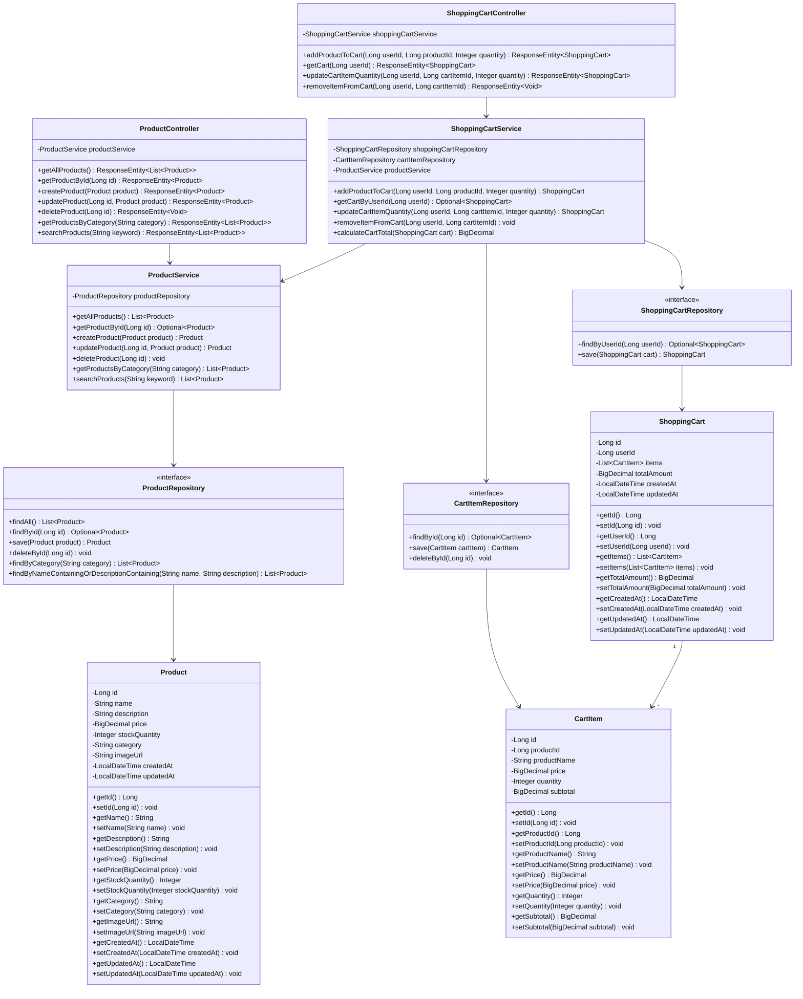

### 2.2 Entity Relationship Diagram

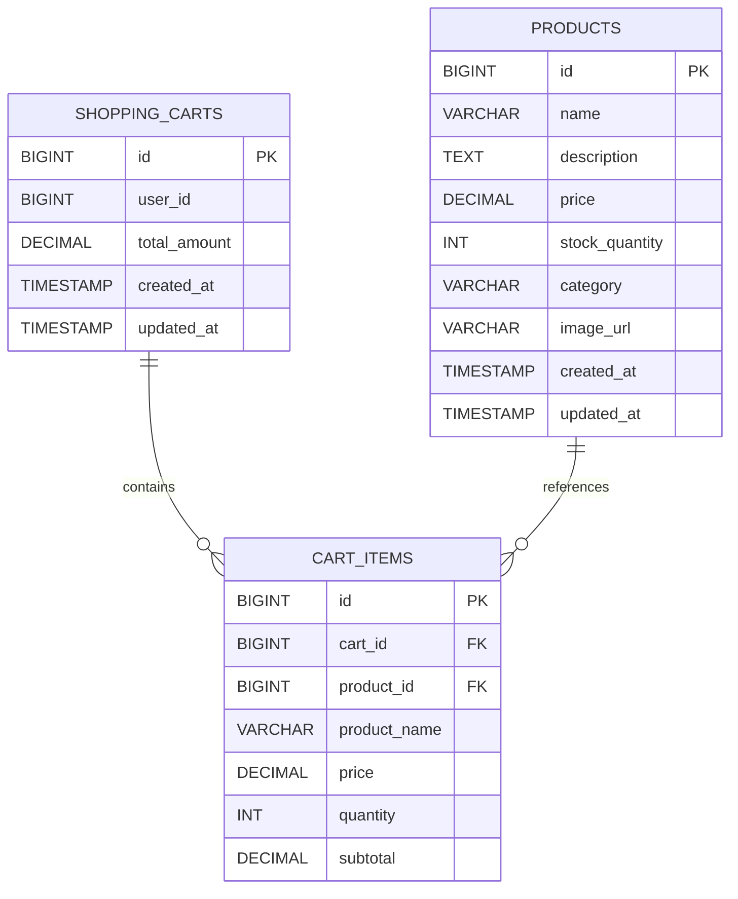

---

## 3. Sequence Diagrams

### 3.1 Get All Products

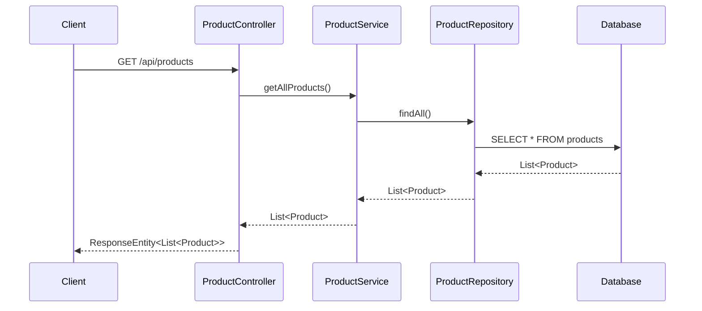

### 3.2 Get Product By ID

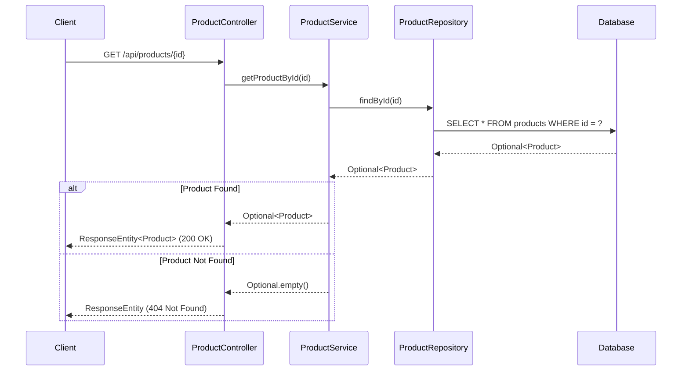

### 3.3 Create Product

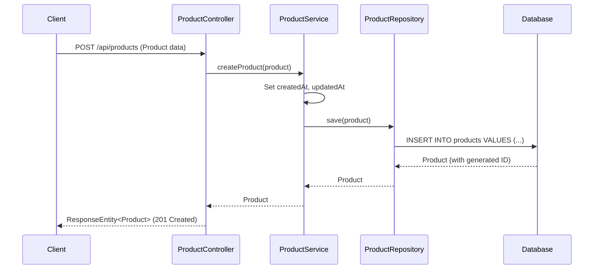

### 3.4 Update Product

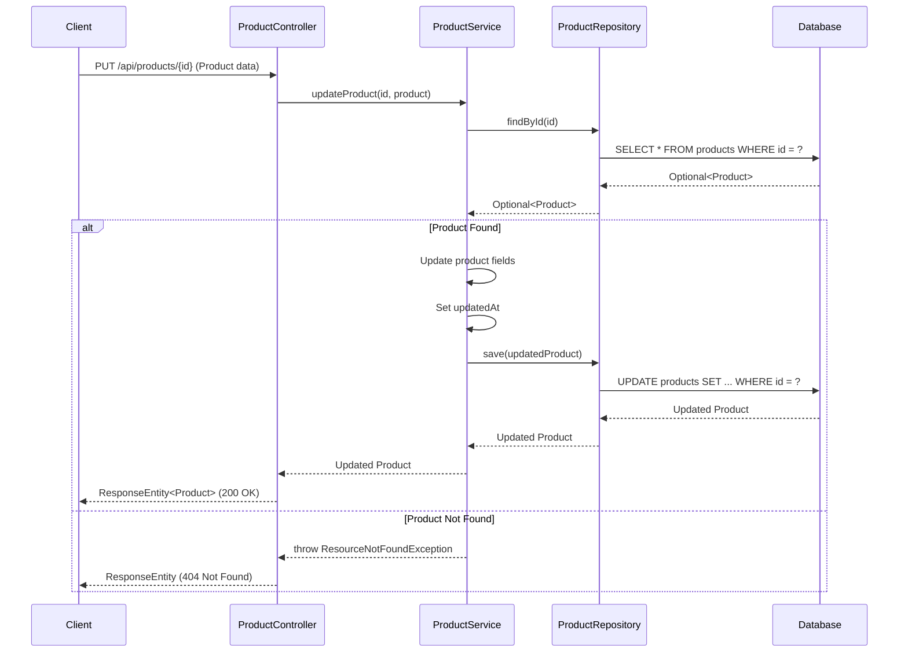

### 3.5 Delete Product

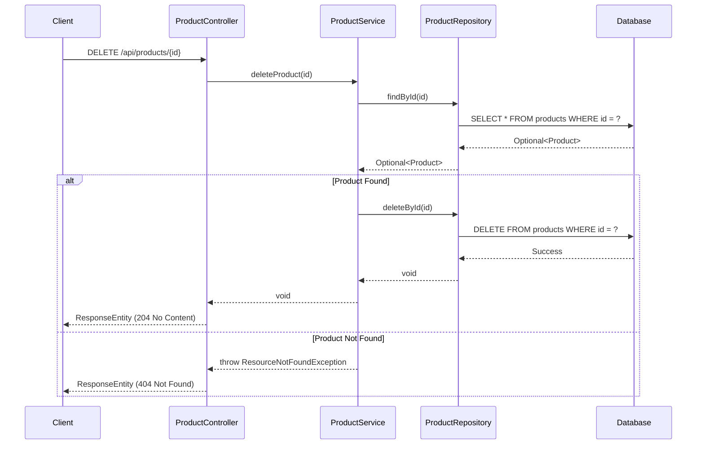

### 3.6 Get Products By Category

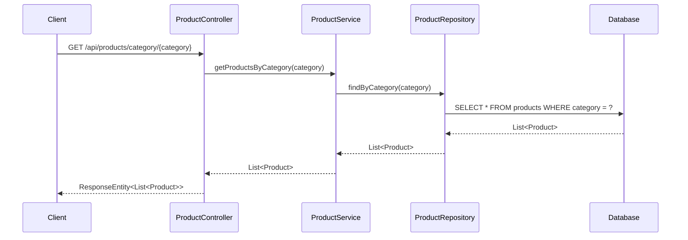

### 3.7 Search Products

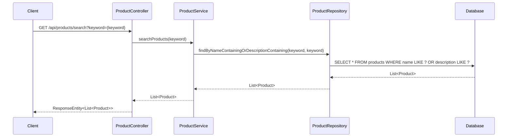

### 3.8 Add Product to Cart

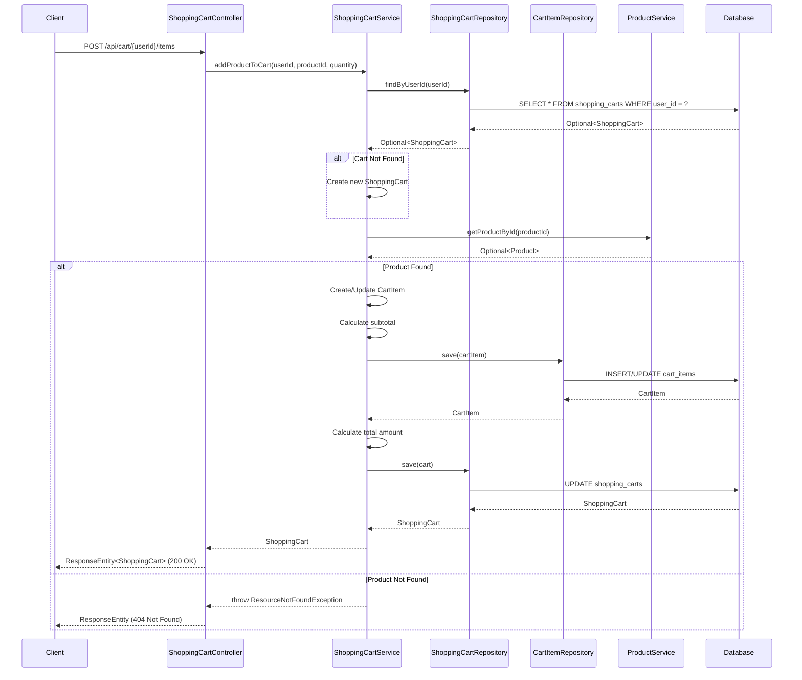

### 3.9 View Shopping Cart

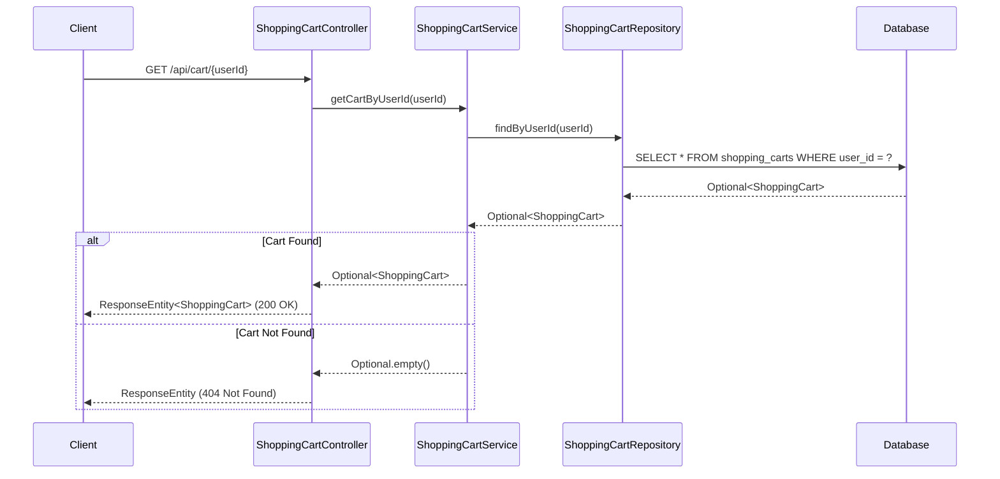

### 3.10 Update Cart Item Quantity

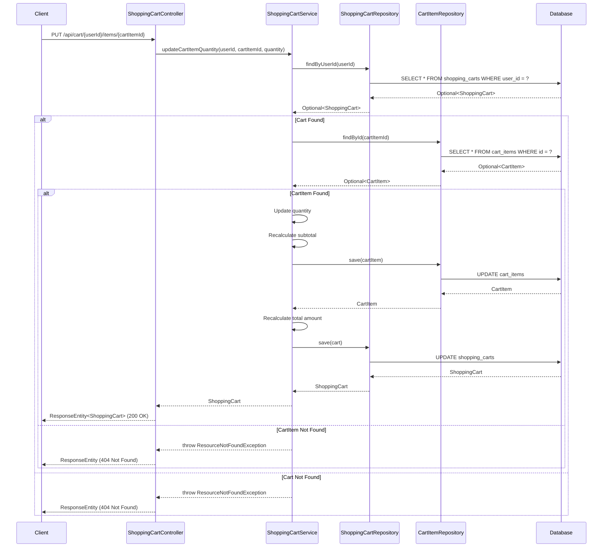

### 3.11 Remove Item from Cart

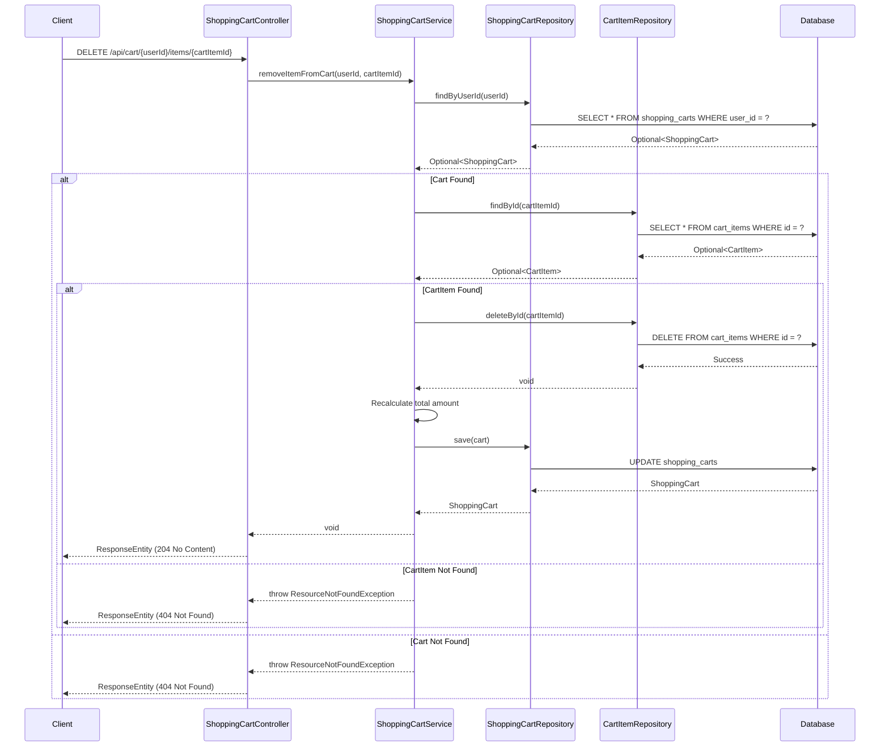

---

## 4. API Endpoints Summary

### Product Management Endpoints

| Method | Endpoint | Description | Request Body | Response |
|--------|----------|-------------|--------------|----------|
| GET | /api/products | Get all products | None | List<Product> |
| GET | /api/products/{id} | Get product by ID | None | Product |
| POST | /api/products | Create new product | Product | Product |
| PUT | /api/products/{id} | Update product | Product | Product |
| DELETE | /api/products/{id} | Delete product | None | Void |
| GET | /api/products/category/{category} | Get products by category | None | List<Product> |
| GET | /api/products/search?keyword={keyword} | Search products | None | List<Product> |

### Shopping Cart Management Endpoints

| Method | Endpoint | Description | Request Body | Response |
|--------|----------|-------------|--------------|----------|
| POST | /api/cart/{userId}/items | Add product to cart | {productId, quantity} | ShoppingCart |
| GET | /api/cart/{userId} | View shopping cart | None | ShoppingCart |
| PUT | /api/cart/{userId}/items/{cartItemId} | Update cart item quantity | {quantity} | ShoppingCart |
| DELETE | /api/cart/{userId}/items/{cartItemId} | Remove item from cart | None | Void |

---

## 5. Database Schema

### Products Table

```sql
CREATE TABLE products (
    id BIGINT AUTO_INCREMENT PRIMARY KEY,
    name VARCHAR(255) NOT NULL,
    description TEXT,
    price DECIMAL(10, 2) NOT NULL,
    stock_quantity INT NOT NULL DEFAULT 0,
    category VARCHAR(100),
    image_url VARCHAR(500),
    created_at TIMESTAMP DEFAULT CURRENT_TIMESTAMP,
    updated_at TIMESTAMP DEFAULT CURRENT_TIMESTAMP ON UPDATE CURRENT_TIMESTAMP,
    INDEX idx_category (category),
    INDEX idx_name (name)
);
```

### Shopping Carts Table

```sql
CREATE TABLE shopping_carts (
    id BIGINT AUTO_INCREMENT PRIMARY KEY,
    user_id BIGINT NOT NULL,
    total_amount DECIMAL(10, 2) NOT NULL DEFAULT 0.00,
    created_at TIMESTAMP DEFAULT CURRENT_TIMESTAMP,
    updated_at TIMESTAMP DEFAULT CURRENT_TIMESTAMP ON UPDATE CURRENT_TIMESTAMP,
    UNIQUE INDEX idx_user_id (user_id)
);
```

### Cart Items Table

```sql
CREATE TABLE cart_items (
    id BIGINT AUTO_INCREMENT PRIMARY KEY,
    cart_id BIGINT NOT NULL,
    product_id BIGINT NOT NULL,
    product_name VARCHAR(255) NOT NULL,
    price DECIMAL(10, 2) NOT NULL,
    quantity INT NOT NULL DEFAULT 1,
    subtotal DECIMAL(10, 2) NOT NULL,
    FOREIGN KEY (cart_id) REFERENCES shopping_carts(id) ON DELETE CASCADE,
    FOREIGN KEY (product_id) REFERENCES products(id),
    INDEX idx_cart_id (cart_id),
    INDEX idx_product_id (product_id)
);
```

---

## 6. Technology Stack

- **Framework**: Spring Boot 3.x
- **Language**: Java 21
- **Database**: MySQL/PostgreSQL
- **ORM**: Spring Data JPA
- **Build Tool**: Maven/Gradle
- **API Documentation**: SpringDoc OpenAPI (Swagger)
- **Validation**: Jakarta Bean Validation
- **Logging**: SLF4J with Logback

---

## 7. Design Patterns Used

### 7.1 Repository Pattern
- Abstracts data access logic
- Provides a collection-like interface for accessing domain objects
- Implemented through Spring Data JPA repositories

### 7.2 Service Layer Pattern
- Encapsulates business logic
- Provides a clear separation between controller and data access layers
- Promotes reusability and testability

### 7.3 DTO (Data Transfer Object) Pattern
- Used for transferring data between layers
- Helps in API versioning and reducing payload size
- Decouples internal domain models from external representations

### 7.4 Dependency Injection
- Constructor-based dependency injection
- Promotes loose coupling and easier testing
- Managed by Spring IoC container

### 7.5 Aggregate Pattern
- ShoppingCart acts as an aggregate root managing CartItem entities
- Ensures consistency boundaries within the cart domain
- All modifications to cart items go through the ShoppingCart aggregate
- Maintains invariants such as total amount calculation

---

## 8. Key Features

### 8.1 Product Management
- CRUD operations for products
- Category-based filtering
- Search functionality
- Stock quantity tracking
- Automatic timestamp management

### 8.2 Shopping Cart Management
- Add products to cart with specified quantities
- View complete cart with all items and total amount
- Update item quantities in cart
- Remove items from cart
- Automatic calculation of subtotals and cart total
- Cart persistence per user
- Integration with product catalog for real-time pricing

### 8.3 Error Handling
- Custom exception handling
- Proper HTTP status codes
- Meaningful error messages

### 8.4 Data Validation
- Input validation using Jakarta Bean Validation
- Business rule validation in service layer

### 8.5 RESTful API Design
- Resource-based URLs
- Proper HTTP methods
- Consistent response formats

---

## 9. Future Enhancements

- Implement pagination for product listings
- Add product image upload functionality
- Implement caching for frequently accessed products
- Add product reviews and ratings
- Implement inventory management with low stock alerts
- Add product variants (size, color, etc.)
- Implement advanced search with filters
- Add user authentication and authorization
- Implement order processing from cart
- Add payment gateway integration
- Implement cart expiration and cleanup

---

## 10. Conclusion

This Low Level Design document provides a comprehensive blueprint for implementing an E-commerce Product Management System with Shopping Cart functionality using Spring Boot and Java 21. The design follows industry best practices, SOLID principles, and leverages Spring Boot's powerful features for building robust and scalable applications.

---

**Document Version History:**

| Version | Date | Author | Changes |
|---------|------|--------|----------|
| 1.0 | 2024 | Development Team | Initial version with Product Management |
| 1.1 | 2024 | Development Team | Added Shopping Cart Management (SCRUM-1140) |