# Low Level Design Document

## E-commerce Product Management System

### Version: 1.1
### Date: 2024
### Technology: Spring Boot 3.x, Java 21

---

## 1. Project Overview

This document provides the low-level design for an E-commerce Product Management System built using Spring Boot and Java 21. The system manages product information, including CRUD operations, category-based filtering, and search functionality.

**Modules:**
- ProductManagement
- ShoppingCartManagement

---

## 2. System Architecture

### 2.1 Class Diagram

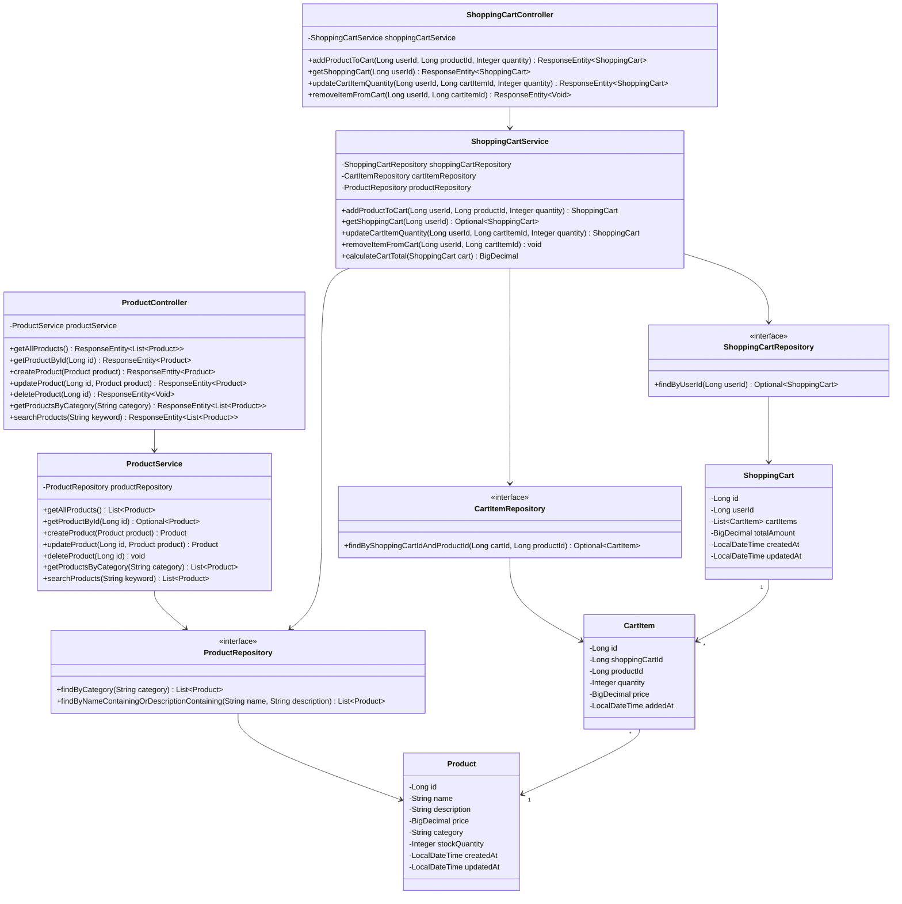

### 2.2 Entity Relationship Diagram

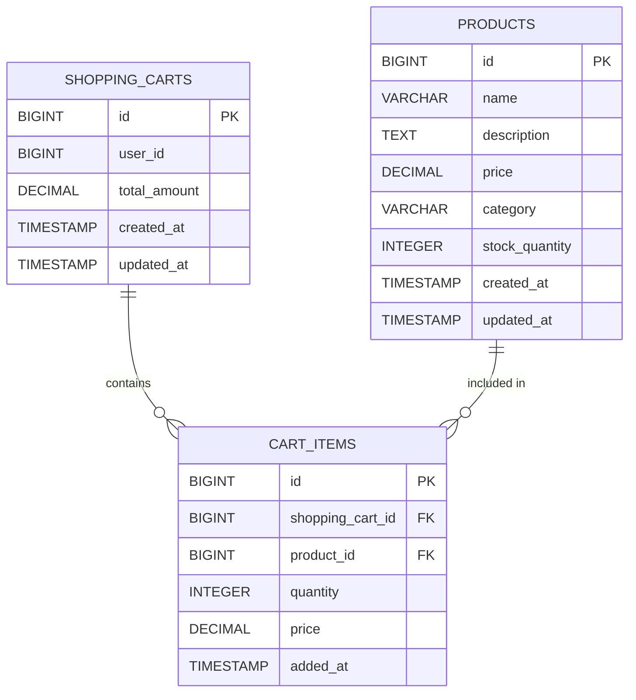

---

## 3. Sequence Diagrams

### 3.1 Get All Products

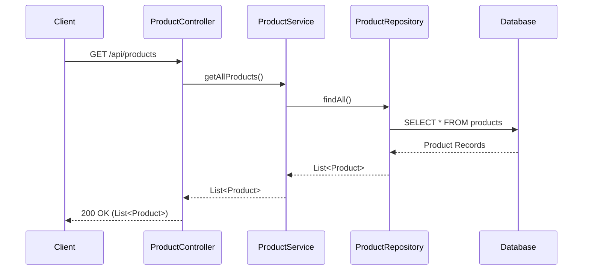

### 3.2 Get Product By ID

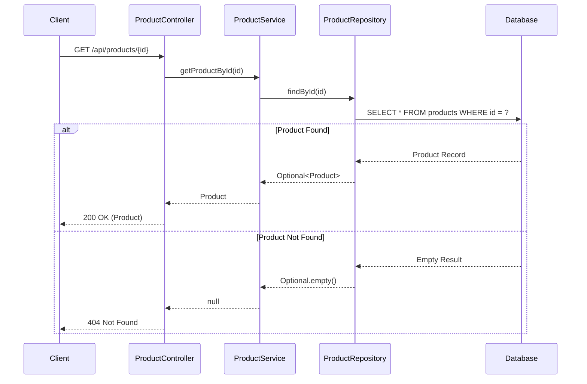

### 3.3 Create Product

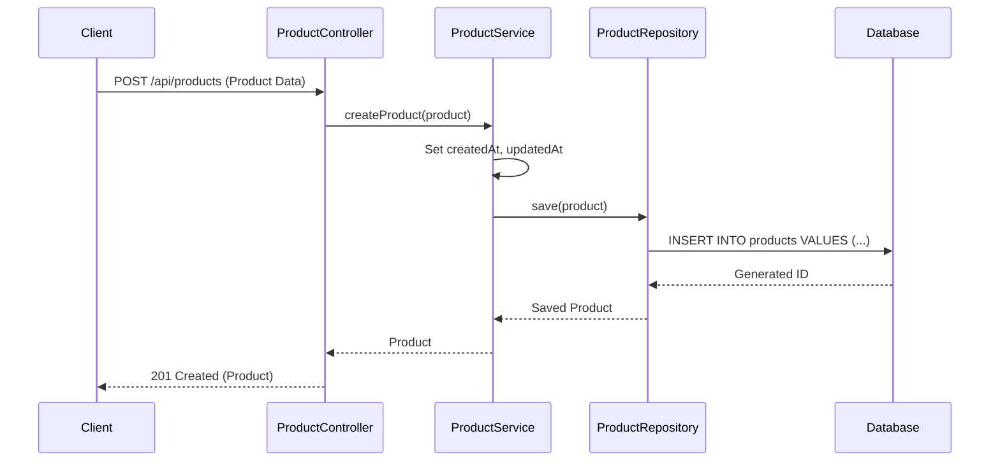

### 3.4 Update Product

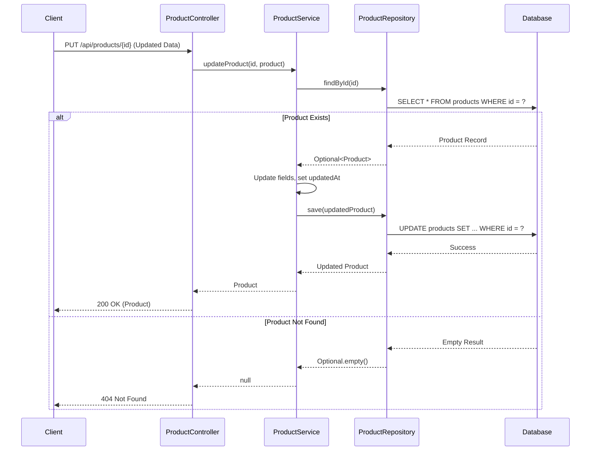

### 3.5 Delete Product

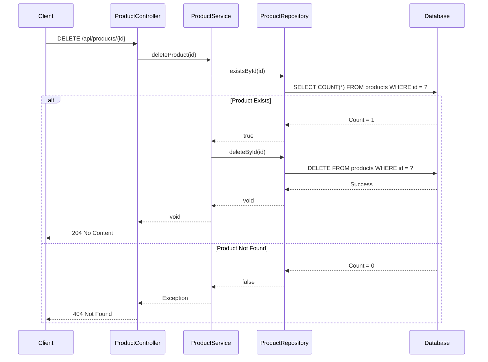

### 3.6 Get Products By Category

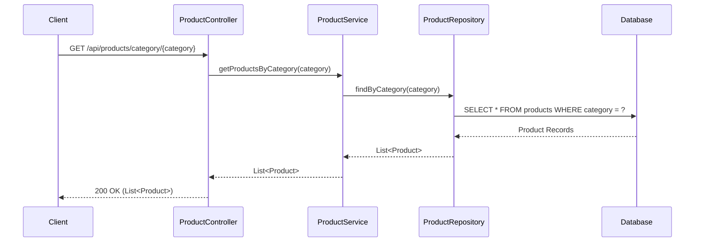

### 3.7 Search Products


### 3.8 Add Product to Cart

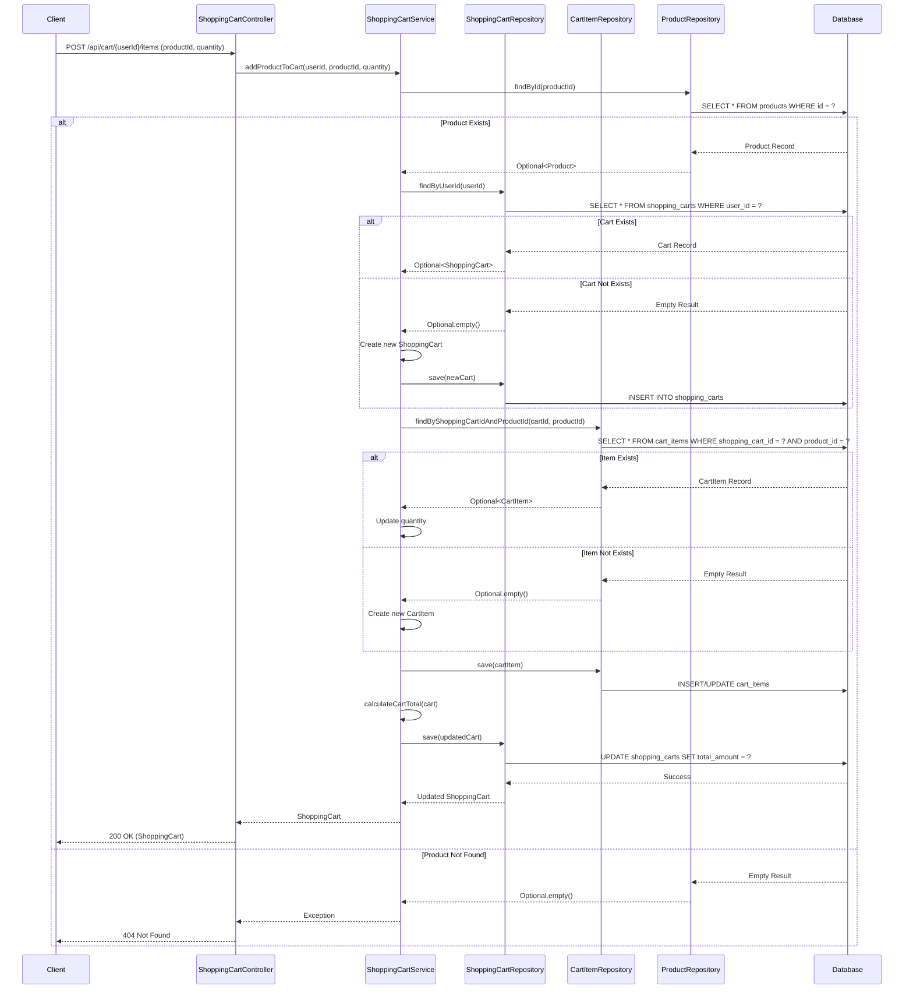

### 3.9 View Shopping Cart

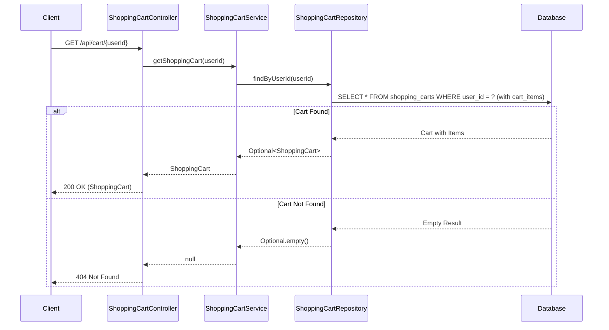

### 3.10 Update Cart Item Quantity

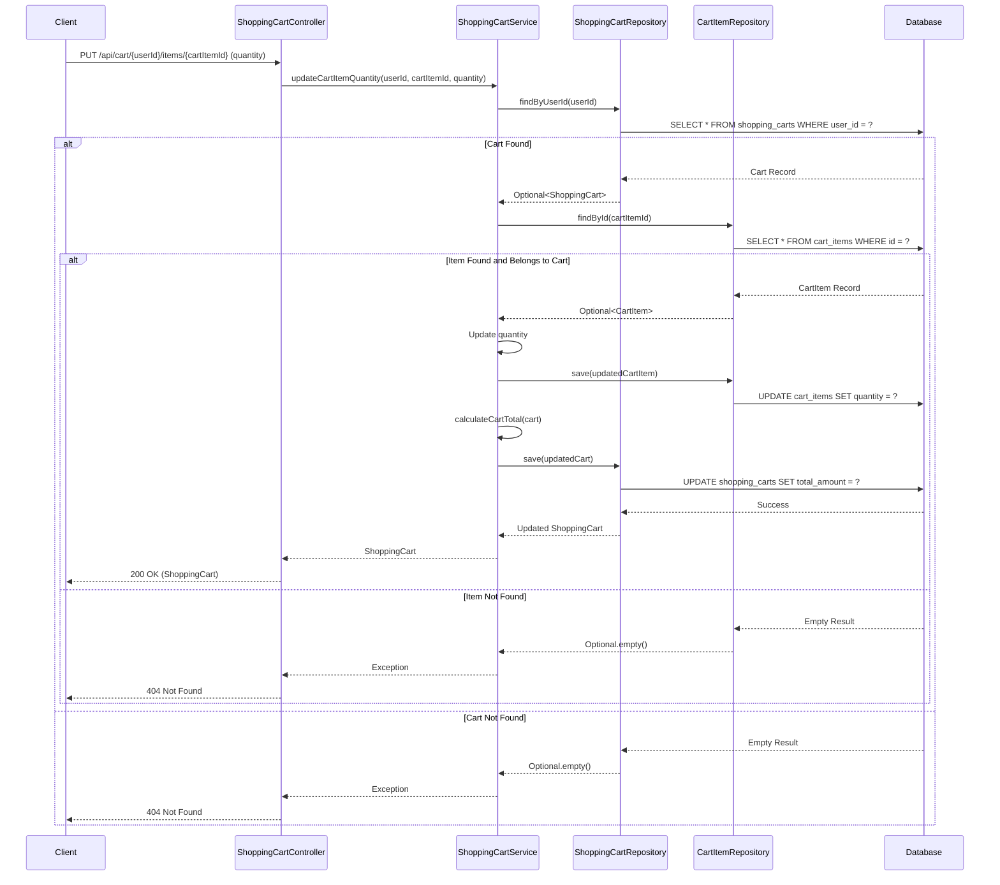

### 3.11 Remove Item from Cart

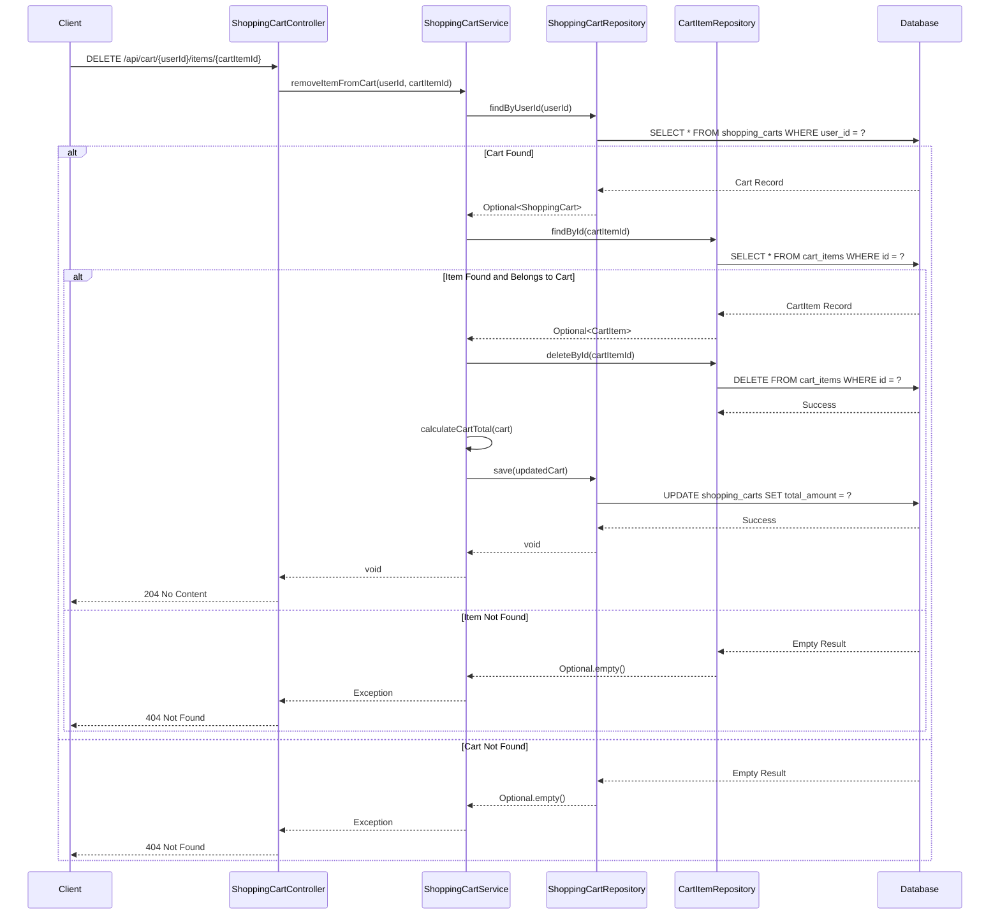

---

## 4. API Endpoints Summary

### Product Management Endpoints

| Method | Endpoint | Description | Request Body | Response |
|--------|----------|-------------|--------------|----------|
| GET | /api/products | Get all products | None | List<Product> |
| GET | /api/products/{id} | Get product by ID | None | Product |
| POST | /api/products | Create new product | Product | Product |
| PUT | /api/products/{id} | Update product | Product | Product |
| DELETE | /api/products/{id} | Delete product | None | 204 No Content |
| GET | /api/products/category/{category} | Get products by category | None | List<Product> |
| GET | /api/products/search?keyword={keyword} | Search products | None | List<Product> |

### Shopping Cart Management Endpoints

| Method | Endpoint | Description | Request Body | Response |
|--------|----------|-------------|--------------|----------|
| POST | /api/cart/{userId}/items | Add product to cart | {productId, quantity} | ShoppingCart |
| GET | /api/cart/{userId} | View shopping cart | None | ShoppingCart |
| PUT | /api/cart/{userId}/items/{cartItemId} | Update cart item quantity | {quantity} | ShoppingCart |
| DELETE | /api/cart/{userId}/items/{cartItemId} | Remove item from cart | None | 204 No Content |

---

## 5. Database Schema

### Products Table

```sql
CREATE TABLE products (
    id BIGINT AUTO_INCREMENT PRIMARY KEY,
    name VARCHAR(255) NOT NULL,
    description TEXT,
    price DECIMAL(10, 2) NOT NULL,
    category VARCHAR(100),
    stock_quantity INTEGER NOT NULL DEFAULT 0,
    created_at TIMESTAMP DEFAULT CURRENT_TIMESTAMP,
    updated_at TIMESTAMP DEFAULT CURRENT_TIMESTAMP ON UPDATE CURRENT_TIMESTAMP,
    INDEX idx_category (category),
    INDEX idx_name (name)
);
```

### Shopping Carts Table

```sql
CREATE TABLE shopping_carts (
    id BIGINT AUTO_INCREMENT PRIMARY KEY,
    user_id BIGINT NOT NULL,
    total_amount DECIMAL(10, 2) NOT NULL DEFAULT 0.00,
    created_at TIMESTAMP DEFAULT CURRENT_TIMESTAMP,
    updated_at TIMESTAMP DEFAULT CURRENT_TIMESTAMP ON UPDATE CURRENT_TIMESTAMP,
    UNIQUE INDEX idx_user_id (user_id)
);
```

### Cart Items Table

```sql
CREATE TABLE cart_items (
    id BIGINT AUTO_INCREMENT PRIMARY KEY,
    shopping_cart_id BIGINT NOT NULL,
    product_id BIGINT NOT NULL,
    quantity INTEGER NOT NULL DEFAULT 1,
    price DECIMAL(10, 2) NOT NULL,
    added_at TIMESTAMP DEFAULT CURRENT_TIMESTAMP,
    FOREIGN KEY (shopping_cart_id) REFERENCES shopping_carts(id) ON DELETE CASCADE,
    FOREIGN KEY (product_id) REFERENCES products(id) ON DELETE CASCADE,
    UNIQUE INDEX idx_cart_product (shopping_cart_id, product_id)
);
```

---

## 6. Technology Stack

- **Framework**: Spring Boot 3.x
- **Language**: Java 21
- **Database**: MySQL/PostgreSQL
- **ORM**: Spring Data JPA
- **Build Tool**: Maven/Gradle
- **API Documentation**: SpringDoc OpenAPI

---

## 7. Design Patterns Used

1. **Repository Pattern**: Data access abstraction through Spring Data JPA repositories
2. **Service Layer Pattern**: Business logic separation in service classes
3. **DTO Pattern**: Data transfer between layers (if implemented)
4. **RESTful API Pattern**: Resource-based API design
5. **Dependency Injection**: Spring's IoC container for loose coupling
6. **Aggregate Pattern**: ShoppingCart acts as an aggregate root managing CartItems lifecycle and ensuring consistency

---

## 8. Key Features

### Product Management
- Complete CRUD operations for products
- Category-based product filtering
- Product search functionality
- Stock quantity tracking
- Automatic timestamp management
- Input validation
- Error handling with appropriate HTTP status codes

### Shopping Cart Management
- Add products to shopping cart
- View cart contents with all items
- Update item quantities in cart
- Remove items from cart
- Automatic cart total calculation
- User-specific cart isolation
- Prevent duplicate products in cart (quantity updates instead)
- Cascade deletion of cart items when cart is deleted

---

## 9. Error Handling

- **404 Not Found**: When product/cart/item doesn't exist
- **400 Bad Request**: Invalid input data
- **500 Internal Server Error**: Unexpected server errors

---

## 10. Future Enhancements

- Pagination for product listings
- Advanced filtering options
- Product image management
- Product reviews and ratings
- Inventory management
- Price history tracking
- Cart expiration and cleanup
- Cart sharing functionality
- Save for later feature
- Apply discount codes/coupons

---

**Document End**