# Low Level Design Document
## E-commerce Product Management System

### Document Information
- **Project**: E-commerce Platform
- **Module**: Product Management & Shopping Cart Management
- **Version**: 2.0
- **Last Updated**: 2024
- **Author**: Engineering Team
- **Status**: Modified (Story SCRUM-1140)

---

## Table of Contents
1. [Introduction](#1-introduction)
2. [System Architecture](#2-system-architecture)
3. [Module Design](#3-module-design)
4. [Class Design](#4-class-design)
5. [Database Design](#5-database-design)
6. [API Design](#6-api-design)
7. [Sequence Diagrams](#7-sequence-diagrams)
8. [Data Flow Diagrams](#8-data-flow-diagrams)
9. [Design Patterns](#9-design-patterns)
10. [Error Handling](#10-error-handling)
11. [Security Considerations](#11-security-considerations)
12. [Performance & Scalability](#12-performance--scalability)
13. [Logging & Monitoring](#13-logging--monitoring)
14. [Assumptions & Constraints](#14-assumptions--constraints)
15. [Change Traceability](#15-change-traceability)

---

## 1. Introduction

### 1.1 Purpose
This Low Level Design (LLD) document provides detailed technical specifications for the E-commerce Product Management and Shopping Cart Management System. It serves as a blueprint for developers to implement the system using Spring Boot, Java 21, and PostgreSQL.

### 1.2 Scope
This document covers:
- **Product Management Module**: Product CRUD operations, inventory management, category management
- **Shopping Cart Management Module**: Cart operations, item management, cart persistence
- Detailed class structures and relationships
- Database schema and relationships
- RESTful API endpoints
- Business logic workflows
- Integration points

### 1.3 Technology Stack
- **Backend Framework**: Spring Boot 3.2.x
- **Language**: Java 21
- **Database**: PostgreSQL 15+
- **ORM**: Spring Data JPA / Hibernate
- **Build Tool**: Maven
- **API Documentation**: OpenAPI/Swagger

### 1.4 Design Principles
- **SOLID Principles**: Single Responsibility, Open/Closed, Liskov Substitution, Interface Segregation, Dependency Inversion
- **Clean Architecture**: Separation of concerns with layered architecture
- **RESTful Design**: Resource-based API design
- **Domain-Driven Design**: Rich domain models with business logic encapsulation

---

## 2. System Architecture

### 2.1 High-Level Architecture

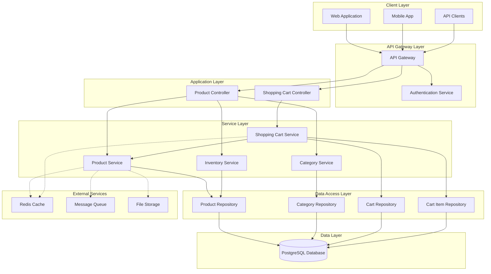
```mermaid
graph TB
    subgraph "Client Layer"
        WEB[Web Application]
        MOBILE[Mobile App]
        API_CLIENT[API Clients]
    end
    
    subgraph "API Gateway Layer"
        GATEWAY[API Gateway]
        AUTH[Authentication Service]
    end
    
    subgraph "Application Layer"
        PRODUCT_CTRL[Product Controller]
        CART_CTRL[Shopping Cart Controller]
    end
    
    subgraph "Service Layer"
        PRODUCT_SVC[Product Service]
        CATEGORY_SVC[Category Service]
        INVENTORY_SVC[Inventory Service]
        CART_SVC[Shopping Cart Service]
    end
    
    subgraph "Data Access Layer"
        PRODUCT_REPO[Product Repository]
        CATEGORY_REPO[Category Repository]
        CART_REPO[Cart Repository]
        CART_ITEM_REPO[Cart Item Repository]
    end
    
    subgraph "Data Layer"
        DB[(PostgreSQL Database)]
    end
    
    subgraph "External Services"
        CACHE[Redis Cache]
        QUEUE[Message Queue]
        STORAGE[File Storage]
    end
    
    WEB --> GATEWAY
    MOBILE --> GATEWAY
    API_CLIENT --> GATEWAY
    
    GATEWAY --> AUTH
    GATEWAY --> PRODUCT_CTRL
    GATEWAY --> CART_CTRL
    
    PRODUCT_CTRL --> PRODUCT_SVC
    PRODUCT_CTRL --> CATEGORY_SVC
    PRODUCT_CTRL --> INVENTORY_SVC
    CART_CTRL --> CART_SVC
    
    PRODUCT_SVC --> PRODUCT_REPO
    CATEGORY_SVC --> CATEGORY_REPO
    INVENTORY_SVC --> PRODUCT_REPO
    CART_SVC --> CART_REPO
    CART_SVC --> CART_ITEM_REPO
    CART_SVC --> PRODUCT_SVC
    
    PRODUCT_REPO --> DB
    CATEGORY_REPO --> DB
    CART_REPO --> DB
    CART_ITEM_REPO --> DB
    
    PRODUCT_SVC -.-> CACHE
    CART_SVC -.-> CACHE
    PRODUCT_SVC -.-> QUEUE
    PRODUCT_SVC -.-> STORAGE
```

### 2.2 Component Architecture

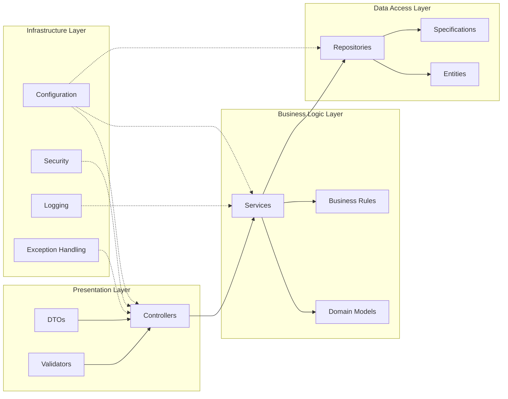
```mermaid
graph LR
    subgraph "Presentation Layer"
        A[Controllers]
        B[DTOs]
        C[Validators]
    end
    
    subgraph "Business Logic Layer"
        D[Services]
        E[Domain Models]
        F[Business Rules]
    end
    
    subgraph "Data Access Layer"
        G[Repositories]
        H[Entities]
        I[Specifications]
    end
    
    subgraph "Infrastructure Layer"
        J[Configuration]
        K[Security]
        L[Logging]
        M[Exception Handling]
    end
    
    A --> D
    B --> A
    C --> A
    D --> E
    D --> F
    D --> G
    G --> H
    G --> I
    J -.-> A
    J -.-> D
    J -.-> G
    K -.-> A
    L -.-> D
    M -.-> A
```

### 2.3 Deployment Architecture

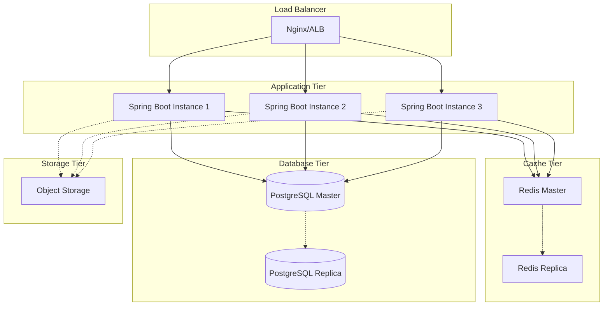
```mermaid
graph TB
    subgraph "Load Balancer"
        LB[Nginx/ALB]
    end
    
    subgraph "Application Tier"
        APP1[Spring Boot Instance 1]
        APP2[Spring Boot Instance 2]
        APP3[Spring Boot Instance 3]
    end
    
    subgraph "Cache Tier"
        REDIS1[Redis Master]
        REDIS2[Redis Replica]
    end
    
    subgraph "Database Tier"
        DB_MASTER[(PostgreSQL Master)]
        DB_REPLICA[(PostgreSQL Replica)]
    end
    
    subgraph "Storage Tier"
        S3[Object Storage]
    end
    
    LB --> APP1
    LB --> APP2
    LB --> APP3
    
    APP1 --> REDIS1
    APP2 --> REDIS1
    APP3 --> REDIS1
    REDIS1 -.-> REDIS2
    
    APP1 --> DB_MASTER
    APP2 --> DB_MASTER
    APP3 --> DB_MASTER
    DB_MASTER -.-> DB_REPLICA
    
    APP1 -.-> S3
    APP2 -.-> S3
    APP3 -.-> S3
```

---

## 3. Module Design

### 3.1 Product Management Module

**Responsibilities:**
- Manage product lifecycle (Create, Read, Update, Delete)
- Handle product categorization
- Manage product inventory
- Support product search and filtering
- Handle product images and media

**Components:**
- `ProductController`: REST API endpoints
- `ProductService`: Business logic
- `ProductRepository`: Data access
- `Product`: Domain entity
- `ProductDTO`: Data transfer object

### 3.2 Shopping Cart Management Module

**Responsibilities:**
- Create and manage shopping carts for users
- Add, update, and remove items from cart
- Calculate cart totals and apply business rules
- Persist cart state across sessions
- Handle cart expiration and cleanup

**Components:**
- `ShoppingCartController`: REST API endpoints for cart operations
- `ShoppingCartService`: Business logic for cart management
- `ShoppingCartRepository`: Data access for shopping carts
- `CartItemRepository`: Data access for cart items
- `ShoppingCart`: Domain entity representing user's cart
- `CartItem`: Domain entity representing items in cart

### 3.3 Module Interaction Diagram

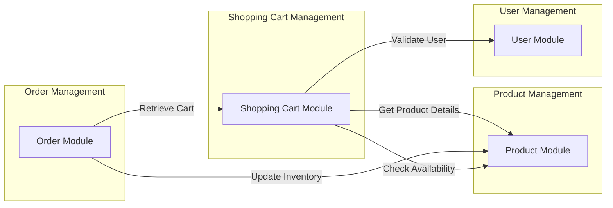
```mermaid
graph LR
    subgraph "Product Management"
        PM[Product Module]
    end
    
    subgraph "Shopping Cart Management"
        SCM[Shopping Cart Module]
    end
    
    subgraph "User Management"
        UM[User Module]
    end
    
    subgraph "Order Management"
        OM[Order Module]
    end
    
    SCM -->|Get Product Details| PM
    SCM -->|Validate User| UM
    OM -->|Retrieve Cart| SCM
    OM -->|Update Inventory| PM
    SCM -->|Check Availability| PM
```

---

## 4. Class Design

### 4.1 Product Management Classes

#### 4.1.1 Class Diagram

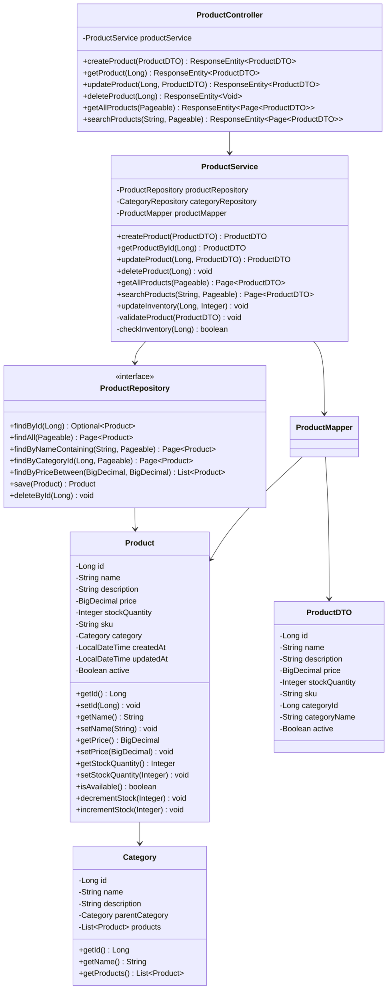
```mermaid
classDiagram
    class ProductController {
        -ProductService productService
        +createProduct(ProductDTO) ResponseEntity~ProductDTO~
        +getProduct(Long) ResponseEntity~ProductDTO~
        +updateProduct(Long, ProductDTO) ResponseEntity~ProductDTO~
        +deleteProduct(Long) ResponseEntity~Void~
        +getAllProducts(Pageable) ResponseEntity~Page~ProductDTO~~
        +searchProducts(String, Pageable) ResponseEntity~Page~ProductDTO~~
    }
    
    class ProductService {
        -ProductRepository productRepository
        -CategoryRepository categoryRepository
        -ProductMapper productMapper
        +createProduct(ProductDTO) ProductDTO
        +getProductById(Long) ProductDTO
        +updateProduct(Long, ProductDTO) ProductDTO
        +deleteProduct(Long) void
        +getAllProducts(Pageable) Page~ProductDTO~
        +searchProducts(String, Pageable) Page~ProductDTO~
        +updateInventory(Long, Integer) void
        -validateProduct(ProductDTO) void
        -checkInventory(Long) boolean
    }
    
    class ProductRepository {
        <<interface>>
        +findById(Long) Optional~Product~
        +findAll(Pageable) Page~Product~
        +findByNameContaining(String, Pageable) Page~Product~
        +findByCategoryId(Long, Pageable) Page~Product~
        +findByPriceBetween(BigDecimal, BigDecimal) List~Product~
        +save(Product) Product
        +deleteById(Long) void
    }
    
    class Product {
        -Long id
        -String name
        -String description
        -BigDecimal price
        -Integer stockQuantity
        -String sku
        -Category category
        -LocalDateTime createdAt
        -LocalDateTime updatedAt
        -Boolean active
        +getId() Long
        +setId(Long) void
        +getName() String
        +setName(String) void
        +getPrice() BigDecimal
        +setPrice(BigDecimal) void
        +getStockQuantity() Integer
        +setStockQuantity(Integer) void
        +isAvailable() boolean
        +decrementStock(Integer) void
        +incrementStock(Integer) void
    }
    
    class Category {
        -Long id
        -String name
        -String description
        -Category parentCategory
        -List~Product~ products
        +getId() Long
        +getName() String
        +getProducts() List~Product~
    }
    
    class ProductDTO {
        -Long id
        -String name
        -String description
        -BigDecimal price
        -Integer stockQuantity
        -String sku
        -Long categoryId
        -String categoryName
        -Boolean active
    }
    
    ProductController --> ProductService
    ProductService --> ProductRepository
    ProductService --> ProductMapper
    ProductRepository --> Product
    Product --> Category
    ProductMapper --> Product
    ProductMapper --> ProductDTO
```

### 4.2 Shopping Cart Management Classes

#### 4.2.1 Class Diagram

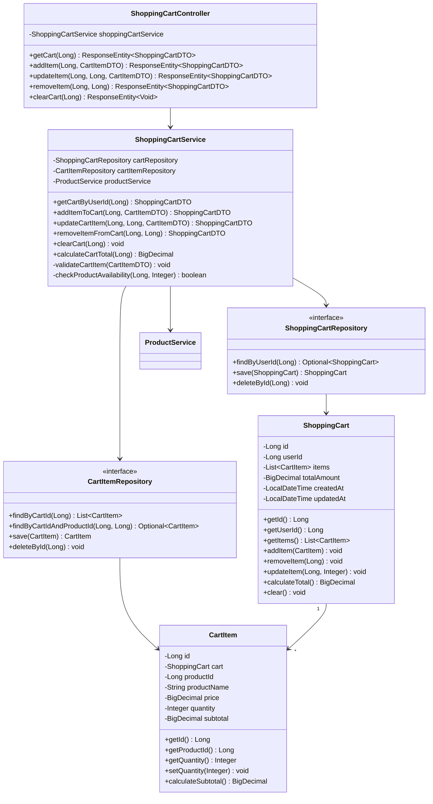
```mermaid
classDiagram
    class ShoppingCartController {
        -ShoppingCartService shoppingCartService
        +getCart(Long) ResponseEntity~ShoppingCartDTO~
        +addItem(Long, CartItemDTO) ResponseEntity~ShoppingCartDTO~
        +updateItem(Long, Long, CartItemDTO) ResponseEntity~ShoppingCartDTO~
        +removeItem(Long, Long) ResponseEntity~ShoppingCartDTO~
        +clearCart(Long) ResponseEntity~Void~
    }
    
    class ShoppingCartService {
        -ShoppingCartRepository cartRepository
        -CartItemRepository cartItemRepository
        -ProductService productService
        +getCartByUserId(Long) ShoppingCartDTO
        +addItemToCart(Long, CartItemDTO) ShoppingCartDTO
        +updateCartItem(Long, Long, CartItemDTO) ShoppingCartDTO
        +removeItemFromCart(Long, Long) ShoppingCartDTO
        +clearCart(Long) void
        +calculateCartTotal(Long) BigDecimal
        -validateCartItem(CartItemDTO) void
        -checkProductAvailability(Long, Integer) boolean
    }
    
    class ShoppingCartRepository {
        <<interface>>
        +findByUserId(Long) Optional~ShoppingCart~
        +save(ShoppingCart) ShoppingCart
        +deleteById(Long) void
    }
    
    class CartItemRepository {
        <<interface>>
        +findByCartId(Long) List~CartItem~
        +findByCartIdAndProductId(Long, Long) Optional~CartItem~
        +save(CartItem) CartItem
        +deleteById(Long) void
    }
    
    class ShoppingCart {
        -Long id
        -Long userId
        -List~CartItem~ items
        -BigDecimal totalAmount
        -LocalDateTime createdAt
        -LocalDateTime updatedAt
        +getId() Long
        +getUserId() Long
        +getItems() List~CartItem~
        +addItem(CartItem) void
        +removeItem(Long) void
        +updateItem(Long, Integer) void
        +calculateTotal() BigDecimal
        +clear() void
    }
    
    class CartItem {
        -Long id
        -ShoppingCart cart
        -Long productId
        -String productName
        -BigDecimal price
        -Integer quantity
        -BigDecimal subtotal
        +getId() Long
        +getProductId() Long
        +getQuantity() Integer
        +setQuantity(Integer) void
        +calculateSubtotal() BigDecimal
    }
    
    ShoppingCartController --> ShoppingCartService
    ShoppingCartService --> ShoppingCartRepository
    ShoppingCartService --> CartItemRepository
    ShoppingCartService --> ProductService
    ShoppingCartRepository --> ShoppingCart
    CartItemRepository --> CartItem
    ShoppingCart "1" --> "*" CartItem
```

### 4.3 Complete System Class Diagram

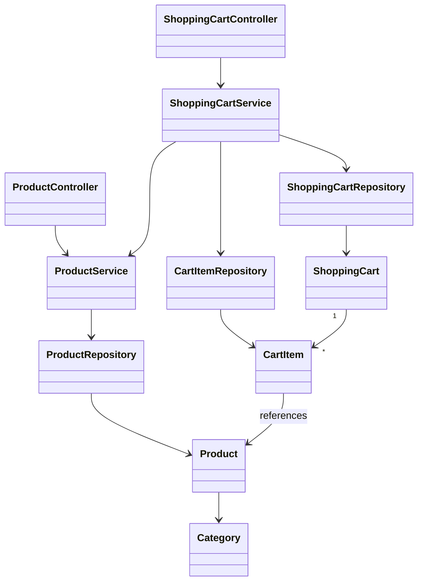
```mermaid
classDiagram
    class ProductController
    class ProductService
    class ProductRepository
    class Product
    class Category
    
    class ShoppingCartController
    class ShoppingCartService
    class ShoppingCartRepository
    class CartItemRepository
    class ShoppingCart
    class CartItem
    
    ProductController --> ProductService
    ProductService --> ProductRepository
    ProductRepository --> Product
    Product --> Category
    
    ShoppingCartController --> ShoppingCartService
    ShoppingCartService --> ShoppingCartRepository
    ShoppingCartService --> CartItemRepository
    ShoppingCartService --> ProductService
    ShoppingCartRepository --> ShoppingCart
    CartItemRepository --> CartItem
    ShoppingCart "1" --> "*" CartItem
    CartItem --> Product : references
```

---

## 5. Database Design

### 5.1 Entity Relationship Diagram

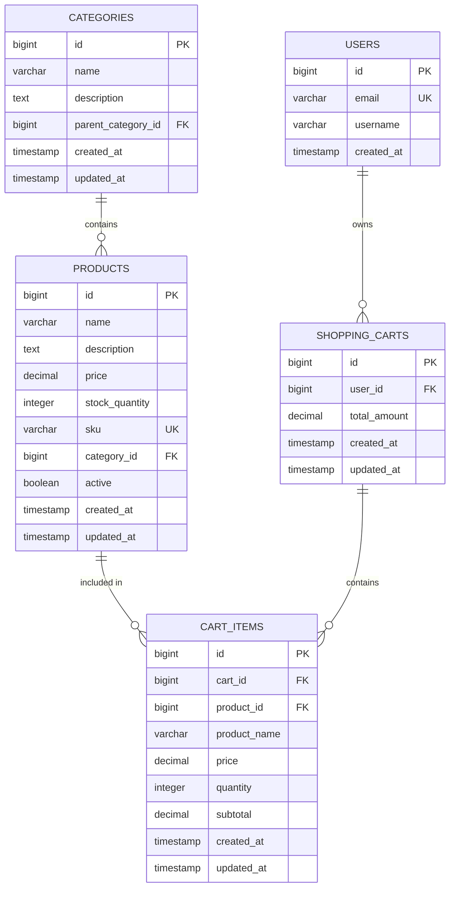
```mermaid
erDiagram
    CATEGORIES ||--o{ PRODUCTS : contains
    PRODUCTS ||--o{ CART_ITEMS : "included in"
    SHOPPING_CARTS ||--o{ CART_ITEMS : contains
    USERS ||--o{ SHOPPING_CARTS : owns
    
    CATEGORIES {
        bigint id PK
        varchar name
        text description
        bigint parent_category_id FK
        timestamp created_at
        timestamp updated_at
    }
    
    PRODUCTS {
        bigint id PK
        varchar name
        text description
        decimal price
        integer stock_quantity
        varchar sku UK
        bigint category_id FK
        boolean active
        timestamp created_at
        timestamp updated_at
    }
    
    SHOPPING_CARTS {
        bigint id PK
        bigint user_id FK
        decimal total_amount
        timestamp created_at
        timestamp updated_at
    }
    
    CART_ITEMS {
        bigint id PK
        bigint cart_id FK
        bigint product_id FK
        varchar product_name
        decimal price
        integer quantity
        decimal subtotal
        timestamp created_at
        timestamp updated_at
    }
    
    USERS {
        bigint id PK
        varchar email UK
        varchar username
        timestamp created_at
    }
```

### 5.2 Database Schema

#### 5.2.1 Categories Table

```sql
CREATE TABLE categories (
    id BIGSERIAL PRIMARY KEY,
    name VARCHAR(255) NOT NULL,
    description TEXT,
    parent_category_id BIGINT,
    created_at TIMESTAMP DEFAULT CURRENT_TIMESTAMP,
    updated_at TIMESTAMP DEFAULT CURRENT_TIMESTAMP,
    FOREIGN KEY (parent_category_id) REFERENCES categories(id) ON DELETE SET NULL
);

CREATE INDEX idx_categories_parent ON categories(parent_category_id);
CREATE INDEX idx_categories_name ON categories(name);
```

#### 5.2.2 Products Table

```sql
CREATE TABLE products (
    id BIGSERIAL PRIMARY KEY,
    name VARCHAR(255) NOT NULL,
    description TEXT,
    price DECIMAL(10, 2) NOT NULL CHECK (price >= 0),
    stock_quantity INTEGER NOT NULL DEFAULT 0 CHECK (stock_quantity >= 0),
    sku VARCHAR(100) UNIQUE NOT NULL,
    category_id BIGINT NOT NULL,
    active BOOLEAN DEFAULT TRUE,
    created_at TIMESTAMP DEFAULT CURRENT_TIMESTAMP,
    updated_at TIMESTAMP DEFAULT CURRENT_TIMESTAMP,
    FOREIGN KEY (category_id) REFERENCES categories(id) ON DELETE RESTRICT
);

CREATE INDEX idx_products_category ON products(category_id);
CREATE INDEX idx_products_sku ON products(sku);
CREATE INDEX idx_products_name ON products(name);
CREATE INDEX idx_products_price ON products(price);
CREATE INDEX idx_products_active ON products(active);
```

#### 5.2.3 Shopping Carts Table

```sql
CREATE TABLE shopping_carts (
    id BIGSERIAL PRIMARY KEY,
    user_id BIGINT NOT NULL,
    total_amount DECIMAL(10, 2) DEFAULT 0.00 CHECK (total_amount >= 0),
    created_at TIMESTAMP DEFAULT CURRENT_TIMESTAMP,
    updated_at TIMESTAMP DEFAULT CURRENT_TIMESTAMP,
    CONSTRAINT fk_user FOREIGN KEY (user_id) REFERENCES users(id) ON DELETE CASCADE
);

CREATE UNIQUE INDEX idx_shopping_carts_user ON shopping_carts(user_id);
CREATE INDEX idx_shopping_carts_updated ON shopping_carts(updated_at);
```

#### 5.2.4 Cart Items Table

```sql
CREATE TABLE cart_items (
    id BIGSERIAL PRIMARY KEY,
    cart_id BIGINT NOT NULL,
    product_id BIGINT NOT NULL,
    product_name VARCHAR(255) NOT NULL,
    price DECIMAL(10, 2) NOT NULL CHECK (price >= 0),
    quantity INTEGER NOT NULL CHECK (quantity > 0),
    subtotal DECIMAL(10, 2) NOT NULL CHECK (subtotal >= 0),
    created_at TIMESTAMP DEFAULT CURRENT_TIMESTAMP,
    updated_at TIMESTAMP DEFAULT CURRENT_TIMESTAMP,
    CONSTRAINT fk_cart FOREIGN KEY (cart_id) REFERENCES shopping_carts(id) ON DELETE CASCADE,
    CONSTRAINT fk_product FOREIGN KEY (product_id) REFERENCES products(id) ON DELETE RESTRICT,
    CONSTRAINT uk_cart_product UNIQUE (cart_id, product_id)
);

CREATE INDEX idx_cart_items_cart ON cart_items(cart_id);
CREATE INDEX idx_cart_items_product ON cart_items(product_id);
```

### 5.3 Database Constraints and Rules

**Business Rules Enforced:**
1. Product price must be non-negative
2. Stock quantity cannot be negative
3. Cart item quantity must be positive
4. Subtotal must be non-negative
5. One cart per user (unique constraint)
6. Cannot delete product if referenced in active carts
7. Cascade delete cart items when cart is deleted

---

## 6. API Design

### 6.1 Product Management API Endpoints

#### 6.1.1 Create Product

**Endpoint:** `POST /api/v1/products`

**Request Body:**
```json
{
  "name": "Laptop",
  "description": "High-performance laptop",
  "price": 999.99,
  "stockQuantity": 50,
  "sku": "LAP-001",
  "categoryId": 1,
  "active": true
}
```

**Response:** `201 Created`
```json
{
  "id": 1,
  "name": "Laptop",
  "description": "High-performance laptop",
  "price": 999.99,
  "stockQuantity": 50,
  "sku": "LAP-001",
  "categoryId": 1,
  "categoryName": "Electronics",
  "active": true
}
```

#### 6.1.2 Get Product

**Endpoint:** `GET /api/v1/products/{id}`

**Response:** `200 OK`
```json
{
  "id": 1,
  "name": "Laptop",
  "description": "High-performance laptop",
  "price": 999.99,
  "stockQuantity": 50,
  "sku": "LAP-001",
  "categoryId": 1,
  "categoryName": "Electronics",
  "active": true
}
```

#### 6.1.3 Update Product

**Endpoint:** `PUT /api/v1/products/{id}`

**Request Body:**
```json
{
  "name": "Laptop Pro",
  "description": "High-performance laptop with upgraded specs",
  "price": 1299.99,
  "stockQuantity": 45,
  "sku": "LAP-001",
  "categoryId": 1,
  "active": true
}
```

**Response:** `200 OK`

#### 6.1.4 Delete Product

**Endpoint:** `DELETE /api/v1/products/{id}`

**Response:** `204 No Content`

#### 6.1.5 Get All Products

**Endpoint:** `GET /api/v1/products?page=0&size=20&sort=name,asc`

**Response:** `200 OK`
```json
{
  "content": [
    {
      "id": 1,
      "name": "Laptop",
      "price": 999.99,
      "stockQuantity": 50
    }
  ],
  "pageable": {
    "pageNumber": 0,
    "pageSize": 20
  },
  "totalElements": 100,
  "totalPages": 5
}
```

#### 6.1.6 Search Products

**Endpoint:** `GET /api/v1/products/search?query=laptop&page=0&size=20`

**Response:** `200 OK`

### 6.2 Shopping Cart Management API Endpoints

#### 6.2.1 Get Cart

**Endpoint:** `GET /api/v1/carts/{userId}`

**Response:** `200 OK`
```json
{
  "id": 1,
  "userId": 123,
  "items": [
    {
      "id": 1,
      "productId": 456,
      "productName": "Laptop",
      "price": 999.99,
      "quantity": 2,
      "subtotal": 1999.98
    }
  ],
  "totalAmount": 1999.98,
  "createdAt": "2024-01-15T10:30:00",
  "updatedAt": "2024-01-15T11:45:00"
}
```

#### 6.2.2 Add Item to Cart

**Endpoint:** `POST /api/v1/carts/{userId}/items`

**Request Body:**
```json
{
  "productId": 456,
  "quantity": 2
}
```

**Response:** `200 OK`
```json
{
  "id": 1,
  "userId": 123,
  "items": [
    {
      "id": 1,
      "productId": 456,
      "productName": "Laptop",
      "price": 999.99,
      "quantity": 2,
      "subtotal": 1999.98
    }
  ],
  "totalAmount": 1999.98
}
```

#### 6.2.3 Update Cart Item

**Endpoint:** `PUT /api/v1/carts/{userId}/items/{itemId}`

**Request Body:**
```json
{
  "quantity": 3
}
```

**Response:** `200 OK`

#### 6.2.4 Remove Item from Cart

**Endpoint:** `DELETE /api/v1/carts/{userId}/items/{itemId}`

**Response:** `200 OK`

#### 6.2.5 Clear Cart

**Endpoint:** `DELETE /api/v1/carts/{userId}`

**Response:** `204 No Content`

### 6.3 API Error Responses

**400 Bad Request:**
```json
{
  "timestamp": "2024-01-15T10:30:00",
  "status": 400,
  "error": "Bad Request",
  "message": "Invalid product data",
  "path": "/api/v1/products"
}
```

**404 Not Found:**
```json
{
  "timestamp": "2024-01-15T10:30:00",
  "status": 404,
  "error": "Not Found",
  "message": "Product not found with id: 999",
  "path": "/api/v1/products/999"
}
```

**500 Internal Server Error:**
```json
{
  "timestamp": "2024-01-15T10:30:00",
  "status": 500,
  "error": "Internal Server Error",
  "message": "An unexpected error occurred",
  "path": "/api/v1/products"
}
```

---

## 7. Sequence Diagrams

### 7.1 Create Product Flow

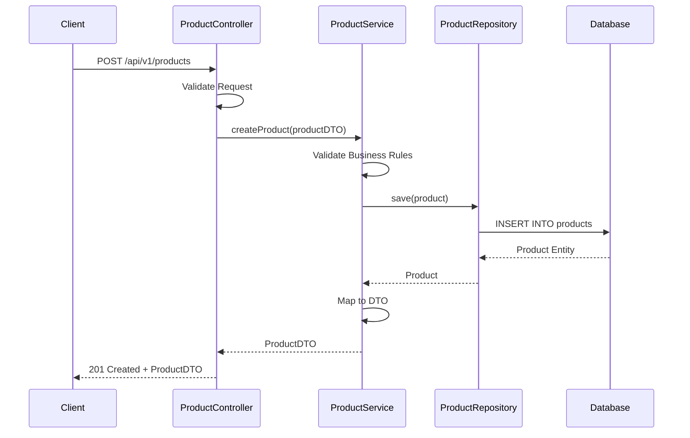
```mermaid
sequenceDiagram
    participant Client
    participant Controller as ProductController
    participant Service as ProductService
    participant Repository as ProductRepository
    participant DB as Database
    
    Client->>Controller: POST /api/v1/products
    Controller->>Controller: Validate Request
    Controller->>Service: createProduct(productDTO)
    Service->>Service: Validate Business Rules
    Service->>Repository: save(product)
    Repository->>DB: INSERT INTO products
    DB-->>Repository: Product Entity
    Repository-->>Service: Product
    Service->>Service: Map to DTO
    Service-->>Controller: ProductDTO
    Controller-->>Client: 201 Created + ProductDTO
```

### 7.2 Get Product Flow

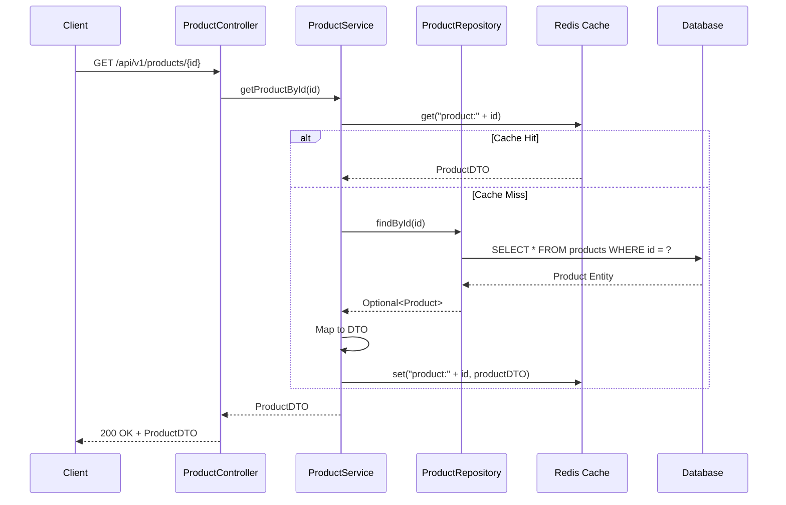
```mermaid
sequenceDiagram
    participant Client
    participant Controller as ProductController
    participant Service as ProductService
    participant Repository as ProductRepository
    participant Cache as Redis Cache
    participant DB as Database
    
    Client->>Controller: GET /api/v1/products/{id}
    Controller->>Service: getProductById(id)
    Service->>Cache: get("product:" + id)
    alt Cache Hit
        Cache-->>Service: ProductDTO
    else Cache Miss
        Service->>Repository: findById(id)
        Repository->>DB: SELECT * FROM products WHERE id = ?
        DB-->>Repository: Product Entity
        Repository-->>Service: Optional<Product>
        Service->>Service: Map to DTO
        Service->>Cache: set("product:" + id, productDTO)
    end
    Service-->>Controller: ProductDTO
    Controller-->>Client: 200 OK + ProductDTO
```

### 7.3 Update Product Flow

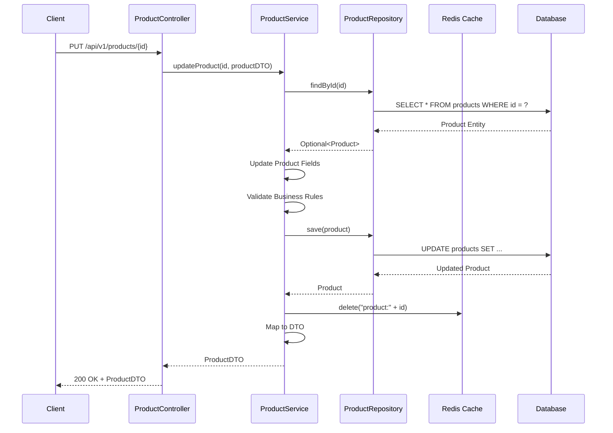
```mermaid
sequenceDiagram
    participant Client
    participant Controller as ProductController
    participant Service as ProductService
    participant Repository as ProductRepository
    participant Cache as Redis Cache
    participant DB as Database
    
    Client->>Controller: PUT /api/v1/products/{id}
    Controller->>Service: updateProduct(id, productDTO)
    Service->>Repository: findById(id)
    Repository->>DB: SELECT * FROM products WHERE id = ?
    DB-->>Repository: Product Entity
    Repository-->>Service: Optional<Product>
    Service->>Service: Update Product Fields
    Service->>Service: Validate Business Rules
    Service->>Repository: save(product)
    Repository->>DB: UPDATE products SET ...
    DB-->>Repository: Updated Product
    Repository-->>Service: Product
    Service->>Cache: delete("product:" + id)
    Service->>Service: Map to DTO
    Service-->>Controller: ProductDTO
    Controller-->>Client: 200 OK + ProductDTO
```

### 7.4 Delete Product Flow

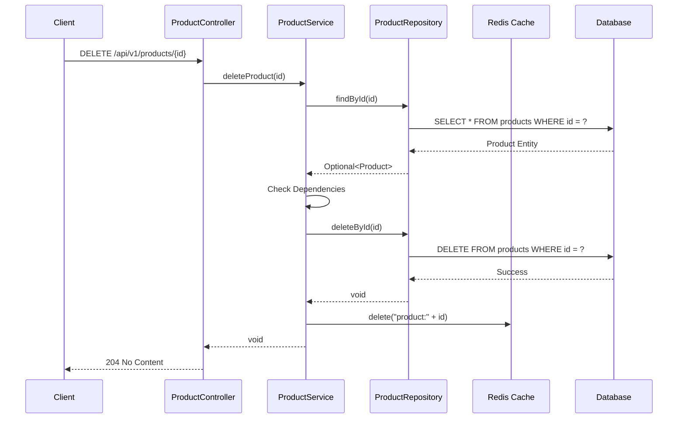
```mermaid
sequenceDiagram
    participant Client
    participant Controller as ProductController
    participant Service as ProductService
    participant Repository as ProductRepository
    participant Cache as Redis Cache
    participant DB as Database
    
    Client->>Controller: DELETE /api/v1/products/{id}
    Controller->>Service: deleteProduct(id)
    Service->>Repository: findById(id)
    Repository->>DB: SELECT * FROM products WHERE id = ?
    DB-->>Repository: Product Entity
    Repository-->>Service: Optional<Product>
    Service->>Service: Check Dependencies
    Service->>Repository: deleteById(id)
    Repository->>DB: DELETE FROM products WHERE id = ?
    DB-->>Repository: Success
    Repository-->>Service: void
    Service->>Cache: delete("product:" + id)
    Service-->>Controller: void
    Controller-->>Client: 204 No Content
```

### 7.5 Search Products Flow

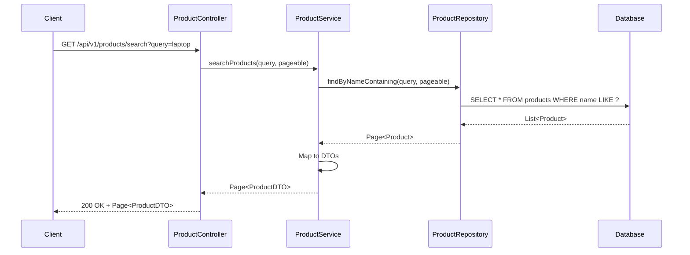
```mermaid
sequenceDiagram
    participant Client
    participant Controller as ProductController
    participant Service as ProductService
    participant Repository as ProductRepository
    participant DB as Database
    
    Client->>Controller: GET /api/v1/products/search?query=laptop
    Controller->>Service: searchProducts(query, pageable)
    Service->>Repository: findByNameContaining(query, pageable)
    Repository->>DB: SELECT * FROM products WHERE name LIKE ?
    DB-->>Repository: List<Product>
    Repository-->>Service: Page<Product>
    Service->>Service: Map to DTOs
    Service-->>Controller: Page<ProductDTO>
    Controller-->>Client: 200 OK + Page<ProductDTO>
```

### 7.6 Update Inventory Flow

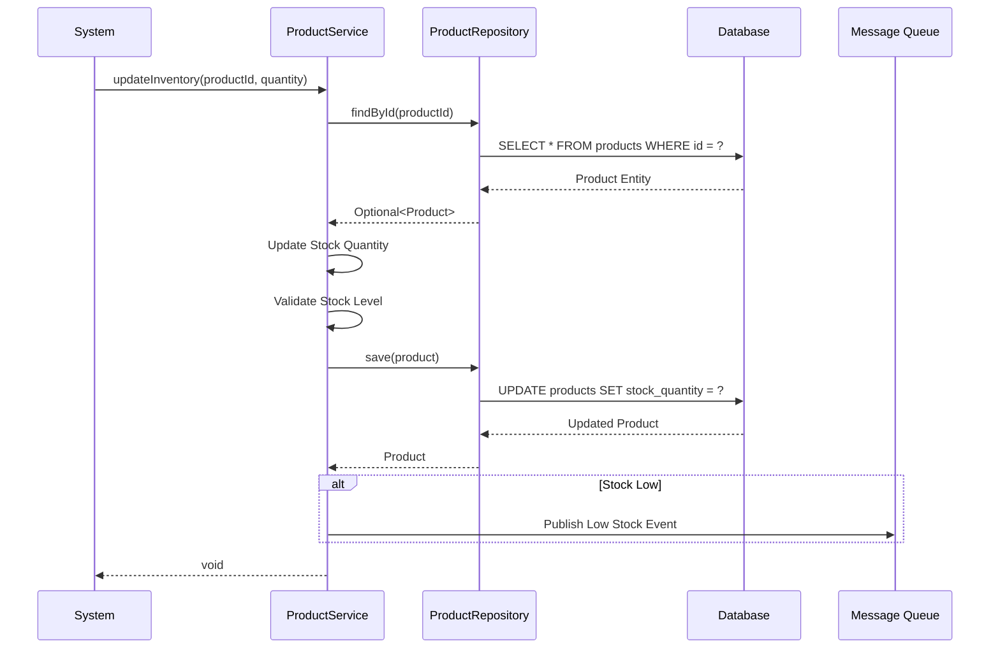
```mermaid
sequenceDiagram
    participant System
    participant Service as ProductService
    participant Repository as ProductRepository
    participant DB as Database
    participant Queue as Message Queue
    
    System->>Service: updateInventory(productId, quantity)
    Service->>Repository: findById(productId)
    Repository->>DB: SELECT * FROM products WHERE id = ?
    DB-->>Repository: Product Entity
    Repository-->>Service: Optional<Product>
    Service->>Service: Update Stock Quantity
    Service->>Service: Validate Stock Level
    Service->>Repository: save(product)
    Repository->>DB: UPDATE products SET stock_quantity = ?
    DB-->>Repository: Updated Product
    Repository-->>Service: Product
    alt Stock Low
        Service->>Queue: Publish Low Stock Event
    end
    Service-->>System: void
```

### 7.7 Get All Products with Pagination Flow

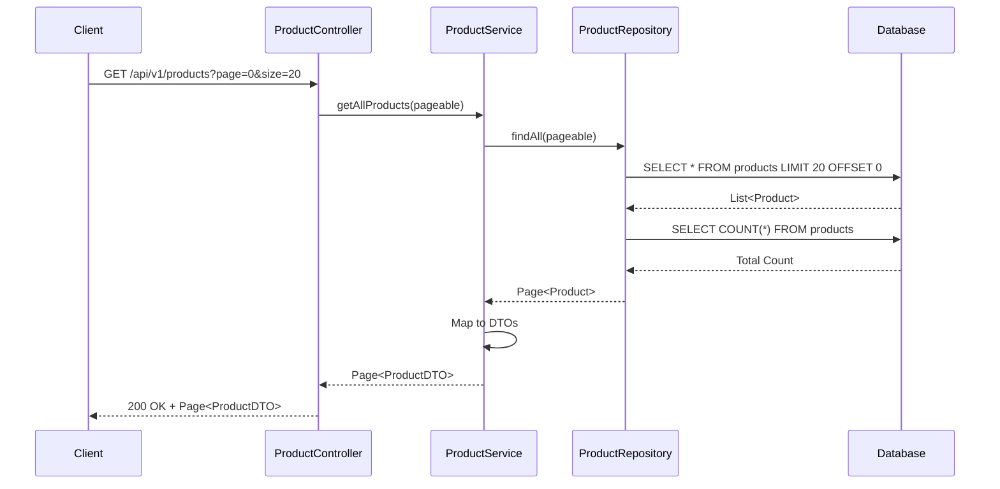
```mermaid
sequenceDiagram
    participant Client
    participant Controller as ProductController
    participant Service as ProductService
    participant Repository as ProductRepository
    participant DB as Database
    
    Client->>Controller: GET /api/v1/products?page=0&size=20
    Controller->>Service: getAllProducts(pageable)
    Service->>Repository: findAll(pageable)
    Repository->>DB: SELECT * FROM products LIMIT 20 OFFSET 0
    DB-->>Repository: List<Product>
    Repository->>DB: SELECT COUNT(*) FROM products
    DB-->>Repository: Total Count
    Repository-->>Service: Page<Product>
    Service->>Service: Map to DTOs
    Service-->>Controller: Page<ProductDTO>
    Controller-->>Client: 200 OK + Page<ProductDTO>
```

### 7.8 Add Item to Cart Flow

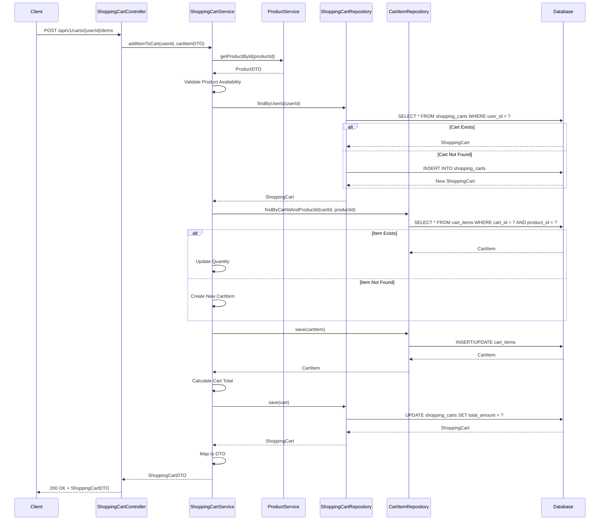
```mermaid
sequenceDiagram
    participant Client
    participant Controller as ShoppingCartController
    participant CartService as ShoppingCartService
    participant ProductService as ProductService
    participant CartRepo as ShoppingCartRepository
    participant ItemRepo as CartItemRepository
    participant DB as Database
    
    Client->>Controller: POST /api/v1/carts/{userId}/items
    Controller->>CartService: addItemToCart(userId, cartItemDTO)
    CartService->>ProductService: getProductById(productId)
    ProductService-->>CartService: ProductDTO
    CartService->>CartService: Validate Product Availability
    CartService->>CartRepo: findByUserId(userId)
    CartRepo->>DB: SELECT * FROM shopping_carts WHERE user_id = ?
    alt Cart Exists
        DB-->>CartRepo: ShoppingCart
    else Cart Not Found
        CartRepo->>DB: INSERT INTO shopping_carts
        DB-->>CartRepo: New ShoppingCart
    end
    CartRepo-->>CartService: ShoppingCart
    CartService->>ItemRepo: findByCartIdAndProductId(cartId, productId)
    ItemRepo->>DB: SELECT * FROM cart_items WHERE cart_id = ? AND product_id = ?
    alt Item Exists
        DB-->>ItemRepo: CartItem
        CartService->>CartService: Update Quantity
    else Item Not Found
        CartService->>CartService: Create New CartItem
    end
    CartService->>ItemRepo: save(cartItem)
    ItemRepo->>DB: INSERT/UPDATE cart_items
    DB-->>ItemRepo: CartItem
    ItemRepo-->>CartService: CartItem
    CartService->>CartService: Calculate Cart Total
    CartService->>CartRepo: save(cart)
    CartRepo->>DB: UPDATE shopping_carts SET total_amount = ?
    DB-->>CartRepo: ShoppingCart
    CartRepo-->>CartService: ShoppingCart
    CartService->>CartService: Map to DTO
    CartService-->>Controller: ShoppingCartDTO
    Controller-->>Client: 200 OK + ShoppingCartDTO
```

### 7.9 Update Cart Item Quantity Flow

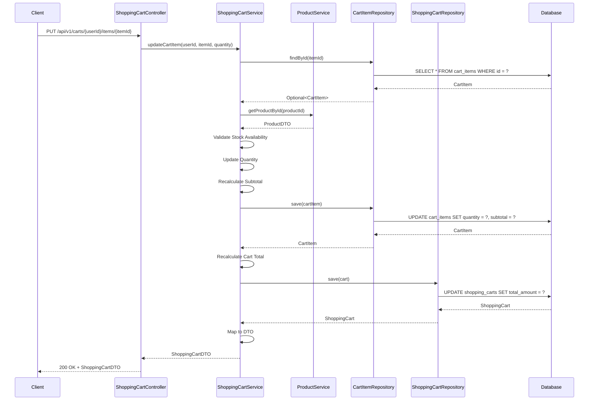
```mermaid
sequenceDiagram
    participant Client
    participant Controller as ShoppingCartController
    participant CartService as ShoppingCartService
    participant ProductService as ProductService
    participant ItemRepo as CartItemRepository
    participant CartRepo as ShoppingCartRepository
    participant DB as Database
    
    Client->>Controller: PUT /api/v1/carts/{userId}/items/{itemId}
    Controller->>CartService: updateCartItem(userId, itemId, quantity)
    CartService->>ItemRepo: findById(itemId)
    ItemRepo->>DB: SELECT * FROM cart_items WHERE id = ?
    DB-->>ItemRepo: CartItem
    ItemRepo-->>CartService: Optional<CartItem>
    CartService->>ProductService: getProductById(productId)
    ProductService-->>CartService: ProductDTO
    CartService->>CartService: Validate Stock Availability
    CartService->>CartService: Update Quantity
    CartService->>CartService: Recalculate Subtotal
    CartService->>ItemRepo: save(cartItem)
    ItemRepo->>DB: UPDATE cart_items SET quantity = ?, subtotal = ?
    DB-->>ItemRepo: CartItem
    ItemRepo-->>CartService: CartItem
    CartService->>CartService: Recalculate Cart Total
    CartService->>CartRepo: save(cart)
    CartRepo->>DB: UPDATE shopping_carts SET total_amount = ?
    DB-->>CartRepo: ShoppingCart
    CartRepo-->>CartService: ShoppingCart
    CartService->>CartService: Map to DTO
    CartService-->>Controller: ShoppingCartDTO
    Controller-->>Client: 200 OK + ShoppingCartDTO
```

### 7.10 Remove Item from Cart Flow

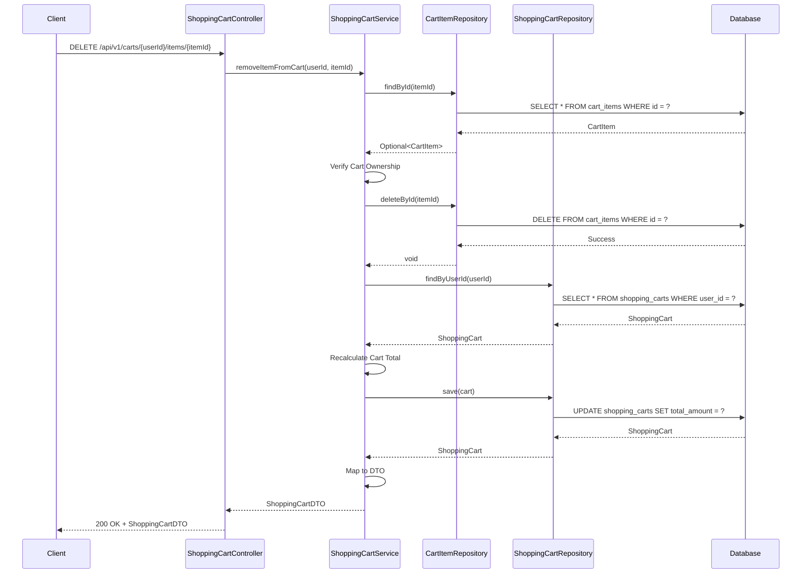
```mermaid
sequenceDiagram
    participant Client
    participant Controller as ShoppingCartController
    participant CartService as ShoppingCartService
    participant ItemRepo as CartItemRepository
    participant CartRepo as ShoppingCartRepository
    participant DB as Database
    
    Client->>Controller: DELETE /api/v1/carts/{userId}/items/{itemId}
    Controller->>CartService: removeItemFromCart(userId, itemId)
    CartService->>ItemRepo: findById(itemId)
    ItemRepo->>DB: SELECT * FROM cart_items WHERE id = ?
    DB-->>ItemRepo: CartItem
    ItemRepo-->>CartService: Optional<CartItem>
    CartService->>CartService: Verify Cart Ownership
    CartService->>ItemRepo: deleteById(itemId)
    ItemRepo->>DB: DELETE FROM cart_items WHERE id = ?
    DB-->>ItemRepo: Success
    ItemRepo-->>CartService: void
    CartService->>CartRepo: findByUserId(userId)
    CartRepo->>DB: SELECT * FROM shopping_carts WHERE user_id = ?
    DB-->>CartRepo: ShoppingCart
    CartRepo-->>CartService: ShoppingCart
    CartService->>CartService: Recalculate Cart Total
    CartService->>CartRepo: save(cart)
    CartRepo->>DB: UPDATE shopping_carts SET total_amount = ?
    DB-->>CartRepo: ShoppingCart
    CartRepo-->>CartService: ShoppingCart
    CartService->>CartService: Map to DTO
    CartService-->>Controller: ShoppingCartDTO
    Controller-->>Client: 200 OK + ShoppingCartDTO
```

### 7.11 Clear Cart Flow

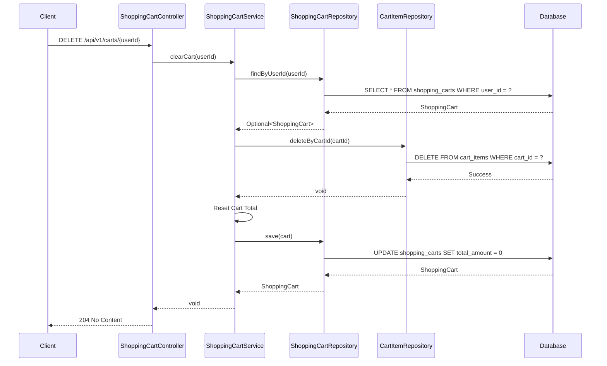
```mermaid
sequenceDiagram
    participant Client
    participant Controller as ShoppingCartController
    participant CartService as ShoppingCartService
    participant CartRepo as ShoppingCartRepository
    participant ItemRepo as CartItemRepository
    participant DB as Database
    
    Client->>Controller: DELETE /api/v1/carts/{userId}
    Controller->>CartService: clearCart(userId)
    CartService->>CartRepo: findByUserId(userId)
    CartRepo->>DB: SELECT * FROM shopping_carts WHERE user_id = ?
    DB-->>CartRepo: ShoppingCart
    CartRepo-->>CartService: Optional<ShoppingCart>
    CartService->>ItemRepo: deleteByCartId(cartId)
    ItemRepo->>DB: DELETE FROM cart_items WHERE cart_id = ?
    DB-->>ItemRepo: Success
    ItemRepo-->>CartService: void
    CartService->>CartService: Reset Cart Total
    CartService->>CartRepo: save(cart)
    CartRepo->>DB: UPDATE shopping_carts SET total_amount = 0
    DB-->>CartRepo: ShoppingCart
    CartRepo-->>CartService: ShoppingCart
    CartService-->>Controller: void
    Controller-->>Client: 204 No Content
```

---

## 8. Data Flow Diagrams

### 8.1 Product Creation Data Flow

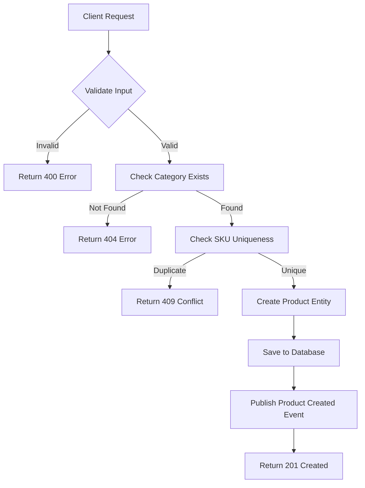
```mermaid
flowchart TD
    A[Client Request] --> B{Validate Input}
    B -->|Invalid| C[Return 400 Error]
    B -->|Valid| D[Check Category Exists]
    D -->|Not Found| E[Return 404 Error]
    D -->|Found| F[Check SKU Uniqueness]
    F -->|Duplicate| G[Return 409 Conflict]
    F -->|Unique| H[Create Product Entity]
    H --> I[Save to Database]
    I --> J[Publish Product Created Event]
    J --> K[Return 201 Created]
```

### 8.2 Shopping Cart Item Addition Data Flow

```mermaid
flowchart TD
    A[Add Item Request] --> B{Validate Product}
    B -->|Invalid| C[Return 404 Error]
    B -->|Valid| D{Check Stock}
    D -->|Out of Stock| E[Return 400 Error]
    D -->|Available| F{Cart Exists?}
    F -->|No| G[Create New Cart]
    F -->|Yes| H[Load Existing Cart]
    G --> I{Item in Cart?}
    H --> I
    I -->|Yes| J[Update Quantity]
    I -->|No| K[Add New Item]
    J --> L[Recalculate Subtotal]
    K --> L
    L --> M[Update Cart Total]
    M --> N[Save to Database]
    N --> O[Return Updated Cart]
```

### 8.3 End-to-End Shopping Flow

```mermaid
flowchart TD
    A[User Browses Products] --> B[Search/Filter Products]
    B --> C[View Product Details]
    C --> D{Add to Cart?}
    D -->|No| B
    D -->|Yes| E[Add Item to Cart]
    E --> F{Continue Shopping?}
    F -->|Yes| B
    F -->|No| G[View Cart]
    G --> H{Modify Cart?}
    H -->|Update Quantity| I[Update Cart Item]
    H -->|Remove Item| J[Remove from Cart]
    H -->|No Changes| K[Proceed to Checkout]
    I --> G
    J --> G
    K --> L[Create Order]
    L --> M[Clear Cart]
    M --> N[Order Confirmation]
```

---

## 9. Design Patterns

### 9.1 Layered Architecture Pattern

**Implementation:**
- **Presentation Layer**: Controllers, DTOs, Request/Response handlers
- **Business Logic Layer**: Services, Domain models, Business rules
- **Data Access Layer**: Repositories, Entities, Database operations
- **Infrastructure Layer**: Configuration, Security, Cross-cutting concerns

**Benefits:**
- Clear separation of concerns
- Easy to test and maintain
- Flexible to change implementation

### 9.2 Repository Pattern

**Implementation:**
```java
public interface ProductRepository extends JpaRepository<Product, Long> {
    Optional<Product> findById(Long id);
    Page<Product> findAll(Pageable pageable);
    List<Product> findByCategoryId(Long categoryId);
}
```

**Benefits:**
- Abstracts data access logic
- Centralized data access code
- Easy to mock for testing

### 9.3 Service Layer Pattern

**Implementation:**
```java
@Service
public class ProductService {
    private final ProductRepository productRepository;
    
    public ProductDTO createProduct(ProductDTO dto) {
        // Business logic here
    }
}
```

**Benefits:**
- Encapsulates business logic
- Reusable across controllers
- Transaction management

### 9.4 DTO Pattern

**Implementation:**
```java
public class ProductDTO {
    private Long id;
    private String name;
    private BigDecimal price;
    // Getters and setters
}
```

**Benefits:**
- Decouples API from domain model
- Controls data exposure
- Validation at API boundary

### 9.5 Aggregate Pattern

**Implementation:**
The `ShoppingCart` entity acts as an aggregate root that manages the lifecycle and consistency of `CartItem` entities. All operations on cart items must go through the `ShoppingCart` aggregate.

```java
@Entity
public class ShoppingCart {
    @OneToMany(mappedBy = "cart", cascade = CascadeType.ALL, orphanRemoval = true)
    private List<CartItem> items = new ArrayList<>();
    
    public void addItem(CartItem item) {
        items.add(item);
        item.setCart(this);
        recalculateTotal();
    }
    
    public void removeItem(Long itemId) {
        items.removeIf(item -> item.getId().equals(itemId));
        recalculateTotal();
    }
    
    private void recalculateTotal() {
        this.totalAmount = items.stream()
            .map(CartItem::getSubtotal)
            .reduce(BigDecimal.ZERO, BigDecimal::add);
    }
}
```

**Benefits:**
- Ensures consistency within aggregate boundaries
- Encapsulates business rules
- Simplifies transaction management
- Maintains invariants

### 9.6 Factory Pattern (for Entity Creation)

**Implementation:**
```java
public class CartItemFactory {
    public static CartItem createCartItem(Product product, int quantity) {
        CartItem item = new CartItem();
        item.setProductId(product.getId());
        item.setProductName(product.getName());
        item.setPrice(product.getPrice());
        item.setQuantity(quantity);
        item.calculateSubtotal();
        return item;
    }
}
```

---

## 10. Error Handling

### 10.1 Exception Hierarchy

```mermaid
classDiagram
    class RuntimeException
    class BusinessException
    class ResourceNotFoundException
    class InvalidDataException
    class InsufficientStockException
    class DuplicateResourceException
    
    RuntimeException <|-- BusinessException
    BusinessException <|-- ResourceNotFoundException
    BusinessException <|-- InvalidDataException
    BusinessException <|-- InsufficientStockException
    BusinessException <|-- DuplicateResourceException
```

### 10.2 Global Exception Handler

```java
@RestControllerAdvice
public class GlobalExceptionHandler {
    
    @ExceptionHandler(ResourceNotFoundException.class)
    public ResponseEntity<ErrorResponse> handleResourceNotFound(ResourceNotFoundException ex) {
        ErrorResponse error = new ErrorResponse(
            HttpStatus.NOT_FOUND.value(),
            ex.getMessage(),
            LocalDateTime.now()
        );
        return new ResponseEntity<>(error, HttpStatus.NOT_FOUND);
    }
    
    @ExceptionHandler(InvalidDataException.class)
    public ResponseEntity<ErrorResponse> handleInvalidData(InvalidDataException ex) {
        ErrorResponse error = new ErrorResponse(
            HttpStatus.BAD_REQUEST.value(),
            ex.getMessage(),
            LocalDateTime.now()
        );
        return new ResponseEntity<>(error, HttpStatus.BAD_REQUEST);
    }
    
    @ExceptionHandler(InsufficientStockException.class)
    public ResponseEntity<ErrorResponse> handleInsufficientStock(InsufficientStockException ex) {
        ErrorResponse error = new ErrorResponse(
            HttpStatus.BAD_REQUEST.value(),
            ex.getMessage(),
            LocalDateTime.now()
        );
        return new ResponseEntity<>(error, HttpStatus.BAD_REQUEST);
    }
    
    @ExceptionHandler(Exception.class)
    public ResponseEntity<ErrorResponse> handleGenericException(Exception ex) {
        ErrorResponse error = new ErrorResponse(
            HttpStatus.INTERNAL_SERVER_ERROR.value(),
            "An unexpected error occurred",
            LocalDateTime.now()
        );
        return new ResponseEntity<>(error, HttpStatus.INTERNAL_SERVER_ERROR);
    }
}
```

### 10.3 Error Response Format

```java
public class ErrorResponse {
    private int status;
    private String message;
    private LocalDateTime timestamp;
    private List<String> errors;
    
    // Constructors, getters, setters
}
```

### 10.4 Validation Error Handling

```java
@ExceptionHandler(MethodArgumentNotValidException.class)
public ResponseEntity<ErrorResponse> handleValidationErrors(MethodArgumentNotValidException ex) {
    List<String> errors = ex.getBindingResult()
        .getFieldErrors()
        .stream()
        .map(error -> error.getField() + ": " + error.getDefaultMessage())
        .collect(Collectors.toList());
    
    ErrorResponse errorResponse = new ErrorResponse(
        HttpStatus.BAD_REQUEST.value(),
        "Validation failed",
        LocalDateTime.now(),
        errors
    );
    
    return new ResponseEntity<>(errorResponse, HttpStatus.BAD_REQUEST);
}
```

---

## 11. Security Considerations

### 11.1 Authentication & Authorization

**Implementation:**
- JWT-based authentication
- Role-based access control (RBAC)
- Spring Security integration

```java
@Configuration
@EnableWebSecurity
public class SecurityConfig {
    
    @Bean
    public SecurityFilterChain filterChain(HttpSecurity http) throws Exception {
        http
            .csrf().disable()
            .authorizeHttpRequests()
                .requestMatchers("/api/v1/products/**").hasAnyRole("USER", "ADMIN")
                .requestMatchers("/api/v1/carts/**").hasRole("USER")
                .anyRequest().authenticated()
            .and()
            .sessionManagement()
                .sessionCreationPolicy(SessionCreationPolicy.STATELESS);
        
        return http.build();
    }
}
```

### 11.2 Input Validation

**Implementation:**
```java
public class ProductDTO {
    @NotBlank(message = "Product name is required")
    @Size(min = 3, max = 255, message = "Name must be between 3 and 255 characters")
    private String name;
    
    @NotNull(message = "Price is required")
    @DecimalMin(value = "0.0", inclusive = false, message = "Price must be greater than 0")
    private BigDecimal price;
    
    @NotNull(message = "Stock quantity is required")
    @Min(value = 0, message = "Stock quantity cannot be negative")
    private Integer stockQuantity;
}
```

### 11.3 SQL Injection Prevention

- Use parameterized queries (JPA/Hibernate)
- Avoid dynamic SQL construction
- Input sanitization

### 11.4 Data Encryption

- Encrypt sensitive data at rest
- Use HTTPS for data in transit
- Secure password storage with BCrypt

### 11.5 Rate Limiting

```java
@Configuration
public class RateLimitConfig {
    
    @Bean
    public RateLimiter rateLimiter() {
        return RateLimiter.create(100.0); // 100 requests per second
    }
}
```

---

## 12. Performance & Scalability

### 12.1 Caching Strategy

**Implementation:**
```java
@Service
public class ProductService {
    
    @Cacheable(value = "products", key = "#id")
    public ProductDTO getProductById(Long id) {
        // Database query
    }
    
    @CacheEvict(value = "products", key = "#id")
    public void updateProduct(Long id, ProductDTO dto) {
        // Update logic
    }
}
```

**Cache Configuration:**
- Redis for distributed caching
- TTL: 1 hour for product data
- Cache invalidation on updates

### 12.2 Database Optimization

**Indexing Strategy:**
```sql
CREATE INDEX idx_products_category ON products(category_id);
CREATE INDEX idx_products_name ON products(name);
CREATE INDEX idx_products_price ON products(price);
CREATE INDEX idx_cart_items_cart ON cart_items(cart_id);
CREATE INDEX idx_shopping_carts_user ON shopping_carts(user_id);
```

**Query Optimization:**
- Use pagination for large result sets
- Implement lazy loading for relationships
- Use database connection pooling (HikariCP)

### 12.3 Pagination

```java
public Page<ProductDTO> getAllProducts(Pageable pageable) {
    Page<Product> products = productRepository.findAll(pageable);
    return products.map(productMapper::toDTO);
}
```

### 12.4 Asynchronous Processing

```java
@Async
public CompletableFuture<Void> processLowStockAlert(Long productId) {
    // Send notification asynchronously
    return CompletableFuture.completedFuture(null);
}
```

### 12.5 Horizontal Scaling

- Stateless application design
- Load balancer distribution
- Database read replicas
- Shared cache (Redis cluster)

### 12.6 Performance Metrics

**Target Metrics:**
- API Response Time: < 200ms (95th percentile)
- Database Query Time: < 50ms
- Cache Hit Ratio: > 80%
- Throughput: 1000 requests/second

---

## 13. Logging & Monitoring

### 13.1 Logging Strategy

**Implementation:**
```java
@Slf4j
@Service
public class ProductService {
    
    public ProductDTO createProduct(ProductDTO dto) {
        log.info("Creating product: {}", dto.getName());
        try {
            Product product = productMapper.toEntity(dto);
            product = productRepository.save(product);
            log.info("Product created successfully with id: {}", product.getId());
            return productMapper.toDTO(product);
        } catch (Exception e) {
            log.error("Error creating product: {}", dto.getName(), e);
            throw e;
        }
    }
}
```

**Log Levels:**
- **ERROR**: System errors, exceptions
- **WARN**: Business rule violations, deprecated API usage
- **INFO**: Important business events (create, update, delete)
- **DEBUG**: Detailed flow information
- **TRACE**: Very detailed debugging information

### 13.2 Structured Logging

```java
log.info("Product operation", 
    kv("operation", "create"),
    kv("productId", product.getId()),
    kv("userId", userId),
    kv("duration", duration)
);
```

### 13.3 Monitoring Metrics

**Application Metrics:**
- Request count and rate
- Response times (avg, p95, p99)
- Error rates
- Active connections
- JVM metrics (heap, GC)

**Business Metrics:**
- Products created/updated/deleted
- Cart operations count
- Average cart value
- Conversion rates

### 13.4 Health Checks

```java
@Component
public class DatabaseHealthIndicator implements HealthIndicator {
    
    @Override
    public Health health() {
        try {
            // Check database connectivity
            return Health.up()
                .withDetail("database", "PostgreSQL")
                .withDetail("status", "Connected")
                .build();
        } catch (Exception e) {
            return Health.down()
                .withDetail("error", e.getMessage())
                .build();
        }
    }
}
```

### 13.5 Alerting

**Alert Conditions:**
- Error rate > 5%
- Response time > 1 second
- Database connection pool exhausted
- Low stock alerts
- System resource utilization > 80%

---

## 14. Assumptions & Constraints

### 14.1 Assumptions

1. **User Authentication**: Users are authenticated before accessing cart operations
2. **Product Availability**: Products are available in the catalog before adding to cart
3. **Single Currency**: All prices are in a single currency (USD)
4. **Cart Expiration**: Inactive carts expire after 30 days
5. **Stock Management**: Real-time stock updates are available
6. **Network Reliability**: Reasonable network reliability between services
7. **Database Availability**: PostgreSQL database is highly available
8. **Concurrent Users**: System supports up to 10,000 concurrent users

### 14.2 Constraints

1. **Technology Stack**: Must use Spring Boot 3.2.x and Java 21
2. **Database**: PostgreSQL 15+ is mandatory
3. **API Design**: Must follow RESTful principles
4. **Response Time**: API responses must be under 200ms (95th percentile)
5. **Data Retention**: Cart data retained for 30 days
6. **Maximum Cart Items**: 100 items per cart
7. **Maximum Quantity**: 999 units per cart item
8. **Price Precision**: Prices stored with 2 decimal places
9. **Backward Compatibility**: API changes must be backward compatible
10. **Security**: All endpoints must be secured with authentication

### 14.3 Business Rules

1. **Product Validation**:
   - Product name must be unique within a category
   - Price must be greater than zero
   - Stock quantity cannot be negative

2. **Cart Validation**:
   - Cannot add out-of-stock products
   - Cannot exceed available stock quantity
   - Cart item quantity must be positive
   - One active cart per user

3. **Inventory Management**:
   - Stock is reserved when added to cart (soft reservation)
   - Stock is decremented on order placement
   - Low stock threshold: 10 units

4. **Data Integrity**:
   - Cannot delete products referenced in active carts
   - Cascade delete cart items when cart is deleted
   - Maintain referential integrity across tables

---

## 15. Change Traceability

### 15.1 Change Summary

**Story**: SCRUM-1140 - Shopping Cart Management

**Change Date**: 2024

**Change Type**: Feature Addition

**Impact Level**: High

### 15.2 Changes Applied

#### 15.2.1 New Modules Added

| Module | Description | Components |
|--------|-------------|------------|
| Shopping Cart Management | Manages user shopping carts and cart items | ShoppingCartController, ShoppingCartService, ShoppingCartRepository, CartItemRepository, ShoppingCart, CartItem |

#### 15.2.2 New Classes Added

| Class Name | Type | Purpose | Package |
|------------|------|---------|----------|
| ShoppingCartController | Controller | REST API endpoints for cart operations | com.ecommerce.controller |
| ShoppingCartService | Service | Business logic for cart management | com.ecommerce.service |
| ShoppingCartRepository | Repository | Data access for shopping carts | com.ecommerce.repository |
| CartItemRepository | Repository | Data access for cart items | com.ecommerce.repository |
| ShoppingCart | Entity | Domain model for shopping cart | com.ecommerce.entity |
| CartItem | Entity | Domain model for cart items | com.ecommerce.entity |

#### 15.2.3 New Database Tables

| Table Name | Purpose | Key Relationships |
|------------|---------|-------------------|
| shopping_carts | Store user shopping carts | References users table |
| cart_items | Store items in shopping carts | References shopping_carts and products tables |

#### 15.2.4 New API Endpoints

| Endpoint | Method | Purpose |
|----------|--------|---------|
| /api/v1/carts/{userId} | GET | Retrieve user's shopping cart |
| /api/v1/carts/{userId}/items | POST | Add item to cart |
| /api/v1/carts/{userId}/items/{itemId} | PUT | Update cart item quantity |
| /api/v1/carts/{userId}/items/{itemId} | DELETE | Remove item from cart |
| /api/v1/carts/{userId} | DELETE | Clear entire cart |

#### 15.2.5 New Sequence Diagrams

| Diagram | Section | Purpose |
|---------|---------|----------|
| Add Item to Cart Flow | 7.8 | Shows the complete flow of adding an item to cart |
| Update Cart Item Quantity Flow | 7.9 | Shows the flow of updating item quantity |
| Remove Item from Cart Flow | 7.10 | Shows the flow of removing an item |
| Clear Cart Flow | 7.11 | Shows the flow of clearing entire cart |

#### 15.2.6 Design Pattern Updates

| Pattern | Change | Justification |
|---------|--------|---------------|
| Aggregate Pattern | Added | ShoppingCart acts as aggregate root managing CartItem lifecycle and consistency |

### 15.3 Acceptance Criteria Mapping

#### AC1: View Shopping Cart
**Implementation:**
- Endpoint: GET /api/v1/carts/{userId}
- Service Method: ShoppingCartService.getCartByUserId()
- Returns: Complete cart with all items, quantities, and total

**Components Impacted:**
- ShoppingCartController
- ShoppingCartService
- ShoppingCartRepository
- Database: shopping_carts, cart_items tables

#### AC2: Add Items to Cart
**Implementation:**
- Endpoint: POST /api/v1/carts/{userId}/items
- Service Method: ShoppingCartService.addItemToCart()
- Validation: Product availability, stock check
- Business Logic: Create cart if not exists, update quantity if item exists

**Components Impacted:**
- ShoppingCartController
- ShoppingCartService
- ProductService (integration)
- ShoppingCartRepository
- CartItemRepository
- Database: shopping_carts, cart_items, products tables

#### AC3: Update Item Quantities
**Implementation:**
- Endpoint: PUT /api/v1/carts/{userId}/items/{itemId}
- Service Method: ShoppingCartService.updateCartItem()
- Validation: Stock availability check
- Business Logic: Recalculate subtotal and cart total

**Components Impacted:**
- ShoppingCartController
- ShoppingCartService
- ProductService (integration)
- CartItemRepository
- Database: cart_items, shopping_carts tables

#### AC4: Remove Items from Cart
**Implementation:**
- Endpoint: DELETE /api/v1/carts/{userId}/items/{itemId}
- Service Method: ShoppingCartService.removeItemFromCart()
- Business Logic: Delete item and recalculate cart total

**Components Impacted:**
- ShoppingCartController
- ShoppingCartService
- CartItemRepository
- Database: cart_items, shopping_carts tables

#### AC5: Calculate Cart Total
**Implementation:**
- Service Method: ShoppingCartService.calculateCartTotal()
- Calculation: Sum of all item subtotals
- Trigger: Automatically calculated on any cart modification

**Components Impacted:**
- ShoppingCartService
- ShoppingCart entity (domain logic)
- Database: shopping_carts table

### 15.4 Integration Points

| Integration | Source | Target | Purpose |
|-------------|--------|--------|----------|
| Product Validation | ShoppingCartService | ProductService | Validate product exists and check availability |
| Stock Check | ShoppingCartService | ProductService | Verify sufficient stock before adding to cart |
| User Validation | ShoppingCartController | Authentication Service | Verify user identity and authorization |

### 15.5 Backward Compatibility

**Existing Functionality Preserved:**
- All Product Management APIs remain unchanged
- Product entity structure unchanged
- Category management unchanged
- No breaking changes to existing endpoints

**New Dependencies:**
- Shopping Cart module depends on Product module
- No reverse dependencies created

### 15.6 Testing Impact

**New Test Cases Required:**
1. Unit tests for ShoppingCartService (8 test cases)
2. Unit tests for ShoppingCartController (5 test cases)
3. Integration tests for cart operations (10 test cases)
4. Repository tests for ShoppingCartRepository and CartItemRepository (6 test cases)
5. End-to-end tests for complete shopping flow (5 test cases)

**Total New Tests**: 34 test cases

### 15.7 Documentation Updates

**Updated Sections:**
1. System Architecture (Section 2) - Added cart components
2. Module Design (Section 3) - Added Shopping Cart Management module
3. Class Design (Section 4) - Added 6 new classes
4. Database Design (Section 5) - Added 2 new tables
5. API Design (Section 6) - Added 5 new endpoints
6. Sequence Diagrams (Section 7) - Added 4 new diagrams
7. Design Patterns (Section 9) - Added Aggregate Pattern

### 15.8 Deployment Considerations

**Database Migration:**
```sql
-- Migration script for shopping cart tables
CREATE TABLE shopping_carts (...);  -- As defined in section 5.2.3
CREATE TABLE cart_items (...);      -- As defined in section 5.2.4
```

**Rollback Plan:**
- Drop cart_items table
- Drop shopping_carts table
- Remove cart-related code

**Zero-Downtime Deployment:**
- Deploy new code with feature flag disabled
- Run database migrations
- Enable feature flag
- Monitor for issues

### 15.9 Performance Impact

**Expected Impact:**
- Additional database tables: 2
- Additional API endpoints: 5
- Additional database queries per cart operation: 2-4
- Cache strategy: Cart data cached for 15 minutes

**Mitigation:**
- Indexed foreign keys on cart_items table
- Caching of cart data
- Optimized queries with proper joins

### 15.10 Security Impact

**New Security Considerations:**
- Cart operations require user authentication
- Users can only access their own carts
- Cart ownership validation on all operations
- Rate limiting on cart operations to prevent abuse

**Security Controls:**
- JWT token validation
- User ID verification
- Input validation on all cart operations
- SQL injection prevention through parameterized queries

---

## Appendix A: Technology Versions

- **Spring Boot**: 3.2.x
- **Java**: 21
- **PostgreSQL**: 15+
- **Spring Data JPA**: 3.2.x
- **Hibernate**: 6.4.x
- **Maven**: 3.9.x
- **Redis**: 7.x (for caching)
- **Lombok**: 1.18.x

## Appendix B: API Response Codes

| Code | Description | Usage |
|------|-------------|-------|
| 200 | OK | Successful GET, PUT operations |
| 201 | Created | Successful POST operations |
| 204 | No Content | Successful DELETE operations |
| 400 | Bad Request | Invalid input data |
| 401 | Unauthorized | Missing or invalid authentication |
| 403 | Forbidden | Insufficient permissions |
| 404 | Not Found | Resource not found |
| 409 | Conflict | Duplicate resource |
| 500 | Internal Server Error | Unexpected server error |

## Appendix C: Database Naming Conventions

- **Tables**: snake_case, plural (e.g., shopping_carts, cart_items)
- **Columns**: snake_case (e.g., user_id, created_at)
- **Primary Keys**: id
- **Foreign Keys**: {table_name}_id (e.g., cart_id, product_id)
- **Indexes**: idx_{table}_{column} (e.g., idx_products_category)

## Appendix D: Code Style Guidelines

- **Java**: Follow Google Java Style Guide
- **Package Structure**: com.ecommerce.{layer}.{module}
- **Class Naming**: PascalCase
- **Method Naming**: camelCase
- **Constants**: UPPER_SNAKE_CASE
- **Annotations**: Use Lombok for boilerplate reduction

---

**Document End**

**Approval:**
- Technical Lead: _________________
- Product Owner: _________________
- Date: _________________

**Version History:**
| Version | Date | Author | Changes |
|---------|------|--------|----------|
| 1.0 | 2024 | Engineering Team | Initial Product Management LLD |
| 2.0 | 2024 | Engineering Team | Added Shopping Cart Management (SCRUM-1140) |