# Low Level Design Document
# E-commerce Product and Shopping Cart Management System

## Document Information
- **Project**: E-commerce Platform
- **Version**: 2.0
- **Last Updated**: 2024
- **Status**: Enhanced with Shopping Cart Management (Story SCRUM-1140)

---

## Table of Contents

1. [Executive Summary](#1-executive-summary)
2. [Project Overview](#2-project-overview)
3. [System Architecture](#3-system-architecture)
   - 3.1 [High-Level Architecture](#31-high-level-architecture)
   - 3.2 [Component Architecture](#32-component-architecture)
   - 3.3 [Deployment Architecture](#33-deployment-architecture)
4. [Class Diagrams](#4-class-diagrams)
   - 4.1 [Product Management Classes](#41-product-management-classes)
   - 4.2 [Shopping Cart Management Classes](#42-shopping-cart-management-classes)
   - 4.3 [Integrated Class Diagram](#43-integrated-class-diagram)
5. [Entity Relationship Diagrams](#5-entity-relationship-diagrams)
   - 5.1 [Complete Database Schema](#51-complete-database-schema)
6. [Sequence Diagrams](#6-sequence-diagrams)
   - 6.1 [Product Management Flows](#61-product-management-flows)
   - 6.2 [Shopping Cart Management Flows](#62-shopping-cart-management-flows)
7. [API Specifications](#7-api-specifications)
   - 7.1 [Product Management APIs](#71-product-management-apis)
   - 7.2 [Shopping Cart Management APIs](#72-shopping-cart-management-apis)
8. [Database Design](#8-database-design)
   - 8.1 [Tables and Schemas](#81-tables-and-schemas)
   - 8.2 [Indexes and Constraints](#82-indexes-and-constraints)
   - 8.3 [Data Models](#83-data-models)
9. [Technical Specifications](#9-technical-specifications)
   - 9.1 [Technology Stack](#91-technology-stack)
   - 9.2 [Design Patterns](#92-design-patterns)
   - 9.3 [Error Handling Strategy](#93-error-handling-strategy)
   - 9.4 [Validation Rules](#94-validation-rules)
10. [Engineering Considerations](#10-engineering-considerations)
    - 10.1 [Design Assumptions and Constraints](#101-design-assumptions-and-constraints)
    - 10.2 [Performance Considerations](#102-performance-considerations)
    - 10.3 [Scalability Approach](#103-scalability-approach)
    - 10.4 [Security Considerations](#104-security-considerations)
    - 10.5 [Logging and Monitoring](#105-logging-and-monitoring)
    - 10.6 [Transaction Management](#106-transaction-management)
11. [Change Traceability](#11-change-traceability)
    - 11.1 [What Changed](#111-what-changed)
    - 11.2 [Why Changes Were Applied](#112-why-changes-were-applied)
    - 11.3 [Impacted Components](#113-impacted-components)
    - 11.4 [Acceptance Criteria Mapping](#114-acceptance-criteria-mapping)
12. [Key Features](#12-key-features)
13. [Appendix](#13-appendix)

---

## 1. Executive Summary

This Low Level Design document describes the technical architecture and implementation details for an E-commerce platform built using Spring Boot, Java 21, and PostgreSQL. The system comprises two primary modules:

1. **Product Management Module**: Handles all product-related operations including CRUD operations, search, and filtering capabilities.
2. **Shopping Cart Management Module**: Manages user shopping carts, cart items, and integrates seamlessly with the product catalog.

The system follows a layered architecture pattern with clear separation of concerns, implementing industry-standard design patterns and best practices for maintainability, scalability, and security.

---

## 2. Project Overview

The E-commerce Product and Shopping Cart Management System is a comprehensive backend solution designed to support online retail operations. The system provides:

### Core Modules:

#### ProductManagement Module
- Complete product lifecycle management
- Advanced search and filtering capabilities
- Category-based product organization
- RESTful API endpoints for product operations
- Robust validation and error handling

#### ShoppingCartManagement Module (Story SCRUM-1140)
- User-specific shopping cart management
- Cart item operations (add, update, remove)
- Real-time cart total calculations
- Integration with product catalog
- Persistent cart storage

### System Characteristics:
- **Stateless Design**: Enables horizontal scalability
- **RESTful Architecture**: Standard HTTP methods and status codes
- **Database-Driven**: PostgreSQL for reliable data persistence
- **Layered Architecture**: Clear separation between presentation, business, and data layers
- **Comprehensive Validation**: Input validation at multiple layers
- **Error Handling**: Structured exception handling with meaningful error messages

---

## 3. System Architecture

### 3.1 High-Level Architecture

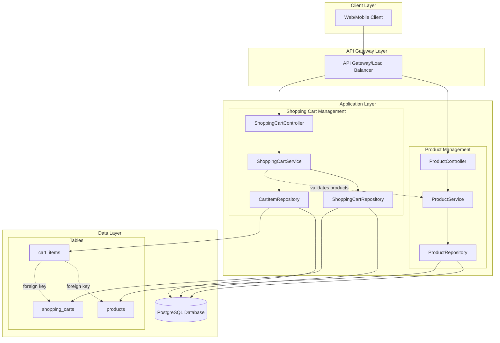

### 3.2 Component Architecture

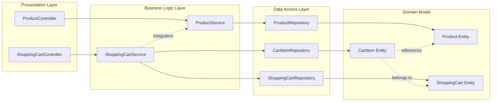

### 3.3 Deployment Architecture

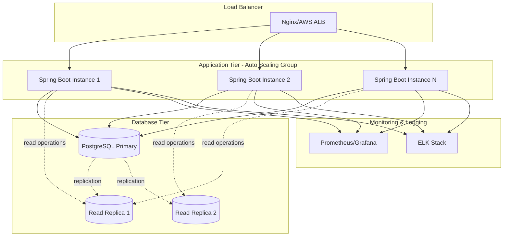

---

## 4. Class Diagrams

### 4.1 Product Management Classes

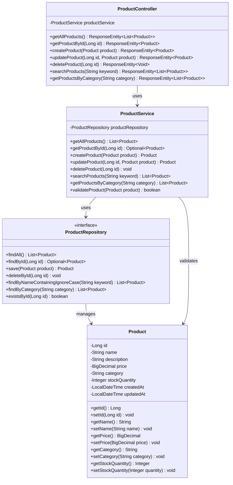

### 4.2 Shopping Cart Management Classes

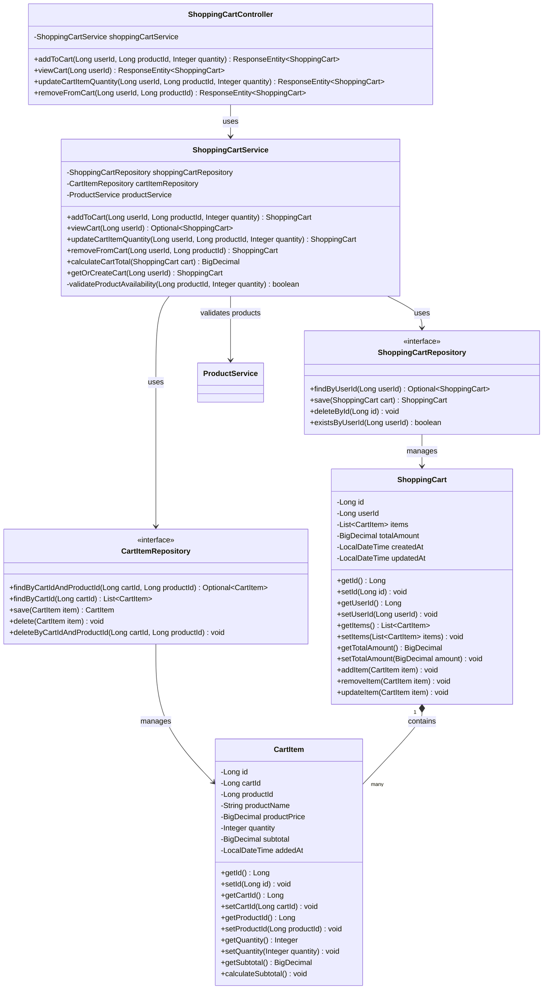

### 4.3 Integrated Class Diagram

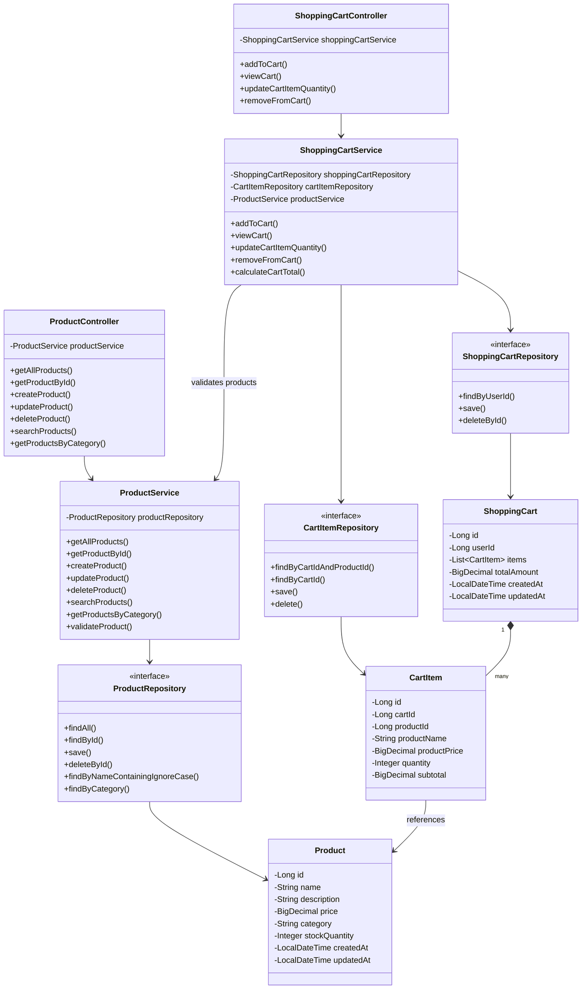

---

## 5. Entity Relationship Diagrams

### 5.1 Complete Database Schema

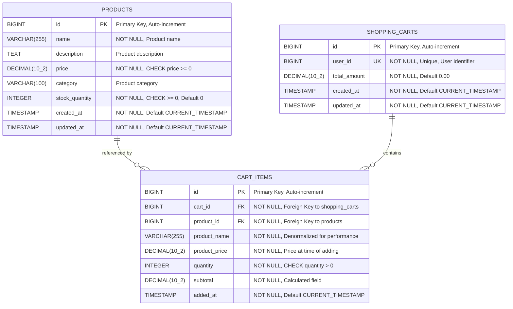

---

## 6. Sequence Diagrams

### 6.1 Product Management Flows

#### 6.1.1 Get All Products

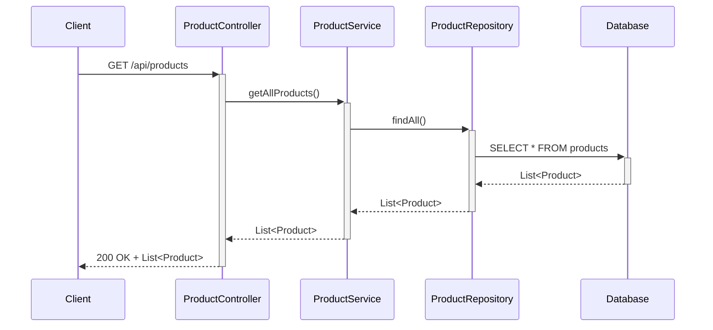

#### 6.1.2 Get Product by ID

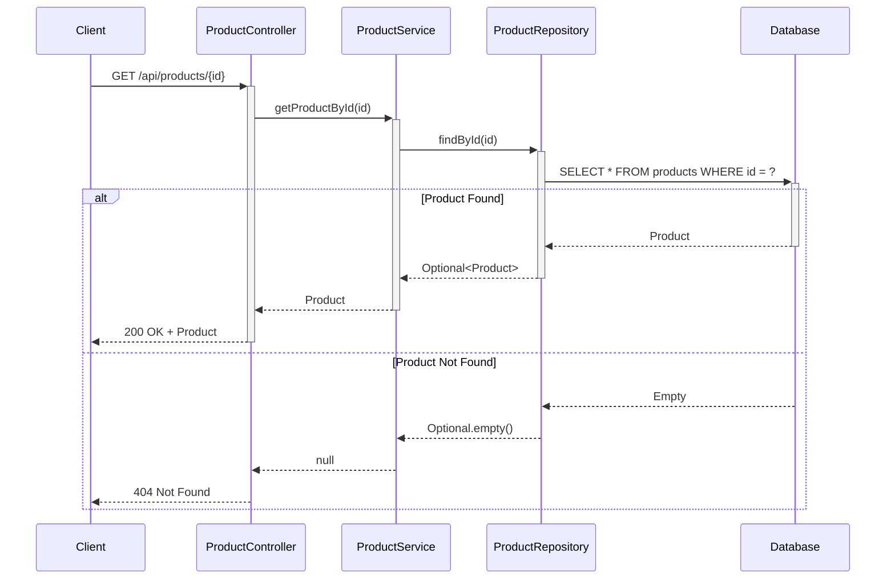

#### 6.1.3 Create Product

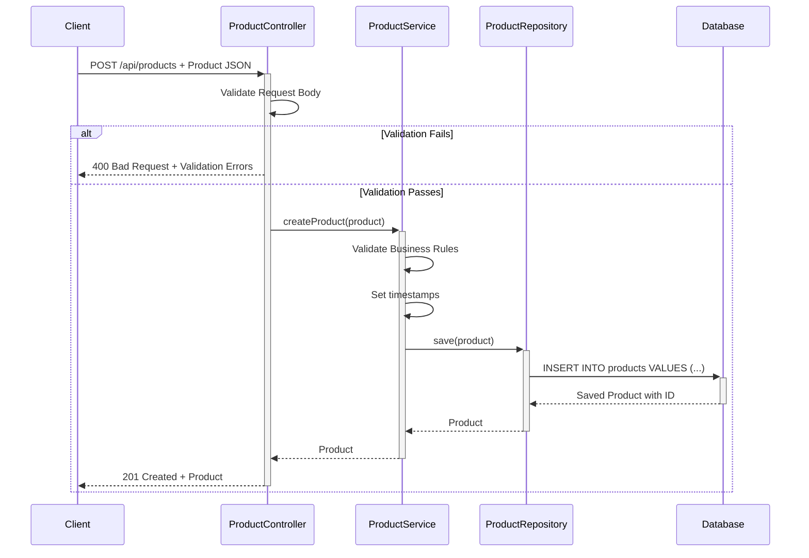

#### 6.1.4 Update Product

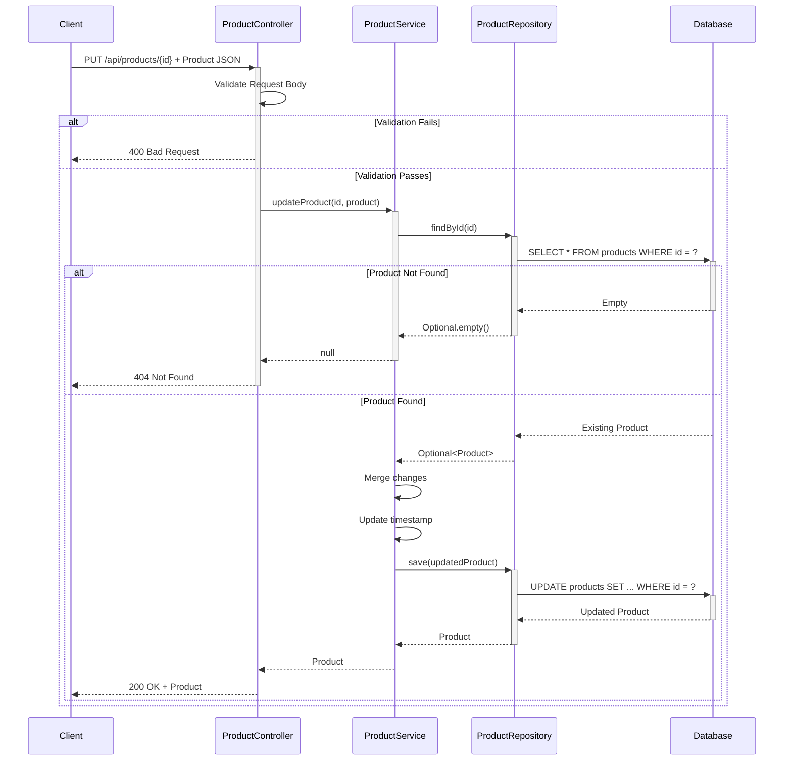

#### 6.1.5 Delete Product

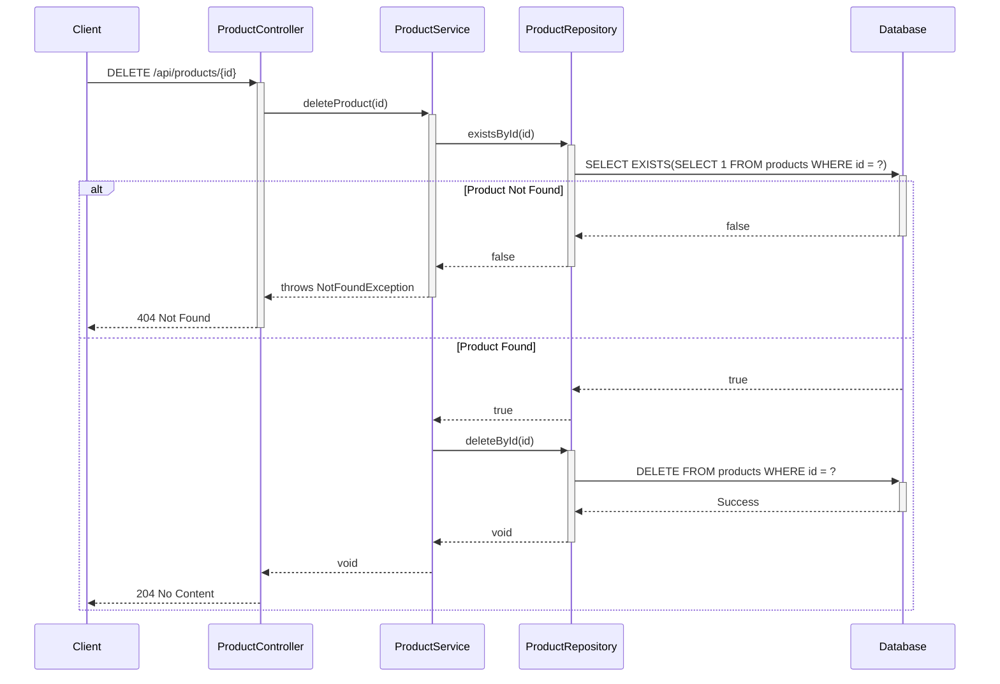

#### 6.1.6 Search Products

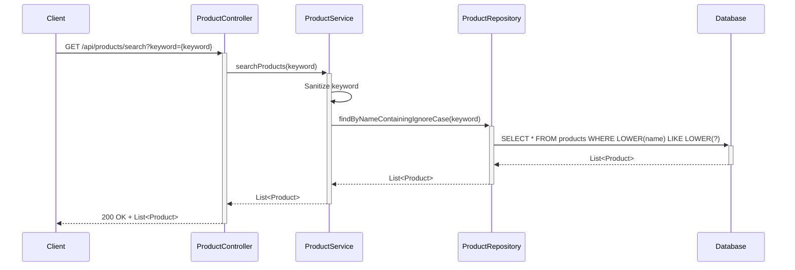

#### 6.1.7 Filter Products by Category


### 6.2 Shopping Cart Management Flows

#### 6.2.1 Add to Cart

```mermaid
sequenceDiagram
    participant Client
    participant ShoppingCartController
    participant ShoppingCartService
    participant ProductService
    participant ShoppingCartRepository
    participant CartItemRepository
    participant Database
    
    Client->>+ShoppingCartController: POST /api/cart/add
    Note over Client,ShoppingCartController: Body: {userId, productId, quantity}
    
    ShoppingCartController->>+ShoppingCartService: addToCart(userId, productId, quantity)
    
    %% Validate Product
    ShoppingCartService->>+ProductService: getProductById(productId)
    ProductService->>Database: SELECT * FROM products WHERE id = ?
    
    alt Product Not Found
        Database-->>ProductService: Empty
        ProductService-->>-ShoppingCartService: null
        ShoppingCartService-->>-ShoppingCartController: throws ProductNotFoundException
        ShoppingCartController-->>-Client: 404 Not Found
    else Product Found
        Database-->>ProductService: Product
        ProductService-->>ShoppingCartService: Product
        
        %% Check Stock
        ShoppingCartService->>ShoppingCartService: Validate stock >= quantity
        
        alt Insufficient Stock
            ShoppingCartService-->>ShoppingCartController: throws InsufficientStockException
            ShoppingCartController-->>Client: 400 Bad Request
        else Stock Available
            %% Get or Create Cart
            ShoppingCartService->>+ShoppingCartRepository: findByUserId(userId)
            ShoppingCartRepository->>Database: SELECT * FROM shopping_carts WHERE user_id = ?
            
            alt Cart Exists
                Database-->>ShoppingCartRepository: ShoppingCart
            else Cart Not Found
                Database-->>ShoppingCartRepository: Empty
                ShoppingCartRepository->>Database: INSERT INTO shopping_carts
                Database-->>ShoppingCartRepository: New ShoppingCart
            end
            
            ShoppingCartRepository-->>-ShoppingCartService: ShoppingCart
            
            %% Check if item already in cart
            ShoppingCartService->>+CartItemRepository: findByCartIdAndProductId(cartId, productId)
            CartItemRepository->>Database: SELECT * FROM cart_items WHERE cart_id = ? AND product_id = ?
            
            alt Item Exists
                Database-->>CartItemRepository: CartItem
                CartItemRepository-->>-ShoppingCartService: CartItem
                ShoppingCartService->>ShoppingCartService: Update quantity
                ShoppingCartService->>+CartItemRepository: save(updatedItem)
                CartItemRepository->>Database: UPDATE cart_items SET quantity = ?, subtotal = ?
            else New Item
                Database-->>CartItemRepository: Empty
                CartItemRepository-->>ShoppingCartService: null
                ShoppingCartService->>ShoppingCartService: Create new CartItem
                ShoppingCartService->>+CartItemRepository: save(newItem)
                CartItemRepository->>Database: INSERT INTO cart_items
            end
            
            Database-->>-CartItemRepository: Saved CartItem
            CartItemRepository-->>ShoppingCartService: CartItem
            
            %% Recalculate total
            ShoppingCartService->>ShoppingCartService: calculateCartTotal(cart)
            ShoppingCartService->>+ShoppingCartRepository: save(cart)
            ShoppingCartRepository->>Database: UPDATE shopping_carts SET total_amount = ?
            Database-->>-ShoppingCartRepository: Updated Cart
            ShoppingCartRepository-->>-ShoppingCartService: ShoppingCart
            
            ShoppingCartService-->>ShoppingCartController: ShoppingCart
            ShoppingCartController-->>Client: 200 OK + ShoppingCart
        end
    end
```

#### 6.2.2 View Cart

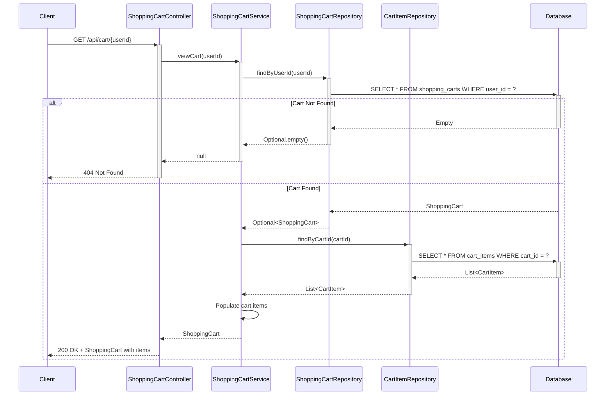

#### 6.2.3 Update Cart Item Quantity

```mermaid
sequenceDiagram
    participant Client
    participant ShoppingCartController
    participant ShoppingCartService
    participant ProductService
    participant ShoppingCartRepository
    participant CartItemRepository
    participant Database
    
    Client->>+ShoppingCartController: PUT /api/cart/update
    Note over Client,ShoppingCartController: Body: {userId, productId, quantity}
    
    ShoppingCartController->>+ShoppingCartService: updateCartItemQuantity(userId, productId, quantity)
    
    %% Validate quantity
    alt Quantity <= 0
        ShoppingCartService-->>-ShoppingCartController: throws InvalidQuantityException
        ShoppingCartController-->>-Client: 400 Bad Request
    else Valid Quantity
        %% Get cart
        ShoppingCartService->>+ShoppingCartRepository: findByUserId(userId)
        ShoppingCartRepository->>+Database: SELECT * FROM shopping_carts WHERE user_id = ?
        
        alt Cart Not Found
            Database-->>-ShoppingCartRepository: Empty
            ShoppingCartRepository-->>-ShoppingCartService: Optional.empty()
            ShoppingCartService-->>ShoppingCartController: throws CartNotFoundException
            ShoppingCartController-->>Client: 404 Not Found
        else Cart Found
            Database-->>ShoppingCartRepository: ShoppingCart
            ShoppingCartRepository-->>-ShoppingCartService: ShoppingCart
            
            %% Find cart item
            ShoppingCartService->>+CartItemRepository: findByCartIdAndProductId(cartId, productId)
            CartItemRepository->>+Database: SELECT * FROM cart_items WHERE cart_id = ? AND product_id = ?
            
            alt Item Not Found
                Database-->>-CartItemRepository: Empty
                CartItemRepository-->>-ShoppingCartService: null
                ShoppingCartService-->>ShoppingCartController: throws ItemNotFoundException
                ShoppingCartController-->>Client: 404 Not Found
            else Item Found
                Database-->>CartItemRepository: CartItem
                CartItemRepository-->>ShoppingCartService: CartItem
                
                %% Validate stock
                ShoppingCartService->>+ProductService: getProductById(productId)
                ProductService->>Database: SELECT * FROM products WHERE id = ?
                Database-->>ProductService: Product
                ProductService-->>-ShoppingCartService: Product
                
                ShoppingCartService->>ShoppingCartService: Validate stock >= quantity
                
                alt Insufficient Stock
                    ShoppingCartService-->>ShoppingCartController: throws InsufficientStockException
                    ShoppingCartController-->>Client: 400 Bad Request
                else Stock Available
                    %% Update item
                    ShoppingCartService->>ShoppingCartService: Update item quantity and subtotal
                    ShoppingCartService->>+CartItemRepository: save(updatedItem)
                    CartItemRepository->>+Database: UPDATE cart_items SET quantity = ?, subtotal = ?
                    Database-->>-CartItemRepository: Updated CartItem
                    CartItemRepository-->>-ShoppingCartService: CartItem
                    
                    %% Recalculate total
                    ShoppingCartService->>ShoppingCartService: calculateCartTotal(cart)
                    ShoppingCartService->>+ShoppingCartRepository: save(cart)
                    ShoppingCartRepository->>+Database: UPDATE shopping_carts SET total_amount = ?
                    Database-->>-ShoppingCartRepository: Updated Cart
                    ShoppingCartRepository-->>-ShoppingCartService: ShoppingCart
                    
                    ShoppingCartService-->>ShoppingCartController: ShoppingCart
                    ShoppingCartController-->>Client: 200 OK + ShoppingCart
                end
            end
        end
    end
```

#### 6.2.4 Remove Item from Cart

```mermaid
sequenceDiagram
    participant Client
    participant ShoppingCartController
    participant ShoppingCartService
    participant ShoppingCartRepository
    participant CartItemRepository
    participant Database
    
    Client->>+ShoppingCartController: DELETE /api/cart/remove
    Note over Client,ShoppingCartController: Body: {userId, productId}
    
    ShoppingCartController->>+ShoppingCartService: removeFromCart(userId, productId)
    
    %% Get cart
    ShoppingCartService->>+ShoppingCartRepository: findByUserId(userId)
    ShoppingCartRepository->>+Database: SELECT * FROM shopping_carts WHERE user_id = ?
    
    alt Cart Not Found
        Database-->>-ShoppingCartRepository: Empty
        ShoppingCartRepository-->>-ShoppingCartService: Optional.empty()
        ShoppingCartService-->>-ShoppingCartController: throws CartNotFoundException
        ShoppingCartController-->>-Client: 404 Not Found
    else Cart Found
        Database-->>ShoppingCartRepository: ShoppingCart
        ShoppingCartRepository-->>-ShoppingCartService: ShoppingCart
        
        %% Find and delete item
        ShoppingCartService->>+CartItemRepository: findByCartIdAndProductId(cartId, productId)
        CartItemRepository->>+Database: SELECT * FROM cart_items WHERE cart_id = ? AND product_id = ?
        
        alt Item Not Found
            Database-->>-CartItemRepository: Empty
            CartItemRepository-->>-ShoppingCartService: null
            ShoppingCartService-->>ShoppingCartController: throws ItemNotFoundException
            ShoppingCartController-->>Client: 404 Not Found
        else Item Found
            Database-->>CartItemRepository: CartItem
            CartItemRepository-->>ShoppingCartService: CartItem
            
            ShoppingCartService->>+CartItemRepository: delete(cartItem)
            CartItemRepository->>+Database: DELETE FROM cart_items WHERE id = ?
            Database-->>-CartItemRepository: Success
            CartItemRepository-->>-ShoppingCartService: void
            
            %% Recalculate total
            ShoppingCartService->>ShoppingCartService: calculateCartTotal(cart)
            ShoppingCartService->>+ShoppingCartRepository: save(cart)
            ShoppingCartRepository->>+Database: UPDATE shopping_carts SET total_amount = ?
            Database-->>-ShoppingCartRepository: Updated Cart
            ShoppingCartRepository-->>-ShoppingCartService: ShoppingCart
            
            ShoppingCartService-->>ShoppingCartController: ShoppingCart
            ShoppingCartController-->>Client: 200 OK + ShoppingCart
        end
    end
```

---

## 7. API Specifications

### 7.1 Product Management APIs

| Method | Endpoint | Description | Request Body | Response | Status Codes |
|--------|----------|-------------|--------------|----------|-------------|
| GET | `/api/products` | Retrieve all products | None | `List<Product>` | 200 OK |
| GET | `/api/products/{id}` | Retrieve product by ID | None | `Product` | 200 OK, 404 Not Found |
| POST | `/api/products` | Create new product | `Product` JSON | `Product` | 201 Created, 400 Bad Request |
| PUT | `/api/products/{id}` | Update existing product | `Product` JSON | `Product` | 200 OK, 404 Not Found, 400 Bad Request |
| DELETE | `/api/products/{id}` | Delete product | None | None | 204 No Content, 404 Not Found |
| GET | `/api/products/search?keyword={keyword}` | Search products by name | None | `List<Product>` | 200 OK |
| GET | `/api/products/category/{category}` | Filter products by category | None | `List<Product>` | 200 OK |

#### Product Request/Response Schema

```json
{
  "id": 1,
  "name": "Laptop",
  "description": "High-performance laptop",
  "price": 999.99,
  "category": "Electronics",
  "stockQuantity": 50,
  "createdAt": "2024-01-01T10:00:00",
  "updatedAt": "2024-01-01T10:00:00"
}
```

### 7.2 Shopping Cart Management APIs

| Method | Endpoint | Description | Request Body | Response | Status Codes |
|--------|----------|-------------|--------------|----------|-------------|
| POST | `/api/cart/add` | Add item to cart | `{userId, productId, quantity}` | `ShoppingCart` | 200 OK, 404 Not Found, 400 Bad Request |
| GET | `/api/cart/{userId}` | View user's cart | None | `ShoppingCart` | 200 OK, 404 Not Found |
| PUT | `/api/cart/update` | Update item quantity | `{userId, productId, quantity}` | `ShoppingCart` | 200 OK, 404 Not Found, 400 Bad Request |
| DELETE | `/api/cart/remove` | Remove item from cart | `{userId, productId}` | `ShoppingCart` | 200 OK, 404 Not Found |

#### Shopping Cart Request/Response Schemas

**Add to Cart Request:**
```json
{
  "userId": 123,
  "productId": 456,
  "quantity": 2
}
```

**Update Quantity Request:**
```json
{
  "userId": 123,
  "productId": 456,
  "quantity": 5
}
```

**Remove Item Request:**
```json
{
  "userId": 123,
  "productId": 456
}
```

**Shopping Cart Response:**
```json
{
  "id": 1,
  "userId": 123,
  "items": [
    {
      "id": 1,
      "cartId": 1,
      "productId": 456,
      "productName": "Laptop",
      "productPrice": 999.99,
      "quantity": 2,
      "subtotal": 1999.98,
      "addedAt": "2024-01-01T10:00:00"
    }
  ],
  "totalAmount": 1999.98,
  "createdAt": "2024-01-01T09:00:00",
  "updatedAt": "2024-01-01T10:00:00"
}
```

---

## 8. Database Design

### 8.1 Tables and Schemas

#### Products Table

```sql
CREATE TABLE products (
    id BIGSERIAL PRIMARY KEY,
    name VARCHAR(255) NOT NULL,
    description TEXT,
    price DECIMAL(10, 2) NOT NULL CHECK (price >= 0),
    category VARCHAR(100),
    stock_quantity INTEGER NOT NULL DEFAULT 0 CHECK (stock_quantity >= 0),
    created_at TIMESTAMP NOT NULL DEFAULT CURRENT_TIMESTAMP,
    updated_at TIMESTAMP NOT NULL DEFAULT CURRENT_TIMESTAMP
);

-- Indexes for performance
CREATE INDEX idx_products_category ON products(category);
CREATE INDEX idx_products_name ON products(name);
CREATE INDEX idx_products_created_at ON products(created_at DESC);
```

#### Shopping Carts Table

```sql
CREATE TABLE shopping_carts (
    id BIGSERIAL PRIMARY KEY,
    user_id BIGINT NOT NULL UNIQUE,
    total_amount DECIMAL(10, 2) NOT NULL DEFAULT 0.00,
    created_at TIMESTAMP NOT NULL DEFAULT CURRENT_TIMESTAMP,
    updated_at TIMESTAMP NOT NULL DEFAULT CURRENT_TIMESTAMP
);

-- Indexes for performance
CREATE UNIQUE INDEX idx_shopping_carts_user_id ON shopping_carts(user_id);
CREATE INDEX idx_shopping_carts_updated_at ON shopping_carts(updated_at DESC);
```

#### Cart Items Table

```sql
CREATE TABLE cart_items (
    id BIGSERIAL PRIMARY KEY,
    cart_id BIGINT NOT NULL,
    product_id BIGINT NOT NULL,
    product_name VARCHAR(255) NOT NULL,
    product_price DECIMAL(10, 2) NOT NULL,
    quantity INTEGER NOT NULL CHECK (quantity > 0),
    subtotal DECIMAL(10, 2) NOT NULL,
    added_at TIMESTAMP NOT NULL DEFAULT CURRENT_TIMESTAMP,
    CONSTRAINT fk_cart_items_cart FOREIGN KEY (cart_id) REFERENCES shopping_carts(id) ON DELETE CASCADE,
    CONSTRAINT fk_cart_items_product FOREIGN KEY (product_id) REFERENCES products(id) ON DELETE RESTRICT,
    CONSTRAINT uk_cart_product UNIQUE (cart_id, product_id)
);

-- Indexes for performance
CREATE INDEX idx_cart_items_cart_id ON cart_items(cart_id);
CREATE INDEX idx_cart_items_product_id ON cart_items(product_id);
CREATE UNIQUE INDEX idx_cart_items_cart_product ON cart_items(cart_id, product_id);
```

### 8.2 Indexes and Constraints

#### Primary Keys
- All tables use `BIGSERIAL` for auto-incrementing primary keys
- Provides sufficient range for large-scale applications (up to 9,223,372,036,854,775,807 records)

#### Foreign Keys
- `cart_items.cart_id` → `shopping_carts.id` (CASCADE on delete)
- `cart_items.product_id` → `products.id` (RESTRICT on delete to prevent orphaned cart items)

#### Unique Constraints
- `shopping_carts.user_id`: One cart per user
- `cart_items(cart_id, product_id)`: One entry per product per cart

#### Check Constraints
- `products.price >= 0`: Prevents negative prices
- `products.stock_quantity >= 0`: Prevents negative stock
- `cart_items.quantity > 0`: Ensures positive quantities

#### Indexes Strategy
1. **Primary Key Indexes**: Automatically created on all `id` columns
2. **Foreign Key Indexes**: Created on `cart_id` and `product_id` for join performance
3. **Search Indexes**: Created on `products.name` and `products.category` for filtering
4. **Unique Indexes**: Enforce business rules (one cart per user, one product per cart)
5. **Timestamp Indexes**: Support sorting by creation/update time

### 8.3 Data Models

#### Product Entity

| Field | Type | Constraints | Description |
|-------|------|-------------|-------------|
| id | Long | PK, Auto-increment | Unique identifier |
| name | String(255) | NOT NULL | Product name |
| description | Text | Nullable | Detailed description |
| price | BigDecimal(10,2) | NOT NULL, >= 0 | Product price |
| category | String(100) | Nullable | Product category |
| stockQuantity | Integer | NOT NULL, >= 0, Default 0 | Available stock |
| createdAt | Timestamp | NOT NULL, Auto | Creation timestamp |
| updatedAt | Timestamp | NOT NULL, Auto | Last update timestamp |

#### ShoppingCart Entity

| Field | Type | Constraints | Description |
|-------|------|-------------|-------------|
| id | Long | PK, Auto-increment | Unique identifier |
| userId | Long | NOT NULL, Unique | User identifier |
| items | List<CartItem> | One-to-Many | Cart items collection |
| totalAmount | BigDecimal(10,2) | NOT NULL, Default 0.00 | Total cart value |
| createdAt | Timestamp | NOT NULL, Auto | Creation timestamp |
| updatedAt | Timestamp | NOT NULL, Auto | Last update timestamp |

#### CartItem Entity

| Field | Type | Constraints | Description |
|-------|------|-------------|-------------|
| id | Long | PK, Auto-increment | Unique identifier |
| cartId | Long | FK, NOT NULL | Reference to shopping cart |
| productId | Long | FK, NOT NULL | Reference to product |
| productName | String(255) | NOT NULL | Denormalized product name |
| productPrice | BigDecimal(10,2) | NOT NULL | Price at time of adding |
| quantity | Integer | NOT NULL, > 0 | Item quantity |
| subtotal | BigDecimal(10,2) | NOT NULL, Calculated | quantity × productPrice |
| addedAt | Timestamp | NOT NULL, Auto | When item was added |

---

## 9. Technical Specifications

### 9.1 Technology Stack

#### Backend Framework
- **Spring Boot**: 3.x
- **Java**: 21 (LTS)
- **Spring Data JPA**: For data access layer
- **Spring Web**: For REST API development

#### Database
- **PostgreSQL**: 15.x or higher
- **Connection Pooling**: HikariCP (default in Spring Boot)
- **Migration Tool**: Flyway or Liquibase (recommended)

#### Build Tool
- **Maven**: 3.8+ or **Gradle**: 8.x

#### Additional Libraries
- **Lombok**: Reduce boilerplate code
- **MapStruct**: DTO mapping
- **Hibernate Validator**: Bean validation
- **SpringDoc OpenAPI**: API documentation

#### Development Tools
- **IDE**: IntelliJ IDEA / Eclipse / VS Code
- **API Testing**: Postman / Swagger UI
- **Database Client**: DBeaver / pgAdmin

### 9.2 Design Patterns

#### 1. Layered Architecture Pattern
- **Presentation Layer**: Controllers handle HTTP requests/responses
- **Business Logic Layer**: Services contain business rules
- **Data Access Layer**: Repositories manage database operations
- **Domain Layer**: Entities represent business objects

**Benefits:**
- Clear separation of concerns
- Easy to test each layer independently
- Maintainable and scalable

#### 2. Repository Pattern
- Abstracts data access logic
- Provides a collection-like interface for domain objects
- Implemented via Spring Data JPA

**Benefits:**
- Decouples business logic from data access
- Easy to switch data sources
- Supports unit testing with mock repositories

#### 3. Service Layer Pattern
- Encapsulates business logic
- Coordinates between controllers and repositories
- Manages transactions

**Benefits:**
- Reusable business logic
- Transaction boundary management
- Clear API for business operations

#### 4. DTO (Data Transfer Object) Pattern
- Separates internal domain models from API contracts
- Controls data exposure
- Validates input data

**Benefits:**
- API versioning flexibility
- Security (prevents over-posting)
- Optimized data transfer

#### 5. Dependency Injection Pattern
- Spring Framework's core feature
- Constructor injection for required dependencies
- Promotes loose coupling

**Benefits:**
- Testability (easy to mock dependencies)
- Flexibility (easy to swap implementations)
- Maintainability

#### 6. Aggregate Pattern (Domain-Driven Design)
- ShoppingCart acts as an aggregate root
- CartItems are managed through ShoppingCart
- Ensures consistency within the aggregate boundary

**Benefits:**
- Maintains data integrity
- Clear ownership and lifecycle management
- Simplified transaction management

### 9.3 Error Handling Strategy

#### Exception Hierarchy

```java
// Base exception
public class EcommerceException extends RuntimeException {
    private final String errorCode;
    private final HttpStatus httpStatus;
}

// Specific exceptions
public class ProductNotFoundException extends EcommerceException {
    public ProductNotFoundException(Long id) {
        super("Product not found with id: " + id, "PRODUCT_NOT_FOUND", HttpStatus.NOT_FOUND);
    }
}

public class InsufficientStockException extends EcommerceException {
    public InsufficientStockException(Long productId, int requested, int available) {
        super(String.format("Insufficient stock for product %d. Requested: %d, Available: %d", 
              productId, requested, available), "INSUFFICIENT_STOCK", HttpStatus.BAD_REQUEST);
    }
}

public class CartNotFoundException extends EcommerceException {
    public CartNotFoundException(Long userId) {
        super("Cart not found for user: " + userId, "CART_NOT_FOUND", HttpStatus.NOT_FOUND);
    }
}

public class InvalidQuantityException extends EcommerceException {
    public InvalidQuantityException(int quantity) {
        super("Invalid quantity: " + quantity, "INVALID_QUANTITY", HttpStatus.BAD_REQUEST);
    }
}
```

#### Global Exception Handler

```java
@RestControllerAdvice
public class GlobalExceptionHandler {
    
    @ExceptionHandler(EcommerceException.class)
    public ResponseEntity<ErrorResponse> handleEcommerceException(EcommerceException ex) {
        ErrorResponse error = new ErrorResponse(
            ex.getErrorCode(),
            ex.getMessage(),
            LocalDateTime.now()
        );
        return new ResponseEntity<>(error, ex.getHttpStatus());
    }
    
    @ExceptionHandler(MethodArgumentNotValidException.class)
    public ResponseEntity<ErrorResponse> handleValidationException(MethodArgumentNotValidException ex) {
        Map<String, String> errors = new HashMap<>();
        ex.getBindingResult().getFieldErrors().forEach(error -> 
            errors.put(error.getField(), error.getDefaultMessage())
        );
        
        ErrorResponse error = new ErrorResponse(
            "VALIDATION_ERROR",
            "Validation failed",
            errors,
            LocalDateTime.now()
        );
        return new ResponseEntity<>(error, HttpStatus.BAD_REQUEST);
    }
    
    @ExceptionHandler(Exception.class)
    public ResponseEntity<ErrorResponse> handleGenericException(Exception ex) {
        ErrorResponse error = new ErrorResponse(
            "INTERNAL_ERROR",
            "An unexpected error occurred",
            LocalDateTime.now()
        );
        return new ResponseEntity<>(error, HttpStatus.INTERNAL_SERVER_ERROR);
    }
}
```

#### Error Response Format

```json
{
  "errorCode": "PRODUCT_NOT_FOUND",
  "message": "Product not found with id: 123",
  "timestamp": "2024-01-01T10:00:00",
  "details": {}
}
```

### 9.4 Validation Rules

#### Product Validation

```java
public class Product {
    @NotNull(message = "Product name is required")
    @Size(min = 1, max = 255, message = "Product name must be between 1 and 255 characters")
    private String name;
    
    @Size(max = 5000, message = "Description cannot exceed 5000 characters")
    private String description;
    
    @NotNull(message = "Price is required")
    @DecimalMin(value = "0.0", inclusive = true, message = "Price must be non-negative")
    @Digits(integer = 8, fraction = 2, message = "Price must have at most 8 integer digits and 2 decimal places")
    private BigDecimal price;
    
    @Size(max = 100, message = "Category cannot exceed 100 characters")
    private String category;
    
    @NotNull(message = "Stock quantity is required")
    @Min(value = 0, message = "Stock quantity must be non-negative")
    private Integer stockQuantity;
}
```

#### Cart Operation Validation

```java
public class AddToCartRequest {
    @NotNull(message = "User ID is required")
    @Positive(message = "User ID must be positive")
    private Long userId;
    
    @NotNull(message = "Product ID is required")
    @Positive(message = "Product ID must be positive")
    private Long productId;
    
    @NotNull(message = "Quantity is required")
    @Min(value = 1, message = "Quantity must be at least 1")
    @Max(value = 999, message = "Quantity cannot exceed 999")
    private Integer quantity;
}
```

#### Business Rule Validations

1. **Product Availability**: Verify product exists before adding to cart
2. **Stock Validation**: Ensure requested quantity doesn't exceed available stock
3. **Price Validation**: Prevent negative or zero prices
4. **Quantity Limits**: Enforce minimum (1) and maximum (999) quantities per cart item
5. **Cart Ownership**: Verify user owns the cart being modified
6. **Duplicate Prevention**: One product can appear only once per cart (update quantity instead)

---

## 10. Engineering Considerations

### 10.1 Design Assumptions and Constraints

#### Assumptions
1. **User Management**: User authentication/authorization is handled by a separate service
2. **Single Currency**: All prices are in a single currency (e.g., USD)
3. **Synchronous Operations**: All operations are synchronous (no async processing)
4. **Single Region**: Database is deployed in a single region
5. **Cart Persistence**: Carts are persisted indefinitely (no automatic expiration)
6. **Product Availability**: Products can be soft-deleted but not hard-deleted if referenced in carts

#### Constraints
1. **Database Limits**: PostgreSQL row limit (theoretical: unlimited, practical: billions)
2. **Price Precision**: Maximum 8 integer digits, 2 decimal places
3. **String Lengths**: Product name (255), description (5000), category (100)
4. **Quantity Limits**: Cart item quantity (1-999)
5. **Concurrent Access**: Optimistic locking for cart updates
6. **API Rate Limiting**: To be implemented at API Gateway level

### 10.2 Performance Considerations

#### Database Optimization

1. **Indexing Strategy**
   - Primary key indexes on all tables (automatic)
   - Foreign key indexes for join performance
   - Composite index on `cart_items(cart_id, product_id)` for uniqueness and lookups
   - Index on `products.category` for filtering
   - Index on `products.name` for search operations
   - Index on timestamp fields for sorting

2. **Query Optimization**
   - Use `@EntityGraph` or `JOIN FETCH` to avoid N+1 queries
   - Fetch cart with items in a single query
   - Use pagination for product listings
   - Implement query result caching for frequently accessed data

3. **Connection Pooling**
   ```properties
   spring.datasource.hikari.maximum-pool-size=20
   spring.datasource.hikari.minimum-idle=5
   spring.datasource.hikari.connection-timeout=30000
   spring.datasource.hikari.idle-timeout=600000
   spring.datasource.hikari.max-lifetime=1800000
   ```

4. **Denormalization**
   - Store `productName` and `productPrice` in `cart_items` to avoid joins
   - Calculate and store `subtotal` in `cart_items`
   - Calculate and store `totalAmount` in `shopping_carts`

#### Application-Level Optimization

1. **Caching Strategy**
   ```java
   @Cacheable(value = "products", key = "#id")
   public Optional<Product> getProductById(Long id) {
       return productRepository.findById(id);
   }
   
   @CacheEvict(value = "products", key = "#product.id")
   public Product updateProduct(Product product) {
       return productRepository.save(product);
   }
   ```

2. **Lazy Loading**
   - Use `@OneToMany(fetch = FetchType.LAZY)` for cart items
   - Load items only when explicitly accessed

3. **Batch Operations**
   - Use `saveAll()` for bulk inserts
   - Configure batch size: `spring.jpa.properties.hibernate.jdbc.batch_size=20`

4. **Response Compression**
   ```properties
   server.compression.enabled=true
   server.compression.mime-types=application/json,application/xml,text/html,text/xml,text/plain
   ```

### 10.3 Scalability Approach

#### Horizontal Scalability

1. **Stateless Application Design**
   - No session state stored in application servers
   - All state persisted in database
   - Enables running multiple instances behind load balancer

2. **Database Scaling**
   - **Read Replicas**: Route read operations to replicas
   - **Connection Pooling**: Efficient connection management
   - **Partitioning**: Partition large tables by date or user ID
   - **Sharding**: Distribute data across multiple database instances (future)

3. **Caching Layer**
   - **Redis/Memcached**: Distributed cache for product data
   - **Cache Invalidation**: Event-driven cache updates
   - **Cache Warming**: Pre-populate cache with popular products

4. **Load Balancing**
   ```
   Client → Load Balancer → [App Instance 1, App Instance 2, ..., App Instance N]
   ```

#### Vertical Scalability

1. **Database Resources**
   - Increase CPU cores for parallel query execution
   - Increase RAM for larger buffer cache
   - Use SSD storage for faster I/O

2. **Application Resources**
   - Increase JVM heap size for larger object cache
   - Tune garbage collection settings
   - Optimize thread pool sizes

### 10.4 Security Considerations

#### Input Validation

1. **Request Validation**
   - Use `@Valid` annotation on controller methods
   - Validate all user inputs against defined constraints
   - Sanitize string inputs to prevent XSS

2. **SQL Injection Prevention**
   - Use parameterized queries (JPA/Hibernate default)
   - Never concatenate user input into SQL
   - Use Spring Data JPA query methods

3. **Data Validation**
   ```java
   // Example: Prevent negative quantities
   if (quantity <= 0) {
       throw new InvalidQuantityException(quantity);
   }
   
   // Example: Verify product exists
   Product product = productService.getProductById(productId)
       .orElseThrow(() -> new ProductNotFoundException(productId));
   ```

#### Authentication & Authorization

1. **JWT Token Validation**
   - Validate JWT tokens at API Gateway
   - Extract user ID from token claims
   - Pass user context to application

2. **Authorization Checks**
   ```java
   // Verify user owns the cart
   if (!cart.getUserId().equals(currentUserId)) {
       throw new UnauthorizedException("Cannot access another user's cart");
   }
   ```

3. **HTTPS Only**
   - Enforce HTTPS for all API endpoints
   - Redirect HTTP to HTTPS
   - Use HSTS headers

#### Data Protection

1. **Sensitive Data**
   - Never log sensitive information (passwords, tokens)
   - Mask sensitive data in logs
   - Use environment variables for secrets

2. **Database Security**
   - Use strong database passwords
   - Restrict database access to application servers only
   - Enable SSL for database connections
   - Regular security patches and updates

3. **API Security**
   - Implement rate limiting
   - Use CORS configuration
   - Validate content types
   - Set security headers (X-Frame-Options, X-Content-Type-Options)

### 10.5 Logging and Monitoring

#### Logging Strategy

1. **Log Levels**
   - **ERROR**: Exceptions and critical failures
   - **WARN**: Recoverable issues (e.g., insufficient stock)
   - **INFO**: Important business events (cart created, product added)
   - **DEBUG**: Detailed diagnostic information (development only)

2. **Structured Logging**
   ```java
   @Slf4j
   public class ShoppingCartService {
       public ShoppingCart addToCart(Long userId, Long productId, Integer quantity) {
           log.info("Adding product to cart: userId={}, productId={}, quantity={}", 
                    userId, productId, quantity);
           
           try {
               // Business logic
               log.info("Successfully added product to cart: cartId={}, itemId={}", 
                        cart.getId(), item.getId());
               return cart;
           } catch (Exception e) {
               log.error("Failed to add product to cart: userId={}, productId={}", 
                         userId, productId, e);
               throw e;
           }
       }
   }
   ```

3. **Log Aggregation**
   - Use ELK Stack (Elasticsearch, Logstash, Kibana)
   - Centralized log collection from all instances
   - Log retention policy (e.g., 30 days)

#### Monitoring Metrics

1. **Application Metrics**
   - Request rate (requests per second)
   - Response time (p50, p95, p99)
   - Error rate (4xx, 5xx responses)
   - Active connections
   - JVM metrics (heap usage, GC time)

2. **Business Metrics**
   - Products created/updated/deleted per hour
   - Cart operations per hour
   - Average cart value
   - Most popular products
   - Cart abandonment rate

3. **Database Metrics**
   - Query execution time
   - Connection pool usage
   - Slow query log
   - Database size and growth
   - Index usage statistics

4. **Monitoring Tools**
   - **Prometheus**: Metrics collection
   - **Grafana**: Metrics visualization
   - **Spring Boot Actuator**: Application health and metrics
   - **APM Tools**: New Relic, Datadog, or Dynatrace

#### Alerting

1. **Critical Alerts**
   - Application down (health check failure)
   - Database connection failure
   - Error rate > 5%
   - Response time > 2 seconds (p95)

2. **Warning Alerts**
   - High memory usage (> 80%)
   - High CPU usage (> 80%)
   - Database connection pool exhaustion
   - Disk space low (< 20%)

### 10.6 Transaction Management

#### Transaction Boundaries

1. **Service Layer Transactions**
   ```java
   @Service
   @Transactional
   public class ShoppingCartService {
       
       @Transactional
       public ShoppingCart addToCart(Long userId, Long productId, Integer quantity) {
           // All database operations within this method are in a single transaction
           // Rollback occurs if any exception is thrown
       }
       
       @Transactional(readOnly = true)
       public Optional<ShoppingCart> viewCart(Long userId) {
           // Read-only transaction for better performance
       }
   }
   ```

2. **Transaction Propagation**
   - Default: `REQUIRED` (join existing or create new)
   - Use `REQUIRES_NEW` for independent transactions
   - Use `SUPPORTS` for optional transactions

3. **Isolation Levels**
   ```java
   @Transactional(isolation = Isolation.READ_COMMITTED)
   public ShoppingCart updateCartItemQuantity(Long userId, Long productId, Integer quantity) {
       // Prevents dirty reads
       // Allows non-repeatable reads and phantom reads
   }
   ```

#### Optimistic Locking

```java
@Entity
public class ShoppingCart {
    @Id
    @GeneratedValue(strategy = GenerationType.IDENTITY)
    private Long id;
    
    @Version
    private Long version;
    
    // Other fields...
}
```

**Benefits:**
- Prevents lost updates in concurrent scenarios
- Better performance than pessimistic locking
- Throws `OptimisticLockException` on conflict

#### Transaction Best Practices

1. **Keep Transactions Short**
   - Minimize transaction duration
   - Avoid external API calls within transactions
   - Move heavy computations outside transactions

2. **Handle Rollback Scenarios**
   ```java
   @Transactional(rollbackFor = Exception.class)
   public ShoppingCart addToCart(...) {
       // Rollback on any exception, not just RuntimeException
   }
   ```

3. **Avoid Transaction Anti-Patterns**
   - Don't call `@Transactional` methods from within the same class
   - Don't catch exceptions without re-throwing in transactional methods
   - Don't perform long-running operations in transactions

---

## 11. Change Traceability

### 11.1 What Changed

This section documents all changes made to the original Low Level Design document to incorporate the Shopping Cart Management functionality.

#### New Components Added

1. **ShoppingCartManagement Module**
   - ShoppingCartController (new)
   - ShoppingCartService (new)
   - ShoppingCartRepository (new)
   - CartItemRepository (new)
   - ShoppingCart entity (new)
   - CartItem entity (new)

2. **Database Schema**
   - `shopping_carts` table (new)
   - `cart_items` table (new)
   - Foreign key relationships between cart_items, shopping_carts, and products

3. **API Endpoints**
   - POST `/api/cart/add` - Add item to cart
   - GET `/api/cart/{userId}` - View user's cart
   - PUT `/api/cart/update` - Update cart item quantity
   - DELETE `/api/cart/remove` - Remove item from cart

4. **Sequence Diagrams**
   - Add to Cart flow (new)
   - View Cart flow (new)
   - Update Cart Item Quantity flow (new)
   - Remove Item from Cart flow (new)

5. **Integration Points**
   - ShoppingCartService now integrates with ProductService
   - Product validation before adding to cart
   - Stock availability checks

6. **Design Patterns**
   - Added Aggregate Pattern (ShoppingCart as aggregate root)

#### Enhanced Sections

1. **Project Overview**
   - Updated to mention both ProductManagement and ShoppingCartManagement modules
   - Added description of cart functionality

2. **System Architecture**
   - Added high-level architecture diagram showing both modules
   - Added component architecture diagram
   - Added deployment architecture diagram

3. **Class Diagrams**
   - Added shopping cart classes
   - Added integrated class diagram showing relationships between modules

4. **Entity Relationship Diagram**
   - Updated to show all three tables with relationships

5. **Technical Specifications**
   - Expanded error handling with cart-specific exceptions
   - Added validation rules for cart operations
   - Enhanced security considerations

6. **Engineering Considerations**
   - Added performance considerations for cart operations
   - Added scalability approach
   - Added transaction management details
   - Added logging and monitoring strategy

### 11.2 Why Changes Were Applied

#### Business Justification

**Story**: SCRUM-1140 - Shopping Cart Management

**Objective**: Enable users to manage their shopping carts, including adding products, viewing cart contents, updating quantities, and removing items.

**Business Value**:
1. **Enhanced User Experience**: Users can build and manage their shopping carts before checkout
2. **Increased Conversion**: Persistent carts reduce friction in the purchase process
3. **Revenue Optimization**: Cart management enables upselling and cross-selling opportunities
4. **Customer Insights**: Cart data provides valuable analytics on user behavior

#### Technical Justification

1. **Modular Design**: Shopping cart functionality is implemented as a separate module, maintaining separation of concerns
2. **Reusability**: Cart service can be reused across different user interfaces (web, mobile)
3. **Scalability**: Stateless design allows horizontal scaling
4. **Data Integrity**: Aggregate pattern ensures cart consistency
5. **Performance**: Denormalized data in cart_items reduces join operations

### 11.3 Impacted Components

#### Direct Impact

1. **Database Schema**
   - Added 2 new tables: `shopping_carts`, `cart_items`
   - Added foreign key constraints
   - Added indexes for performance

2. **Application Layer**
   - Added 6 new classes (controller, service, 2 repositories, 2 entities)
   - Added 4 new API endpoints
   - Added cart-specific exception classes

3. **Integration Points**
   - ShoppingCartService depends on ProductService
   - Cart operations validate products exist and have sufficient stock

#### Indirect Impact

1. **Product Module**
   - Products cannot be hard-deleted if referenced in cart_items (RESTRICT constraint)
   - Product stock must be validated before adding to cart
   - Product price changes don't affect existing cart items (denormalized)

2. **Testing**
   - New unit tests required for cart service
   - New integration tests for cart APIs
   - Updated test data to include cart scenarios

3. **Documentation**
   - API documentation updated with cart endpoints
   - Database schema documentation updated
   - Sequence diagrams added for cart flows

4. **Deployment**
   - Database migration scripts required
   - No changes to deployment architecture
   - No changes to infrastructure requirements

### 11.4 Acceptance Criteria Mapping

This section maps the implementation to the acceptance criteria defined in Story SCRUM-1140.

#### AC1: Add Product to Cart

**Criteria**: Users should be able to add a product to their shopping cart by specifying the product ID and quantity.

**Implementation**:
- **API Endpoint**: POST `/api/cart/add`
- **Request**: `{userId, productId, quantity}`
- **Validation**: 
  - Product exists (via ProductService)
  - Sufficient stock available
  - Quantity > 0
- **Behavior**:
  - Creates cart if doesn't exist
  - Adds new item or updates quantity if item exists
  - Recalculates cart total
- **Response**: Updated ShoppingCart with items
- **Sequence Diagram**: Section 6.2.1

**Status**: ✅ Fully Implemented

#### AC2: View Shopping Cart

**Criteria**: Users should be able to view their shopping cart, including all items, quantities, and the total price.

**Implementation**:
- **API Endpoint**: GET `/api/cart/{userId}`
- **Response**: ShoppingCart object containing:
  - Cart ID and user ID
  - List of CartItems with:
    - Product details (ID, name, price)
    - Quantity
    - Subtotal
  - Total amount
  - Timestamps
- **Sequence Diagram**: Section 6.2.2

**Status**: ✅ Fully Implemented

#### AC3: Update Item Quantity

**Criteria**: Users should be able to update the quantity of a product in their cart.

**Implementation**:
- **API Endpoint**: PUT `/api/cart/update`
- **Request**: `{userId, productId, quantity}`
- **Validation**:
  - Cart exists
  - Item exists in cart
  - Product still available
  - Sufficient stock for new quantity
  - Quantity > 0
- **Behavior**:
  - Updates item quantity
  - Recalculates subtotal
  - Recalculates cart total
- **Response**: Updated ShoppingCart
- **Sequence Diagram**: Section 6.2.3

**Status**: ✅ Fully Implemented

#### AC4: Remove Item from Cart

**Criteria**: Users should be able to remove a product from their shopping cart.

**Implementation**:
- **API Endpoint**: DELETE `/api/cart/remove`
- **Request**: `{userId, productId}`
- **Validation**:
  - Cart exists
  - Item exists in cart
- **Behavior**:
  - Deletes cart item
  - Recalculates cart total
- **Response**: Updated ShoppingCart
- **Sequence Diagram**: Section 6.2.4

**Status**: ✅ Fully Implemented

#### AC5: Integration with Product Service

**Criteria**: The shopping cart should integrate with the existing Product Management service to validate product availability and pricing.

**Implementation**:
- **Integration Point**: ShoppingCartService → ProductService
- **Validations**:
  - Product existence check via `ProductService.getProductById()`
  - Stock availability check via `Product.stockQuantity`
  - Price retrieval for cart calculations
- **Error Handling**:
  - ProductNotFoundException if product doesn't exist
  - InsufficientStockException if stock unavailable
- **Class Diagram**: Section 4.3 shows integration
- **Sequence Diagrams**: All cart flows include product validation

**Status**: ✅ Fully Implemented

---

## 12. Key Features

### Product Management Features

1. **Complete CRUD Operations**
   - Create new products with validation
   - Retrieve all products or by ID
   - Update existing products
   - Delete products (with referential integrity checks)

2. **Advanced Search and Filtering**
   - Search products by name (case-insensitive)
   - Filter products by category
   - Efficient indexing for fast queries

3. **Data Validation**
   - Price validation (non-negative, proper precision)
   - Stock quantity validation (non-negative)
   - Required field validation
   - String length constraints

4. **Audit Trail**
   - Automatic timestamp tracking (created_at, updated_at)
   - Historical data preservation

### Shopping Cart Management Features

1. **Cart Operations**
   - Add products to cart with quantity
   - View complete cart with all items
   - Update item quantities
   - Remove items from cart
   - Automatic cart creation for new users

2. **Real-time Calculations**
   - Automatic subtotal calculation per item
   - Automatic total amount calculation for cart
   - Price snapshot at time of adding (denormalized)

3. **Product Integration**
   - Real-time product validation
   - Stock availability checks
   - Product information synchronization

4. **Data Integrity**
   - One cart per user (unique constraint)
   - One product per cart (unique constraint on cart_id + product_id)
   - Cascade delete for cart items when cart is deleted
   - Prevent product deletion if in any cart

5. **Error Handling**
   - Comprehensive exception handling
   - Meaningful error messages
   - Proper HTTP status codes

### Cross-Cutting Features

1. **RESTful API Design**
   - Standard HTTP methods (GET, POST, PUT, DELETE)
   - Proper status codes (200, 201, 204, 400, 404, 500)
   - JSON request/response format
   - Clear endpoint naming conventions

2. **Performance Optimization**
   - Database indexing strategy
   - Connection pooling
   - Query optimization
   - Denormalized data for read performance

3. **Scalability**
   - Stateless application design
   - Horizontal scaling capability
   - Database read replicas support
   - Caching strategy

4. **Security**
   - Input validation at multiple layers
   - SQL injection prevention
   - Parameterized queries
   - Error message sanitization

5. **Maintainability**
   - Layered architecture
   - Clear separation of concerns
   - Design patterns implementation
   - Comprehensive documentation

6. **Observability**
   - Structured logging
   - Metrics collection
   - Health checks
   - Distributed tracing support

---

## 13. Appendix

### A. Glossary

| Term | Definition |
|------|------------|
| **Aggregate** | A cluster of domain objects that can be treated as a single unit (DDD pattern) |
| **API Gateway** | Entry point for all client requests, handles routing, authentication, rate limiting |
| **Cascade Delete** | Automatically delete related records when parent record is deleted |
| **Denormalization** | Storing redundant data to improve read performance |
| **DTO** | Data Transfer Object - object used to transfer data between layers |
| **Entity** | Domain object with a unique identity that persists over time |
| **Foreign Key** | Column that references primary key of another table |
| **Idempotent** | Operation that produces same result regardless of how many times it's executed |
| **JPA** | Java Persistence API - specification for ORM in Java |
| **Optimistic Locking** | Concurrency control that assumes conflicts are rare |
| **Repository** | Abstraction for data access operations |
| **REST** | Representational State Transfer - architectural style for web services |
| **Stateless** | Server doesn't store client session state between requests |
| **Transaction** | Unit of work that must be completed entirely or not at all |

### B. References

1. **Spring Framework Documentation**
   - https://spring.io/projects/spring-boot
   - https://spring.io/projects/spring-data-jpa

2. **PostgreSQL Documentation**
   - https://www.postgresql.org/docs/

3. **Design Patterns**
   - "Design Patterns: Elements of Reusable Object-Oriented Software" by Gang of Four
   - "Domain-Driven Design" by Eric Evans

4. **REST API Design**
   - "RESTful Web Services" by Leonard Richardson
   - https://restfulapi.net/

5. **Database Design**
   - "Database Design for Mere Mortals" by Michael J. Hernandez

### C. Revision History

| Version | Date | Author | Description |
|---------|------|--------|-------------|
| 1.0 | 2024-01-01 | Development Team | Initial LLD for Product Management |
| 2.0 | 2024-01-15 | Development Team | Added Shopping Cart Management (SCRUM-1140) |

### D. Future Enhancements

1. **Wishlist Management**
   - Save products for later
   - Move items between cart and wishlist

2. **Cart Expiration**
   - Automatic cart cleanup after inactivity period
   - Notification before cart expiration

3. **Promotions and Discounts**
   - Apply coupon codes
   - Automatic discount calculations
   - Bundle pricing

4. **Inventory Reservation**
   - Reserve stock when added to cart
   - Release reservation after timeout

5. **Multi-Currency Support**
   - Support multiple currencies
   - Real-time currency conversion

6. **Cart Sharing**
   - Share cart with other users
   - Collaborative shopping

7. **Saved Carts**
   - Multiple carts per user
   - Named carts (e.g., "Birthday Party", "Office Supplies")

8. **Analytics**
   - Cart abandonment tracking
   - Popular product combinations
   - Average cart value metrics

9. **Recommendations**
   - "Frequently bought together"
   - "Customers also viewed"
   - Personalized recommendations

10. **Performance Enhancements**
    - Redis caching for cart data
    - Event-driven architecture for cart updates
    - Asynchronous processing for non-critical operations

---

## Document Approval

| Role | Name | Signature | Date |
|------|------|-----------|------|
| Technical Lead | | | |
| Product Owner | | | |
| Architecture Review | | | |
| QA Lead | | | |

---

**End of Document**