# Low Level Design Document
## E-commerce Product Management System

### Version History
| Version | Date | Author | Description |
|---------|------|--------|-------------|
| 1.0 | Initial | Team | Initial LLD for Product Management |
| 1.1 | Current | Team | Added Shopping Cart Management (SCRUM-1140) |

---

## 1. Project Overview

### Modules
- **ProductManagement**: Handles all product-related operations including CRUD operations, search, and category-based filtering
- **ShoppingCartManagement**: Manages shopping cart operations including adding/removing items, updating quantities, and viewing cart contents

### Technology Stack
- **Framework**: Spring Boot 3.x
- **Language**: Java 21
- **Database**: PostgreSQL/MySQL
- **Build Tool**: Maven/Gradle
- **API Style**: RESTful

---

## 2. System Architecture

### 2.1 Class Diagram

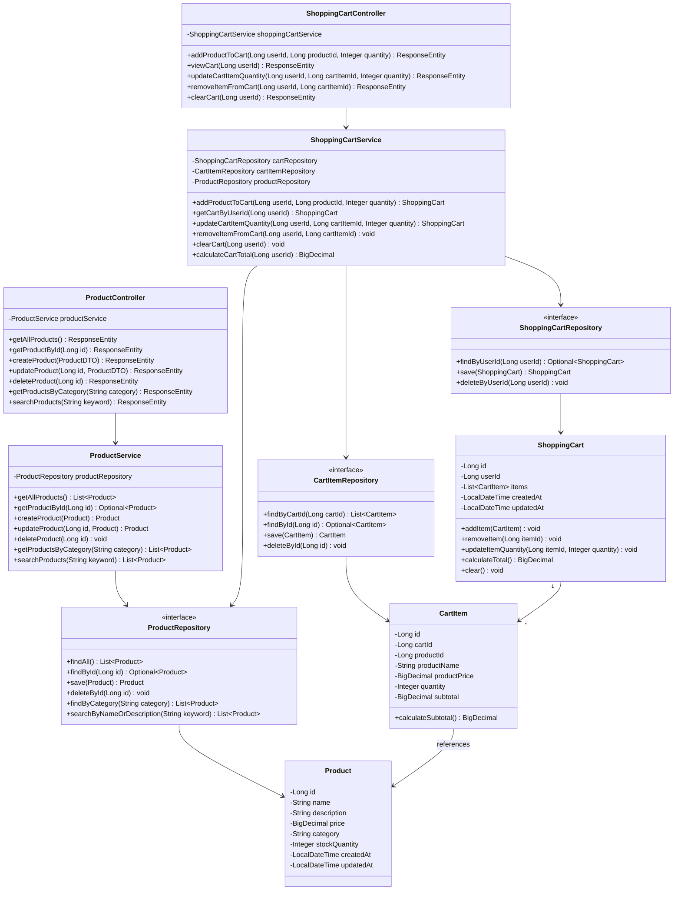

### 2.2 Entity Relationship Diagram

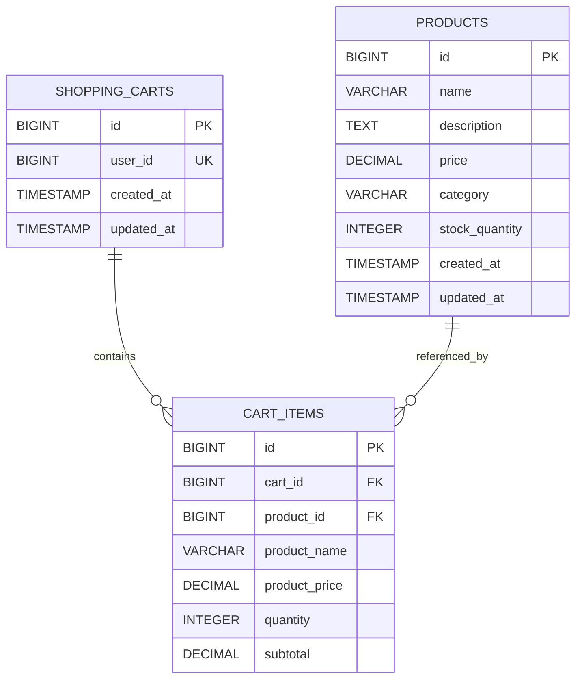

---

## 3. Sequence Diagrams

### 3.1 Get All Products

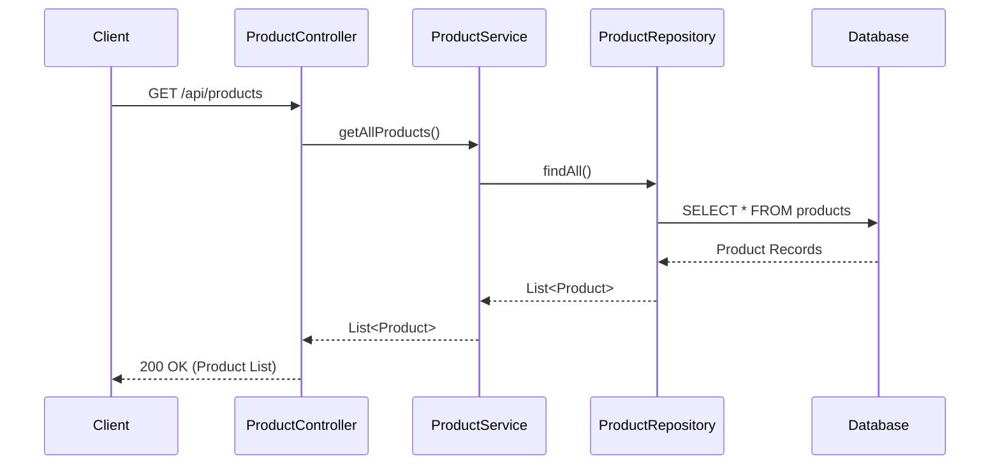

### 3.2 Get Product By ID

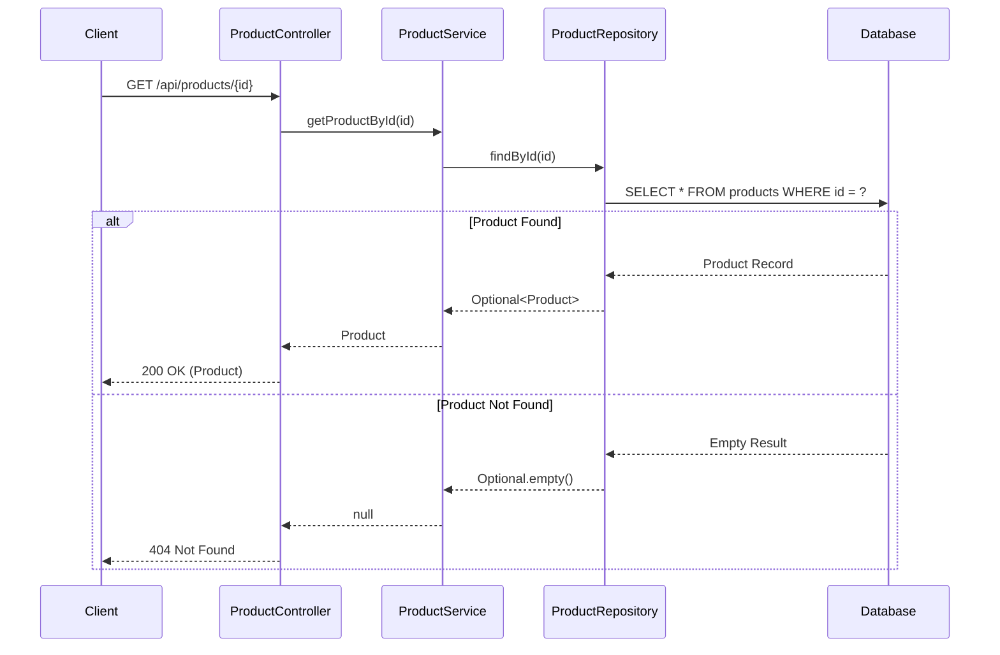

### 3.3 Create Product

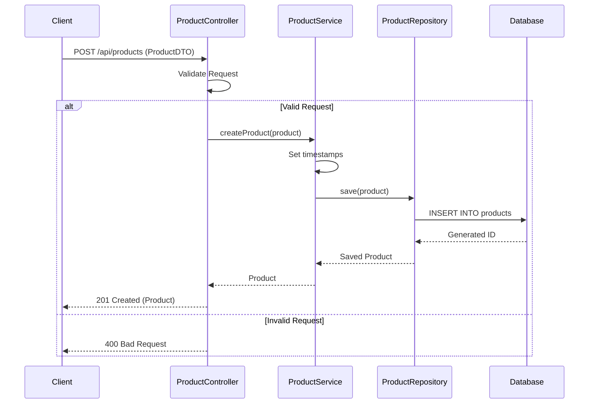

### 3.4 Update Product

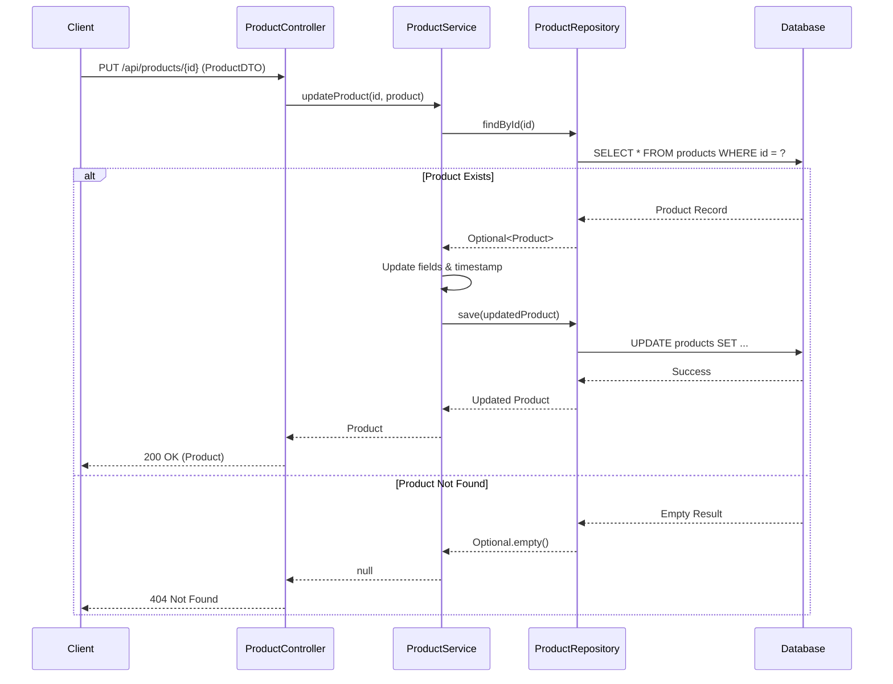

### 3.5 Delete Product

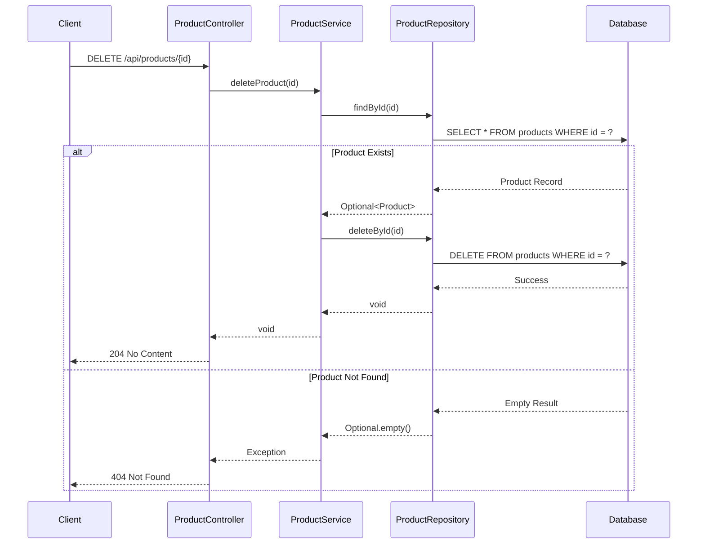

### 3.6 Get Products By Category


### 3.7 Search Products

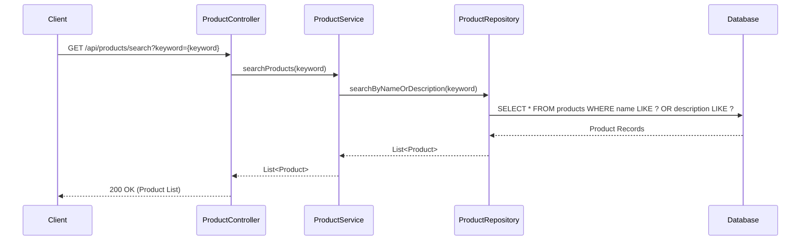

### 3.8 Add Product to Cart

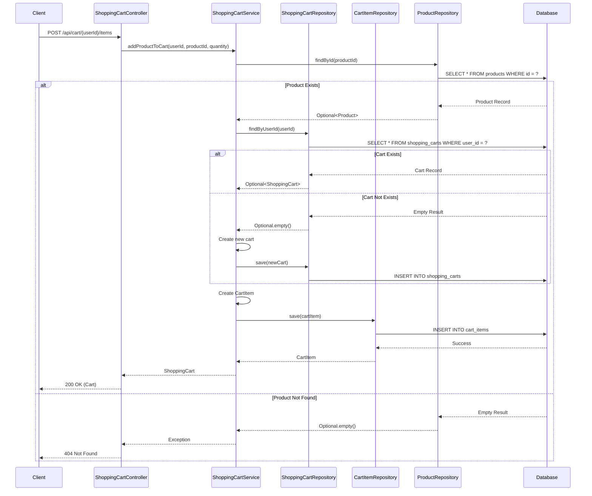

### 3.9 View Shopping Cart

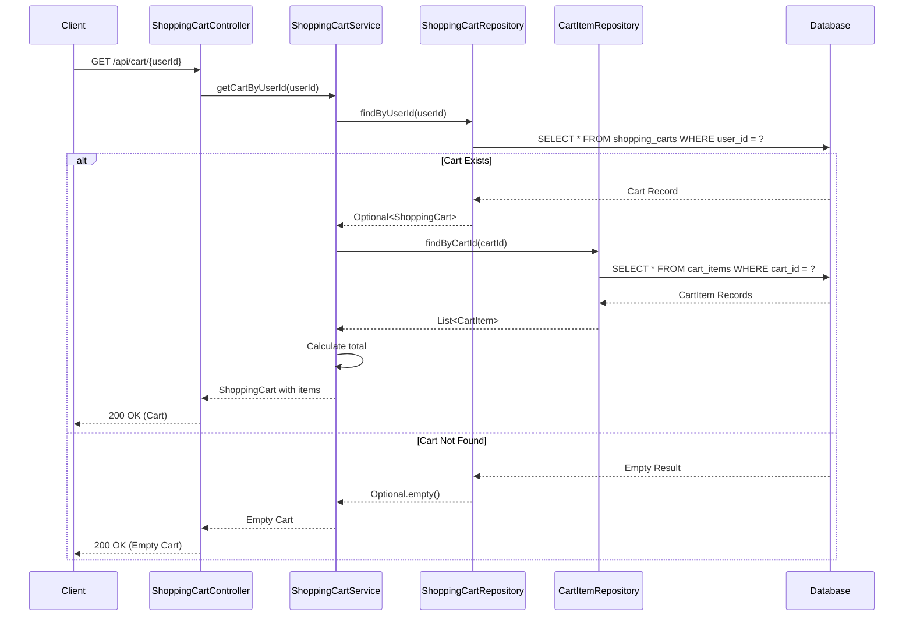

### 3.10 Update Cart Item Quantity

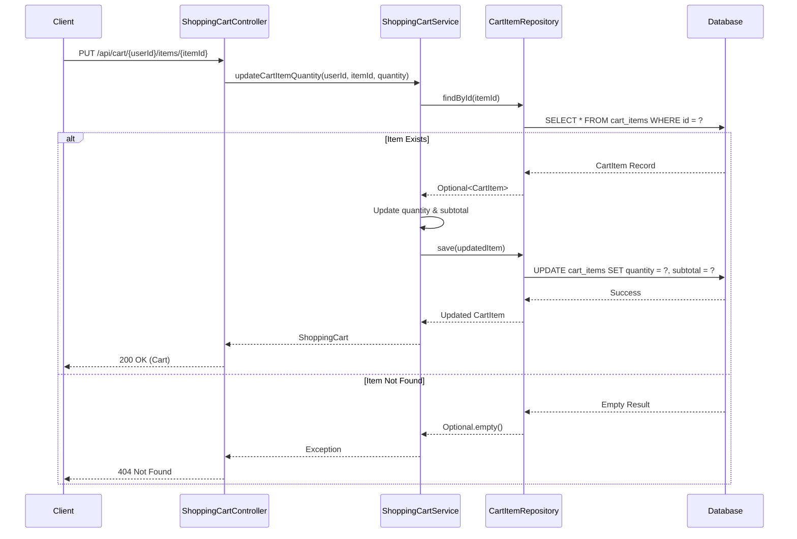

### 3.11 Remove Item from Cart

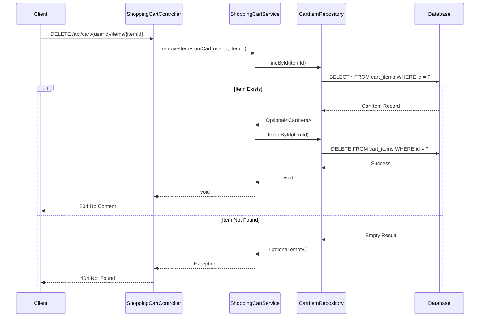

---

## 4. API Endpoints Summary

### Product Management Endpoints

| Method | Endpoint | Description | Request Body | Response |
|--------|----------|-------------|--------------|----------|
| GET | /api/products | Get all products | None | 200 OK - List of products |
| GET | /api/products/{id} | Get product by ID | None | 200 OK - Product / 404 Not Found |
| POST | /api/products | Create new product | ProductDTO | 201 Created - Product / 400 Bad Request |
| PUT | /api/products/{id} | Update product | ProductDTO | 200 OK - Product / 404 Not Found |
| DELETE | /api/products/{id} | Delete product | None | 204 No Content / 404 Not Found |
| GET | /api/products/category/{category} | Get products by category | None | 200 OK - List of products |
| GET | /api/products/search?keyword={keyword} | Search products | None | 200 OK - List of products |

### Shopping Cart Management Endpoints

| Method | Endpoint | Description | Request Body | Response |
|--------|----------|-------------|--------------|----------|
| POST | /api/cart/{userId}/items | Add product to cart | {"productId": Long, "quantity": Integer} | 200 OK - Cart / 404 Not Found |
| GET | /api/cart/{userId} | View shopping cart | None | 200 OK - Cart with items |
| PUT | /api/cart/{userId}/items/{itemId} | Update cart item quantity | {"quantity": Integer} | 200 OK - Cart / 404 Not Found |
| DELETE | /api/cart/{userId}/items/{itemId} | Remove item from cart | None | 204 No Content / 404 Not Found |
| DELETE | /api/cart/{userId} | Clear cart | None | 204 No Content |
| GET | /api/cart/{userId}/total | Get cart total | None | 200 OK - {"total": BigDecimal} |

---

## 5. Database Schema

### Products Table

```sql
CREATE TABLE products (
    id BIGINT PRIMARY KEY AUTO_INCREMENT,
    name VARCHAR(255) NOT NULL,
    description TEXT,
    price DECIMAL(10, 2) NOT NULL,
    category VARCHAR(100) NOT NULL,
    stock_quantity INTEGER NOT NULL DEFAULT 0,
    created_at TIMESTAMP DEFAULT CURRENT_TIMESTAMP,
    updated_at TIMESTAMP DEFAULT CURRENT_TIMESTAMP ON UPDATE CURRENT_TIMESTAMP,
    INDEX idx_category (category),
    INDEX idx_name (name)
);
```

### Shopping Carts Table

```sql
CREATE TABLE shopping_carts (
    id BIGINT PRIMARY KEY AUTO_INCREMENT,
    user_id BIGINT NOT NULL UNIQUE,
    created_at TIMESTAMP DEFAULT CURRENT_TIMESTAMP,
    updated_at TIMESTAMP DEFAULT CURRENT_TIMESTAMP ON UPDATE CURRENT_TIMESTAMP,
    INDEX idx_user_id (user_id)
);
```

### Cart Items Table

```sql
CREATE TABLE cart_items (
    id BIGINT PRIMARY KEY AUTO_INCREMENT,
    cart_id BIGINT NOT NULL,
    product_id BIGINT NOT NULL,
    product_name VARCHAR(255) NOT NULL,
    product_price DECIMAL(10, 2) NOT NULL,
    quantity INTEGER NOT NULL DEFAULT 1,
    subtotal DECIMAL(10, 2) NOT NULL,
    FOREIGN KEY (cart_id) REFERENCES shopping_carts(id) ON DELETE CASCADE,
    FOREIGN KEY (product_id) REFERENCES products(id) ON DELETE CASCADE,
    INDEX idx_cart_id (cart_id),
    INDEX idx_product_id (product_id)
);
```

---

## 6. Technology Stack Details

### Backend
- **Spring Boot 3.x**: Main framework
- **Spring Data JPA**: Data access layer
- **Spring Web**: REST API development
- **Hibernate**: ORM implementation
- **Lombok**: Reduce boilerplate code
- **MapStruct**: DTO mapping
- **Bean Validation**: Request validation

### Database
- **PostgreSQL/MySQL**: Primary database
- **Flyway/Liquibase**: Database migration

### Build & Dependencies
- **Maven/Gradle**: Build automation
- **JUnit 5**: Unit testing
- **Mockito**: Mocking framework
- **Spring Boot Test**: Integration testing

---

## 7. Design Patterns

### Layered Architecture
- **Controller Layer**: Handles HTTP requests and responses
- **Service Layer**: Contains business logic
- **Repository Layer**: Data access abstraction
- **Entity Layer**: Domain models

### Repository Pattern
- Abstracts data access logic
- Provides clean separation between business logic and data access
- Uses Spring Data JPA for implementation

### DTO Pattern
- Separates internal domain models from API contracts
- Provides data transfer objects for API requests/responses
- Prevents over-exposure of entity details

### Dependency Injection
- Constructor-based injection for required dependencies
- Promotes loose coupling and testability

### Aggregate Pattern
- ShoppingCart acts as an aggregate root
- CartItems are managed through the ShoppingCart aggregate
- Ensures consistency of cart operations
- Encapsulates business rules for cart management

---

## 8. Key Features

### Product Management
1. **CRUD Operations**: Complete create, read, update, delete functionality
2. **Category Filtering**: Filter products by category
3. **Search Functionality**: Search products by name or description
4. **Stock Management**: Track product inventory
5. **Validation**: Input validation for all operations
6. **Error Handling**: Comprehensive error responses

### Shopping Cart Management
1. **Add to Cart**: Add products to user's shopping cart with specified quantity
2. **View Cart**: Retrieve complete cart with all items and calculated total
3. **Update Quantity**: Modify quantity of items in cart with automatic subtotal recalculation
4. **Remove Items**: Delete individual items from cart
5. **Clear Cart**: Remove all items from cart
6. **Cart Persistence**: Maintain cart state across sessions
7. **Price Snapshot**: Store product price at time of adding to cart
8. **Automatic Calculations**: Real-time subtotal and total calculations
9. **Validation**: Quantity and product availability validation
10. **Cascade Operations**: Automatic cleanup when products are deleted

---

## 9. Error Handling Strategy

### HTTP Status Codes
- **200 OK**: Successful GET, PUT operations
- **201 Created**: Successful POST operations
- **204 No Content**: Successful DELETE operations
- **400 Bad Request**: Invalid input data
- **404 Not Found**: Resource not found
- **500 Internal Server Error**: Server-side errors

### Exception Handling
- Global exception handler using @ControllerAdvice
- Custom exceptions for business logic violations
- Structured error response format

---

## 10. Security Considerations

### Input Validation
- Bean Validation annotations on DTOs
- Custom validators for business rules
- SQL injection prevention through parameterized queries

### Data Integrity
- Foreign key constraints
- Cascade operations for related entities
- Transaction management for data consistency

---

## 11. Performance Optimization

### Database Optimization
- Indexes on frequently queried columns
- Efficient query design
- Connection pooling

### Caching Strategy
- Consider caching for frequently accessed products
- Cache invalidation on updates

### Pagination
- Implement pagination for large result sets
- Configurable page size

---

## 12. Testing Strategy

### Unit Tests
- Service layer business logic
- Repository custom queries
- Utility methods

### Integration Tests
- Controller endpoints
- Database operations
- End-to-end workflows

### Test Coverage
- Minimum 80% code coverage
- Critical path coverage

---

## 13. Deployment Considerations

### Environment Configuration
- Separate configurations for dev, test, prod
- Externalized configuration using application.properties/yml
- Environment-specific database connections

### Monitoring
- Application health checks
- Performance metrics
- Error logging and tracking

---

## 14. Future Enhancements

### Product Management
1. Product images and media support
2. Product reviews and ratings
3. Inventory alerts for low stock
4. Bulk operations
5. Product variants (size, color, etc.)

### Shopping Cart Management
1. Cart expiration and cleanup
2. Save for later functionality
3. Cart sharing capabilities
4. Wishlist integration
5. Cart abandonment tracking
6. Promotional code support
7. Stock validation before checkout

---

## 15. Glossary

- **DTO**: Data Transfer Object - Object used to transfer data between layers
- **JPA**: Java Persistence API - Java specification for ORM
- **ORM**: Object-Relational Mapping - Technique to map objects to database tables
- **REST**: Representational State Transfer - Architectural style for APIs
- **CRUD**: Create, Read, Update, Delete - Basic database operations
- **Aggregate**: Domain-Driven Design pattern for grouping related entities
- **Aggregate Root**: Main entity that controls access to the aggregate

---

## Document Control

**Last Updated**: Current Date  
**Review Cycle**: Quarterly  
**Next Review**: Next Quarter  
**Document Owner**: Engineering Team  
**Approvers**: Technical Lead, Architecture Team

---

*End of Low Level Design Document*