# Low Level Design Document
## E-commerce Product Management System

### Version: 2.0
### Date: 2024
### Technology Stack: Spring Boot 3.2, Java 21, PostgreSQL

---

## 1. Project Overview

This document provides the low-level design for an E-commerce Product Management System built using Spring Boot and Java 21. The system manages products, categories, inventory, orders, and shopping cart functionality.

### 1.1 Modules
- ProductManagement
- CategoryManagement
- InventoryManagement
- OrderManagement
- ShoppingCartManagement

### 1.2 Architecture Style
- Layered Architecture (Controller → Service → Repository)
- RESTful API Design
- JPA/Hibernate for ORM

---

## 2. Component Design

### 2.1 Class Diagram

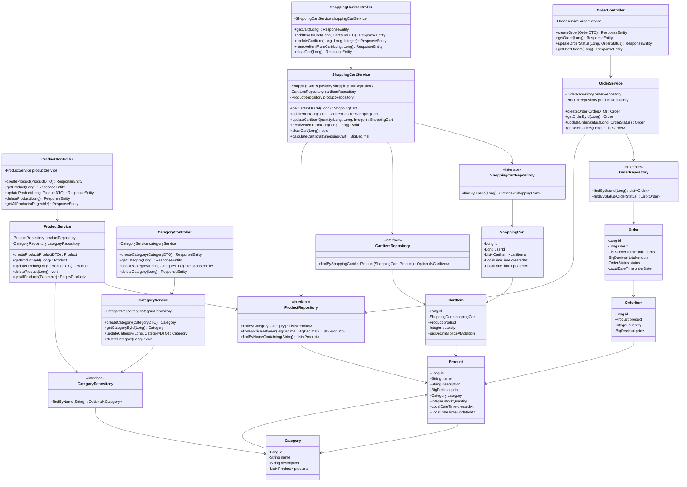

### 2.2 Entity Relationship Diagram

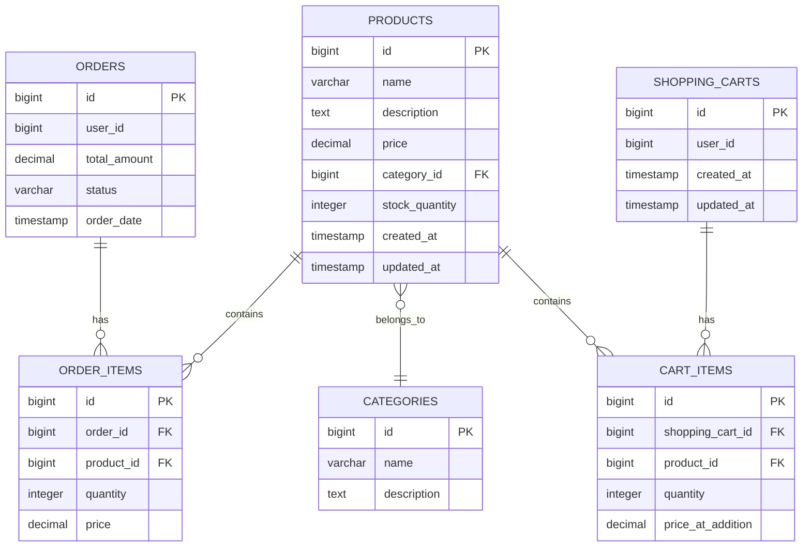

---

## 3. Sequence Diagrams

### 3.1 Create Product Flow

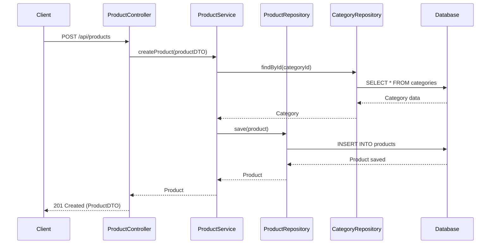

### 3.2 Get Product Flow

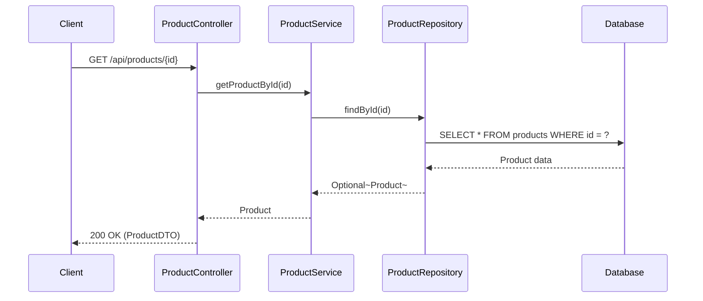

### 3.3 Update Product Flow

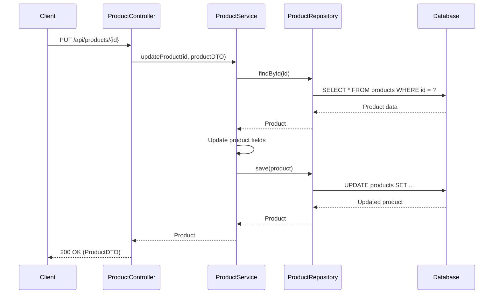

### 3.4 Delete Product Flow

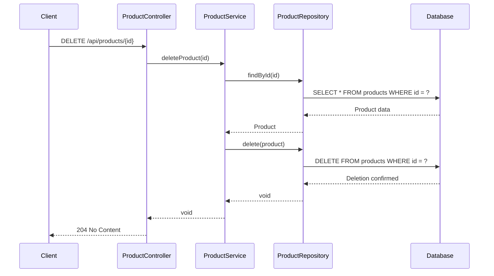

### 3.5 Create Order Flow

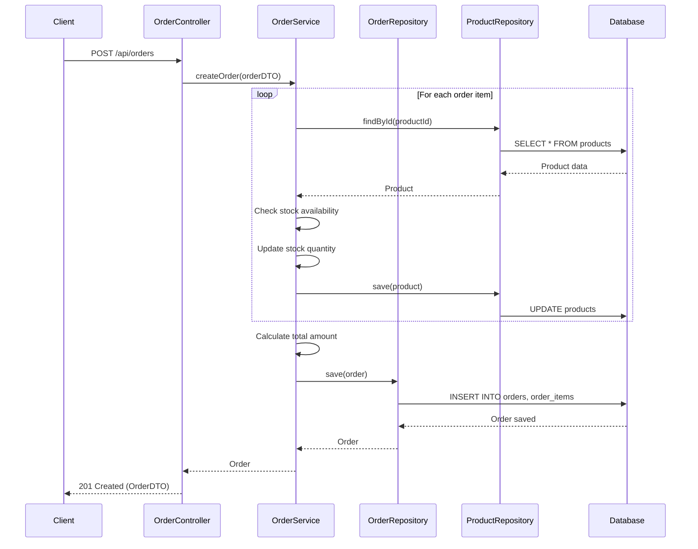

### 3.6 Get Order Flow

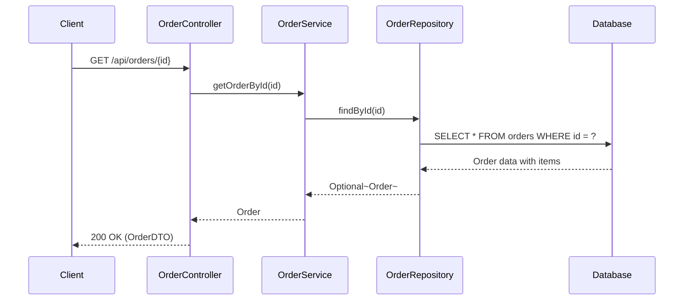

### 3.7 Update Order Status Flow

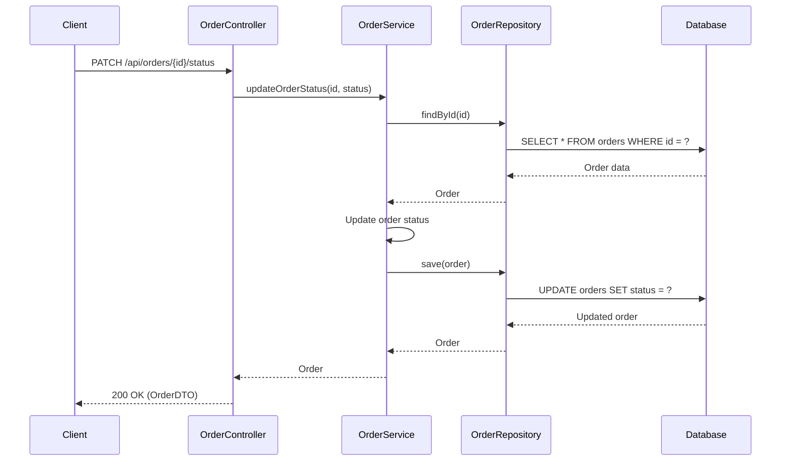

### 3.8 Add Item to Cart Flow


### 3.9 Get Shopping Cart Flow

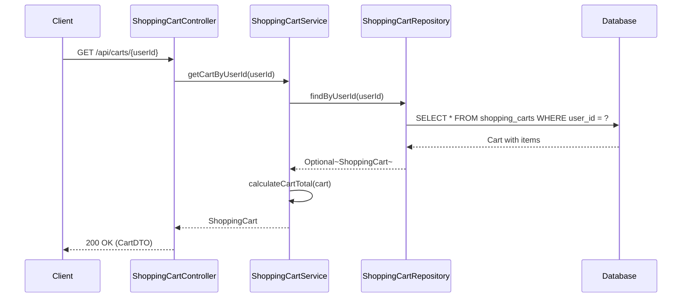

### 3.10 Update Cart Item Quantity Flow

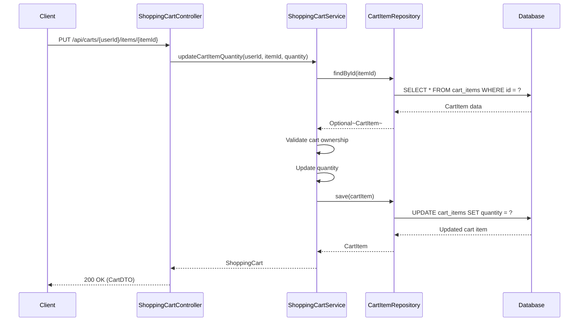

### 3.11 Remove Item from Cart Flow

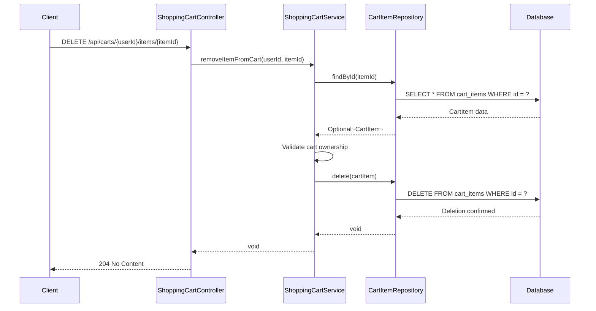

---

## 4. API Endpoints

### 4.1 Product Management Endpoints

| Method | Endpoint | Description | Request Body | Response |
|--------|----------|-------------|--------------|----------|
| POST | /api/products | Create a new product | ProductDTO | 201 Created |
| GET | /api/products/{id} | Get product by ID | - | 200 OK |
| PUT | /api/products/{id} | Update product | ProductDTO | 200 OK |
| DELETE | /api/products/{id} | Delete product | - | 204 No Content |
| GET | /api/products | Get all products (paginated) | - | 200 OK |
| GET | /api/products/search | Search products | Query params | 200 OK |

### 4.2 Category Management Endpoints

| Method | Endpoint | Description | Request Body | Response |
|--------|----------|-------------|--------------|----------|
| POST | /api/categories | Create a new category | CategoryDTO | 201 Created |
| GET | /api/categories/{id} | Get category by ID | - | 200 OK |
| PUT | /api/categories/{id} | Update category | CategoryDTO | 200 OK |
| DELETE | /api/categories/{id} | Delete category | - | 204 No Content |
| GET | /api/categories | Get all categories | - | 200 OK |

### 4.3 Order Management Endpoints

| Method | Endpoint | Description | Request Body | Response |
|--------|----------|-------------|--------------|----------|
| POST | /api/orders | Create a new order | OrderDTO | 201 Created |
| GET | /api/orders/{id} | Get order by ID | - | 200 OK |
| PATCH | /api/orders/{id}/status | Update order status | StatusDTO | 200 OK |
| GET | /api/orders/user/{userId} | Get user orders | - | 200 OK |

### 4.4 Shopping Cart Management Endpoints

| Method | Endpoint | Description | Request Body | Response |
|--------|----------|-------------|--------------|----------|
| GET | /api/carts/{userId} | Get user's shopping cart | - | 200 OK |
| POST | /api/carts/{userId}/items | Add item to cart | CartItemDTO | 200 OK |
| PUT | /api/carts/{userId}/items/{itemId} | Update cart item quantity | QuantityDTO | 200 OK |
| DELETE | /api/carts/{userId}/items/{itemId} | Remove item from cart | - | 204 No Content |
| DELETE | /api/carts/{userId} | Clear entire cart | - | 204 No Content |

---

## 5. Database Schema

### 5.1 Products Table

```sql
CREATE TABLE products (
    id BIGSERIAL PRIMARY KEY,
    name VARCHAR(255) NOT NULL,
    description TEXT,
    price DECIMAL(10, 2) NOT NULL,
    category_id BIGINT,
    stock_quantity INTEGER NOT NULL DEFAULT 0,
    created_at TIMESTAMP DEFAULT CURRENT_TIMESTAMP,
    updated_at TIMESTAMP DEFAULT CURRENT_TIMESTAMP,
    FOREIGN KEY (category_id) REFERENCES categories(id) ON DELETE SET NULL
);

CREATE INDEX idx_products_category ON products(category_id);
CREATE INDEX idx_products_name ON products(name);
```

### 5.2 Categories Table

```sql
CREATE TABLE categories (
    id BIGSERIAL PRIMARY KEY,
    name VARCHAR(255) NOT NULL UNIQUE,
    description TEXT
);
```

### 5.3 Orders Table

```sql
CREATE TABLE orders (
    id BIGSERIAL PRIMARY KEY,
    user_id BIGINT NOT NULL,
    total_amount DECIMAL(10, 2) NOT NULL,
    status VARCHAR(50) NOT NULL,
    order_date TIMESTAMP DEFAULT CURRENT_TIMESTAMP
);

CREATE INDEX idx_orders_user ON orders(user_id);
CREATE INDEX idx_orders_status ON orders(status);
```

### 5.4 Order Items Table

```sql
CREATE TABLE order_items (
    id BIGSERIAL PRIMARY KEY,
    order_id BIGINT NOT NULL,
    product_id BIGINT NOT NULL,
    quantity INTEGER NOT NULL,
    price DECIMAL(10, 2) NOT NULL,
    FOREIGN KEY (order_id) REFERENCES orders(id) ON DELETE CASCADE,
    FOREIGN KEY (product_id) REFERENCES products(id) ON DELETE RESTRICT
);

CREATE INDEX idx_order_items_order ON order_items(order_id);
```

### 5.5 Shopping Carts Table

```sql
CREATE TABLE shopping_carts (
    id BIGSERIAL PRIMARY KEY,
    user_id BIGINT NOT NULL UNIQUE,
    created_at TIMESTAMP DEFAULT CURRENT_TIMESTAMP,
    updated_at TIMESTAMP DEFAULT CURRENT_TIMESTAMP
);

CREATE INDEX idx_shopping_carts_user ON shopping_carts(user_id);
```

### 5.6 Cart Items Table

```sql
CREATE TABLE cart_items (
    id BIGSERIAL PRIMARY KEY,
    shopping_cart_id BIGINT NOT NULL,
    product_id BIGINT NOT NULL,
    quantity INTEGER NOT NULL,
    price_at_addition DECIMAL(10, 2) NOT NULL,
    FOREIGN KEY (shopping_cart_id) REFERENCES shopping_carts(id) ON DELETE CASCADE,
    FOREIGN KEY (product_id) REFERENCES products(id) ON DELETE CASCADE,
    UNIQUE(shopping_cart_id, product_id)
);

CREATE INDEX idx_cart_items_cart ON cart_items(shopping_cart_id);
CREATE INDEX idx_cart_items_product ON cart_items(product_id);
```

---

## 6. Data Transfer Objects (DTOs)

### 6.1 ProductDTO

```java
public record ProductDTO(
    Long id,
    String name,
    String description,
    BigDecimal price,
    Long categoryId,
    String categoryName,
    Integer stockQuantity,
    LocalDateTime createdAt,
    LocalDateTime updatedAt
) {}
```

### 6.2 CategoryDTO

```java
public record CategoryDTO(
    Long id,
    String name,
    String description
) {}
```

### 6.3 OrderDTO

```java
public record OrderDTO(
    Long id,
    Long userId,
    List<OrderItemDTO> orderItems,
    BigDecimal totalAmount,
    String status,
    LocalDateTime orderDate
) {}
```

### 6.4 OrderItemDTO

```java
public record OrderItemDTO(
    Long productId,
    String productName,
    Integer quantity,
    BigDecimal price
) {}
```

### 6.5 CartDTO

```java
public record CartDTO(
    Long id,
    Long userId,
    List<CartItemDTO> items,
    BigDecimal totalAmount,
    LocalDateTime updatedAt
) {}
```

### 6.6 CartItemDTO

```java
public record CartItemDTO(
    Long id,
    Long productId,
    String productName,
    Integer quantity,
    BigDecimal priceAtAddition
) {}
```

---

## 7. Design Patterns

### 7.1 Repository Pattern
- Abstracts data access logic
- Uses Spring Data JPA repositories
- Provides clean separation between business logic and data access

### 7.2 Service Layer Pattern
- Encapsulates business logic
- Coordinates between controllers and repositories
- Handles transaction management

### 7.3 DTO Pattern
- Separates internal domain models from API contracts
- Reduces coupling between layers
- Provides data validation and transformation

### 7.4 RESTful API Pattern
- Resource-based URLs
- HTTP methods for CRUD operations
- Stateless communication

### 7.5 Aggregate Pattern
- Shopping cart acts as an aggregate root
- Cart items are managed through the shopping cart
- Ensures consistency of cart operations
- Encapsulates business rules for cart management

---

## 8. Key Features

### 8.1 Product Management
- CRUD operations for products
- Product search and filtering
- Category-based organization
- Stock management

### 8.2 Order Processing
- Order creation with multiple items
- Stock validation and deduction
- Order status tracking
- User order history

### 8.3 Data Validation
- Input validation using Bean Validation
- Business rule validation in service layer
- Database constraints

### 8.4 Error Handling
- Custom exception classes
- Global exception handler
- Meaningful error responses

### 8.5 Shopping Cart Management
- Persistent shopping cart per user
- Add, update, and remove cart items
- Automatic cart creation on first item addition
- Real-time cart total calculation
- Price preservation at time of addition
- Cart item quantity management
- Clear entire cart functionality

---

## 9. Exception Handling

### 9.1 Custom Exceptions

```java
public class ResourceNotFoundException extends RuntimeException {
    public ResourceNotFoundException(String message) {
        super(message);
    }
}

public class InsufficientStockException extends RuntimeException {
    public InsufficientStockException(String message) {
        super(message);
    }
}

public class InvalidOperationException extends RuntimeException {
    public InvalidOperationException(String message) {
        super(message);
    }
}
```

### 9.2 Global Exception Handler

```java
@RestControllerAdvice
public class GlobalExceptionHandler {
    
    @ExceptionHandler(ResourceNotFoundException.class)
    public ResponseEntity<ErrorResponse> handleResourceNotFound(ResourceNotFoundException ex) {
        ErrorResponse error = new ErrorResponse(
            HttpStatus.NOT_FOUND.value(),
            ex.getMessage(),
            LocalDateTime.now()
        );
        return new ResponseEntity<>(error, HttpStatus.NOT_FOUND);
    }
    
    @ExceptionHandler(InsufficientStockException.class)
    public ResponseEntity<ErrorResponse> handleInsufficientStock(InsufficientStockException ex) {
        ErrorResponse error = new ErrorResponse(
            HttpStatus.BAD_REQUEST.value(),
            ex.getMessage(),
            LocalDateTime.now()
        );
        return new ResponseEntity<>(error, HttpStatus.BAD_REQUEST);
    }
    
    @ExceptionHandler(Exception.class)
    public ResponseEntity<ErrorResponse> handleGenericException(Exception ex) {
        ErrorResponse error = new ErrorResponse(
            HttpStatus.INTERNAL_SERVER_ERROR.value(),
            "An unexpected error occurred",
            LocalDateTime.now()
        );
        return new ResponseEntity<>(error, HttpStatus.INTERNAL_SERVER_ERROR);
    }
}
```

---

## 10. Configuration

### 10.1 Application Properties

```properties
# Database Configuration
spring.datasource.url=jdbc:postgresql://localhost:5432/ecommerce_db
spring.datasource.username=postgres
spring.datasource.password=password

# JPA Configuration
spring.jpa.hibernate.ddl-auto=update
spring.jpa.show-sql=true
spring.jpa.properties.hibernate.format_sql=true
spring.jpa.properties.hibernate.dialect=org.hibernate.dialect.PostgreSQLDialect

# Server Configuration
server.port=8080

# Logging
logging.level.org.springframework.web=DEBUG
logging.level.com.ecommerce=DEBUG
```

---

## 11. Testing Strategy

### 11.1 Unit Tests
- Service layer tests with mocked repositories
- Controller tests with MockMvc
- Repository tests with @DataJpaTest

### 11.2 Integration Tests
- End-to-end API tests
- Database integration tests
- Transaction management tests

### 11.3 Test Coverage Goals
- Minimum 80% code coverage
- 100% coverage for critical business logic
- Edge case testing

---

## 12. Security Considerations

### 12.1 Input Validation
- Validate all user inputs
- Sanitize data before processing
- Use Bean Validation annotations

### 12.2 SQL Injection Prevention
- Use parameterized queries
- Leverage JPA/Hibernate ORM
- Avoid dynamic query construction

### 12.3 Authentication & Authorization
- Implement Spring Security (future enhancement)
- Role-based access control
- JWT token authentication

---

## 13. Performance Optimization

### 13.1 Database Optimization
- Proper indexing on frequently queried columns
- Use of pagination for large datasets
- Lazy loading for relationships

### 13.2 Caching Strategy
- Cache frequently accessed data
- Use Spring Cache abstraction
- Redis integration for distributed caching

### 13.3 Query Optimization
- Use JOIN FETCH for eager loading when needed
- Avoid N+1 query problems
- Use database query optimization tools

---

## 14. Deployment Considerations

### 14.1 Environment Configuration
- Separate configurations for dev, test, and prod
- Externalized configuration using environment variables
- Use Spring Profiles

### 14.2 Containerization
- Docker containerization
- Docker Compose for local development
- Kubernetes for production deployment

### 14.3 Monitoring & Logging
- Application logging with SLF4J and Logback
- Metrics collection with Micrometer
- Integration with monitoring tools (Prometheus, Grafana)

---

## 15. Future Enhancements

### 15.1 Planned Features
- User authentication and authorization
- Payment gateway integration
- Product reviews and ratings
- Wishlist functionality
- Email notifications
- Advanced search with Elasticsearch

### 15.2 Scalability Improvements
- Microservices architecture
- Event-driven architecture with message queues
- Database sharding
- CDN integration for static content

---

## 16. Appendix

### 16.1 Technology Versions
- Java: 21
- Spring Boot: 3.2.x
- PostgreSQL: 15.x
- Maven: 3.9.x

### 16.2 Dependencies
- spring-boot-starter-web
- spring-boot-starter-data-jpa
- postgresql
- spring-boot-starter-validation
- lombok
- spring-boot-starter-test

### 16.3 References
- Spring Boot Documentation
- Spring Data JPA Documentation
- PostgreSQL Documentation
- RESTful API Design Best Practices

---

**Document Version History:**
- v1.0 - Initial LLD document
- v2.0 - Added Shopping Cart Management functionality (Story SCRUM-1140)

**Last Updated:** 2024
**Author:** Development Team
**Status:** Approved