# Low Level Design Document
## E-commerce Product Management System

### Version History
| Version | Date | Author | Description |
|---------|------|--------|-------------|
| 1.0 | 2024-01-15 | Development Team | Initial LLD |
| 1.1 | 2024-01-20 | Development Team | Added Shopping Cart Management |

---

## 1. Project Overview

### 1.1 Purpose
This Low Level Design (LLD) document provides detailed technical specifications for the E-commerce Product Management System. It describes the system architecture, component interactions, data models, and implementation details.

### 1.2 Scope
This document covers the detailed design of:
- Product Management Module
- Inventory Management Module
- Order Processing Module
- User Management Module
- Shopping Cart Management Module

### 1.3 Technology Stack
- **Backend Framework**: Spring Boot 3.x
- **Language**: Java 17
- **Database**: PostgreSQL 14+
- **ORM**: Spring Data JPA / Hibernate
- **API Documentation**: OpenAPI 3.0 (Swagger)
- **Build Tool**: Maven
- **Testing**: JUnit 5, Mockito

---

## 2. System Architecture

### 2.1 Class Diagram

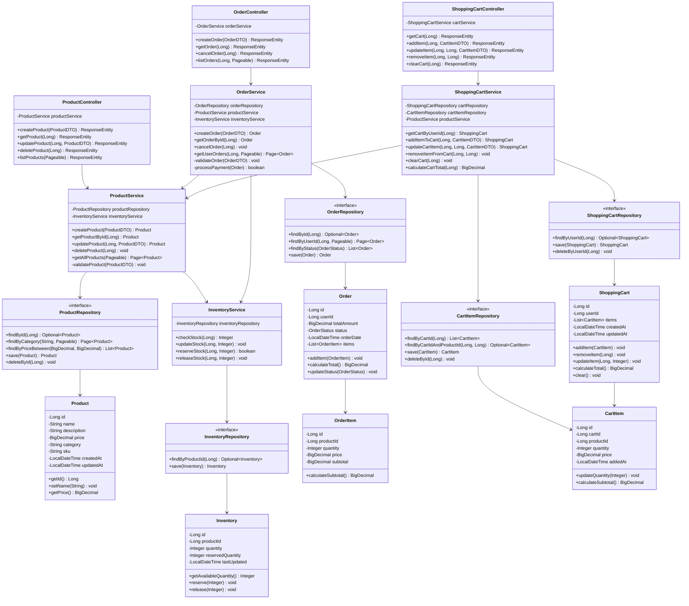

### 2.2 Entity Relationship Diagram

```mermaid
erDiagram
    PRODUCTS ||--o{ ORDER_ITEMS : contains
    PRODUCTS ||--|| INVENTORY : has
    ORDERS ||--|{ ORDER_ITEMS : includes
    USERS ||--o{ ORDERS : places
    PRODUCTS ||--o{ CART_ITEMS : contains
    SHOPPING_CARTS ||--|{ CART_ITEMS : includes
    USERS ||--|| SHOPPING_CARTS : has

    PRODUCTS {
        bigint id PK
        varchar name
        text description
        decimal price
        varchar category
        varchar sku UK
        timestamp created_at
        timestamp updated_at
    }

    INVENTORY {
        bigint id PK
        bigint product_id FK
        integer quantity
        integer reserved_quantity
        timestamp last_updated
    }

    ORDERS {
        bigint id PK
        bigint user_id FK
        decimal total_amount
        varchar status
        timestamp order_date
        timestamp updated_at
    }

    ORDER_ITEMS {
        bigint id PK
        bigint order_id FK
        bigint product_id FK
        integer quantity
        decimal price
        decimal subtotal
    }

    USERS {
        bigint id PK
        varchar username UK
        varchar email UK
        varchar password_hash
        varchar role
        timestamp created_at
    }

    SHOPPING_CARTS {
        bigint id PK
        bigint user_id FK UK
        timestamp created_at
        timestamp updated_at
    }

    CART_ITEMS {
        bigint id PK
        bigint cart_id FK
        bigint product_id FK
        integer quantity
        decimal price
        timestamp added_at
    }
```

---

## 3. Sequence Diagrams

### 3.1 Create Product Flow

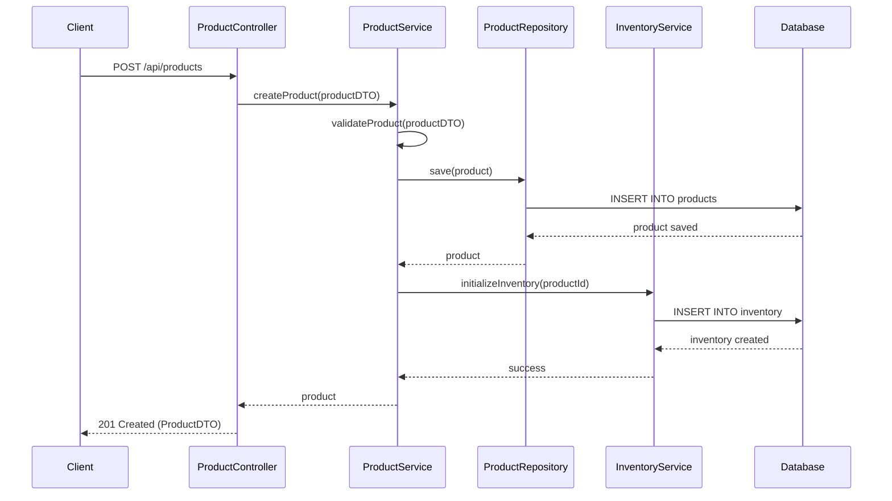

### 3.2 Get Product Flow

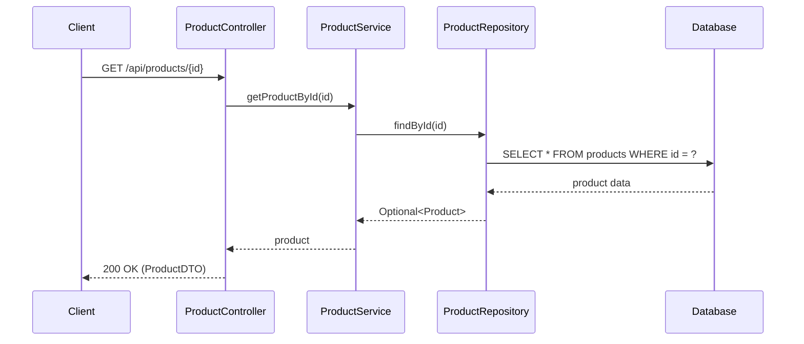

### 3.3 Update Product Flow

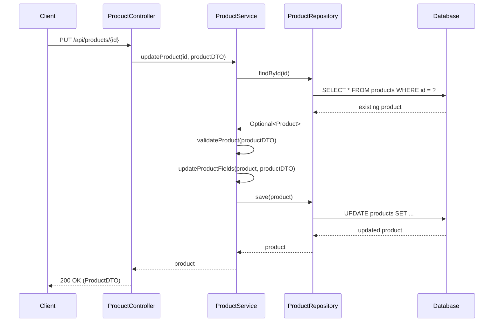

### 3.4 Delete Product Flow

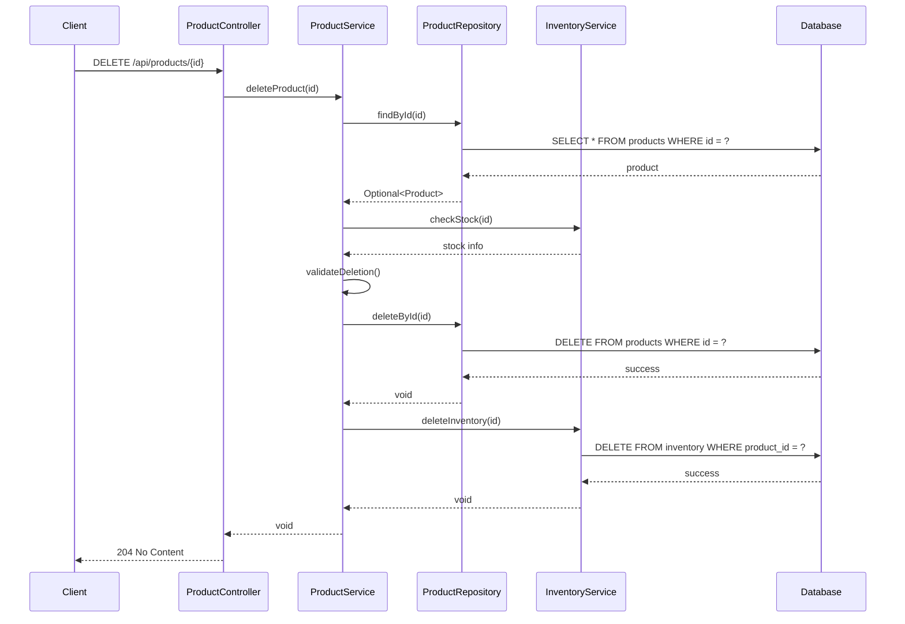

### 3.5 Create Order Flow

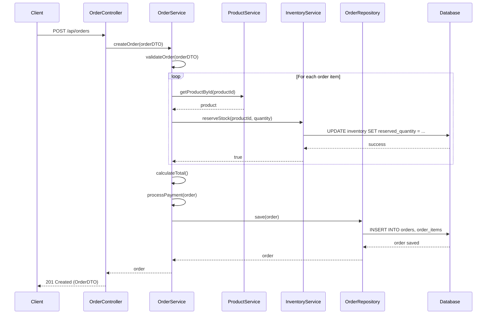

### 3.6 Get Order Flow

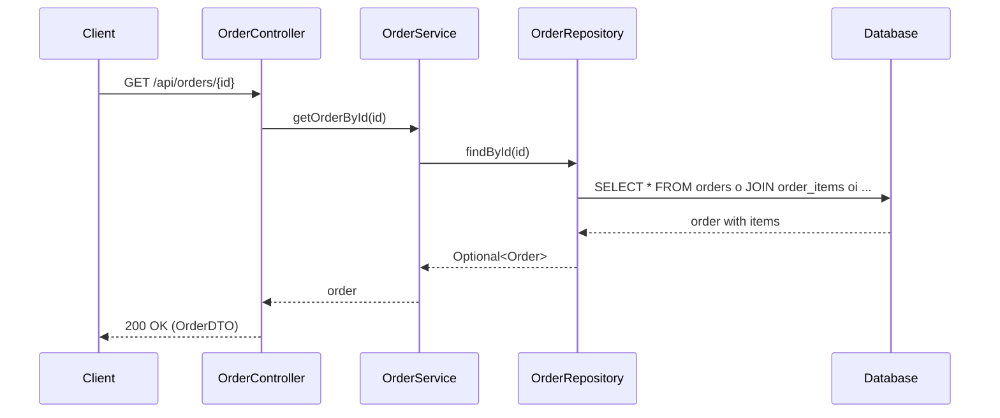

### 3.7 Cancel Order Flow

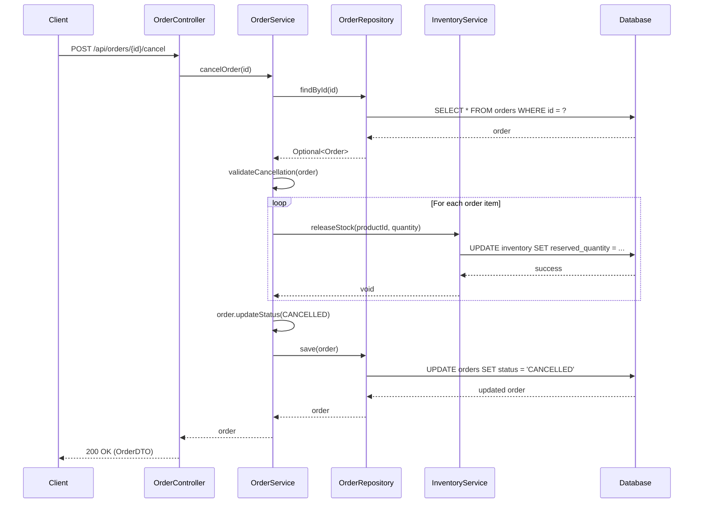

### 3.8 Get Shopping Cart Flow

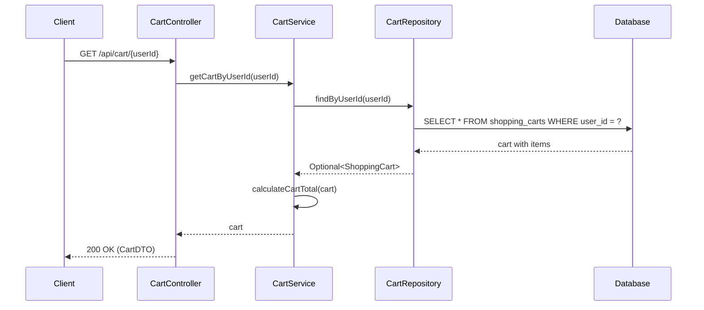

### 3.9 Add Item to Cart Flow

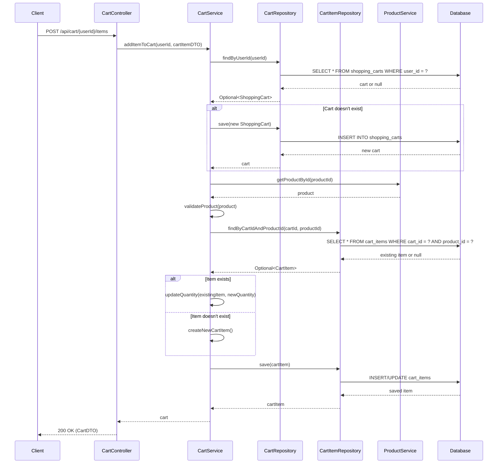

### 3.10 Update Cart Item Flow

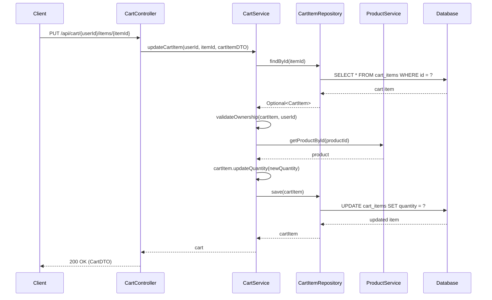

### 3.11 Remove Item from Cart Flow

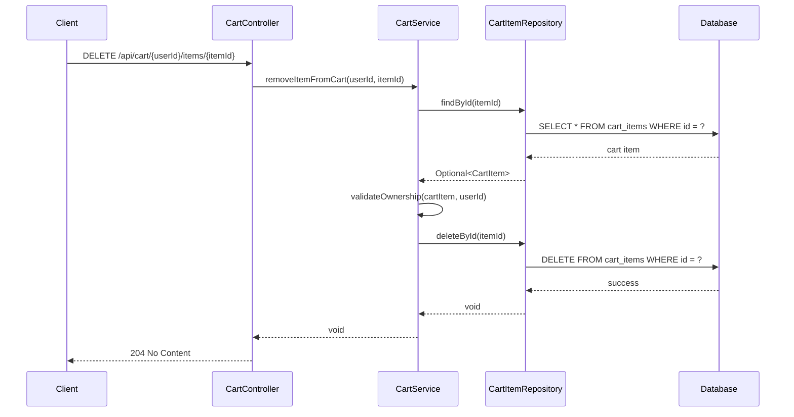

---

## 4. API Endpoints

### 4.1 Product Management Endpoints

| Method | Endpoint | Description | Request Body | Response |
|--------|----------|-------------|--------------|----------|
| POST | /api/products | Create new product | ProductDTO | 201 Created, ProductDTO |
| GET | /api/products/{id} | Get product by ID | - | 200 OK, ProductDTO |
| GET | /api/products | List all products (paginated) | - | 200 OK, Page<ProductDTO> |
| PUT | /api/products/{id} | Update product | ProductDTO | 200 OK, ProductDTO |
| DELETE | /api/products/{id} | Delete product | - | 204 No Content |
| GET | /api/products/category/{category} | Get products by category | - | 200 OK, List<ProductDTO> |
| GET | /api/products/search | Search products | query params | 200 OK, Page<ProductDTO> |

### 4.2 Order Management Endpoints

| Method | Endpoint | Description | Request Body | Response |
|--------|----------|-------------|--------------|----------|
| POST | /api/orders | Create new order | OrderDTO | 201 Created, OrderDTO |
| GET | /api/orders/{id} | Get order by ID | - | 200 OK, OrderDTO |
| GET | /api/orders/user/{userId} | Get user orders (paginated) | - | 200 OK, Page<OrderDTO> |
| POST | /api/orders/{id}/cancel | Cancel order | - | 200 OK, OrderDTO |
| GET | /api/orders/{id}/status | Get order status | - | 200 OK, OrderStatusDTO |

### 4.3 Inventory Management Endpoints

| Method | Endpoint | Description | Request Body | Response |
|--------|----------|-------------|--------------|----------|
| GET | /api/inventory/{productId} | Get inventory for product | - | 200 OK, InventoryDTO |
| PUT | /api/inventory/{productId} | Update inventory | InventoryUpdateDTO | 200 OK, InventoryDTO |
| POST | /api/inventory/{productId}/reserve | Reserve stock | ReservationDTO | 200 OK, boolean |
| POST | /api/inventory/{productId}/release | Release reserved stock | ReservationDTO | 200 OK, void |

### 4.4 Shopping Cart Management Endpoints

| Method | Endpoint | Description | Request Body | Response |
|--------|----------|-------------|--------------|----------|
| GET | /api/cart/{userId} | Get user's shopping cart | - | 200 OK, CartDTO |
| POST | /api/cart/{userId}/items | Add item to cart | CartItemDTO | 200 OK, CartDTO |
| PUT | /api/cart/{userId}/items/{itemId} | Update cart item quantity | CartItemDTO | 200 OK, CartDTO |
| DELETE | /api/cart/{userId}/items/{itemId} | Remove item from cart | - | 204 No Content |
| DELETE | /api/cart/{userId} | Clear entire cart | - | 204 No Content |
| GET | /api/cart/{userId}/total | Get cart total | - | 200 OK, BigDecimal |

---

## 5. Database Schema

### 5.1 Products Table

```sql
CREATE TABLE products (
    id BIGSERIAL PRIMARY KEY,
    name VARCHAR(255) NOT NULL,
    description TEXT,
    price DECIMAL(10, 2) NOT NULL,
    category VARCHAR(100) NOT NULL,
    sku VARCHAR(50) UNIQUE NOT NULL,
    created_at TIMESTAMP DEFAULT CURRENT_TIMESTAMP,
    updated_at TIMESTAMP DEFAULT CURRENT_TIMESTAMP,
    CONSTRAINT price_positive CHECK (price >= 0)
);

CREATE INDEX idx_products_category ON products(category);
CREATE INDEX idx_products_sku ON products(sku);
CREATE INDEX idx_products_price ON products(price);
```

### 5.2 Inventory Table

```sql
CREATE TABLE inventory (
    id BIGSERIAL PRIMARY KEY,
    product_id BIGINT NOT NULL UNIQUE,
    quantity INTEGER NOT NULL DEFAULT 0,
    reserved_quantity INTEGER NOT NULL DEFAULT 0,
    last_updated TIMESTAMP DEFAULT CURRENT_TIMESTAMP,
    FOREIGN KEY (product_id) REFERENCES products(id) ON DELETE CASCADE,
    CONSTRAINT quantity_non_negative CHECK (quantity >= 0),
    CONSTRAINT reserved_non_negative CHECK (reserved_quantity >= 0),
    CONSTRAINT reserved_not_exceed_quantity CHECK (reserved_quantity <= quantity)
);

CREATE INDEX idx_inventory_product_id ON inventory(product_id);
```

### 5.3 Orders Table

```sql
CREATE TABLE orders (
    id BIGSERIAL PRIMARY KEY,
    user_id BIGINT NOT NULL,
    total_amount DECIMAL(10, 2) NOT NULL,
    status VARCHAR(50) NOT NULL,
    order_date TIMESTAMP DEFAULT CURRENT_TIMESTAMP,
    updated_at TIMESTAMP DEFAULT CURRENT_TIMESTAMP,
    FOREIGN KEY (user_id) REFERENCES users(id),
    CONSTRAINT total_amount_positive CHECK (total_amount >= 0)
);

CREATE INDEX idx_orders_user_id ON orders(user_id);
CREATE INDEX idx_orders_status ON orders(status);
CREATE INDEX idx_orders_order_date ON orders(order_date);
```

### 5.4 Order Items Table

```sql
CREATE TABLE order_items (
    id BIGSERIAL PRIMARY KEY,
    order_id BIGINT NOT NULL,
    product_id BIGINT NOT NULL,
    quantity INTEGER NOT NULL,
    price DECIMAL(10, 2) NOT NULL,
    subtotal DECIMAL(10, 2) NOT NULL,
    FOREIGN KEY (order_id) REFERENCES orders(id) ON DELETE CASCADE,
    FOREIGN KEY (product_id) REFERENCES products(id),
    CONSTRAINT quantity_positive CHECK (quantity > 0),
    CONSTRAINT price_positive CHECK (price >= 0),
    CONSTRAINT subtotal_positive CHECK (subtotal >= 0)
);

CREATE INDEX idx_order_items_order_id ON order_items(order_id);
CREATE INDEX idx_order_items_product_id ON order_items(product_id);
```

### 5.5 Users Table

```sql
CREATE TABLE users (
    id BIGSERIAL PRIMARY KEY,
    username VARCHAR(50) UNIQUE NOT NULL,
    email VARCHAR(100) UNIQUE NOT NULL,
    password_hash VARCHAR(255) NOT NULL,
    role VARCHAR(20) NOT NULL DEFAULT 'CUSTOMER',
    created_at TIMESTAMP DEFAULT CURRENT_TIMESTAMP,
    CONSTRAINT email_format CHECK (email ~* '^[A-Za-z0-9._%+-]+@[A-Za-z0-9.-]+\.[A-Za-z]{2,}$')
);

CREATE INDEX idx_users_username ON users(username);
CREATE INDEX idx_users_email ON users(email);
```

### 5.6 Shopping Carts Table

```sql
CREATE TABLE shopping_carts (
    id BIGSERIAL PRIMARY KEY,
    user_id BIGINT NOT NULL UNIQUE,
    created_at TIMESTAMP DEFAULT CURRENT_TIMESTAMP,
    updated_at TIMESTAMP DEFAULT CURRENT_TIMESTAMP,
    FOREIGN KEY (user_id) REFERENCES users(id) ON DELETE CASCADE
);

CREATE INDEX idx_shopping_carts_user_id ON shopping_carts(user_id);
```

### 5.7 Cart Items Table

```sql
CREATE TABLE cart_items (
    id BIGSERIAL PRIMARY KEY,
    cart_id BIGINT NOT NULL,
    product_id BIGINT NOT NULL,
    quantity INTEGER NOT NULL,
    price DECIMAL(10, 2) NOT NULL,
    added_at TIMESTAMP DEFAULT CURRENT_TIMESTAMP,
    FOREIGN KEY (cart_id) REFERENCES shopping_carts(id) ON DELETE CASCADE,
    FOREIGN KEY (product_id) REFERENCES products(id),
    CONSTRAINT quantity_positive CHECK (quantity > 0),
    CONSTRAINT price_positive CHECK (price >= 0),
    CONSTRAINT unique_cart_product UNIQUE (cart_id, product_id)
);

CREATE INDEX idx_cart_items_cart_id ON cart_items(cart_id);
CREATE INDEX idx_cart_items_product_id ON cart_items(product_id);
```

---

## 6. Data Transfer Objects (DTOs)

### 6.1 ProductDTO

```java
public class ProductDTO {
    private Long id;
    private String name;
    private String description;
    private BigDecimal price;
    private String category;
    private String sku;
    private Integer availableQuantity;
    private LocalDateTime createdAt;
    private LocalDateTime updatedAt;
    
    // Getters, setters, constructors
}
```

### 6.2 OrderDTO

```java
public class OrderDTO {
    private Long id;
    private Long userId;
    private List<OrderItemDTO> items;
    private BigDecimal totalAmount;
    private String status;
    private LocalDateTime orderDate;
    private LocalDateTime updatedAt;
    
    // Getters, setters, constructors
}
```

### 6.3 OrderItemDTO

```java
public class OrderItemDTO {
    private Long id;
    private Long productId;
    private String productName;
    private Integer quantity;
    private BigDecimal price;
    private BigDecimal subtotal;
    
    // Getters, setters, constructors
}
```

### 6.4 InventoryDTO

```java
public class InventoryDTO {
    private Long id;
    private Long productId;
    private Integer quantity;
    private Integer reservedQuantity;
    private Integer availableQuantity;
    private LocalDateTime lastUpdated;
    
    // Getters, setters, constructors
}
```

### 6.5 CartDTO

```java
public class CartDTO {
    private Long id;
    private Long userId;
    private List<CartItemDTO> items;
    private BigDecimal totalAmount;
    private LocalDateTime createdAt;
    private LocalDateTime updatedAt;
    
    // Getters, setters, constructors
}
```

### 6.6 CartItemDTO

```java
public class CartItemDTO {
    private Long id;
    private Long productId;
    private String productName;
    private Integer quantity;
    private BigDecimal price;
    private BigDecimal subtotal;
    private LocalDateTime addedAt;
    
    // Getters, setters, constructors
}
```

---

## 7. Design Patterns

### 7.1 Repository Pattern
- **Purpose**: Abstracts data access logic
- **Implementation**: Spring Data JPA repositories
- **Benefits**: 
  - Decouples business logic from data access
  - Enables easy testing with mock repositories
  - Provides consistent data access interface

### 7.2 Service Layer Pattern
- **Purpose**: Encapsulates business logic
- **Implementation**: Service classes with @Service annotation
- **Benefits**:
  - Separates business logic from controllers
  - Enables transaction management
  - Promotes code reusability

### 7.3 DTO Pattern
- **Purpose**: Transfers data between layers
- **Implementation**: Separate DTO classes for API requests/responses
- **Benefits**:
  - Decouples API contract from domain model
  - Enables API versioning
  - Reduces over-fetching/under-fetching

### 7.4 Builder Pattern
- **Purpose**: Constructs complex objects step by step
- **Implementation**: Lombok @Builder annotation
- **Benefits**:
  - Improves code readability
  - Handles optional parameters elegantly
  - Ensures object immutability

### 7.5 Aggregate Pattern
- **Purpose**: Groups related entities as a single unit
- **Implementation**: ShoppingCart as aggregate root containing CartItems
- **Benefits**:
  - Maintains consistency boundaries
  - Simplifies transaction management
  - Enforces business rules at aggregate level
  - Ensures data integrity through controlled access

---

## 8. Key Implementation Details

### 8.1 Transaction Management
- Use `@Transactional` annotation on service methods
- Configure appropriate isolation levels
- Handle rollback scenarios for failed operations
- Example:
```java
@Transactional(isolation = Isolation.READ_COMMITTED)
public Order createOrder(OrderDTO orderDTO) {
    // Implementation
}
```

### 8.2 Exception Handling
- Custom exception classes:
  - `ProductNotFoundException`
  - `InsufficientStockException`
  - `OrderNotFoundException`
  - `InvalidOrderStateException`
- Global exception handler using `@ControllerAdvice`
- Consistent error response format

### 8.3 Validation
- Use Bean Validation annotations (@NotNull, @Min, @Max, etc.)
- Custom validators for complex business rules
- Validate at controller and service layers
- Example:
```java
public class ProductDTO {
    @NotBlank(message = "Product name is required")
    private String name;
    
    @DecimalMin(value = "0.0", inclusive = false)
    private BigDecimal price;
}
```

### 8.4 Pagination and Sorting
- Use Spring Data's `Pageable` interface
- Default page size: 20
- Support sorting by multiple fields
- Example endpoint: `/api/products?page=0&size=20&sort=price,desc`

### 8.5 Logging
- Use SLF4J with Logback
- Log levels:
  - ERROR: System errors, exceptions
  - WARN: Business rule violations
  - INFO: Important business events
  - DEBUG: Detailed execution flow
- Include correlation IDs for request tracking

### 8.6 Security Considerations
- Input validation and sanitization
- SQL injection prevention (using parameterized queries)
- Authentication and authorization (to be implemented)
- Rate limiting for API endpoints
- Sensitive data encryption

### 8.7 Performance Optimization
- Database indexing on frequently queried columns
- Lazy loading for entity relationships
- Caching frequently accessed data (Redis integration planned)
- Connection pooling (HikariCP)
- Query optimization and N+1 problem prevention

### 8.8 Key Features

#### Product Management
- CRUD operations for products
- Category-based product organization
- SKU-based unique identification
- Price management with validation

#### Inventory Management
- Real-time stock tracking
- Stock reservation for pending orders
- Automatic stock release on order cancellation
- Low stock alerts (planned)

#### Order Processing
- Multi-item order support
- Automatic total calculation
- Order status tracking
- Inventory integration for stock management

#### Shopping Cart Management
- Persistent cart storage per user
- Add, update, and remove items
- Automatic price calculation
- Cart item quantity management
- Integration with product catalog
- Cart total calculation
- Clear cart functionality

---

## 9. Testing Strategy

### 9.1 Unit Tests
- Test service layer methods in isolation
- Mock repository dependencies
- Use JUnit 5 and Mockito
- Target coverage: 80%+

### 9.2 Integration Tests
- Test controller-service-repository flow
- Use @SpringBootTest annotation
- Test with H2 in-memory database
- Verify transaction behavior

### 9.3 API Tests
- Use MockMvc for endpoint testing
- Test request/response formats
- Validate error handling
- Test authentication and authorization

---

## 10. Deployment Considerations

### 10.1 Environment Configuration
- Separate profiles for dev, test, prod
- Externalized configuration using application.yml
- Environment-specific database connections
- Secret management for sensitive data

### 10.2 Database Migration
- Use Flyway or Liquibase for schema versioning
- Maintain migration scripts in version control
- Test migrations in staging environment

### 10.3 Monitoring and Observability
- Spring Boot Actuator for health checks
- Metrics collection (Prometheus planned)
- Distributed tracing (Zipkin planned)
- Application logging aggregation

---

## 11. Future Enhancements

1. **Caching Layer**: Implement Redis for frequently accessed data
2. **Search Functionality**: Integrate Elasticsearch for advanced product search
3. **Event-Driven Architecture**: Implement message queues for async processing
4. **Microservices Migration**: Split into separate services as system grows
5. **API Gateway**: Implement for routing and load balancing
6. **Payment Integration**: Add payment gateway integration
7. **Notification Service**: Email/SMS notifications for order updates
8. **Analytics**: Product and order analytics dashboard

---

## 12. Appendix

### 12.1 Glossary
- **SKU**: Stock Keeping Unit - unique identifier for products
- **DTO**: Data Transfer Object - object for transferring data between layers
- **JPA**: Java Persistence API - specification for ORM
- **ORM**: Object-Relational Mapping - technique for converting data between incompatible systems

### 12.2 References
- Spring Boot Documentation: https://spring.io/projects/spring-boot
- Spring Data JPA Documentation: https://spring.io/projects/spring-data-jpa
- PostgreSQL Documentation: https://www.postgresql.org/docs/
- RESTful API Design Best Practices

---

**Document Status**: Approved for Implementation
**Last Updated**: 2024-01-20
**Next Review Date**: 2024-02-20