# Low Level Design Document
## E-commerce Product Management System

---

## 1. Project Overview

### 1.1 Purpose
This document provides the low-level design for an E-commerce Product Management System. It details the technical implementation, class structures, database schemas, API endpoints, and interaction flows.

### 1.2 Scope
The system manages:
- Product catalog (CRUD operations)
- Inventory tracking
- Category management
- Product search and filtering
- Shopping Cart Management

### 1.3 Technology Stack
- **Backend Framework**: Spring Boot 3.x
- **Language**: Java 17
- **Database**: PostgreSQL
- **ORM**: Spring Data JPA (Hibernate)
- **API Documentation**: OpenAPI/Swagger
- **Build Tool**: Maven
- **Version Control**: Git

---

## 2. System Architecture

### 2.1 Class Diagram

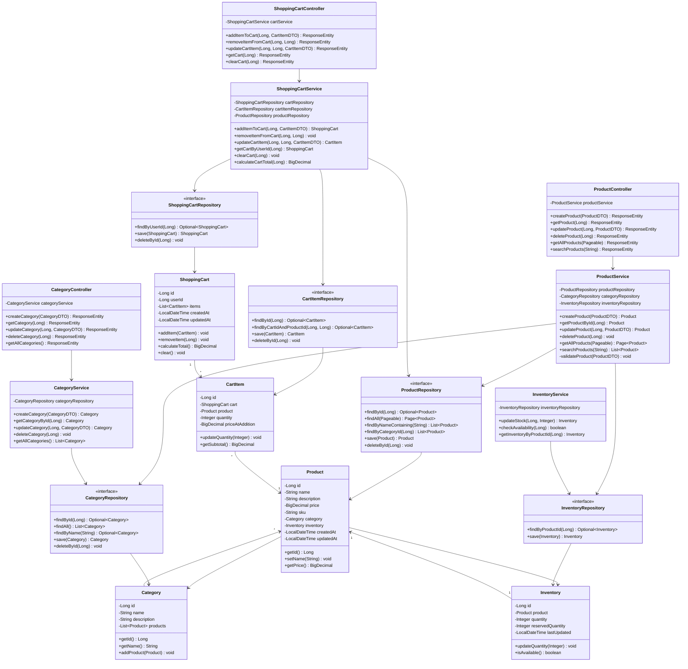

### 2.2 Entity Relationship Diagram

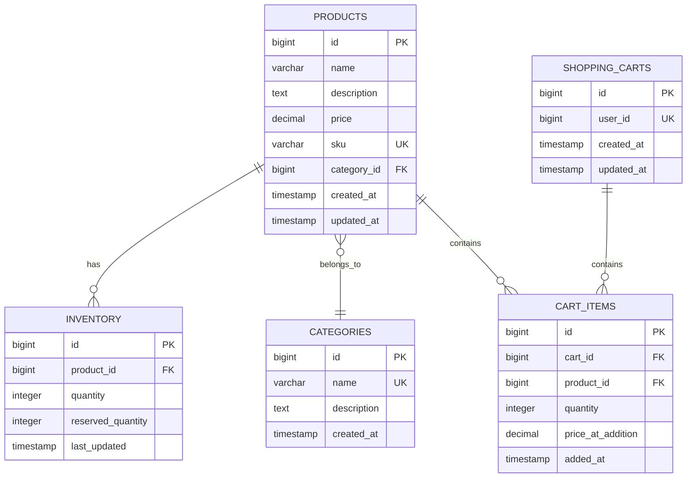

---

## 3. Sequence Diagrams

### 3.1 Create Product Flow

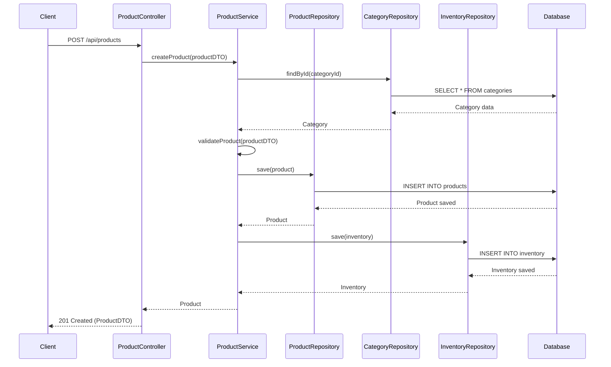

### 3.2 Get Product Flow

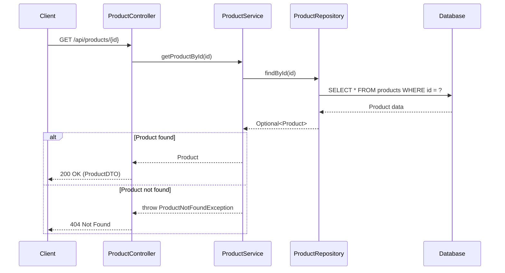

### 3.3 Update Product Flow

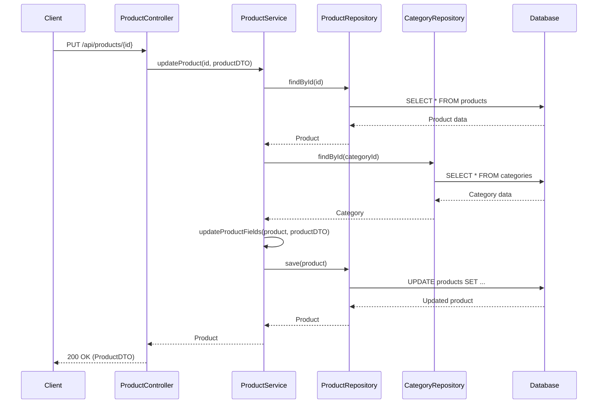

### 3.4 Delete Product Flow

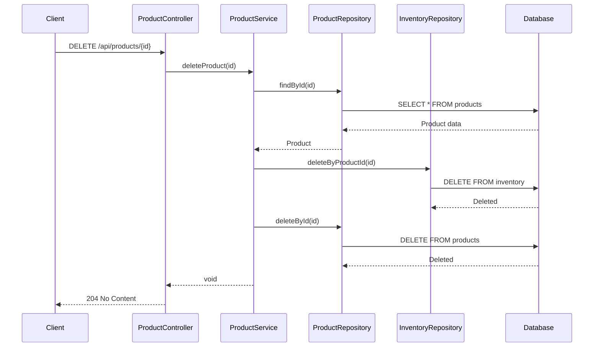

### 3.5 Search Products Flow

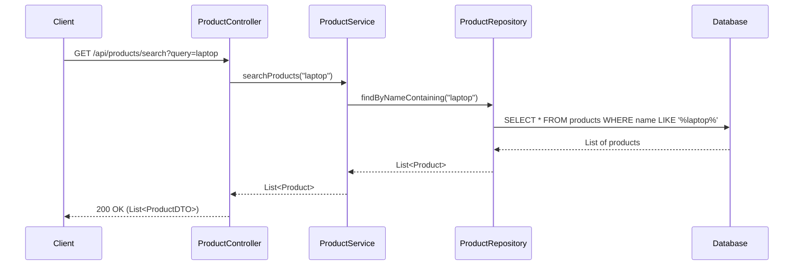

### 3.6 Create Category Flow

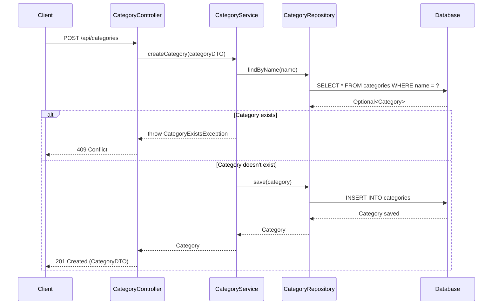

### 3.7 Update Inventory Flow

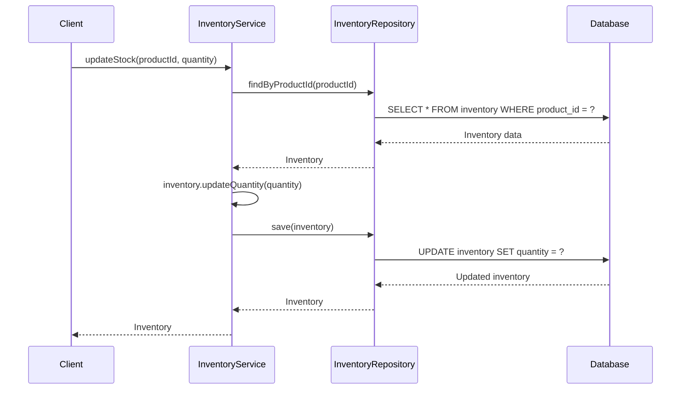

### 3.8 Add Item to Cart Flow

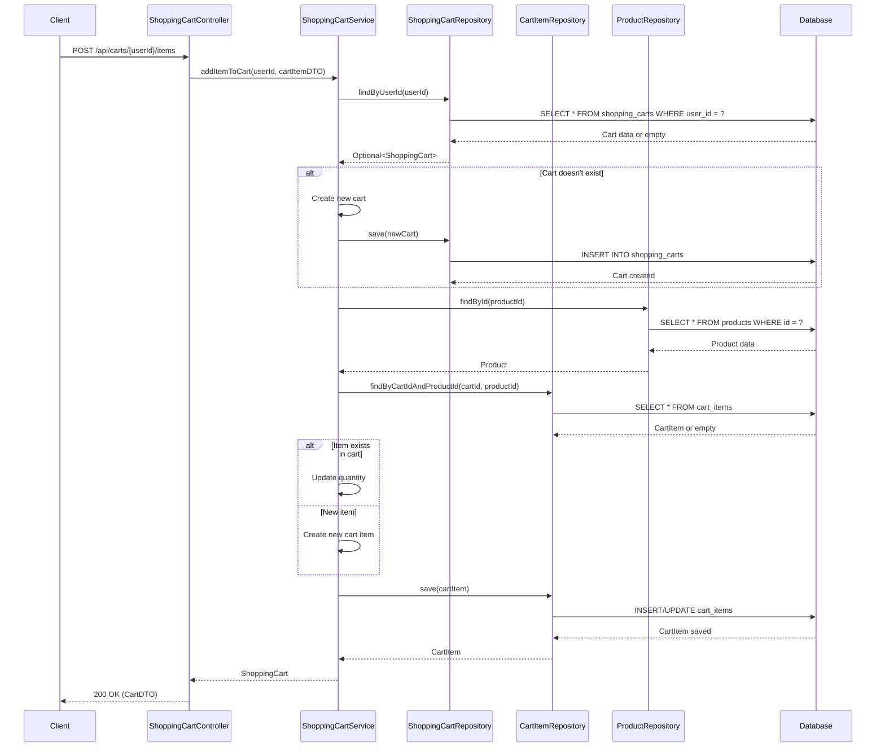

### 3.9 Remove Item from Cart Flow

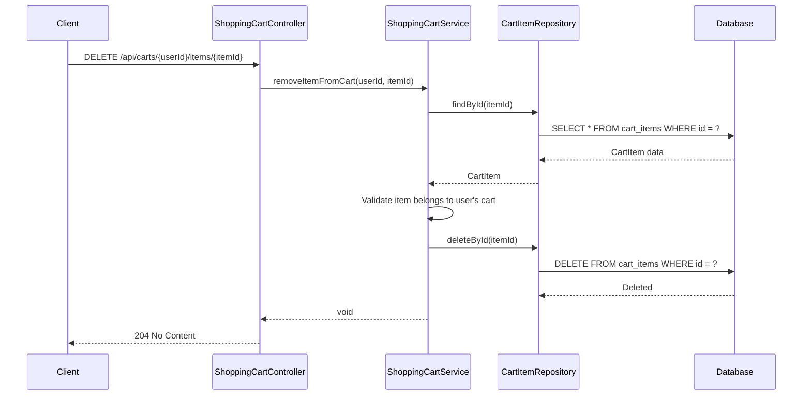

### 3.10 Update Cart Item Quantity Flow

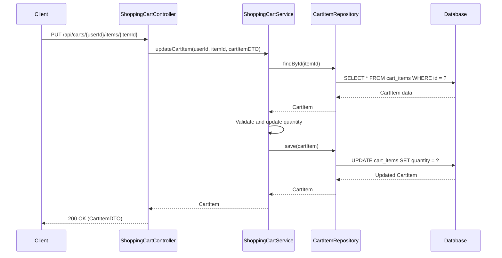

### 3.11 Get Cart Flow

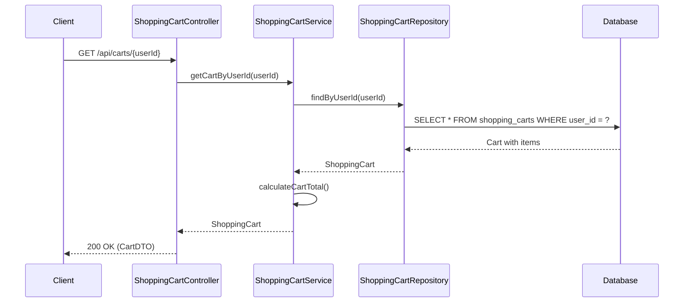

---

## 4. API Endpoints

### Product Management Endpoints

| Method | Endpoint | Description | Request Body | Response |
|--------|----------|-------------|--------------|----------|
| POST | `/api/products` | Create new product | ProductDTO | 201 Created |
| GET | `/api/products/{id}` | Get product by ID | - | 200 OK |
| PUT | `/api/products/{id}` | Update product | ProductDTO | 200 OK |
| DELETE | `/api/products/{id}` | Delete product | - | 204 No Content |
| GET | `/api/products` | Get all products (paginated) | - | 200 OK |
| GET | `/api/products/search` | Search products | query param | 200 OK |

### Category Management Endpoints

| Method | Endpoint | Description | Request Body | Response |
|--------|----------|-------------|--------------|----------|
| POST | `/api/categories` | Create new category | CategoryDTO | 201 Created |
| GET | `/api/categories/{id}` | Get category by ID | - | 200 OK |
| PUT | `/api/categories/{id}` | Update category | CategoryDTO | 200 OK |
| DELETE | `/api/categories/{id}` | Delete category | - | 204 No Content |
| GET | `/api/categories` | Get all categories | - | 200 OK |

### Inventory Management Endpoints

| Method | Endpoint | Description | Request Body | Response |
|--------|----------|-------------|--------------|----------|
| PUT | `/api/inventory/{productId}` | Update stock quantity | InventoryDTO | 200 OK |
| GET | `/api/inventory/{productId}` | Get inventory status | - | 200 OK |
| GET | `/api/inventory/{productId}/availability` | Check availability | - | 200 OK |

### Shopping Cart Management Endpoints

| Method | Endpoint | Description | Request Body | Response |
|--------|----------|-------------|--------------|----------|
| POST | `/api/carts/{userId}/items` | Add item to cart | CartItemDTO | 200 OK |
| DELETE | `/api/carts/{userId}/items/{itemId}` | Remove item from cart | - | 204 No Content |
| PUT | `/api/carts/{userId}/items/{itemId}` | Update cart item quantity | CartItemDTO | 200 OK |
| GET | `/api/carts/{userId}` | Get user's cart | - | 200 OK |
| DELETE | `/api/carts/{userId}` | Clear cart | - | 204 No Content |

---

## 5. Database Schema

### Products Table
```sql
CREATE TABLE products (
    id BIGSERIAL PRIMARY KEY,
    name VARCHAR(255) NOT NULL,
    description TEXT,
    price DECIMAL(10, 2) NOT NULL,
    sku VARCHAR(100) UNIQUE NOT NULL,
    category_id BIGINT,
    created_at TIMESTAMP DEFAULT CURRENT_TIMESTAMP,
    updated_at TIMESTAMP DEFAULT CURRENT_TIMESTAMP,
    FOREIGN KEY (category_id) REFERENCES categories(id) ON DELETE SET NULL
);

CREATE INDEX idx_products_category ON products(category_id);
CREATE INDEX idx_products_name ON products(name);
CREATE INDEX idx_products_sku ON products(sku);
```

### Categories Table
```sql
CREATE TABLE categories (
    id BIGSERIAL PRIMARY KEY,
    name VARCHAR(100) UNIQUE NOT NULL,
    description TEXT,
    created_at TIMESTAMP DEFAULT CURRENT_TIMESTAMP
);

CREATE INDEX idx_categories_name ON categories(name);
```

### Inventory Table
```sql
CREATE TABLE inventory (
    id BIGSERIAL PRIMARY KEY,
    product_id BIGINT UNIQUE NOT NULL,
    quantity INTEGER NOT NULL DEFAULT 0,
    reserved_quantity INTEGER NOT NULL DEFAULT 0,
    last_updated TIMESTAMP DEFAULT CURRENT_TIMESTAMP,
    FOREIGN KEY (product_id) REFERENCES products(id) ON DELETE CASCADE,
    CONSTRAINT chk_quantity CHECK (quantity >= 0),
    CONSTRAINT chk_reserved CHECK (reserved_quantity >= 0)
);

CREATE INDEX idx_inventory_product ON inventory(product_id);
```

### Shopping Carts Table
```sql
CREATE TABLE shopping_carts (
    id BIGSERIAL PRIMARY KEY,
    user_id BIGINT UNIQUE NOT NULL,
    created_at TIMESTAMP DEFAULT CURRENT_TIMESTAMP,
    updated_at TIMESTAMP DEFAULT CURRENT_TIMESTAMP
);

CREATE INDEX idx_shopping_carts_user ON shopping_carts(user_id);
```

### Cart Items Table
```sql
CREATE TABLE cart_items (
    id BIGSERIAL PRIMARY KEY,
    cart_id BIGINT NOT NULL,
    product_id BIGINT NOT NULL,
    quantity INTEGER NOT NULL DEFAULT 1,
    price_at_addition DECIMAL(10, 2) NOT NULL,
    added_at TIMESTAMP DEFAULT CURRENT_TIMESTAMP,
    FOREIGN KEY (cart_id) REFERENCES shopping_carts(id) ON DELETE CASCADE,
    FOREIGN KEY (product_id) REFERENCES products(id) ON DELETE CASCADE,
    CONSTRAINT chk_cart_quantity CHECK (quantity > 0),
    CONSTRAINT uq_cart_product UNIQUE (cart_id, product_id)
);

CREATE INDEX idx_cart_items_cart ON cart_items(cart_id);
CREATE INDEX idx_cart_items_product ON cart_items(product_id);
```

---

## 6. Data Transfer Objects (DTOs)

### ProductDTO
```java
public class ProductDTO {
    private Long id;
    private String name;
    private String description;
    private BigDecimal price;
    private String sku;
    private Long categoryId;
    private String categoryName;
    private Integer stockQuantity;
    private LocalDateTime createdAt;
    private LocalDateTime updatedAt;
    
    // Validation annotations
    @NotNull(message = "Product name is required")
    @Size(min = 3, max = 255)
    private String name;
    
    @NotNull(message = "Price is required")
    @DecimalMin(value = "0.0", inclusive = false)
    private BigDecimal price;
    
    @NotNull(message = "SKU is required")
    @Pattern(regexp = "^[A-Z0-9-]+$")
    private String sku;
}
```

### CategoryDTO
```java
public class CategoryDTO {
    private Long id;
    private String name;
    private String description;
    private Integer productCount;
    private LocalDateTime createdAt;
    
    @NotNull(message = "Category name is required")
    @Size(min = 2, max = 100)
    private String name;
}
```

### InventoryDTO
```java
public class InventoryDTO {
    private Long id;
    private Long productId;
    private Integer quantity;
    private Integer reservedQuantity;
    private Integer availableQuantity;
    private LocalDateTime lastUpdated;
    
    @NotNull(message = "Quantity is required")
    @Min(value = 0, message = "Quantity cannot be negative")
    private Integer quantity;
}
```

### CartDTO
```java
public class CartDTO {
    private Long id;
    private Long userId;
    private List<CartItemDTO> items;
    private BigDecimal totalAmount;
    private Integer totalItems;
    private LocalDateTime createdAt;
    private LocalDateTime updatedAt;
}
```

### CartItemDTO
```java
public class CartItemDTO {
    private Long id;
    private Long productId;
    private String productName;
    private Integer quantity;
    private BigDecimal priceAtAddition;
    private BigDecimal subtotal;
    private LocalDateTime addedAt;
    
    @NotNull(message = "Product ID is required")
    private Long productId;
    
    @NotNull(message = "Quantity is required")
    @Min(value = 1, message = "Quantity must be at least 1")
    private Integer quantity;
}
```

---

## 7. Design Patterns Used

### 7.1 Repository Pattern
- Abstracts data access logic
- Provides clean separation between business logic and data access
- Implemented via Spring Data JPA interfaces

### 7.2 Service Layer Pattern
- Encapsulates business logic
- Provides transaction management
- Coordinates between controllers and repositories

### 7.3 DTO Pattern
- Separates internal domain models from API contracts
- Provides data validation
- Reduces over-fetching and under-fetching

### 7.4 Controller Pattern
- Handles HTTP requests/responses
- Delegates business logic to service layer
- Manages request validation and error handling

### 7.5 Aggregate Pattern
- ShoppingCart acts as an aggregate root managing CartItems
- Ensures consistency of cart operations
- Encapsulates cart business rules and invariants
- Controls access to cart items through the cart entity

---

## 8. Key Features

### 8.1 Product Management
- Full CRUD operations for products
- SKU-based unique identification
- Category association
- Automatic timestamp management
- Soft delete capability (can be implemented)

### 8.2 Category Management
- Hierarchical category structure support
- Product count tracking
- Cascade delete prevention for categories with products

### 8.3 Inventory Tracking
- Real-time stock quantity management
- Reserved quantity for pending orders
- Available quantity calculation
- Low stock alerts (can be implemented)

### 8.4 Search and Filter
- Product name search
- Category-based filtering
- Price range filtering (can be implemented)
- Pagination support

### 8.5 Shopping Cart Management
- User-specific cart management
- Add/remove/update cart items
- Automatic cart creation on first item addition
- Price preservation at time of addition
- Real-time cart total calculation
- Duplicate product prevention in cart
- Quantity validation
- Cart persistence across sessions

---

## 9. Error Handling

### Exception Hierarchy
```java
public class ProductNotFoundException extends RuntimeException {
    public ProductNotFoundException(Long id) {
        super("Product not found with id: " + id);
    }
}

public class CategoryNotFoundException extends RuntimeException {
    public CategoryNotFoundException(Long id) {
        super("Category not found with id: " + id);
    }
}

public class CategoryExistsException extends RuntimeException {
    public CategoryExistsException(String name) {
        super("Category already exists with name: " + name);
    }
}

public class InsufficientStockException extends RuntimeException {
    public InsufficientStockException(Long productId) {
        super("Insufficient stock for product: " + productId);
    }
}

public class InvalidProductDataException extends RuntimeException {
    public InvalidProductDataException(String message) {
        super(message);
    }
}
```

### Global Exception Handler
```java
@RestControllerAdvice
public class GlobalExceptionHandler {
    
    @ExceptionHandler(ProductNotFoundException.class)
    public ResponseEntity<ErrorResponse> handleProductNotFound(ProductNotFoundException ex) {
        ErrorResponse error = new ErrorResponse(
            HttpStatus.NOT_FOUND.value(),
            ex.getMessage(),
            LocalDateTime.now()
        );
        return new ResponseEntity<>(error, HttpStatus.NOT_FOUND);
    }
    
    @ExceptionHandler(MethodArgumentNotValidException.class)
    public ResponseEntity<ErrorResponse> handleValidationErrors(MethodArgumentNotValidException ex) {
        List<String> errors = ex.getBindingResult()
            .getFieldErrors()
            .stream()
            .map(FieldError::getDefaultMessage)
            .collect(Collectors.toList());
        
        ErrorResponse error = new ErrorResponse(
            HttpStatus.BAD_REQUEST.value(),
            "Validation failed",
            errors,
            LocalDateTime.now()
        );
        return new ResponseEntity<>(error, HttpStatus.BAD_REQUEST);
    }
    
    @ExceptionHandler(Exception.class)
    public ResponseEntity<ErrorResponse> handleGenericException(Exception ex) {
        ErrorResponse error = new ErrorResponse(
            HttpStatus.INTERNAL_SERVER_ERROR.value(),
            "An unexpected error occurred",
            LocalDateTime.now()
        );
        return new ResponseEntity<>(error, HttpStatus.INTERNAL_SERVER_ERROR);
    }
}
```

---

## 10. Security Considerations

### 10.1 Input Validation
- All DTOs use Bean Validation annotations
- SQL injection prevention via parameterized queries (JPA)
- XSS prevention through input sanitization

### 10.2 Authentication & Authorization
- JWT-based authentication (to be implemented)
- Role-based access control (ADMIN, USER)
- Endpoint security configuration

### 10.3 Data Protection
- Sensitive data encryption
- HTTPS enforcement
- CORS configuration

---

## 11. Performance Optimization

### 11.1 Database Optimization
- Proper indexing on frequently queried columns
- Connection pooling (HikariCP)
- Query optimization
- Lazy loading for relationships

### 11.2 Caching Strategy
- Redis cache for frequently accessed products
- Category cache
- Cache invalidation on updates

### 11.3 Pagination
- Implemented for product listing
- Configurable page size
- Prevents memory issues with large datasets

---

## 12. Testing Strategy

### 12.1 Unit Tests
- Service layer tests with mocked repositories
- Repository tests with H2 in-memory database
- DTO validation tests

### 12.2 Integration Tests
- Controller tests with MockMvc
- End-to-end API tests
- Database integration tests

### 12.3 Test Coverage Goals
- Minimum 80% code coverage
- Critical path coverage: 100%

---

## 13. Deployment Architecture

### 13.1 Environment Configuration
- Development: Local PostgreSQL
- Staging: Cloud-hosted PostgreSQL
- Production: Managed database service

### 13.2 CI/CD Pipeline
- Automated builds on commit
- Automated testing
- Docker containerization
- Kubernetes deployment

---

## 14. Monitoring and Logging

### 14.1 Logging
- SLF4J with Logback
- Structured logging (JSON format)
- Log levels: ERROR, WARN, INFO, DEBUG
- Request/Response logging

### 14.2 Monitoring
- Spring Boot Actuator endpoints
- Prometheus metrics
- Grafana dashboards
- Application health checks

---

## 15. Future Enhancements

1. **Product Reviews and Ratings**
   - User review system
   - Rating aggregation
   - Review moderation

2. **Advanced Search**
   - Elasticsearch integration
   - Faceted search
   - Auto-complete suggestions

3. **Recommendation Engine**
   - Collaborative filtering
   - Content-based recommendations
   - Personalized product suggestions

4. **Multi-language Support**
   - Internationalization (i18n)
   - Localized product descriptions
   - Currency conversion

5. **Image Management**
   - Product image upload
   - Image optimization
   - CDN integration

6. **Order Management Integration**
   - Cart to order conversion
   - Order history
   - Payment processing

---

## 16. Appendix

### 16.1 Glossary
- **SKU**: Stock Keeping Unit - Unique product identifier
- **DTO**: Data Transfer Object - Object for data transfer between layers
- **JPA**: Java Persistence API - ORM specification
- **CRUD**: Create, Read, Update, Delete operations

### 16.2 References
- Spring Boot Documentation: https://spring.io/projects/spring-boot
- Spring Data JPA: https://spring.io/projects/spring-data-jpa
- PostgreSQL Documentation: https://www.postgresql.org/docs/
- RESTful API Design Best Practices

### 16.3 Version History
| Version | Date | Author | Changes |
|---------|------|--------|----------|
| 1.0 | 2024-01-15 | Development Team | Initial LLD document |
| 1.1 | 2024-01-20 | Development Team | Added error handling section |
| 1.2 | 2024-01-25 | Development Team | Added shopping cart management |

---

**Document Status**: Approved  
**Last Updated**: 2024-01-25  
**Next Review Date**: 2024-02-25