# Low Level Design Document

## E-commerce Product Management System

### Version: 1.1
### Date: 2024
### Story: SCRUM-1140 - Shopping Cart Management

---

## 1. Project Overview

This document provides the Low Level Design (LLD) for an E-commerce system built using Spring Boot and Java 21. The system includes the following modules:

- **ProductManagement**: Handles product-related operations
- **ShoppingCartManagement**: Manages shopping cart and cart items

---

## 2. System Architecture

### 2.1 Class Diagram

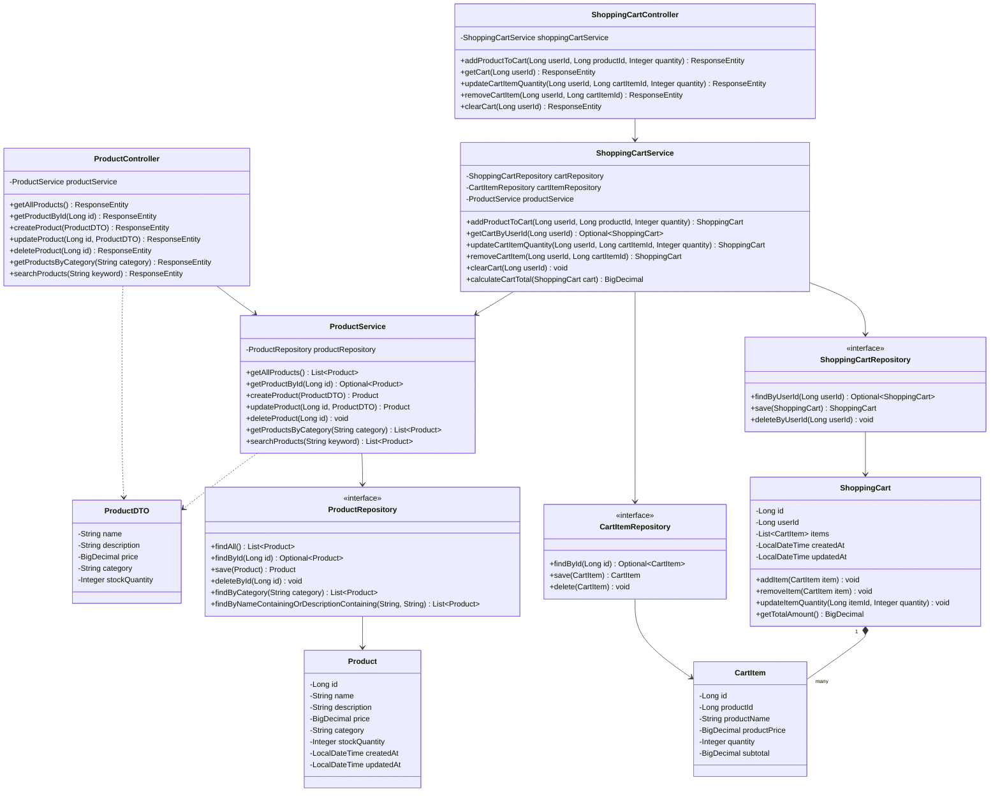

### 2.2 Entity Relationship Diagram

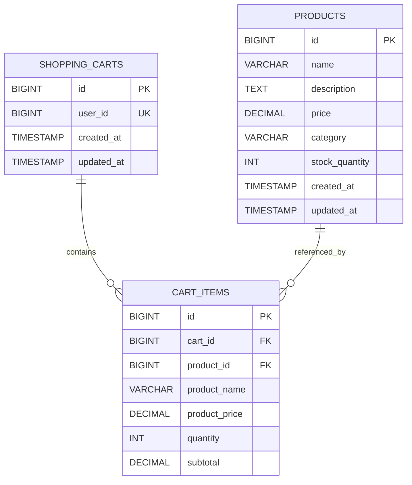

---

## 3. Sequence Diagrams

### 3.1 Get All Products

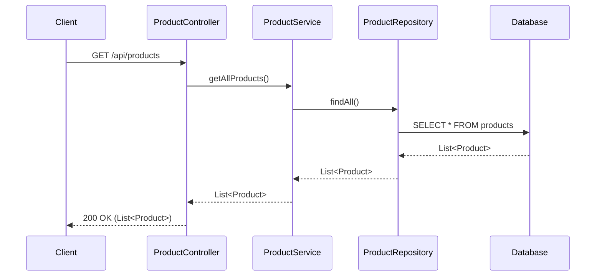

### 3.2 Get Product By ID

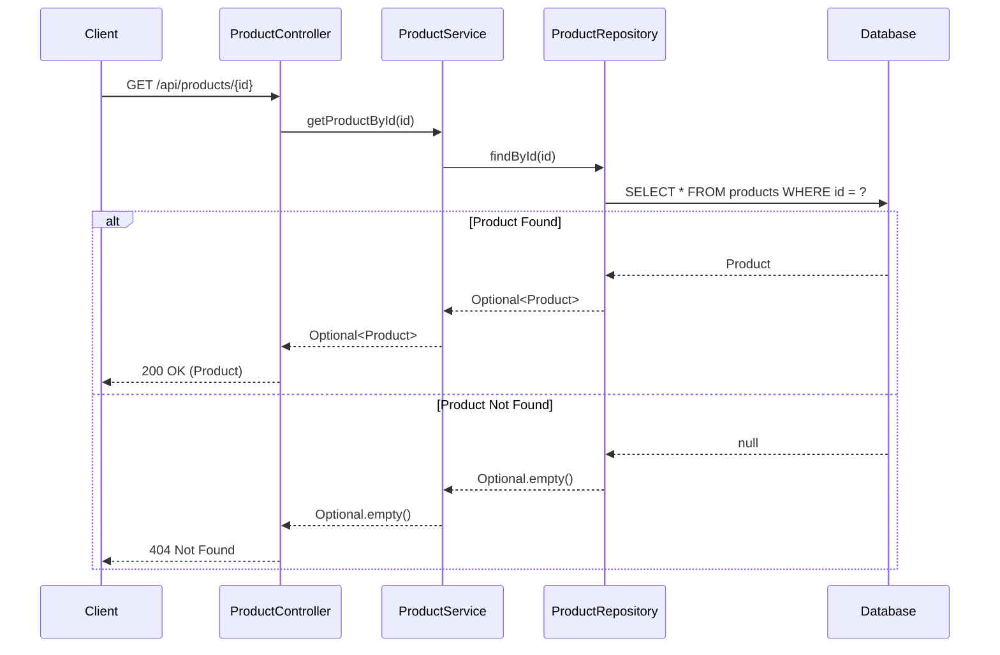

### 3.3 Create Product

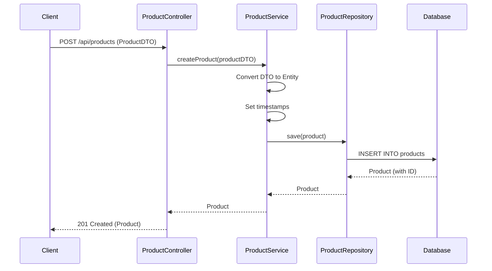

### 3.4 Update Product

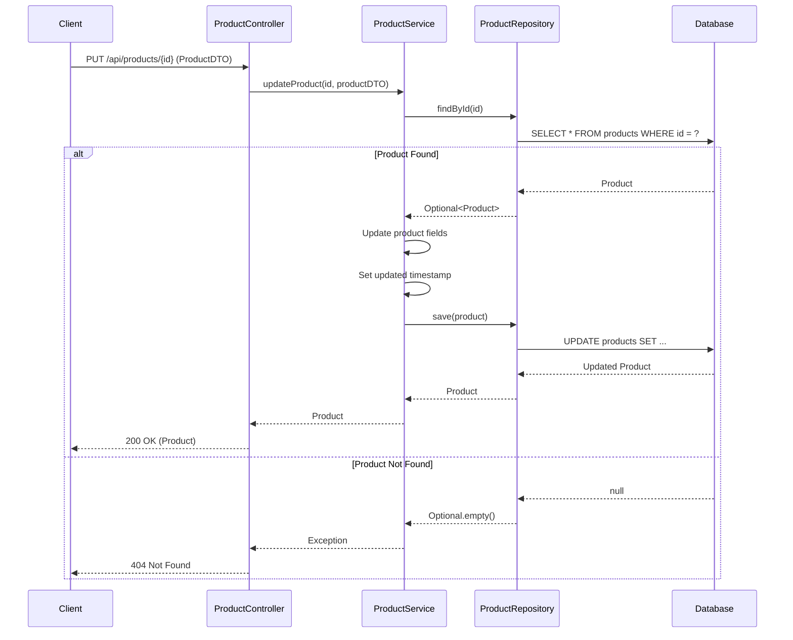

### 3.5 Delete Product

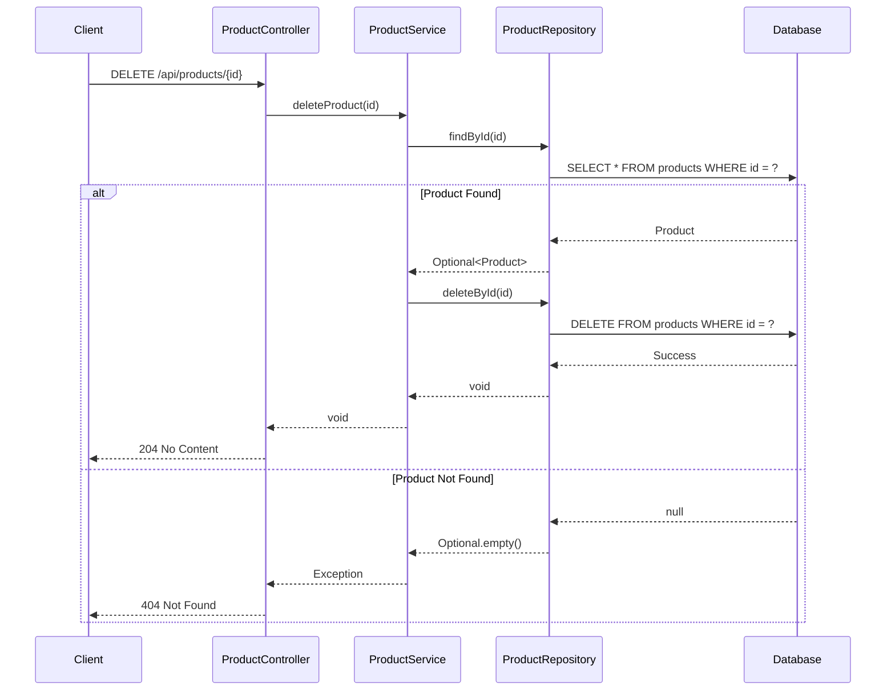

### 3.6 Get Products By Category


### 3.7 Search Products

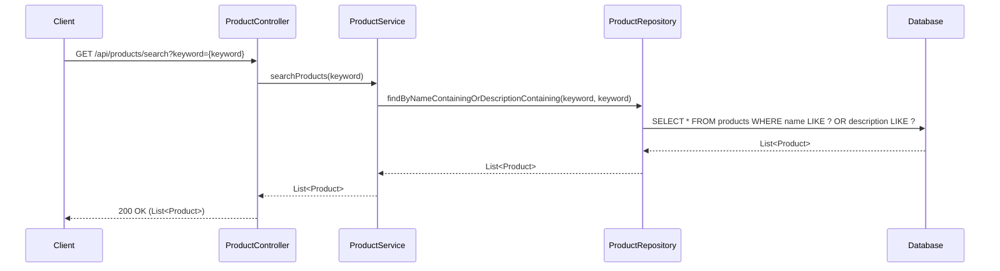

### 3.8 Add Product to Cart

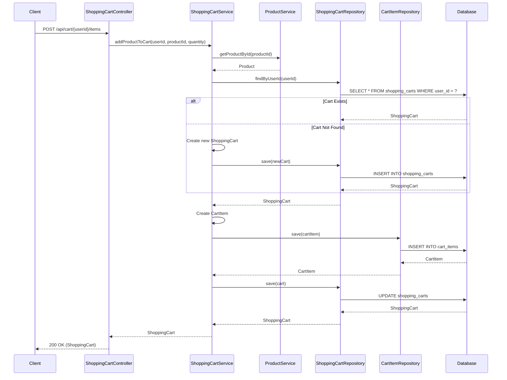

### 3.9 View Shopping Cart

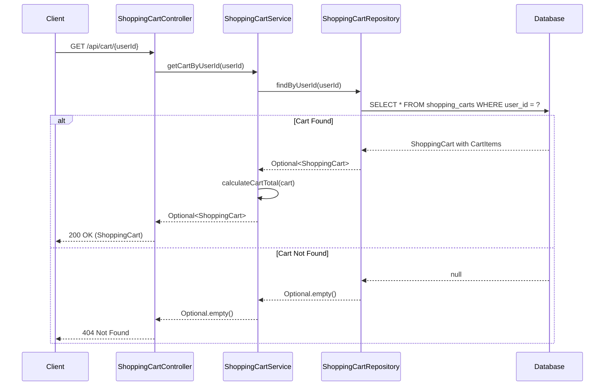

### 3.10 Update Cart Item Quantity

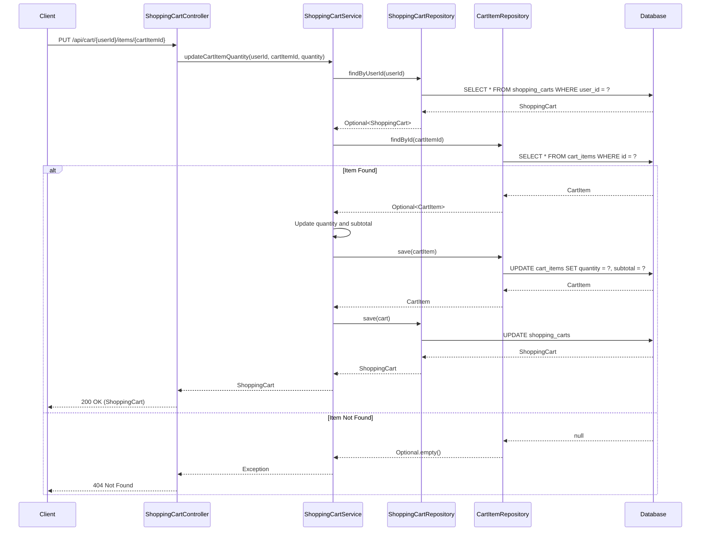

### 3.11 Remove Item from Cart

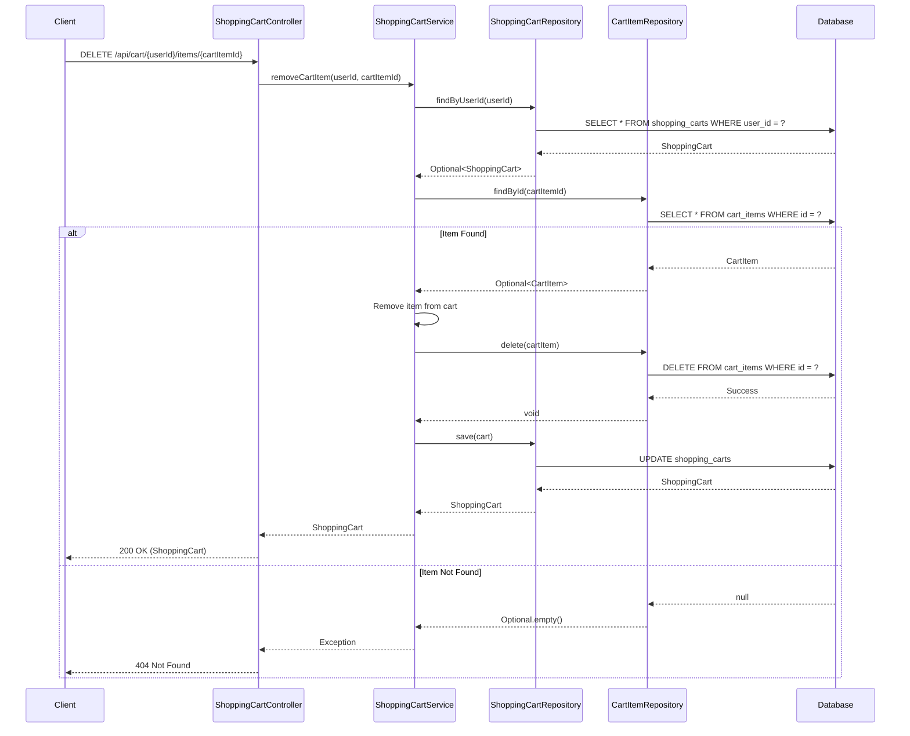

---

## 4. API Endpoints Summary

### Product Management Endpoints

| Method | Endpoint | Description | Request Body | Response |
|--------|----------|-------------|--------------|----------|
| GET | `/api/products` | Get all products | None | List of Products |
| GET | `/api/products/{id}` | Get product by ID | None | Product or 404 |
| POST | `/api/products` | Create new product | ProductDTO | Created Product |
| PUT | `/api/products/{id}` | Update product | ProductDTO | Updated Product |
| DELETE | `/api/products/{id}` | Delete product | None | 204 No Content |
| GET | `/api/products/category/{category}` | Get products by category | None | List of Products |
| GET | `/api/products/search?keyword={keyword}` | Search products | None | List of Products |

### Shopping Cart Management Endpoints

| Method | Endpoint | Description | Request Body | Response |
|--------|----------|-------------|--------------|----------|
| POST | `/api/cart/{userId}/items` | Add product to cart | {"productId": Long, "quantity": Integer} | ShoppingCart |
| GET | `/api/cart/{userId}` | Get user's shopping cart | None | ShoppingCart or 404 |
| PUT | `/api/cart/{userId}/items/{cartItemId}` | Update cart item quantity | {"quantity": Integer} | ShoppingCart |
| DELETE | `/api/cart/{userId}/items/{cartItemId}` | Remove item from cart | None | ShoppingCart |
| DELETE | `/api/cart/{userId}` | Clear entire cart | None | 204 No Content |

---

## 5. Database Schema

### Products Table

```sql
CREATE TABLE products (
    id BIGINT AUTO_INCREMENT PRIMARY KEY,
    name VARCHAR(255) NOT NULL,
    description TEXT,
    price DECIMAL(10, 2) NOT NULL,
    category VARCHAR(100) NOT NULL,
    stock_quantity INT NOT NULL DEFAULT 0,
    created_at TIMESTAMP DEFAULT CURRENT_TIMESTAMP,
    updated_at TIMESTAMP DEFAULT CURRENT_TIMESTAMP ON UPDATE CURRENT_TIMESTAMP,
    INDEX idx_category (category),
    INDEX idx_name (name)
);
```

### Shopping Carts Table

```sql
CREATE TABLE shopping_carts (
    id BIGINT AUTO_INCREMENT PRIMARY KEY,
    user_id BIGINT NOT NULL UNIQUE,
    created_at TIMESTAMP DEFAULT CURRENT_TIMESTAMP,
    updated_at TIMESTAMP DEFAULT CURRENT_TIMESTAMP ON UPDATE CURRENT_TIMESTAMP,
    INDEX idx_user_id (user_id)
);
```

### Cart Items Table

```sql
CREATE TABLE cart_items (
    id BIGINT AUTO_INCREMENT PRIMARY KEY,
    cart_id BIGINT NOT NULL,
    product_id BIGINT NOT NULL,
    product_name VARCHAR(255) NOT NULL,
    product_price DECIMAL(10, 2) NOT NULL,
    quantity INT NOT NULL DEFAULT 1,
    subtotal DECIMAL(10, 2) NOT NULL,
    FOREIGN KEY (cart_id) REFERENCES shopping_carts(id) ON DELETE CASCADE,
    FOREIGN KEY (product_id) REFERENCES products(id),
    INDEX idx_cart_id (cart_id),
    INDEX idx_product_id (product_id)
);
```

---

## 6. Technology Stack

- **Framework**: Spring Boot 3.x
- **Language**: Java 21
- **Database**: MySQL/PostgreSQL
- **ORM**: Spring Data JPA (Hibernate)
- **Build Tool**: Maven/Gradle
- **API Documentation**: SpringDoc OpenAPI (Swagger)
- **Validation**: Jakarta Bean Validation
- **Logging**: SLF4J with Logback

---

## 7. Design Patterns Used

### 7.1 Repository Pattern
- Abstracts data access logic
- Provides a collection-like interface for accessing domain objects
- Implemented through Spring Data JPA repositories

### 7.2 Service Layer Pattern
- Encapsulates business logic
- Provides transaction management
- Acts as a facade between controllers and repositories

### 7.3 DTO Pattern
- Separates internal domain models from API contracts
- Reduces coupling between layers
- Provides data validation at API boundary

### 7.4 RESTful API Pattern
- Resource-based URLs
- Standard HTTP methods (GET, POST, PUT, DELETE)
- Stateless communication
- Proper HTTP status codes

### 7.5 Aggregate Pattern
- ShoppingCart acts as an aggregate root
- CartItems are managed through the ShoppingCart aggregate
- Ensures consistency of cart operations
- Encapsulates business rules for cart management

---

## 8. Key Features

### Product Management
- **CRUD Operations**: Complete Create, Read, Update, Delete functionality
- **Category Filtering**: Filter products by category
- **Search Functionality**: Search products by name or description
- **Stock Management**: Track product inventory
- **Timestamp Tracking**: Automatic creation and update timestamps
- **Data Validation**: Input validation using Bean Validation
- **Error Handling**: Proper exception handling with meaningful error messages

### Shopping Cart Management
- **Cart Creation**: Automatic cart creation for new users
- **Add to Cart**: Add products with specified quantities
- **View Cart**: Retrieve complete cart with all items and total
- **Update Quantity**: Modify item quantities in cart
- **Remove Items**: Delete specific items from cart
- **Clear Cart**: Remove all items from cart
- **Total Calculation**: Automatic calculation of cart total
- **Product Integration**: Real-time product information synchronization
- **Cascade Operations**: Automatic cleanup of cart items when cart is deleted

---

## 9. Error Handling

- **404 Not Found**: When product or cart is not found
- **400 Bad Request**: For invalid input data
- **500 Internal Server Error**: For unexpected server errors
- Custom exception classes for domain-specific errors

---

## 10. Future Enhancements

- Add pagination for product listings
- Implement caching for frequently accessed products
- Add product images support
- Implement product reviews and ratings
- Add inventory management with low stock alerts
- Implement user authentication and authorization
- Add cart expiration and cleanup mechanisms
- Implement wishlist functionality
- Add promotional codes and discounts
- Implement order creation from cart

---

**Document Version Control**
- Version 1.0: Initial Product Management LLD
- Version 1.1: Added Shopping Cart Management (Story SCRUM-1140)

**Prepared by**: Development Team  
**Reviewed by**: Technical Lead  
**Approved by**: Project Manager