# Low Level Design Document
## E-commerce Product Management System

---

## 1. Project Overview

### 1.1 Purpose
This Low Level Design (LLD) document provides detailed technical specifications for the E-commerce Product Management System. It describes the system architecture, component interactions, data models, and implementation details necessary for development.

### 1.2 Scope
The system manages:
- Product catalog and inventory
- User authentication and authorization
- Order processing and management
- Shopping cart functionality
- Payment integration
- Notification services

### 1.3 Technology Stack
- **Backend**: Java 17, Spring Boot 3.x
- **Database**: PostgreSQL 14+
- **Cache**: Redis
- **Message Queue**: RabbitMQ
- **API Documentation**: OpenAPI 3.0 (Swagger)
- **Build Tool**: Maven
- **Version Control**: Git

### 1.4 Module Structure
The system is organized into the following modules:
- UserManagement
- ProductCatalog
- InventoryManagement
- OrderProcessing
- PaymentGateway
- NotificationService
- ShoppingCartManagement

---

## 2. System Architecture

### 2.1 Class Diagram

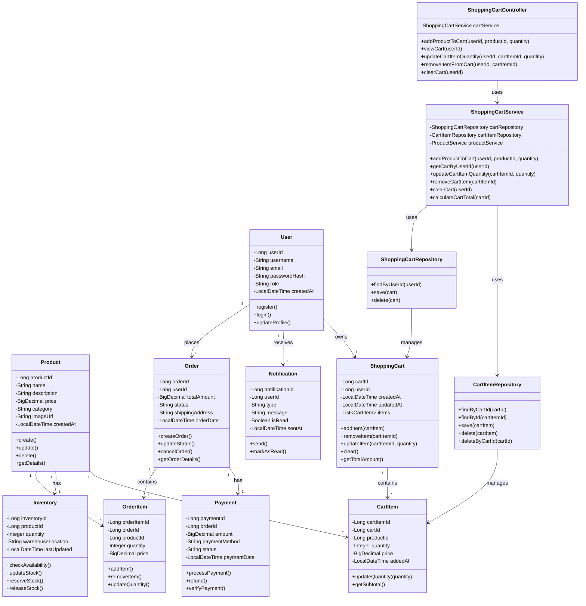

### 2.2 Entity Relationship Diagram

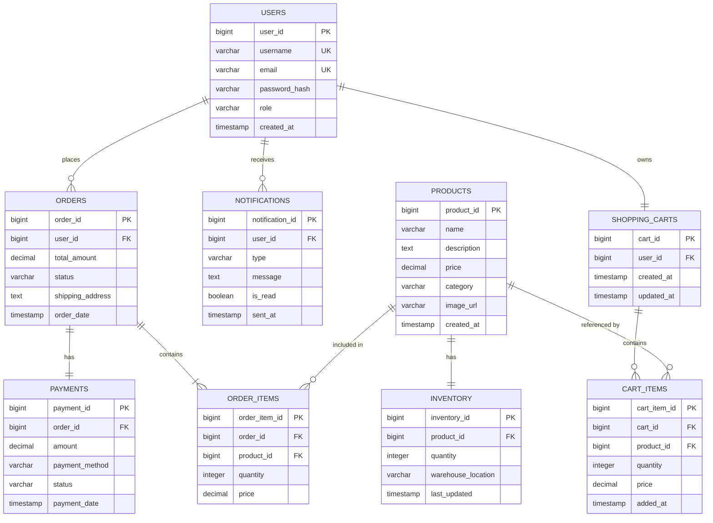

---

## 3. Sequence Diagrams

### 3.1 User Registration

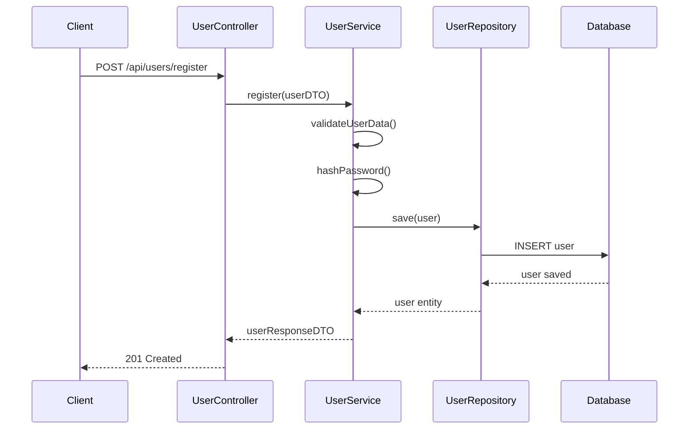

### 3.2 User Login

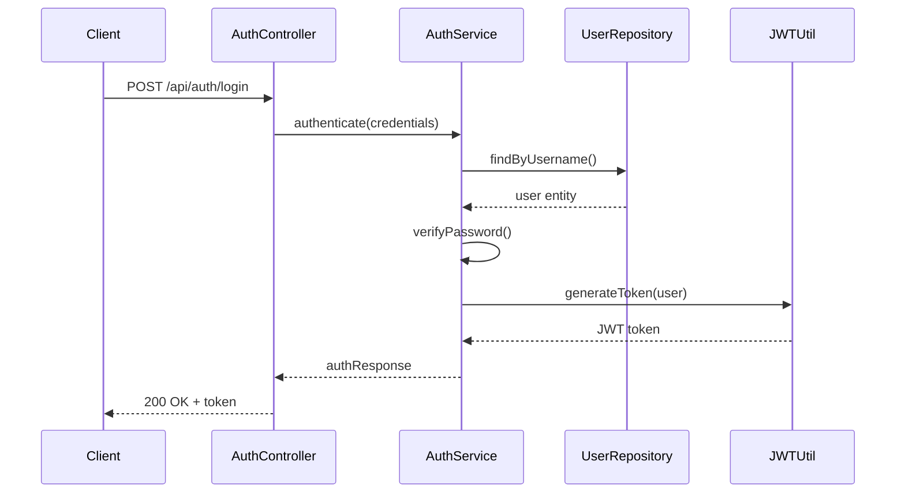

### 3.3 Create Product

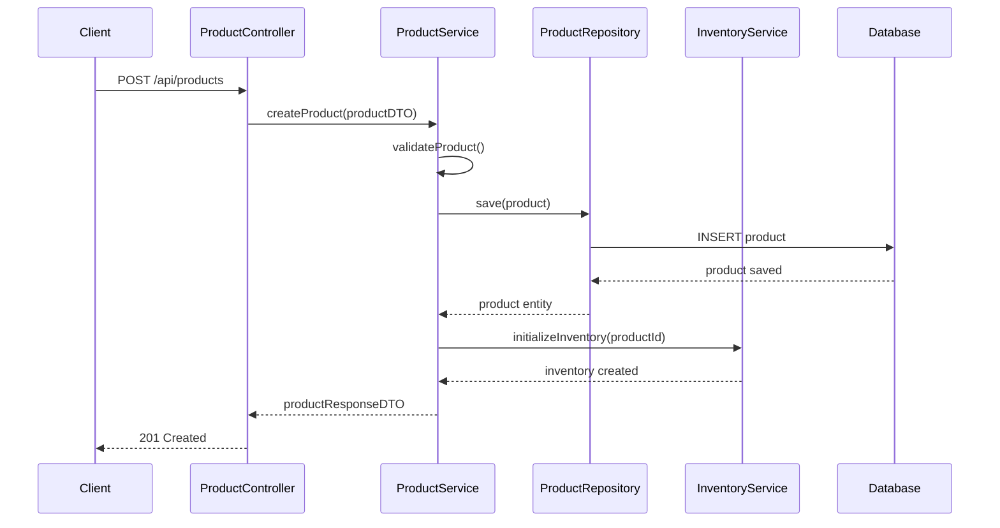

### 3.4 Update Inventory

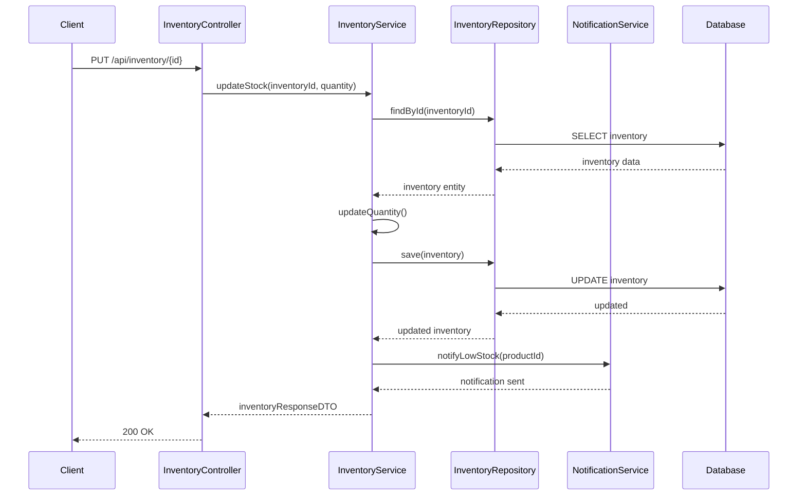

### 3.5 Create Order

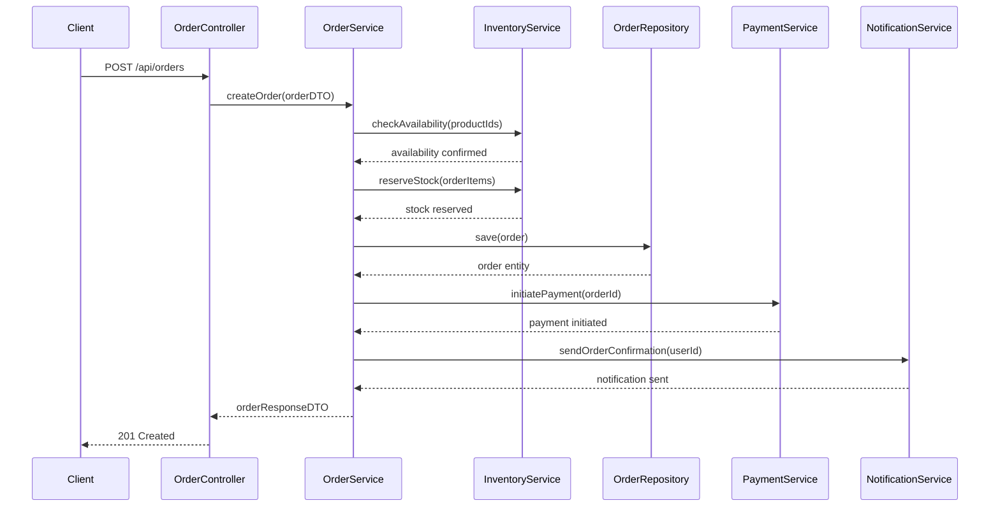

### 3.6 Process Payment

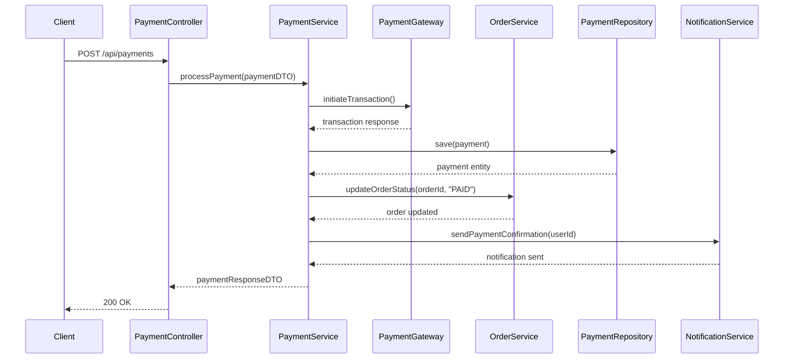

### 3.7 Get Product Details

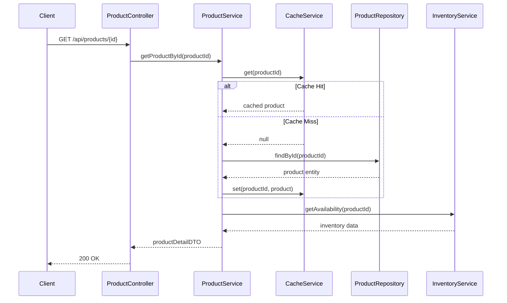

### 3.8 Add Product to Cart

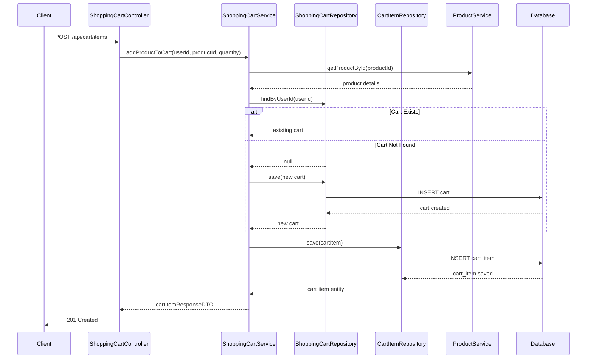

### 3.9 View Shopping Cart

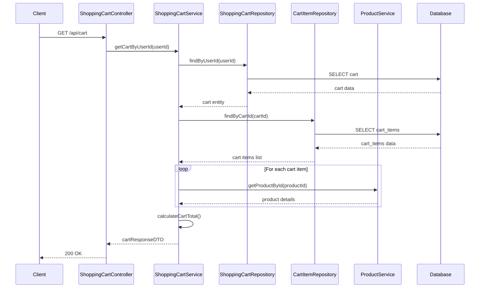

### 3.10 Update Cart Item Quantity

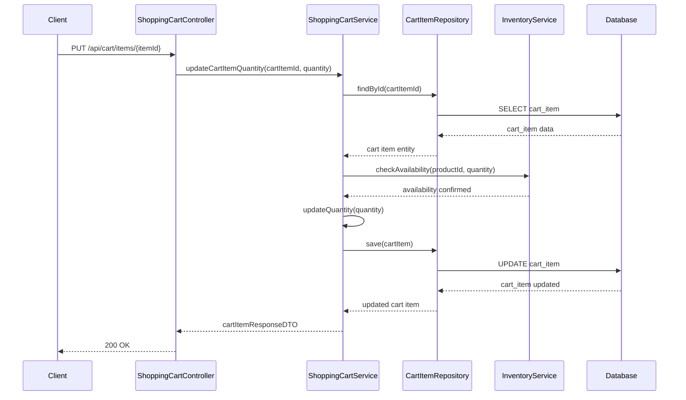

### 3.11 Remove Item from Cart

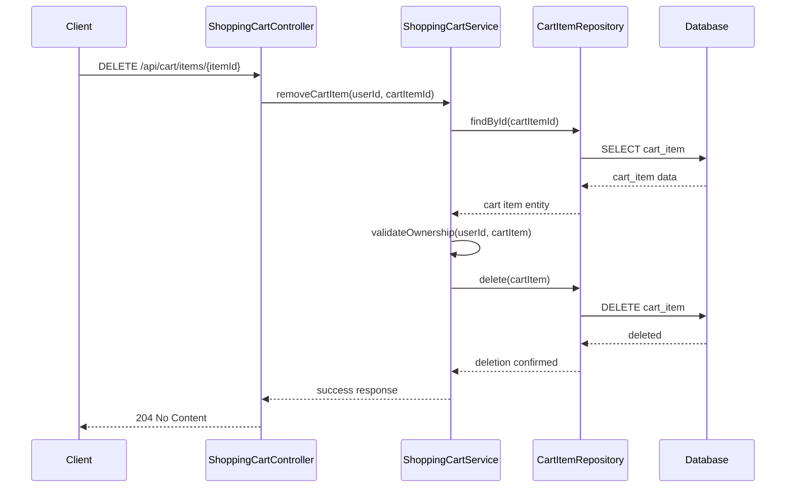

---

## 4. API Endpoints

### User Management

| Method | Endpoint | Description | Request Body | Response |
|--------|----------|-------------|--------------|----------|
| POST | /api/users/register | Register new user | UserRegistrationDTO | UserResponseDTO |
| POST | /api/auth/login | User login | LoginCredentialsDTO | AuthResponseDTO |
| GET | /api/users/{id} | Get user profile | - | UserResponseDTO |
| PUT | /api/users/{id} | Update user profile | UserUpdateDTO | UserResponseDTO |
| DELETE | /api/users/{id} | Delete user | - | 204 No Content |

### Product Management

| Method | Endpoint | Description | Request Body | Response |
|--------|----------|-------------|--------------|----------|
| POST | /api/products | Create product | ProductCreateDTO | ProductResponseDTO |
| GET | /api/products | List all products | Query params | List<ProductResponseDTO> |
| GET | /api/products/{id} | Get product details | - | ProductDetailDTO |
| PUT | /api/products/{id} | Update product | ProductUpdateDTO | ProductResponseDTO |
| DELETE | /api/products/{id} | Delete product | - | 204 No Content |
| GET | /api/products/search | Search products | Query params | List<ProductResponseDTO> |

### Inventory Management

| Method | Endpoint | Description | Request Body | Response |
|--------|----------|-------------|--------------|----------|
| GET | /api/inventory/{productId} | Get inventory | - | InventoryResponseDTO |
| PUT | /api/inventory/{id} | Update stock | InventoryUpdateDTO | InventoryResponseDTO |
| POST | /api/inventory/reserve | Reserve stock | StockReservationDTO | ReservationResponseDTO |
| POST | /api/inventory/release | Release stock | StockReleaseDTO | 200 OK |

### Order Management

| Method | Endpoint | Description | Request Body | Response |
|--------|----------|-------------|--------------|----------|
| POST | /api/orders | Create order | OrderCreateDTO | OrderResponseDTO |
| GET | /api/orders/{id} | Get order details | - | OrderDetailDTO |
| GET | /api/orders/user/{userId} | Get user orders | Query params | List<OrderResponseDTO> |
| PUT | /api/orders/{id}/status | Update order status | OrderStatusUpdateDTO | OrderResponseDTO |
| DELETE | /api/orders/{id} | Cancel order | - | 200 OK |

### Payment Management

| Method | Endpoint | Description | Request Body | Response |
|--------|----------|-------------|--------------|----------|
| POST | /api/payments | Process payment | PaymentRequestDTO | PaymentResponseDTO |
| GET | /api/payments/{id} | Get payment details | - | PaymentResponseDTO |
| POST | /api/payments/{id}/refund | Refund payment | RefundRequestDTO | RefundResponseDTO |
| GET | /api/payments/order/{orderId} | Get order payments | - | List<PaymentResponseDTO> |

### Notification Management

| Method | Endpoint | Description | Request Body | Response |
|--------|----------|-------------|--------------|----------|
| GET | /api/notifications/user/{userId} | Get user notifications | Query params | List<NotificationResponseDTO> |
| PUT | /api/notifications/{id}/read | Mark as read | - | NotificationResponseDTO |
| DELETE | /api/notifications/{id} | Delete notification | - | 204 No Content |

### Shopping Cart Management Endpoints

| Method | Endpoint | Description | Request Body | Response |
|--------|----------|-------------|--------------|----------|
| POST | /api/cart/items | Add product to cart | AddToCartDTO | CartItemResponseDTO |
| GET | /api/cart | View shopping cart | - | ShoppingCartResponseDTO |
| PUT | /api/cart/items/{itemId} | Update cart item quantity | UpdateCartItemDTO | CartItemResponseDTO |
| DELETE | /api/cart/items/{itemId} | Remove item from cart | - | 204 No Content |
| DELETE | /api/cart | Clear cart | - | 204 No Content |
| GET | /api/cart/total | Get cart total | - | CartTotalResponseDTO |

---

## 5. Database Schema

### Users Table
```sql
CREATE TABLE users (
    user_id BIGSERIAL PRIMARY KEY,
    username VARCHAR(50) UNIQUE NOT NULL,
    email VARCHAR(100) UNIQUE NOT NULL,
    password_hash VARCHAR(255) NOT NULL,
    role VARCHAR(20) NOT NULL DEFAULT 'CUSTOMER',
    created_at TIMESTAMP DEFAULT CURRENT_TIMESTAMP,
    updated_at TIMESTAMP DEFAULT CURRENT_TIMESTAMP
);

CREATE INDEX idx_users_email ON users(email);
CREATE INDEX idx_users_username ON users(username);
```

### Products Table
```sql
CREATE TABLE products (
    product_id BIGSERIAL PRIMARY KEY,
    name VARCHAR(200) NOT NULL,
    description TEXT,
    price DECIMAL(10, 2) NOT NULL,
    category VARCHAR(50),
    image_url VARCHAR(500),
    created_at TIMESTAMP DEFAULT CURRENT_TIMESTAMP,
    updated_at TIMESTAMP DEFAULT CURRENT_TIMESTAMP
);

CREATE INDEX idx_products_category ON products(category);
CREATE INDEX idx_products_name ON products(name);
```

### Inventory Table
```sql
CREATE TABLE inventory (
    inventory_id BIGSERIAL PRIMARY KEY,
    product_id BIGINT NOT NULL REFERENCES products(product_id) ON DELETE CASCADE,
    quantity INTEGER NOT NULL DEFAULT 0,
    warehouse_location VARCHAR(100),
    last_updated TIMESTAMP DEFAULT CURRENT_TIMESTAMP,
    CONSTRAINT fk_inventory_product FOREIGN KEY (product_id) REFERENCES products(product_id)
);

CREATE UNIQUE INDEX idx_inventory_product ON inventory(product_id);
```

### Orders Table
```sql
CREATE TABLE orders (
    order_id BIGSERIAL PRIMARY KEY,
    user_id BIGINT NOT NULL REFERENCES users(user_id),
    total_amount DECIMAL(10, 2) NOT NULL,
    status VARCHAR(20) NOT NULL DEFAULT 'PENDING',
    shipping_address TEXT NOT NULL,
    order_date TIMESTAMP DEFAULT CURRENT_TIMESTAMP,
    updated_at TIMESTAMP DEFAULT CURRENT_TIMESTAMP,
    CONSTRAINT fk_orders_user FOREIGN KEY (user_id) REFERENCES users(user_id)
);

CREATE INDEX idx_orders_user ON orders(user_id);
CREATE INDEX idx_orders_status ON orders(status);
CREATE INDEX idx_orders_date ON orders(order_date);
```

### Order Items Table
```sql
CREATE TABLE order_items (
    order_item_id BIGSERIAL PRIMARY KEY,
    order_id BIGINT NOT NULL REFERENCES orders(order_id) ON DELETE CASCADE,
    product_id BIGINT NOT NULL REFERENCES products(product_id),
    quantity INTEGER NOT NULL,
    price DECIMAL(10, 2) NOT NULL,
    CONSTRAINT fk_order_items_order FOREIGN KEY (order_id) REFERENCES orders(order_id),
    CONSTRAINT fk_order_items_product FOREIGN KEY (product_id) REFERENCES products(product_id)
);

CREATE INDEX idx_order_items_order ON order_items(order_id);
CREATE INDEX idx_order_items_product ON order_items(product_id);
```

### Payments Table
```sql
CREATE TABLE payments (
    payment_id BIGSERIAL PRIMARY KEY,
    order_id BIGINT NOT NULL REFERENCES orders(order_id),
    amount DECIMAL(10, 2) NOT NULL,
    payment_method VARCHAR(50) NOT NULL,
    status VARCHAR(20) NOT NULL DEFAULT 'PENDING',
    payment_date TIMESTAMP DEFAULT CURRENT_TIMESTAMP,
    transaction_id VARCHAR(100),
    CONSTRAINT fk_payments_order FOREIGN KEY (order_id) REFERENCES orders(order_id)
);

CREATE INDEX idx_payments_order ON payments(order_id);
CREATE INDEX idx_payments_status ON payments(status);
```

### Notifications Table
```sql
CREATE TABLE notifications (
    notification_id BIGSERIAL PRIMARY KEY,
    user_id BIGINT NOT NULL REFERENCES users(user_id),
    type VARCHAR(50) NOT NULL,
    message TEXT NOT NULL,
    is_read BOOLEAN DEFAULT FALSE,
    sent_at TIMESTAMP DEFAULT CURRENT_TIMESTAMP,
    CONSTRAINT fk_notifications_user FOREIGN KEY (user_id) REFERENCES users(user_id)
);

CREATE INDEX idx_notifications_user ON notifications(user_id);
CREATE INDEX idx_notifications_read ON notifications(is_read);
```

### Shopping Carts Table
```sql
CREATE TABLE shopping_carts (
    cart_id BIGSERIAL PRIMARY KEY,
    user_id BIGINT NOT NULL REFERENCES users(user_id) ON DELETE CASCADE,
    created_at TIMESTAMP DEFAULT CURRENT_TIMESTAMP,
    updated_at TIMESTAMP DEFAULT CURRENT_TIMESTAMP,
    CONSTRAINT fk_shopping_carts_user FOREIGN KEY (user_id) REFERENCES users(user_id)
);

CREATE UNIQUE INDEX idx_shopping_carts_user ON shopping_carts(user_id);
```

### Cart Items Table
```sql
CREATE TABLE cart_items (
    cart_item_id BIGSERIAL PRIMARY KEY,
    cart_id BIGINT NOT NULL REFERENCES shopping_carts(cart_id) ON DELETE CASCADE,
    product_id BIGINT NOT NULL REFERENCES products(product_id),
    quantity INTEGER NOT NULL DEFAULT 1,
    price DECIMAL(10, 2) NOT NULL,
    added_at TIMESTAMP DEFAULT CURRENT_TIMESTAMP,
    CONSTRAINT fk_cart_items_cart FOREIGN KEY (cart_id) REFERENCES shopping_carts(cart_id),
    CONSTRAINT fk_cart_items_product FOREIGN KEY (product_id) REFERENCES products(product_id),
    CONSTRAINT chk_cart_items_quantity CHECK (quantity > 0)
);

CREATE INDEX idx_cart_items_cart ON cart_items(cart_id);
CREATE INDEX idx_cart_items_product ON cart_items(product_id);
CREATE UNIQUE INDEX idx_cart_items_cart_product ON cart_items(cart_id, product_id);
```

---

## 6. Data Transfer Objects (DTOs)

### User DTOs
```java
public class UserRegistrationDTO {
    private String username;
    private String email;
    private String password;
    private String role;
}

public class UserResponseDTO {
    private Long userId;
    private String username;
    private String email;
    private String role;
    private LocalDateTime createdAt;
}

public class LoginCredentialsDTO {
    private String username;
    private String password;
}

public class AuthResponseDTO {
    private String token;
    private String tokenType;
    private Long expiresIn;
    private UserResponseDTO user;
}
```

### Product DTOs
```java
public class ProductCreateDTO {
    private String name;
    private String description;
    private BigDecimal price;
    private String category;
    private String imageUrl;
}

public class ProductResponseDTO {
    private Long productId;
    private String name;
    private String description;
    private BigDecimal price;
    private String category;
    private String imageUrl;
    private LocalDateTime createdAt;
}

public class ProductDetailDTO extends ProductResponseDTO {
    private Integer availableQuantity;
    private String warehouseLocation;
}
```

### Order DTOs
```java
public class OrderCreateDTO {
    private Long userId;
    private List<OrderItemDTO> items;
    private String shippingAddress;
}

public class OrderItemDTO {
    private Long productId;
    private Integer quantity;
}

public class OrderResponseDTO {
    private Long orderId;
    private Long userId;
    private BigDecimal totalAmount;
    private String status;
    private String shippingAddress;
    private LocalDateTime orderDate;
}

public class OrderDetailDTO extends OrderResponseDTO {
    private List<OrderItemDetailDTO> items;
    private PaymentResponseDTO payment;
}
```

### Payment DTOs
```java
public class PaymentRequestDTO {
    private Long orderId;
    private BigDecimal amount;
    private String paymentMethod;
    private String cardNumber;
    private String cvv;
    private String expiryDate;
}

public class PaymentResponseDTO {
    private Long paymentId;
    private Long orderId;
    private BigDecimal amount;
    private String paymentMethod;
    private String status;
    private LocalDateTime paymentDate;
    private String transactionId;
}
```

---

## 7. Design Patterns

### 7.1 Repository Pattern
- Abstracts data access logic
- Provides clean separation between business logic and data access
- Implemented using Spring Data JPA

### 7.2 Service Layer Pattern
- Encapsulates business logic
- Coordinates between controllers and repositories
- Handles transaction management

### 7.3 DTO Pattern
- Separates internal domain models from API contracts
- Reduces coupling between layers
- Provides data validation and transformation

### 7.4 Factory Pattern
- Used for creating complex objects (e.g., Order creation)
- Encapsulates object creation logic

### 7.5 Strategy Pattern
- Implemented for payment processing
- Allows different payment methods to be plugged in
- Enables easy addition of new payment gateways

### 7.6 Observer Pattern
- Used in notification system
- Decouples event producers from consumers
- Implemented using Spring Events or message queues

### 7.7 Aggregate Pattern
- Applied in Shopping Cart Management
- ShoppingCart acts as an aggregate root managing CartItems
- Ensures consistency and encapsulation of cart operations
- Maintains invariants across cart and its items

---

## 8. Key Features

### 8.1 Authentication & Authorization
- JWT-based authentication
- Role-based access control (RBAC)
- Secure password hashing using BCrypt
- Token refresh mechanism

### 8.2 Product Search & Filtering
- Full-text search on product name and description
- Category-based filtering
- Price range filtering
- Pagination support

### 8.3 Inventory Management
- Real-time stock tracking
- Stock reservation during order processing
- Low stock notifications
- Warehouse location tracking

### 8.4 Order Processing
- Multi-step order creation
- Order status tracking
- Order cancellation with stock release
- Order history for users

### 8.5 Payment Integration
- Multiple payment method support
- Secure payment processing
- Payment verification
- Refund processing

### 8.6 Notification System
- Email notifications for order updates
- In-app notifications
- Low stock alerts for admins
- Payment confirmation notifications

### 8.7 Shopping Cart Management
- Persistent shopping cart per user
- Add products to cart with quantity selection
- Update cart item quantities
- Remove items from cart
- View cart with real-time total calculation
- Clear entire cart
- Cart validation against inventory availability
- Automatic price updates from product catalog
- Cart item subtotal calculations

---

## 9. Error Handling

### 9.1 Exception Hierarchy
```java
public class BaseException extends RuntimeException {
    private String errorCode;
    private HttpStatus httpStatus;
}

public class ResourceNotFoundException extends BaseException {}
public class ValidationException extends BaseException {}
public class AuthenticationException extends BaseException {}
public class InsufficientStockException extends BaseException {}
public class PaymentFailedException extends BaseException {}
```

### 9.2 Global Exception Handler
```java
@RestControllerAdvice
public class GlobalExceptionHandler {
    
    @ExceptionHandler(ResourceNotFoundException.class)
    public ResponseEntity<ErrorResponse> handleResourceNotFound(ResourceNotFoundException ex) {
        ErrorResponse error = new ErrorResponse(
            ex.getErrorCode(),
            ex.getMessage(),
            LocalDateTime.now()
        );
        return new ResponseEntity<>(error, HttpStatus.NOT_FOUND);
    }
    
    @ExceptionHandler(ValidationException.class)
    public ResponseEntity<ErrorResponse> handleValidation(ValidationException ex) {
        ErrorResponse error = new ErrorResponse(
            ex.getErrorCode(),
            ex.getMessage(),
            LocalDateTime.now()
        );
        return new ResponseEntity<>(error, HttpStatus.BAD_REQUEST);
    }
    
    // Additional exception handlers...
}
```

### 9.3 Error Response Format
```json
{
    "errorCode": "PRODUCT_NOT_FOUND",
    "message": "Product with ID 123 not found",
    "timestamp": "2024-01-15T10:30:00",
    "path": "/api/products/123"
}
```

---

## 10. Security Considerations

### 10.1 Authentication
- JWT tokens with expiration
- Refresh token mechanism
- Secure password storage with BCrypt

### 10.2 Authorization
- Role-based access control
- Method-level security annotations
- Resource ownership validation

### 10.3 Data Protection
- Input validation and sanitization
- SQL injection prevention through parameterized queries
- XSS protection
- CSRF protection for state-changing operations

### 10.4 API Security
- Rate limiting
- CORS configuration
- HTTPS enforcement
- API key validation for external integrations

---

## 11. Performance Optimization

### 11.1 Caching Strategy
- Redis cache for frequently accessed products
- Cache invalidation on product updates
- Session caching for user data

### 11.2 Database Optimization
- Proper indexing on frequently queried columns
- Connection pooling
- Query optimization
- Lazy loading for related entities

### 11.3 Asynchronous Processing
- Async notification sending
- Background job processing for reports
- Message queue for order processing

---

## 12. Testing Strategy

### 12.1 Unit Tests
- Service layer testing with mocked dependencies
- Repository testing with H2 in-memory database
- Utility class testing

### 12.2 Integration Tests
- API endpoint testing
- Database integration testing
- External service integration testing

### 12.3 Test Coverage Goals
- Minimum 80% code coverage
- 100% coverage for critical business logic
- Edge case testing

---

## 13. Deployment Architecture

### 13.1 Environment Configuration
- Development
- Staging
- Production

### 13.2 Infrastructure
- Containerization using Docker
- Orchestration with Kubernetes
- Load balancing
- Auto-scaling configuration

### 13.3 Monitoring & Logging
- Application logging with SLF4J and Logback
- Centralized log aggregation
- Performance monitoring
- Error tracking and alerting

---

## 14. Version History

| Version | Date | Author | Changes |
|---------|------|--------|----------|
| 1.0 | 2024-01-15 | Development Team | Initial LLD document |
| 1.1 | 2024-01-20 | Development Team | Added Shopping Cart Management (SCRUM-1140) |

---

## 15. Appendix

### 15.1 Glossary
- **DTO**: Data Transfer Object
- **JWT**: JSON Web Token
- **RBAC**: Role-Based Access Control
- **API**: Application Programming Interface
- **REST**: Representational State Transfer

### 15.2 References
- Spring Boot Documentation
- PostgreSQL Documentation
- Redis Documentation
- RabbitMQ Documentation

---

**Document Status**: Approved  
**Last Updated**: 2024-01-20  
**Next Review Date**: 2024-02-20