# Low Level Design Document

## E-commerce Product Management System

---

## 1. Project Overview

### System Name
E-commerce Product Management System

### Modules
- **ProductManagement**: Handles CRUD operations for products
- **ShoppingCartManagement**: Manages shopping cart operations including adding, viewing, updating, and removing items

### Technology Stack
- **Backend Framework**: Spring Boot 3.x
- **Programming Language**: Java 21
- **Database**: PostgreSQL
- **ORM**: Spring Data JPA (Hibernate)
- **Build Tool**: Maven/Gradle
- **API Style**: RESTful

---

## 2. System Architecture

### 2.1 Class Diagram

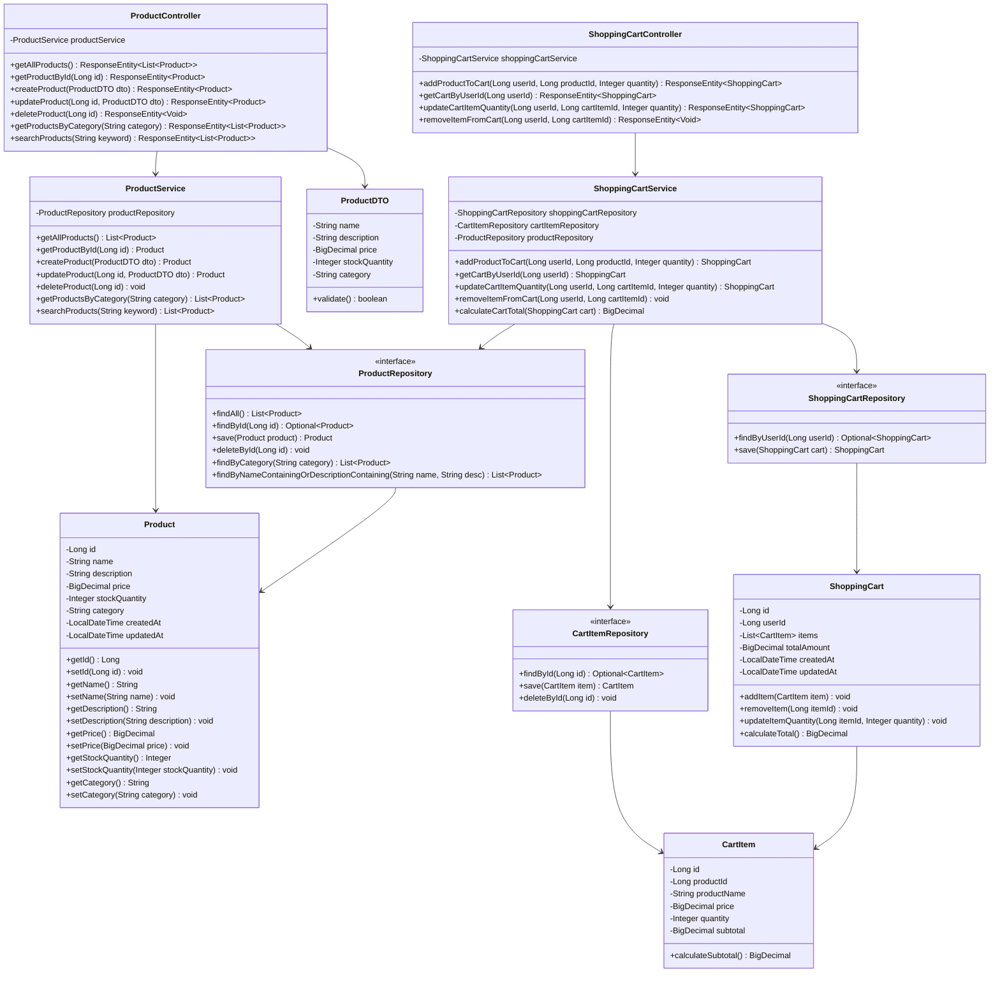

### 2.2 Entity Relationship Diagram

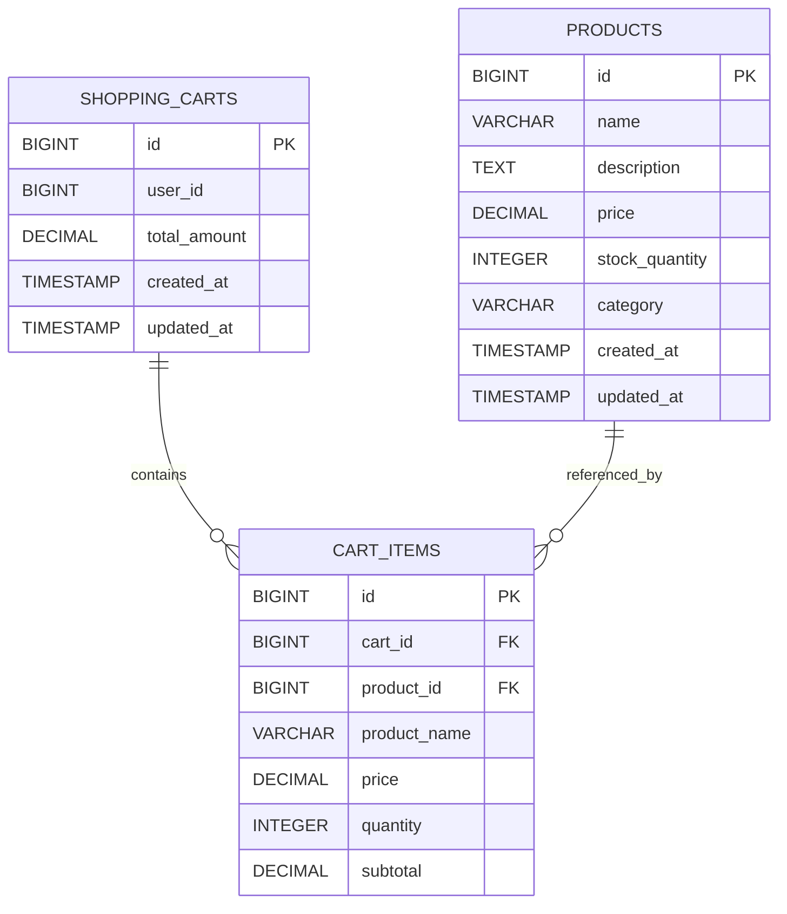

---

## 3. Sequence Diagrams

### 3.1 Get All Products

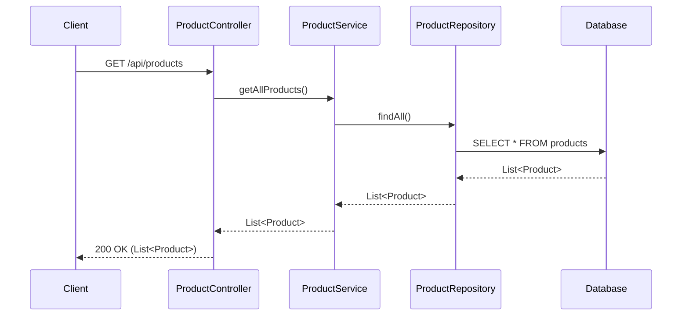

### 3.2 Get Product By ID

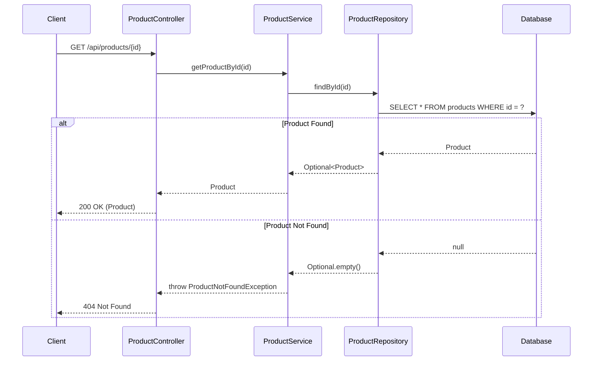

### 3.3 Create Product

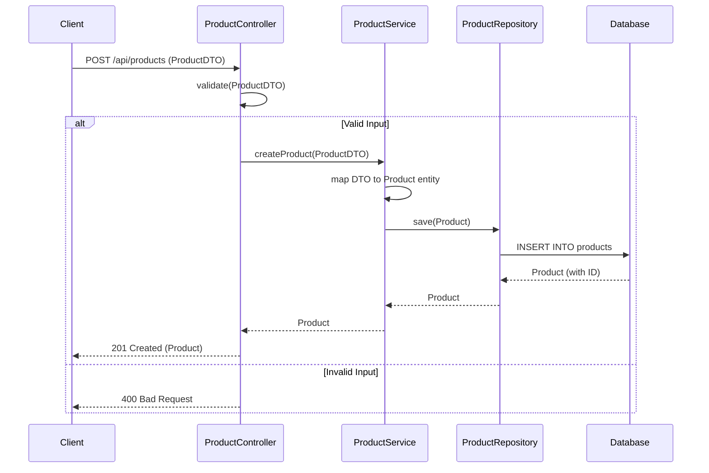

### 3.4 Update Product

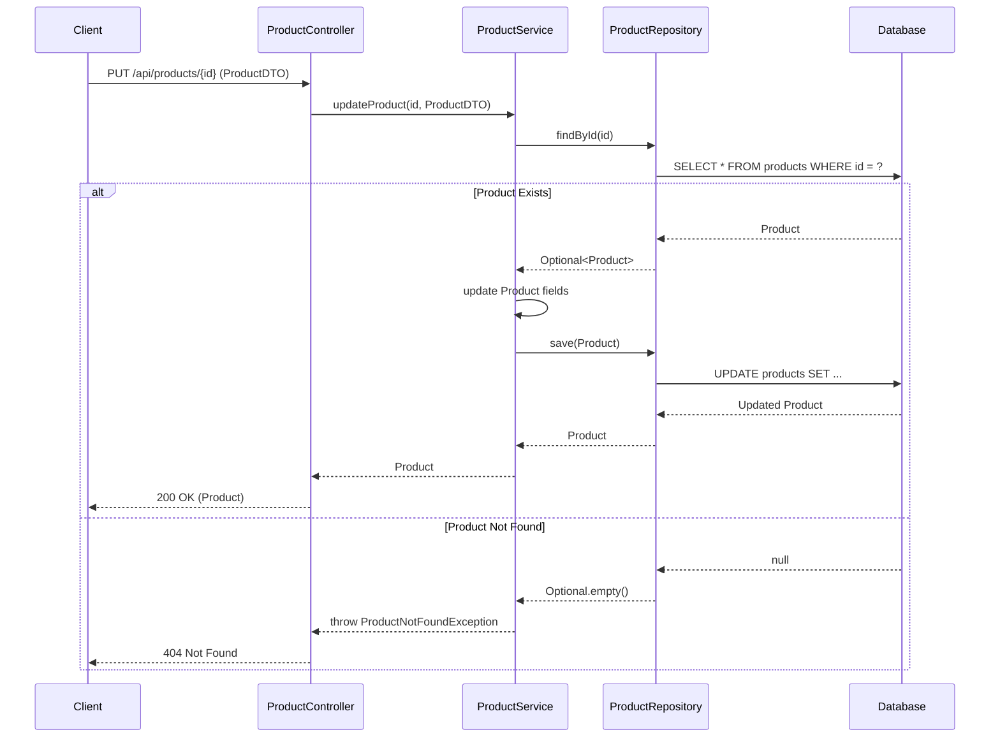

### 3.5 Delete Product

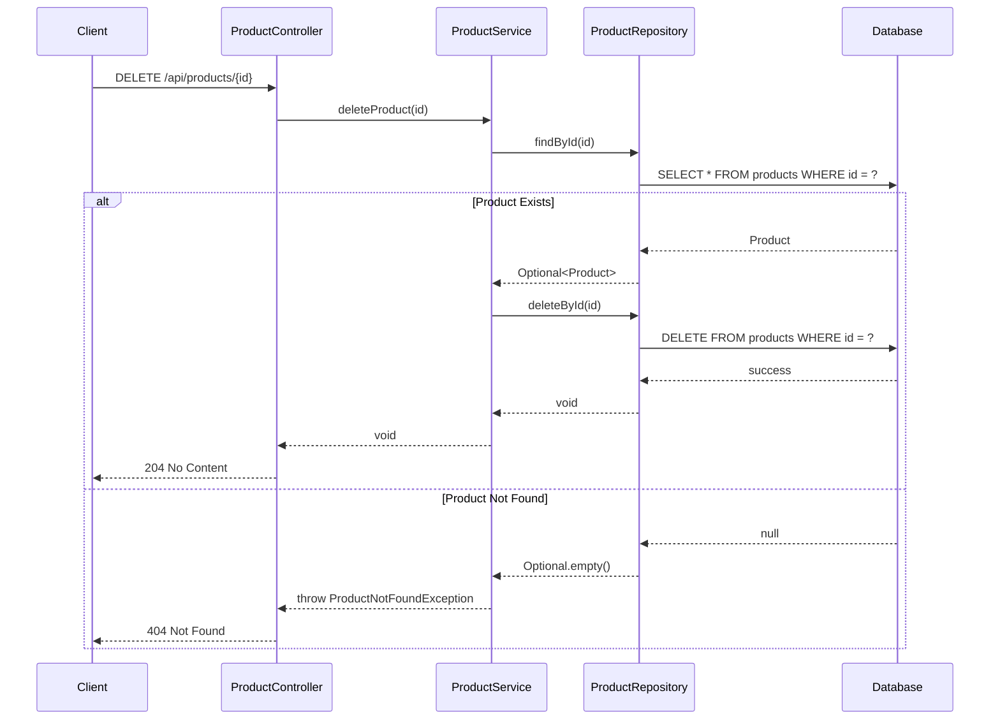

### 3.6 Get Products By Category


### 3.7 Search Products

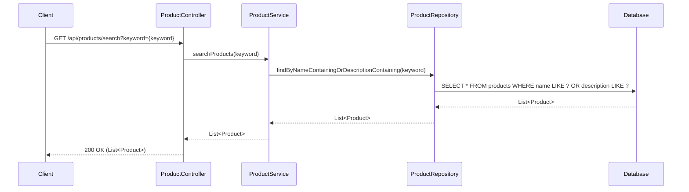

### 3.8 Add Product to Cart

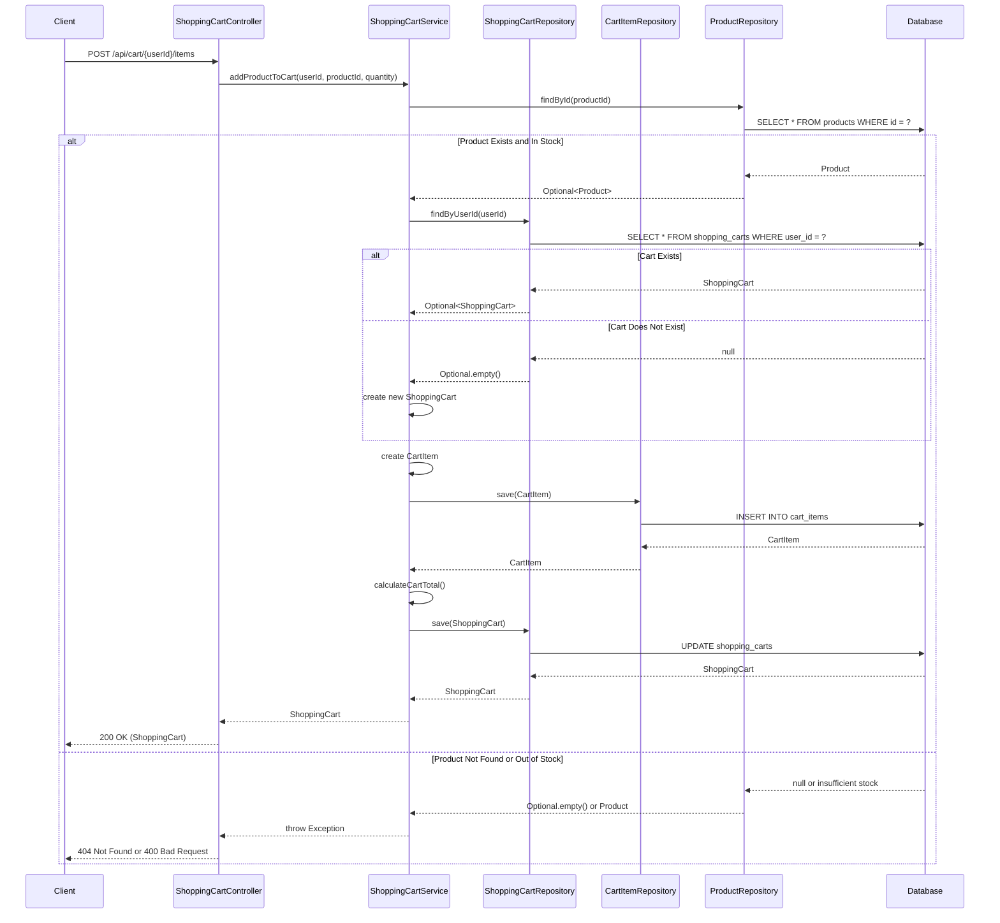

### 3.9 View Shopping Cart

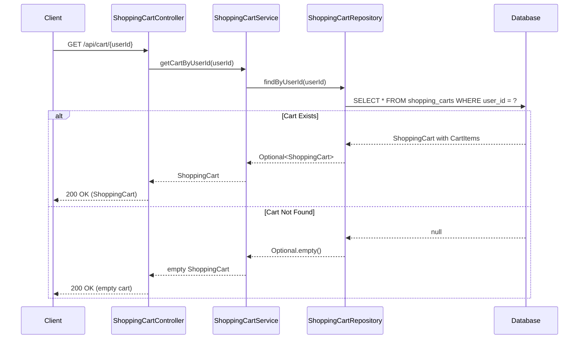

### 3.10 Update Cart Item Quantity

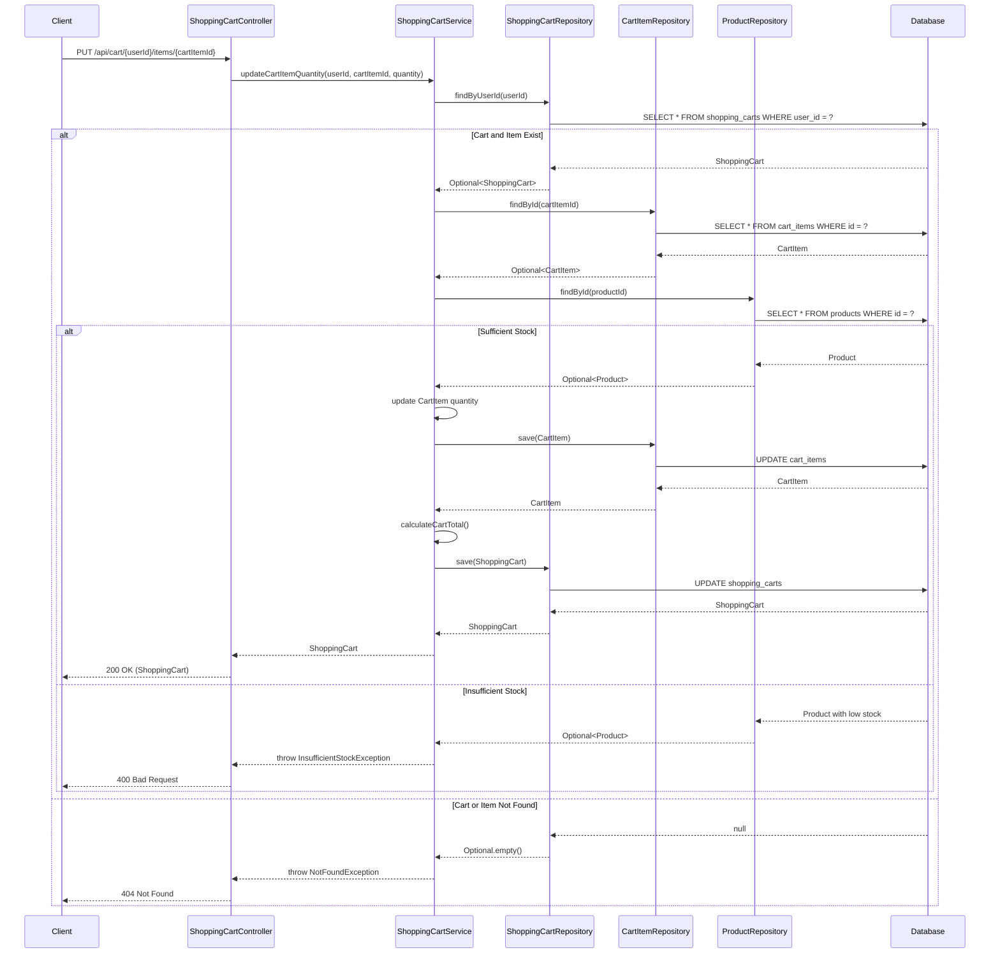

### 3.11 Remove Item from Cart

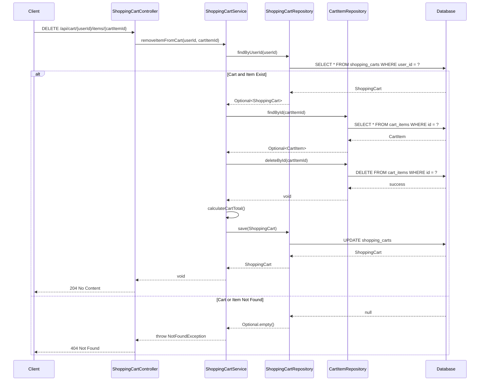

---

## 4. API Endpoints Summary

### Product Management Endpoints

| Method | Endpoint | Description | Request Body | Response |
|--------|----------|-------------|--------------|----------|
| GET | `/api/products` | Get all products | None | `200 OK` - List of products |
| GET | `/api/products/{id}` | Get product by ID | None | `200 OK` - Product<br>`404 Not Found` |
| POST | `/api/products` | Create new product | ProductDTO | `201 Created` - Product<br>`400 Bad Request` |
| PUT | `/api/products/{id}` | Update product | ProductDTO | `200 OK` - Product<br>`404 Not Found` |
| DELETE | `/api/products/{id}` | Delete product | None | `204 No Content`<br>`404 Not Found` |
| GET | `/api/products/category/{category}` | Get products by category | None | `200 OK` - List of products |
| GET | `/api/products/search?keyword={keyword}` | Search products | None | `200 OK` - List of products |

### Shopping Cart Management Endpoints

| Method | Endpoint | Description | Request Body | Response |
|--------|----------|-------------|--------------|----------|
| POST | `/api/cart/{userId}/items` | Add product to cart | `{"productId": Long, "quantity": Integer}` | `200 OK` - ShoppingCart<br>`404 Not Found`<br>`400 Bad Request` |
| GET | `/api/cart/{userId}` | View shopping cart | None | `200 OK` - ShoppingCart |
| PUT | `/api/cart/{userId}/items/{cartItemId}` | Update cart item quantity | `{"quantity": Integer}` | `200 OK` - ShoppingCart<br>`404 Not Found`<br>`400 Bad Request` |
| DELETE | `/api/cart/{userId}/items/{cartItemId}` | Remove item from cart | None | `204 No Content`<br>`404 Not Found` |

---

## 5. Database Schema

### Products Table

```sql
CREATE TABLE products (
    id BIGSERIAL PRIMARY KEY,
    name VARCHAR(255) NOT NULL,
    description TEXT,
    price DECIMAL(10, 2) NOT NULL,
    stock_quantity INTEGER NOT NULL DEFAULT 0,
    category VARCHAR(100),
    created_at TIMESTAMP DEFAULT CURRENT_TIMESTAMP,
    updated_at TIMESTAMP DEFAULT CURRENT_TIMESTAMP
);

CREATE INDEX idx_products_category ON products(category);
CREATE INDEX idx_products_name ON products(name);
```

### Shopping Carts Table

```sql
CREATE TABLE shopping_carts (
    id BIGSERIAL PRIMARY KEY,
    user_id BIGINT NOT NULL UNIQUE,
    total_amount DECIMAL(10, 2) NOT NULL DEFAULT 0.00,
    created_at TIMESTAMP DEFAULT CURRENT_TIMESTAMP,
    updated_at TIMESTAMP DEFAULT CURRENT_TIMESTAMP
);

CREATE INDEX idx_shopping_carts_user_id ON shopping_carts(user_id);
```

### Cart Items Table

```sql
CREATE TABLE cart_items (
    id BIGSERIAL PRIMARY KEY,
    cart_id BIGINT NOT NULL,
    product_id BIGINT NOT NULL,
    product_name VARCHAR(255) NOT NULL,
    price DECIMAL(10, 2) NOT NULL,
    quantity INTEGER NOT NULL,
    subtotal DECIMAL(10, 2) NOT NULL,
    FOREIGN KEY (cart_id) REFERENCES shopping_carts(id) ON DELETE CASCADE,
    FOREIGN KEY (product_id) REFERENCES products(id)
);

CREATE INDEX idx_cart_items_cart_id ON cart_items(cart_id);
CREATE INDEX idx_cart_items_product_id ON cart_items(product_id);
```

---

## 6. Technology Stack

### Backend
- **Framework**: Spring Boot 3.x
- **Language**: Java 21
- **Build Tool**: Maven or Gradle

### Database
- **RDBMS**: PostgreSQL 15+
- **ORM**: Spring Data JPA with Hibernate

### API
- **Style**: RESTful
- **Documentation**: SpringDoc OpenAPI (Swagger)

### Testing
- **Unit Testing**: JUnit 5, Mockito
- **Integration Testing**: Spring Boot Test, Testcontainers

---

## 7. Design Patterns Used

### 1. Repository Pattern
- **Purpose**: Abstracts data access logic
- **Implementation**: `ProductRepository`, `ShoppingCartRepository`, `CartItemRepository` interfaces extending `JpaRepository`
- **Benefits**: 
  - Decouples business logic from data access
  - Easier to test and maintain
  - Provides consistent data access interface

### 2. Service Layer Pattern
- **Purpose**: Encapsulates business logic
- **Implementation**: `ProductService`, `ShoppingCartService` classes
- **Benefits**:
  - Separates business logic from controllers
  - Promotes reusability
  - Easier transaction management

### 3. DTO (Data Transfer Object) Pattern
- **Purpose**: Transfers data between layers
- **Implementation**: `ProductDTO` for API requests
- **Benefits**:
  - Decouples API contract from domain model
  - Validation at API boundary
  - Prevents over-exposure of entity details

### 4. RESTful API Pattern
- **Purpose**: Standardized API design
- **Implementation**: HTTP methods (GET, POST, PUT, DELETE) with resource-based URLs
- **Benefits**:
  - Intuitive and standardized
  - Stateless communication
  - Cacheable responses

### 5. Aggregate Pattern
- **Purpose**: Manages consistency boundaries and encapsulates related entities
- **Implementation**: `ShoppingCart` acts as an aggregate root managing `CartItem` entities
- **Benefits**:
  - Ensures data consistency within the shopping cart boundary
  - Encapsulates business rules for cart operations
  - Simplifies transaction management
  - Controls access to cart items through the aggregate root

---

## 8. Key Features

### Product Management
1. **CRUD Operations**: Complete create, read, update, and delete functionality for products
2. **Category Filtering**: Ability to retrieve products by category
3. **Search Functionality**: Search products by name or description
4. **Stock Management**: Track product inventory levels
5. **Validation**: Input validation for product data
6. **Error Handling**: Proper HTTP status codes and error messages
7. **Timestamps**: Automatic tracking of creation and update times

### Shopping Cart Management
1. **Add to Cart**: Users can add products to their shopping cart with specified quantities
2. **View Cart**: Retrieve complete shopping cart with all items and total amount
3. **Update Quantity**: Modify the quantity of items already in the cart
4. **Remove Items**: Delete specific items from the shopping cart
5. **Stock Validation**: Ensures requested quantities don't exceed available stock
6. **Automatic Calculations**: Real-time calculation of item subtotals and cart total
7. **Cart Persistence**: Shopping carts are persisted per user
8. **Cascade Operations**: Removing a cart automatically removes associated cart items

---

## 9. Error Handling Strategy

### Exception Types
1. **ProductNotFoundException**: Thrown when product ID doesn't exist
2. **InvalidInputException**: Thrown for validation failures
3. **DatabaseException**: Thrown for database operation failures

### HTTP Status Codes
- `200 OK`: Successful GET, PUT requests
- `201 Created`: Successful POST requests
- `204 No Content`: Successful DELETE requests
- `400 Bad Request`: Invalid input data
- `404 Not Found`: Resource not found
- `500 Internal Server Error`: Server-side errors

---

## 10. Security Considerations

1. **Input Validation**: All inputs validated before processing
2. **SQL Injection Prevention**: Using JPA parameterized queries
3. **Authentication**: To be implemented (JWT/OAuth2)
4. **Authorization**: Role-based access control (future enhancement)

---

## 11. Performance Optimization

1. **Database Indexing**: Indexes on frequently queried columns (category, name)
2. **Connection Pooling**: HikariCP for efficient database connections
3. **Lazy Loading**: JPA lazy loading for related entities
4. **Caching**: Redis cache for frequently accessed products (future enhancement)

---

## 12. Future Enhancements

1. **Pagination**: Implement pagination for product listings
2. **Sorting**: Add sorting capabilities (by price, name, date)
3. **Image Management**: Support for product images
4. **Reviews and Ratings**: Customer review system
5. **Inventory Alerts**: Notifications for low stock
6. **Bulk Operations**: Batch product updates
7. **Advanced Search**: Filters by price range, multiple categories
8. **Audit Logging**: Track all product changes

---

**Document Version**: 1.1  
**Last Updated**: 2024  
**Author**: Development Team  
**Status**: Approved