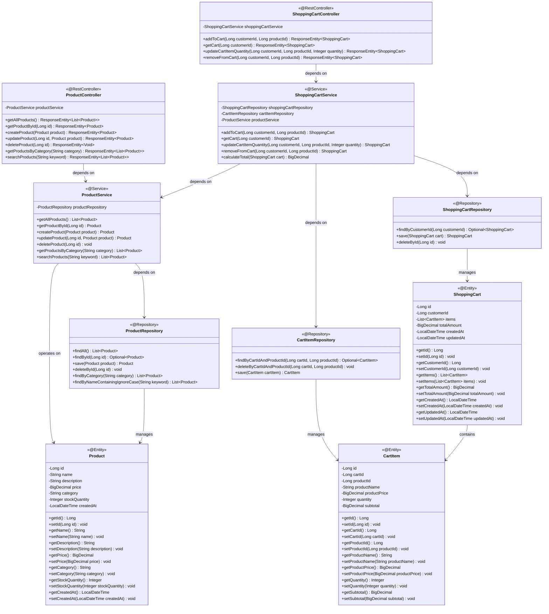

# Low-Level Design (LLD) - E-commerce Product Management System

**Version:** 2.0  
**Last Updated:** 2024  
**Story Reference:** SCRUM-1140 - Shopping Cart Management

## 1. Project Overview

**Framework:** Spring Boot  
**Language:** Java 21  
**Database:** PostgreSQL  
**Module:** ProductManagement, ShoppingCartManagement  

## 2. System Architecture

### 2.1 Class Diagram



### 2.2 Entity Relationship Diagram


## 3. Sequence Diagrams

### 3.1 Get All Products


### 3.2 Get Product By ID


### 3.3 Create Product


### 3.4 Update Product


### 3.5 Delete Product


### 3.6 Get Products By Category


### 3.7 Search Products


### 3.8 Add Product to Cart


### 3.9 View Shopping Cart


### 3.10 Update Cart Item Quantity


### 3.11 Remove Item from Cart


## 4. API Endpoints Summary

### Product Management Endpoints

| Method | Endpoint | Description | Request Body | Response |
|--------|----------|-------------|--------------|----------|
| GET | `/api/products` | Get all products | None | List<Product> |
| GET | `/api/products/{id}` | Get product by ID | None | Product |
| POST | `/api/products` | Create new product | Product | Product |
| PUT | `/api/products/{id}` | Update existing product | Product | Product |
| DELETE | `/api/products/{id}` | Delete product | None | None |
| GET | `/api/products/category/{category}` | Get products by category | None | List<Product> |
| GET | `/api/products/search?keyword={keyword}` | Search products by name | None | List<Product> |

### Shopping Cart Management Endpoints

| Method | Endpoint | Description | Request Body | Response |
|--------|----------|-------------|--------------|----------|
| POST | `/api/cart/{customerId}/add?productId={productId}` | Add product to cart with quantity 1 | None | ShoppingCart |
| GET | `/api/cart/{customerId}` | View shopping cart with all items | None | ShoppingCart |
| PUT | `/api/cart/{customerId}/update?productId={productId}&quantity={quantity}` | Update item quantity in cart | None | ShoppingCart |
| DELETE | `/api/cart/{customerId}/remove?productId={productId}` | Remove item from cart | None | ShoppingCart |

## 5. Database Schema

### Products Table

```sql
CREATE TABLE products (
    id BIGINT PRIMARY KEY AUTO_INCREMENT,
    name VARCHAR(255) NOT NULL,
    description TEXT,
    price DECIMAL(10,2) NOT NULL,
    category VARCHAR(100) NOT NULL,
    stock_quantity INTEGER NOT NULL DEFAULT 0,
    created_at TIMESTAMP NOT NULL DEFAULT CURRENT_TIMESTAMP
);

CREATE INDEX idx_products_category ON products(category);
CREATE INDEX idx_products_name ON products(name);
```

### Shopping Carts Table

```sql
CREATE TABLE shopping_carts (
    id BIGINT PRIMARY KEY AUTO_INCREMENT,
    customer_id BIGINT NOT NULL UNIQUE,
    total_amount DECIMAL(10,2) NOT NULL DEFAULT 0.00,
    created_at TIMESTAMP NOT NULL DEFAULT CURRENT_TIMESTAMP,
    updated_at TIMESTAMP NOT NULL DEFAULT CURRENT_TIMESTAMP ON UPDATE CURRENT_TIMESTAMP
);

CREATE INDEX idx_shopping_carts_customer_id ON shopping_carts(customer_id);
```

### Cart Items Table

```sql
CREATE TABLE cart_items (
    id BIGINT PRIMARY KEY AUTO_INCREMENT,
    cart_id BIGINT NOT NULL,
    product_id BIGINT NOT NULL,
    product_name VARCHAR(255) NOT NULL,
    product_price DECIMAL(10,2) NOT NULL,
    quantity INTEGER NOT NULL DEFAULT 1,
    subtotal DECIMAL(10,2) NOT NULL,
    FOREIGN KEY (cart_id) REFERENCES shopping_carts(id) ON DELETE CASCADE,
    FOREIGN KEY (product_id) REFERENCES products(id),
    UNIQUE KEY unique_cart_product (cart_id, product_id)
);

CREATE INDEX idx_cart_items_cart_id ON cart_items(cart_id);
CREATE INDEX idx_cart_items_product_id ON cart_items(product_id);
```

## 6. Technology Stack

- **Backend Framework:** Spring Boot 3.x
- **Language:** Java 21
- **Database:** PostgreSQL
- **ORM:** Spring Data JPA / Hibernate
- **Build Tool:** Maven/Gradle
- **API Documentation:** Swagger/OpenAPI 3

## 7. Design Patterns Used

1. **MVC Pattern:** Separation of Controller, Service, and Repository layers
2. **Repository Pattern:** Data access abstraction through ProductRepository, ShoppingCartRepository, and CartItemRepository
3. **Dependency Injection:** Spring's IoC container manages dependencies
4. **DTO Pattern:** Data Transfer Objects for API requests/responses
5. **Exception Handling:** Custom exceptions for business logic errors
6. **Aggregate Pattern:** ShoppingCart acts as an aggregate root containing CartItems

## 8. Key Features

### Product Management
- RESTful API design following HTTP standards
- Proper HTTP status codes for different scenarios
- Input validation and error handling
- Database indexing for performance optimization
- Transactional operations for data consistency
- Pagination support for large datasets (can be extended)
- Search functionality with case-insensitive matching

### Shopping Cart Management
- Add products to cart with default quantity of 1
- View all cart items with product details (name, price, quantity, subtotal)
- Update item quantities with automatic subtotal and total recalculation
- Remove items from cart with automatic total updates
- Empty cart detection with appropriate messaging
- One cart per customer (enforced by unique constraint)
- Automatic calculation of subtotals and total amounts
- Cascade deletion of cart items when cart is deleted
- Transactional consistency for all cart operations