# Modified Low-Level Design (LLD) - E-commerce Product Management System
## Story: SCRUM-1140 - Shopping Cart Management Enhancement

---

## Document Control

| Version | Date | Author | Changes |
|---------|------|--------|----------|
| 1.0 | 2024-01-15 | Development Team | Initial LLD |
| 2.0 | 2024-01-20 | Development Team | Modified for SCRUM-1140 - Shopping Cart Management |

---

## Table of Contents

1. [Executive Summary](#1-executive-summary)
2. [Project Overview](#2-project-overview)
3. [System Architecture](#3-system-architecture)
4. [High-Level Architecture](#4-high-level-architecture)
5. [Component Design](#5-component-design)
6. [Data Models and Schemas](#6-data-models-and-schemas)
7. [API Specifications](#7-api-specifications)
8. [Sequence Diagrams](#8-sequence-diagrams)
9. [Data Flow Diagrams](#9-data-flow-diagrams)
10. [Deployment Architecture](#10-deployment-architecture)
11. [Error Handling Design](#11-error-handling-design)
12. [Security Considerations](#12-security-considerations)
13. [Performance and Scalability](#13-performance-and-scalability)
14. [Logging and Monitoring](#14-logging-and-monitoring)
15. [Change Traceability](#15-change-traceability)
16. [Design Assumptions and Constraints](#16-design-assumptions-and-constraints)

---

## 1. Executive Summary

This document presents the modified Low-Level Design for the E-commerce Product Management System, specifically enhanced to support Shopping Cart Management functionality as per Story SCRUM-1140. The system is built using Spring Boot framework with Java 21, leveraging PostgreSQL as the primary database.

### Key Enhancements:
- **Shopping Cart Management**: Complete cart lifecycle management including add, update, remove, and view operations
- **Real-time Inventory Validation**: Integration with product inventory to prevent overselling
- **Cart Persistence**: Database-backed cart storage for session continuity
- **Automatic Total Calculation**: Dynamic cart total computation with item-level subtotals
- **RESTful API Design**: Comprehensive REST endpoints for cart operations

---

## 2. Project Overview

### 2.1 Technology Stack

| Component | Technology | Version |
|-----------|------------|----------|
| Framework | Spring Boot | 3.2.x |
| Language | Java | 21 |
| Database | PostgreSQL | 15.x |
| Build Tool | Maven | 3.9.x |
| ORM | Spring Data JPA | 3.2.x |
| API Documentation | OpenAPI/Swagger | 3.0 |

### 2.2 Module Overview


### 2.3 Business Context

The Shopping Cart Management module enables customers to:
- Add products to their shopping cart
- View cart contents with real-time pricing
- Update item quantities
- Remove items from cart
- See calculated totals and subtotals
- Maintain cart state across sessions

---

## 3. System Architecture

### 3.1 Layered Architecture


### 3.2 Detailed Class Diagram


---

## 4. High-Level Architecture

### 4.1 System Context Diagram


### 4.2 Component Interaction Overview


---

## 5. Component Design

### 5.1 Product Management Component

#### 5.1.1 Responsibilities
- Manage product catalog (CRUD operations)
- Handle product search and filtering
- Maintain product inventory
- Validate product availability
- Provide product information to other modules

#### 5.1.2 Internal Processing Logic


### 5.2 Shopping Cart Management Component

#### 5.2.1 Responsibilities
- Manage customer shopping carts
- Add/remove/update cart items
- Calculate cart totals and subtotals
- Validate product availability before adding to cart
- Maintain cart persistence across sessions
- Handle cart lifecycle (create, update, clear)

#### 5.2.2 Internal Processing Logic - Add to Cart


#### 5.2.3 Internal Processing Logic - Update Cart Item


---

## 6. Data Models and Schemas

### 6.1 Entity Relationship Diagram


### 6.2 Database Schema Details

#### 6.2.1 Product Table

```sql
CREATE TABLE products (
    id BIGSERIAL PRIMARY KEY,
    name VARCHAR(255) NOT NULL,
    description TEXT,
    price DECIMAL(10, 2) NOT NULL CHECK (price >= 0),
    category VARCHAR(100),
    stock_quantity INTEGER NOT NULL DEFAULT 0 CHECK (stock_quantity >= 0),
    created_at TIMESTAMP DEFAULT CURRENT_TIMESTAMP,
    updated_at TIMESTAMP DEFAULT CURRENT_TIMESTAMP,
    CONSTRAINT uk_product_name UNIQUE (name)
);

CREATE INDEX idx_product_category ON products(category);
CREATE INDEX idx_product_name ON products(name);
CREATE INDEX idx_product_stock ON products(stock_quantity);
```

#### 6.2.2 Shopping Cart Table

```sql
CREATE TABLE shopping_carts (
    id BIGSERIAL PRIMARY KEY,
    customer_id BIGINT NOT NULL,
    total_amount DECIMAL(10, 2) NOT NULL DEFAULT 0.00 CHECK (total_amount >= 0),
    created_at TIMESTAMP DEFAULT CURRENT_TIMESTAMP,
    updated_at TIMESTAMP DEFAULT CURRENT_TIMESTAMP,
    CONSTRAINT uk_customer_cart UNIQUE (customer_id)
);

CREATE INDEX idx_cart_customer ON shopping_carts(customer_id);
CREATE INDEX idx_cart_updated ON shopping_carts(updated_at);
```

#### 6.2.3 Cart Item Table

```sql
CREATE TABLE cart_items (
    id BIGSERIAL PRIMARY KEY,
    cart_id BIGINT NOT NULL,
    product_id BIGINT NOT NULL,
    product_name VARCHAR(255) NOT NULL,
    product_price DECIMAL(10, 2) NOT NULL CHECK (product_price >= 0),
    quantity INTEGER NOT NULL CHECK (quantity > 0),
    subtotal DECIMAL(10, 2) NOT NULL CHECK (subtotal >= 0),
    CONSTRAINT fk_cart FOREIGN KEY (cart_id) REFERENCES shopping_carts(id) ON DELETE CASCADE,
    CONSTRAINT fk_product FOREIGN KEY (product_id) REFERENCES products(id) ON DELETE RESTRICT,
    CONSTRAINT uk_cart_product UNIQUE (cart_id, product_id)
);

CREATE INDEX idx_cart_item_cart ON cart_items(cart_id);
CREATE INDEX idx_cart_item_product ON cart_items(product_id);
```

### 6.3 Data Model Constraints and Rules

| Entity | Constraint | Rule |
|--------|-----------|------|
| Product | price | Must be >= 0 |
| Product | stock_quantity | Must be >= 0 |
| Product | name | Must be unique |
| ShoppingCart | customer_id | One cart per customer |
| ShoppingCart | total_amount | Must be >= 0 |
| CartItem | quantity | Must be > 0 |
| CartItem | subtotal | Must be >= 0 |
| CartItem | cart_id + product_id | Unique combination |

---

## 7. API Specifications

### 7.1 Product Management APIs

#### 7.1.1 Get All Products

**Endpoint:** `GET /api/products`

**Description:** Retrieves all products from the catalog

**Request:**
```http
GET /api/products HTTP/1.1
Host: api.ecommerce.com
Accept: application/json
```

**Response (200 OK):**
```json
[
  {
    "id": 1,
    "name": "Laptop",
    "description": "High-performance laptop",
    "price": 999.99,
    "category": "Electronics",
    "stockQuantity": 50,
    "createdAt": "2024-01-15T10:00:00Z",
    "updatedAt": "2024-01-15T10:00:00Z"
  }
]
```

#### 7.1.2 Get Product by ID

**Endpoint:** `GET /api/products/{id}`

**Description:** Retrieves a specific product by its ID

**Path Parameters:**
- `id` (Long, required): Product identifier

**Request:**
```http
GET /api/products/1 HTTP/1.1
Host: api.ecommerce.com
Accept: application/json
```

**Response (200 OK):**
```json
{
  "id": 1,
  "name": "Laptop",
  "description": "High-performance laptop",
  "price": 999.99,
  "category": "Electronics",
  "stockQuantity": 50,
  "createdAt": "2024-01-15T10:00:00Z",
  "updatedAt": "2024-01-15T10:00:00Z"
}
```

**Response (404 Not Found):**
```json
{
  "timestamp": "2024-01-15T10:00:00Z",
  "status": 404,
  "error": "Not Found",
  "message": "Product not found with id: 1",
  "path": "/api/products/1"
}
```

#### 7.1.3 Create Product

**Endpoint:** `POST /api/products`

**Description:** Creates a new product in the catalog

**Request:**
```http
POST /api/products HTTP/1.1
Host: api.ecommerce.com
Content-Type: application/json

{
  "name": "Smartphone",
  "description": "Latest model smartphone",
  "price": 699.99,
  "category": "Electronics",
  "stockQuantity": 100
}
```

**Response (201 Created):**
```json
{
  "id": 2,
  "name": "Smartphone",
  "description": "Latest model smartphone",
  "price": 699.99,
  "category": "Electronics",
  "stockQuantity": 100,
  "createdAt": "2024-01-15T10:30:00Z",
  "updatedAt": "2024-01-15T10:30:00Z"
}
```

#### 7.1.4 Update Product

**Endpoint:** `PUT /api/products/{id}`

**Description:** Updates an existing product

**Path Parameters:**
- `id` (Long, required): Product identifier

**Request:**
```http
PUT /api/products/2 HTTP/1.1
Host: api.ecommerce.com
Content-Type: application/json

{
  "name": "Smartphone Pro",
  "description": "Latest model smartphone with enhanced features",
  "price": 799.99,
  "category": "Electronics",
  "stockQuantity": 80
}
```

**Response (200 OK):**
```json
{
  "id": 2,
  "name": "Smartphone Pro",
  "description": "Latest model smartphone with enhanced features",
  "price": 799.99,
  "category": "Electronics",
  "stockQuantity": 80,
  "createdAt": "2024-01-15T10:30:00Z",
  "updatedAt": "2024-01-15T11:00:00Z"
}
```

#### 7.1.5 Delete Product

**Endpoint:** `DELETE /api/products/{id}`

**Description:** Deletes a product from the catalog

**Path Parameters:**
- `id` (Long, required): Product identifier

**Request:**
```http
DELETE /api/products/2 HTTP/1.1
Host: api.ecommerce.com
```

**Response (204 No Content)**

#### 7.1.6 Get Products by Category

**Endpoint:** `GET /api/products/category/{category}`

**Description:** Retrieves all products in a specific category

**Path Parameters:**
- `category` (String, required): Product category

**Request:**
```http
GET /api/products/category/Electronics HTTP/1.1
Host: api.ecommerce.com
Accept: application/json
```

**Response (200 OK):**
```json
[
  {
    "id": 1,
    "name": "Laptop",
    "description": "High-performance laptop",
    "price": 999.99,
    "category": "Electronics",
    "stockQuantity": 50,
    "createdAt": "2024-01-15T10:00:00Z",
    "updatedAt": "2024-01-15T10:00:00Z"
  }
]
```

#### 7.1.7 Search Products

**Endpoint:** `GET /api/products/search?keyword={keyword}`

**Description:** Searches products by keyword in name

**Query Parameters:**
- `keyword` (String, required): Search keyword

**Request:**
```http
GET /api/products/search?keyword=laptop HTTP/1.1
Host: api.ecommerce.com
Accept: application/json
```

**Response (200 OK):**
```json
[
  {
    "id": 1,
    "name": "Laptop",
    "description": "High-performance laptop",
    "price": 999.99,
    "category": "Electronics",
    "stockQuantity": 50,
    "createdAt": "2024-01-15T10:00:00Z",
    "updatedAt": "2024-01-15T10:00:00Z"
  }
]
```

### 7.2 Shopping Cart Management APIs

#### 7.2.1 Add Item to Cart

**Endpoint:** `POST /api/cart/{customerId}/items`

**Description:** Adds a product to the customer's shopping cart

**Path Parameters:**
- `customerId` (Long, required): Customer identifier

**Request:**
```http
POST /api/cart/1001/items HTTP/1.1
Host: api.ecommerce.com
Content-Type: application/json

{
  "productId": 1,
  "quantity": 2
}
```

**Response (200 OK):**
```json
{
  "id": 1,
  "customerId": 1001,
  "items": [
    {
      "id": 1,
      "cartId": 1,
      "productId": 1,
      "productName": "Laptop",
      "productPrice": 999.99,
      "quantity": 2,
      "subtotal": 1999.98
    }
  ],
  "totalAmount": 1999.98,
  "createdAt": "2024-01-15T12:00:00Z",
  "updatedAt": "2024-01-15T12:00:00Z"
}
```

**Response (404 Not Found):**
```json
{
  "timestamp": "2024-01-15T12:00:00Z",
  "status": 404,
  "error": "Not Found",
  "message": "Product not found with id: 1",
  "path": "/api/cart/1001/items"
}
```

**Response (400 Bad Request):**
```json
{
  "timestamp": "2024-01-15T12:00:00Z",
  "status": 400,
  "error": "Bad Request",
  "message": "Insufficient stock for product: Laptop. Available: 1, Requested: 2",
  "path": "/api/cart/1001/items"
}
```

#### 7.2.2 Get Cart

**Endpoint:** `GET /api/cart/{customerId}`

**Description:** Retrieves the customer's shopping cart

**Path Parameters:**
- `customerId` (Long, required): Customer identifier

**Request:**
```http
GET /api/cart/1001 HTTP/1.1
Host: api.ecommerce.com
Accept: application/json
```

**Response (200 OK):**
```json
{
  "id": 1,
  "customerId": 1001,
  "items": [
    {
      "id": 1,
      "cartId": 1,
      "productId": 1,
      "productName": "Laptop",
      "productPrice": 999.99,
      "quantity": 2,
      "subtotal": 1999.98
    },
    {
      "id": 2,
      "cartId": 1,
      "productId": 2,
      "productName": "Mouse",
      "productPrice": 29.99,
      "quantity": 1,
      "subtotal": 29.99
    }
  ],
  "totalAmount": 2029.97,
  "createdAt": "2024-01-15T12:00:00Z",
  "updatedAt": "2024-01-15T12:30:00Z"
}
```

**Response (404 Not Found):**
```json
{
  "timestamp": "2024-01-15T12:00:00Z",
  "status": 404,
  "error": "Not Found",
  "message": "Cart not found for customer: 1001",
  "path": "/api/cart/1001"
}
```

#### 7.2.3 Update Cart Item Quantity

**Endpoint:** `PUT /api/cart/{customerId}/items/{productId}`

**Description:** Updates the quantity of a specific item in the cart

**Path Parameters:**
- `customerId` (Long, required): Customer identifier
- `productId` (Long, required): Product identifier

**Query Parameters:**
- `quantity` (Integer, required): New quantity

**Request:**
```http
PUT /api/cart/1001/items/1?quantity=3 HTTP/1.1
Host: api.ecommerce.com
```

**Response (200 OK):**
```json
{
  "id": 1,
  "customerId": 1001,
  "items": [
    {
      "id": 1,
      "cartId": 1,
      "productId": 1,
      "productName": "Laptop",
      "productPrice": 999.99,
      "quantity": 3,
      "subtotal": 2999.97
    },
    {
      "id": 2,
      "cartId": 1,
      "productId": 2,
      "productName": "Mouse",
      "productPrice": 29.99,
      "quantity": 1,
      "subtotal": 29.99
    }
  ],
  "totalAmount": 3029.96,
  "createdAt": "2024-01-15T12:00:00Z",
  "updatedAt": "2024-01-15T13:00:00Z"
}
```

#### 7.2.4 Remove Item from Cart

**Endpoint:** `DELETE /api/cart/{customerId}/items/{productId}`

**Description:** Removes a specific item from the cart

**Path Parameters:**
- `customerId` (Long, required): Customer identifier
- `productId` (Long, required): Product identifier

**Request:**
```http
DELETE /api/cart/1001/items/2 HTTP/1.1
Host: api.ecommerce.com
```

**Response (200 OK):**
```json
{
  "id": 1,
  "customerId": 1001,
  "items": [
    {
      "id": 1,
      "cartId": 1,
      "productId": 1,
      "productName": "Laptop",
      "productPrice": 999.99,
      "quantity": 3,
      "subtotal": 2999.97
    }
  ],
  "totalAmount": 2999.97,
  "createdAt": "2024-01-15T12:00:00Z",
  "updatedAt": "2024-01-15T13:30:00Z"
}
```

#### 7.2.5 Clear Cart

**Endpoint:** `DELETE /api/cart/{customerId}`

**Description:** Removes all items from the customer's cart

**Path Parameters:**
- `customerId` (Long, required): Customer identifier

**Request:**
```http
DELETE /api/cart/1001 HTTP/1.1
Host: api.ecommerce.com
```

**Response (204 No Content)**

---

## 8. Sequence Diagrams

### 8.1 Add Product to Cart Flow


### 8.2 Update Cart Item Quantity Flow


### 8.3 Remove Item from Cart Flow


### 8.4 Get Cart Flow


---

## 9. Data Flow Diagrams

### 9.1 Overall System Data Flow


### 9.2 Add to Cart Data Flow


### 9.3 Cart Total Calculation Data Flow

```mermaid
flowchart TD
    Start([Calculate Total]) --> GetItems[Get All Cart Items]
    GetItems --> InitTotal[Initialize Total = 0]
    InitTotal --> Loop{More Items?}
    
    Loop -->|Yes| GetItem[Get Next Item]
    GetItem --> CalcSubtotal[Subtotal = Price × Quantity]
    CalcSubtotal --> AddToTotal[Total += Subtotal]
    AddToTotal --> Loop
    
    Loop -->|No| UpdateCart[Update Cart Total]
    UpdateCart --> SaveDB[Save to Database]
    SaveDB --> Return[Return Total]
    Return --> End([End])
    
    style Start fill:#4CAF50,stroke:#2E7D32,stroke-width:2px,color:#fff
    style End fill:#F44336,stroke:#C62828,stroke-width:2px,color:#fff
    style Return fill:#2196F3,stroke:#1565C0,stroke-width:2px,color:#fff
    style SaveDB fill:#9C27B0,stroke:#4A148C,stroke-width:2px,color:#fff
```



---

## 10. Deployment Architecture

### 10.1 Deployment Diagram


### 10.2 Infrastructure Components

| Component | Technology | Purpose | Scaling Strategy |
|-----------|-----------|---------|------------------|
| Load Balancer | Nginx/AWS ALB | Distribute traffic | Horizontal |
| Application Server | Spring Boot | Business logic | Horizontal (Auto-scaling) |
| Database | PostgreSQL | Data persistence | Vertical + Read replicas |
| Cache | Redis | Performance optimization | Horizontal (Cluster) |
| Container | Docker | Application packaging | Kubernetes orchestration |

### 10.3 Environment Configuration


---

## 11. Error Handling Design

### 11.1 Exception Hierarchy


### 11.2 Error Response Format

```json
{
  "timestamp": "2024-01-15T12:00:00Z",
  "status": 404,
  "error": "Not Found",
  "errorCode": "PRODUCT_NOT_FOUND",
  "message": "Product not found with id: 123",
  "path": "/api/products/123",
  "details": [
    "The requested product does not exist in the catalog"
  ]
}
```

### 11.3 Error Codes and HTTP Status Mapping

| Error Code | HTTP Status | Description | Recovery Action |
|-----------|-------------|-------------|------------------|
| PRODUCT_NOT_FOUND | 404 | Product doesn't exist | Verify product ID |
| CART_NOT_FOUND | 404 | Cart doesn't exist | Create new cart |
| ITEM_NOT_FOUND | 404 | Item not in cart | Add item to cart |
| INSUFFICIENT_STOCK | 400 | Not enough inventory | Reduce quantity |
| INVALID_QUANTITY | 400 | Invalid quantity value | Provide valid quantity |
| DUPLICATE_PRODUCT | 409 | Product already exists | Use different name |
| VALIDATION_ERROR | 400 | Input validation failed | Fix input data |
| INTERNAL_ERROR | 500 | Server error | Retry or contact support |

### 11.4 Error Handling Flow


---

## 12. Security Considerations

### 12.1 Security Architecture

```mermaid
graph TB
    subgraph "Security Layers"
        Auth[Authentication Layer]
        Authz[Authorization Layer]
        Valid[Input Validation]
        Encrypt[Data Encryption]
    end
    
    subgraph "Application"
        API[REST API]
        Service[Business Logic]
        Data[Data Access]
    end
    
    Client[Client] --> Auth
    Auth --> Authz
    Authz --> Valid
    Valid --> API
    API --> Service
    Service --> Data
    Data --> Encrypt
    Encrypt --> DB[(Database)]
    
    style Auth fill:#F44336,stroke:#C62828,stroke-width:2px,color:#fff
    style Authz fill:#FF5722,stroke:#BF360C,stroke-width:2px,color:#fff
    style Valid fill:#FF9800,stroke:#E65100,stroke-width:2px
    style Encrypt fill:#FFC107,stroke:#F57F17,stroke-width:2px
```

### 12.2 Security Measures

| Layer | Security Measure | Implementation |
|-------|-----------------|----------------|
| Transport | HTTPS/TLS | SSL certificates |
| Authentication | JWT/OAuth2 | Spring Security |
| Authorization | Role-based access | @PreAuthorize annotations |
| Input Validation | Bean Validation | @Valid, @NotNull, @Size |
| SQL Injection | Parameterized queries | JPA/Hibernate |
| XSS Protection | Output encoding | Spring Security headers |
| CSRF Protection | CSRF tokens | Spring Security CSRF |
| Rate Limiting | Request throttling | API Gateway |
| Data Encryption | AES-256 | Database encryption |
| Password Security | BCrypt hashing | PasswordEncoder |

### 12.3 Authentication Flow

```mermaid
sequenceDiagram
    actor User
    participant Client
    participant AuthServer as Auth Server
    participant API as API Gateway
    participant Service as Application Service
    
    User->>Client: Login Request
    Client->>AuthServer: POST /auth/login (credentials)
    AuthServer->>AuthServer: Validate Credentials
    AuthServer->>AuthServer: Generate JWT Token
    AuthServer-->>Client: JWT Token
    Client->>Client: Store Token
    
    User->>Client: API Request
    Client->>API: Request + JWT Token (Header)
    API->>API: Validate Token
    
    alt Token Invalid
        API-->>Client: 401 Unauthorized
    else Token Valid
        API->>Service: Forward Request
        Service->>Service: Process Request
        Service-->>API: Response
        API-->>Client: Response
    end
    
    Client-->>User: Display Result
```

### 12.4 Data Protection

```mermaid
graph LR
    subgraph "Data at Rest"
        DB[(Encrypted Database)]
        Backup[(Encrypted Backups)]
    end
    
    subgraph "Data in Transit"
        TLS[TLS/HTTPS]
    end
    
    subgraph "Data in Use"
        Memory[Secure Memory]
        Logs[Sanitized Logs]
    end
    
    App[Application] -->|Encrypt| DB
    App -->|Encrypt| Backup
    Client[Client] -->|TLS| App
    App -->|Secure| Memory
    App -->|Mask Sensitive Data| Logs
    
    style DB fill:#4CAF50,stroke:#1B5E20,stroke-width:2px
    style Backup fill:#4CAF50,stroke:#1B5E20,stroke-width:2px
    style TLS fill:#2196F3,stroke:#0D47A1,stroke-width:2px
    style Memory fill:#FF9800,stroke:#E65100,stroke-width:2px
    style Logs fill:#FF9800,stroke:#E65100,stroke-width:2px
```

---

## 13. Performance and Scalability

### 13.1 Performance Optimization Strategies

```mermaid
graph TB
    subgraph "Optimization Layers"
        Cache[Caching Strategy]
        DB[Database Optimization]
        Code[Code Optimization]
        Infra[Infrastructure Scaling]
    end
    
    subgraph "Caching"
        L1[L1: Application Cache]
        L2[L2: Redis Cache]
        L3[L3: CDN]
    end
    
    subgraph "Database"
        Index[Indexing]
        Query[Query Optimization]
        Pool[Connection Pooling]
        Replica[Read Replicas]
    end
    
    Cache --> L1
    Cache --> L2
    Cache --> L3
    
    DB --> Index
    DB --> Query
    DB --> Pool
    DB --> Replica
    
    style Cache fill:#4CAF50,stroke:#1B5E20,stroke-width:2px
    style DB fill:#2196F3,stroke:#0D47A1,stroke-width:2px
    style Code fill:#FF9800,stroke:#E65100,stroke-width:2px
    style Infra fill:#9C27B0,stroke:#4A148C,stroke-width:2px
```

### 13.2 Caching Strategy

| Data Type | Cache Level | TTL | Invalidation Strategy |
|-----------|------------|-----|----------------------|
| Product List | Redis | 5 minutes | On product update/delete |
| Product Details | Redis | 10 minutes | On product update |
| Shopping Cart | Redis | 30 minutes | On cart modification |
| Category List | Redis | 1 hour | On category change |
| Search Results | Redis | 2 minutes | Time-based |

### 13.3 Database Performance

#### 13.3.1 Indexing Strategy

```sql
-- Product table indexes
CREATE INDEX idx_product_category ON products(category);
CREATE INDEX idx_product_name ON products(name);
CREATE INDEX idx_product_stock ON products(stock_quantity);
CREATE INDEX idx_product_price ON products(price);

-- Shopping cart indexes
CREATE INDEX idx_cart_customer ON shopping_carts(customer_id);
CREATE INDEX idx_cart_updated ON shopping_carts(updated_at);

-- Cart item indexes
CREATE INDEX idx_cart_item_cart ON cart_items(cart_id);
CREATE INDEX idx_cart_item_product ON cart_items(product_id);
CREATE INDEX idx_cart_item_composite ON cart_items(cart_id, product_id);
```

#### 13.3.2 Connection Pooling Configuration

```yaml
spring:
  datasource:
    hikari:
      maximum-pool-size: 20
      minimum-idle: 5
      connection-timeout: 30000
      idle-timeout: 600000
      max-lifetime: 1800000
      pool-name: EcommerceHikariPool
```

### 13.4 Scalability Architecture

```mermaid
graph TB
    subgraph "Horizontal Scaling"
        LB[Load Balancer]
        App1[App Instance 1]
        App2[App Instance 2]
        App3[App Instance 3]
        AppN[App Instance N]
        
        LB --> App1
        LB --> App2
        LB --> App3
        LB --> AppN
    end
    
    subgraph "Data Layer Scaling"
        Primary[(Primary DB)]
        Replica1[(Read Replica 1)]
        Replica2[(Read Replica 2)]
        
        Primary -.->|Replication| Replica1
        Primary -.->|Replication| Replica2
    end
    
    subgraph "Cache Scaling"
        RedisCluster[Redis Cluster]
        Node1[Node 1]
        Node2[Node 2]
        Node3[Node 3]
        
        RedisCluster --> Node1
        RedisCluster --> Node2
        RedisCluster --> Node3
    end
    
    App1 --> Primary
    App2 --> Primary
    App3 --> Primary
    AppN --> Primary
    
    App1 -.->|Read| Replica1
    App2 -.->|Read| Replica2
    
    App1 --> RedisCluster
    App2 --> RedisCluster
    App3 --> RedisCluster
    AppN --> RedisCluster
    
    style LB fill:#FF5722,stroke:#BF360C,stroke-width:2px
    style App1 fill:#2196F3,stroke:#0D47A1,stroke-width:2px
    style App2 fill:#2196F3,stroke:#0D47A1,stroke-width:2px
    style App3 fill:#2196F3,stroke:#0D47A1,stroke-width:2px
    style AppN fill:#2196F3,stroke:#0D47A1,stroke-width:2px
    style Primary fill:#4CAF50,stroke:#1B5E20,stroke-width:2px
    style Replica1 fill:#8BC34A,stroke:#558B2F,stroke-width:2px
    style Replica2 fill:#8BC34A,stroke:#558B2F,stroke-width:2px
```

### 13.5 Performance Metrics and SLAs

| Metric | Target | Measurement |
|--------|--------|-------------|
| API Response Time (p95) | < 200ms | Application monitoring |
| API Response Time (p99) | < 500ms | Application monitoring |
| Database Query Time | < 50ms | Database monitoring |
| Cache Hit Ratio | > 80% | Redis monitoring |
| Throughput | > 1000 req/sec | Load testing |
| Availability | 99.9% | Uptime monitoring |
| Error Rate | < 0.1% | Error tracking |

---

## 14. Logging and Monitoring

### 14.1 Logging Strategy

```mermaid
graph LR
    subgraph "Application"
        App[Spring Boot App]
    end
    
    subgraph "Log Levels"
        Error[ERROR]
        Warn[WARN]
        Info[INFO]
        Debug[DEBUG]
    end
    
    subgraph "Log Destinations"
        Console[Console]
        File[Log Files]
        ELK[ELK Stack]
        CloudWatch[CloudWatch]
    end
    
    App --> Error
    App --> Warn
    App --> Info
    App --> Debug
    
    Error --> Console
    Error --> File
    Error --> ELK
    Error --> CloudWatch
    
    Warn --> File
    Warn --> ELK
    
    Info --> File
    Info --> ELK
    
    Debug --> File
    
    style App fill:#2196F3,stroke:#0D47A1,stroke-width:2px
    style Error fill:#F44336,stroke:#C62828,stroke-width:2px,color:#fff
    style Warn fill:#FF9800,stroke:#E65100,stroke-width:2px
    style Info fill:#4CAF50,stroke:#1B5E20,stroke-width:2px
    style Debug fill:#9E9E9E,stroke:#424242,stroke-width:2px
```

### 14.2 Log Format and Structure

```json
{
  "timestamp": "2024-01-15T12:00:00.123Z",
  "level": "INFO",
  "logger": "com.ecommerce.cart.service.ShoppingCartService",
  "thread": "http-nio-8080-exec-1",
  "message": "Item added to cart",
  "context": {
    "customerId": 1001,
    "productId": 1,
    "quantity": 2,
    "cartId": 1
  },
  "traceId": "abc123def456",
  "spanId": "789ghi012jkl"
}
```

### 14.3 Monitoring Architecture

```mermaid
graph TB
    subgraph "Application Layer"
        App1[App Instance 1]
        App2[App Instance 2]
        App3[App Instance N]
    end
    
    subgraph "Metrics Collection"
        Prometheus[Prometheus]
        Micrometer[Micrometer]
    end
    
    subgraph "Visualization"
        Grafana[Grafana Dashboards]
    end
    
    subgraph "Alerting"
        AlertManager[Alert Manager]
        PagerDuty[PagerDuty]
        Slack[Slack]
    end
    
    subgraph "Log Aggregation"
        ELK[ELK Stack]
        Kibana[Kibana]
    end
    
    App1 -->|Metrics| Micrometer
    App2 -->|Metrics| Micrometer
    App3 -->|Metrics| Micrometer
    
    Micrometer --> Prometheus
    Prometheus --> Grafana
    Prometheus --> AlertManager
    
    AlertManager --> PagerDuty
    AlertManager --> Slack
    
    App1 -->|Logs| ELK
    App2 -->|Logs| ELK
    App3 -->|Logs| ELK
    
    ELK --> Kibana
    
    style App1 fill:#2196F3,stroke:#0D47A1,stroke-width:2px
    style App2 fill:#2196F3,stroke:#0D47A1,stroke-width:2px
    style App3 fill:#2196F3,stroke:#0D47A1,stroke-width:2px
    style Prometheus fill:#E6522C,stroke:#C62828,stroke-width:2px
    style Grafana fill:#F46800,stroke:#E65100,stroke-width:2px
    style ELK fill:#005571,stroke:#004D61,stroke-width:2px,color:#fff
```

### 14.4 Key Metrics to Monitor

| Category | Metric | Alert Threshold |
|----------|--------|----------------|
| Application | Request Rate | > 1000 req/sec |
| Application | Error Rate | > 1% |
| Application | Response Time (p95) | > 500ms |
| Application | Response Time (p99) | > 1000ms |
| Database | Connection Pool Usage | > 80% |
| Database | Query Execution Time | > 100ms |
| Database | Deadlocks | > 0 |
| Cache | Hit Rate | < 70% |
| Cache | Memory Usage | > 80% |
| System | CPU Usage | > 80% |
| System | Memory Usage | > 85% |
| System | Disk Usage | > 80% |

### 14.5 Logging Best Practices

```java
// Example logging implementation
@Service
@Slf4j
public class ShoppingCartService {
    
    public ShoppingCart addToCart(Long customerId, Long productId, Integer quantity) {
        log.info("Adding item to cart - customerId: {}, productId: {}, quantity: {}", 
                 customerId, productId, quantity);
        
        try {
            // Business logic
            ShoppingCart cart = processAddToCart(customerId, productId, quantity);
            
            log.info("Item successfully added to cart - cartId: {}, totalAmount: {}", 
                     cart.getId(), cart.getTotalAmount());
            
            return cart;
            
        } catch (ProductNotFoundException e) {
            log.error("Product not found - productId: {}", productId, e);
            throw e;
            
        } catch (InsufficientStockException e) {
            log.warn("Insufficient stock - productId: {}, requested: {}, available: {}", 
                     productId, quantity, e.getAvailableStock());
            throw e;
            
        } catch (Exception e) {
            log.error("Unexpected error adding item to cart - customerId: {}, productId: {}", 
                      customerId, productId, e);
            throw new RuntimeException("Failed to add item to cart", e);
        }
    }
}
```

---

## 15. Change Traceability

### 15.1 Summary of Changes (SCRUM-1140)

```mermaid
graph TB
    Story[SCRUM-1140: Shopping Cart Management] --> Change1[New Entity: ShoppingCart]
    Story --> Change2[New Entity: CartItem]
    Story --> Change3[New Controller: ShoppingCartController]
    Story --> Change4[New Service: ShoppingCartService]
    Story --> Change5[New Repositories]
    Story --> Change6[Enhanced Product Service]
    Story --> Change7[New Exception Classes]
    Story --> Change8[Database Schema Updates]
    
    Change1 --> Impact1[Database: New Table]
    Change2 --> Impact2[Database: New Table]
    Change3 --> Impact3[API: New Endpoints]
    Change4 --> Impact4[Business Logic: Cart Operations]
    Change5 --> Impact5[Data Access: Cart & Items]
    Change6 --> Impact6[Integration: Stock Validation]
    Change7 --> Impact7[Error Handling: Cart Errors]
    Change8 --> Impact8[Schema: Relationships]
    
    style Story fill:#4CAF50,stroke:#2E7D32,stroke-width:3px,color:#fff
    style Change1 fill:#2196F3,stroke:#0D47A1,stroke-width:2px
    style Change2 fill:#2196F3,stroke:#0D47A1,stroke-width:2px
    style Change3 fill:#2196F3,stroke:#0D47A1,stroke-width:2px
    style Change4 fill:#2196F3,stroke:#0D47A1,stroke-width:2px
    style Change5 fill:#2196F3,stroke:#0D47A1,stroke-width:2px
    style Change6 fill:#2196F3,stroke:#0D47A1,stroke-width:2px
    style Change7 fill:#2196F3,stroke:#0D47A1,stroke-width:2px
    style Change8 fill:#2196F3,stroke:#0D47A1,stroke-width:2px
```

### 15.2 Detailed Change Log

#### 15.2.1 New Components Added

| Component | Type | Purpose | Files |
|-----------|------|---------|-------|
| ShoppingCart | Entity | Cart data model | ShoppingCart.java |
| CartItem | Entity | Cart item data model | CartItem.java |
| ShoppingCartController | Controller | Cart REST API | ShoppingCartController.java |
| ShoppingCartService | Service | Cart business logic | ShoppingCartService.java |
| ShoppingCartRepository | Repository | Cart data access | ShoppingCartRepository.java |
| CartItemRepository | Repository | Cart item data access | CartItemRepository.java |
| CartItemRequest | DTO | Add to cart request | CartItemRequest.java |
| CartNotFoundException | Exception | Cart not found error | CartNotFoundException.java |
| InsufficientStockException | Exception | Stock validation error | InsufficientStockException.java |

#### 15.2.2 Modified Components

| Component | Modification | Reason | Impact |
|-----------|-------------|--------|--------|
| ProductService | Added validateProductAvailability() | Stock validation for cart | Low - New method only |
| ProductService | Added decrementStock() | Inventory management | Medium - Affects stock |
| GlobalExceptionHandler | Added cart exception handlers | Error handling | Low - Additional handlers |
| application.properties | Added cart-related configs | Configuration | Low - New properties |

#### 15.2.3 Database Changes

```mermaid
erDiagram
    PRODUCT ||--o{ CART_ITEM : "referenced by"
    SHOPPING_CART ||--|{ CART_ITEM : contains
    
    PRODUCT {
        bigint id PK "EXISTING"
        varchar name "EXISTING"
        text description "EXISTING"
        decimal price "EXISTING"
        varchar category "EXISTING"
        integer stock_quantity "EXISTING"
        timestamp created_at "EXISTING"
        timestamp updated_at "EXISTING"
    }
    
    SHOPPING_CART {
        bigint id PK "NEW"
        bigint customer_id UK "NEW"
        decimal total_amount "NEW"
        timestamp created_at "NEW"
        timestamp updated_at "NEW"
    }
    
    CART_ITEM {
        bigint id PK "NEW"
        bigint cart_id FK "NEW"
        bigint product_id FK "NEW"
        varchar product_name "NEW"
        decimal product_price "NEW"
        integer quantity "NEW"
        decimal subtotal "NEW"
    }
```

#### 15.2.4 API Changes

**New Endpoints Added:**

| Endpoint | Method | Purpose | Status |
|----------|--------|---------|--------|
| /api/cart/{customerId}/items | POST | Add item to cart | NEW |
| /api/cart/{customerId} | GET | Get cart | NEW |
| /api/cart/{customerId}/items/{productId} | PUT | Update item quantity | NEW |
| /api/cart/{customerId}/items/{productId} | DELETE | Remove item | NEW |
| /api/cart/{customerId} | DELETE | Clear cart | NEW |

**Existing Endpoints:** No changes to existing Product Management endpoints

### 15.3 Impact Analysis

```mermaid
graph TB
    subgraph "High Impact"
        H1[New Database Tables]
        H2[New API Endpoints]
        H3[New Business Logic]
    end
    
    subgraph "Medium Impact"
        M1[Product Service Enhancement]
        M2[Exception Handling]
        M3[Integration Points]
    end
    
    subgraph "Low Impact"
        L1[Configuration Changes]
        L2[Documentation Updates]
        L3[Test Cases]
    end
    
    Story[SCRUM-1140] --> H1
    Story --> H2
    Story --> H3
    Story --> M1
    Story --> M2
    Story --> M3
    Story --> L1
    Story --> L2
    Story --> L3
    
    style Story fill:#4CAF50,stroke:#2E7D32,stroke-width:3px,color:#fff
    style H1 fill:#F44336,stroke:#C62828,stroke-width:2px,color:#fff
    style H2 fill:#F44336,stroke:#C62828,stroke-width:2px,color:#fff
    style H3 fill:#F44336,stroke:#C62828,stroke-width:2px,color:#fff
    style M1 fill:#FF9800,stroke:#E65100,stroke-width:2px
    style M2 fill:#FF9800,stroke:#E65100,stroke-width:2px
    style M3 fill:#FF9800,stroke:#E65100,stroke-width:2px
    style L1 fill:#4CAF50,stroke:#1B5E20,stroke-width:2px
    style L2 fill:#4CAF50,stroke:#1B5E20,stroke-width:2px
    style L3 fill:#4CAF50,stroke:#1B5E20,stroke-width:2px
```

### 15.4 Backward Compatibility

| Aspect | Status | Notes |
|--------|--------|-------|
| Existing APIs | ✅ Compatible | No changes to product APIs |
| Database Schema | ✅ Compatible | Only additions, no modifications |
| Data Migration | ✅ Not Required | New tables only |
| Client Applications | ✅ Compatible | Existing functionality unchanged |
| Configuration | ✅ Compatible | New configs are optional |

### 15.5 Testing Requirements

```mermaid
graph LR
    subgraph "Test Coverage"
        Unit[Unit Tests]
        Integration[Integration Tests]
        API[API Tests]
        E2E[End-to-End Tests]
    end
    
    subgraph "Test Scenarios"
        Cart[Cart Operations]
        Stock[Stock Validation]
        Error[Error Handling]
        Perf[Performance]
    end
    
    Unit --> Cart
    Unit --> Stock
    Unit --> Error
    
    Integration --> Cart
    Integration --> Stock
    Integration --> Error
    
    API --> Cart
    API --> Error
    
    E2E --> Cart
    E2E --> Stock
    E2E --> Perf
    
    style Unit fill:#2196F3,stroke:#0D47A1,stroke-width:2px
    style Integration fill:#4CAF50,stroke:#1B5E20,stroke-width:2px
    style API fill:#FF9800,stroke:#E65100,stroke-width:2px
    style E2E fill:#9C27B0,stroke:#4A148C,stroke-width:2px
```

**Test Coverage Requirements:**
- Unit Tests: > 80% code coverage
- Integration Tests: All service layer methods
- API Tests: All new endpoints
- Performance Tests: Load testing for cart operations

---

## 16. Design Assumptions and Constraints

### 16.1 Assumptions

1. **Customer Management**: Customer IDs are managed by a separate authentication/user management system
2. **Single Cart per Customer**: Each customer can have only one active shopping cart
3. **Cart Persistence**: Shopping carts are persisted in the database for session continuity
4. **Stock Management**: Product stock is managed in real-time and validated before cart operations
5. **Currency**: All prices are in a single currency (USD assumed)
6. **Quantity Limits**: No explicit maximum quantity limits per item (subject to stock availability)
7. **Cart Expiration**: Carts do not automatically expire (business rule to be defined)
8. **Concurrent Access**: Cart operations are not explicitly locked (optimistic locking assumed)

### 16.2 Constraints

#### 16.2.1 Technical Constraints

| Constraint | Description | Impact |
|-----------|-------------|--------|
| Java Version | Java 21 required | Development environment |
| Spring Boot Version | 3.2.x | Framework features |
| Database | PostgreSQL only | Deployment options |
| API Style | RESTful only | Client integration |
| Authentication | External system | Security implementation |

#### 16.2.2 Business Constraints

| Constraint | Description | Mitigation |
|-----------|-------------|------------|
| Stock Availability | Limited by inventory | Real-time validation |
| Cart Size | No hard limit | Monitor performance |
| Price Changes | Products may change price | Store price at add time |
| Product Deletion | Products in carts can't be deleted | Soft delete or validation |

#### 16.2.3 Performance Constraints

| Metric | Constraint | Justification |
|--------|-----------|---------------|
| Response Time | < 200ms (p95) | User experience |
| Throughput | > 1000 req/sec | Expected load |
| Database Connections | Max 20 per instance | Resource limits |
| Cache TTL | 5-30 minutes | Data freshness |

### 16.3 Design Decisions

```mermaid
graph TB
    Decision1[Cart Storage: Database vs Cache]
    Decision2[Price Storage: Reference vs Snapshot]
    Decision3[Stock Validation: Sync vs Async]
    Decision4[Cart Uniqueness: Customer-based]
    
    Decision1 -->|Chosen| DB[Database]
    Decision1 -.->|Rejected| Cache[Cache Only]
    
    Decision2 -->|Chosen| Snapshot[Snapshot at Add Time]
    Decision2 -.->|Rejected| Reference[Reference Product Price]
    
    Decision3 -->|Chosen| Sync[Synchronous Validation]
    Decision3 -.->|Rejected| Async[Asynchronous Validation]
    
    Decision4 -->|Chosen| OneCart[One Cart per Customer]
    Decision4 -.->|Rejected| MultiCart[Multiple Carts]
    
    DB --> Reason1[Persistence & Reliability]
    Snapshot --> Reason2[Price Consistency]
    Sync --> Reason3[Immediate Feedback]
    OneCart --> Reason4[Simplicity]
    
    style Decision1 fill:#2196F3,stroke:#0D47A1,stroke-width:2px
    style Decision2 fill:#2196F3,stroke:#0D47A1,stroke-width:2px
    style Decision3 fill:#2196F3,stroke:#0D47A1,stroke-width:2px
    style Decision4 fill:#2196F3,stroke:#0D47A1,stroke-width:2px
    style DB fill:#4CAF50,stroke:#1B5E20,stroke-width:2px
    style Snapshot fill:#4CAF50,stroke:#1B5E20,stroke-width:2px
    style Sync fill:#4CAF50,stroke:#1B5E20,stroke-width:2px
    style OneCart fill:#4CAF50,stroke:#1B5E20,stroke-width:2px
```

### 16.4 Future Enhancements

1. **Wishlist Feature**: Separate wishlist functionality
2. **Cart Sharing**: Share cart with other users
3. **Save for Later**: Move items to saved list
4. **Cart Recommendations**: Suggest related products
5. **Multi-currency Support**: Support multiple currencies
6. **Cart Analytics**: Track cart abandonment and conversion
7. **Promotional Codes**: Apply discounts and coupons
8. **Guest Checkout**: Support for non-authenticated users

---

## Appendix A: Configuration Examples

### A.1 Application Properties

```yaml
spring:
  application:
    name: ecommerce-product-management
  
  datasource:
    url: jdbc:postgresql://localhost:5432/ecommerce
    username: ${DB_USERNAME}
    password: ${DB_PASSWORD}
    driver-class-name: org.postgresql.Driver
    hikari:
      maximum-pool-size: 20
      minimum-idle: 5
      connection-timeout: 30000
      idle-timeout: 600000
      max-lifetime: 1800000
  
  jpa:
    hibernate:
      ddl-auto: validate
    show-sql: false
    properties:
      hibernate:
        dialect: org.hibernate.dialect.PostgreSQLDialect
        format_sql: true
        use_sql_comments: true
  
  cache:
    type: redis
    redis:
      time-to-live: 300000
  
  redis:
    host: localhost
    port: 6379
    password: ${REDIS_PASSWORD}
    timeout: 2000

logging:
  level:
    root: INFO
    com.ecommerce: DEBUG
    org.hibernate.SQL: DEBUG
  pattern:
    console: "%d{yyyy-MM-dd HH:mm:ss} - %msg%n"
    file: "%d{yyyy-MM-dd HH:mm:ss} [%thread] %-5level %logger{36} - %msg%n"
  file:
    name: logs/ecommerce-app.log
    max-size: 10MB
    max-history: 30

management:
  endpoints:
    web:
      exposure:
        include: health,info,metrics,prometheus
  metrics:
    export:
      prometheus:
        enabled: true
```

### A.2 Docker Compose Configuration

```yaml
version: '3.8'

services:
  postgres:
    image: postgres:15
    container_name: ecommerce-postgres
    environment:
      POSTGRES_DB: ecommerce
      POSTGRES_USER: ecommerce_user
      POSTGRES_PASSWORD: ecommerce_pass
    ports:
      - "5432:5432"
    volumes:
      - postgres_data:/var/lib/postgresql/data
  
  redis:
    image: redis:7-alpine
    container_name: ecommerce-redis
    ports:
      - "6379:6379"
    command: redis-server --requirepass redis_pass
  
  app:
    build: .
    container_name: ecommerce-app
    depends_on:
      - postgres
      - redis
    environment:
      DB_USERNAME: ecommerce_user
      DB_PASSWORD: ecommerce_pass
      REDIS_PASSWORD: redis_pass
      SPRING_DATASOURCE_URL: jdbc:postgresql://postgres:5432/ecommerce
      SPRING_REDIS_HOST: redis
    ports:
      - "8080:8080"

volumes:
  postgres_data:
```

---

## Appendix B: Sample Code Snippets

### B.1 ShoppingCartController

```java
@RestController
@RequestMapping("/api/cart")
@RequiredArgsConstructor
@Slf4j
public class ShoppingCartController {
    
    private final ShoppingCartService shoppingCartService;
    
    @PostMapping("/{customerId}/items")
    public ResponseEntity<ShoppingCart> addToCart(
            @PathVariable Long customerId,
            @Valid @RequestBody CartItemRequest request) {
        
        log.info("Adding item to cart - customerId: {}, productId: {}, quantity: {}",
                customerId, request.getProductId(), request.getQuantity());
        
        ShoppingCart cart = shoppingCartService.addToCart(
                customerId, 
                request.getProductId(), 
                request.getQuantity()
        );
        
        return ResponseEntity.ok(cart);
    }
    
    @GetMapping("/{customerId}")
    public ResponseEntity<ShoppingCart> getCart(@PathVariable Long customerId) {
        log.info("Retrieving cart for customer: {}", customerId);
        ShoppingCart cart = shoppingCartService.getCart(customerId);
        return ResponseEntity.ok(cart);
    }
    
    @PutMapping("/{customerId}/items/{productId}")
    public ResponseEntity<ShoppingCart> updateCartItemQuantity(
            @PathVariable Long customerId,
            @PathVariable Long productId,
            @RequestParam Integer quantity) {
        
        log.info("Updating cart item - customerId: {}, productId: {}, quantity: {}",
                customerId, productId, quantity);
        
        ShoppingCart cart = shoppingCartService.updateCartItemQuantity(
                customerId, productId, quantity
        );
        
        return ResponseEntity.ok(cart);
    }
    
    @DeleteMapping("/{customerId}/items/{productId}")
    public ResponseEntity<ShoppingCart> removeFromCart(
            @PathVariable Long customerId,
            @PathVariable Long productId) {
        
        log.info("Removing item from cart - customerId: {}, productId: {}",
                customerId, productId);
        
        ShoppingCart cart = shoppingCartService.removeFromCart(customerId, productId);
        return ResponseEntity.ok(cart);
    }
    
    @DeleteMapping("/{customerId}")
    public ResponseEntity<Void> clearCart(@PathVariable Long customerId) {
        log.info("Clearing cart for customer: {}", customerId);
        shoppingCartService.clearCart(customerId);
        return ResponseEntity.noContent().build();
    }
}
```

### B.2 ShoppingCartService

```java
@Service
@RequiredArgsConstructor
@Slf4j
@Transactional
public class ShoppingCartService {
    
    private final ShoppingCartRepository shoppingCartRepository;
    private final CartItemRepository cartItemRepository;
    private final ProductService productService;
    
    public ShoppingCart addToCart(Long customerId, Long productId, Integer quantity) {
        // Validate product exists and has sufficient stock
        Product product = productService.getProductById(productId);
        validateStock(product, quantity);
        
        // Get or create cart
        ShoppingCart cart = getOrCreateCart(customerId);
        
        // Check if item already exists in cart
        Optional<CartItem> existingItem = cartItemRepository
                .findByCartIdAndProductId(cart.getId(), productId);
        
        CartItem cartItem;
        if (existingItem.isPresent()) {
            // Update quantity
            cartItem = existingItem.get();
            cartItem.setQuantity(cartItem.getQuantity() + quantity);
            validateStock(product, cartItem.getQuantity());
        } else {
            // Create new cart item
            cartItem = new CartItem();
            cartItem.setCartId(cart.getId());
            cartItem.setProductId(productId);
            cartItem.setProductName(product.getName());
            cartItem.setProductPrice(product.getPrice());
            cartItem.setQuantity(quantity);
        }
        
        // Calculate subtotal
        cartItem.calculateSubtotal();
        cartItemRepository.save(cartItem);
        
        // Update cart total
        updateCartTotals(cart);
        
        return shoppingCartRepository.save(cart);
    }
    
    @Transactional(readOnly = true)
    public ShoppingCart getCart(Long customerId) {
        return shoppingCartRepository.findByCustomerId(customerId)
                .orElseThrow(() -> new CartNotFoundException(
                        "Cart not found for customer: " + customerId));
    }
    
    public ShoppingCart updateCartItemQuantity(Long customerId, Long productId, Integer quantity) {
        ShoppingCart cart = getCart(customerId);
        
        CartItem cartItem = cartItemRepository
                .findByCartIdAndProductId(cart.getId(), productId)
                .orElseThrow(() -> new CartItemNotFoundException(
                        "Item not found in cart: " + productId));
        
        if (quantity <= 0) {
            // Remove item if quantity is 0 or negative
            cartItemRepository.deleteByCartIdAndProductId(cart.getId(), productId);
        } else {
            // Validate stock
            Product product = productService.getProductById(productId);
            validateStock(product, quantity);
            
            // Update quantity and subtotal
            cartItem.setQuantity(quantity);
            cartItem.calculateSubtotal();
            cartItemRepository.save(cartItem);
        }
        
        // Update cart total
        updateCartTotals(cart);
        
        return shoppingCartRepository.save(cart);
    }
    
    public ShoppingCart removeFromCart(Long customerId, Long productId) {
        ShoppingCart cart = getCart(customerId);
        
        cartItemRepository.deleteByCartIdAndProductId(cart.getId(), productId);
        
        // Update cart total
        updateCartTotals(cart);
        
        return shoppingCartRepository.save(cart);
    }
    
    public void clearCart(Long customerId) {
        ShoppingCart cart = getCart(customerId);
        cartItemRepository.deleteByCartId(cart.getId());
        shoppingCartRepository.deleteById(cart.getId());
    }
    
    private ShoppingCart getOrCreateCart(Long customerId) {
        return shoppingCartRepository.findByCustomerId(customerId)
                .orElseGet(() -> {
                    ShoppingCart newCart = new ShoppingCart();
                    newCart.setCustomerId(customerId);
                    newCart.setTotalAmount(BigDecimal.ZERO);
                    newCart.setCreatedAt(LocalDateTime.now());
                    return shoppingCartRepository.save(newCart);
                });
    }
    
    private void validateStock(Product product, Integer requestedQuantity) {
        if (product.getStockQuantity() < requestedQuantity) {
            throw new InsufficientStockException(
                    String.format("Insufficient stock for product: %s. Available: %d, Requested: %d",
                            product.getName(), product.getStockQuantity(), requestedQuantity));
        }
    }
    
    private void updateCartTotals(ShoppingCart cart) {
        List<CartItem> items = cartItemRepository.findByCartId(cart.getId());
        
        BigDecimal total = items.stream()
                .map(CartItem::getSubtotal)
                .reduce(BigDecimal.ZERO, BigDecimal::add);
        
        cart.setTotalAmount(total);
        cart.setUpdatedAt(LocalDateTime.now());
    }
}
```

---

## Document Approval

| Role | Name | Signature | Date |
|------|------|-----------|------|
| Technical Lead | | | |
| Solution Architect | | | |
| Product Owner | | | |
| QA Lead | | | |

---

## Revision History

| Version | Date | Author | Description |
|---------|------|--------|-------------|
| 1.0 | 2024-01-15 | Development Team | Initial LLD |
| 2.0 | 2024-01-20 | Development Team | Modified for SCRUM-1140 - Added Shopping Cart Management with comprehensive diagrams, API specs, and customer-ready documentation |

---

**End of Document**