# Low Level Design Document
## E-commerce Product Management System

---

## 1. Project Overview

### 1.1 Purpose
This document provides a detailed low-level design for the E-commerce Product Management System. It describes the internal structure, components, classes, database schema, and interactions required to implement the system.

### 1.2 Scope
The system includes the following modules:
- **ProductManagement**: Handles product catalog operations
- **InventoryManagement**: Manages stock levels and inventory tracking
- **OrderManagement**: Processes customer orders and order lifecycle
- **ShoppingCartManagement**: Manages shopping cart operations and cart items

### 1.3 Technology Stack
- **Backend Framework**: Spring Boot (Java)
- **Database**: PostgreSQL
- **ORM**: Hibernate/JPA
- **API Style**: RESTful
- **Authentication**: JWT-based

---

## 2. System Architecture

### 2.1 Class Diagram

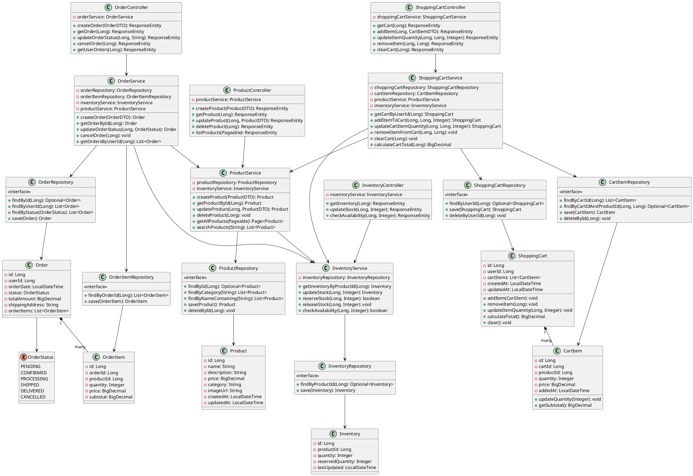

### 2.2 Entity Relationship Diagram

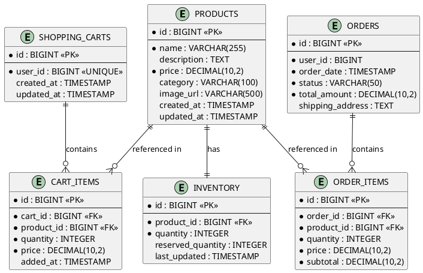

---

## 3. Sequence Diagrams

### 3.1 Create Product Flow

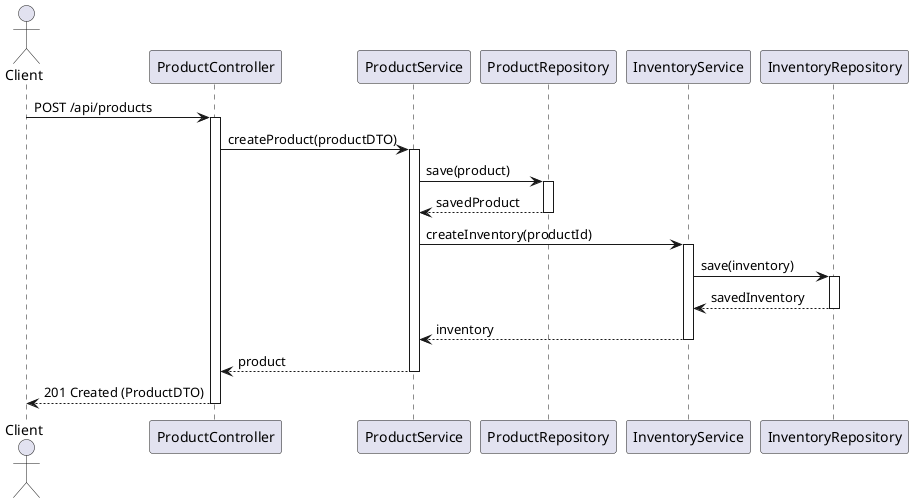

### 3.2 Get Product Flow

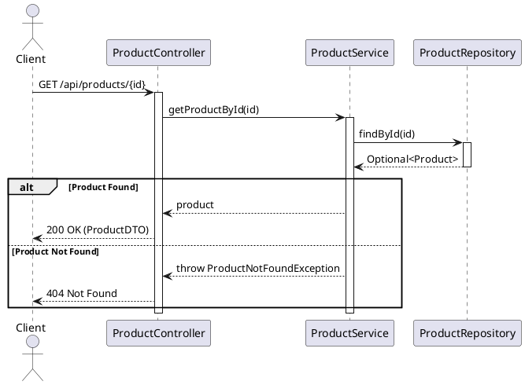

### 3.3 Update Inventory Flow

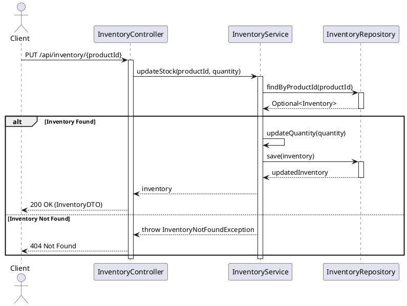

### 3.4 Create Order Flow

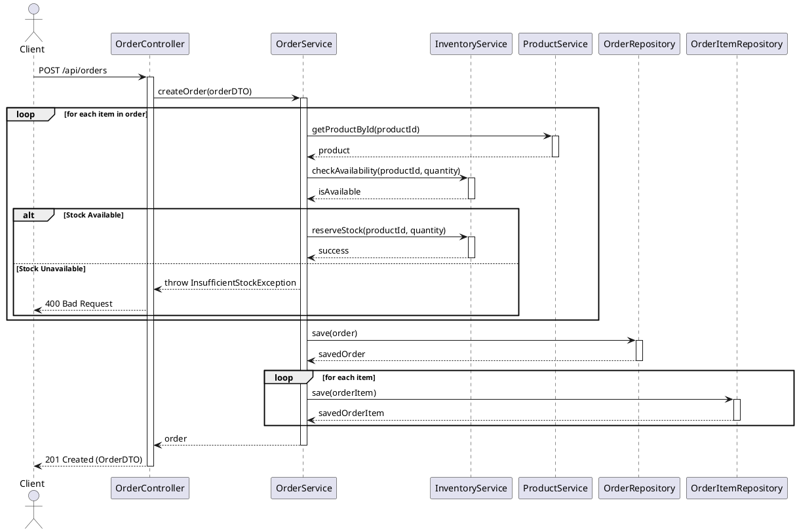

### 3.5 Cancel Order Flow

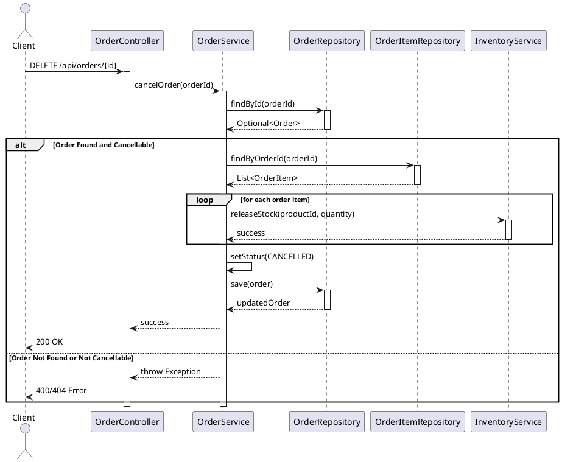

### 3.6 Search Products Flow

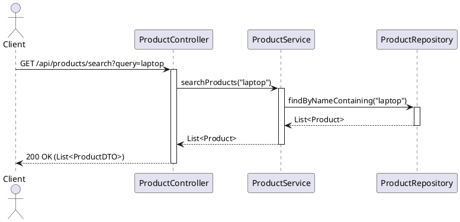

### 3.7 Check Stock Availability Flow

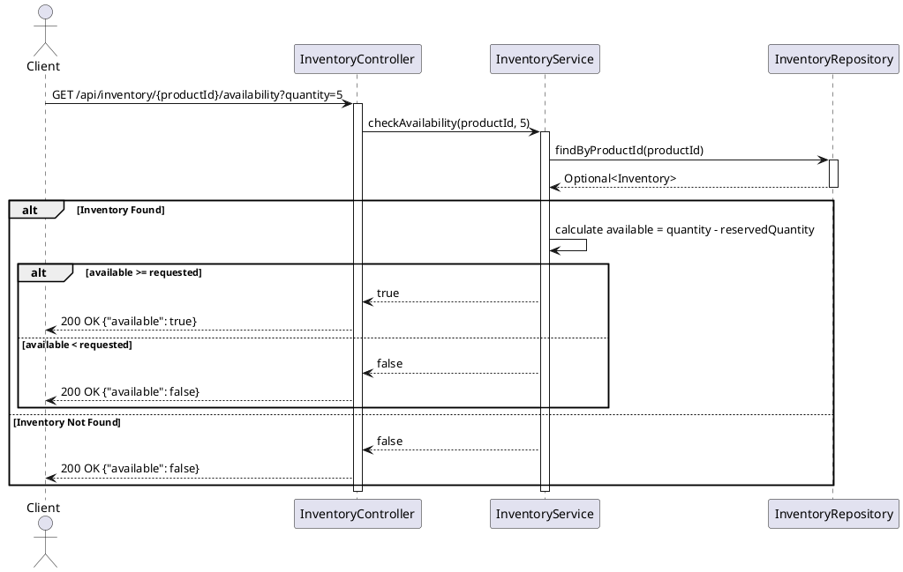

### 3.8 Add Item to Cart Flow

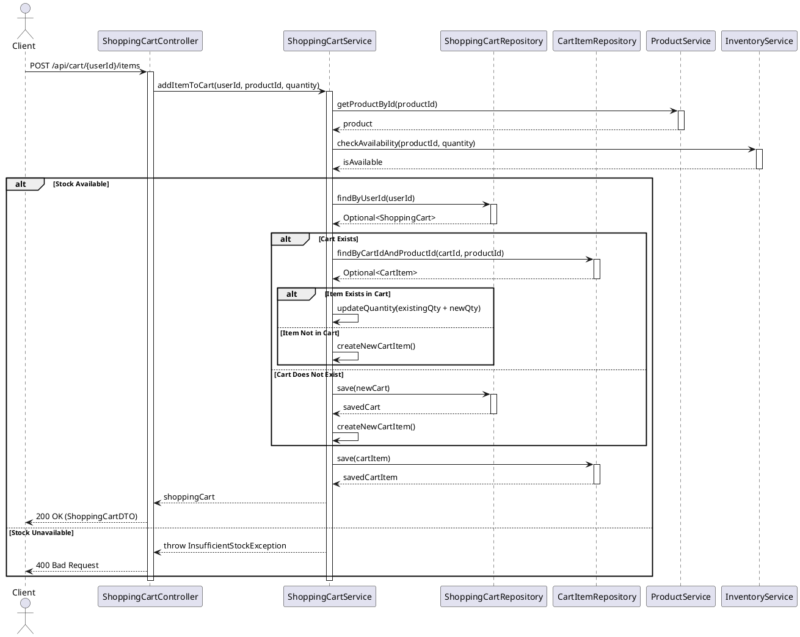

### 3.9 Update Cart Item Quantity Flow

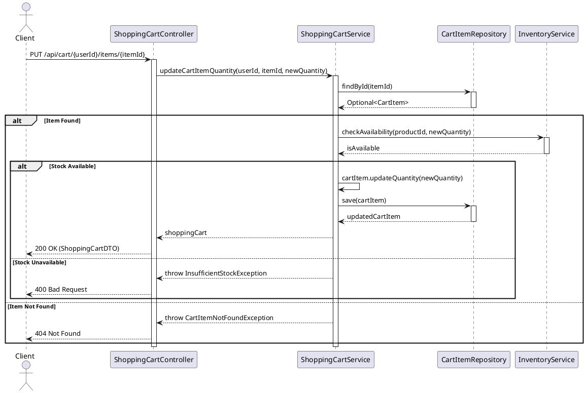

### 3.10 Remove Item from Cart Flow

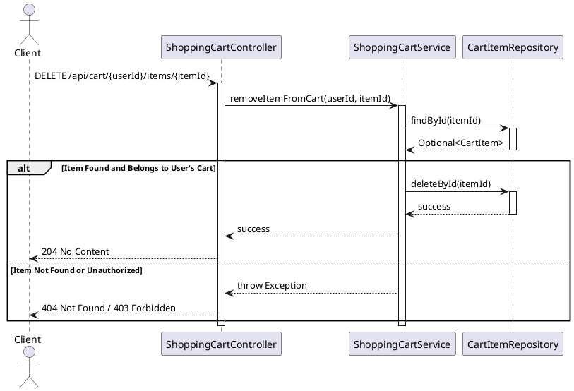

### 3.11 Get Shopping Cart Flow

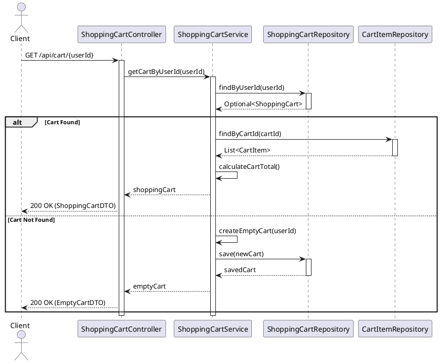

---

## 4. API Endpoints

### Product Management Endpoints

| Method | Endpoint | Description | Request Body | Response |
|--------|----------|-------------|--------------|----------|
| POST | `/api/products` | Create new product | ProductDTO | 201 Created |
| GET | `/api/products/{id}` | Get product by ID | - | 200 OK |
| PUT | `/api/products/{id}` | Update product | ProductDTO | 200 OK |
| DELETE | `/api/products/{id}` | Delete product | - | 204 No Content |
| GET | `/api/products` | List all products (paginated) | - | 200 OK |
| GET | `/api/products/search` | Search products | query param | 200 OK |

### Inventory Management Endpoints

| Method | Endpoint | Description | Request Body | Response |
|--------|----------|-------------|--------------|----------|
| GET | `/api/inventory/{productId}` | Get inventory for product | - | 200 OK |
| PUT | `/api/inventory/{productId}` | Update stock quantity | InventoryUpdateDTO | 200 OK |
| GET | `/api/inventory/{productId}/availability` | Check stock availability | quantity param | 200 OK |

### Order Management Endpoints

| Method | Endpoint | Description | Request Body | Response |
|--------|----------|-------------|--------------|----------|
| POST | `/api/orders` | Create new order | OrderDTO | 201 Created |
| GET | `/api/orders/{id}` | Get order by ID | - | 200 OK |
| PUT | `/api/orders/{id}/status` | Update order status | StatusUpdateDTO | 200 OK |
| DELETE | `/api/orders/{id}` | Cancel order | - | 200 OK |
| GET | `/api/orders/user/{userId}` | Get user's orders | - | 200 OK |

### Shopping Cart Management Endpoints

| Method | Endpoint | Description | Request Body | Response |
|--------|----------|-------------|--------------|----------|
| GET | `/api/cart/{userId}` | Get user's shopping cart | - | 200 OK |
| POST | `/api/cart/{userId}/items` | Add item to cart | CartItemDTO | 200 OK |
| PUT | `/api/cart/{userId}/items/{itemId}` | Update item quantity | QuantityUpdateDTO | 200 OK |
| DELETE | `/api/cart/{userId}/items/{itemId}` | Remove item from cart | - | 204 No Content |
| DELETE | `/api/cart/{userId}` | Clear entire cart | - | 204 No Content |

---

## 5. Database Schema

### Products Table
```sql
CREATE TABLE products (
    id BIGSERIAL PRIMARY KEY,
    name VARCHAR(255) NOT NULL,
    description TEXT,
    price DECIMAL(10, 2) NOT NULL,
    category VARCHAR(100),
    image_url VARCHAR(500),
    created_at TIMESTAMP DEFAULT CURRENT_TIMESTAMP,
    updated_at TIMESTAMP DEFAULT CURRENT_TIMESTAMP
);

CREATE INDEX idx_products_category ON products(category);
CREATE INDEX idx_products_name ON products(name);
```

### Inventory Table
```sql
CREATE TABLE inventory (
    id BIGSERIAL PRIMARY KEY,
    product_id BIGINT NOT NULL UNIQUE,
    quantity INTEGER NOT NULL DEFAULT 0,
    reserved_quantity INTEGER NOT NULL DEFAULT 0,
    last_updated TIMESTAMP DEFAULT CURRENT_TIMESTAMP,
    FOREIGN KEY (product_id) REFERENCES products(id) ON DELETE CASCADE
);

CREATE INDEX idx_inventory_product_id ON inventory(product_id);
```

### Orders Table
```sql
CREATE TABLE orders (
    id BIGSERIAL PRIMARY KEY,
    user_id BIGINT NOT NULL,
    order_date TIMESTAMP DEFAULT CURRENT_TIMESTAMP,
    status VARCHAR(50) NOT NULL,
    total_amount DECIMAL(10, 2) NOT NULL,
    shipping_address TEXT NOT NULL
);

CREATE INDEX idx_orders_user_id ON orders(user_id);
CREATE INDEX idx_orders_status ON orders(status);
```

### Order Items Table
```sql
CREATE TABLE order_items (
    id BIGSERIAL PRIMARY KEY,
    order_id BIGINT NOT NULL,
    product_id BIGINT NOT NULL,
    quantity INTEGER NOT NULL,
    price DECIMAL(10, 2) NOT NULL,
    subtotal DECIMAL(10, 2) NOT NULL,
    FOREIGN KEY (order_id) REFERENCES orders(id) ON DELETE CASCADE,
    FOREIGN KEY (product_id) REFERENCES products(id)
);

CREATE INDEX idx_order_items_order_id ON order_items(order_id);
```

### Shopping Carts Table
```sql
CREATE TABLE shopping_carts (
    id BIGSERIAL PRIMARY KEY,
    user_id BIGINT NOT NULL UNIQUE,
    created_at TIMESTAMP DEFAULT CURRENT_TIMESTAMP,
    updated_at TIMESTAMP DEFAULT CURRENT_TIMESTAMP
);

CREATE INDEX idx_shopping_carts_user_id ON shopping_carts(user_id);
```

### Cart Items Table
```sql
CREATE TABLE cart_items (
    id BIGSERIAL PRIMARY KEY,
    cart_id BIGINT NOT NULL,
    product_id BIGINT NOT NULL,
    quantity INTEGER NOT NULL,
    price DECIMAL(10, 2) NOT NULL,
    added_at TIMESTAMP DEFAULT CURRENT_TIMESTAMP,
    FOREIGN KEY (cart_id) REFERENCES shopping_carts(id) ON DELETE CASCADE,
    FOREIGN KEY (product_id) REFERENCES products(id),
    UNIQUE(cart_id, product_id)
);

CREATE INDEX idx_cart_items_cart_id ON cart_items(cart_id);
CREATE INDEX idx_cart_items_product_id ON cart_items(product_id);
```

---

## 6. Data Transfer Objects (DTOs)

### ProductDTO
```java
public class ProductDTO {
    private Long id;
    private String name;
    private String description;
    private BigDecimal price;
    private String category;
    private String imageUrl;
    private Integer availableQuantity;
}
```

### OrderDTO
```java
public class OrderDTO {
    private Long id;
    private Long userId;
    private LocalDateTime orderDate;
    private String status;
    private BigDecimal totalAmount;
    private String shippingAddress;
    private List<OrderItemDTO> items;
}
```

### OrderItemDTO
```java
public class OrderItemDTO {
    private Long productId;
    private String productName;
    private Integer quantity;
    private BigDecimal price;
    private BigDecimal subtotal;
}
```

### InventoryDTO
```java
public class InventoryDTO {
    private Long productId;
    private Integer quantity;
    private Integer reservedQuantity;
    private Integer availableQuantity;
    private LocalDateTime lastUpdated;
}
```

---

## 7. Design Patterns Used

### 7.1 Layered Architecture
- **Controller Layer**: Handles HTTP requests and responses
- **Service Layer**: Contains business logic
- **Repository Layer**: Manages data persistence
- **Entity Layer**: Represents database tables

### 7.2 Repository Pattern
- Abstracts data access logic
- Provides a collection-like interface for accessing domain objects
- Implemented using Spring Data JPA

### 7.3 Service Pattern
- Encapsulates business logic
- Coordinates between controllers and repositories
- Handles transaction management

### 7.4 DTO Pattern
- Separates internal domain models from external API contracts
- Reduces coupling between layers
- Provides data validation and transformation

### 7.5 Dependency Injection
- Uses Spring's IoC container
- Promotes loose coupling
- Facilitates testing through mock injection

### 7.6 Aggregate Pattern
- ShoppingCart acts as an aggregate root managing CartItems
- Ensures consistency boundaries within the cart domain
- All cart item modifications go through the ShoppingCart aggregate
- Maintains invariants such as quantity validation and total calculation

---

## 8. Key Implementation Details

### 8.1 Transaction Management
- Use `@Transactional` annotation for methods that modify data
- Order creation and inventory updates must be atomic
- Rollback on any failure during order processing

### 8.2 Inventory Reservation
- When order is created, stock is reserved (not immediately deducted)
- Reserved quantity is tracked separately
- Stock is released if order is cancelled
- Actual deduction happens when order is confirmed

### 8.3 Error Handling
- Custom exceptions for domain-specific errors
- Global exception handler using `@ControllerAdvice`
- Proper HTTP status codes for different error scenarios

### 8.4 Validation
- Input validation using Bean Validation annotations
- Business rule validation in service layer
- Database constraints for data integrity

### 8.5 Pagination
- Use Spring Data's `Pageable` interface
- Default page size: 20 items
- Support for sorting by multiple fields

### 8.6 Key Features

#### Product Management
- CRUD operations for products
- Category-based filtering
- Search functionality
- Image URL storage

#### Inventory Management
- Real-time stock tracking
- Reserved quantity management
- Stock availability checks
- Automatic inventory updates

#### Order Management
- Order creation with multiple items
- Order status tracking
- Order cancellation with stock release
- User order history

#### Shopping Cart Management
- Persistent shopping carts per user
- Add/update/remove cart items
- Real-time cart total calculation
- Stock availability validation before adding items
- Automatic cart creation for new users
- Cart item quantity management with inventory checks

---

## 9. Security Considerations

### 9.1 Authentication
- JWT-based authentication
- Token validation on protected endpoints
- User identity verification

### 9.2 Authorization
- Role-based access control
- Users can only access their own orders
- Admin role for product and inventory management

### 9.3 Data Validation
- Input sanitization
- SQL injection prevention through parameterized queries
- XSS prevention in API responses

---

## 10. Performance Optimization

### 10.1 Database Indexing
- Indexes on frequently queried columns
- Composite indexes for multi-column queries
- Regular index maintenance

### 10.2 Caching Strategy
- Cache frequently accessed products
- Cache inventory data with short TTL
- Invalidate cache on updates

### 10.3 Query Optimization
- Use pagination for large result sets
- Avoid N+1 query problems
- Use appropriate fetch strategies

---

## 11. Testing Strategy

### 11.1 Unit Tests
- Test service layer business logic
- Mock repository dependencies
- Test edge cases and error scenarios

### 11.2 Integration Tests
- Test controller endpoints
- Test database interactions
- Test transaction management

### 11.3 Test Coverage Goals
- Minimum 80% code coverage
- 100% coverage for critical business logic
- All API endpoints tested

---

## 12. Deployment Considerations

### 12.1 Environment Configuration
- Separate configurations for dev, staging, and production
- Externalized configuration using environment variables
- Secure storage of sensitive credentials

### 12.2 Database Migration
- Use Flyway or Liquibase for version control
- Automated migration on deployment
- Rollback scripts for each migration

### 12.3 Monitoring and Logging
- Structured logging using SLF4J
- Application metrics using Micrometer
- Health check endpoints
- Error tracking and alerting

---

## 13. Future Enhancements

### 13.1 Planned Features
- Product reviews and ratings
- Wishlist functionality
- Advanced search with filters
- Recommendation engine
- Multi-warehouse inventory support

### 13.2 Scalability Improvements
- Microservices architecture
- Event-driven communication
- Distributed caching
- Database sharding

---

## 14. Appendix

### 14.1 Glossary
- **SKU**: Stock Keeping Unit
- **DTO**: Data Transfer Object
- **JPA**: Java Persistence API
- **REST**: Representational State Transfer

### 14.2 References
- Spring Boot Documentation
- Spring Data JPA Documentation
- PostgreSQL Documentation
- RESTful API Design Best Practices

---

**Document Version**: 1.1  
**Last Updated**: 2024  
**Author**: Development Team  
**Status**: Approved
