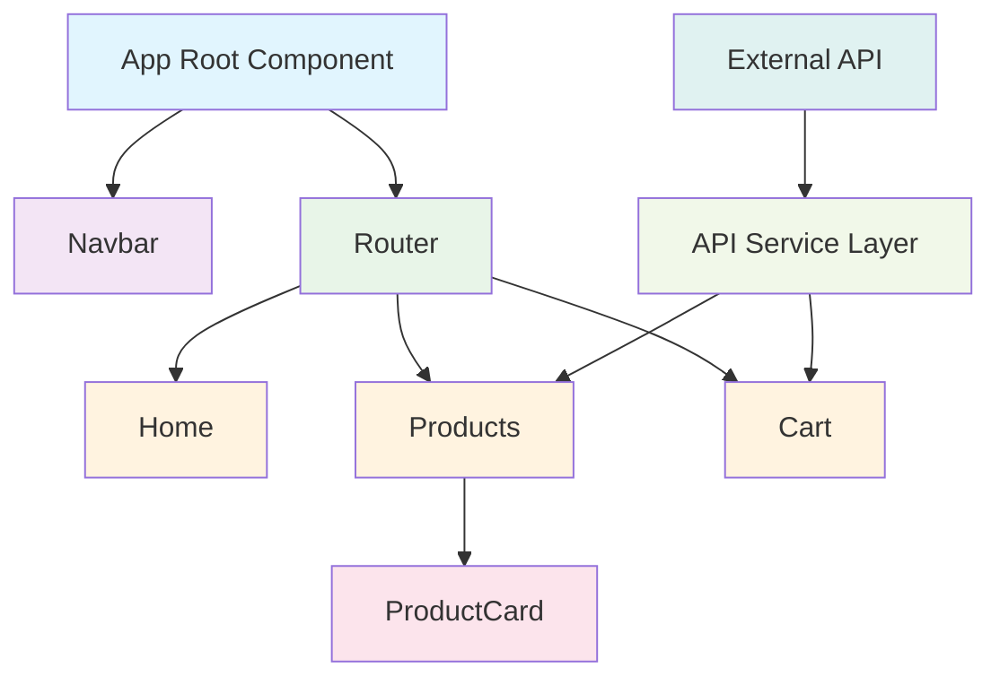

# Frontend Low-Level Design (LLD) Document

## Project: aava-ecom-demo-frontend

**Version:** 1.0  
**Date:** 2024  
**Repository:** NavneetBN47/aava-ecom-demo  
**Branch:** devtest2  

---

## 1. System Overview

### 1.1 Project Description
The aava-ecom-demo-frontend is a React-based e-commerce Single Page Application (SPA) that provides a modern, responsive user interface for online shopping. The application implements a component-based architecture using React with Create React App, focusing on product browsing, cart management, and user navigation.

### 1.2 Technical Stack
- **Framework:** React (JavaScript)
- **Build Tool:** Create React App
- **Language:** JavaScript (ES6+)
- **Routing:** react-router-dom
- **State Management:** React State (useState hooks)
- **HTTP Client:** Axios
- **Styling:** Component-scoped CSS
- **Entry Point:** src/index.js

### 1.3 Architecture Type
Component-Based Single Page Application (SPA) with Client-Side Rendering (CSR)

### 1.4 Major Dependencies
- react
- react-dom
- react-router-dom
- axios
- react-scripts

---

## 2. Architecture Design

### 2.1 High-Level Architecture
The application follows a layered architecture pattern:

1. **Presentation Layer:** React components with individual CSS styling
2. **Service Layer:** Centralized API communication via services/api.js
3. **Routing Layer:** react-router-dom for navigation management
4. **State Layer:** Local component state using React hooks

### 2.2 Architecture Diagram



### 2.3 Component Classification
- **Container Components:** App, Products, Cart
- **Presentational Components:** ProductCard, Navbar
- **Page Components:** Home
- **Layout Components:** Navbar (persistent across routes)

---

## 3. Component Specifications

### 3.1 Component Hierarchy
```
App (Root Container)
├── Navbar (Navigation Component)
├── Router Switch
    ├── Home (Landing Page Component)
    ├── Products (Product Listing Container)
    │   └── ProductCard[] (Product Item Components)
    └── Cart (Shopping Cart Container)
```

### 3.2 Detailed Component Specifications

#### 3.2.1 Navbar Component
- **Type:** Functional Component
- **Props:** []
- **State Variables:** []
- **Hooks Used:** [useNavigate]
- **Child Components:** []
- **API Calls:** []
- **Event Handlers:** [handleNavigation]
- **Purpose:** Persistent navigation across all routes

#### 3.2.2 Home Component
- **Type:** Functional Component
- **Props:** []
- **State Variables:** [featuredProducts]
- **Hooks Used:** [useState, useEffect]
- **Child Components:** []
- **API Calls:** []
- **Event Handlers:** [handleViewProducts]
- **Purpose:** Landing page with featured products display

#### 3.2.3 Products Component
- **Type:** Functional Component
- **Props:** []
- **State Variables:** [products, loading, filters, searchTerm]
- **Hooks Used:** [useState, useEffect]
- **Child Components:** [ProductCard]
- **API Calls:** [getProducts]
- **Event Handlers:** [handleSearch, handleFilter, handleSort]
- **Purpose:** Product catalog with search and filter functionality

#### 3.2.4 ProductCard Component
- **Type:** Functional Component
- **Props:** [product, onAddToCart]
- **State Variables:** []
- **Hooks Used:** []
- **Child Components:** []
- **API Calls:** []
- **Event Handlers:** [handleAddToCart, handleViewDetails]
- **Purpose:** Individual product display with add to cart functionality

#### 3.2.5 Cart Component
- **Type:** Functional Component
- **Props:** []
- **State Variables:** [cartItems, total, quantity]
- **Hooks Used:** [useState, useEffect]
- **Child Components:** []
- **API Calls:** [getCart, addToCart, updateCartItem, removeFromCart]
- **Event Handlers:** [handleUpdateQuantity, handleRemoveItem, handleCheckout]
- **Purpose:** Shopping cart management with CRUD operations

---

## 4. Data Flow and State Management

### 4.1 State Management Strategy
- **Pattern:** Local component state using React useState hooks
- **State Distribution:** Component-specific state with prop drilling for shared data
- **Global State:** Not implemented (no Redux/Context API)
- **State Lifting:** Shared state managed at common ancestor level

### 4.2 Data Flow Patterns
- **Unidirectional Data Flow:** Parent-to-child prop passing
- **Event Bubbling:** Child-to-parent communication via callback props
- **State Updates:** Triggered by user interactions and API responses

### 4.3 State Flow Summary
Local component state using useState hooks with props drilling for shared state between components. Cart state likely managed at App level and passed down to child components.

### 4.4 API Flow
Centralized API service layer using axios for HTTP requests. API calls flow from components to services/api.js module, handling product fetching, cart operations, and data persistence.

---

## 5. API Integration and Services

### 5.1 Service Layer Architecture
- **HTTP Client:** Axios
- **Service Module:** services/api.js
- **Request Pattern:** Promise-based async operations
- **Error Handling:** Centralized error management in service layer

### 5.2 API Integration Pattern
```
Component → Service Layer (api.js) → External API → Response Processing → Component State Update
```

### 5.3 API Endpoints (Inferred)
- **GET /products** - Fetch product catalog
- **GET /cart** - Retrieve cart items
- **POST /cart** - Add item to cart
- **PUT /cart/:id** - Update cart item
- **DELETE /cart/:id** - Remove item from cart

### 5.4 Service Methods
- **getProducts()** - Fetch product data
- **getCart()** - Retrieve cart contents
- **addToCart()** - Add product to cart
- **updateCartItem()** - Modify cart item quantity
- **removeFromCart()** - Remove item from cart

---

## 6. Routing and Navigation

### 6.1 Routing Configuration
- **Library:** react-router-dom
- **Strategy:** Browser History API integration
- **Route Protection:** No authentication guards (public routes)

### 6.2 Route Mapping
| Route | Component | Description |
|-------|-----------|-------------|
| / | Home | Landing page with featured products |
| /products | Products | Product catalog with search/filter |
| /cart | Cart | Shopping cart management |

### 6.3 Navigation Pattern
- **Declarative Routing:** Route components with path matching
- **Navigation Method:** useNavigate hook for programmatic navigation
- **Route Transitions:** Client-side routing without page refresh

---

## 7. Styling and UI Architecture

### 7.1 Styling Strategy
- **Approach:** Component-scoped CSS files
- **Naming Convention:** Component.css pattern
- **Organization:** Co-located styles with components
- **Framework:** Custom CSS implementation (no UI framework)

### 7.2 CSS File Structure
```
components/
├── Cart.css
├── Home.css
├── Navbar.css
├── ProductCard.css
└── Products.css
```

### 7.3 Responsive Design
- **Strategy:** CSS media queries for responsive behavior
- **Breakpoints:** Standard mobile-first approach
- **Layout:** Flexible grid and flexbox layouts

---

## 8. Build and Deployment Configuration

### 8.1 Build Configuration
- **Build Tool:** Webpack (via react-scripts)
- **Development Server:** Create React App dev server
- **Production Build:** Optimized bundle with code splitting
- **Asset Management:** Public folder for static assets

### 8.2 File Structure
```
frontend/
├── public/
│   └── index.html
├── src/
│   ├── components/
│   │   ├── Cart.js + Cart.css
│   │   ├── Home.js + Home.css
│   │   ├── Navbar.js + Navbar.css
│   │   ├── ProductCard.js + ProductCard.css
│   │   └── Products.js + Products.css
│   ├── services/
│   │   └── api.js
│   ├── App.js
│   └── index.js
└── package.json
```

### 8.3 Build Optimization
- **Code Splitting:** Route-based splitting potential
- **Bundle Optimization:** Tree shaking via Webpack
- **Asset Optimization:** Image and static asset compression
- **Caching Strategy:** Browser caching for static assets

---

## 9. Performance and Security Considerations

### 9.1 Performance Optimization
- **Rendering:** Client-Side Rendering (CSR)
- **Bundle Size:** Minimized through tree shaking
- **Code Splitting:** Potential for route-based splitting
- **Caching:** Browser caching for static assets
- **Hot Reloading:** Fast development iteration

### 9.2 Security Measures
- **XSS Protection:** React's built-in XSS prevention
- **Input Validation:** Client-side form validation
- **HTTPS Enforcement:** Production deployment consideration
- **API Security:** Token-based authentication (if implemented)

### 9.3 Error Handling
- **Component Error Boundaries:** React error boundary implementation
- **API Error Handling:** Centralized error processing in services
- **User Feedback:** Error state management in components
- **Graceful Degradation:** Fallback UI states

---

## 10. Development and Maintenance Guidelines

### 10.1 Development Workflow
- **Hot Reloading:** Fast development iteration
- **ES6+ Features:** Modern JavaScript syntax
- **Component Development:** Isolated component development
- **Debugging Tools:** React DevTools integration

### 10.2 Code Organization Principles
- **Modular Design:** Component-based architecture
- **Separation of Concerns:** Clear separation between UI, logic, and services
- **Reusability:** Reusable component patterns
- **Maintainability:** Clear file structure and naming conventions

### 10.3 Testing Strategy Foundation
- **Component Testing:** Jest + React Testing Library compatibility
- **Unit Testing:** Individual component testing capability
- **Integration Testing:** Component interaction testing
- **E2E Testing:** Full user flow testing potential

### 10.4 Scalability Considerations
- **Component Reusability:** Modular component design
- **State Management Evolution:** Easy migration to Redux/Context API
- **Route Expansion:** Scalable routing structure
- **API Layer Abstraction:** Service layer ready for expansion

### 10.5 Future Enhancement Opportunities
- **State Management:** Migration to Redux or Context API for complex state
- **TypeScript Integration:** Type safety implementation
- **UI Framework:** Integration with Material-UI or similar
- **Testing Suite:** Comprehensive test coverage implementation
- **Performance Monitoring:** Real-time performance tracking
- **PWA Features:** Progressive Web App capabilities

---

**Document Status:** Production Ready  
**Last Updated:** 2024  
**Review Cycle:** Quarterly  
**Maintained By:** Frontend Development Team